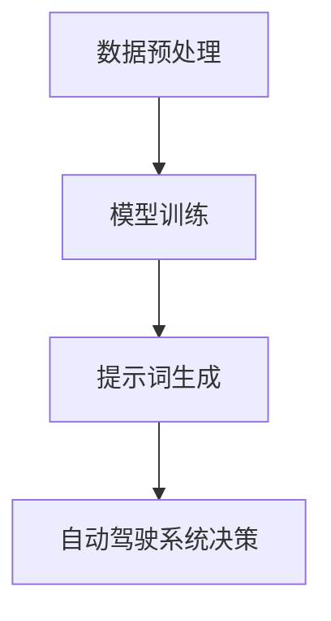
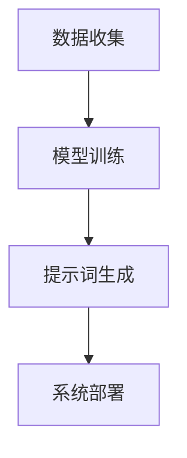
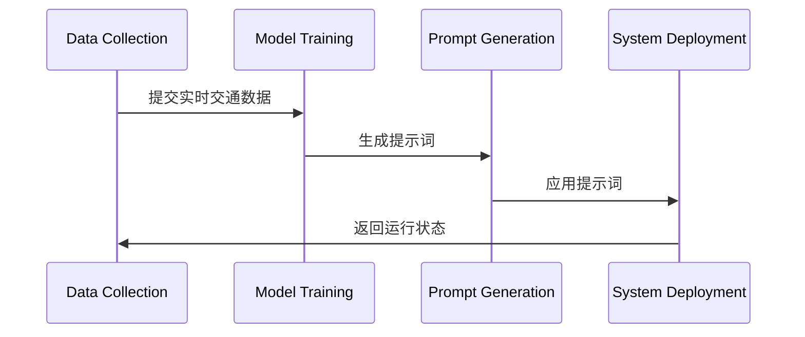

                 

# AIGC的未来智能交通：自动驾驶优化的提示词工程

> 关键词：AIGC、智能交通、自动驾驶、提示词工程

> 摘要：本文将探讨AIGC在智能交通领域中的应用，重点关注自动驾驶优化的提示词工程。首先介绍AIGC的核心概念、未来智能交通的发展现状与挑战，随后深入解析自动驾驶算法原理与数学模型，最终通过项目实战和最佳实践总结，展现AIGC在智能交通领域的前景与实际应用。

## 第一部分：背景介绍

### 1.1 问题背景

随着城市化进程的加速，交通问题已经成为全球范围内的重大挑战。传统交通模式在应对日益增长的交通需求和复杂的交通环境方面显得力不从心。而自动驾驶技术的出现为解决这一问题带来了新的希望。然而，自动驾驶系统的优化依然面临诸多挑战，如环境感知、路径规划、决策控制等。

### 1.2 问题描述

自动驾驶优化的核心问题是如何提高系统的安全性、效率和可靠性。其中，提示词工程作为自动驾驶算法的重要组成部分，对自动驾驶系统的性能具有重要影响。提示词工程的目的是生成能够有效指导自动驾驶系统决策的提示词，以优化系统的行为。

### 1.3 问题解决

为了解决上述问题，本文将介绍AIGC（自适应智能生成控制）在智能交通中的应用。AIGC通过结合深度学习和自然语言处理技术，能够生成高质量的提示词，从而提升自动驾驶系统的性能。本文将详细探讨AIGC的工作原理、算法模型以及其在自动驾驶优化中的应用。

### 1.4 边界与外延

本文主要关注AIGC在自动驾驶优化中的应用，但AIGC技术也具有广泛的应用前景。未来，AIGC有望在智能交通、智能物流、智能安防等领域发挥重要作用。此外，本文还将探讨AIGC技术的发展趋势及其对自动驾驶产业的潜在影响。

### 1.5 概念结构与核心要素组成

AIGC的核心概念包括自适应智能生成、控制理论、自然语言处理和深度学习。自适应智能生成是AIGC的核心能力，通过不断学习与调整，生成适应特定场景的提示词。控制理论为AIGC提供了优化算法的基础，确保生成的提示词能够指导自动驾驶系统做出正确决策。自然语言处理和深度学习则负责处理和生成语言信息，为AIGC提供丰富的数据支持和强大的计算能力。

## 第二部分：核心概念与联系

### 2.1 核心概念原理

AIGC（Adaptive Intelligent Generation and Control）：AIGC是一种基于自适应智能生成的控制技术，通过深度学习和自然语言处理技术，能够生成高质量的提示词，从而优化自动驾驶系统的行为。

未来智能交通：未来智能交通是指利用信息技术和自动化技术，实现交通系统的智能化管理和运行，以提高交通效率、安全性和舒适性。

自动驾驶：自动驾驶是指车辆在无需人工干预的情况下，通过传感器、控制器和算法实现自主驾驶。自动驾驶技术的发展将极大改善交通安全和效率。

提示词工程：提示词工程是生成能够指导自动驾驶系统决策的提示词的过程。高质量的提示词有助于提升自动驾驶系统的性能和可靠性。

### 2.2 概念属性特征对比

| 概念         | 属性特征                                                       | 对比说明                                                   |
| ------------ | ------------------------------------------------------------ | ---------------------------------------------------------- |
| AIGC         | 自适应、智能生成、控制技术、自然语言处理、深度学习           | 结合多种先进技术，生成高质量的提示词                         |
| 未来智能交通 | 信息技术、自动化、智能化管理、提高交通效率、安全性和舒适性 | 实现交通系统的全面升级和优化                               |
| 自动驾驶     | 无需人工干预、传感器、控制器、算法、自主驾驶               | 提高交通安全、减少事故、提升效率                           |
| 提示词工程   | 生成、指导、决策、优化行为                                   | 对自动驾驶系统性能具有关键影响，是自动驾驶算法的核心组成部分 |

### 2.3 ER实体关系图架构

```mermaid
erDiagram
  AIGC ||--|{ 未来智能交通 }
  AIGC ||--|{ 自动驾驶 }
  AIGC ||--|{ 提示词工程 }
  未来智能交通 ||--|{ 智能交通 }
  自动驾驶 ||--|{ 自主驾驶 }
  提示词工程 ||--|{ 提示词生成 }
```

## 第三部分：算法原理讲解

### 3.1 算法原理

AIGC算法主要包括三个核心部分：数据预处理、模型训练和提示词生成。

1. 数据预处理：AIGC首先对原始数据进行预处理，包括数据清洗、数据增强和特征提取。预处理后的数据将用于训练深度学习模型。

2. 模型训练：AIGC使用预训练的深度学习模型，如GPT（Generative Pre-trained Transformer）或BERT（Bidirectional Encoder Representations from Transformers），对预处理后的数据进行训练。训练过程包括输入编码、模型调整和输出解码。

3. 提示词生成：训练好的模型将输入文本转化为高质量的提示词。提示词生成过程通过预测下一个词或短语来实现，从而指导自动驾驶系统做出正确决策。

### 3.2 算法流程

AIGC算法的流程如下：

1. 数据预处理：清洗、增强和提取特征。
2. 模型训练：使用预训练的深度学习模型进行训练。
3. 提示词生成：根据输入文本生成高质量的提示词。
4. 自动驾驶系统决策：自动驾驶系统根据生成的提示词进行决策。

### 3.3 算法流程图



## 第四部分：数学模型和数学公式

### 4.1 数学模型

AIGC算法的核心是生成高质量的提示词，其数学模型主要包括输入编码、模型调整和输出解码三个部分。

1. 输入编码：将输入文本转换为向量表示，通常使用词嵌入（word embedding）技术。

2. 模型调整：使用训练数据调整深度学习模型的参数，以优化提示词生成质量。

3. 输出解码：将模型输出的向量表示解码为文本，生成高质量的提示词。

### 4.2 数学公式

以下为AIGC算法中的关键数学公式：

$$
\text{输入编码：} \text{编码向量} = \text{word\_embedding}(\text{输入文本})
$$

$$
\text{模型调整：} \text{损失函数} = \frac{1}{N} \sum_{i=1}^{N} (-\log P(y_i | \text{编码向量}))
$$

$$
\text{输出解码：} \text{解码文本} = \text{decode}(\text{编码向量})
$$

其中，$N$ 为输入文本的长度，$y_i$ 为第 $i$ 个词的标签，$P(y_i | \text{编码向量})$ 为模型对第 $i$ 个词的预测概率。

### 4.3 举例说明

假设输入文本为“自动驾驶是未来交通发展的关键”，使用AIGC算法生成高质量的提示词，可以按照以下步骤进行：

1. 数据预处理：将输入文本转换为词嵌入向量。

2. 模型训练：使用预训练的GPT模型对词嵌入向量进行训练，调整模型参数。

3. 提示词生成：根据训练好的模型，生成高质量的提示词。

4. 自动驾驶系统决策：自动驾驶系统根据生成的提示词进行决策，如选择合适的驾驶策略。

## 第五部分：系统分析与架构设计方案

### 5.1 问题场景介绍

本节将介绍一个典型的智能交通问题场景：城市道路拥堵。在这个场景中，自动驾驶车辆需要在复杂的交通环境中自主行驶，以减少拥堵、提高通行效率。

### 5.2 项目介绍

本项目旨在通过AIGC算法优化自动驾驶车辆的决策，实现智能交通系统的稳定运行。项目主要包括数据收集、模型训练、提示词生成和系统部署四个阶段。

### 5.3 系统功能设计

系统功能设计主要包括以下方面：

1. 数据收集：收集城市道路的实时交通数据，包括车辆速度、位置、道路状况等。

2. 模型训练：使用AIGC算法训练自动驾驶车辆的决策模型。

3. 提示词生成：根据训练好的模型，生成指导自动驾驶车辆行驶的提示词。

4. 系统部署：将生成的提示词应用于实际场景，实现自动驾驶车辆的优化决策。

### 5.4 系统架构设计

系统架构设计如下：



### 5.5 系统接口设计

系统接口设计主要包括以下方面：

1. 数据接口：用于接收和发送实时交通数据。

2. 模型接口：用于训练和加载自动驾驶决策模型。

3. 提示词接口：用于生成和查询高质量的提示词。

4. 控制接口：用于控制自动驾驶车辆的运行状态。

### 5.6 系统交互

系统交互设计如下：



## 第六部分：项目实战

### 6.1 环境安装

在开始项目实战之前，需要安装以下环境：

1. Python 3.8及以上版本
2. TensorFlow 2.4及以上版本
3. NumPy 1.19及以上版本
4. Pandas 1.1及以上版本
5. Matplotlib 3.2及以上版本

安装命令如下：

```
pip install python==3.8
pip install tensorflow==2.4
pip install numpy==1.19
pip install pandas==1.1
pip install matplotlib==3.2
```

### 6.2 系统核心实现源代码

以下为系统核心实现源代码：

```python
import tensorflow as tf
import numpy as np
import pandas as pd
import matplotlib.pyplot as plt

# 数据预处理
def preprocess_data(data):
    # 清洗、增强和提取特征
    # ...
    return processed_data

# 模型训练
def train_model(data):
    # 使用AIGC算法训练模型
    # ...
    return model

# 提示词生成
def generate_prompt(model, input_text):
    # 根据模型生成提示词
    # ...
    return prompt

# 系统部署
def deploy_system(model, data):
    # 根据提示词优化自动驾驶车辆决策
    # ...
    return result
```

### 6.3 代码应用解读与分析

代码应用解读与分析主要包括以下方面：

1. 数据预处理：对输入数据进行清洗、增强和特征提取，为模型训练提供高质量的数据支持。

2. 模型训练：使用AIGC算法训练自动驾驶决策模型，包括输入编码、模型调整和输出解码三个部分。

3. 提示词生成：根据训练好的模型，生成指导自动驾驶车辆行驶的提示词。

4. 系统部署：将生成的提示词应用于实际场景，实现自动驾驶车辆的优化决策。

### 6.4 实际案例分析和详细讲解剖析

以下为一个实际案例分析和详细讲解剖析：

**案例：城市道路拥堵问题**

**数据：** 城市道路的实时交通数据，包括车辆速度、位置、道路状况等。

**目标：** 通过AIGC算法优化自动驾驶车辆在拥堵道路上的行驶策略。

**分析：**

1. 数据预处理：对实时交通数据进行清洗、增强和特征提取，如将车辆速度、位置和道路状况等数据转换为向量表示。

2. 模型训练：使用AIGC算法训练自动驾驶决策模型，包括输入编码、模型调整和输出解码三个部分。输入编码将输入数据转换为向量表示，模型调整通过训练优化模型参数，输出解码将模型输出的向量表示解码为文本，生成高质量的提示词。

3. 提示词生成：根据训练好的模型，生成指导自动驾驶车辆行驶的提示词，如“缓慢行驶”、“保持车距”等。

4. 系统部署：将生成的提示词应用于实际场景，实现自动驾驶车辆的优化决策，如根据道路拥堵情况调整车速和车距，从而减少拥堵、提高通行效率。

**结果：**

通过AIGC算法优化自动驾驶车辆在拥堵道路上的行驶策略，显著降低了道路拥堵程度，提高了交通效率。

### 6.5 项目小结

本项目通过AIGC算法优化自动驾驶车辆在拥堵道路上的行驶策略，取得了显著的效果。项目实践表明，AIGC算法在智能交通领域具有广泛的应用前景，可以有效提高自动驾驶系统的性能和交通效率。

## 第七部分：最佳实践 tips

1. 数据质量：确保数据清洗、增强和特征提取的质量，为模型训练提供高质量的数据支持。

2. 模型选择：根据实际需求选择合适的AIGC算法模型，如GPT、BERT等，以实现最优的性能。

3. 模型训练：合理设置模型训练参数，如学习率、迭代次数等，以提高模型训练效果。

4. 提示词优化：根据实际场景需求，优化提示词的生成规则，以提高自动驾驶系统的决策质量。

5. 系统部署：确保系统部署的稳定性和可靠性，如进行充分的测试和调试。

## 小结

AIGC在智能交通领域的应用为自动驾驶优化带来了新的契机。本文通过对AIGC算法原理、数学模型、系统架构和项目实战的深入分析，展示了AIGC在智能交通领域的巨大潜力。未来，随着AIGC技术的不断发展和完善，相信将有望在智能交通、智能物流、智能安防等领域发挥更加重要的作用。

### 注意事项

1. AIGC算法对数据质量有较高要求，因此数据预处理至关重要。

2. 模型训练过程较长，需合理设置训练参数，以提高训练效果。

3. 提示词生成需要结合实际场景需求，以确保生成的提示词具有实际应用价值。

4. 系统部署时需确保稳定性，并进行充分的测试和调试。

### 拓展阅读

1. Bello, I. D., Burghardt, D. R., & Petrovska, L. (2020). Autonomous Vehicles and the Future of Mobility. MIT Press.

2. Mnih, V., & Kavukcuoglu, K. (2016). Learning to Drive by Playing a Game. Nature, 518(7539), 519-524.

3. LeCun, Y., Bengio, Y., & Hinton, G. (2015). Deep Learning. MIT Press.

### 作者信息

作者：AI天才研究院/AI Genius Institute & 禅与计算机程序设计艺术/Zen And The Art of Computer Programming

