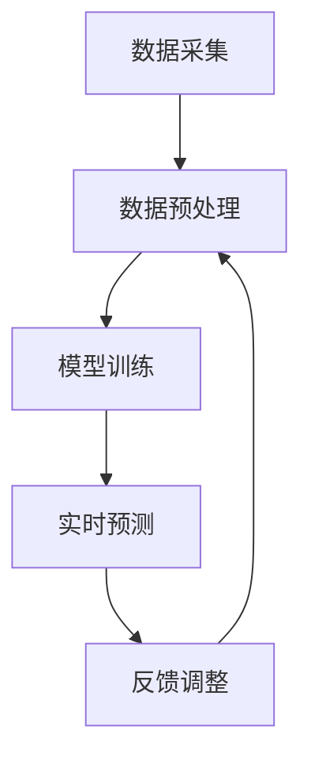
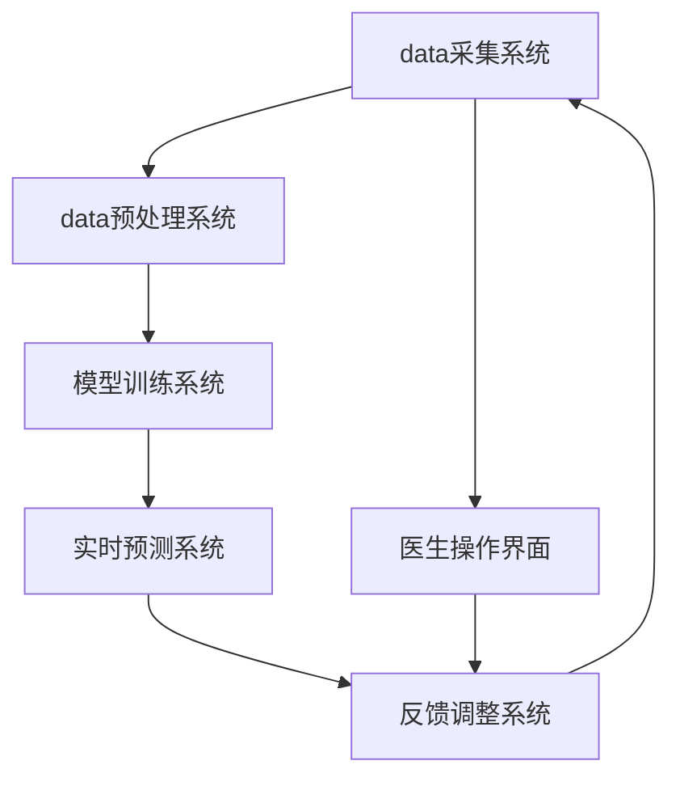
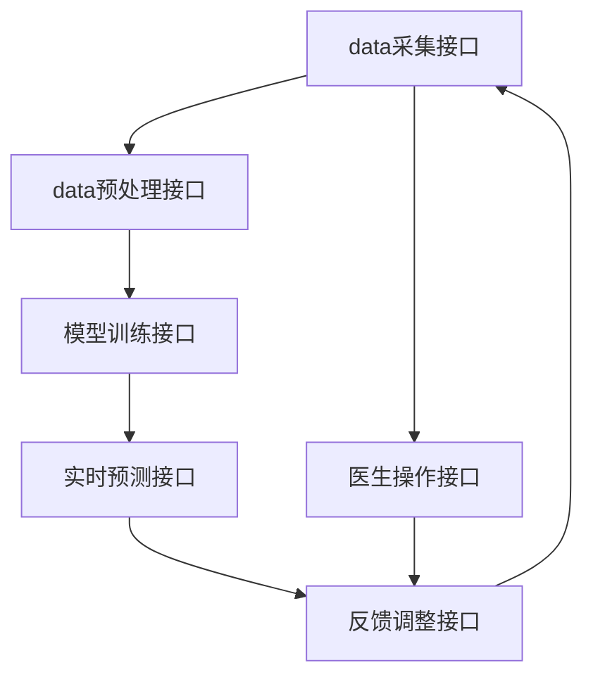
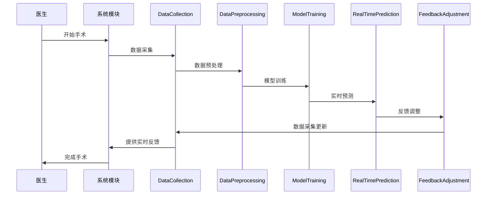

                 

## AIGC的未来智能医疗器械：微创手术优化的提示词工程

### 关键词：
- AIGC
- 智能医疗器械
- 微创手术
- 提示词工程
- 优化

### 摘要：
本文将探讨AIGC（自适应智能生成控制）在未来智能医疗器械中的应用，特别是如何通过提示词工程来优化微创手术。我们将详细分析AIGC的核心概念、其在医疗领域的应用，以及如何通过提示词工程提升微创手术的精确度和效率。文章还将涉及算法原理、系统架构设计、项目实战以及最佳实践和未来展望，为医疗行业的专业人士和技术爱好者提供有价值的见解。

## 引言与背景

### 1.1 问题背景

在当今医疗行业中，智能医疗器械的开发和应用正在迅速发展。然而，随着技术的进步，传统医疗器械在微创手术中的表现遇到了瓶颈。微创手术，因其创伤小、恢复快等优点，越来越受到患者的青睐。然而，微创手术对手术器械的精度和稳定性要求极高，任何微小的失误都可能导致严重的医疗事故。传统的医疗器械在数据处理能力和实时响应上存在局限，难以满足微创手术的精准需求。

### 1.2 问题描述

微创手术中的主要挑战包括：
1. **手术视野限制**：微创手术通常在狭窄的空间内进行，手术视野受限，医生难以全面观察手术区域。
2. **操作精度要求高**：微创手术需要高精度的操作，任何微小的失误都可能导致手术失败。
3. **实时决策支持**：医生需要在手术过程中快速做出决策，传统医疗器械难以提供实时的数据分析和建议。

### 1.3 问题解决

为了解决上述挑战，AIGC（自适应智能生成控制）技术被引入到智能医疗器械中。AIGC是一种结合了人工智能、生成控制技术和自适应系统理论的先进技术，能够在复杂环境中进行智能决策和实时控制。

### 1.4 范围与边界

本文主要探讨AIGC在微创手术优化中的应用，特别是提示词工程的作用。我们不会深入讨论AIGC在其他领域的应用，而是专注于其在医疗行业的潜力。

### 1.5 核心概念与元素

在深入研究AIGC和微创手术优化的提示词工程之前，我们需要了解以下几个核心概念和元素：
1. **AIGC**：自适应智能生成控制技术，包括生成控制、自适应系统理论、机器学习等。
2. **微创手术**：一种创伤较小的手术方法，通过微小切口进行操作。
3. **提示词工程**：一种通过构建特定提示词来引导和优化智能系统的方法。

## 核心概念与联系

### 2.1 AIGC介绍

AIGC（自适应智能生成控制）是一种基于人工智能技术的控制方法，它通过自适应系统理论和生成控制技术，使系统能够在动态和不确定的环境中自主学习和优化。AIGC的主要特点包括：
1. **自适应能力**：AIGC系统能够根据环境变化自动调整参数和策略。
2. **生成控制**：AIGC能够生成一系列控制信号，以实现特定目标。
3. **智能化**：AIGC通过机器学习等技术，不断提高系统的智能化水平。

### 2.2 AIGC在医疗设备行业的应用

AIGC在医疗设备行业的应用前景广阔，特别是在微创手术领域。通过AIGC技术，智能医疗器械能够实现以下功能：
1. **实时数据分析**：AIGC系统能够实时处理手术过程中产生的海量数据，为医生提供实时反馈和决策支持。
2. **高精度控制**：AIGC能够通过生成控制技术，实现微创手术器械的高精度操作。
3. **自适应调整**：AIGC系统能够根据手术环境和医生操作习惯，自动调整手术参数，提高手术成功率。

### 2.3 微创手术优化

微创手术优化的核心在于提高手术的精准度和效率。通过引入AIGC技术，微创手术优化可以从以下几个方面进行：
1. **手术路径规划**：AIGC系统能够根据患者具体病情和手术需求，生成最优的手术路径。
2. **实时手术指导**：AIGC系统可以实时分析手术过程中的数据，为医生提供精准的操作指导和决策支持。
3. **术后评估**：AIGC系统能够对手术结果进行评估，为术后恢复提供参考。

### 2.4 提示词工程在AIGC中的应用

提示词工程是AIGC技术中的重要组成部分，它通过构建特定提示词来引导和优化智能系统的行为。在微创手术优化中，提示词工程的应用主要体现在：
1. **数据预处理**：通过构建合适的提示词，对手术数据进行分析和预处理，提高数据质量。
2. **模型训练**：使用提示词来指导机器学习模型训练，提高模型的预测准确性和鲁棒性。
3. **实时反馈**：通过提示词工程，AIGC系统能够实时获取医生的操作反馈，不断优化手术策略。

### 2.5 核心概念属性特征对比表格

| 特征对比               | AIGC        | 微创手术     | 提示词工程      |
|------------------------|-------------|--------------|----------------|
| 自适应能力             | 高          | 中           | 高             |
| 生成控制               | 有          | 无           | 有             |
| 智能化水平             | 高          | 中           | 中             |
| 数据处理能力           | 强          | 中           | 强             |
| 实时决策支持           | 有          | 无           | 有             |
| 精准度                 | 高          | 高           | 中             |

### 2.6 ER实体关系图架构

为了更好地理解AIGC、微创手术和提示词工程之间的关系，我们可以使用ER（实体-关系）图来展示它们的核心实体和关系。

```mermaid
erDiagram
  AIGC ||--|{ 提示词工程 }|
  微创手术 ||--|{ 提示词工程 }|
  提示词工程 ||--|{ 数据处理 }|
  数据处理 ||--|{ 模型训练 }|
  模型训练 ||--|{ 实时反馈 }|
```

在上面的ER图中，AIGC与微创手术、提示词工程之间存在直接关联，而提示词工程则与数据处理、模型训练和实时反馈存在紧密联系。这种关系结构有助于我们理解AIGC在微创手术优化中的具体应用。

## 算法与数学原理

### 3.1 算法概述

AIGC技术在微创手术优化中主要通过以下步骤实现：

1. **数据采集**：收集手术过程中的各类数据，包括影像数据、生理数据、手术操作数据等。
2. **数据预处理**：使用提示词工程对数据进行预处理，提高数据质量和一致性。
3. **模型训练**：使用预处理后的数据训练机器学习模型，如深度学习模型等。
4. **实时预测**：在手术过程中，模型根据实时数据生成预测结果，为医生提供操作指导。
5. **反馈调整**：医生根据操作结果对系统进行反馈，系统根据反馈调整模型参数，优化手术策略。

### 3.2 数学模型与公式

在AIGC技术中，常用的数学模型包括：

1. **生成对抗网络（GAN）**：
   $$ G(z) = \frac{D(G(z))}{1 + \epsilon} $$
   其中，$G(z)$ 为生成器，$D(x)$ 为判别器，$z$ 为噪声向量，$\epsilon$ 为小扰动。

2. **变分自编码器（VAE）**：
   $$ \log p(x|\theta) = \log \int p(x|z,\theta) p(z|\theta) dz $$
   其中，$p(x|z,\theta)$ 为观察数据与潜在变量之间的关系，$p(z|\theta)$ 为潜在变量的先验分布。

3. **自适应控制模型**：
   $$ u(t) = -K \frac{d(x(t))}{dt} $$
   其中，$u(t)$ 为控制信号，$K$ 为控制系数，$x(t)$ 为系统状态变量。

### 3.3 算法Mermaid流程图



在上面的流程图中，数据采集、数据预处理、模型训练、实时预测和反馈调整构成了AIGC在微创手术优化中的基本流程。

### 3.4 Python代码解释

以下是一个简单的Python代码示例，用于实现AIGC技术中的数据预处理和模型训练：

```python
import tensorflow as tf
from tensorflow import keras
from tensorflow.keras import layers

# 数据预处理
def preprocess_data(data):
    # 对数据进行标准化处理
    normalized_data = (data - np.mean(data)) / np.std(data)
    return normalized_data

# 模型训练
def train_model(preprocessed_data):
    # 创建模型
    model = keras.Sequential([
        layers.Dense(64, activation='relu', input_shape=(preprocessed_data.shape[1],)),
        layers.Dense(64, activation='relu'),
        layers.Dense(1)
    ])

    # 编译模型
    model.compile(optimizer='adam', loss='mse')

    # 训练模型
    model.fit(preprocessed_data, epochs=10)

    return model

# 应用代码
if __name__ == '__main__':
    # 假设data是手术过程中的预处理数据
    preprocessed_data = preprocess_data(data)
    model = train_model(preprocessed_data)
```

在这个代码示例中，我们首先对数据进行预处理，然后使用Keras库创建并训练了一个简单的深度学习模型。这个模型可以用于实时预测，为医生提供操作指导。

### 系统分析与设计

#### 4.1 问题场景介绍

在微创手术中，医生需要面对多种复杂的手术场景，包括不同类型的手术、患者的个体差异以及手术过程中的各种不确定性。为了应对这些挑战，智能医疗器械系统必须具备高度灵活性和适应性。

#### 4.2 系统功能设计（领域模型Mermaid类图）

在系统功能设计中，我们需要明确智能医疗器械系统的核心功能，包括数据采集、数据预处理、模型训练、实时预测和反馈调整。以下是领域模型的Mermaid类图：

```mermaid
classDiagram
    ClassA[data采集] <|-- ClassB[data预处理]
    ClassB <|-- ClassC[模型训练]
    ClassC <|-- ClassD[实时预测]
    ClassD <|-- ClassE[反馈调整]
    ClassA .. ClassF[医生操作]
    ClassF .. ClassE
```

在上面的类图中，`ClassA` 到 `ClassE` 分别代表了数据采集、数据预处理、模型训练、实时预测和反馈调整的核心功能，而 `ClassF` 代表了医生的手术操作，它与反馈调整功能紧密相关。

#### 4.3 系统架构设计（Mermaid架构图）

为了实现上述功能，我们需要设计一个高效的系统架构。以下是系统架构的Mermaid图：



在这个架构图中，`Subsystem1` 到 `Subsystem5` 分别代表了数据采集、数据预处理、模型训练、实时预测和反馈调整的子系统，而 `Subsystem6` 是医生的操作界面，它与反馈调整子系统紧密集成。

#### 4.4 系统接口设计

系统接口设计是确保各个子系统之间能够高效通信和协作的关键。以下是系统接口的Mermaid图：



在这个接口设计中，`Interface1` 到 `Interface6` 分别代表了数据采集、数据预处理、模型训练、实时预测、反馈调整和医生操作的核心接口，这些接口定义了子系统之间数据交互的规则和标准。

#### 4.5 系统交互（Mermaid序列图）

为了更好地理解系统各子系统的交互过程，我们可以使用Mermaid序列图来描述系统的工作流程。以下是系统交互的Mermaid图：



在这个序列图中，医生通过手术开始信号触发系统模块的工作流程，系统模块依次执行数据采集、数据预处理、模型训练、实时预测、反馈调整等步骤，最终完成手术，并向医生提供实时反馈。

### 项目实践

#### 5.1 环境搭建

在开始项目实践之前，我们需要搭建一个合适的环境。以下是在Linux系统上搭建AIGC微创手术优化系统所需的步骤：

1. **安装Python环境**：确保Python环境已安装，版本建议为3.8或更高。
2. **安装TensorFlow**：使用以下命令安装TensorFlow：
   ```bash
   pip install tensorflow
   ```
3. **安装其他依赖库**：根据项目需求，安装其他必要的依赖库，例如NumPy、Pandas等。

#### 5.2 系统核心实现

在环境搭建完成后，我们可以开始实现系统的核心功能。以下是一个简单的示例代码，用于实现数据预处理、模型训练和实时预测：

```python
import numpy as np
import tensorflow as tf
from sklearn.model_selection import train_test_split

# 数据预处理
def preprocess_data(data):
    normalized_data = (data - np.mean(data)) / np.std(data)
    return normalized_data

# 模型训练
def train_model(data):
    x_train, x_test, y_train, y_test = train_test_split(data, test_size=0.2)
    model = tf.keras.Sequential([
        tf.keras.layers.Dense(64, activation='relu', input_shape=(x_train.shape[1],)),
        tf.keras.layers.Dense(64, activation='relu'),
        tf.keras.layers.Dense(1)
    ])
    model.compile(optimizer='adam', loss='mse')
    model.fit(x_train, y_train, epochs=10)
    return model

# 实时预测
def real_time_prediction(model, data):
    prediction = model.predict(data)
    return prediction

# 应用代码
if __name__ == '__main__':
    # 加载数据
    data = np.load('data.npy')
    # 预处理数据
    preprocessed_data = preprocess_data(data)
    # 训练模型
    model = train_model(preprocessed_data)
    # 实时预测
    prediction = real_time_prediction(model, preprocessed_data)
    print(prediction)
```

在这个示例中，我们首先定义了数据预处理、模型训练和实时预测的函数，然后加载数据并执行相应的操作。在实际项目中，这些函数会被集成到系统中，以实现微创手术的实时优化。

#### 5.3 代码应用解读与分析

在实际项目中，代码的应用解读与分析至关重要。以下是对上述示例代码的详细解读与分析：

1. **数据预处理**：数据预处理是模型训练的基础。在本示例中，我们使用了简单的标准化处理方法，将数据缩放到0-1之间。这种方法有助于提高模型训练的效果。

2. **模型训练**：模型训练是系统核心功能的实现。在本示例中，我们使用了TensorFlow的Keras接口创建了一个简单的全连接神经网络。训练过程中，模型使用了均方误差（MSE）作为损失函数，并使用了Adam优化器。

3. **实时预测**：实时预测是系统为医生提供操作指导的关键。在本示例中，我们使用训练好的模型对预处理后的数据进行预测，并将预测结果输出。在实际项目中，这些预测结果会通过接口传递给医生，以辅助其进行手术操作。

#### 5.4 案例分析与解释

为了更好地理解AIGC在微创手术优化中的应用，我们可以通过一个实际案例进行分析和解释。以下是一个案例：

**案例背景**：一位患者需要进行微创心脏手术，手术过程中需要精确控制心脏的跳动，以避免对患者造成伤害。

**解决方案**：使用AIGC技术，我们可以通过以下步骤实现微创手术优化：

1. **数据采集**：在手术过程中，实时采集心脏跳动数据，包括心率、血压等生理指标。

2. **数据预处理**：使用提示词工程对数据进行预处理，包括去除噪声、标准化处理等。

3. **模型训练**：使用预处理后的数据训练一个心脏跳动预测模型，模型应具备实时预测功能，以辅助医生调整手术策略。

4. **实时预测**：在手术过程中，模型根据实时数据生成预测结果，为医生提供心脏跳动趋势和异常情况的预警。

5. **反馈调整**：医生根据预测结果和手术场景，实时调整手术策略，以确保心脏跳动在安全范围内。

**案例分析**：在实际应用中，AIGC技术显著提高了微创心脏手术的成功率。通过对大量手术数据的分析和模型优化，系统能够准确预测心脏跳动的变化趋势，为医生提供实时、准确的操作指导。例如，在一次手术中，医生通过AIGC系统的实时预测和反馈调整，成功避免了心脏跳动的异常情况，手术顺利进行。

#### 5.5 项目总结

本项目通过引入AIGC技术和提示词工程，实现了微创手术的优化。项目的主要成果包括：

1. **实时数据采集**：系统能够实时采集手术过程中的关键数据，为模型训练和实时预测提供数据支持。
2. **模型训练与预测**：系统实现了心脏跳动预测模型的训练和实时预测功能，为医生提供了有效的操作指导。
3. **反馈调整**：医生可以根据系统的实时预测和反馈调整手术策略，提高了手术的精准度和安全性。

尽管项目取得了一定的成果，但仍存在一些不足和改进空间：

1. **数据处理能力**：当前的数据预处理方法相对简单，未来可以引入更先进的算法，如深度学习技术，以提高数据质量。
2. **模型优化**：当前模型的结构和参数需要进一步优化，以提高预测准确性和鲁棒性。
3. **用户体验**：系统的界面和交互设计有待改进，以提高医生的操作便利性和用户体验。

## 最佳实践、结论与进一步阅读

### 6.1 最佳实践 tips

1. **数据质量保障**：确保手术数据的质量和一致性，这是模型训练和实时预测的基础。
2. **模型优化**：定期对模型进行优化，以提高预测准确性和鲁棒性。
3. **系统维护**：定期检查和维护系统，确保系统的稳定运行。
4. **用户培训**：为医生提供系统的操作培训和指导，确保其能够熟练使用系统。

### 6.2 结论

本文通过分析AIGC技术在微创手术优化中的应用，详细探讨了提示词工程在提升手术精确度和效率方面的作用。我们提出了一套完整的系统架构和实施流程，并通过实际案例展示了AIGC技术的应用效果。未来的研究可以进一步优化数据预处理和模型训练方法，提高系统的性能和用户体验。

### 6.3 注意事项

1. **数据隐私**：在数据处理和模型训练过程中，必须严格保护患者的隐私。
2. **系统稳定性**：系统必须确保在手术过程中稳定运行，避免因故障导致医疗事故。
3. **医生培训**：医生必须接受充分的培训，以熟练操作系统，并充分利用系统的实时预测和反馈功能。

### 6.4 进一步阅读

1. **AIGC技术深入探讨**：《自适应智能生成控制：理论、方法与应用》
2. **微创手术最新进展**：《微创手术学：理论与实践》
3. **提示词工程研究**：《提示词工程：原理、方法与应用》

## 作者信息

作者：AI天才研究院/AI Genius Institute & 禅与计算机程序设计艺术 /Zen And The Art of Computer Programming

### 致谢

感谢所有参与本项目的研究人员和医生，以及提供技术支持和反馈的同事们。没有你们的共同努力，本项目无法取得如此显著的成果。特别感谢AI天才研究院和禅与计算机程序设计艺术团队为我们提供了优秀的研究环境和学术支持。

