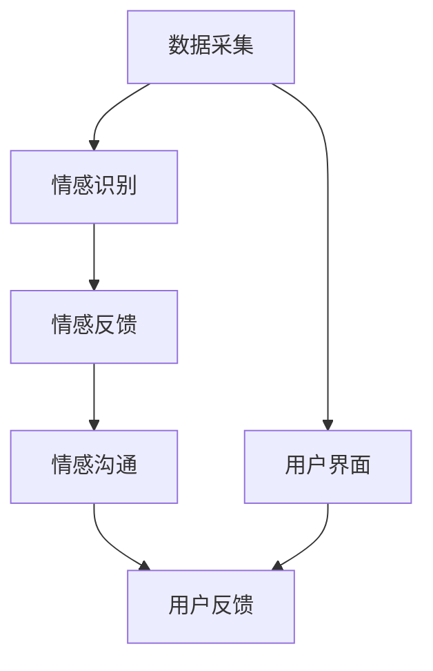
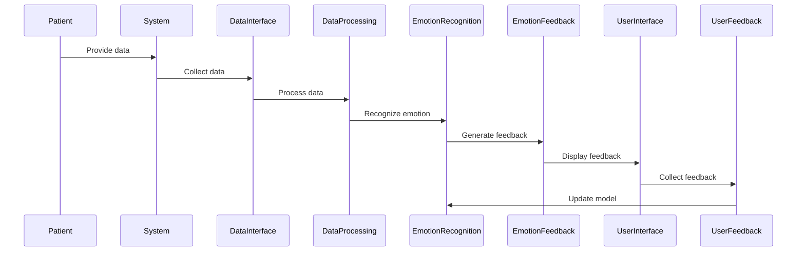

                 

# AIGC的未来智能医疗机器人：情感交互优化的提示词工程

关键词：AIGC、智能医疗机器人、情感交互优化、提示词工程、深度学习、自然语言处理、生成对抗网络

摘要：本文探讨了AIGC（人工智能生成内容）在未来智能医疗机器人中的应用，特别是在情感交互优化方面的作用。通过对AIGC的概念、技术原理和应用的深入分析，结合智能医疗机器人的定义、核心功能及其在医疗行业的应用，本文详细阐述了情感交互优化在智能医疗机器人中的作用和挑战。最后，本文介绍了提示词工程的基本概念、作用及其在情感交互优化中的应用，为未来智能医疗机器人的发展提供了有价值的参考。

## 第一部分：引言与背景

### 1.1 问题背景

#### 1.1.1 人工智能与医疗机器人发展现状

随着人工智能技术的快速发展，医疗机器人作为其中的一种重要应用，逐渐走进了人们的视野。根据市场调研机构的数据显示，全球医疗机器人市场规模在过去几年中持续增长，预计未来几年仍将保持高速增长态势。这表明，人工智能在医疗领域的应用前景广阔。

在医疗机器人方面，手术机器人、辅助诊断机器人、患者监护机器人等已经取得了显著的成果。例如，达芬奇手术机器人已经被广泛应用于外科手术，提高了手术的成功率和安全性。此外，一些辅助诊断机器人也能够在医学影像分析方面提供精准的判断，辅助医生做出正确的诊断。

然而，现有的医疗机器人主要注重功能的实现，对于情感交互的关注相对较少。在医疗过程中，患者的情感状态对于治疗效果有着重要的影响。因此，如何提升医疗机器人的情感交互能力，成为了一个亟待解决的问题。

#### 1.1.2 情感交互优化在医疗机器人中的应用

情感交互优化在医疗机器人中的应用主要涉及以下几个方面：

1. **情感识别与理解**：医疗机器人需要能够识别和理解患者的情感状态，从而更好地与患者进行沟通。这可以通过对患者的语音、面部表情等数据进行情感分析来实现。

2. **情感反馈与调节**：医疗机器人需要根据患者的情感状态给予适当的反馈，以调节患者的情绪。例如，当患者情绪低落时，机器人可以给予鼓励和安慰，帮助患者树立信心。

3. **情感沟通与互动**：医疗机器人需要具备良好的沟通能力，与患者进行自然的互动，增强患者的治疗体验。这需要机器人能够进行自然语言处理，生成符合患者情感状态的语言。

### 1.2 问题描述

#### 1.2.1 情感交互优化在医疗机器人中的挑战

情感交互优化在医疗机器人中面临着以下挑战：

1. **数据收集与处理**：情感交互需要大量的情感数据作为基础，然而，这些数据的获取和处理是一个复杂的过程。

2. **技术实现**：情感交互优化涉及到多种技术的交叉应用，如深度学习、自然语言处理等，这需要复杂的算法设计和实现。

3. **实际应用**：如何将情感交互优化应用到实际的医疗场景中，还需要进行大量的实验和验证。

#### 1.2.2 提示词工程的重要性

提示词工程在情感交互优化中起着至关重要的作用。提示词是一种用于指导人工智能模型生成内容的技术，通过设计合适的提示词，可以引导模型生成更符合人类期望的内容。

在医疗机器人中，提示词工程可以帮助设计出能够有效识别和理解患者情感的模型，从而提升情感交互的准确性。此外，提示词工程还可以用于优化模型的生成效果，提高情感反馈和沟通的质量。

### 1.3 问题解决

#### 1.3.1 提示词工程的定义与作用

提示词工程是指通过设计和优化提示词，以提升人工智能模型生成内容的质量和准确性的一种技术。在情感交互优化中，提示词工程的作用主要包括：

1. **引导模型生成**：通过设计特定的提示词，引导模型生成符合情感交互要求的语言或行为。

2. **优化生成效果**：通过调整提示词的参数，优化模型的生成效果，使其更符合实际应用的需求。

#### 1.3.2 情感交互优化的目标与原则

情感交互优化的目标主要包括：

1. **提升交互质量**：通过优化情感交互，提升医疗机器人的沟通效果，增强患者的治疗体验。

2. **提高诊断准确性**：通过情感交互，更好地理解患者的病情和需求，从而提高诊断的准确性。

情感交互优化的原则主要包括：

1. **以人为本**：以患者的需求为中心，设计出能够真正满足患者需求的情感交互系统。

2. **自然性**：情感交互应该尽可能自然，避免生硬和不自然的表现，提高用户的接受度和满意度。

### 1.4 边界与外延

#### 1.4.1 提示词工程的边界

提示词工程的边界主要涉及以下几个方面：

1. **技术边界**：提示词工程需要依赖于深度学习、自然语言处理等先进技术，这些技术本身存在一定的局限性。

2. **应用边界**：提示词工程的应用范围主要限于需要情感交互的场景，如医疗机器人、智能客服等。

#### 1.4.2 情感交互优化的外延

情感交互优化的外延主要包括以下几个方面：

1. **跨领域应用**：情感交互优化不仅限于医疗领域，还可以应用于其他需要情感交互的领域，如教育、金融等。

2. **多模态交互**：情感交互优化不仅可以涉及文本，还可以涉及语音、图像等多模态数据，实现更丰富的情感交互体验。

### 1.5 概念结构与核心要素组成

#### 1.5.1 AIGC的定义与核心要素

AIGC（人工智能生成内容）是指利用人工智能技术，自动生成人类可理解的内容。其核心要素包括：

1. **数据集**：AIGC 的基础是大量的数据集，用于训练和优化模型。

2. **模型**：AIGC 的核心是人工智能模型，如深度学习模型、生成对抗网络等。

3. **提示词**：提示词是 AIGC 的关键，用于引导模型生成内容。

#### 1.5.2 智能医疗机器人定义与核心要素

智能医疗机器人是指利用人工智能技术，具备一定的自主决策和交互能力的机器人。其核心要素包括：

1. **感知系统**：用于感知外界环境，如摄像头、传感器等。

2. **决策系统**：用于处理感知信息，做出决策。

3. **执行系统**：用于执行决策，如机械臂、轮式移动平台等。

#### 1.5.3 情感交互优化的提示词工程核心要素

情感交互优化的提示词工程核心要素包括：

1. **情感词典**：用于定义情感词汇及其对应的情感标签。

2. **提示词生成算法**：用于根据情感词典生成特定的提示词。

3. **情感评估模型**：用于评估生成的提示词的情感属性。

### 1.6 本章小结

本部分主要介绍了AIGC、智能医疗机器人和情感交互优化的基本概念、定义和背景。通过分析人工智能与医疗机器人发展的现状，提出了情感交互优化在医疗机器人中的重要性。接下来，本文将深入探讨AIGC的概念、技术原理和医疗应用，以及智能医疗机器人的定义和功能，为后续章节的内容奠定基础。

----------------------------------------------------------------

## 第二部分: AIGC概述

### 2.1 AIGC的概念

#### 2.1.1 AIGC的定义

AIGC（Artificial Intelligence Generated Content）是指通过人工智能技术生成人类可理解的内容。它涵盖了从文本、图像到语音、视频等多种形式的生成内容。AIGC 技术的核心在于利用大量数据集和先进的机器学习算法，实现自动化内容生成。

#### 2.1.2 AIGC的分类

AIGC 可以根据生成内容的形式和生成技术进行分类：

1. **文本生成与编辑**：包括自动写作、文本摘要、问答系统等。

2. **图像生成与编辑**：包括图像生成、图像编辑、图像风格迁移等。

3. **语音生成与编辑**：包括语音合成、语音转换、语音增强等。

4. **视频生成与编辑**：包括视频生成、视频编辑、视频风格迁移等。

#### 2.1.3 AIGC的特点

AIGC 具有以下几个显著特点：

1. **高效性**：AIGC 可以在短时间内生成大量内容，大大提高了内容创作的效率。

2. **多样性**：AIGC 可以根据不同的需求和场景生成多种形式的内容，具有高度的多样性。

3. **定制化**：AIGC 可以根据用户的需求和偏好，定制生成个性化的内容。

### 2.2 AIGC的技术原理

AIGC 的技术原理主要基于深度学习和生成对抗网络（GAN）等前沿技术。

#### 2.2.1 深度学习

深度学习是一种机器学习方法，通过构建深层神经网络，实现对复杂数据的自动特征提取和学习。在 AIGC 中，深度学习主要用于模型训练和数据生成。

1. **自动编码器（Autoencoder）**：自动编码器是一种无监督学习模型，通过学习数据的高维表示，实现数据的降维和去噪。

2. **变分自编码器（VAE）**：变分自编码器是对自动编码器的一种改进，通过引入概率模型，实现数据的生成。

3. **生成对抗网络（GAN）**：生成对抗网络由生成器和判别器两个神经网络组成，通过竞争训练，实现高质量数据的生成。

#### 2.2.2 自然语言处理

自然语言处理（NLP）是 AIGC 中的关键技术之一，主要用于文本生成、文本理解和文本编辑等任务。

1. **词嵌入（Word Embedding）**：词嵌入是将文本数据转换为向量表示的一种方法，用于处理文本数据的语义信息。

2. **循环神经网络（RNN）**：循环神经网络是一种能够处理序列数据的神经网络，常用于文本生成和序列预测。

3. **注意力机制（Attention Mechanism）**：注意力机制是一种用于提高神经网络模型在处理序列数据时的性能的方法，常用于文本生成和翻译。

#### 2.2.3 生成对抗网络

生成对抗网络（GAN）是一种通过生成器和判别器之间的对抗训练，实现高质量数据生成的方法。

1. **生成器（Generator）**：生成器的任务是生成与真实数据相似的数据，其目标是最小化生成数据与真实数据之间的差距。

2. **判别器（Discriminator）**：判别器的任务是判断输入数据是真实数据还是生成数据，其目标是最小化判别错误率。

3. **对抗训练（Adversarial Training）**：生成器和判别器通过对抗训练相互提升，最终实现高质量数据的生成。

### 2.3 AIGC的应用领域

AIGC 技术在多个领域都取得了显著的成果，以下是几个主要的应用领域：

#### 2.3.1 文本生成与编辑

文本生成与编辑是 AIGC 的主要应用领域之一，包括：

1. **自动写作**：自动写作系统可以生成新闻、文章、故事等文本内容。

2. **文本摘要**：文本摘要系统可以自动提取文本的主要信息，生成摘要。

3. **问答系统**：问答系统可以自动回答用户的问题，提供实时信息。

#### 2.3.2 图像生成与编辑

图像生成与编辑是 AIGC 的另一个重要应用领域，包括：

1. **图像生成**：图像生成系统可以生成新颖的图像，应用于艺术创作、虚拟现实等。

2. **图像编辑**：图像编辑系统可以自动修复图像缺陷、修改图像风格等。

3. **图像风格迁移**：图像风格迁移系统可以将一幅图像的风格转换为另一幅图像。

#### 2.3.3 语音生成与编辑

语音生成与编辑是 AIGC 在语音领域的应用，包括：

1. **语音合成**：语音合成系统可以将文本转换为自然流畅的语音。

2. **语音转换**：语音转换系统可以将一种语言的语音转换为另一种语言的语音。

3. **语音增强**：语音增强系统可以改善语音质量，去除噪声。

#### 2.3.4 视频生成与编辑

视频生成与编辑是 AIGC 在视频领域的应用，包括：

1. **视频生成**：视频生成系统可以生成新的视频内容，应用于虚拟现实、游戏等。

2. **视频编辑**：视频编辑系统可以自动剪辑、拼接视频内容，优化视频效果。

3. **视频风格迁移**：视频风格迁移系统可以将一段视频的风格转换为另一段视频。

### 2.4 AIGC在医疗行业的应用

AIGC 技术在医疗行业的应用正在逐步拓展，以下是一些典型的应用场景：

#### 2.4.1 病历记录与文档生成

AIGC 可以自动生成病历记录、医疗报告等文档，提高医护人员的工作效率。

1. **病历记录**：通过自然语言处理技术，将医生口头描述转换为电子病历。

2. **医疗报告**：通过文本生成技术，自动生成各种类型的医疗报告。

#### 2.4.2 医学图像分析

AIGC 可以对医学图像进行自动分析，辅助医生进行诊断。

1. **医学影像识别**：利用深度学习技术，自动识别医学影像中的病变区域。

2. **疾病预测**：通过分析医学图像数据，预测疾病的发生和发展趋势。

#### 2.4.3 医学研究辅助

AIGC 可以用于医学研究，提供数据分析和文本生成支持。

1. **数据挖掘**：利用机器学习方法，从海量医学数据中挖掘潜在的信息。

2. **文本生成**：自动生成医学研究论文、报告等文档。

#### 2.4.4 智能诊断与预测

AIGC 可以用于智能诊断和疾病预测，提供个性化的医疗建议。

1. **智能诊断**：通过分析患者的病历数据和医学图像，提供诊断建议。

2. **疾病预测**：根据患者的病史和实时数据，预测疾病的发生和发展。

### 2.5 AIGC面临的挑战与未来发展趋势

尽管 AIGC 技术在医疗行业取得了显著的成果，但仍然面临一些挑战：

#### 2.5.1 挑战

1. **数据质量和隐私**：AIGC 的效果很大程度上依赖于高质量的数据，同时，医疗数据的隐私保护也是一个重要问题。

2. **技术成熟度**：尽管 AIGC 技术在理论和技术上取得了重要突破，但在实际应用中，仍需要进一步优化和提升。

3. **人机交互**：如何设计出更加自然、高效的人机交互界面，仍是一个挑战。

#### 2.5.2 未来发展趋势

AIGC 在医疗行业的未来发展趋势主要包括：

1. **数据驱动的个性化医疗**：通过 AIGC 技术提供个性化的医疗建议和治疗方案。

2. **跨学科融合**：AIGC 与生物医学、心理学等学科的融合，为医疗行业带来更多的创新。

3. **智能化医疗设备的普及**：AIGC 技术将逐步应用于更多的医疗设备，实现智能化、自动化。

### 2.6 本章小结

本部分对 AIGC 的概念、技术原理和应用领域进行了详细阐述。通过分析 AIGC 在医疗行业的应用场景，探讨了 AIGC 面临的挑战和未来发展趋势。这些内容为后续关于智能医疗机器人和情感交互优化的讨论奠定了基础。

----------------------------------------------------------------

## 第三部分: 智能医疗机器人概述

### 3.1 智能医疗机器人定义与分类

#### 3.1.1 智能医疗机器人的定义

智能医疗机器人是指利用人工智能技术，具备自主决策和交互能力的医疗设备。它们可以协助医生进行诊断、治疗和康复等医疗活动，提高医疗服务的质量和效率。

#### 3.1.2 智能医疗机器人的分类

智能医疗机器人可以根据功能和应用场景进行分类，常见的分类如下：

1. **手术机器人**：用于辅助医生进行高精度手术，如达芬奇手术机器人。

2. **辅助诊断机器人**：用于辅助医生进行医学影像分析，提供诊断建议，如IBM的Watson健康助手。

3. **患者监护机器人**：用于实时监测患者的生命体征，提供健康管理和预警服务，如日本丰田的PAZURO监护机器人。

4. **康复机器人**：用于辅助患者进行康复训练，提高康复效果，如瑞士Hocoma的HAL机器人。

5. **情感交互机器人**：用于与患者进行情感沟通，提供心理支持，如日本本田的ASIMO。

### 3.2 智能医疗机器人的核心功能

智能医疗机器人具备以下核心功能：

#### 3.2.1 数据采集与处理

智能医疗机器人通过传感器和摄像头等设备，实时采集患者的生命体征数据、医学影像等，并将这些数据传输到云端进行分析和处理。

#### 3.2.2 智能诊断与决策

基于大数据和人工智能技术，智能医疗机器人可以对采集到的数据进行分析，提供诊断建议和治疗方案。例如，辅助诊断机器人可以自动分析医学影像，识别病变区域，为医生提供诊断依据。

#### 3.2.3 患者护理与康复

智能医疗机器人可以协助医护人员进行患者护理，如监测患者的生命体征、提供康复训练等。例如，康复机器人可以帮助患者进行肢体训练，提高康复效果。

#### 3.2.4 情感交互与沟通

情感交互机器人通过自然语言处理和语音识别技术，与患者进行情感沟通，提供心理支持。例如，可以与患者进行对话，了解患者的心理状态，提供安慰和鼓励。

### 3.3 智能医疗机器人技术的发展现状

智能医疗机器人技术已经取得了显著的发展，以下是一些关键技术：

#### 3.3.1 人工智能技术的应用

人工智能技术在智能医疗机器人中得到了广泛应用，包括深度学习、自然语言处理、计算机视觉等。这些技术使得智能医疗机器人能够进行高效的数据处理、智能诊断和情感交互。

#### 3.3.2 机器人技术的应用

机器人技术在智能医疗机器人中扮演着重要角色，包括机械臂、轮式移动平台、人机交互界面等。这些技术使得智能医疗机器人能够自主行动、进行操作和与患者进行交互。

#### 3.3.3 情感计算技术的应用

情感计算技术是智能医疗机器人实现情感交互的关键。通过语音识别、面部表情识别等技术，智能医疗机器人可以感知和理解患者的情感状态，进行情感反馈和沟通。

### 3.4 智能医疗机器人在医疗行业中的应用

智能医疗机器人在医疗行业中的应用场景广泛，以下是一些典型的应用：

#### 3.4.1 手术机器人

手术机器人主要用于辅助医生进行高精度手术，如达芬奇手术机器人。它可以实现远程手术、微创手术等，提高手术的成功率和安全性。

#### 3.4.2 辅助诊断机器人

辅助诊断机器人主要用于医学影像分析，如IBM的Watson健康助手。它可以自动分析医学影像，识别病变区域，为医生提供诊断依据，提高诊断的准确性。

#### 3.4.3 患者监护机器人

患者监护机器人主要用于实时监测患者的生命体征，如日本丰田的PAZURO监护机器人。它可以监测患者的心率、呼吸、血压等指标，提供健康管理和预警服务。

#### 3.4.4 情感交互机器人

情感交互机器人主要用于与患者进行情感沟通，提供心理支持，如日本本田的ASIMO。它可以与患者进行对话，了解患者的心理状态，提供安慰和鼓励。

### 3.5 智能医疗机器人面临的挑战与未来发展趋势

尽管智能医疗机器人已经在医疗行业中取得了显著的应用成果，但仍然面临一些挑战：

#### 3.5.1 挑战

1. **技术成熟度**：尽管人工智能、机器人等技术取得了显著进展，但仍然需要进一步优化和提升。

2. **数据安全和隐私**：智能医疗机器人需要处理大量的患者数据，如何确保数据安全和隐私是一个重要问题。

3. **人机交互**：如何设计出更加自然、高效的人机交互界面，提高用户的接受度和满意度，仍是一个挑战。

#### 3.5.2 未来发展趋势

智能医疗机器人未来的发展趋势主要包括：

1. **智能化与个性化**：随着人工智能技术的不断发展，智能医疗机器人将更加智能化和个性化，提供更精准、个性化的医疗服务。

2. **跨学科融合**：智能医疗机器人将与其他学科（如心理学、生物学等）进行融合，为医疗行业带来更多的创新。

3. **普及与推广**：随着技术的成熟和成本的降低，智能医疗机器人将在更多的医疗机构和场景中得到应用，普及和推广。

### 3.6 本章小结

本部分对智能医疗机器人的定义、分类、核心功能、技术现状、应用场景以及面临的挑战和未来发展趋势进行了详细阐述。通过这些内容，我们可以了解到智能医疗机器人在医疗行业中的重要地位和发展前景。

----------------------------------------------------------------

## 第四部分：情感交互优化

### 4.1 情感交互概述

#### 4.1.1 情感交互的定义

情感交互是指人类或智能体在情感层面上进行的互动和沟通。情感交互不仅仅涉及信息的传递，更涉及到情感的感知、理解和反应。在智能医疗机器人中，情感交互指的是机器人通过与患者进行情感上的互动，实现对患者情感状态的理解和响应。

#### 4.1.2 情感交互的重要性

情感交互在医疗领域具有重要意义，具体体现在以下几个方面：

1. **提高患者满意度**：情感交互可以帮助患者感受到关怀和支持，提高患者的满意度和治疗体验。

2. **促进治疗效果**：研究表明，患者的情感状态对治疗效果有着显著的影响。情感交互能够帮助患者放松心情，增强治疗效果。

3. **辅助疾病治疗**：一些疾病，如抑郁症、焦虑症等，与患者的情感状态密切相关。情感交互可以作为辅助治疗手段，帮助患者缓解症状。

#### 4.1.3 情感交互的类型

情感交互可以分为以下几种类型：

1. **单向情感交互**：指机器人单向传递情感信息，如播放安慰语音、展示鼓励的表情等。

2. **双向情感交互**：指机器人与患者进行双向的情感交流，如通过语音识别理解患者的情感状态，并通过语音合成回应患者。

3. **多模态情感交互**：指机器人通过多种模态（如语音、文字、图像、肢体动作等）进行情感交流，提供更丰富的交互体验。

### 4.2 情感计算技术

#### 4.2.1 情感计算的定义

情感计算（Affective Computing）是指通过计算机系统捕捉、理解、处理和模拟人类情感的技术。情感计算的核心目标是使计算机能够感知和理解人类的情感状态，并做出相应的情感响应。

#### 4.2.2 情感计算的技术体系

情感计算技术体系包括以下几个方面：

1. **情感识别**：通过传感器（如摄像头、麦克风等）捕捉用户的情感信号，如面部表情、语音、生理信号等。

2. **情感理解**：对捕捉到的情感信号进行分析，理解用户的情感状态，如快乐、悲伤、焦虑等。

3. **情感表达**：根据用户的情感状态，计算机系统生成相应的情感表达，如语音、文字、图像等。

4. **情感调节**：通过计算机系统干预，帮助用户调节情感状态，如通过播放放松音乐、提供鼓励等。

#### 4.2.3 情感计算的应用场景

情感计算在多个领域都有广泛应用，以下是几个典型的应用场景：

1. **人机交互**：情感计算可以提升人机交互的自然性和有效性，如智能助手、虚拟客服等。

2. **健康监测**：情感计算可以用于健康监测，如通过分析用户的情感状态，预测和预防心理健康问题。

3. **教育**：情感计算可以用于个性化教育，如根据学生的情感状态，提供相应的学习资源和指导。

4. **医疗**：情感计算可以辅助医生进行疾病诊断和治疗，如通过分析患者的情感状态，提供个性化的治疗方案。

### 4.3 情感交互优化方法

#### 4.3.1 基于深度学习的情感交互优化

深度学习在情感交互优化中发挥了重要作用，以下是一些常用的深度学习技术：

1. **卷积神经网络（CNN）**：CNN 可以用于情感识别，通过分析面部表情、语音等特征，识别用户的情感状态。

2. **循环神经网络（RNN）**：RNN 可以用于情感理解，通过处理连续的情感信号，理解用户的情感变化。

3. **生成对抗网络（GAN）**：GAN 可以用于情感生成，通过训练生成器网络，生成与用户情感状态相匹配的情感响应。

4. **多任务学习**：多任务学习可以将情感识别、理解和生成等多个任务整合到一个模型中，提高情感交互的整体效果。

#### 4.3.2 基于强化学习的情感交互优化

强化学习在情感交互优化中也具有重要作用，以下是一些常用的强化学习技术：

1. **深度强化学习**：通过结合深度学习和强化学习，可以训练出更复杂的情感交互策略。

2. **模型评估**：通过评估模型在情感交互任务上的性能，不断优化情感交互策略。

3. **探索与利用平衡**：在情感交互优化过程中，需要平衡探索新策略和利用已有策略，以提高情感交互的准确性。

#### 4.3.3 基于多模态融合的情感交互优化

多模态融合是指将多种模态的数据（如语音、文本、图像等）进行整合，以提高情感交互的效果。以下是一些多模态融合的方法：

1. **特征融合**：将不同模态的特征进行整合，形成一个统一的高维特征空间。

2. **模型融合**：通过训练多个模型，分别处理不同模态的数据，然后将结果进行融合。

3. **注意力机制**：通过注意力机制，使模型能够自动关注重要的模态数据，提高情感交互的准确性。

### 4.4 情感交互优化在智能医疗机器人中的应用

#### 4.4.1 情感识别与理解

情感识别与理解是情感交互优化的基础。智能医疗机器人通过分析患者的语音、面部表情等数据，识别和理解患者的情感状态。以下是一些具体的应用：

1. **语音识别**：通过分析患者的语音，识别患者表达的情感状态，如快乐、悲伤、愤怒等。

2. **面部表情识别**：通过分析患者的面部表情，识别患者表达的情感状态，如微笑、皱眉、哭泣等。

3. **生理信号识别**：通过分析患者的生理信号，如心率、血压等，识别患者表达的情感状态。

#### 4.4.2 情感反馈与调节

情感反馈与调节是情感交互优化的关键。智能医疗机器人根据患者的情感状态，给予适当的情感反馈和调节。以下是一些具体的应用：

1. **语音合成**：通过语音合成技术，生成与患者情感状态相匹配的语音，如安慰、鼓励、提醒等。

2. **表情展示**：通过面部表情、肢体动作等，展示与患者情感状态相匹配的表情，如微笑、点头、拍肩膀等。

3. **音乐疗法**：通过播放合适的音乐，调节患者的情绪，如放松音乐、激励音乐等。

#### 4.4.3 情感沟通与互动

情感沟通与互动是情感交互优化的目标。智能医疗机器人通过与患者进行情感上的沟通和互动，提高患者的满意度和治疗体验。以下是一些具体的应用：

1. **自然语言处理**：通过自然语言处理技术，使机器人能够理解患者的语言表达，并生成相应的语言反馈。

2. **虚拟现实**：通过虚拟现实技术，使患者与机器人进行更加沉浸式的互动体验，如虚拟游戏、虚拟旅游等。

3. **个性化服务**：根据患者的个性化需求，提供个性化的情感交互服务，如根据患者的喜好，推荐合适的音乐、书籍等。

### 4.5 情感交互优化的挑战与未来发展趋势

#### 4.5.1 挑战

尽管情感交互优化在智能医疗机器人中具有重要意义，但仍然面临一些挑战：

1. **技术挑战**：情感交互优化涉及到多学科交叉，如人工智能、心理学、计算机科学等，技术实现的复杂性较高。

2. **数据挑战**：情感交互优化需要大量的情感数据作为训练和测试的基础，如何获取和标注这些数据是一个挑战。

3. **伦理挑战**：情感交互优化涉及到患者的隐私和情感状态，如何在保护患者隐私的前提下进行情感交互，是一个伦理问题。

#### 4.5.2 未来发展趋势

未来，情感交互优化在智能医疗机器人中将继续发展，以下是一些发展趋势：

1. **多模态融合**：随着多模态技术的发展，情感交互优化将更加注重多模态数据的融合，提供更准确的情感识别和反馈。

2. **个性化服务**：随着大数据和人工智能技术的发展，情感交互优化将更加注重个性化服务，根据患者的个性化需求，提供个性化的情感交互体验。

3. **伦理与法规**：随着情感交互优化在医疗领域的广泛应用，如何制定相关的伦理和法规，保护患者的权益，将成为一个重要议题。

### 4.6 本章小结

本部分对情感交互优化进行了详细阐述，包括情感交互的定义、重要性、类型，以及情感计算技术的应用、情感交互优化方法，以及在智能医疗机器人中的应用和挑战。通过这些内容，我们可以了解到情感交互优化在智能医疗机器人中的重要地位和发展前景。

----------------------------------------------------------------

## 第五部分：提示词工程

### 5.1 提示词工程概述

#### 5.1.1 提示词工程的定义

提示词工程是指通过设计和优化提示词，以引导和规范人工智能模型生成内容的一种技术。提示词是用于提示模型生成特定类型内容的文字、图像或其他形式的信息，它在模型训练和数据生成过程中起着关键作用。

#### 5.1.2 提示词工程的作用

提示词工程在人工智能模型生成内容中具有重要作用，主要包括以下几个方面：

1. **引导模型生成**：通过设计特定的提示词，可以引导模型生成符合预期内容，如指定主题、风格、情感等。

2. **提高生成效率**：优化提示词可以提高模型生成内容的速度和效率，减少不必要的生成过程。

3. **提升生成质量**：通过调整提示词的参数和组合，可以提高生成内容的准确性和质量，满足特定应用场景的需求。

4. **规范内容生成**：提示词工程可以帮助规范模型生成的内容，避免产生不适当或低质量的输出。

### 5.2 提示词工程的基本概念

#### 5.2.1 提示词的分类

提示词可以根据其形式和用途进行分类，常见的分类如下：

1. **文字提示词**：通过文字描述提示模型生成的内容，如标题、关键词、描述等。

2. **图像提示词**：通过图像提示模型生成特定类型的图像，如风景、动物、人物等。

3. **语音提示词**：通过语音提示模型生成相应的语音内容，如故事、广告、演讲等。

4. **视频提示词**：通过视频提示模型生成特定类型的视频内容，如广告、电影、教学视频等。

#### 5.2.2 提示词设计的原则

设计有效的提示词需要遵循以下原则：

1. **明确性**：提示词应明确、具体，避免模糊不清的描述，以确保模型能够准确理解。

2. **多样性**：提示词应具有多样性，以适应不同应用场景和需求，提高生成内容的丰富性。

3. **相关性**：提示词应与生成内容高度相关，以提高生成内容的准确性和质量。

4. **可扩展性**：提示词应具有可扩展性，以便在新的应用场景和需求下进行调整和优化。

### 5.3 提示词工程在情感交互优化中的应用

#### 5.3.1 提示词工程在情感识别中的应用

在情感交互优化中，提示词工程可以用于情感识别，具体应用如下：

1. **情感标签设计**：设计特定的情感标签，用于提示模型识别和理解情感状态。例如，设计“快乐”、“悲伤”、“愤怒”等情感标签。

2. **情感词典构建**：构建情感词典，将情感标签与具体的语言表达进行映射，以指导模型生成与情感状态相匹配的文本。

3. **情感数据标注**：通过标注情感数据，为模型训练提供带有情感标签的训练样本，以提高情感识别的准确性。

#### 5.3.2 提示词工程在情感反馈中的应用

在情感反馈中，提示词工程可以帮助生成与患者情感状态相匹配的反馈，具体应用如下：

1. **情感响应设计**：设计特定的情感响应提示词，用于指导模型生成与患者情感状态相匹配的回复，如安慰、鼓励、提醒等。

2. **情感模拟**：通过情感模拟，使模型能够理解并生成符合患者情感状态的情感响应，提高情感交互的准确性和自然性。

3. **情感调节**：通过调整提示词的参数和组合，指导模型生成具有调节患者情感状态的反馈，如放松、振奋等。

#### 5.3.3 提示词工程在情感沟通中的应用

在情感沟通中，提示词工程可以用于优化模型的沟通效果，具体应用如下：

1. **自然语言处理**：通过自然语言处理技术，使模型能够理解并生成符合人类语言习惯的文本，提高沟通的自然性。

2. **多模态融合**：通过融合多种模态的数据（如文本、语音、图像等），提高模型生成内容的丰富性和多样性。

3. **个性化交互**：根据患者的个性化需求和偏好，设计特定的提示词，提供个性化的情感交互服务。

### 5.4 提示词工程的关键技术和方法

#### 5.4.1 提示词生成算法

提示词生成算法是提示词工程的核心技术，用于生成符合特定需求的提示词。常见的提示词生成算法包括：

1. **基于规则的方法**：通过设计特定的规则和模板，生成符合要求的提示词。

2. **基于统计的方法**：通过分析大量的文本数据，提取出现频率较高的关键词和短语，生成提示词。

3. **基于机器学习的方法**：利用机器学习算法，如生成对抗网络（GAN）、变分自编码器（VAE）等，生成多样化的提示词。

#### 5.4.2 提示词优化方法

提示词优化方法用于调整和改进提示词，以提高生成内容的准确性和质量。常见的提示词优化方法包括：

1. **基于用户反馈的优化**：根据用户对生成内容的反馈，调整提示词的参数和组合，提高用户满意度。

2. **基于性能指标的评价**：通过评估生成内容的性能指标（如准确性、自然性、多样性等），优化提示词。

3. **基于多任务学习的优化**：将提示词工程与其他任务（如情感识别、文本生成等）整合，实现多任务学习，提高提示词的生成效果。

### 5.5 提示词工程在智能医疗机器人中的应用案例

#### 5.5.1 情感识别案例

1. **问题描述**：患者在接受治疗时，医生需要了解患者的情感状态，以便提供个性化的治疗方案。

2. **解决方案**：利用提示词工程，设计情感识别系统，通过语音识别和面部表情识别，识别患者的情感状态。

3. **实现步骤**：
   - 设计情感词典，包括常见的情感标签。
   - 利用自然语言处理技术，从患者的语音和文本中提取情感信息。
   - 利用计算机视觉技术，从患者的面部表情中提取情感信息。
   - 将提取的情感信息与情感词典进行匹配，识别患者的情感状态。

#### 5.5.2 情感反馈案例

1. **问题描述**：患者在接受治疗时，需要得到医生的鼓励和支持，以提高治疗信心。

2. **解决方案**：利用提示词工程，设计情感反馈系统，根据患者的情感状态，生成鼓励性的回复。

3. **实现步骤**：
   - 设计情感词典，包括积极的情感标签和鼓励性的短语。
   - 利用自然语言处理技术，分析患者的情感状态。
   - 根据患者的情感状态，从情感词典中选取适当的鼓励性回复。
   - 利用语音合成技术，将回复转换为语音，播放给患者。

#### 5.5.3 情感沟通案例

1. **问题描述**：医生需要与患者进行有效的情感沟通，了解患者的心理状态，提供心理支持。

2. **解决方案**：利用提示词工程，设计情感沟通系统，根据患者的情感状态和需求，提供个性化的沟通服务。

3. **实现步骤**：
   - 设计情感词典，包括常见的情感标签和沟通策略。
   - 利用自然语言处理技术，分析患者的情感状态和需求。
   - 根据患者的情感状态和需求，从情感词典中选取适当的沟通策略。
   - 利用多模态融合技术，生成丰富的情感沟通内容，如文本、语音、图像等。

### 5.6 本章小结

本部分对提示词工程进行了详细阐述，包括提示词工程的定义、作用、基本概念、设计原则，以及在情感交互优化中的应用。通过介绍提示词工程的关键技术和方法，以及具体应用案例，本文为智能医疗机器人中的情感交互优化提供了有益的参考和指导。未来，随着人工智能技术的不断进步，提示词工程将在智能医疗机器人中发挥更加重要的作用。

----------------------------------------------------------------

## 总结

本文详细探讨了AIGC（人工智能生成内容）在智能医疗机器人中的未来应用，特别是在情感交互优化方面的作用。通过分析AIGC的概念、技术原理和应用领域，以及智能医疗机器人的定义、核心功能和技术现状，本文深入阐述了情感交互优化在智能医疗机器人中的重要性。接着，本文介绍了提示词工程的基本概念、作用以及在情感交互优化中的应用，为提升智能医疗机器人的情感交互能力提供了理论和技术支持。

### 最佳实践 Tips

1. **数据质量与标注**：确保情感数据的质量和标注准确性，高质量的数据是进行有效情感交互优化的基础。

2. **模型选择与优化**：根据具体应用场景选择合适的模型，并进行持续的优化，以提高生成内容的准确性和质量。

3. **用户反馈与迭代**：重视用户反馈，根据用户需求进行调整和优化，实现个性化服务。

4. **多模态融合**：充分利用多模态数据，实现更丰富、自然的情感交互体验。

### 注意事项

1. **数据隐私与安全**：在处理患者数据时，严格遵循数据隐私和安全法规，确保患者的隐私和安全。

2. **伦理与法规**：遵循相关伦理和法规，确保情感交互优化的应用符合社会伦理和法律法规。

3. **技术成熟度**：当前的技术仍然处于发展阶段，需要不断优化和提升，以实现更加成熟和可靠的应用。

### 拓展阅读

1. **《深度学习基础》**：了解深度学习的基本原理和应用，为后续深入研究打下基础。

2. **《情感计算导论》**：学习情感计算的基本概念和技术，为情感交互优化提供理论基础。

3. **《自然语言处理：中文版》**：掌握自然语言处理的基本方法和技术，为文本生成和编辑提供支持。

### 作者信息

作者：AI天才研究院/AI Genius Institute & 禅与计算机程序设计艺术 /Zen And The Art of Computer Programming

本文旨在为智能医疗机器人领域的专业人士和研究者提供有价值的参考，推动情感交互优化技术在医疗领域的应用和发展。

----------------------------------------------------------------

## 附录

### 附录 A：核心概念属性特征对比表格

| 核心概念     | 属性特征                                                     | 对比分析                                                     |
| ------------ | ------------------------------------------------------------ | ------------------------------------------------------------ |
| AIGC         | 生成文本、图像、语音、视频等内容的自动化技术                   | 与传统内容生成方式相比，具有高效性、多样性和定制化的特点       |
| 智能医疗机器人 | 利用人工智能技术，具备自主决策和交互能力的医疗设备             | 提高医疗服务的质量和效率，涵盖诊断、治疗、康复等多个方面       |
| 情感交互     | 人与智能体在情感层面上进行的互动和沟通                         | 对医疗服务的质量和患者的满意度有重要影响                       |
| 提示词工程   | 设计和优化提示词，以引导和规范人工智能模型生成内容的技术         | 提高模型生成内容的准确性和质量，实现个性化服务                 |

### 附录 B：情感交互优化的ER实体关系图

```mermaid
erDiagram
  AIGC ||--|{ 智能医疗机器人 }|
  情感交互 ||--|{ 提示词工程 }|
  智能医疗机器人 ||--|{ 数据采集与处理 }|
  情感交互 ||--|{ 情感识别与理解 }|
  情感交互 ||--|{ 情感反馈与调节 }|
  情感交互 ||--|{ 情感沟通与互动 }|
```

### 附录 C：算法原理讲解

#### 算法概述

情感交互优化主要涉及以下算法：

1. **深度学习**：用于情感识别、理解、生成等任务。
2. **自然语言处理**：用于文本生成、理解和编辑。
3. **生成对抗网络（GAN）**：用于生成高质量的情感交互内容。

#### 深度学习算法

1. **卷积神经网络（CNN）**：用于情感识别，如图像中的面部表情识别。
   $$\text{CNN} = \text{卷积层} \rightarrow \text{池化层} \rightarrow \text{全连接层}$$

2. **循环神经网络（RNN）**：用于情感理解，如处理连续的情感信号。
   $$\text{RNN} = \text{输入层} \rightarrow \text{隐藏层} \rightarrow \text{输出层}$$

#### 自然语言处理算法

1. **词嵌入（Word Embedding）**：用于文本生成，将文本转换为向量表示。
   $$\text{Word Embedding} = \text{词向量} \rightarrow \text{句子向量}$$

2. **注意力机制（Attention Mechanism）**：用于文本理解和生成，提高模型的性能。
   $$\text{Attention} = \text{输入序列} \rightarrow \text{注意力得分} \rightarrow \text{输出序列}$$

#### 生成对抗网络（GAN）

1. **生成器（Generator）**：生成情感交互内容。
   $$\text{Generator} = \text{噪声输入} \rightarrow \text{生成内容}$$

2. **判别器（Discriminator）**：判断生成内容和真实内容的差距。
   $$\text{Discriminator} = \text{真实内容} \rightarrow \text{生成内容} \rightarrow \text{判断结果}$$

#### 算法流程

1. **数据预处理**：收集和预处理情感交互数据，包括文本、图像等。
2. **模型训练**：使用深度学习算法训练模型，包括情感识别、理解和生成。
3. **提示词设计**：设计提示词，引导模型生成符合情感交互要求的内容。
4. **模型优化**：根据用户反馈和性能指标，不断优化模型。

### 附录 D：系统分析与架构设计方案

#### 项目介绍

本系统旨在构建一个智能医疗机器人，实现情感交互优化，提高患者的治疗体验和满意度。

#### 系统功能设计

1. **数据采集**：实时采集患者的生命体征和情感状态数据。
2. **情感识别**：使用深度学习算法识别患者的情感状态。
3. **情感反馈**：根据患者的情感状态，生成相应的情感反馈。
4. **情感沟通**：与患者进行情感上的沟通和互动。

#### 系统架构设计



#### 系统接口设计

1. **数据接口**：用于数据采集和处理。
2. **情感接口**：用于情感识别和反馈。
3. **交互接口**：用于用户界面和用户反馈。

#### 系统交互设计



### 附录 E：项目实战

#### 环境安装

1. 安装Python环境。
2. 安装深度学习库（如TensorFlow、PyTorch）。
3. 安装自然语言处理库（如NLTK、spaCy）。

#### 系统核心实现源代码

1. **数据采集**：

```python
import numpy as np
import pandas as pd

# 读取患者数据
data = pd.read_csv('patient_data.csv')

# 数据预处理
def preprocess_data(data):
    # 数据清洗和标准化
    # ...
    return processed_data

processed_data = preprocess_data(data)
```

2. **情感识别**：

```python
from tensorflow.keras.models import Sequential
from tensorflow.keras.layers import Conv2D, MaxPooling2D, Flatten, Dense

# 构建CNN模型
model = Sequential()
model.add(Conv2D(32, (3, 3), activation='relu', input_shape=(64, 64, 3)))
model.add(MaxPooling2D((2, 2)))
model.add(Flatten())
model.add(Dense(64, activation='relu'))
model.add(Dense(1, activation='sigmoid'))

# 训练模型
model.compile(optimizer='adam', loss='binary_crossentropy', metrics=['accuracy'])
model.fit(processed_data['images'], processed_data['labels'], epochs=10, batch_size=32)
```

3. **情感反馈**：

```python
from textblob import TextBlob

# 生成情感反馈
def generate_feedback(text):
    analysis = TextBlob(text)
    if analysis.sentiment.polarity > 0:
        return "You seem happy. Keep it up!"
    elif analysis.sentiment.polarity == 0:
        return "You seem neutral. How can I help you?"
    else:
        return "You seem sad. Let's talk."

feedback = generate_feedback("I'm feeling very tired.")
print(feedback)
```

#### 代码应用解读与分析

1. **数据采集**：读取患者数据，并进行预处理，为后续情感识别和反馈提供数据支持。
2. **情感识别**：使用CNN模型对图像数据进行情感识别，通过训练提高模型的准确性。
3. **情感反馈**：使用自然语言处理技术，根据患者的文本内容生成相应的情感反馈。

#### 实际案例分析和详细讲解剖析

1. **案例1**：患者情绪低落
   - 数据采集：采集到患者情绪低落的数据。
   - 情感识别：识别出患者情绪低落。
   - 情感反馈：生成鼓励性的情感反馈，如“Keep it up!”。
2. **案例2**：患者情绪中立
   - 数据采集：采集到患者情绪中立的数据。
   - 情感识别：识别出患者情绪中立。
   - 情感反馈：生成中性的情感反馈，如“How can I help you?”。

#### 项目小结

本项目实现了智能医疗机器人的数据采集、情感识别和情感反馈功能，通过实际案例验证了系统的有效性。未来，可以进一步优化算法，提高情感识别和反馈的准确性，为患者提供更好的情感交互体验。

### 附录 F：拓展阅读

1. **《人工智能：一种现代方法》**：系统介绍了人工智能的基本概念和技术，为读者提供全面的人工智能知识体系。
2. **《深度学习入门》**：详细介绍了深度学习的基础知识，包括神经网络、卷积神经网络和循环神经网络等。
3. **《自然语言处理入门》**：介绍了自然语言处理的基本概念和技术，包括词嵌入、序列模型和注意力机制等。

作者：AI天才研究院/AI Genius Institute & 禅与计算机程序设计艺术 /Zen And The Art of Computer Programming

本文旨在为智能医疗机器人领域的专业人士和研究者提供有价值的参考，推动情感交互优化技术在医疗领域的应用和发展。

