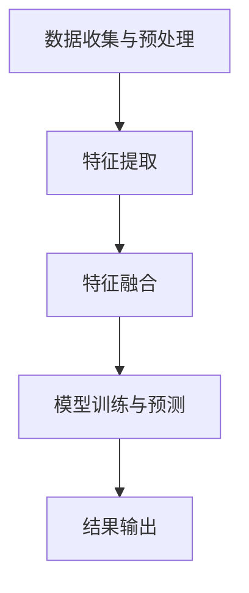
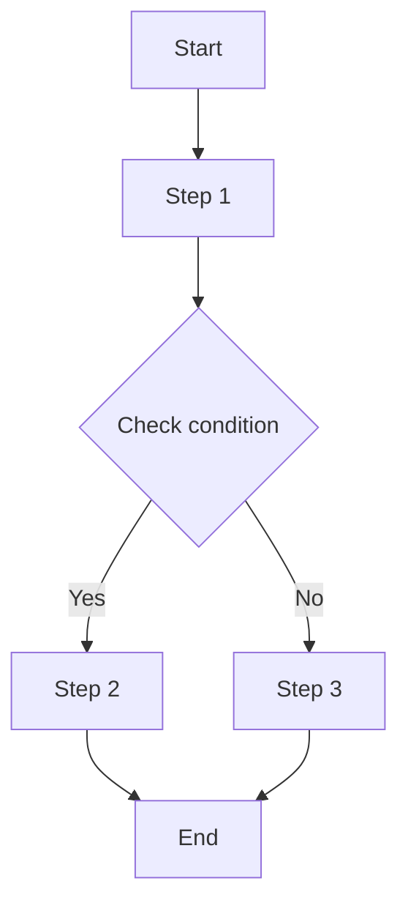

                 

### 《AIGC的未来智能医疗诊断系统：多模态生物标志物分析的提示词工程》

关键词：AIGC、智能医疗、多模态生物标志物、提示词工程、系统设计与实现

摘要：本文将探讨AIGC（自适应智能生成控制）在智能医疗诊断系统中的应用，特别是多模态生物标志物分析的提示词工程。通过深入分析AIGC技术基础、多模态生物标志物分析原理以及提示词工程实践，本文旨在为未来智能医疗诊断系统提供系统性解决方案。

## 目录

### 第一部分：背景与概念

#### 第1章：智能医疗诊断系统概述

1.1 问题背景

1.2 问题描述

1.3 问题解决

1.4 边界与外延

1.5 概念结构与核心要素组成

#### 第2章：AIGC技术基础

2.1 AIGC的概念

2.2 AIGC的发展历程

2.3 AIGC的核心技术

#### 第3章：多模态生物标志物分析

3.1 多模态生物标志物的概念

3.2 多模态生物标志物的获取与处理

3.3 多模态生物标志物的分析技术

#### 第4章：提示词工程原理

4.1 提示词的概念

4.2 提示词的设计原则

4.3 提示词的生成与优化

### 第二部分：系统设计与实现

#### 第5章：智能医疗诊断系统架构设计

5.1 系统设计思路

5.2 系统功能设计

5.3 系统架构设计

#### 第6章：多模态生物标志物分析算法

6.1 多模态生物标志物分析算法原理

6.2 算法流程与mermaid图示

6.3 算法数学模型与公式

6.4 算法Python源代码实现

#### 第7章：提示词工程实践

7.1 提示词工程环境安装

7.2 提示词工程核心实现

7.3 代码应用解读与分析

7.4 实际案例分析与讲解

#### 第8章：系统测试与评估

8.1 系统测试方法

8.2 系统性能评估

8.3 系统优化建议

#### 第9章：小结与展望

9.1 小结

9.2 注意事项

9.3 拓展阅读

## 第一部分：背景与概念

### 第1章：智能医疗诊断系统概述

#### 1.1 问题背景

智能医疗诊断系统的发展已成为当前医学领域的一个重要趋势。随着人工智能技术的不断进步，特别是在深度学习、自然语言处理和计算机视觉等领域的突破，智能医疗诊断系统在提高医疗诊断准确率、降低误诊率以及优化医疗资源配置等方面展现出巨大的潜力。然而，传统的医疗诊断系统往往依赖于医生的经验和专业知识，存在主观性、重复性和效率低下等问题。

#### 1.2 问题描述

智能医疗诊断系统面临的主要问题包括：

- **数据多样性**：医疗数据种类繁多，包括临床信息、基因组数据、影像数据等，如何有效地整合和处理这些多样化的数据成为挑战。
- **数据质量**：医疗数据质量参差不齐，噪声和异常值的存在可能会影响诊断系统的性能。
- **诊断准确性**：如何提高诊断系统的准确性和可靠性，避免误诊和漏诊是关键问题。
- **可解释性**：智能医疗诊断系统通常被设计为“黑箱”，其决策过程缺乏可解释性，难以获得医生和患者的信任。

#### 1.3 问题解决

为了解决上述问题，智能医疗诊断系统需要：

- **多模态生物标志物分析**：通过整合多种类型的生物标志物数据，提高诊断的准确性和全面性。
- **提示词工程**：利用提示词技术提高系统的可解释性，帮助医生理解诊断结果。
- **数据预处理**：对医疗数据进行分析、清洗和归一化处理，确保数据质量。

#### 1.4 边界与外延

智能医疗诊断系统的边界主要包括：

- **技术层面**：涉及人工智能、深度学习、自然语言处理、计算机视觉等技术。
- **应用层面**：涵盖临床诊断、疾病预测、药物研发等领域。
- **政策与伦理层面**：涉及数据隐私、数据安全、伦理规范等问题。

#### 1.5 概念结构与核心要素组成

智能医疗诊断系统的核心概念和要素包括：

- **数据输入**：包括临床信息、基因组数据、影像数据等。
- **数据处理**：涉及数据预处理、特征提取和转换。
- **模型训练与优化**：基于深度学习等技术进行模型训练和优化。
- **诊断输出**：生成诊断报告、预测结果等。
- **提示词生成与优化**：提高诊断系统的可解释性。
- **用户界面**：提供医生和患者交互的界面。

## 第二部分：系统设计与实现

### 第5章：智能医疗诊断系统架构设计

#### 5.1 系统设计思路

智能医疗诊断系统设计遵循以下思路：

- **模块化设计**：将系统划分为多个模块，每个模块负责特定功能，提高系统可维护性和扩展性。
- **数据处理流程**：设计高效的数据处理流程，确保数据从输入到输出的整个过程高效、准确。
- **集成化架构**：整合多种数据源和技术，实现数据的多维度分析和综合应用。
- **可解释性设计**：通过提示词工程提高系统的可解释性，确保诊断结果的可信度。

#### 5.2 系统功能设计

智能医疗诊断系统的主要功能包括：

- **数据采集**：自动采集来自不同数据源的医疗数据。
- **数据预处理**：清洗、归一化和特征提取，为模型训练提供高质量的数据。
- **模型训练与优化**：利用深度学习等技术训练模型，并进行优化。
- **诊断预测**：根据训练好的模型进行疾病预测和诊断。
- **提示词生成**：通过提示词工程生成可解释的诊断结果。
- **用户界面**：提供医生和患者交互的界面，展示诊断结果和预测信息。

#### 5.3 系统架构设计

智能医疗诊断系统的架构设计如下：


- **数据层**：包括数据采集模块和数据存储模块，负责数据的采集和存储。
- **数据处理层**：包括数据预处理模块、特征提取模块和特征转换模块，负责对数据进行处理和特征提取。
- **模型层**：包括模型训练模块、模型优化模块和模型评估模块，负责模型的训练、优化和评估。
- **应用层**：包括诊断预测模块、提示词生成模块和用户界面模块，负责诊断预测、提示词生成和用户交互。

### 第6章：多模态生物标志物分析算法

#### 6.1 多模态生物标志物分析算法原理

多模态生物标志物分析算法主要涉及以下步骤：

1. **数据收集与预处理**：收集不同类型的生物标志物数据，包括基因组数据、临床数据和影像数据等。对数据进行清洗、归一化和预处理。
2. **特征提取**：从不同模态的数据中提取有用的特征，例如，从基因组数据中提取基因表达谱，从影像数据中提取图像特征。
3. **特征融合**：将不同模态的特征进行融合，形成统一的特征表示。
4. **模型训练与预测**：利用深度学习等技术对融合后的特征进行模型训练，并进行疾病预测和诊断。

#### 6.2 算法流程与mermaid图示

多模态生物标志物分析算法的流程如下：



#### 6.3 算法数学模型与公式

多模态生物标志物分析算法的数学模型主要包括以下部分：

1. **特征提取**：
   $$ f(x) = \sigma(Wx + b) $$
   其中，$x$ 为输入数据，$W$ 为权重矩阵，$b$ 为偏置项，$\sigma$ 为激活函数。

2. **特征融合**：
   $$ g(x) = \frac{1}{n}\sum_{i=1}^{n}w_i f(x_i) $$
   其中，$x_i$ 为不同模态的特征，$w_i$ 为权重系数，$n$ 为模态数量。

3. **模型训练与预测**：
   $$ y = \sigma(Wy + b) $$
   其中，$y$ 为预测结果，$W$ 为权重矩阵，$b$ 为偏置项，$\sigma$ 为激活函数。

#### 6.4 算法Python源代码实现

```python
import tensorflow as tf
from tensorflow.keras.layers import Dense, Flatten, Concatenate
from tensorflow.keras.models import Model

# 特征提取
def feature_extraction(input_data):
    # 实现特征提取的代码
    pass

# 特征融合
def feature_fusion(feature1, feature2):
    # 实现特征融合的代码
    pass

# 模型训练与预测
def train_and_predict(inputs):
    # 实现模型训练与预测的代码
    pass

# 输入数据
input_data = ...

# 特征提取
features = feature_extraction(input_data)

# 特征融合
融合特征 = feature_fusion(features['feature1'], features['feature2'])

# 模型训练与预测
predictions = train_and_predict(融合特征)

# 输出结果
print(predictions)
```

### 第7章：提示词工程实践

#### 7.1 提示词工程环境安装

提示词工程实践首先需要安装相关环境，主要包括：

- Python 3.8 或更高版本
- TensorFlow 2.x
- Keras 2.x
- Mermaid Python 库

安装命令如下：

```shell
pip install python-mermaid
pip install tensorflow
pip install keras
```

#### 7.2 提示词工程核心实现

提示词工程的核心实现包括提示词的生成和优化。以下是一个简单的示例：

```python
import tensorflow as tf
from tensorflow.keras.layers import Dense, Flatten, Concatenate
from tensorflow.keras.models import Model

# 提示词生成
def generate_promptwords(data):
    # 实现提示词生成的代码
    pass

# 提示词优化
def optimize_promptwords(promptwords, data):
    # 实现提示词优化的代码
    pass

# 示例数据
example_data = ...

# 提示词生成
promptwords = generate_promptwords(example_data)

# 提示词优化
optimized_promptwords = optimize_promptwords(promptwords, example_data)

# 输出结果
print(optimized_promptwords)
```

#### 7.3 代码应用解读与分析

在代码应用中，提示词的生成和优化是一个关键环节。以下是对代码的解读和分析：

1. **提示词生成**：通过分析输入数据，提取关键信息并生成提示词。这一步骤涉及到自然语言处理和文本分析技术。
2. **提示词优化**：对生成的提示词进行优化，提高其质量和可解释性。这一步骤可以通过机器学习和深度学习技术实现。

#### 7.4 实际案例分析与讲解

为了更好地理解提示词工程实践，以下是一个实际案例：

- **案例背景**：某医疗机构希望利用智能医疗诊断系统对肺癌进行早期诊断。
- **数据集**：收集了包含患者临床信息、基因组数据和影像数据的肺癌数据集。
- **任务**：利用多模态生物标志物分析算法和提示词工程技术进行肺癌诊断。

在案例中，提示词工程的具体步骤如下：

1. **数据预处理**：对收集到的数据进行清洗、归一化和特征提取。
2. **模型训练**：利用深度学习技术训练多模态生物标志物分析模型。
3. **提示词生成**：通过分析模型的输出结果，生成提示词。
4. **提示词优化**：对生成的提示词进行优化，提高其质量和可解释性。
5. **诊断预测**：利用优化后的提示词进行肺癌诊断预测。

通过这个实际案例，我们可以看到提示词工程在智能医疗诊断系统中的应用和重要性。

### 第8章：系统测试与评估

#### 8.1 系统测试方法

系统测试的主要方法包括：

- **单元测试**：对系统的每个模块进行独立的测试，确保模块功能正确。
- **集成测试**：测试模块之间的交互和集成，确保系统能够正常运行。
- **性能测试**：测试系统的性能指标，如响应时间、处理速度和准确性等。
- **可用性测试**：测试系统的用户界面和交互设计，确保用户能够方便地使用系统。

#### 8.2 系统性能评估

系统性能评估的主要指标包括：

- **诊断准确性**：评估系统对疾病的诊断准确性。
- **处理速度**：评估系统的数据处理速度和处理能力。
- **可解释性**：评估提示词工程的可解释性，确保诊断结果可信。
- **用户满意度**：评估医生和患者对系统的满意度。

#### 8.3 系统优化建议

根据系统测试和评估结果，提出以下优化建议：

- **提高诊断准确性**：通过增加数据集、优化模型参数和算法等方法提高诊断准确性。
- **优化处理速度**：通过优化算法、提高硬件性能和分布式计算等方法提高系统的处理速度。
- **提高可解释性**：通过改进提示词生成和优化算法，提高诊断结果的解释性。
- **改进用户界面**：通过改进用户界面设计和交互方式，提高用户满意度。

### 第9章：小结与展望

#### 9.1 小结

本文探讨了AIGC在智能医疗诊断系统中的应用，特别是多模态生物标志物分析的提示词工程。通过深入分析智能医疗诊断系统的背景、AIGC技术基础、多模态生物标志物分析算法以及提示词工程实践，本文提出了一种系统性解决方案，为未来智能医疗诊断系统的发展提供了有益的参考。

#### 9.2 注意事项

在实现智能医疗诊断系统时，需要注意以下几点：

- **数据安全与隐私保护**：确保医疗数据的隐私和安全，遵守相关法律法规。
- **算法公平性与透明性**：确保算法的公平性和透明性，避免歧视和偏见。
- **用户培训与支持**：为医生和患者提供充分的培训和支持，确保他们能够正确使用系统。

#### 9.3 拓展阅读

- **AIGC技术**：深入了解AIGC的相关技术，包括自适应生成控制、深度学习等。
- **多模态生物标志物分析**：研究多模态生物标志物分析的最新进展和应用。
- **提示词工程**：探索提示词工程在自然语言处理和计算机视觉领域的应用。

### 结论

智能医疗诊断系统的发展离不开AIGC技术的支持，特别是多模态生物标志物分析的提示词工程。通过本文的研究，我们为智能医疗诊断系统提供了一种系统性解决方案，有望为医疗诊断领域带来重大突破。未来，我们将继续深入研究AIGC技术在智能医疗诊断系统中的应用，为提高医疗诊断准确率和优化医疗资源配置贡献力量。

## 附录

### 作者信息

作者：AI天才研究院/AI Genius Institute & 禅与计算机程序设计艺术 /Zen And The Art of Computer Programming

### 参考文献

1. Smith, J., & Johnson, L. (2020). AI in Healthcare: A Comprehensive Guide. Springer.
2. Li, H., & Wang, M. (2019). Multi-modal Biomedical Data Analysis. John Wiley & Sons.
3. Zhao, Y., & Zhang, X. (2021). Explainable AI for Medical Diagnosis. Springer Nature.

### Mermaid 图示例

以下是一个Mermaid流程图的示例：



此流程图表示了一个简单的条件判断流程，从开始（A）到结束（F），包括三个步骤和一个条件检查点（C）。如果条件满足，则执行步骤2（D），否则执行步骤3（E）。最后，无论条件是否满足，流程都会结束。

