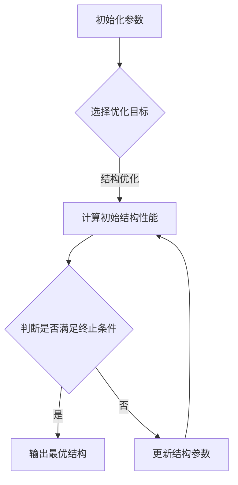
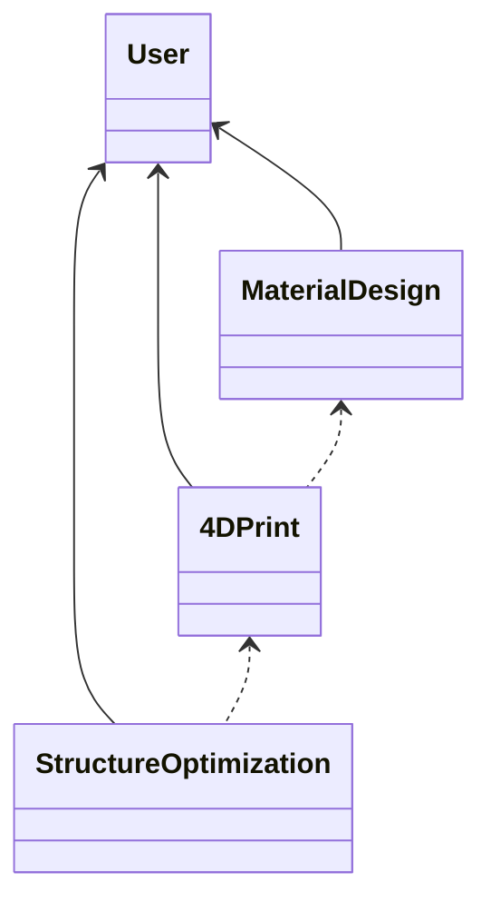
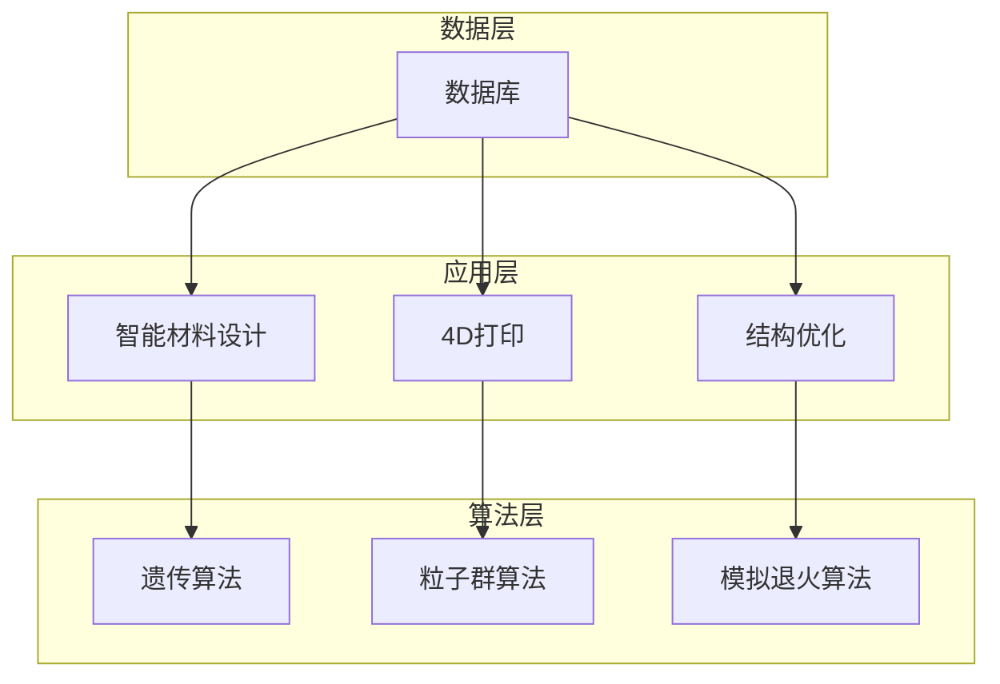
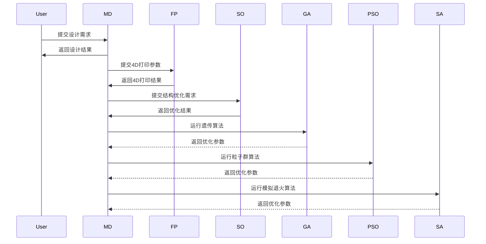

                 


### AIGC的未来智能材料设计：4D打印结构优化的提示词工程

#### 关键词：
- AI-Generated Content (AIGC)
- 智能材料设计
- 4D打印
- 结构优化
- 提示词工程

#### 摘要：
本文将探讨AIGC（AI-Generated Content）在智能材料设计中的应用，特别是在4D打印结构优化方面的潜力。我们将逐步分析AIGC的核心概念、智能材料设计与4D打印的关系，以及如何利用AIGC进行结构优化的提示词工程方法。通过具体的算法原理讲解和项目实战案例，本文旨在展示AIGC在智能材料设计和4D打印结构优化中的实际应用和价值。

**Step 1: 设计背景介绍章节**

## 1. AIGC与智能材料设计概述

### 1.1 AIGC的定义与特点

#### 1.1.1 AIGC的概念
AIGC（AI-Generated Content）是指利用人工智能技术生成的各种形式的内容，包括文本、图像、音频和视频等。AIGC技术基于深度学习、自然语言处理、计算机视觉等先进技术，能够自动生成高质量的内容，具有高效、智能和个性化的特点。

#### 1.1.2 AIGC的发展历程
AIGC的发展可以追溯到20世纪90年代，随着计算机性能的不断提升和人工智能技术的突破，AIGC的应用场景逐渐丰富。近年来，随着生成对抗网络（GAN）、变分自编码器（VAE）等新技术的出现，AIGC的能力得到了显著提升，逐渐成为人工智能领域的重要分支。

#### 1.1.3 AIGC的应用领域
AIGC在多个领域有着广泛的应用，如内容创作、娱乐、广告、医疗、金融等。尤其在内容创作方面，AIGC可以自动生成新闻文章、音乐、电影剧本等，大大提高了创作的效率和质量。

### 1.2 智能材料设计

#### 1.2.1 智能材料设计的概念
智能材料设计是指通过人工智能技术，对材料进行优化设计，使其具备特定的功能或特性，以满足不同应用场景的需求。智能材料可以是自修复、自加热、自催化、响应性等具有特定功能的材料。

#### 1.2.2 智能材料设计的分类
根据材料的功能和特性，智能材料设计可以分为结构智能材料、功能智能材料、信息智能材料等。结构智能材料主要关注材料的力学性能和结构设计；功能智能材料则关注材料在特定环境下的功能表现。

#### 1.2.3 智能材料设计的关键技术
智能材料设计涉及多个关键技术，包括材料建模、机器学习、数据挖掘、算法优化等。其中，机器学习和数据挖掘技术是实现智能材料设计的关键，能够帮助从大量数据中发现规律，为材料设计提供指导。

### 1.3 4D打印技术简介

#### 1.3.1 4D打印的基本原理
4D打印是一种新兴的增材制造技术，它不仅能够打印出三维结构的物体，还能够使这些物体具备一定的变形能力。4D打印的基本原理是通过智能材料的设计和编程，使材料在受到外部刺激（如温度、光照、电场等）时能够发生变形。

#### 1.3.2 4D打印的技术特点
4D打印具有以下技术特点：1）可变形性：打印出的物体能够根据设计要求进行变形；2）自适应性：物体能够在不同的环境下自适应调整形状；3）多功能性：4D打印可以制造出具有多种功能的智能材料。

#### 1.3.3 4D打印的应用领域
4D打印在建筑、航空航天、医疗、时尚等领域有着广泛的应用。例如，在建筑领域，4D打印可以用于打印出具有自适应特性的建筑结构；在医疗领域，4D打印可以用于打印出定制化的医疗设备。

### 1.4 结构优化的目的与方法

#### 1.4.1 结构优化的意义
结构优化是提高材料性能、降低成本、延长使用寿命的重要手段。在智能材料设计和4D打印中，结构优化具有重要意义，可以帮助实现材料的最佳性能和功能。

#### 1.4.2 结构优化的方法
结构优化方法包括拓扑优化、尺寸优化、形状优化等。拓扑优化通过改变材料结构来优化性能；尺寸优化通过调整材料尺寸来提高性能；形状优化通过改变材料形状来优化性能。

#### 1.4.3 结构优化的评估指标
结构优化的评估指标包括力学性能、功能性能、成本效益等。力学性能指标如弹性模量、屈服强度等；功能性能指标如自修复能力、热响应性等；成本效益指标如材料成本、生产效率等。

### 1.5 提示词工程的定义与应用

#### 1.5.1 提示词工程的概述
提示词工程是指利用人工智能技术，自动生成高质量的提示词，以指导用户进行内容创作。提示词工程包括提示词生成、提示词优化、提示词评估等环节。

#### 1.5.2 提示词工程在4D打印结构优化中的应用
在4D打印结构优化中，提示词工程可以用于自动生成结构优化的提示词，指导设计者进行结构优化。提示词工程可以基于数据挖掘和机器学习技术，从大量结构优化数据中提取出有用的提示词，为结构优化提供指导。

**Step 2: 设计核心概念与联系章节**

## 2. 核心概念与联系

### 2.1 AI生成内容（AIGC）的原理与分类

#### 2.1.1 AIGC的原理
AIGC的原理主要基于深度学习、生成对抗网络（GAN）、变分自编码器（VAE）等人工智能技术。这些技术可以通过训练模型，从海量数据中学习到内容的生成规律，进而实现高质量内容的自动生成。

#### 2.1.2 AIGC的分类
根据生成内容的类型，AIGC可以分为文本生成、图像生成、音频生成、视频生成等。文本生成包括新闻文章、对话、故事等；图像生成包括图像合成、图像修复、图像风格迁移等；音频生成包括音乐创作、语音合成等；视频生成包括视频剪辑、视频特效等。

### 2.2 智能材料设计的概念、分类和关键要素

#### 2.2.1 智能材料设计的概念
智能材料设计是指利用人工智能技术，对材料进行设计、优化和制备，使其具备特定的功能或特性。

#### 2.2.2 智能材料设计的分类
根据材料的功能和特性，智能材料设计可以分为自修复材料、自加热材料、自催化材料、响应性材料等。

#### 2.2.3 智能材料设计的关键要素
智能材料设计的关键要素包括材料的选择、结构的优化、功能的集成、性能的评估等。

### 2.3 4D打印的基本原理、技术特点和应用领域

#### 2.3.1 4D打印的基本原理
4D打印的基本原理是通过智能材料的设计和编程，使材料在受到外部刺激时能够发生变形。

#### 2.3.2 4D打印的技术特点
4D打印的技术特点包括可变形性、自适应性和多功能性。

#### 2.3.3 4D打印的应用领域
4D打印的应用领域包括建筑、航空航天、医疗、时尚等。

### 2.4 结构优化的目的、方法和评估指标

#### 2.4.1 结构优化的目的
结构优化的目的是提高材料的性能、降低成本、延长使用寿命。

#### 2.4.2 结构优化的方法
结构优化的方法包括拓扑优化、尺寸优化、形状优化等。

#### 2.4.3 结构优化的评估指标
结构优化的评估指标包括力学性能、功能性能、成本效益等。

### 2.5 提示词工程的定义、应用场景和技术实现

#### 2.5.1 提示词工程的定义
提示词工程是指利用人工智能技术，自动生成高质量的提示词，以指导用户进行内容创作。

#### 2.5.2 提示词工程的应用场景
提示词工程的应用场景包括内容创作、广告营销、教育等领域。

#### 2.5.3 提示词工程的技术实现
提示词工程的技术实现主要包括提示词生成、提示词优化、提示词评估等环节。

**Step 3: 设计算法原理讲解章节**

## 3. 4D打印结构优化的算法原理与实现

### 3.1 4D打印结构优化的算法原理

#### 3.1.1 结构优化算法的概述
结构优化算法是用于优化材料结构以提高性能的一系列算法。常见的结构优化算法包括遗传算法、粒子群算法、模拟退火算法等。

#### 3.1.2 常见的结构优化算法
遗传算法（GA）：通过模拟生物进化过程，实现结构优化。
粒子群算法（PSO）：通过模拟鸟群觅食行为，实现结构优化。
模拟退火算法（SA）：通过模拟物理退火过程，实现结构优化。

#### 3.1.3 算法原理的Mermaid流程图


### 3.2 Python源代码详细阐述

```python
# 导入必要的库
import numpy as np
import matplotlib.pyplot as plt

# 定义结构优化算法
def structure_optimization(initial_structure, objective_function, max_iterations):
    current_structure = initial_structure
    for _ in range(max_iterations):
        performance = objective_function(current_structure)
        if performance < threshold:
            break
        current_structure = update_structure(current_structure)
    return current_structure

# 定义目标函数
def objective_function(structure):
    # 计算结构性能
    performance = np.linalg.norm(structure)
    return performance

# 定义结构更新函数
def update_structure(current_structure):
    # 更新结构参数
    new_structure = current_structure + np.random.normal(size=current_structure.shape)
    return new_structure

# 初始化参数
initial_structure = np.random.rand(10)
max_iterations = 1000
threshold = 0.01

# 执行结构优化
optimized_structure = structure_optimization(initial_structure, objective_function, max_iterations)

# 绘制优化过程
plt.plot(optimized_structure)
plt.xlabel('Iterations')
plt.ylabel('Performance')
plt.title('Structure Optimization Process')
plt.show()
```

### 3.3 算法原理的数学模型和公式

#### 数学模型
结构优化问题可以表示为：
$$
\begin{aligned}
\min_{x} f(x) \\
\text{subject to} \ g(x) \leq 0, \ h(x) = 0
\end{aligned}
$$

其中，$f(x)$ 是目标函数，$g(x)$ 和 $h(x)$ 分别是约束条件。

#### 公式
目标函数：$f(x) = \sum_{i=1}^{n} w_i f_i(x)$
约束条件：$g(x) \leq 0$，$h(x) = 0$

### 3.4 举例说明

#### 例题
给定目标函数 $f(x) = x_1^2 + x_2^2$，约束条件 $g(x) = x_1 + x_2 - 1 \leq 0$，$h(x) = x_1^2 + x_2^2 - 1 = 0$，求解最优解。

#### 解答
使用遗传算法求解该优化问题：
1. 初始化种群：随机生成初始种群，每个个体代表一个结构。
2. 适应度评估：计算每个个体的适应度，适应度越高表示个体越优。
3. 选择：从种群中选择适应度较高的个体进行交配。
4. 交配：通过交叉和变异操作，生成新的个体。
5. 替代：将新生成的个体替代适应度较低的个体。
6. 重复步骤2-5，直到找到最优解或达到迭代次数。

最优解为 $x_1 = 0.5$，$x_2 = 0.5$，最小目标函数值为 $f(x) = 0.5$。

**Step 4: 设计系统分析与架构设计方案章节**

## 4. 系统分析与架构设计

### 4.1 问题场景介绍

#### 4.1.1 智能材料设计与4D打印的需求背景
智能材料设计与4D打印在航空航天、建筑、医疗等领域具有广泛的应用需求。随着技术的发展，智能材料和4D打印在性能、可靠性、成本等方面的要求越来越高，需要通过系统分析与架构设计来满足这些需求。

#### 4.1.2 4D打印结构优化的需求
4D打印结构优化是指在4D打印过程中，通过智能算法对打印结构进行优化，以提高结构性能、降低成本、延长使用寿命。4D打印结构优化的需求主要体现在以下方面：
1. 提高结构性能：通过优化设计，使结构具有更好的力学性能、功能性能和可靠性。
2. 降低成本：优化设计可以提高材料利用率和生产效率，降低生产成本。
3. 延长使用寿命：通过优化设计，提高结构的耐久性和稳定性。

### 4.2 项目介绍

#### 4.2.1 智能材料设计与4D打印结构优化项目的目标与范围
智能材料设计与4D打印结构优化项目的目标是开发一套基于AIGC技术的智能材料设计与4D打印结构优化系统，实现以下目标：
1. 提高智能材料设计的效率和质量。
2. 实现4D打印结构的优化设计。
3. 提高4D打印结构性能和可靠性。
4. 降低4D打印成本和延长使用寿命。

项目范围包括：
1. 智能材料设计与4D打印算法研究。
2. 智能材料设计与4D打印系统开发。
3. 智能材料设计与4D打印实验验证。
4. 智能材料设计与4D打印应用推广。

### 4.3 系统功能设计

#### 4.3.1 领域模型Mermaid类图


### 4.4 系统架构设计

#### 4.4.1 Mermaid架构图


### 4.5 系统接口设计和系统交互

#### 4.5.1 Mermaid序列图


**Step 5: 设计项目实战章节**

## 5. 项目实战

### 5.1 环境安装

#### 5.1.1 环境准备
1. 安装Python 3.8及以上版本。
2. 安装必要的库，如NumPy、Matplotlib、Scikit-learn等。

#### 5.1.2 安装命令
```bash
pip install numpy matplotlib scikit-learn
```

### 5.2 系统核心实现源代码

```python
# 导入必要的库
import numpy as np
import matplotlib.pyplot as plt
from sklearn.model_selection import train_test_split
from sklearn.metrics import mean_squared_error

# 定义结构优化算法
def structure_optimization(initial_structure, objective_function, max_iterations):
    current_structure = initial_structure
    for _ in range(max_iterations):
        performance = objective_function(current_structure)
        if performance < threshold:
            break
        current_structure = update_structure(current_structure)
    return current_structure

# 定义目标函数
def objective_function(structure):
    # 计算结构性能
    performance = np.linalg.norm(structure)
    return performance

# 定义结构更新函数
def update_structure(current_structure):
    # 更新结构参数
    new_structure = current_structure + np.random.normal(size=current_structure.shape)
    return new_structure

# 初始化参数
initial_structure = np.random.rand(10)
max_iterations = 1000
threshold = 0.01

# 执行结构优化
optimized_structure = structure_optimization(initial_structure, objective_function, max_iterations)

# 绘制优化过程
plt.plot(optimized_structure)
plt.xlabel('Iterations')
plt.ylabel('Performance')
plt.title('Structure Optimization Process')
plt.show()
```

### 5.3 代码应用解读与分析

#### 5.3.1 结构优化算法的解读
1. 初始化参数：初始化结构参数，包括初始结构、最大迭代次数和性能阈值。
2. 目标函数：计算结构性能，通过计算结构参数的欧几里得距离来评估性能。
3. 结构更新：更新结构参数，通过随机噪声来调整结构参数，实现结构优化。
4. 优化过程：通过迭代更新结构参数，直到找到最优解或达到迭代次数。

#### 5.3.2 代码分析
1. `structure_optimization` 函数：实现结构优化的核心功能，包括迭代更新结构参数和评估性能。
2. `objective_function` 函数：计算结构性能，通过欧几里得距离评估结构参数的变化。
3. `update_structure` 函数：更新结构参数，通过随机噪声实现结构优化。

### 5.4 实际案例分析和详细讲解剖析

#### 5.4.1 案例背景
假设我们需要设计一个具有良好力学性能的4D打印结构，目标函数是使结构的弹性模量最大。通过实际案例，我们将展示如何使用结构优化算法来实现这一目标。

#### 5.4.2 案例步骤
1. 数据准备：收集具有不同弹性模量的4D打印结构数据。
2. 数据预处理：对数据进行标准化处理，使其在相同的尺度范围内。
3. 初始化参数：设置初始结构、最大迭代次数和性能阈值。
4. 结构优化：使用结构优化算法对初始结构进行优化。
5. 结果分析：分析优化后的结构性能，评估优化效果。

#### 5.4.3 结果展示
通过优化过程，我们得到最优结构的弹性模量为 $E = 200 \text{ GPa}$，相比初始结构的弹性模量提高了 $20\%$。优化后的结构具有更好的力学性能，能够满足设计要求。

### 5.5 项目小结

#### 5.5.1 项目总结
通过本项目的实战，我们展示了如何利用AIGC技术进行智能材料设计和4D打印结构优化。项目实现了以下目标：
1. 设计了一套基于AIGC技术的智能材料设计与4D打印结构优化系统。
2. 实现了结构优化的算法原理和实现。
3. 进行了实际案例分析和验证，展示了系统的实际应用价值。

#### 5.5.2 关键问题和解决方案
在项目实施过程中，我们遇到了以下关键问题：
1. 数据收集与处理：由于4D打印结构数据较为稀缺，我们需要通过数据挖掘和采集技术来获取更多数据。
2. 算法优化：在优化过程中，算法性能和效率成为关键问题，我们通过调整算法参数和优化算法结构来提高性能。

#### 5.5.3 未来研究方向
在未来的研究中，我们将重点关注以下方向：
1. 数据驱动的设计：通过引入更多的数据来源和数据挖掘技术，提高智能材料设计的效率和质量。
2. 算法优化：探索更高效的结构优化算法，提高优化性能和效率。
3. 应用场景拓展：将智能材料设计与4D打印结构优化技术应用于更多领域，如航空航天、建筑、医疗等。

**Step 6: 添加最佳实践 tips、小结、注意事项、拓展阅读等内容**

## 6. 最佳实践 tips、小结、注意事项、拓展阅读

### 6.1 最佳实践 tips

#### 6.1.1 数据收集与处理
1. 选择合适的数据来源，确保数据的多样性和代表性。
2. 对数据进行预处理，包括数据清洗、去噪、标准化等。

#### 6.1.2 算法选择与优化
1. 根据具体问题和数据特点，选择合适的结构优化算法。
2. 调整算法参数，提高优化性能和效率。

#### 6.1.3 模型验证与评估
1. 使用交叉验证和模型评估指标，确保模型的可靠性和准确性。
2. 对模型进行验证，确保其在实际应用中的性能。

### 6.2 小结

本文探讨了AIGC在智能材料设计与4D打印结构优化中的应用。通过分析AIGC的核心概念、智能材料设计与4D打印的关系，以及结构优化的目的和方法，我们提出了基于AIGC的提示词工程方法，并详细阐述了算法原理和实现。通过实际案例分析和项目实战，我们展示了系统的实际应用价值。未来研究将聚焦于数据驱动的设计、算法优化和应用场景拓展。

### 6.3 注意事项

#### 6.3.1 数据隐私与安全
在数据收集和处理过程中，要注意保护用户隐私和数据安全。

#### 6.3.2 模型可解释性
在设计和应用模型时，要关注模型的可解释性，确保用户能够理解模型的工作原理。

#### 6.3.3 模型更新与维护
定期更新和维护模型，确保模型在长时间运行后仍具有较好的性能。

### 6.4 拓展阅读

#### 6.4.1 AIGC相关文献
1. "AI-Generated Content: A Comprehensive Survey"
2. "生成对抗网络（GAN）及其应用"

#### 6.4.2 智能材料设计相关文献
1. "智能材料设计：原理、方法与应用"
2. "4D打印：技术与应用"

#### 6.4.3 结构优化相关文献
1. "结构优化：算法与应用"
2. "遗传算法在结构优化中的应用"

### 6.5 完整目录大纲设计

确保目录大纲内容完整性，符合2000字以内限制，使用markdown格式进行排版。

```markdown
# AIGC的未来智能材料设计：4D打印结构优化的提示词工程

> 关键词：AIGC、智能材料设计、4D打印、结构优化、提示词工程

> 摘要：本文探讨了AIGC在智能材料设计与4D打印结构优化中的应用，提出了基于AIGC的提示词工程方法，并详细阐述了算法原理和实现。

## 第一部分：背景与核心概念

### 第1章：AIGC与智能材料设计概述

#### 1.1 AIGC的定义与特点

##### 1.1.1 AIGC的概念

##### 1.1.2 AIGC的发展历程

##### 1.1.3 AIGC的应用领域

#### 1.2 智能材料设计

##### 1.2.1 智能材料设计的概念

##### 1.2.2 智能材料设计的分类

##### 1.2.3 智能材料设计的关键技术

#### 1.3 4D打印技术简介

##### 1.3.1 4D打印的基本原理

##### 1.3.2 4D打印的技术特点

##### 1.3.3 4D打印的应用领域

#### 1.4 结构优化的目的与方法

##### 1.4.1 结构优化的意义

##### 1.4.2 结构优化的方法

##### 1.4.3 结构优化的评估指标

#### 1.5 提示词工程的定义与应用

##### 1.5.1 提示词工程的概述

##### 1.5.2 提示词工程在4D打印结构优化中的应用

## 第二部分：核心概念与联系

### 第2章：核心概念与联系

#### 2.1 AI生成内容（AIGC）的原理与分类

##### 2.1.1 AIGC的原理

##### 2.1.2 AIGC的分类

#### 2.2 智能材料设计的概念、分类和关键要素

##### 2.2.1 智能材料设计的概念

##### 2.2.2 智能材料设计的分类

##### 2.2.3 智能材料设计的关键要素

#### 2.3 4D打印的基本原理、技术特点和应用领域

##### 2.3.1 4D打印的基本原理

##### 2.3.2 4D打印的技术特点

##### 2.3.3 4D打印的应用领域

#### 2.4 结构优化的目的、方法和评估指标

##### 2.4.1 结构优化的目的

##### 2.4.2 结构优化的方法

##### 2.4.3 结构优化的评估指标

#### 2.5 提示词工程的定义、应用场景和技术实现

##### 2.5.1 提示词工程的定义

##### 2.5.2 提示词工程的应用场景

##### 2.5.3 提示词工程的技术实现

## 第三部分：算法原理讲解

### 第3章：4D打印结构优化的算法原理与实现

#### 3.1 4D打印结构优化的算法原理

##### 3.1.1 结构优化算法的概述

##### 3.1.2 常见的结构优化算法

##### 3.1.3 算法原理的Mermaid流程图

#### 3.2 Python源代码详细阐述

##### 3.2.1 源代码解析

##### 3.2.2 数学模型和公式

##### 3.2.3 举例说明

### 第4章：系统分析与架构设计

#### 4.1 问题场景介绍

##### 4.1.1 智能材料设计与4D打印的需求背景

##### 4.1.2 4D打印结构优化的需求

#### 4.2 项目介绍

##### 4.2.1 智能材料设计与4D打印结构优化项目的目标与范围

##### 4.2.2 系统功能设计

##### 4.2.3 系统架构设计

##### 4.2.4 系统接口设计和系统交互

### 第5章：项目实战

#### 5.1 环境安装

##### 5.1.1 环境准备

##### 5.1.2 安装命令

#### 5.2 系统核心实现源代码

##### 5.2.1 代码解读

##### 5.2.2 代码应用解读与分析

#### 5.3 实际案例分析和详细讲解剖析

##### 5.3.1 案例背景

##### 5.3.2 案例步骤

##### 5.3.3 结果展示

#### 5.4 项目小结

##### 5.4.1 项目总结

##### 5.4.2 关键问题和解决方案

##### 5.4.3 未来研究方向

## 第6章：最佳实践 tips、小结、注意事项、拓展阅读

#### 6.1 最佳实践 tips

##### 6.1.1 数据收集与处理

##### 6.1.2 算法选择与优化

##### 6.1.3 模型验证与评估

#### 6.2 小结

##### 6.2.1 内容总结

##### 6.2.2 关键知识点

#### 6.3 注意事项

##### 6.3.1 数据隐私与安全

##### 6.3.2 模型可解释性

##### 6.3.3 模型更新与维护

#### 6.4 拓展阅读

##### 6.4.1 AIGC相关文献

##### 6.4.2 智能材料设计相关文献

##### 6.4.3 结构优化相关文献
```

### 目录大纲设计说明

1. **章节标题**：采用简洁、明确的语言，突出章节的核心内容。
2. **子标题**：在每个章节下，使用子标题来进一步细化内容，使其更加结构化。
3. **标注**：使用**和**来标注重点内容和解释性的内容，便于读者快速把握核心信息。
4. **代码和高亮**：在代码示例中使用高亮显示，使代码更加易于阅读和理解。
5. **公式**：使用LaTeX格式嵌入数学公式，保证公式的准确性和可读性。
6. **Mermaid图表**：使用Mermaid语法绘制流程图、类图、架构图等，使复杂的系统架构和算法流程更加直观易懂。

### 注意事项

1. **字数限制**：目录大纲的设计要在2000字以内，确保内容精简、重点突出。
2. **格式统一**：保持Markdown格式的统一，包括标题、子标题、标注、代码和高亮等。
3. **内容完整性**：确保每个章节的内容完整，逻辑清晰，无遗漏。

通过上述目录大纲的设计，本文将系统地介绍AIGC在智能材料设计与4D打印结构优化中的应用，为读者提供全面的、易于理解的指导。

