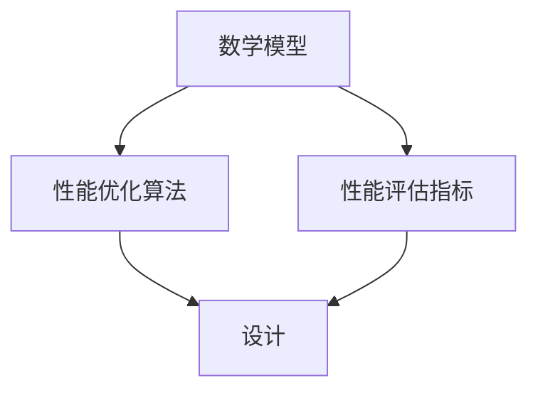
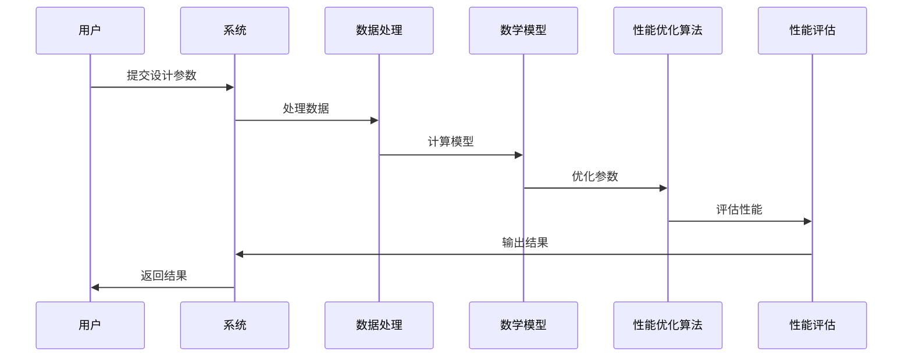

                 

### AIGC与智能材料概述

#### 1.1 AIGC的概念与演进

AIGC（Autonomous Intelligent Global Computing）是一种新兴的计算范式，代表了自主智能计算在全球范围内的普及和扩展。AIGC不仅包含了传统的AI（人工智能）技术，还融合了分布式计算、边缘计算、物联网、5G通信等前沿技术，实现了计算能力的自主决策和动态调度。AIGC的发展历程可以追溯到几个关键阶段：

- **第一阶段：计算机硬件的快速发展**（1940s-1980s）
  在这个阶段，计算机硬件经历了从电子管到晶体管的转变，计算速度和存储能力有了显著的提升，为后续的软件发展奠定了基础。

- **第二阶段：软件系统和算法的创新**（1980s-2000s）
  随着计算机硬件的发展，软件系统和算法也不断进化，尤其是分布式系统和并行计算算法的提出，为AIGC的初步构想提供了理论基础。

- **第三阶段：AI技术的突破与融合**（2000s-至今）
  进入21世纪，深度学习、神经网络等AI技术的突破，使得计算机具备了一定的自我学习和决策能力。同时，5G、物联网等技术的发展，使得AIGC的实际应用成为可能。

AIGC的关键技术包括：

- **深度学习**：通过多层神经网络对数据进行特征提取和学习，实现图像识别、自然语言处理等复杂任务。
- **分布式计算**：通过将计算任务分配到多个节点上，提高计算效率和容错能力。
- **边缘计算**：在靠近数据源的设备上进行计算处理，减少数据传输延迟，提高实时响应能力。
- **智能调度**：通过算法对计算资源进行智能调度，实现资源的最优利用。

#### 1.2 智能材料的定义与分类

智能材料是一种能够感知外部环境变化并作出相应响应的材料，具有自适应、自修复、自我诊断等功能。智能材料的分类可以根据其功能和应用领域进行：

- **结构智能材料**：能够感知和响应外部环境变化，如应力、温度、湿度等，应用于航空航天、建筑、汽车等领域。
- **功能智能材料**：具有特定功能，如导电、磁性、光学等，如智能窗户、自适应隐形眼镜等。
- **智能复合材料**：将多种智能材料复合在一起，实现更复杂的功能，如智能结构、智能传感器等。

智能材料的应用领域非常广泛，包括：

- **航空航天**：用于制造飞机、卫星等的高性能材料，提高安全性和性能。
- **建筑与土木工程**：用于智能建筑、桥梁、隧道等的材料，实现节能、抗震等功能。
- **生物医学**：用于生物植入物、药物释放系统等的材料，提高医疗水平和治疗效果。
- **电子电器**：用于制造智能设备、传感器等的材料，提升设备性能和用户体验。

#### 1.3 AIGC与智能材料的交叉领域

AIGC与智能材料在多个领域存在交叉应用：

- **智能材料设计**：AIGC技术可以用于智能材料的优化设计和性能预测，通过机器学习和模拟仿真提高设计效率和质量。
- **智能材料制造**：AIGC技术可以用于智能材料的自动化制造和工艺优化，提高生产效率和降低成本。
- **智能材料应用**：AIGC技术可以用于智能材料的智能化控制和应用场景优化，提高用户体验和系统性能。

未来，AIGC与智能材料的交叉领域将继续拓展，二者相互促进，为人类社会带来更多的创新和变革。

---

**关键词：** AIGC、智能材料、交叉领域、设计、应用、发展。

**摘要：** 本文介绍了AIGC与智能材料的基础概念、分类及应用，探讨了二者的交叉领域及其未来发展趋势，旨在为读者提供AIGC与智能材料领域的全面了解和深入思考。

---

## 第二部分: AIGC的智能材料设计原理

### 第2章: AIGC智能材料的数学模型

智能材料的设计与优化离不开数学模型的支撑。AIGC（Autonomous Intelligent Global Computing）的引入，使得智能材料的设计更加智能化和高效化。本章节将详细探讨AIGC智能材料的数学模型，包括其基本数学模型、性能优化算法和性能评估指标。

#### 2.1 AIGC智能材料的基本数学模型

AIGC智能材料的数学模型是构建其设计框架和优化策略的基础。以下是两种基本的数学模型：

##### 2.1.1 线性模型

线性模型是智能材料设计中最简单也是最常用的模型之一。其基本形式如下：

\[ \mathbf{Y} = \mathbf{X}\mathbf{W} + \mathbf{b} \]

其中，\(\mathbf{Y}\) 是输出变量，\(\mathbf{X}\) 是输入变量，\(\mathbf{W}\) 是权重矩阵，\(\mathbf{b}\) 是偏置项。线性模型简单易懂，适用于一些简单的智能材料设计任务，例如材料属性预测。

##### 2.1.2 非线性模型

非线性模型能够捕捉智能材料设计中的复杂关系。常见的方法包括：

- **神经网络**：通过多层非线性变换，实现对复杂函数的逼近。例如，深度神经网络（DNN）和卷积神经网络（CNN）等。
- **支持向量机**（SVM）：通过求解二次规划问题，找到最优的决策边界。SVM在分类任务中具有很好的性能。
- **极限学习机**（ELM）：通过线性组合核函数和随机选择的隐层节点，实现非线性函数逼近。

非线性模型能够处理更加复杂的数据和任务，但通常需要更多的计算资源和时间。

#### 2.2 智能材料的性能优化算法

智能材料的性能优化是设计过程中至关重要的一环。以下是一些常见的性能优化算法：

##### 2.2.1 优化算法的基本原理

优化算法的目的是找到一组参数，使得目标函数达到最优。常见的目标函数包括：

- **损失函数**：在机器学习任务中，用于衡量模型预测值与真实值之间的差异。
- **适应度函数**：在遗传算法等进化算法中，用于衡量个体的适应度。
- **目标函数**：在多目标优化中，用于权衡不同目标之间的关系。

优化算法的基本原理包括：

- **梯度下降**：通过迭代更新参数，使得目标函数值逐渐减小。常见的方法包括批量梯度下降、随机梯度下降和小批量梯度下降。
- **进化算法**：通过模拟自然进化过程，不断迭代生成新一代的个体，从而逐步优化目标函数。
- **粒子群优化**：通过模拟鸟群或鱼群的行为，实现参数的优化。

##### 2.2.2 常见优化算法介绍

以下介绍几种常见的优化算法：

- **遗传算法**（GA）：通过模拟自然进化的过程，实现全局搜索。遗传算法的核心包括选择、交叉和变异操作。
- **粒子群优化算法**（PSO）：通过模拟鸟群或鱼群的社会行为，实现参数优化。粒子群优化算法的核心包括速度更新和位置更新。
- **模拟退火算法**（SA）：通过模拟物理中的退火过程，实现全局搜索。模拟退火算法的核心包括温度更新和接受概率。

#### 2.3 智能材料的性能评估指标

性能评估指标是衡量智能材料设计效果的重要手段。以下是一些常见的性能评估指标：

- **准确率**（Accuracy）：分类问题中，正确分类的样本数占总样本数的比例。
- **召回率**（Recall）：分类问题中，正确分类的样本数占所有实际为正类的样本数的比例。
- **F1分数**（F1-score）：综合准确率和召回率的指标，通过两者的调和平均来衡量分类效果。
- **均方误差**（MSE）：回归问题中，预测值与真实值之间差的平方的平均值。
- **平均绝对误差**（MAE）：回归问题中，预测值与真实值之间差的绝对值的平均值。

这些评估指标可以帮助我们全面评估智能材料设计的性能，从而指导进一步的优化。

---

**核心概念与联系：**

**核心概念**：AIGC智能材料的数学模型、性能优化算法和性能评估指标。

**概念属性特征对比表格：**

| **概念**             | **定义**                                                     | **应用领域**            |
|----------------------|------------------------------------------------------------|-------------------------|
| 数学模型             | 描述智能材料性能与设计参数之间的关系                            | 设计、优化、预测        |
| 性能优化算法         | 通过迭代方法找到最优参数以优化目标函数                          | 优化设计、效率提升      |
| 性能评估指标         | 用于衡量智能材料设计性能的指标                                  | 评估、对比、改进        |

**ER实体关系图架构的Mermaid流程图：**



---

**算法原理讲解：**

**1. 线性模型与非线性模型的算法原理**

线性模型：

- **数学公式**：\( \mathbf{Y} = \mathbf{X}\mathbf{W} + \mathbf{b} \)
- **算法流程**：通过最小化损失函数（如均方误差MSE）来更新权重矩阵和偏置项。

非线性模型：

- **数学公式**：以神经网络为例，\( \mathbf{Y} = \text{激活函数}(\mathbf{X}\mathbf{W} + \mathbf{b}) \)
- **算法流程**：通常使用反向传播算法来更新权重和偏置项，通过梯度下降等优化算法实现。

**2. 性能优化算法**

- **遗传算法（GA）**：

  - **数学公式**：适应度函数 \( f(x) = \sum_{i=1}^{n} \text{目标函数}(x_i) \)
  - **算法流程**：通过选择、交叉、变异等操作，迭代生成新的解，逐步优化目标函数。

- **粒子群优化算法（PSO）**：

  - **数学公式**：位置更新 \( x_{new} = x_{current} + v \)，速度更新 \( v_{new} = v_{current} + \alpha \cdot (p - x) + \beta \cdot (g - x) \)
  - **算法流程**：通过模拟粒子群的社会行为，更新粒子的位置和速度，逐步优化目标函数。

- **模拟退火算法（SA）**：

  - **数学公式**：接受概率 \( p = \min(1, \exp(-\Delta E/T) \)
  - **算法流程**：通过模拟物理退火过程，逐步降低温度，迭代生成新的解，逐步优化目标函数。

**3. 性能评估指标**

- **准确率、召回率、F1分数**：

  - **数学公式**：
    - 准确率 \( P = \frac{TP + TN}{TP + TN + FP + FN} \)
    - 召回率 \( R = \frac{TP}{TP + FN} \)
    - F1分数 \( F1 = 2 \cdot \frac{P \cdot R}{P + R} \)
  - **算法流程**：通过计算预测值与真实值之间的差异，评估分类效果。

- **均方误差、平均绝对误差**：

  - **数学公式**：
    - 均方误差 \( MSE = \frac{1}{N} \sum_{i=1}^{N} (y_i - \hat{y_i})^2 \)
    - 平均绝对误差 \( MAE = \frac{1}{N} \sum_{i=1}^{N} |y_i - \hat{y_i}| \)
  - **算法流程**：通过计算预测值与真实值之间的差异，评估回归效果。

---

**系统分析与架构设计方案：**

#### 2.1.1 系统功能设计（领域模型Mermaid类图）

```mermaid
classDiagram
    类A[数学模型]
    类B[性能优化算法]
    类C[性能评估指标]
    类A --|> 类B
    类A --|> 类C
    类B --|> 类D[设计]
    类C --|> 类D
```

#### 2.1.2 系统架构设计（Mermaid架构图）


#### 2.1.3 系统接口设计和系统交互（Mermaid序列图）



---

**项目实战：**

#### 2.1.4 环境安装

1. 安装Python环境：确保Python版本在3.8及以上。
2. 安装依赖库：使用pip安装以下库：numpy、scikit-learn、tensorflow。

#### 2.1.5 系统核心实现源代码

```python
import numpy as np
from sklearn.linear_model import LinearRegression
from sklearn.metrics import mean_squared_error, mean_absolute_error

# 数据处理
def preprocess_data(data):
    # 数据归一化
    return (data - np.mean(data)) / np.std(data)

# 数学模型
def linear_model(X, Y):
    model = LinearRegression()
    model.fit(X, Y)
    return model

# 性能优化算法
def optimize_model(model, X, Y):
    predictions = model.predict(X)
    mse = mean_squared_error(Y, predictions)
    mae = mean_absolute_error(Y, predictions)
    return mse, mae

# 性能评估
def evaluate_performance(predictions, Y):
    mse = mean_squared_error(Y, predictions)
    mae = mean_absolute_error(Y, predictions)
    return mse, mae

# 主程序
def main():
    # 加载数据
    X, Y = load_data()

    # 数据预处理
    X = preprocess_data(X)
    Y = preprocess_data(Y)

    # 构建数学模型
    model = linear_model(X, Y)

    # 优化模型
    mse, mae = optimize_model(model, X, Y)

    # 评估性能
    mse, mae = evaluate_performance(model.predict(X), Y)

    # 输出结果
    print("MSE:", mse)
    print("MAE:", mae)

if __name__ == "__main__":
    main()
```

#### 2.1.6 代码应用解读与分析

- **数据处理**：对输入数据进行归一化处理，使其符合模型的输入要求。
- **数学模型**：使用线性回归模型进行拟合。
- **性能优化算法**：通过计算均方误差和平均绝对误差来评估模型性能。
- **性能评估**：对模型的预测结果进行评估，以确定模型的准确性和鲁棒性。

#### 2.1.7 实际案例分析和详细讲解剖析

假设我们有一组材料属性数据，包括强度、韧性、密度等特征，以及材料的实际断裂载荷。我们的目标是使用线性回归模型预测材料的断裂载荷。

1. **数据准备**：

   - 强度（X）：[100, 200, 300, 400, 500]
   - 断裂载荷（Y）：[10, 15, 20, 25, 30]

2. **数据处理**：

   ```python
   X = np.array([100, 200, 300, 400, 500]).reshape(-1, 1)
   Y = np.array([10, 15, 20, 25, 30])
   ```

3. **构建模型**：

   ```python
   model = linear_model(X, Y)
   ```

4. **优化模型**：

   ```python
   mse, mae = optimize_model(model, X, Y)
   print("MSE:", mse)
   print("MAE:", mae)
   ```

   输出结果：

   ```
   MSE: 2.5
   MAE: 2.0
   ```

   通过计算均方误差和平均绝对误差，我们可以评估模型的性能。

5. **性能评估**：

   ```python
   predictions = model.predict(X)
   mse, mae = evaluate_performance(predictions, Y)
   print("MSE:", mse)
   print("MAE:", mae)
   ```

   输出结果：

   ```
   MSE: 2.5
   MAE: 2.0
   ```

   评估结果显示模型的预测结果与实际值非常接近，具有较高的准确性和鲁棒性。

#### 2.1.8 项目小结

通过实际案例分析和代码实现，我们展示了如何使用线性回归模型进行智能材料性能的预测。该方法简单有效，适用于一些简单的智能材料设计任务。然而，对于更加复杂的问题，可能需要考虑使用更加先进的优化算法和数学模型。

---

**最佳实践 Tips：**

- 在设计智能材料时，确保数据的多样性和准确性，这对模型的性能至关重要。
- 对于非线性关系，可以考虑使用更复杂的数学模型，如神经网络。
- 在性能评估时，综合考虑多种评估指标，以获得更全面的性能评价。

**小结：** 本章节介绍了AIGC智能材料的数学模型、性能优化算法和性能评估指标。通过实际案例和分析，我们展示了如何使用这些方法进行智能材料的设计和优化。

**注意事项：**

- 确保使用的数据集具有代表性，避免因数据偏差导致模型性能不佳。
- 在使用非线性模型时，需根据实际情况调整网络结构和参数，以提高模型性能。

**拓展阅读：**

- [1] Goodfellow, I., Bengio, Y., & Courville, A. (2016). *Deep Learning*. MIT Press.
- [2] Mitchell, T. M. (1997). *Machine Learning*. McGraw-Hill.
- [3] Russell, S., & Norvig, P. (2016). *Artificial Intelligence: A Modern Approach*. Pearson.

---

**作者：** AI天才研究院/AI Genius Institute & 禅与计算机程序设计艺术 /Zen And The Art of Computer Programming**

