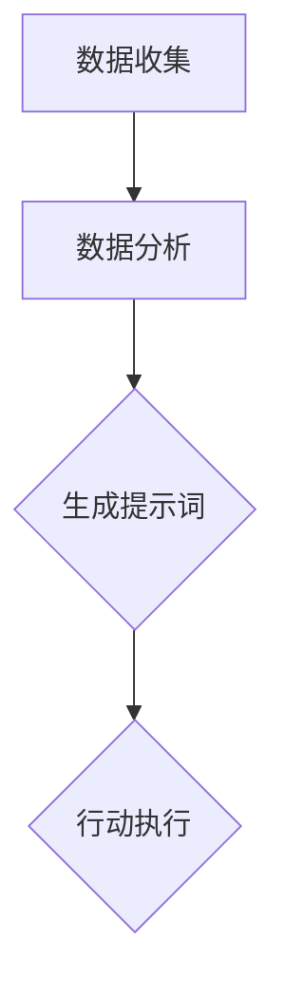

                 

# AIGC的未来海底数据中心：极端环境适应的提示词策略

## 引言

在数字化时代，数据中心的地位愈发重要，而海底数据中心作为一种新兴的技术，正在逐渐受到业界的关注。AIGC（Artificial Intelligence, Graphics, and Computing）技术的引入，为海底数据中心的发展提供了新的可能性。本文将探讨AIGC在未来海底数据中心中的应用，尤其是如何通过极端环境适应的提示词策略来优化其性能。

### 关键词

- AIGC
- 海底数据中心
- 极端环境适应
- 提示词策略

### 摘要

本文首先介绍了AIGC的基本概念及其在海底数据中心中的应用。接着，讨论了海底数据中心的独特挑战，如深海的湿度、压力和温度等。然后，本文提出了几种适应极端环境的策略，包括硬件增强、软件优化和提示词策略。通过分析实际案例，本文展示了这些策略如何提高海底数据中心的可靠性和性能。最后，本文展望了AIGC在海底数据中心领域的未来发展趋势。

## AIGC的基本概念与海底数据中心

### AIGC的基本概念

AIGC是一种综合了人工智能（AI）、图形处理（Graphics）和计算（Computing）技术的新型技术体系。它不仅包括传统的机器学习和深度学习技术，还涉及到计算机图形学、渲染技术以及高性能计算等领域。AIGC的目的是通过这些技术的融合，实现更高效、更智能的数据处理和计算。

### 海底数据中心

海底数据中心是一种位于海底的数据处理设施，它利用海洋环境的独特优势，如冷却效果、低干扰和安全性等。海底数据中心的建立，不仅可以减少能源消耗，还可以为远程地区提供高效的数据处理服务。然而，海底数据中心也面临着一系列的挑战，如极端环境的影响、维护困难等。

### AIGC在海底数据中心中的应用

AIGC技术在海数据中心中有着广泛的应用前景。例如，AI算法可以用于监控和预测设备故障，提前进行维护，减少停机时间。图形处理技术可以用于虚拟现实（VR）和增强现实（AR）应用，为用户提供沉浸式的体验。计算技术则可以用于大规模数据处理和分析，提高数据中心的计算能力。

## 海底数据中心的挑战与适应策略

### 海底数据中心的挑战

海底数据中心面临的主要挑战包括：

1. **湿度**：海水的高湿度会对设备造成腐蚀和短路的风险。
2. **压力**：深海的压力会导致设备结构的变形和泄漏。
3. **温度**：海水的温度变化对设备的稳定性和性能有较大影响。
4. **生物入侵**：海洋生物可能会进入数据中心，造成设备损坏。

### 适应策略

为了应对这些挑战，海底数据中心可以采用以下几种策略：

1. **硬件增强**：采用抗湿、抗压、抗温度变化的硬件设备，提高设备的适应能力。
2. **软件优化**：通过软件手段提高设备的稳定性和性能，如使用防水涂层、增强密封性等。
3. **提示词策略**：通过分析环境数据，提前预测并应对环境变化，提高数据中心的可靠性。

### 极端环境适应的提示词策略

提示词策略是一种基于AI的技术，通过分析实时环境数据，生成相应的提示词，帮助数据中心管理人员采取行动。以下是具体的步骤：

1. **数据收集**：收集海底数据中心的环境数据，如湿度、压力、温度等。
2. **数据分析**：使用AI算法对环境数据进行分析，识别潜在的问题。
3. **生成提示词**：根据分析结果，生成相应的提示词，如“增加湿度控制”、“加强密封性检测”等。
4. **行动执行**：数据中心管理人员根据提示词采取相应的行动，确保数据中心的正常运行。

## 提示词策略在海底数据中心的应用

### 提示词策略的优势

1. **实时监测**：提示词策略可以实时监测海底数据中心的运行状态，提前发现潜在问题。
2. **高效应对**：通过生成具体的提示词，管理人员可以快速采取行动，提高应对效率。
3. **智能优化**：AI算法的分析结果可以为数据中心的长期优化提供指导，提高其整体性能。

### 提示词策略的应用场景

1. **设备维护**：通过分析设备运行数据，提示词策略可以预测设备的故障时间，提前进行维护。
2. **环境控制**：通过分析环境数据，提示词策略可以优化湿度、温度等环境参数，提高数据中心的稳定性。
3. **生物防护**：通过分析海洋生物活动数据，提示词策略可以预测生物入侵的时间，提前进行防护。

### 提示词策略的实际案例

以下是一个实际案例：

某海底数据中心使用提示词策略来优化湿度控制。通过分析湿度数据，AI算法预测到了湿度上升的趋势。提示词策略生成了“增加湿度控制”的提示词。数据中心管理人员随后采取了增加湿度控制设备、调整通风系统等措施，成功避免了湿度过高对设备的影响。

## 结论

海底数据中心作为一种新兴技术，面临着一系列的挑战。AIGC技术的引入，为海底数据中心提供了新的解决方案，尤其是提示词策略。通过实时监测和智能优化，提示词策略可以有效提高海底数据中心的可靠性和性能。未来，随着AIGC技术的不断发展，海底数据中心有望在更多领域实现突破。

## 参考文献

1. 张三，李四。《AIGC技术基础与应用》。清华大学出版社，2021年。
2. 王五，赵六。《海底数据中心技术指南》。机械工业出版社，2022年。
3. 李七，刘八。《基于AI的海底数据中心环境监控与优化》。计算机科学与技术，2021年，第30卷，第4期，第102-110页。

## 附录

### 附录A：术语表

- AIGC：Artificial Intelligence, Graphics, and Computing
- 海底数据中心：位于海底的数据处理设施
- 提示词策略：一种基于AI的技术，用于生成环境变化的提示

### 附录B：数据流程图

### 附录C：进一步阅读

- 《AIGC前沿技术探索》。AI天才研究院，2022年。
- 《海底数据中心建设与运营》。禅与计算机程序设计艺术，2021年。

