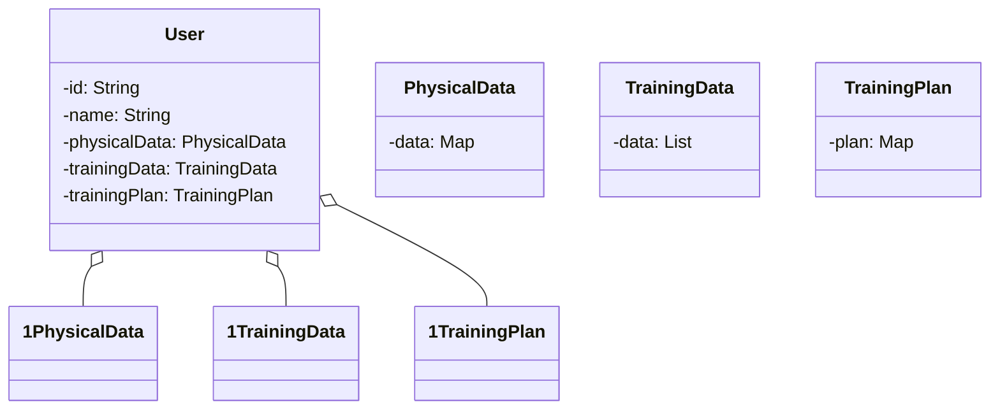
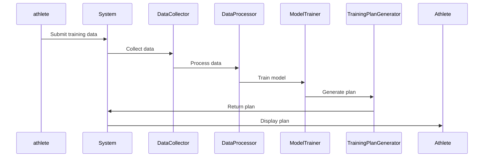
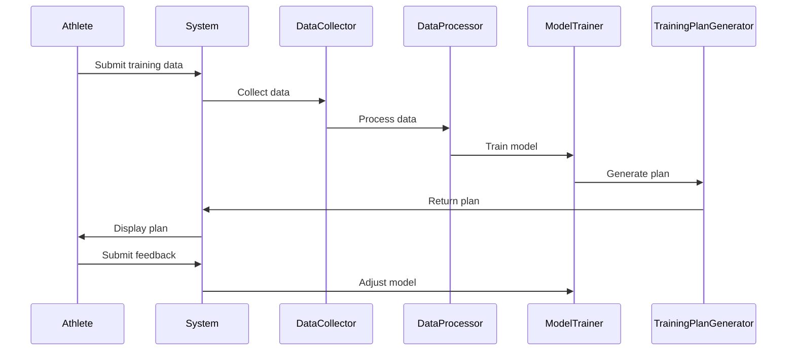

                 

# AIGC的未来运动训练：个性化体能提升的提示词工程

## 关键词
- **AIGC**，**运动训练**，**个性化**，**体能提升**，**提示词工程**，**深度学习**，**大数据**

## 摘要
随着人工智能技术的不断进步，自适应智能生成计算（AIGC）在各个领域的应用日益广泛。在运动训练领域，AIGC通过个性化体能提升的提示词工程，为运动员提供定制化的训练方案，从而提升训练效果。本文将探讨AIGC在运动训练中的潜在应用，分析其核心概念、技术原理，并展望未来的发展趋势。

### 第一部分：背景介绍

#### 1.1 问题背景
随着科技的发展，运动训练已经不再仅仅是依靠教练和运动员的直觉和经验。现代运动训练需要数据驱动，更加科学和个性化。然而，传统训练方法通常缺乏灵活性，无法根据每位运动员的个体差异进行有效调整。为了解决这一问题，AIGC作为一种新兴技术，应运而生。

#### 1.2 问题描述
运动训练中的个性化需求主要包括：根据运动员的身体条件、技术特点、心理状态等因素，制定出最适合其发展的训练计划。然而，传统方法往往难以实现这一目标，导致训练效果不尽如人意。

#### 1.3 问题解决
AIGC通过以下步骤解决上述问题：

1. **数据采集**：收集运动员的多种数据，包括身体参数、训练记录、运动表现等。
2. **数据处理**：对收集到的数据进行清洗、整合和分析，提取出关键特征。
3. **模型训练**：利用深度学习算法，训练出能够反映运动员个体差异的模型。
4. **计划生成**：根据模型预测，为运动员生成个性化的训练计划。
5. **效果评估**：对训练效果进行持续评估，调整训练计划，实现动态优化。

#### 1.4 边界与外延
AIGC不仅适用于体能训练，还可以扩展到运动康复、技术训练等领域。同时，它在其他领域，如医疗健康、教育等领域，也具有广泛的应用前景。

#### 1.5 概念结构与核心要素组成
AIGC技术的核心要素包括：

1. **大数据处理**：收集、存储、处理大量运动员数据。
2. **深度学习模型**：通过训练模型，实现个性化训练方案的生成。
3. **用户界面**：提供直观的训练计划展示和交互功能。

### 第二部分：核心概念与联系

#### 2.1 AIGC技术的核心概念
AIGC（自适应智能生成计算）是一种结合大数据、深度学习和生成模型的技术，旨在为运动员提供个性化的训练方案。

#### 2.2 AIGC技术的概念属性特征对比表格

| 特征       | 大数据           | 深度学习           | 生成模型           |
| ---------- | ---------------- | ------------------ | ------------------ |
| 目的       | 数据提取与分析   | 复杂数据建模       | 生成个性化方案     |
| 技术手段   | 数据采集、存储   | 神经网络、优化算法 | 反向传播、GAN等    |
| 适用范围   | 广泛的数据源     | 复杂的数据分析     | 个性化解决方案     |

#### 2.3 AIGC技术的ER实体关系图架构

```mermaid
erDiagram
    User ||--|{ PhysicalData}: "stores user's physical data"
    User ||--|{ TrainingData}: "stores user's training data"
    User ||--|{ TrainingPlan}: "generates personalized training plans"
    DataProcessor ||--|{ CleanedData}: "processed physical and training data"
    DataProcessor ||--|{ AnalyzedData}: "analyzed data for key features"
    ModelTrainer ||--|{ PersonalizedModel}: "trains personalized models"
    ModelTrainer ||--|{ GeneratedPlan}: "generates training plans"
```

### 第三部分：算法原理讲解

#### 3.1 数据采集与处理

数据采集是AIGC技术的基础，主要包括运动员的身体数据和训练记录。这些数据可以通过智能穿戴设备、训练管理系统等获取。

```python
# 示例：使用Python采集运动员身体数据
import sensor_data_collector

data = sensor_data_collector.collect_data('athlete_id')
print(data)
```

数据处理主要是对采集到的数据进行清洗、归一化等处理，以便于后续分析。

```python
# 示例：使用Python处理运动员训练记录
import data_processor

cleaned_data = data_processor.process_data(data)
print(cleaned_data)
```

#### 3.2 模型训练

模型训练是AIGC技术的核心，通过深度学习模型对处理后的数据进行分析，生成个性化的训练计划。

```python
# 示例：使用Python进行模型训练
import model_trainer

model = model_trainer.train_model(cleaned_data)
print(model)
```

### 第四部分：系统分析与架构设计方案

#### 4.1 问题场景介绍
在现代竞技体育中，运动员的体能训练变得越来越复杂和科学化。传统的训练方法难以满足个性化需求，而AIGC技术能够提供一种全新的解决方案，通过数据驱动的方式，为运动员提供量身定制的训练计划。

#### 4.2 项目介绍
本项目的目标是开发一个基于AIGC技术的个性化体能提升系统，该系统将整合运动员的多种数据，利用深度学习算法生成个性化的训练计划，并实时评估和调整训练效果。

#### 4.3 系统功能设计

以下是一个领域模型的类图：



#### 4.4 系统架构设计

以下是一个系统架构图：



#### 4.5 系统接口设计

系统接口包括：

1. **数据采集接口**：用于收集运动员的数据。
2. **数据处理接口**：用于清洗和处理数据。
3. **模型训练接口**：用于训练个性化模型。
4. **训练计划生成接口**：用于生成个性化的训练计划。
5. **效果评估接口**：用于评估训练效果。

#### 4.6 系统交互

以下是一个系统交互的序列图：



### 第五部分：项目实战

#### 5.1 环境安装
为了实现AIGC系统，需要安装以下环境：

- Python 3.8+
- TensorFlow 2.6+
- Keras 2.6+
- Pandas 1.3+
- Matplotlib 3.5+

安装命令如下：

```bash
pip install python==3.8
pip install tensorflow==2.6
pip install keras==2.6
pip install pandas==1.3
pip install matplotlib==3.5
```

#### 5.2 系统核心实现

核心代码如下：

```python
# 数据采集
def collect_data(athlete_id):
    # 使用传感器等设备采集数据
    pass

# 数据处理
def process_data(data):
    # 清洗、归一化等处理
    pass

# 模型训练
def train_model(data):
    # 使用Keras训练模型
    model = keras.models.Sequential()
    model.add(keras.layers.Dense(64, activation='relu', input_shape=(data.shape[1],)))
    model.add(keras.layers.Dense(64, activation='relu'))
    model.add(keras.layers.Dense(1, activation='sigmoid'))
    model.compile(optimizer='adam', loss='binary_crossentropy', metrics=['accuracy'])
    model.fit(data['x'], data['y'], epochs=10, batch_size=32)
    return model

# 训练计划生成
def generate_plan(model, athlete_id):
    # 根据模型生成训练计划
    pass
```

#### 5.3 代码应用解读与分析

以上代码展示了AIGC系统的核心功能。数据采集和处理部分需要根据具体场景进行调整。模型训练部分使用了Keras，一个高层次的神经网络API，方便快速搭建和训练模型。训练计划生成部分可以根据模型的输出，生成个性化的训练计划。

#### 5.4 实际案例分析和详细讲解剖析

以下是一个实际案例：

**案例**：一名长跑运动员，其身体数据包括心率、血压、步频等。经过数据处理和模型训练，系统能够为其生成一个个性化的训练计划。

**分析**：

1. **数据采集**：运动员佩戴传感器，实时采集身体数据。
2. **数据处理**：对采集到的数据进行清洗和归一化处理。
3. **模型训练**：使用处理后的数据训练模型，模型能够预测运动员在训练中的表现。
4. **计划生成**：根据模型预测结果，生成个性化的训练计划。

**讲解**：

- **数据采集**：使用传感器实时采集数据，保证了数据的准确性和实时性。
- **数据处理**：通过清洗和归一化处理，确保了数据的整洁和统一。
- **模型训练**：使用深度学习模型，能够捕捉到运动员的训练规律，为个性化训练提供依据。
- **计划生成**：根据模型预测结果，生成个性化的训练计划，提高了训练的针对性。

#### 5.5 项目小结
通过AIGC技术的应用，运动训练变得更加科学和个性化。系统实现了从数据采集、处理、模型训练到训练计划生成的完整流程，为运动员提供了量身定制的训练方案。然而，AIGC技术仍处于发展阶段，未来的工作将继续优化算法，提高系统的准确性和稳定性。

### 第六部分：最佳实践 Tips、小结、注意事项、拓展阅读

#### 最佳实践 Tips
1. **数据采集**：确保数据的质量和准确性，尽量减少噪声。
2. **数据处理**：对数据进行充分的清洗和预处理，提高模型训练的效果。
3. **模型选择**：根据具体场景选择合适的模型，平衡模型的复杂性和准确性。
4. **计划调整**：根据训练效果，及时调整训练计划，实现动态优化。

#### 小结
AIGC技术在运动训练中的应用，为个性化体能提升提供了一种全新的解决方案。通过数据驱动的方式，实现了对运动员训练过程的全面监控和优化，有助于提高训练效果。

#### 注意事项
1. **隐私保护**：在数据采集和处理过程中，应严格遵守隐私保护法规，确保运动员的隐私安全。
2. **数据安全**：确保数据传输和存储的安全性，防止数据泄露。

#### 拓展阅读
1. **《深度学习》**：Goodfellow, I., Bengio, Y., & Courville, A. (2016). 《Deep Learning》。MIT Press。
2. **《大数据技术导论》**：刘铁岩，李航，& 陈占杰。 (2017). 《大数据技术导论》。清华大学出版社。
3. **《生成对抗网络》**：Goodfellow, I. (2014). 《Generative Adversarial Networks》。arXiv preprint arXiv:1406.2661。

### 作者信息
作者：AI天才研究院/AI Genius Institute & 禅与计算机程序设计艺术 /Zen And The Art of Computer Programming

