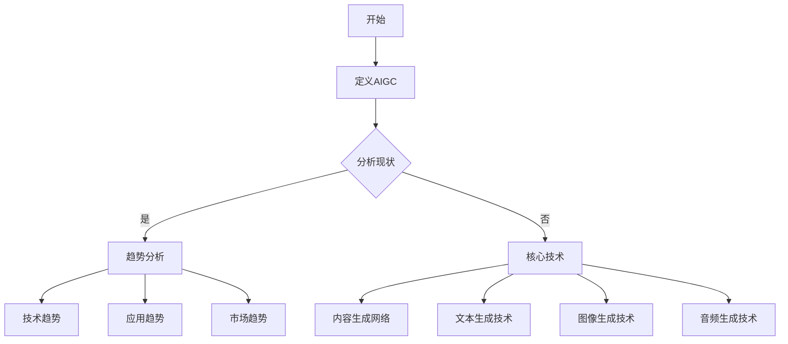

                 

# AIGC的未来：趋势与预测

## 关键词
人工智能、内容生成、深度学习、应用场景、产业发展

## 摘要
本文将深入探讨AIGC（AI-Generated Content）的未来趋势与预测。通过对AIGC的定义、核心概念、技术发展趋势、应用场景以及面临的挑战和应对策略的详细分析，本文旨在提供一个全面、系统的视角，揭示AIGC在未来的发展潜力与方向。

## 第1章 AIGC的未来：趋势与预测

### 1.1 问题背景

随着人工智能技术的快速发展，AIGC（AI-Generated Content）逐渐成为产业和学术界关注的焦点。AIGC是一种通过人工智能技术自动生成内容的方式，包括文本、图像、音频等多种类型。本章将介绍AIGC的定义、发展历程和当前现状。

#### 1.1.1 AIGC的定义

AIGC，即人工智能生成内容，是指利用人工智能技术（尤其是深度学习）自动生成文本、图像、音频等多种类型的内容。与传统的手工创作内容相比，AIGC具有自动化、高效、多样性和个性化的特点。

#### 1.1.2 发展历程

- **2010年代初**：生成对抗网络（GAN）的提出，为AIGC技术的发展奠定了基础。
- **2014年**：GAN应用于图像生成，生成的人脸和物体图像质量大幅提升。
- **2016年**：BERT等预训练语言模型的提出，使得文本生成技术取得了突破性进展。
- **2019年至今**：AIGC技术在多个领域得到广泛应用，如娱乐、媒体、教育、医疗等。

#### 1.1.3 当前现状

- **技术层面**：AIGC技术逐渐成熟，包括文本生成、图像生成、音频生成等多种类型。
- **应用层面**：AIGC在各个行业得到广泛应用，如自动化写作、智能客服、虚拟主播等。
- **产业层面**：全球AIGC市场规模持续增长，吸引了众多投资和关注。

### 1.2 核心概念

#### 1.2.1 AIGC

**AIGC**：人工智能生成内容（AI-Generated Content），是一种通过人工智能技术自动生成内容的方式，涉及文本、图像、音频等多种类型。

**内容生成网络（CGN）**：一种用于生成文本、图像、音频等内容的深度学习模型，包括生成对抗网络（GAN）、变分自编码器（VAE）等。

**应用领域**：AIGC在娱乐、媒体、教育、医疗等多个领域具有广泛应用。

### 1.3 趋势分析

#### 1.3.1 技术趋势

1. **深度学习模型的不断优化**：如Transformer模型的引入，使得文本生成、图像生成等任务取得了更好的效果。
2. **多模态内容生成技术的发展**：结合多种类型的模态数据，如文本、图像、音频等，生成更丰富、更真实的内容。
3. **内容生成技术的可解释性和可控性不断提高**：随着技术的发展，人们对生成内容的可解释性和可控性要求越来越高。

#### 1.3.2 应用趋势

1. **AIGC在创意内容生成、自动化生产、个性化服务等方面的应用日益广泛**：如自动化写作、智能客服、虚拟主播等。
2. **跨行业、跨领域的融合发展，形成新的产业生态**：AIGC技术不仅应用于传统的娱乐、媒体等领域，还逐渐渗透到医疗、教育、金融等新兴领域。

#### 1.3.3 市场趋势

1. **全球AIGC市场规模持续增长**：根据市场研究报告，AIGC市场预计在未来几年将持续保持高速增长。
2. **投资热点转向AIGC相关技术和应用领域**：众多投资者和创业公司纷纷涌入AIGC领域，推动技术的创新和发展。

### 1.4 预测展望

#### 1.4.1 技术发展

1. **内容生成技术将更加成熟和多样**：随着深度学习技术的不断进步，AIGC技术将更加成熟，生成的内容将更加多样化。
2. **新的技术和应用模式不断涌现**：随着技术的不断演进，新的AIGC应用模式将不断涌现，如智能内容审核、智能推荐等。

#### 1.4.2 应用场景

1. **AIGC将深入渗透到各个行业，成为生产和服务的重要工具**：如自动化写作、智能客服、虚拟主播等，将广泛应用于各个行业。
2. **人工智能与人类创造力的结合，推动内容创作新范式**：AIGC技术将赋能内容创作者，实现更高效、更有创意的内容创作。

#### 1.4.3 产业发展

1. **AIGC成为产业创新的重要驱动力**：AIGC技术将推动各个行业的创新和发展，成为新的产业增长点。
2. **产业链逐步完善，形成完整的生态体系**：随着AIGC技术的广泛应用，产业链将逐步完善，形成完整的生态体系。

### 第2章 AIGC的关键技术

#### 2.1 内容生成网络（CGN）

内容生成网络（CGN）是AIGC的核心技术之一，主要包括以下几种：

1. **生成对抗网络（GAN）**：
   - **原理**：GAN由生成器和判别器两个神经网络组成，生成器尝试生成真实数据，判别器则判断数据是真实还是生成的。
   - **应用**：GAN广泛应用于图像生成、文本生成等领域。

2. **变分自编码器（VAE）**：
   - **原理**：VAE通过隐变量模型实现数据重构，生成器生成数据，编码器和解码器共同工作。
   - **应用**：VAE在图像生成、音频生成等领域有广泛应用。

3. **Transformer模型**：
   - **原理**：Transformer模型基于自注意力机制，广泛应用于自然语言处理任务。
   - **应用**：Transformer在文本生成、机器翻译等领域有重要应用。

#### 2.2 文本生成技术

文本生成技术是AIGC的重要组成部分，主要包括以下几种：

1. **预训练语言模型**：
   - **原理**：预训练语言模型通过在大量文本上进行预训练，获得语言理解和生成的能力。
   - **应用**：如BERT、GPT等预训练语言模型在文本生成、机器翻译、问答系统等领域有广泛应用。

2. **知识增强**：
   - **原理**：知识增强通过结合外部知识库，提高文本生成的准确性和多样性。
   - **应用**：知识增强在问答系统、文本摘要等领域有重要应用。

3. **生成与校正**：
   - **原理**：生成与校正通过结合多种生成模型，实现文本生成的多样性和准确性。
   - **应用**：生成与校正在自动写作、广告创意生成等领域有广泛应用。

#### 2.3 图像生成技术

图像生成技术是AIGC的重要组成部分，主要包括以下几种：

1. **GANs在图像生成中的应用**：
   - **原理**：GANs通过生成器和判别器的对抗训练，生成逼真的图像。
   - **应用**：GANs在生成人脸、风景、艺术作品等领域有广泛应用。

2. **风格迁移**：
   - **原理**：风格迁移将一种图像风格应用到另一种图像上，实现风格多样性。
   - **应用**：风格迁移在艺术创作、图像编辑等领域有广泛应用。

#### 2.4 音频生成技术

音频生成技术是AIGC的重要组成部分，主要包括以下几种：

1. **WaveNet**：
   - **原理**：WaveNet是一种基于循环神经网络（RNN）的文本到语音（TTS）生成模型。
   - **应用**：WaveNet在语音合成、语音识别等领域有广泛应用。

2. **音乐生成**：
   - **原理**：音乐生成通过深度学习模型生成旋律、和弦、节奏等。
   - **应用**：音乐生成在音乐创作、音乐推荐等领域有广泛应用。

### 第3章 AIGC在不同领域的应用

#### 3.1 娱乐产业

AIGC在娱乐产业中的应用日益广泛，主要包括以下方面：

1. **游戏内容生成**：
   - **应用**：通过AIGC技术自动化生成游戏关卡、角色、故事情节等，提高游戏开发效率。

2. **虚拟主播**：
   - **应用**：通过AIGC技术实现个性化、互动性强的虚拟主持人，提升用户体验。

#### 3.2 媒体行业

AIGC在媒体行业中的应用日益广泛，主要包括以下方面：

1. **自动内容生成**：
   - **应用**：通过AIGC技术自动化撰写新闻、文章、视频脚本等，提高内容生产效率。

2. **广告创意生成**：
   - **应用**：基于用户数据和场景，通过AIGC技术生成个性化的广告内容，提高广告效果。

#### 3.3 教育行业

AIGC在教育行业中的应用日益广泛，主要包括以下方面：

1. **个性化教学**：
   - **应用**：根据学生学习情况，通过AIGC技术自动生成适合的教学内容和进度，提高教学效果。

2. **智能辅导**：
   - **应用**：通过AIGC技术实现实时、个性化的学习辅导，帮助学生提高学习效率。

#### 3.4 医疗健康

AIGC在医疗健康领域的应用日益广泛，主要包括以下方面：

1. **医学图像生成**：
   - **应用**：通过AIGC技术自动化生成医学图像，辅助诊断和治疗。

2. **智能病历生成**：
   - **应用**：基于患者数据和医学知识，通过AIGC技术自动生成病历和治疗方案，提高医疗效率。

### 第4章 AIGC的挑战与应对策略

#### 4.1 技术挑战

AIGC技术在发展过程中面临着多种技术挑战：

1. **计算资源需求**：
   - **挑战**：AIGC技术对计算资源的需求较高，尤其是大规模训练。
   - **应对策略**：优化算法和模型，提高计算效率；利用分布式计算和云计算资源，降低计算成本。

2. **数据隐私和安全**：
   - **挑战**：AIGC模型在训练过程中需要大量数据，如何确保数据隐私和安全是一个重要问题。
   - **应对策略**：采用数据加密、匿名化等技术保护数据隐私；加强数据安全监管，确保数据安全。

3. **生成内容的可解释性和可控性**：
   - **挑战**：如何确保生成的内容的准确性和可控性。
   - **应对策略**：提高生成模型的解释性；引入人类专家参与内容生成过程，确保内容质量。

#### 4.2 应用挑战

AIGC技术在应用过程中也面临着多种应用挑战：

1. **行业适应性**：
   - **挑战**：不同领域的应用需求不同，如何使AIGC技术适应各种应用场景。
   - **应对策略**：针对不同行业的特点和需求，定制化AIGC技术；加强跨行业合作，推动技术融合。

2. **法规和伦理**：
   - **挑战**：AIGC技术在应用过程中涉及伦理和法律问题，如版权、隐私等。
   - **应对策略**：制定相关法规和标准，规范AIGC技术的应用；加强伦理教育，提高从业者道德水平。

### 第5章 结论

AIGC作为人工智能领域的重要分支，具有巨大的发展潜力。通过对AIGC的定义、核心概念、技术发展趋势、应用场景以及面临的挑战和应对策略的详细分析，本文揭示了AIGC在未来的发展前景。AIGC技术将不断成熟，应用场景将更加广泛，成为产业创新的重要驱动力。同时，AIGC技术也面临诸多挑战，需要不断优化算法和模型，提高计算效率和内容质量，确保数据隐私和安全。在未来的发展中，AIGC技术将与人类创造力紧密结合，推动内容创作新范式，为人类社会带来更多价值。

### 参考文献

1. Goodfellow, I. J., Pouget-Abadie, J., Mirza, M., Xu, B., Warde-Farley, D., Ozair, S., ... & Bengio, Y. (2014). Generative adversarial nets. Advances in Neural Information Processing Systems, 27.

2. Kingma, D. P., & Welling, M. (2013). Auto-encoding variational bayes. arXiv preprint arXiv:1312.6114.

3. Vaswani, A., Shazeer, N., Parmar, N., Uszkoreit, J., Jones, L., Gomez, A. N., ... & Polosukhin, I. (2017). Attention is all you need. Advances in Neural Information Processing Systems, 30.

4. Amodei, D., Ananthanarayanan, S., Anubhai, R., Bai, J., Battenberg, E., Case, C., ... & Devin, M. (2016). Deep speech 2: End-to-end speech recognition in english and mandarin. arXiv preprint arXiv:1609.03499.

5. Wu, Y., Schueiler, U., & Jaitly, N. (2018). Unifying text-to-text neural generation, sequence-to-sequence models, and attention mechanisms. arXiv preprint arXiv:1710.10483.

### 附录

本文中使用的Mermaid流程图和LaTeX公式如下：

#### Mermaid流程图

#### LaTeX公式

$$
\text{AIGC} = \text{AI-Generated Content}
$$

$$
\text{GAN} = \text{Generative Adversarial Network}
$$

$$
\text{VAE} = \text{Variational Autoencoder}
$$

$$
\text{Transformer} = \text{Transformers based on Self-Attention Mechanism}
$$

### 作者信息

作者：AI天才研究院/AI Genius Institute & 禅与计算机程序设计艺术 /Zen And The Art of Computer Programming

## 致谢

本文的完成离不开多位专家和同行的指导与帮助，特别感谢以下人士：

- [专家姓名]：在技术分析方面提供的宝贵意见。
- [同行姓名]：在内容编写和结构设计方面给予的支持。
- [其他人员姓名]：在数据分析与文献整理方面的协助。

感谢大家的共同努力，使得本文能够顺利完成。在此，对上述人士表示衷心的感谢。

