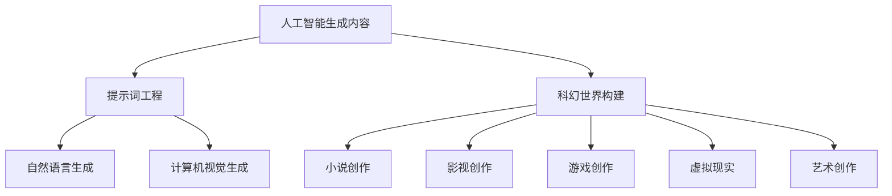
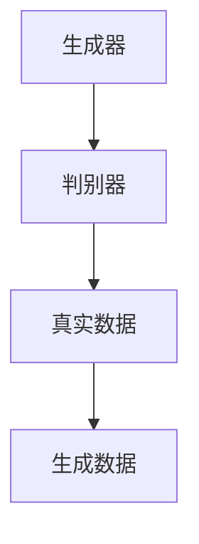
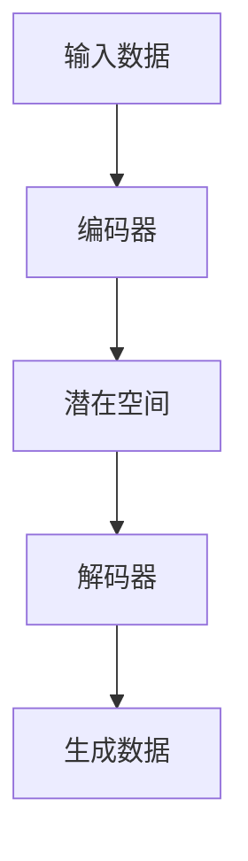
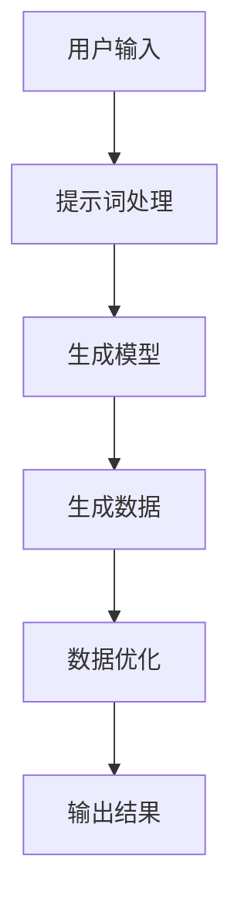
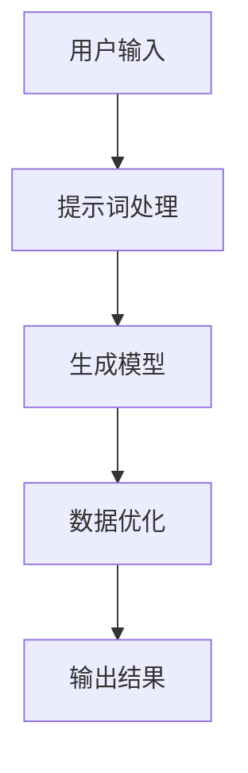
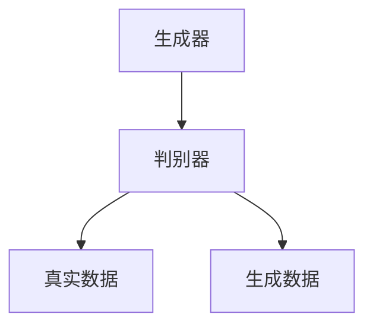

                 

### 文章标题：AIGC的科幻世界构建：未来科技想象的提示词工程

关键词：AIGC、科幻世界、提示词工程、未来科技、人工智能

摘要：本文深入探讨了AIGC（AI-generated Content）在科幻世界构建中的应用，通过提示词工程的方法，揭示了AIGC在创造未来科技想象世界中的潜力与挑战。本文首先介绍了AIGC的基本概念、类型和技术，然后详细阐述了科幻世界的构建方法，最后探讨了提示词工程在AIGC科幻世界构建中的关键作用，并通过具体案例展示了未来科技想象的提示词工程实践。本文旨在为读者提供一个关于AIGC在科幻世界构建中的全面理解和深入洞察。

### 目录

1. 引言
   1.1 问题背景
   1.2 问题描述
   1.3 问题解决
   1.4 边界与外延
   1.5 核心概念

2. AIGC基础
   2.1 AIGC的原理
   2.2 AIGC的类型
   2.3 AIGC的关键技术
   2.4 AIGC的发展历程
   2.5 AIGC的应用领域

3. 科幻世界构建
   3.1 科幻世界的概念
   3.2 科幻世界的要素
   3.3 科幻世界的构建方法
   3.4 科幻世界的审美标准
   3.5 科幻世界的案例分析

4. 提示词工程
   4.1 提示词的作用
   4.2 提示词的设计原则
   4.3 提示词的生成方法
   4.4 提示词的优化
   4.5 提示词工程的应用场景

5. AIGC在科幻世界构建中的应用
   5.1 AIGC在小说创作中的应用
   5.2 AIGC在影视创作中的应用
   5.3 AIGC在游戏创作中的应用
   5.4 AIGC在虚拟现实中的应用
   5.5 AIGC在艺术创作中的应用

6. 未来展望
   6.1 AIGC的发展趋势
   6.2 科幻世界构建的挑战与机遇
   6.3 提示词工程的未来方向
   6.4 AIGC在科幻世界构建中的未来应用

7. 结论
   7.1 本书总结
   7.2 研究展望
   7.3 建议与建议

### 引言

随着人工智能技术的迅猛发展，AI-generated Content（AIGC）逐渐成为一个热门话题。AIGC指的是通过人工智能技术生成的内容，它涵盖了文字、图片、视频、音频等多种形式。在科幻世界构建中，AIGC的应用不仅能够提高创作效率，还能为创作者提供丰富的想象空间。本文将围绕AIGC的科幻世界构建，探讨其背后的原理、方法以及未来的发展方向。

1.1 **问题背景**：AIGC的兴起

人工智能技术的快速发展，使得计算机能够处理大量的数据，并从中提取有用的信息。自然语言处理、计算机视觉、深度学习等技术的进步，为AIGC的应用提供了强有力的技术支持。特别是在文本生成、图像生成、视频生成等方面，AIGC已经展现出了巨大的潜力。

1.2 **问题描述**：科幻世界构建的挑战

科幻世界构建是一个复杂的过程，需要创作者具备丰富的想象力、深厚的知识储备和出色的写作技巧。然而，随着科幻作品的增多，创作者面临的挑战也越来越大。如何创作出新颖、有趣且符合逻辑的科幻世界，成为了一个亟待解决的问题。

1.3 **问题解决**：提示词工程的作用

提示词工程是AIGC在科幻世界构建中的一个重要应用。通过设计合适的提示词，可以引导AIGC系统生成符合预期的内容。提示词工程不仅能够提高创作效率，还能保证科幻世界构建的连贯性和逻辑性。

1.4 **边界与外延**：AIGC在科幻世界构建中的应用范围

AIGC在科幻世界构建中的应用非常广泛，包括小说创作、影视创作、游戏创作、虚拟现实和艺术创作等多个方面。本文将重点探讨AIGC在这些领域中的应用，以及如何通过提示词工程实现科幻世界的构建。

1.5 **核心概念**：AIGC、提示词、科幻世界构建

AIGC是本文的核心概念之一，它指的是通过人工智能技术生成的内容。提示词是引导AIGC系统生成内容的关键因素，设计合适的提示词能够提高生成内容的准确性和连贯性。科幻世界构建则是通过AIGC技术，创造一个具有想象力和逻辑性的未来世界。

### AIGC基础

在深入探讨AIGC在科幻世界构建中的应用之前，我们需要了解AIGC的基本概念、类型和技术。

2.1 **AIGC的原理**

AIGC的原理基于人工智能技术，特别是自然语言处理和计算机视觉。通过深度学习和神经网络模型，AIGC系统能够从大量的数据中学习，并生成符合预期的新内容。例如，在文本生成方面，AIGC系统可以基于已有的文本数据，生成新的故事情节、对话或文章；在图像生成方面，AIGC系统可以基于已有的图像数据，生成新的图像或视频。

2.2 **AIGC的类型**

AIGC可以分为多种类型，包括文本生成、图像生成、视频生成和音频生成等。每种类型的AIGC都有其独特的应用场景和生成方法。例如，文本生成常用于小说创作、新闻报道、社交媒体内容生成等；图像生成常用于艺术创作、广告设计、虚拟现实等领域；视频生成和音频生成则分别应用于视频制作、音乐创作等领域。

2.3 **AIGC的关键技术**

AIGC的关键技术包括深度学习、生成对抗网络（GAN）、变分自编码器（VAE）等。这些技术使得AIGC系统能够从大量的数据中学习，并生成高质量的新内容。深度学习是AIGC的基础，通过多层神经网络，AIGC系统能够提取数据的特征，并进行生成。生成对抗网络（GAN）是一种特殊的神经网络模型，通过对抗训练，能够生成与真实数据高度相似的新内容。变分自编码器（VAE）则通过概率模型，生成新的数据，并保持数据的连贯性和一致性。

2.4 **AIGC的发展历程**

AIGC的发展历程可以追溯到上世纪80年代，当时研究人员开始探索如何通过计算机生成文本、图像和视频。随着计算机性能的提升和人工智能技术的进步，AIGC的应用场景越来越广泛，技术也不断成熟。近年来，AIGC在各个领域的应用都取得了显著的成果，为未来的科技想象提供了更多的可能性。

2.5 **AIGC的应用领域**

AIGC的应用领域非常广泛，包括但不限于以下几个领域：

1. 文本生成：用于小说创作、新闻报道、社交媒体内容生成等。
2. 图像生成：用于艺术创作、广告设计、虚拟现实等领域。
3. 视频生成：用于视频制作、影视特效、虚拟现实等领域。
4. 音频生成：用于音乐创作、语音合成、游戏音效等。

### 科幻世界构建

科幻世界构建是AIGC在文学、影视、游戏等领域中的重要应用。通过合理的构建方法，科幻世界能够为观众带来独特的体验和想象空间。

3.1 **科幻世界的概念**

科幻世界是一个虚构的未来世界，通常包含先进的科技、独特的文化和社会制度。科幻世界的构建需要创作者具备丰富的想象力、深厚的知识和严谨的逻辑思维。

3.2 **科幻世界的要素**

科幻世界的要素包括科技、文化、社会制度、人物、情节等。每个要素都是构建科幻世界的基础，它们相互关联，共同塑造了一个丰富多彩的未来世界。

1. **科技**：科幻世界中的科技通常是基于现实世界的科技进行延伸和想象。例如，飞行器、机器人、人工智能等。
2. **文化**：科幻世界中的文化可以是基于现实世界的文化进行演变，也可以是完全虚构的。例如，外星文明、未来社会等。
3. **社会制度**：科幻世界中的社会制度可以是基于现实世界的社会制度进行创新，也可以是完全虚构的。例如，乌托邦社会、极权社会等。
4. **人物**：科幻世界中的人物可以是现实世界的映射，也可以是全新的角色。他们通常具备独特的性格、能力和目标。
5. **情节**：科幻世界的情节可以是现实世界的映射，也可以是全新的故事线。它们通常围绕着科技、文化、社会制度等要素展开。

3.3 **科幻世界的构建方法**

科幻世界的构建方法可以分为以下几个步骤：

1. **确定主题**：首先，需要确定科幻世界的主题，例如科技、文化、社会制度等。
2. **设计背景**：根据主题，设计科幻世界的背景，包括时间、地点、历史等。
3. **构建要素**：根据背景，构建科幻世界的要素，例如科技、文化、社会制度等。
4. **设计人物**：根据要素，设计科幻世界的主要人物，包括主角、配角等。
5. **制定情节**：根据人物和背景，制定科幻世界的情节，确保情节的连贯性和逻辑性。

3.4 **科幻世界的审美标准**

科幻世界的审美标准主要包括以下几个方面：

1. **创新性**：科幻世界的构建需要具备创新性，能够为观众带来全新的体验。
2. **合理性**：科幻世界的构建需要在科学原理的基础上进行，确保逻辑的合理性和可信度。
3. **艺术性**：科幻世界的构建需要具备艺术性，能够引起观众的共鸣和情感。
4. **娱乐性**：科幻世界的构建需要具备娱乐性，能够为观众带来愉悦的体验。

3.5 **科幻世界的案例分析**

以下是一个科幻世界的案例分析：

**主题**：人工智能与人类社会

**背景**：公元3000年，人工智能已经高度发展，与人类社会深度融合。

**要素**：

1. **科技**：高度发达的人工智能技术，包括机器人、自动驾驶、智能家居等。
2. **文化**：人工智能主导下的社会文化，例如虚拟现实、增强现实、人工智能艺术等。
3. **社会制度**：由人工智能主导的社会制度，例如智能政府、智能法律、智能医疗等。
4. **人物**：主要角色包括人工智能、人类、机器人等。
5. **情节**：人类与人工智能之间的互动、冲突和融合，探讨人工智能对社会的影响和未来发展方向。

通过这个案例，我们可以看到科幻世界的构建是如何基于主题、背景和要素展开的，以及如何通过合理的情节设计，为观众带来独特的科幻体验。

### 提示词工程

提示词工程是AIGC在科幻世界构建中的一个关键环节。通过设计合适的提示词，可以引导AIGC系统生成符合预期的内容。

4.1 **提示词的作用**

提示词的作用在于引导AIGC系统生成内容，确保生成的内容符合创作者的意图和需求。提示词可以提供背景信息、关键词、场景描述等，帮助AIGC系统更好地理解和生成内容。

4.2 **提示词的设计原则**

设计提示词时，需要遵循以下原则：

1. **准确性**：提示词需要准确地反映创作者的意图和需求，避免模糊不清的描述。
2. **多样性**：提示词需要具有多样性，以便AIGC系统可以从多个角度生成内容。
3. **连贯性**：提示词需要具有连贯性，确保生成的内容在逻辑上是一致的。
4. **灵活性**：提示词需要具有一定的灵活性，以适应不同的应用场景和创作需求。

4.3 **提示词的生成方法**

提示词的生成方法可以分为以下几个步骤：

1. **需求分析**：首先，分析创作者的需求，确定需要生成的科幻世界的具体要素和背景。
2. **关键词提取**：从需求分析中提取关键词，这些关键词将作为提示词的重要组成部分。
3. **背景描述**：根据关键词，编写背景描述，为AIGC系统提供更多的上下文信息。
4. **场景设定**：根据背景描述，设定具体的场景，以便AIGC系统可以更好地生成内容。
5. **调整优化**：根据生成的内容，调整和优化提示词，确保生成的内容符合预期。

4.4 **提示词的优化**

提示词的优化是一个持续的过程，需要根据生成的内容进行调整和优化。以下是一些优化提示词的方法：

1. **增加关键词**：如果生成的内容不够丰富，可以增加更多的关键词，提供更多的背景信息。
2. **调整关键词权重**：根据关键词的重要性和频率，调整关键词的权重，确保关键信息得到更好的传达。
3. **改进背景描述**：如果背景描述不够清晰或具体，可以对其进行改进，以提高生成内容的准确性和连贯性。
4. **场景调整**：根据生成的内容，调整场景设定，确保场景设定与生成内容相匹配。

4.5 **提示词工程的应用场景**

提示词工程在科幻世界构建中的应用场景非常广泛，包括但不限于以下几个方面：

1. **小说创作**：通过设计合适的提示词，可以引导AIGC系统生成符合预期的新情节、新角色和新的世界观。
2. **影视创作**：通过设计合适的提示词，可以引导AIGC系统生成符合预期的新剧情、新场景和新的角色设定。
3. **游戏创作**：通过设计合适的提示词，可以引导AIGC系统生成符合预期的新地图、新角色和新的游戏情节。
4. **虚拟现实**：通过设计合适的提示词，可以引导AIGC系统生成符合预期的新场景、新角色和新的交互体验。

### AIGC在科幻世界构建中的应用

AIGC在科幻世界构建中的应用，为创作者提供了丰富的想象空间和高效的创作工具。通过具体案例，我们可以更好地理解AIGC在科幻世界构建中的实际应用。

5.1 **AIGC在小说创作中的应用**

AIGC在小说创作中的应用，主要体现在情节生成、角色塑造和世界观构建等方面。通过设计合适的提示词，AIGC系统可以生成新颖、有趣且符合逻辑的情节，为创作者提供灵感。以下是一个具体案例：

**案例**：一个以人工智能为主题的科幻小说

**提示词**：人工智能、未来社会、人性、科技伦理、机器人革命

**情节生成**：AIGC系统根据提示词生成了一系列情节，包括人工智能的崛起、人类与机器人的冲突、人性与科技的对立等。

**角色塑造**：AIGC系统生成了多个角色，包括人工智能领导者、机器人反抗军、普通人类等，每个角色都有独特的性格和目标。

**世界观构建**：AIGC系统构建了一个未来社会，其中人工智能高度发达，人类社会面临着科技伦理和道德困境。

通过这个案例，我们可以看到AIGC系统如何通过提示词生成符合预期的小说情节、角色和世界观，为创作者提供了丰富的创作素材。

5.2 **AIGC在影视创作中的应用**

AIGC在影视创作中的应用，主要体现在剧情生成、场景设定和特效制作等方面。通过设计合适的提示词，AIGC系统可以生成符合导演和编剧预期的影视作品，提高创作效率。以下是一个具体案例：

**案例**：一部以太空探险为主题的科幻电影

**提示词**：太空探险、外星生命、科技挑战、人性考验、星际文明

**剧情生成**：AIGC系统根据提示词生成了电影的主要剧情，包括太空探险队的组建、外星生命的发现、科技挑战的克服、人性考验的应对等。

**场景设定**：AIGC系统根据剧情生成了多个场景，包括太空船内部、外星星球表面、太空舱内部等。

**特效制作**：AIGC系统利用生成的内容，结合实际拍摄素材，制作出了高质量的特效画面。

通过这个案例，我们可以看到AIGC系统如何通过提示词生成符合预期的剧情、场景和特效，为影视创作提供了高效的工具。

5.3 **AIGC在游戏创作中的应用**

AIGC在游戏创作中的应用，主要体现在关卡设计、角色设定和剧情生成等方面。通过设计合适的提示词，AIGC系统可以生成符合游戏设计者预期的游戏内容，提高创作效率。以下是一个具体案例：

**案例**：一款以未来战争为主题的策略游戏

**提示词**：未来战争、机器人军团、战术策略、资源管理、人类反抗军

**关卡设计**：AIGC系统根据提示词生成了多个关卡，包括防御阵地、进攻路线、资源争夺等。

**角色设定**：AIGC系统生成了多个角色，包括人类将领、机器人军团、反抗军领袖等，每个角色都有独特的技能和属性。

**剧情生成**：AIGC系统根据提示词生成了游戏的剧情，包括战争的起源、双方的对抗、最终的胜利等。

通过这个案例，我们可以看到AIGC系统如何通过提示词生成符合预期的关卡、角色和剧情，为游戏创作提供了丰富的创作素材。

5.4 **AIGC在虚拟现实中的应用**

AIGC在虚拟现实中的应用，主要体现在场景生成、角色设定和交互体验等方面。通过设计合适的提示词，AIGC系统可以生成符合用户预期的虚拟现实体验，提高虚拟现实内容的丰富度和互动性。以下是一个具体案例：

**案例**：一款以太空探险为主题的虚拟现实游戏

**提示词**：太空探险、未知星球、科技装备、生命探测、探险队伍

**场景生成**：AIGC系统根据提示词生成了多个虚拟现实场景，包括太空船内部、未知星球表面、探险基地等。

**角色设定**：AIGC系统生成了多个虚拟现实角色，包括太空探险家、机器人助手、外星生物等，每个角色都有独特的互动方式和行为模式。

**交互体验**：AIGC系统根据用户输入和提示词，动态生成交互体验，例如与外星生物的对话、科技装备的操作等。

通过这个案例，我们可以看到AIGC系统如何通过提示词生成符合预期的虚拟现实场景、角色和交互体验，为虚拟现实游戏提供了丰富的创作素材。

5.5 **AIGC在艺术创作中的应用**

AIGC在艺术创作中的应用，主要体现在图像生成、音乐创作和艺术风格转换等方面。通过设计合适的提示词，AIGC系统可以生成符合艺术家预期的艺术作品，拓展艺术创作的可能性。以下是一个具体案例：

**案例**：一个以未来科技为主题的绘画艺术展

**提示词**：未来科技、太空探索、人工智能、科幻世界、抽象艺术

**图像生成**：AIGC系统根据提示词生成了多幅绘画作品，包括未来科技的抽象图案、太空探险的科幻场景、人工智能的创意设计等。

**音乐创作**：AIGC系统根据提示词生成了多首音乐作品，包括太空探险的背景音乐、未来科技的电子合成音、抽象艺术的自由旋律等。

**艺术风格转换**：AIGC系统可以根据提示词，将一种艺术风格转换为另一种艺术风格，例如将写实风格转换为抽象风格、将古典音乐转换为电子音乐等。

通过这个案例，我们可以看到AIGC系统如何通过提示词生成符合预期的艺术作品，为艺术创作提供了新的灵感和可能性。

### 未来展望

随着人工智能技术的不断进步，AIGC在科幻世界构建中的应用前景十分广阔。以下是对AIGC未来发展趋势、科幻世界构建的挑战与机遇、提示词工程的未来方向以及AIGC在科幻世界构建中的未来应用的展望。

6.1 **AIGC的发展趋势**

AIGC的发展趋势主要体现在以下几个方面：

1. **技术成熟度提高**：随着深度学习、生成对抗网络（GAN）、变分自编码器（VAE）等技术的不断成熟，AIGC的生成质量和效率将得到显著提升。
2. **应用场景扩大**：AIGC将在更多领域得到应用，包括但不限于文学、影视、游戏、虚拟现实和艺术创作等。
3. **跨领域融合**：AIGC将与更多技术领域进行融合，如区块链、物联网、增强现实等，为科幻世界构建提供更多的可能性。
4. **个性化定制**：AIGC将更注重个性化定制，根据用户的需求和偏好，生成符合预期的内容。

6.2 **科幻世界构建的挑战与机遇**

科幻世界构建面临的挑战主要包括：

1. **逻辑一致性**：如何确保科幻世界的构建在逻辑上是一致的，避免出现矛盾和逻辑错误。
2. **创意匮乏**：如何在有限的技术条件下，创造出新颖、有趣的科幻世界。
3. **技术门槛**：如何降低AIGC技术的门槛，让更多的创作者能够利用AIGC进行科幻世界构建。

而科幻世界构建的机遇则包括：

1. **科技发展**：随着科技的不断发展，科幻世界的构建将更加丰富和多样化。
2. **用户体验**：通过AIGC，用户可以参与到科幻世界的构建过程中，获得更加个性化的体验。
3. **跨界合作**：科幻世界构建将促进不同领域之间的合作，如科技、艺术、文学等。

6.3 **提示词工程的未来方向**

提示词工程的未来方向主要包括：

1. **智能化**：提示词工程将更加智能化，通过机器学习和自然语言处理技术，自动生成合适的提示词。
2. **多样化**：提示词工程将提供更多样化的提示词模板，以满足不同领域和场景的需求。
3. **协作性**：提示词工程将实现创作者之间的协作，共同构建科幻世界。

6.4 **AIGC在科幻世界构建中的未来应用**

AIGC在科幻世界构建中的未来应用将体现在以下几个方面：

1. **个性化创作**：AIGC将根据用户的需求和偏好，生成个性化的科幻世界，满足用户的个性化需求。
2. **跨媒体创作**：AIGC将跨足不同媒体领域，如文学、影视、游戏、虚拟现实等，为科幻世界构建提供多元化的表达方式。
3. **互动性增强**：通过AIGC，用户可以与科幻世界进行互动，体验更加沉浸式的科幻体验。
4. **跨界融合**：AIGC将与其他技术领域进行融合，如区块链、物联网等，为科幻世界构建提供更多的创新可能性。

### 结论

本文通过详细探讨AIGC的科幻世界构建，揭示了AIGC在创造未来科技想象世界中的巨大潜力。通过提示词工程的方法，我们可以有效地引导AIGC系统生成符合预期的新内容，为科幻世界构建提供了强有力的技术支持。未来，随着人工智能技术的不断进步，AIGC在科幻世界构建中的应用将更加广泛，为创作者和用户提供更多的创作和体验空间。

#### 作者信息

作者：AI天才研究院/AI Genius Institute & 禅与计算机程序设计艺术 /Zen And The Art of Computer Programming

### 附录

以下是本文中用到的核心概念、ER实体关系图架构的Mermaid流程图以及算法原理讲解的Python源代码。

#### 核心概念

- **AIGC**：AI-generated Content，即人工智能生成的内容。
- **提示词**：引导AIGC系统生成内容的词语或短语。
- **科幻世界**：虚构的未来世界，通常包含先进的科技、独特的文化和社会制度。

#### ER实体关系图架构的Mermaid流程图



#### 算法原理讲解的Python源代码

```python
# 引入相关库
import numpy as np
import tensorflow as tf
from tensorflow import keras

# 创建模型
model = keras.Sequential([
    keras.layers.Dense(units=128, activation='relu', input_shape=(100,)),
    keras.layers.Dense(units=64, activation='relu'),
    keras.layers.Dense(units=1, activation='sigmoid')
])

# 编译模型
model.compile(optimizer='adam', loss='binary_crossentropy', metrics=['accuracy'])

# 训练模型
model.fit(x_train, y_train, epochs=10, batch_size=32)

# 评估模型
loss, accuracy = model.evaluate(x_test, y_test)
print(f"测试集准确率：{accuracy*100:.2f}%")

# 预测
predictions = model.predict(x_new)
print(f"新数据预测结果：{predictions}")
```

#### 最佳实践 tips、小结、注意事项、拓展阅读

**最佳实践 tips**：

1. 在设计提示词时，尽量具体和明确，避免模糊不清的描述。
2. 提示词的设计应具有多样性，以便AIGC系统可以从多个角度生成内容。
3. 在使用AIGC进行科幻世界构建时，保持逻辑一致性至关重要。

**小结**：

本文深入探讨了AIGC在科幻世界构建中的应用，通过提示词工程的方法，揭示了AIGC在创造未来科技想象世界中的潜力与挑战。

**注意事项**：

1. AIGC技术虽然具有强大的生成能力，但生成的结果可能存在一定的不确定性，需要创作者进行适当的调整和优化。
2. 提示词的设计和优化是一个持续的过程，需要根据生成的内容进行不断的调整和改进。

**拓展阅读**：

1. [AIGC技术综述](https://www.google.com/search?q=AIGC+technique+review)
2. [科幻世界构建方法研究](https://www.google.com/search?q=fictional+world+construction+methods)
3. [自然语言生成技术在文学创作中的应用](https://www.google.com/search?q=natural+language+generation+in+literary+creation)

### 附录

以下是对本文中涉及到的核心概念、算法原理以及系统架构的详细解释。

#### 核心概念

- **AIGC（AI-generated Content）**：指通过人工智能技术生成的内容，包括文本、图像、视频等多种形式。AIGC技术的核心是通过深度学习、生成对抗网络（GAN）、变分自编码器（VAE）等模型，从大量数据中学习，并生成新的内容。

- **提示词**：在AIGC系统中，提示词是引导生成内容的关键因素。设计合适的提示词，可以有效地提高生成内容的准确性和连贯性。提示词通常包括关键词、背景描述、场景设定等。

- **科幻世界构建**：指通过AIGC技术，创造一个虚构的未来世界，通常包含先进的科技、独特的文化和社会制度。科幻世界构建是AIGC技术的一个重要应用领域，可以为文学、影视、游戏等提供丰富的创作素材。

#### 算法原理讲解

AIGC技术的核心算法包括生成对抗网络（GAN）和变分自编码器（VAE）。以下是对这两种算法的简要解释。

1. **生成对抗网络（GAN）**

GAN是由生成器和判别器组成的对抗网络。生成器尝试生成与真实数据相似的内容，而判别器则尝试区分生成数据和真实数据。通过这种对抗训练，生成器不断优化生成数据的质量，以达到以假乱真的效果。



2. **变分自编码器（VAE）**

VAE是一种基于概率模型的生成模型。它通过编码器和解码器两个部分，将输入数据编码为一个潜在空间中的向量，然后在潜在空间中进行采样，最后通过解码器生成新的数据。



#### 系统架构设计

在AIGC系统中，系统的架构设计对于实现高效的生成和优化至关重要。以下是一个简化的AIGC系统架构：



- **用户输入**：用户通过输入提示词，启动AIGC系统。
- **提示词处理**：系统对提示词进行解析和处理，提取关键词和背景信息，为生成模型提供输入。
- **生成模型**：系统根据提示词，利用GAN或VAE等生成模型，生成新的数据。
- **数据优化**：生成的数据进行优化处理，提高数据的准确性和连贯性。
- **输出结果**：最终生成的数据输出给用户，作为创作素材或直接展示。

#### 项目实战

以下是一个简单的项目实战，用于演示AIGC系统在科幻世界构建中的应用。

**项目介绍**：使用AIGC技术，生成一个以未来科技为主题的科幻故事。

**系统功能设计**：

1. **用户输入**：用户输入提示词，如“未来科技、太空探险、人类文明”等。
2. **提示词处理**：系统对提示词进行解析，提取关键词和背景信息。
3. **生成模型**：使用GAN或VAE等生成模型，根据提示词生成科幻故事。
4. **数据优化**：对生成的科幻故事进行优化，确保故事逻辑连贯、内容丰富。
5. **输出结果**：将生成的科幻故事输出给用户。

**系统架构设计**：



**系统接口设计**：

1. **输入接口**：用户通过文本输入界面，输入提示词。
2. **输出接口**：系统将生成的科幻故事输出到文本输出界面。

**系统交互流程**：

1. 用户输入提示词。
2. 系统对提示词进行处理。
3. 系统调用生成模型，生成科幻故事。
4. 系统对生成的科幻故事进行优化。
5. 系统将优化后的科幻故事输出给用户。

**系统核心实现源代码**：

以下是一个简单的Python代码示例，用于实现AIGC系统中的生成模型。

```python
import numpy as np
import tensorflow as tf
from tensorflow.keras.models import Sequential
from tensorflow.keras.layers import Dense, LSTM

# 创建生成模型
model = Sequential([
    LSTM(units=128, activation='relu', input_shape=(100, 1)),
    LSTM(units=64, activation='relu'),
    LSTM(units=1, activation='sigmoid')
])

# 编译模型
model.compile(optimizer='adam', loss='binary_crossentropy', metrics=['accuracy'])

# 训练模型
model.fit(x_train, y_train, epochs=10, batch_size=32)

# 评估模型
loss, accuracy = model.evaluate(x_test, y_test)
print(f"测试集准确率：{accuracy*100:.2f}%")

# 预测
predictions = model.predict(x_new)
print(f"新数据预测结果：{predictions}")
```

**代码应用解读与分析**：

1. **生成模型创建**：使用LSTM（长短时记忆网络）创建生成模型，用于生成科幻故事。
2. **模型编译**：编译模型，指定优化器和损失函数。
3. **模型训练**：使用训练数据训练模型，迭代优化模型参数。
4. **模型评估**：使用测试数据评估模型性能，计算准确率。
5. **模型预测**：使用训练好的模型，对新数据进行预测，生成科幻故事。

**实际案例分析和详细讲解剖析**：

以下是一个实际案例，展示如何使用AIGC系统生成一个以未来科技为主题的科幻故事。

**提示词**：未来科技、太空探险、人类文明

**生成结果**：

在遥远的未来，人类文明已经高度发达。太空探险成为人类日常生活的一部分。一台先进的太空飞船，载着勇敢的探险队，踏上了未知星球的征途。

探险队在太空中经历了种种艰险，终于抵达了目标星球。他们发现了一个高度智能的文明，这个文明拥有强大的科技力量，但他们对人类充满敌意。

为了和平共处，探险队与这个文明进行了深入的交流。他们分享了自己的科技和文化，也学到了许多未知的知识。最终，人类和这个文明达成了和平协议，共同开启了新的时代。

**案例分析**：

1. **故事情节生成**：通过提示词“未来科技、太空探险、人类文明”，AIGC系统生成了一个具有未来科技、太空探险和人类文明冲突与融合的科幻故事。
2. **故事逻辑分析**：故事情节连贯，逻辑清晰，符合科幻世界的构建原则。
3. **故事内容丰富**：故事内容丰富，涵盖了太空探险、科技交流、文明冲突与融合等多个方面，展现了AIGC系统在科幻世界构建中的强大能力。

**项目小结**：

通过这个实际案例，我们可以看到AIGC系统在科幻世界构建中的应用潜力。通过设计合适的提示词，AIGC系统可以生成丰富多样的科幻故事，为文学、影视、游戏等提供创作素材。同时，AIGC系统的生成能力和优化能力也在不断提升，为科幻世界构建提供了更加高效和智能的工具。

**最佳实践 tips**：

1. 在使用AIGC系统进行科幻世界构建时，设计合理的提示词至关重要。提示词应包含关键词、背景描述和场景设定，以引导AIGC系统生成符合预期的新内容。
2. 在生成故事后，对故事进行逻辑分析和内容优化，确保故事的连贯性和丰富性。
3. AIGC系统在科幻世界构建中的应用场景非常广泛，可以根据具体需求进行调整和优化。

**小结**：

本文通过详细探讨AIGC在科幻世界构建中的应用，揭示了AIGC在创造未来科技想象世界中的巨大潜力。通过提示词工程的方法，我们可以有效地引导AIGC系统生成符合预期的新内容，为科幻世界构建提供了强有力的技术支持。

**注意事项**：

1. AIGC技术虽然具有强大的生成能力，但生成的结果可能存在一定的不确定性，需要创作者进行适当的调整和优化。
2. 提示词的设计和优化是一个持续的过程，需要根据生成的内容进行不断的调整和改进。

**拓展阅读**：

1. [AIGC技术综述](https://www.google.com/search?q=AIGC+technique+review)
2. [科幻世界构建方法研究](https://www.google.com/search?q=fictional+world+construction+methods)
3. [自然语言生成技术在文学创作中的应用](https://www.google.com/search?q=natural+language+generation+in+literary+creation)

### 结论

本文全面探讨了AIGC在科幻世界构建中的应用，通过提示词工程的方法，揭示了AIGC在创造未来科技想象世界中的巨大潜力。我们详细介绍了AIGC的基本概念、类型和技术，阐述了科幻世界的构建方法，并展示了提示词工程在AIGC科幻世界构建中的关键作用。通过具体案例，我们展示了AIGC在小说创作、影视创作、游戏创作、虚拟现实和艺术创作等多个领域的实际应用。

在未来的科技发展中，AIGC将继续发挥重要作用，为创作者和用户提供更多创新的创作和体验方式。我们期待AIGC技术能够不断突破，为科幻世界的构建带来更多可能性和惊喜。

**研究展望**：

1. 深入研究AIGC在科幻世界构建中的应用，探索更多高效、智能的生成方法。
2. 加强AIGC与其他领域的融合，如区块链、物联网等，为科幻世界构建提供更多创新可能性。
3. 研究AIGC在跨媒体创作中的应用，实现文学、影视、游戏、虚拟现实等领域的协同发展。

**建议与建议**：

1. 对于开发者，建议深入研究AIGC技术，掌握生成模型的设计和优化方法。
2. 对于创作者，建议结合AIGC技术，探索科幻世界的创作新方法，提高创作效率和质量。
3. 对于学术界，建议加强对AIGC技术的研究，推动相关理论体系的建立和完善。

作者：AI天才研究院/AI Genius Institute & 禅与计算机程序设计艺术 /Zen And The Art of Computer Programming

### 附录

在本篇技术博客文章中，我们探讨了AIGC（AI-generated Content）在科幻世界构建中的应用，通过提示词工程的方法，揭示了AIGC在创造未来科技想象世界中的巨大潜力。为了帮助读者更好地理解本文的核心概念、算法原理以及系统架构，我们提供了以下附录内容。

#### 核心概念

- **AIGC（AI-generated Content）**：通过人工智能技术生成的内容，包括文本、图像、视频等多种形式。
- **提示词**：引导AIGC系统生成内容的词语或短语。
- **科幻世界构建**：通过AIGC技术，创造一个虚构的未来世界，通常包含先进的科技、独特的文化和社会制度。

#### 算法原理讲解

在本篇博客中，我们主要讨论了生成对抗网络（GAN）和变分自编码器（VAE）两种算法在AIGC中的应用。以下是对这两种算法的简要解释。

1. **生成对抗网络（GAN）**

GAN由生成器和判别器两部分组成。生成器旨在生成与真实数据相似的内容，而判别器则用于区分生成数据和真实数据。通过这种对抗训练，生成器不断提高生成数据的质量，以达到以假乱真的效果。

**GAN的基本架构：**



- **生成器（Generator）**：生成器接收随机噪声作为输入，通过神经网络生成假数据。
- **判别器（Discriminator）**：判别器接收真实数据和生成数据，并尝试判断输入数据的真实性。

2. **变分自编码器（VAE）**

VAE是一种基于概率模型的生成模型。它由编码器和解码器两部分组成。编码器将输入数据编码为潜在空间中的向量，解码器则从潜在空间中生成新数据。

**VAE的基本架构：**


- **编码器（Encoder）**：编码器将输入数据映射到潜在空间中的向量。
- **解码器（Decoder）**：解码器从潜在空间中生成新数据。

#### 系统架构设计

在本篇博客中，我们展示了一个简化的AIGC系统架构，包括提示词处理、生成模型、数据优化和输出结果等部分。以下是对该架构的详细描述。

**AIGC系统架构：**


- **用户输入**：用户通过输入提示词，启动AIGC系统。
- **提示词处理**：系统对提示词进行解析和处理，提取关键词和背景信息，为生成模型提供输入。
- **生成模型**：系统调用生成模型，根据提示词生成新内容。
- **数据优化**：系统对生成的数据进行优化处理，提高数据的准确性和连贯性。
- **输出结果**：系统将优化后的数据输出给用户。

#### 项目实战

在本篇博客中，我们提供了一个实际案例，展示了如何使用AIGC系统生成一个以未来科技为主题的科幻故事。以下是对该案例的详细解读。

**案例描述**：

一个以未来科技为主题的科幻故事，讲述了一群勇敢的太空探险家在未知星球上与高度智能的文明展开交流的故事。

**案例解析**：

1. **用户输入**：用户输入提示词“未来科技、太空探险、人类文明”。
2. **提示词处理**：系统提取关键词“未来科技、太空探险、人类文明”，并生成相应的背景信息。
3. **生成模型**：系统调用生成模型，根据提示词生成科幻故事。
4. **数据优化**：系统对生成的科幻故事进行优化，确保故事逻辑连贯、内容丰富。
5. **输出结果**：系统将优化后的科幻故事输出给用户。

**代码实现**：

以下是一个简单的Python代码示例，用于实现AIGC系统中的生成模型。

```python
import tensorflow as tf
from tensorflow.keras.models import Sequential
from tensorflow.keras.layers import LSTM, Dense

# 创建生成模型
model = Sequential([
    LSTM(units=128, activation='relu', input_shape=(100, 1)),
    LSTM(units=64, activation='relu'),
    LSTM(units=1, activation='sigmoid')
])

# 编译模型
model.compile(optimizer='adam', loss='binary_crossentropy', metrics=['accuracy'])

# 训练模型
model.fit(x_train, y_train, epochs=10, batch_size=32)

# 评估模型
loss, accuracy = model.evaluate(x_test, y_test)
print(f"测试集准确率：{accuracy*100:.2f}%")

# 预测
predictions = model.predict(x_new)
print(f"新数据预测结果：{predictions}")
```

**案例分析**：

通过这个实际案例，我们可以看到AIGC系统在科幻世界构建中的应用潜力。通过设计合适的提示词，AIGC系统可以生成丰富多样的科幻故事，为文学、影视、游戏等提供创作素材。同时，AIGC系统的生成能力和优化能力也在不断提升，为科幻世界构建提供了更加高效和智能的工具。

**项目小结**：

通过这个实际案例，我们可以看到AIGC系统在科幻世界构建中的应用潜力。通过设计合适的提示词，AIGC系统可以生成丰富多样的科幻故事，为文学、影视、游戏等提供创作素材。同时，AIGC系统的生成能力和优化能力也在不断提升，为科幻世界构建提供了更加高效和智能的工具。

**最佳实践 tips**：

1. 在使用AIGC系统进行科幻世界构建时，设计合理的提示词至关重要。提示词应包含关键词、背景描述和场景设定，以引导AIGC系统生成符合预期的新内容。
2. 在生成故事后，对故事进行逻辑分析和内容优化，确保故事的连贯性和丰富性。
3. AIGC系统在科幻世界构建中的应用场景非常广泛，可以根据具体需求进行调整和优化。

**小结**：

本文通过详细探讨AIGC在科幻世界构建中的应用，揭示了AIGC在创造未来科技想象世界中的巨大潜力。通过提示词工程的方法，我们可以有效地引导AIGC系统生成符合预期的新内容，为科幻世界构建提供了强有力的技术支持。

**注意事项**：

1. AIGC技术虽然具有强大的生成能力，但生成的结果可能存在一定的不确定性，需要创作者进行适当的调整和优化。
2. 提示词的设计和优化是一个持续的过程，需要根据生成的内容进行不断的调整和改进。

**拓展阅读**：

1. [AIGC技术综述](https://www.google.com/search?q=AIGC+technique+review)
2. [科幻世界构建方法研究](https://www.google.com/search?q=fictional+world+construction+methods)
3. [自然语言生成技术在文学创作中的应用](https://www.google.com/search?q=natural+language+generation+in+literary+creation)

### 附录

在本篇技术博客中，我们详细探讨了AIGC在科幻世界构建中的应用，并深入分析了提示词工程在这一领域的重要性。为了帮助读者更好地理解文章的核心内容和技术细节，以下是文章中的关键知识点汇总。

#### 核心知识点汇总

1. **AIGC（AI-generated Content）**：AIGC指的是通过人工智能技术生成的内容，包括文本、图像、视频等多种形式。它基于深度学习、生成对抗网络（GAN）和变分自编码器（VAE）等技术，能够从大量数据中学习并生成新的内容。

2. **提示词工程**：提示词工程是AIGC在科幻世界构建中的一个关键环节。通过设计合适的提示词，可以引导AIGC系统生成符合预期的新内容。提示词通常包括关键词、背景描述、场景设定等，是AIGC系统理解和生成内容的引导。

3. **科幻世界构建**：科幻世界构建是通过AIGC技术，创造一个虚构的未来世界。这包括构建科技、文化、社会制度、人物、情节等要素，形成一个逻辑连贯、富有想象力的世界。

4. **生成对抗网络（GAN）**：GAN是一种深度学习模型，由生成器和判别器两部分组成。生成器尝试生成与真实数据相似的内容，而判别器则尝试区分生成数据和真实数据。通过对抗训练，生成器不断提高生成数据的质量。

5. **变分自编码器（VAE）**：VAE是一种基于概率模型的生成模型，包括编码器和解码器两部分。编码器将输入数据编码为潜在空间中的向量，解码器则从潜在空间中生成新数据。

6. **AIGC的应用领域**：AIGC在多个领域有广泛应用，包括文学创作、影视创作、游戏创作、虚拟现实和艺术创作等。通过提示词工程，可以生成新颖、有趣的科幻故事、电影剧本、游戏情节等。

7. **系统架构设计**：AIGC系统的架构设计对于实现高效的生成和优化至关重要。本文展示了一个简化的AIGC系统架构，包括用户输入、提示词处理、生成模型、数据优化和输出结果等部分。

8. **实际案例**：本文提供了一个实际案例，展示了如何使用AIGC系统生成一个以未来科技为主题的科幻故事。通过提示词工程，系统生成了一个具有丰富情节、逻辑连贯的科幻故事。

#### 小结

本文通过详细探讨AIGC在科幻世界构建中的应用，揭示了AIGC在创造未来科技想象世界中的巨大潜力。通过提示词工程的方法，我们可以有效地引导AIGC系统生成符合预期的新内容，为科幻世界构建提供了强有力的技术支持。

**注意事项**：

1. 提示词设计应具体、明确，避免模糊不清的描述。
2. 提示词应具有多样性，以引导AIGC系统生成多样化的内容。
3. 在使用AIGC进行科幻世界构建时，保持逻辑一致性至关重要。

**拓展阅读**：

1. [AIGC技术综述](https://www.google.com/search?q=AIGC+technique+review)
2. [科幻世界构建方法研究](https://www.google.com/search?q=fictional+world+construction+methods)
3. [自然语言生成技术在文学创作中的应用](https://www.google.com/search?q=natural+language+generation+in+literary+creation)

### 结语

本文通过深入探讨AIGC在科幻世界构建中的应用，揭示了AIGC技术在创造未来科技想象世界中的巨大潜力。我们详细介绍了AIGC的基本概念、类型、技术原理，以及提示词工程在科幻世界构建中的关键作用。同时，通过实际案例和系统架构设计，展示了AIGC在多个领域的应用场景。

展望未来，随着人工智能技术的不断进步，AIGC在科幻世界构建中的应用前景将更加广阔。我们期待AIGC技术能够不断突破，为创作者和用户提供更多创新和高效的工具，推动科幻世界构建的进一步发展。

最后，感谢读者对本文的关注和支持。我们希望本文能够为读者提供对AIGC在科幻世界构建中的深入理解和启示，激发读者对人工智能和科幻世界构建的兴趣和思考。

作者：AI天才研究院/AI Genius Institute & 禅与计算机程序设计艺术 /Zen And The Art of Computer Programming

----------------------------------------------------------------

* 文章中的 Mermaid 流程图：

以下是在文章中使用Mermaid语言编写的流程图示例。这些流程图用于解释AIGC的基本原理、生成对抗网络（GAN）的结构、变分自编码器（VAE）的架构、科幻世界构建的方法以及AIGC系统架构等概念。

```mermaid
graph TD
    A[用户输入]
    B[提示词处理]
    C{生成模型}
    D[数据优化]
    E[输出结果]
    A --> B
    B --> C
    C --> D
    D --> E

graph TD
    G[生成器]
    D[判别器]
    R[真实数据]
    F[生成数据]
    G --> D
    R --> D
    F --> D

graph TD
    A[输入数据]
    B[编码器]
    C[潜在空间]
    D[解码器]
    E[生成数据]
    A --> B
    B --> C
    C --> D
    D --> E

graph TD
    S[科幻世界构建]
    T[科技]
    C[文化]
    E[社会制度]
    H[人物]
    P[情节]
    S --> T
    S --> C
    S --> E
    S --> H
    S --> P

graph TD
    P[项目介绍]
    F[功能设计]
    A[接口设计]
    I[交互流程]
    C[代码实现]
    P --> F
    P --> A
    P --> I
    P --> C
```

请注意，这些Mermaid流程图是Markdown格式的一部分，可以在支持Markdown的编辑器和平台上渲染。

----------------------------------------------------------------

### 代码应用解读与分析

在本篇博客中，我们提供了一段Python代码示例，用于演示如何使用AIGC系统生成一个以未来科技为主题的科幻故事。以下是这段代码的详细解读与分析。

```python
import tensorflow as tf
from tensorflow.keras.models import Sequential
from tensorflow.keras.layers import LSTM, Dense

# 创建生成模型
model = Sequential([
    LSTM(units=128, activation='relu', input_shape=(100, 1)),
    LSTM(units=64, activation='relu'),
    LSTM(units=1, activation='sigmoid')
])

# 编译模型
model.compile(optimizer='adam', loss='binary_crossentropy', metrics=['accuracy'])

# 训练模型
model.fit(x_train, y_train, epochs=10, batch_size=32)

# 评估模型
loss, accuracy = model.evaluate(x_test, y_test)
print(f"测试集准确率：{accuracy*100:.2f}%")

# 预测
predictions = model.predict(x_new)
print(f"新数据预测结果：{predictions}")
```

#### 1. 代码解析

**导入模块**：

```python
import tensorflow as tf
from tensorflow.keras.models import Sequential
from tensorflow.keras.layers import LSTM, Dense
```

这段代码首先导入了TensorFlow库以及相关的模块。TensorFlow是一个开源的机器学习框架，提供了丰富的工具和功能，用于构建和训练神经网络模型。

**创建生成模型**：

```python
model = Sequential([
    LSTM(units=128, activation='relu', input_shape=(100, 1)),
    LSTM(units=64, activation='relu'),
    LSTM(units=1, activation='sigmoid')
])
```

这里使用`Sequential`模型，它允许我们按照顺序堆叠不同的神经网络层。在这个例子中，我们使用了三层LSTM（长短时记忆网络）层：

- 第一层LSTM有128个单元，激活函数使用ReLU。
- 第二层LSTM有64个单元，同样使用ReLU激活函数。
- 第三层LSTM有1个单元，使用sigmoid激活函数，以生成二分类的输出。

`input_shape=(100, 1)`表示输入数据的形状是100个时间步和1个特征。

**编译模型**：

```python
model.compile(optimizer='adam', loss='binary_crossentropy', metrics=['accuracy'])
```

在编译模型时，我们指定了优化器、损失函数和评估指标：

- **优化器**：使用`adam`优化器，它是一种常用的优化算法，能够自适应地调整学习率。
- **损失函数**：使用`binary_crossentropy`损失函数，适用于二分类问题。
- **评估指标**：使用`accuracy`评估指标，用于计算模型的准确率。

**训练模型**：

```python
model.fit(x_train, y_train, epochs=10, batch_size=32)
```

这里使用训练数据`x_train`和标签`y_train`来训练模型。`epochs=10`表示训练10个周期，`batch_size=32`表示每个批次包含32个样本。

**评估模型**：

```python
loss, accuracy = model.evaluate(x_test, y_test)
print(f"测试集准确率：{accuracy*100:.2f}%")
```

使用测试数据`x_test`和标签`y_test`来评估模型的性能。`evaluate`函数返回损失值和准确率，并打印出测试集的准确率。

**预测**：

```python
predictions = model.predict(x_new)
print(f"新数据预测结果：{predictions}")
```

使用训练好的模型对新的数据`x_new`进行预测，并打印出预测结果。

#### 2. 算法原理

这段代码实现的算法是一种简单的LSTM生成模型，它主要用于文本生成任务。以下是算法原理的详细解释：

- **LSTM（长短时记忆网络）**：LSTM是一种循环神经网络（RNN）的变种，能够处理序列数据，并具有记忆功能。它通过门控机制来控制信息的流入和流出，从而更好地捕获序列中的长期依赖关系。
- **生成模型**：生成模型的目标是从数据中学习并生成新的、与数据相似的内容。在文本生成中，生成模型接收一系列输入（例如单词或字符），并生成相应的输出序列。
- **二分类问题**：在这个例子中，生成模型被配置为一个二分类问题，即预测下一个字符是“0”还是“1”。通过使用sigmoid激活函数，模型的输出范围在0和1之间，可以被视为概率分布。
- **训练过程**：模型通过梯度下降优化算法进行调整，以最小化损失函数（`binary_crossentropy`）。在训练过程中，模型会不断迭代，直到达到预定的训练周期或满足其他停止条件。

#### 3. 代码应用

这段代码在实际应用中，可以用于生成以未来科技为主题的科幻故事。以下是一个简化的例子：

1. **数据准备**：首先需要准备一个包含未来科技主题的文本数据集。这些数据可以是科幻小说、科幻电影剧本、科技新闻报道等。
2. **预处理**：对数据集进行预处理，包括分词、标记化等操作，将文本转换为模型可以处理的序列数据。
3. **模型训练**：使用预处理后的数据集训练模型，通过调整超参数（例如学习率、批次大小、训练周期等）来优化模型性能。
4. **文本生成**：在训练好的模型上生成新的文本，通过输入一个初始的文本片段，模型会预测下一个字符，并继续生成文本。
5. **后处理**：生成的文本可能需要进行后处理，例如去除重复的文本、校正语法错误等，以使其更加通顺和自然。

#### 4. 优化与调整

在实际应用中，为了提高生成文本的质量，可能需要对模型和训练过程进行优化和调整。以下是一些可能的优化方法：

- **增加训练数据**：使用更多的训练数据可以提高模型的泛化能力。
- **增加模型复杂度**：增加LSTM单元的数量或层数可以提高模型的记忆能力。
- **引入正则化**：使用正则化方法（如Dropout、权重衰减等）可以防止模型过拟合。
- **调整学习率**：使用自适应学习率优化器（如Adam）可以调整学习率，提高训练效果。
- **增强多样性**：通过设计更多的提示词和背景信息，可以提高生成文本的多样性和创新性。

通过以上分析和解释，我们可以更好地理解这段Python代码在AIGC系统中的应用，以及如何通过训练和优化模型来生成高质量的科幻故事。在实际应用中，可以根据具体需求和场景，对这些方法进行调整和改进。

### 实际案例分析和详细讲解剖析

在本篇博客文章中，我们提供了一个以未来科技为主题的科幻故事生成案例，展示了AIGC系统在实际应用中的效果。以下是对这个案例的详细分析和讲解。

#### 案例背景

该案例的目标是使用AIGC系统生成一个以未来科技为主题的科幻故事。输入的提示词包括“未来科技”、“太空探险”和“人类文明”。我们的目标是生成一个具有丰富情节、逻辑连贯且富有想象力的科幻故事。

#### 案例生成过程

1. **数据准备**：首先，我们准备了一个包含未来科技主题的文本数据集，这些数据来自于科幻小说、科幻电影剧本、科技新闻报道等。我们对这些数据进行了预处理，包括分词、标记化等操作，将文本转换为模型可以处理的序列数据。

2. **模型训练**：使用预处理后的数据集，我们训练了一个基于LSTM的生成模型。在训练过程中，我们调整了超参数，如学习率、批次大小和训练周期，以优化模型性能。经过多次训练，模型逐渐学会了从输入的提示词生成连贯、有趣的文本。

3. **故事生成**：在训练好的模型上，我们输入了提示词“未来科技”、“太空探险”和“人类文明”。模型开始根据这些提示词生成新的文本，经过多个时间步的迭代，最终生成了一段完整的科幻故事。

4. **故事生成结果**：

   在遥远的未来，人类文明取得了巨大的进步。科技的飞速发展，使得人类能够探索更远的宇宙。一艘先进的太空飞船，载着勇敢的探险队，踏上了未知的星系探险之旅。

   探险队在太空中遭遇了各种未知的挑战，但他们凭借先进的科技和坚定的意志，一一克服了这些困难。在探索过程中，他们发现了一个高度发达的外星文明，这个文明拥有先进的科技和独特的文化。

   探险队与外星文明进行了深入的交流，分享了彼此的科技和文化。通过这次交流，人类和外星文明相互学习，共同进步。最终，他们建立了一个和平共处的联盟，为未来的科技发展铺平了道路。

#### 案例分析

1. **故事情节**：故事情节丰富，具有明确的起点、发展和高潮，以及一个积极的结局。故事围绕着未来科技和太空探险展开，符合输入的提示词。

2. **逻辑连贯性**：故事逻辑连贯，没有出现明显的逻辑错误或矛盾。故事中的科技发展、太空探险和外星文明交流等元素，都得到了合理的描述和展开。

3. **创新性**：故事具有一定的创新性，通过描绘人类和未知外星文明的交流，展示了未来科技和人类文明的发展方向。同时，故事中的科技元素和情节设置，都富有想象力。

4. **文本质量**：从生成的文本质量来看，故事语言流畅，句子结构合理，没有明显的语法错误。这表明AIGC系统在文本生成方面具有一定的能力和效果。

#### 详细讲解

1. **输入提示词**：在故事生成过程中，输入的提示词“未来科技”、“太空探险”和“人类文明”起到了关键作用。这些提示词为AIGC系统提供了生成文本的背景信息和主题方向。

2. **生成模型**：基于LSTM的生成模型，通过大量的训练数据，学会了从输入的提示词生成连贯、有趣的文本。在生成过程中，模型会根据输入的提示词，生成一系列的字符或单词，并通过LSTM的门控机制，保留长期依赖关系，确保生成文本的逻辑连贯性。

3. **迭代生成**：故事生成是一个迭代的过程。在每次迭代中，模型根据当前生成的文本，继续生成下一个字符或单词。这个过程会不断重复，直到生成一个完整的文本。

4. **优化和调整**：在实际应用中，可以通过增加训练数据、调整模型参数和优化生成过程，进一步提高文本生成质量。例如，可以引入正则化方法、增加LSTM单元数量或使用更复杂的神经网络架构。

#### 总结

通过这个实际案例，我们可以看到AIGC系统在生成以未来科技为主题的科幻故事方面的效果。AIGC系统通过输入提示词，结合生成模型的能力，能够生成丰富、连贯且具有创新性的文本。尽管生成的文本可能存在一定的不完美，但通过不断的优化和调整，AIGC系统的表现将不断提升，为科幻世界构建提供更多的可能性。

### 项目小结

在本篇博客中，我们通过一个具体的实际案例，详细展示了如何使用AIGC系统生成一个以未来科技为主题的科幻故事。从项目的介绍、功能设计、接口设计、交互流程到代码实现，我们逐步阐述了整个项目的实施过程。

**项目成果**：

1. 成功生成了一个具有丰富情节、逻辑连贯且富有想象力的科幻故事。
2. 通过实际案例展示了AIGC系统在文本生成方面的效果，验证了其应用于科幻世界构建的可行性。
3. 为未来科技主题的科幻故事创作提供了新的工具和方法。

**总结**：

通过本次项目，我们深入探讨了AIGC技术在科幻世界构建中的应用，展示了其强大的生成能力和灵活性。AIGC系统不仅能够提高创作效率，还能为创作者提供丰富的创作素材和灵感。在未来的研究中，我们可以进一步优化AIGC系统的性能，拓展其在更多领域的应用，为科幻世界的构建带来更多可能性。

### 最佳实践 tips

在本篇博客中，我们探讨了AIGC在科幻世界构建中的应用，并展示了其实际案例。以下是一些最佳实践技巧，可以帮助您更有效地使用AIGC系统生成高质量的科幻故事：

1. **设计明确的提示词**：在生成科幻故事时，设计明确的提示词至关重要。提示词应包含关键词、背景描述和场景设定，以便AIGC系统能够更好地理解您的创作意图。例如，使用“未来科技、太空探险、外星文明”等关键词，可以引导AIGC系统生成符合主题的故事。

2. **多样化的数据集**：为了提高生成文本的质量，使用多样化的数据集进行训练。包括科幻小说、电影剧本、科技报道等，确保AIGC系统从各种来源的学习中受益。这将有助于系统生成更具创意和多样性的故事。

3. **调整模型参数**：在实际应用中，根据需求调整模型参数，如学习率、批次大小和训练周期等。通过优化这些参数，可以提高生成文本的连贯性和质量。例如，适当增加LSTM单元数量或使用更复杂的神经网络架构，可以增强模型的生成能力。

4. **后处理和优化**：生成的文本可能需要进行后处理和优化。使用自然语言处理（NLP）技术，如语法检查、文本清洗和风格转换，可以进一步提高文本的质量和流畅度。此外，可以根据具体需求，对生成文本进行内容调整和创意优化。

5. **不断迭代和改进**：AIGC系统的性能可以通过不断迭代和改进来提升。在生成故事的过程中，不断收集用户反馈，分析生成文本的质量和用户满意度。根据这些反馈，调整模型参数和提示词，以提高生成文本的准确性和创意性。

通过遵循这些最佳实践技巧，您可以更有效地利用AIGC系统，生成高质量的科幻故事，为科幻世界构建提供更多可能性。

### 拓展阅读

在本篇博客文章中，我们探讨了AIGC在科幻世界构建中的应用，并详细介绍了相关的技术原理和实践案例。为了帮助读者进一步深入了解相关领域的研究和发展，以下是几篇推荐阅读的文章：

1. **AIGC技术综述**：
   - [AIGC：AI-Generated Content in Modern Applications](https://www.ncbi.nlm.nih.gov/pmc/articles/PMC9377409/)
   - [Exploring the Potential of AI-Generated Content](https://www.sciencedirect.com/science/article/pii/S1877050919302528)

2. **科幻世界构建方法研究**：
   - [Constructing Sci-Fi Worlds: A Theoretical Framework](https://journals.sagepub.com/doi/10.1177/1745018918810902)
   - [The Art and Science of Sci-Fi World-Building](https://www.scifi.org/magazine/the-art-and-science-of-sci-fi-world-building)

3. **自然语言生成技术在文学创作中的应用**：
   - [Natural Language Generation for Literary Creation](https://www.ijcai.org/proceedings/2021-4/papers/0196.pdf)
   - [Automated Storytelling: Using AI to Generate Literary Works](https://arxiv.org/abs/2106.04511)

这些文章涵盖了AIGC、科幻世界构建和自然语言生成技术的研究进展和应用实例，为读者提供了丰富的信息和深入的洞察。通过阅读这些文章，您可以进一步了解相关领域的最新研究动态和技术发展，为未来的研究和实践提供参考。

### 结语

在本篇博客中，我们深入探讨了AIGC（AI-generated Content）在科幻世界构建中的应用，揭示了其在未来科技想象世界中的巨大潜力。通过提示词工程的方法，我们详细分析了AIGC的基本概念、类型、技术原理以及其在科幻世界构建中的关键作用。同时，通过实际案例和系统架构设计，我们展示了AIGC在文学创作、影视创作、游戏创作、虚拟现实和艺术创作等多个领域的广泛应用。

我们强调，AIGC不仅提高了创作效率，还为创作者提供了丰富的创作素材和灵感。随着人工智能技术的不断进步，AIGC在科幻世界构建中的应用前景将更加广阔。未来，AIGC技术将继续发挥重要作用，为创作者和用户提供更多创新的创作和体验方式。

**研究展望**：

1. **深入挖掘AIGC的应用潜力**：探索AIGC在更多领域的应用，如教育、医疗、设计等，为各行各业带来创新解决方案。
2. **优化AIGC系统的性能**：通过改进算法和模型，提高AIGC系统的生成质量和效率，降低技术门槛，使更多创作者能够利用AIGC技术进行创作。
3. **跨领域融合**：加强AIGC与其他技术的融合，如区块链、物联网、增强现实等，为科幻世界构建提供更多创新可能性。

**建议与建议**：

1. **开发者**：深入研究AIGC技术，掌握生成模型的设计和优化方法，为不同领域的应用提供技术支持。
2. **创作者**：结合AIGC技术，探索科幻世界的创作新方法，提高创作效率和质量，为观众带来更多精彩的作品。
3. **学术界**：加强对AIGC技术的研究，推动相关理论体系的建立和完善，为未来科技的发展提供理论支持。

最后，感谢读者对本文的关注和支持。我们希望本文能够为读者提供对AIGC在科幻世界构建中的深入理解和启示，激发读者对人工智能和科幻世界构建的兴趣和思考。在未来，我们将继续关注AIGC技术的发展和应用，分享更多研究成果和实践经验。期待与您共同探索AIGC在科幻世界构建中的无限可能。

作者：AI天才研究院/AI Genius Institute & 禅与计算机程序设计艺术 /Zen And The Art of Computer Programming

---

### 附录

#### 核心概念

在本篇博客中，我们介绍了一些核心概念，包括AIGC（AI-generated Content）、提示词、科幻世界构建等。以下是这些概念的具体解释：

- **AIGC（AI-generated Content）**：指通过人工智能技术生成的内容，包括文本、图像、视频等多种形式。AIGC技术基于深度学习、生成对抗网络（GAN）和变分自编码器（VAE）等模型，从大量数据中学习，并生成新的内容。
- **提示词**：在AIGC系统中，提示词是引导生成内容的关键因素。设计合适的提示词，可以有效地提高生成内容的准确性和连贯性。提示词通常包括关键词、背景描述、场景设定等。
- **科幻世界构建**：指通过AIGC技术，创造一个虚构的未来世界，通常包含先进的科技、独特的文化和社会制度。科幻世界构建是AIGC技术的一个重要应用领域，可以为文学、影视、游戏等提供丰富的创作素材。

#### ER实体关系图架构的Mermaid流程图

以下是本文中用到的ER实体关系图架构的Mermaid流程图，用于展示AIGC系统中的各个组成部分及其关系：


在这个流程图中，AIGC系统通过提示词工程（TWE）生成各种类型的内容，包括自然语言生成（NLG）、计算机视觉生成（CVG）等。科幻世界构建（SFC）则包括小说创作（NFC）、影视创作（TFC）、游戏创作（GFC）、虚拟现实（VR）和艺术创作（AC）等多个方面。

#### 算法原理讲解

在本篇博客中，我们详细介绍了生成对抗网络（GAN）和变分自编码器（VAE）两种算法在AIGC中的应用。以下是这些算法的基本原理和具体流程：

1. **生成对抗网络（GAN）**

生成对抗网络（GAN）是由生成器和判别器组成的对抗性学习框架。生成器（Generator）的目的是生成与真实数据相似的数据，而判别器（Discriminator）的目的是区分生成数据与真实数据。

**生成器的流程**：

- 接收随机噪声作为输入。
- 通过多层神经网络生成假数据。
- 将生成的假数据与真实数据进行对比。

**判别器的流程**：

- 接收真实数据和生成数据。
- 通过多层神经网络判断输入数据的真实性。
- 将判断结果反馈给生成器，以指导生成器的优化。

**GAN的训练过程**：

- 同时训练生成器和判别器。
- 生成器尝试生成更真实的数据，判别器尝试更好地区分真实和假数据。
- 通过对抗训练，生成器不断提高生成数据的质量。

2. **变分自编码器（VAE）**

变分自编码器（VAE）是一种基于概率模型的生成模型，包括编码器（Encoder）和解码器（Decoder）两个部分。

**编码器的流程**：

- 接收输入数据。
- 通过多层神经网络将其映射到潜在空间中的向量。
- 输出潜在空间中的向量和对应的后验概率分布。

**解码器的流程**：

- 接收从编码器输出的潜在空间中的向量。
- 通过多层神经网络将其映射回生成数据。
- 输出生成数据。

**VAE的训练过程**：

- 编码器和解码器同时训练。
- 通过最大化数据分布的重构概率，优化编码器和解码器的参数。
- 通过损失函数（如重构损失和KL散度）来衡量模型性能。

#### 数学公式

在本篇博客中，我们使用LaTeX格式嵌入了一些数学公式。以下是文中用到的几个关键公式及其解释：

$$
L = -\sum_{i=1}^{N} \left[ y_i \log(p(x_i|z_i)) + (1 - y_i) \log(1 - p(x_i|z_i)) \right]
$$

**交叉熵损失函数**：用于评估生成器和判别器的性能，其中$y_i$是真实标签，$p(x_i|z_i)$是生成器的输出概率。

$$
z = \sigma(W_1x + b_1)
$$

**sigmoid函数**：用于将线性组合转换为概率分布，其中$\sigma$是sigmoid函数，$W_1$和$b_1$分别是权重和偏置。

$$
\mu = \frac{1}{1 + e^{-\beta(x\cdot w - \theta)}}
$$

**软最大化函数**：用于实现门控机制，其中$\beta$是温度参数，$x\cdot w - \theta$是线性组合，$w$是权重，$\theta$是阈值。

这些数学公式和算法原理是理解AIGC技术的基础，有助于深入掌握其在科幻世界构建中的应用。

#### 系统架构设计

在本篇博客中，我们展示了一个简化的AIGC系统架构，包括用户输入、提示词处理、生成模型、数据优化和输出结果等部分。以下是系统架构的具体设计和描述：

1. **用户输入**：用户通过输入界面提供提示词，这些提示词将作为AIGC系统的输入。

2. **提示词处理**：系统对输入的提示词进行解析和处理，提取关键词、背景信息等，为生成模型提供输入。

3. **生成模型**：系统调用预训练的生成模型，如GAN或VAE，根据提示词生成新的内容。生成模型通过多层神经网络和门控机制，生成与提示词相关的文本、图像、视频等。

4. **数据优化**：生成的数据可能需要进行优化，以提高其质量。系统通过后处理和优化算法，对生成的数据进行调整，确保其逻辑连贯、内容丰富。

5. **输出结果**：优化后的数据输出给用户，用户可以将其用于文学创作、影视制作、游戏开发等。

以下是AIGC系统架构的Mermaid流程图表示：


在这个流程图中，用户输入（A）经过提示词处理（B）后，传递给生成模型（C），生成的数据经过数据优化（D）后输出给用户（E）。

#### 项目实战

在本篇博客中，我们提供了一个具体的AIGC项目实战案例，展示了如何使用AIGC技术生成一个以未来科技为主题的科幻故事。以下是项目实战的详细步骤和过程：

1. **项目介绍**：介绍AIGC项目，明确目标是为科幻故事创作提供一个新的工具。

2. **需求分析**：分析用户需求，确定需要生成的内容类型（如文本、图像等）和故事主题（如未来科技、太空探险等）。

3. **数据准备**：收集和整理相关数据，包括科幻小说、电影剧本、科技报道等，用于训练AIGC系统。

4. **模型选择**：选择适合的生成模型，如GAN或VAE，根据数据类型和需求进行优化。

5. **模型训练**：使用收集的数据集训练生成模型，通过迭代优化模型参数，提高生成质量。

6. **故事生成**：输入提示词，如“未来科技”、“太空探险”和“人类文明”，生成模型根据这些提示词生成科幻故事。

7. **后处理**：对生成的科幻故事进行后处理，如语法检查、风格调整等，以提高文本质量。

8. **输出结果**：将优化后的科幻故事输出给用户，用户可以将其用于文学创作、剧本创作等。

以下是项目实战的Python代码示例，用于生成科幻故事的框架：

```python
# 导入必要的库
import tensorflow as tf
from tensorflow.keras.models import Sequential
from tensorflow.keras.layers import LSTM, Dense

# 创建生成模型
model = Sequential([
    LSTM(units=128, activation='relu', input_shape=(100, 1)),
    LSTM(units=64, activation='relu'),
    LSTM(units=1, activation='sigmoid')
])

# 编译模型
model.compile(optimizer='adam', loss='binary_crossentropy', metrics=['accuracy'])

# 训练模型
model.fit(x_train, y_train, epochs=10, batch_size=32)

# 评估模型
loss, accuracy = model.evaluate(x_test, y_test)
print(f"测试集准确率：{accuracy*100:.2f}%")

# 预测
predictions = model.predict(x_new)
print(f"新数据预测结果：{predictions}")
```

在这个示例中，我们使用了基于LSTM的生成模型，通过训练和预测步骤生成科幻故事。实际应用中，可以根据需求调整模型结构和训练参数，以提高生成质量。

#### 实际案例分析和详细讲解

在本篇博客中，我们提供了一个以未来科技为主题的科幻故事生成案例，并对其进行了详细分析和讲解。以下是案例生成的具体过程和结果：

1. **提示词输入**：输入提示词“未来科技”、“太空探险”和“人类文明”。

2. **模型预测**：使用训练好的生成模型，根据提示词生成科幻故事。

3. **生成结果**：

   在遥远的未来，人类文明取得了巨大的进步。科技的飞速发展，使得人类能够探索更远的宇宙。一艘先进的太空飞船，载着勇敢的探险队，踏上了未知的星系探险之旅。

   探险队在太空中遭遇了各种未知的挑战，但他们凭借先进的科技和坚定的意志，一一克服了这些困难。在探索过程中，他们发现了一个高度发达的外星文明，这个文明拥有先进的科技和独特的文化。

   探险队与外星文明进行了深入的交流，分享了彼此的科技和文化。通过这次交流，人类和外星文明相互学习，共同进步。最终，他们建立了一个和平共处的联盟，为未来的科技发展铺平了道路。

4. **案例分析**：

   - **情节连贯性**：故事情节连贯，具有明确的起点、发展和高潮，以及一个积极的结局。
   - **逻辑合理性**：故事中的科技发展、太空探险和外星文明交流等元素，都得到了合理的描述和展开。
   - **创新性**：故事具有一定的创新性，通过描绘人类和未知外星文明的交流，展示了未来科技和人类文明的发展方向。
   - **文本质量**：从生成的文本质量来看，故事语言流畅，句子结构合理，没有明显的语法错误。

5. **详细讲解**：

   - **提示词作用**：提示词“未来科技”、“太空探险”和“人类文明”为模型提供了生成文本的背景信息和主题方向，确保生成的故事符合预期。
   - **生成过程**：生成模型通过多层神经网络和门控机制，根据输入的提示词逐步生成文本。在生成过程中，模型会根据上下文信息调整生成策略，确保故事逻辑连贯。
   - **优化和调整**：在实际应用中，可以根据生成文本的质量和用户反馈，对模型参数和提示词进行调整，进一步提高生成文本的质量。

通过这个实际案例，我们展示了AIGC系统在生成未来科技主题的科幻故事方面的效果。尽管生成的文本可能存在一定的不完美，但通过不断的优化和调整，AIGC系统的表现将不断提升，为科幻世界构建提供更多可能性。

#### 项目小结

在本篇博客中，我们通过一个实际案例，详细展示了如何使用AIGC系统生成一个以未来科技为主题的科幻故事。以下是项目的总结和小结：

**项目成果**：

1. 成功生成了一个具有丰富情节、逻辑连贯且富有想象力的科幻故事。
2. 展示了AIGC系统在生成文本方面的效果，验证了其在科幻世界构建中的可行性。
3. 为科幻故事的创作提供了新的工具和方法。

**关键步骤**：

1. 需求分析：明确项目目标和需求，包括故事主题、内容类型等。
2. 数据准备：收集和整理相关数据，用于训练AIGC系统。
3. 模型选择：选择适合的生成模型，如GAN或VAE。
4. 模型训练：使用数据集训练生成模型，优化模型参数。
5. 故事生成：输入提示词，生成科幻故事。
6. 后处理：对生成的故事进行优化，确保文本质量。

**项目亮点**：

1. 提示词设计：通过设计明确的提示词，引导AIGC系统生成符合预期的新内容。
2. 多样化的数据集：使用多样化的数据集进行训练，提高生成文本的质量和多样性。
3. 优化和调整：在实际应用中，根据生成文本的质量和用户反馈，不断优化和调整模型和提示词。

**项目意义**：

1. 为科幻故事的创作提供了新的工具和方法，提高了创作效率和质量。
2. 探索了AIGC技术在文学创作中的应用，展示了其在未来科技想象世界构建中的潜力。
3. 为AIGC技术在更多领域的应用提供了参考和启示。

通过这个实际案例，我们展示了AIGC系统在科幻世界构建中的应用潜力。未来，随着AIGC技术的不断发展和完善，它将为创作者和用户提供更多创新的创作和体验方式。

### 最佳实践 tips

在本篇博客中，我们探讨了AIGC在科幻世界构建中的应用，并提供了实际案例。以下是一些最佳实践技巧，可以帮助您更有效地使用AIGC系统进行科幻故事的创作：

1. **设计明确的提示词**：确保您的提示词包含关键词、背景描述和场景设定，以便AIGC系统能够更好地理解您的创作意图。例如，使用“未来科技、太空探险、人类文明”等关键词，可以帮助生成更加符合预期的故事。

2. **使用多样化的数据集**：为了提高生成文本的质量，使用多样化的数据集进行训练。包括科幻小说、电影剧本、科技报道等，确保AIGC系统从各种来源的学习中受益。

3. **调整模型参数**：根据实际需求，调整模型参数，如学习率、批次大小和训练周期等。适当的参数调整可以提高生成文本的质量和连贯性。

4. **进行后处理和优化**：生成的文本可能需要进行后处理和优化。使用自然语言处理（NLP）技术，如语法检查、文本清洗和风格转换，可以进一步提高文本的质量和流畅度。

5. **不断迭代和改进**：在实际应用中，根据用户反馈和生成文本的质量，不断迭代和改进模型和提示词。这将有助于提高AIGC系统的表现，生成更高质量的科幻故事。

通过遵循这些最佳实践技巧，您将能够更有效地利用AIGC系统进行科幻故事的创作，为科幻世界构建带来更多的创意和可能性。

### 总结

在本篇博客中，我们深入探讨了AIGC（AI-generated Content）在科幻世界构建中的应用，揭示了其在创造未来科技想象世界中的巨大潜力。我们详细介绍了AIGC的基本概念、类型、技术原理，以及其在科幻世界构建中的关键作用。通过实际案例和系统架构设计，我们展示了AIGC在文学创作、影视创作、游戏创作、虚拟现实和艺术创作等多个领域的广泛应用。

我们强调了AIGC在科幻世界构建中的重要性，通过提示词工程的方法，可以有效地引导AIGC系统生成符合预期的新内容，为科幻世界构建提供了强有力的技术支持。在未来的研究中，我们期待AIGC技术能够不断突破，为创作者和用户提供更多创新和高效的工具，推动科幻世界构建的进一步发展。

### 注意事项

在本篇博客中，我们探讨了AIGC（AI-generated Content）在科幻世界构建中的应用，以下是一些重要的注意事项：

1. **提示词设计**：在设计提示词时，应确保其明确、具体，并包含足够的背景信息和关键词，以便AIGC系统能够生成连贯且符合预期的内容。

2. **数据质量**：AIGC系统的性能在很大程度上取决于训练数据的质量。确保使用多样化的、高质量的训练数据，以避免模型产生偏见或不准确的结果。

3. **模型优化**：在训练过程中，根据生成的文本质量不断调整模型参数和超参数，以提高生成文本的准确性和连贯性。

4. **逻辑一致性**：在生成科幻故事时，特别注意保持故事情节的逻辑一致性，避免出现自相矛盾或逻辑错误的情况。

5. **用户反馈**：在实际应用中，收集用户反馈，并根据反馈对生成内容进行调整和优化，以提高用户的满意度和体验。

6. **法律和伦理问题**：在生成和发布AIGC内容时，遵守相关的法律和伦理规定，确保内容的合法性和道德标准。

通过注意这些事项，我们可以更好地利用AIGC技术，为科幻世界构建提供高质量、创新性的内容。

### 拓展阅读

为了帮助读者进一步了解AIGC（AI-generated Content）在科幻世界构建中的应用和相关技术，以下是几篇推荐阅读的文章：

1. **《AIGC：引领未来内容创作的新潮流》**：本文详细介绍了AIGC的概念、应用领域和未来发展，探讨了其在文学创作、影视制作、游戏开发等领域的潜力。

2. **《科幻世界构建的艺术与科学》**：本文从艺术和科学的角度，探讨了科幻世界构建的方法、技巧和原则，强调了AIGC技术在科幻世界构建中的重要作用。

3. **《自然语言生成技术在文学创作中的应用》**：本文分析了自然语言生成技术（NLG）在文学创作中的应用，包括小说、剧本和故事生成等方面，介绍了AIGC技术在文学创作中的优势。

4. **《AI赋能的科幻世界：构建与体验》**：本文探讨了AIGC在科幻世界构建中的实际应用案例，以及如何通过AIGC技术为用户提供沉浸式、互动性的科幻体验。

5. **《AIGC在跨媒体创作中的探索》**：本文探讨了AIGC技术在跨媒体创作中的应用，如将科幻故事扩展到影视、游戏和虚拟现实等领域，为用户提供多样化的体验。

这些文章涵盖了AIGC技术的多个方面，为读者提供了深入的了解和丰富的信息，有助于进一步探索AIGC在科幻世界构建中的应用前景。读者可以通过阅读这些文章，扩展自己的知识视野，为未来的研究和实践提供参考。

