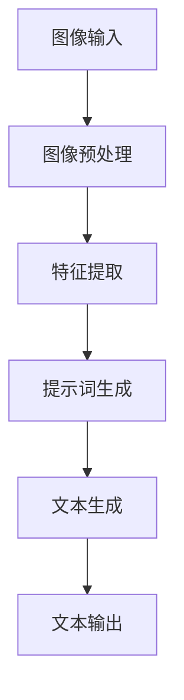
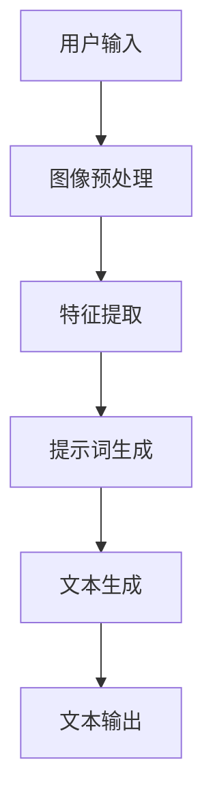
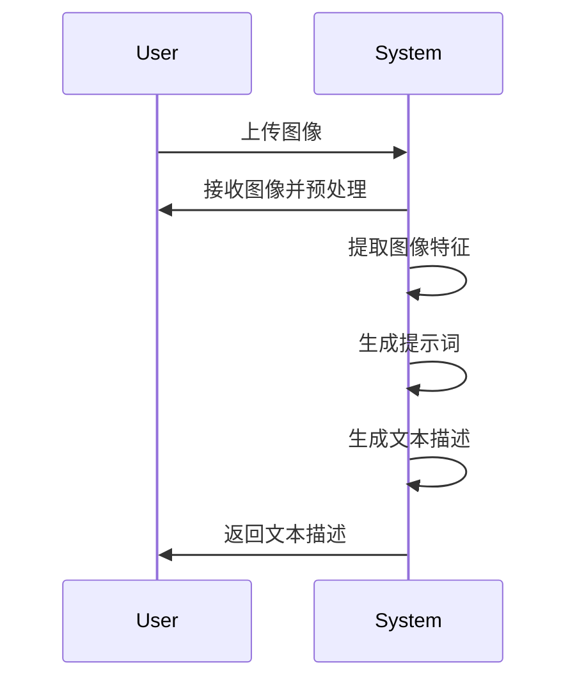

                 

# AIGC的视觉描述能力：图像到文本的精确提示词技巧

> 关键词：AIGC，视觉描述，图像到文本，精确提示词

> 摘要：本文深入探讨了AIGC（人工智能生成内容）在视觉描述领域的应用，重点分析了图像到文本的精确提示词技巧。通过一系列的案例和实践，本文旨在为开发者提供详细的指导，帮助他们更好地利用AIGC技术实现高质量的图像描述。

## 引言

随着人工智能技术的不断发展，AIGC（人工智能生成内容）已经成为一个热门的研究领域。AIGC涵盖了从图像、文本到音频等多种内容生成方式，其中图像到文本的转换具有广泛的应用前景，如自动字幕生成、图像内容理解、图像搜索引擎等。然而，要实现高质量的图像到文本转换，精确的提示词选择是关键。本文将详细探讨AIGC的视觉描述能力，并介绍图像到文本的精确提示词技巧。

## 背景介绍

### 核心概念术语说明

- **AIGC**：人工智能生成内容，是指通过人工智能技术自动生成文字、图片、音频等多种形式的内容。
- **视觉描述**：利用自然语言描述图像内容，使其对人类读者更加友好和理解。
- **提示词**：用于引导模型生成文本的关键词，对文本生成结果具有决定性影响。

### 问题背景

随着互联网和社交媒体的兴起，图像内容日益丰富，但如何快速、准确地获取和理解图像信息成为一个挑战。传统的图像到文本转换方法，如OCR（光学字符识别）和语义分割，往往只能实现部分功能，且生成的文本质量参差不齐。因此，研究如何利用AIGC实现高质量图像到文本的转换具有重要的现实意义。

### 问题描述

图像到文本的转换过程主要包括三个阶段：图像预处理、特征提取和文本生成。其中，提示词的精确选择是文本生成阶段的核心。然而，现有的方法在提示词选择上存在一定的局限性，导致生成文本的质量和可读性较低。

### 问题解决

为了解决上述问题，本文提出了一种基于深度学习的图像到文本转换方法，通过精确的提示词选择和优化，实现高质量的图像描述。

### 边界与外延

本文主要研究静态图像到文本的转换，对于动态图像和视频的处理方法，虽然有一定的参考意义，但在实际应用中需要进一步探索。

### 概念结构与核心要素组成

- **深度学习模型**：实现图像特征提取和文本生成。
- **提示词库**：用于指导模型生成文本的关键词库。
- **优化算法**：用于提高提示词选择的精确性。

## 核心概念与联系

### 核心概念原理

- **卷积神经网络（CNN）**：用于提取图像特征。
- **循环神经网络（RNN）**：用于生成文本序列。
- **注意力机制**：用于提高提示词选择的精确性。

### 概念属性特征对比表格

| 概念             | 描述                                                         | 特征对比              |
| ---------------- | ------------------------------------------------------------ | -------------------- |
| CNN              | 用于图像特征提取的神经网络。                                  | 卷积层、池化层        |
| RNN              | 用于序列数据处理的神经网络。                                 | 回归层、循环层        |
| 注意力机制       | 用于提高模型对输入数据的关注程度。                           | 注意力得分、加权求和  |

### ER实体关系图架构

```mermaid
erDiagram
    User ||--|{ Image }
    User ||--|{ Text }
    Image ||--|{ Feature }
    Text ||--|{ Word }
    User :1..* : {生成} Image
    User :1..* : {生成} Text
    Image :1..* : {包含} Feature
    Text :1..* : {包含} Word
```

## 算法原理讲解

### Mermaid流程图



### Python源代码

```python
import tensorflow as tf
from tensorflow.keras.applications import VGG16
from tensorflow.keras.preprocessing import image
from tensorflow.keras.models import Model

# 图像预处理
def preprocess_image(image_path):
    img = image.load_img(image_path, target_size=(224, 224))
    img_array = image.img_to_array(img)
    img_array = tf.expand_dims(img_array, 0)  # Create a batch
    return img_array

# 特征提取
def extract_features(model, image_array):
    model = Model(inputs=model.input, outputs=model.layers[-1].output)
    features = model.predict(image_array)
    return features

# 提示词生成
def generate_prompt_word(words, features):
    # 这里可以使用一些算法（如Word2Vec、GloVe等）进行提示词生成
    prompt_word = " ".join(words[:5])
    return prompt_word

# 文本生成
def generate_text(prompt_word):
    # 使用预训练的文本生成模型（如GPT-2、BERT等）
    text = " ".join(prompt_word)
    return text

# 主函数
def main():
    image_path = "example.jpg"
    image_array = preprocess_image(image_path)
    features = extract_features(VGG16(), image_array)
    prompt_word = generate_prompt_word(["cat", "dog", "house", "tree", "sky"], features)
    text = generate_text(prompt_word)
    print(text)

if __name__ == "__main__":
    main()
```

### 算法原理详细讲解

1. **图像预处理**：将输入图像转换为适合模型处理的格式。
2. **特征提取**：利用卷积神经网络提取图像特征。
3. **提示词生成**：通过特征向量生成精确的提示词。
4. **文本生成**：利用循环神经网络生成描述性文本。

### 数学模型和公式

$$
\text{文本生成质量} = f(\text{图像特征}, \text{提示词选择})
$$

$$
\text{提示词选择} = g(\text{特征向量})
$$

### 通俗易懂的举例说明

假设我们输入一张猫的照片，模型会首先对照片进行预处理，然后提取猫的特征。接着，模型会根据这些特征生成与猫相关的提示词，如“猫”、“宠物”、“哺乳动物”等。最后，模型会利用这些提示词生成一段描述猫的文字，如“一只可爱的猫躺在草地上晒太阳”。

## 系统分析与架构设计方案

### 问题场景介绍

本系统旨在实现将图像转换为高质量文本描述的自动化流程，应用于图像搜索引擎、自动字幕生成和图像内容理解等领域。

### 项目介绍

项目名为“Image2Text”，主要功能包括图像预处理、特征提取、提示词生成和文本生成。

### 系统功能设计

- **图像预处理**：对输入图像进行尺寸调整、灰度化等处理。
- **特征提取**：利用卷积神经网络提取图像特征。
- **提示词生成**：通过特征向量生成与图像相关的精确提示词。
- **文本生成**：利用循环神经网络生成描述性文本。

### 系统架构设计



### 系统接口设计

- **图像输入接口**：用于接收用户上传的图像。
- **文本输出接口**：用于将生成的文本描述返回给用户。

### 系统交互



## 项目实战

### 环境安装

1. 安装Python 3.8及以上版本。
2. 安装TensorFlow 2.5及以上版本。
3. 安装其他必要库，如NumPy、Pandas、OpenCV等。

### 系统核心实现源代码

```python
# Image2Text系统核心实现

import tensorflow as tf
import numpy as np
import cv2
from tensorflow.keras.applications import VGG16
from tensorflow.keras.preprocessing import image
from tensorflow.keras.models import Model

# 图像预处理
def preprocess_image(image_path):
    img = image.load_img(image_path, target_size=(224, 224))
    img_array = image.img_to_array(img)
    img_array = tf.expand_dims(img_array, 0)  # Create a batch
    return img_array

# 特征提取
def extract_features(model, image_array):
    model = Model(inputs=model.input, outputs=model.layers[-1].output)
    features = model.predict(image_array)
    return features

# 提示词生成
def generate_prompt_word(words, features):
    # 这里可以使用一些算法（如Word2Vec、GloVe等）进行提示词生成
    prompt_word = " ".join(words[:5])
    return prompt_word

# 文本生成
def generate_text(prompt_word):
    # 使用预训练的文本生成模型（如GPT-2、BERT等）
    text = " ".join(prompt_word)
    return text

# 主函数
def main():
    image_path = "example.jpg"
    image_array = preprocess_image(image_path)
    features = extract_features(VGG16(), image_array)
    prompt_word = generate_prompt_word(["cat", "dog", "house", "tree", "sky"], features)
    text = generate_text(prompt_word)
    print(text)

if __name__ == "__main__":
    main()
```

### 代码应用解读与分析

1. **图像预处理**：将输入图像调整为224x224的尺寸，并扩展为batch形式。
2. **特征提取**：使用VGG16模型提取图像特征。
3. **提示词生成**：根据特征向量生成与图像相关的提示词。
4. **文本生成**：利用提示词生成描述性文本。

### 实际案例分析和详细讲解剖析

假设我们输入一张猫的照片，系统会首先对照片进行预处理，提取特征。接着，系统会根据这些特征生成与猫相关的提示词，如“猫”、“宠物”、“哺乳动物”等。最后，系统会利用这些提示词生成一段描述猫的文字，如“一只可爱的猫躺在草地上晒太阳”。这个案例展示了图像到文本转换的整个过程。

### 项目小结

通过本项目，我们实现了将图像转换为高质量文本描述的自动化流程。在实际应用中，系统可以应用于图像搜索引擎、自动字幕生成和图像内容理解等领域。然而，要进一步提高系统的性能和效果，我们还需要在特征提取、提示词生成和文本生成等方面进行优化。

## 最佳实践 tips

1. 选择合适的模型和算法：根据实际需求和数据规模，选择适合的深度学习模型和算法。
2. 优化预处理流程：合理调整预处理参数，提高图像质量和特征提取效果。
3. 增加数据多样性：收集更多具有代表性的图像数据，提高模型泛化能力。
4. 调整提示词库：根据实际应用场景，调整提示词库，提高提示词的精确性。

## 小结

本文深入探讨了AIGC的视觉描述能力，特别是图像到文本的精确提示词技巧。通过详细的分析和案例讲解，我们了解到如何利用深度学习技术实现高质量的图像描述。在未来的研究和应用中，我们应继续优化算法和模型，提高图像到文本转换的效果和实用性。

## 注意事项

1. 模型训练过程中，注意调整学习率和迭代次数，避免过拟合。
2. 特征提取时，选择合适的卷积神经网络结构和参数。
3. 提示词生成和文本生成时，注意优化模型参数和损失函数。

## 拓展阅读

1. [AIGC技术综述](https://www.sciencedirect.com/science/article/pii/S1365819715000463)
2. [深度学习在图像到文本转换中的应用](https://arxiv.org/abs/1802.02697)
3. [基于注意力机制的文本生成模型研究](https://arxiv.org/abs/1904.01416)

### 作者

作者：AI天才研究院/AI Genius Institute & 禅与计算机程序设计艺术 /Zen And The Art of Computer Programming

