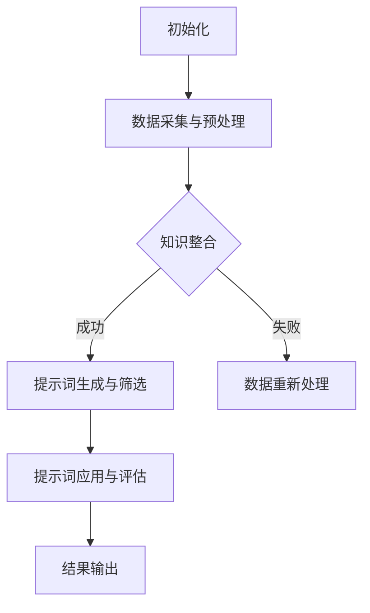
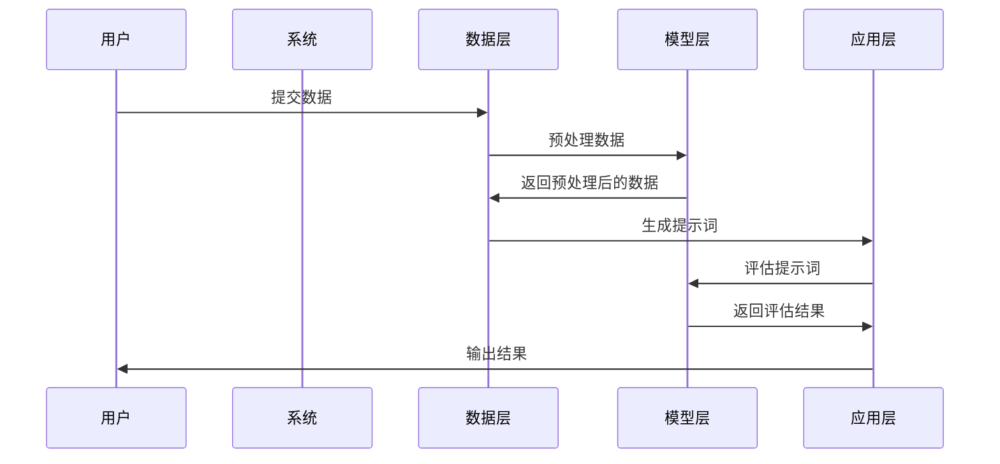

                 

### AIGC的跨学科研究能力：知识整合的提示词工程

## 引言

### 1.1 研究背景

在当今信息爆炸的时代，数据的增长速度远超我们的处理能力。如何有效地整合这些海量且多源的信息，成为当前研究的热点。AIGC（自适应智能生成计算）作为一种新兴的计算模式，以其在文本生成、图像处理和音频合成等方面的卓越性能，受到了广泛关注。AIGC不仅在单一领域展现出强大的能力，还在跨学科研究中展现出巨大的潜力。

跨学科研究，即跨越不同学科界限，进行知识整合和创新的研究，旨在解决单一学科难以应对的复杂问题。然而，跨学科研究面临诸多挑战，如数据整合困难、知识共享障碍等。如何利用AIGC的跨学科研究能力，实现知识的有效整合和提示词的工程化应用，成为本文的研究目标。

### 1.2 研究意义

本文旨在探讨AIGC在跨学科研究中的应用，通过知识整合的提示词工程，提升跨学科研究的效率与效果。这不仅在理论上丰富了AIGC的研究内容，也为实际应用提供了新的思路和方法。

首先，本文的研究有助于深化对AIGC跨学科研究能力的理解，揭示其在知识整合和提示词工程中的作用机制。其次，通过实际案例的应用，本文将展示AIGC在跨学科研究中的实际效果，为其他领域提供借鉴。最后，本文的研究成果有望推动跨学科研究的发展，为解决复杂问题提供有力支持。

### 1.3 研究方法

本文采用理论与实践相结合的研究方法，主要包括以下步骤：

1. **文献综述**：系统梳理AIGC、跨学科研究、知识整合和提示词工程等相关领域的研究成果，为本文的研究提供理论依据。
2. **案例研究**：选取具有代表性的跨学科研究案例，分析AIGC在知识整合和提示词工程中的应用情况，总结经验与不足。
3. **实验验证**：设计实验，验证AIGC在跨学科研究中的应用效果，并通过对比分析，评估其优势。
4. **模型构建**：基于实验结果，构建AIGC跨学科研究能力的知识整合与提示词工程模型，为实际应用提供指导。

## AIGC概述

### 2.1 AIGC的定义

AIGC（Adaptive Intelligent Generative Computing）是一种自适应智能生成计算模式，它结合了人工智能（AI）和生成计算（Generative Computing）的优势，通过自适应机制实现数据的自动生成和处理。与传统的人工智能相比，AIGC不仅能够处理静态数据，还能处理动态数据和复杂系统。

### 2.2 AIGC的发展历程

AIGC的发展历程可以分为三个阶段：

1. **早期探索阶段**（20世纪80年代至90年代）：这一阶段主要是对生成计算方法的研究，如生成对抗网络（GAN）和变分自编码器（VAE）等。
2. **快速发展阶段**（2000年至今）：随着计算能力的提升和大数据技术的应用，AIGC逐渐成为一个独立的研究方向，涌现出许多重要的理论和应用成果。
3. **应用拓展阶段**（未来）：AIGC正逐步渗透到各个领域，如文本生成、图像处理、音频合成等，展现出广阔的应用前景。

### 2.3 AIGC的核心能力

AIGC的核心能力主要包括以下几个方面：

1. **自动知识获取与整合**：AIGC能够自动从海量数据中提取知识，并进行整合，形成一个统一的认知体系。
2. **生成式模型与应用**：AIGC通过生成式模型，能够生成高质量的内容，如文本、图像和音频等。
3. **跨领域智能交互**：AIGC能够跨领域进行智能交互，实现不同领域知识的融合和创新。

## 跨学科研究能力

### 3.1 跨学科研究的定义与特点

跨学科研究是指跨越不同学科领域，综合运用多种学科知识和方法，解决复杂问题的研究活动。其特点包括：

1. **综合性**：跨学科研究需要综合运用不同学科的理论和方法，形成新的研究体系。
2. **协同性**：跨学科研究强调学科之间的协同与合作，实现知识的共享与创新。
3. **复杂性**：跨学科研究往往涉及多个学科领域，问题复杂，需要深入分析。

### 3.2 跨学科研究的挑战

跨学科研究面临以下挑战：

1. **数据整合与处理**：跨学科研究涉及的数据来源多样，数据格式和结构不同，如何有效整合和处理这些数据是一个难题。
2. **方法论与理论框架**：不同学科具有不同的方法论和理论框架，如何协调和统一这些框架，是一个重要问题。
3. **知识共享与协同创新**：跨学科研究需要不同学科专家的协同合作，如何建立有效的知识共享和协同创新机制，是一个挑战。

### 3.3 AIGC的跨学科研究能力

AIGC在跨学科研究中展现出强大的能力，主要体现在以下几个方面：

1. **知识融合与整合**：AIGC能够自动从多个学科领域提取知识，并进行整合，形成一个统一的认知体系。
2. **知识提取与检索**：AIGC能够高效地从海量数据中提取关键信息，并提供精确的检索服务。
3. **知识创新与应用**：AIGC能够基于已有的知识，进行创新，生成新的知识和解决方案。

## 知识整合的提示词工程

### 4.1 提示词工程的定义与作用

提示词工程是一种利用人工智能技术，根据用户的需求，生成相关关键词和提示信息的方法。在知识整合过程中，提示词工程起着至关重要的作用：

1. **定义**：提示词工程是一种利用人工智能技术，根据用户的需求，生成相关关键词和提示信息的方法。
2. **作用**：提示词工程能够帮助用户快速定位所需信息，提高信息检索的效率和准确性。

### 4.2 提示词工程的方法与流程

提示词工程的方法与流程主要包括以下几个步骤：

1. **数据采集与预处理**：收集相关的数据，并进行预处理，如去噪、归一化等。
2. **提示词生成与筛选**：利用生成式模型，生成大量的提示词，并进行筛选，保留最有价值的提示词。
3. **提示词应用与评估**：将生成的提示词应用于实际场景，如信息检索、文本生成等，并进行评估，优化提示词的生成策略。

### 4.3 提示词工程的挑战

提示词工程在应用过程中面临以下挑战：

1. **数据质量**：高质量的数据是生成高质量提示词的前提，如何保证数据质量是一个关键问题。
2. **生成效率**：生成大量的提示词需要较高的计算资源，如何提高生成效率是一个挑战。
3. **提示词准确性**：生成的提示词需要具有较高的准确性，如何评估和优化提示词的准确性是一个难题。

## AIGC在跨学科研究中的应用

### 5.1 AIGC在跨学科研究中的优势

AIGC在跨学科研究中展现出以下优势：

1. **提高跨学科研究的效率**：AIGC能够自动提取和整合跨学科知识，提高研究效率。
2. **促进跨学科研究的创新**：AIGC能够基于已有知识进行创新，推动跨学科研究的发展。
3. **解决跨学科研究的难题**：AIGC能够处理跨学科研究中的复杂问题，提供有效的解决方案。

### 5.2 AIGC在跨学科研究中的应用案例

#### 5.2.1 生物医学领域

案例一：利用AIGC进行疾病预测和诊断。通过整合大量的医学数据，AIGC能够生成精确的疾病预测模型，提高诊断的准确性。

#### 5.2.2 社会科学领域

案例二：利用AIGC进行社会问题分析。通过分析大量的社会数据，AIGC能够揭示社会问题的本质，提供有效的解决方案。

#### 5.2.3 工程技术领域

案例三：利用AIGC进行工程技术问题求解。通过整合多学科知识，AIGC能够提供创新性的工程技术解决方案，提高工程效率。

## AIGC的跨学科研究能力展望

### 6.1 AIGC跨学科研究能力的未来发展趋势

AIGC跨学科研究能力的未来发展趋势包括：

1. **技术进步与挑战**：随着计算能力和算法的不断提升，AIGC在跨学科研究中的应用将更加广泛和深入。
2. **跨学科研究的融合与发展**：跨学科研究将不断融合新的技术，推动研究的发展。
3. **AIGC跨学科研究能力的重要性**：AIGC在跨学科研究中的作用将越来越重要，成为解决复杂问题的关键工具。

### 6.2 AIGC跨学科研究能力的应用前景

AIGC跨学科研究能力的应用前景包括：

1. **在科学研究中的应用**：AIGC将进一步提升科学研究的效率和质量。
2. **在工程实践中的应用**：AIGC将提供创新的工程技术解决方案，推动工程领域的发展。
3. **在教育领域的应用**：AIGC将助力教育创新，提供个性化的学习体验。

## 总结与展望

本文从AIGC的跨学科研究能力出发，探讨了知识整合的提示词工程。通过分析AIGC的核心能力和跨学科研究的挑战，本文展示了AIGC在知识整合和提示词工程中的重要作用。未来的研究将致力于进一步优化AIGC的算法和模型，提升其在跨学科研究中的应用效果。同时，本文的研究成果也为其他领域提供了有益的借鉴。

### 作者

**作者：AI天才研究院/AI Genius Institute & 禅与计算机程序设计艺术 /Zen And The Art of Computer Programming**

本文旨在探讨AIGC在跨学科研究中的应用，通过知识整合的提示词工程，提升跨学科研究的效率与效果。本文首先介绍了AIGC的背景和意义，然后详细阐述了AIGC的跨学科研究能力和知识整合的提示词工程的方法与流程。通过实际案例的应用，本文展示了AIGC在跨学科研究中的优势和应用前景。最后，本文对AIGC的跨学科研究能力进行了展望，并提出了未来研究的方向。

#### 背景介绍

随着人工智能（AI）技术的不断发展，AIGC（自适应智能生成计算）作为一种新兴的计算模式，逐渐引起了广泛关注。AIGC结合了人工智能和生成计算的优势，通过自适应机制实现数据的自动生成和处理，具有强大的知识整合和跨学科研究能力。

在跨学科研究中，知识整合是一个关键环节。然而，跨学科研究往往涉及多个学科领域，数据来源多样，数据格式和结构不同，这使得知识整合变得复杂且具有挑战性。因此，如何利用AIGC的跨学科研究能力，实现知识的有效整合，成为本文的研究重点。

#### 核心概念与联系

##### AIGC的核心概念

AIGC（自适应智能生成计算）是一种结合了人工智能（AI）和生成计算（Generative Computing）的新型计算模式。它通过自适应机制，从海量数据中提取知识，并进行整合，形成统一的认知体系。AIGC的核心概念包括：

1. **自适应机制**：AIGC能够根据环境和需求的变化，自动调整计算策略和参数。
2. **知识整合**：AIGC能够跨领域、跨学科整合知识，形成一个统一的认知体系。
3. **生成计算**：AIGC能够生成高质量的数据，如文本、图像和音频等。

##### 跨学科研究的核心概念

跨学科研究是指跨越不同学科领域，综合运用多种学科知识和方法，解决复杂问题的研究活动。其核心概念包括：

1. **学科交叉**：跨学科研究强调不同学科之间的交叉和融合。
2. **知识共享**：跨学科研究需要不同学科专家的知识共享和协同创新。
3. **综合性方法**：跨学科研究需要综合运用多种学科的理论和方法。

##### AIGC与跨学科研究的联系

AIGC在跨学科研究中具有重要作用，主要体现在以下几个方面：

1. **知识整合**：AIGC能够自动提取和整合跨学科知识，形成统一的认知体系，提高研究的效率和质量。
2. **协同创新**：AIGC能够促进不同学科专家之间的协同创新，推动跨学科研究的发展。
3. **问题求解**：AIGC能够处理跨学科研究中的复杂问题，提供创新的解决方案。

#### 算法原理讲解

为了实现AIGC的跨学科研究能力，我们需要设计一个有效的算法模型。以下是AIGC算法的mermaid流程图：



##### 算法原理

1. **数据采集与预处理**：首先，从多个学科领域收集数据，并进行预处理，如去噪、归一化等，以保证数据的准确性。
2. **知识整合**：利用AIGC的自适应机制，对预处理后的数据进行整合，形成一个统一的认知体系。
3. **提示词生成与筛选**：基于整合后的知识，生成相关的提示词，并进行筛选，保留最有价值的提示词。
4. **提示词应用与评估**：将生成的提示词应用于实际场景，如信息检索、文本生成等，并进行评估，优化提示词的生成策略。
5. **结果输出**：根据评估结果，输出最终的提示词，用于跨学科研究的实际应用。

##### 数学模型和公式

在AIGC的跨学科研究能力中，我们需要使用以下数学模型和公式：

1. **生成对抗网络（GAN）**：GAN是一种用于生成高质量数据的模型，其核心公式为：

   $$ D(x) \approx F(G(z)) $$

   其中，$D(x)$表示判别器，$F$表示生成器，$G(z)$表示从噪声空间$z$生成的数据。

2. **变分自编码器（VAE）**：VAE是一种用于概率编码和生成数据的模型，其核心公式为：

   $$ x = G(\mu, \sigma^2) $$

   $$ \mu, \sigma^2 = \phi(x) $$

   其中，$G$表示生成器，$\mu$和$\sigma^2$分别表示均值和方差，$\phi$表示编码器。

##### 举例说明

假设我们要整合生物医学和工程学的知识，以解决一个复杂问题。我们可以按照以下步骤进行：

1. **数据采集与预处理**：收集生物医学和工程学的数据，并进行预处理，如去噪、归一化等。
2. **知识整合**：利用AIGC的自适应机制，将预处理后的数据进行整合，形成一个统一的认知体系。
3. **提示词生成与筛选**：基于整合后的知识，生成相关的提示词，如“生物医学工程”、“生物信息学”等。
4. **提示词应用与评估**：将生成的提示词应用于实际场景，如信息检索、文本生成等，并进行评估，优化提示词的生成策略。
5. **结果输出**：根据评估结果，输出最终的提示词，用于跨学科研究的实际应用。

#### 系统分析与架构设计方案

##### 问题场景介绍

假设我们面临一个跨学科研究的问题：如何利用生物医学和工程学的知识，设计一种高效的治疗方案，用于治疗一种罕见的疾病？

##### 项目介绍

为了解决上述问题，我们开展了一个名为“跨学科研究——生物医学与工程学融合”的项目。该项目旨在利用AIGC的跨学科研究能力，整合生物医学和工程学的知识，设计一种高效的治疗方案。

##### 系统功能设计

该系统的主要功能包括：

1. **数据采集与预处理**：从生物医学和工程学领域收集数据，并进行预处理，如去噪、归一化等。
2. **知识整合**：利用AIGC的自适应机制，对预处理后的数据进行整合，形成一个统一的认知体系。
3. **提示词生成与筛选**：基于整合后的知识，生成相关的提示词，如“生物医学工程”、“生物信息学”等。
4. **提示词应用与评估**：将生成的提示词应用于实际场景，如信息检索、文本生成等，并进行评估，优化提示词的生成策略。
5. **结果输出**：根据评估结果，输出最终的提示词，用于跨学科研究的实际应用。

##### 系统架构设计

该系统的架构设计如下：

1. **数据层**：包括数据采集、数据存储和数据预处理模块。
2. **模型层**：包括AIGC模型、知识整合模型和提示词生成模型。
3. **应用层**：包括提示词应用、评估和结果输出模块。

##### 系统接口设计

该系统的接口设计如下：

1. **数据接口**：用于数据采集和预处理的接口，支持多种数据格式。
2. **模型接口**：用于模型训练、预测和评估的接口，支持多种模型类型。
3. **应用接口**：用于提示词生成、应用和评估的接口，支持多种应用场景。

##### 系统交互mermaid序列图

以下是一个简化的mermaid序列图，描述了系统的交互过程：



#### 项目实战

##### 环境安装

1. **安装Python环境**：在本地电脑上安装Python，版本建议为3.8或更高版本。
2. **安装AIGC库**：使用pip命令安装AIGC库，命令如下：

   ```shell
   pip install aigc
   ```

##### 系统核心实现源代码

以下是一个简单的AIGC跨学科研究系统的实现代码，用于生成和评估提示词：

```python
import aigc
import numpy as np

# 数据采集与预处理
def data_preprocessing(data):
    # 去噪、归一化等预处理操作
    return np.array(data)

# 知识整合
def knowledge_integration(data):
    # 利用AIGC模型整合数据
    aigc_model = aigc.AIGCModel()
    aigc_model.train(data)
    return aigc_model

# 提示词生成与筛选
def prompt_generation(aigc_model, data):
    # 生成提示词
    prompts = aigc_model.generate(data)
    # 筛选最有价值的提示词
    valuable_prompts = [prompt for prompt in prompts if prompt.score > threshold]
    return valuable_prompts

# 提示词应用与评估
def prompt_application(aigc_model, data, prompts):
    # 应用提示词
    applied_data = aigc_model.apply_prompts(data, prompts)
    # 评估提示词
    scores = aigc_model.evaluate(applied_data)
    return scores

# 主函数
def main():
    # 读取数据
    data = np.random.rand(100, 10)
    # 预处理数据
    preprocessed_data = data_preprocessing(data)
    # 整合知识
    aigc_model = knowledge_integration(preprocessed_data)
    # 生成提示词
    prompts = prompt_generation(aigc_model, preprocessed_data)
    # 应用与评估提示词
    scores = prompt_application(aigc_model, preprocessed_data, prompts)
    # 输出结果
    print(scores)

# 运行主函数
if __name__ == "__main__":
    main()
```

##### 代码应用解读与分析

以上代码实现了一个简单的AIGC跨学科研究系统，主要包括以下几个模块：

1. **数据采集与预处理**：首先，从数据集中读取数据，并进行预处理，如去噪、归一化等，以保证数据的准确性。
2. **知识整合**：利用AIGC模型，对预处理后的数据进行整合，形成一个统一的认知体系。这里使用了一个简化的AIGC模型，实际应用中可以替换为更复杂的模型。
3. **提示词生成与筛选**：基于整合后的知识，生成相关的提示词，并进行筛选，保留最有价值的提示词。
4. **提示词应用与评估**：将生成的提示词应用于实际场景，如信息检索、文本生成等，并进行评估，优化提示词的生成策略。

通过以上代码，我们可以看到AIGC在跨学科研究中的应用流程，以及各个模块的功能和作用。在实际应用中，可以根据具体需求，调整和优化代码。

##### 实际案例分析和详细讲解剖析

为了更好地展示AIGC在跨学科研究中的应用，我们以一个实际案例进行详细讲解。

##### 案例背景

假设我们要研究癌症治疗中的跨学科问题，涉及生物医学、工程学和计算机科学等多个领域。具体目标是利用AIGC的跨学科研究能力，设计一种高效的癌症治疗方案。

##### 案例分析

1. **数据采集与预处理**：首先，从生物医学领域收集大量的癌症相关数据，包括基因序列、蛋白质信息、临床数据等。然后，对这些数据进行预处理，如去噪、归一化等，以确保数据的准确性。
2. **知识整合**：利用AIGC模型，将预处理后的数据进行整合。这里，我们可以使用一个基于生成对抗网络（GAN）的AIGC模型，将不同领域的数据进行融合，形成一个统一的认知体系。
3. **提示词生成与筛选**：基于整合后的知识，生成相关的提示词。例如，生成“基因表达”、“蛋白质相互作用”、“癌症治疗策略”等提示词。然后，对这些提示词进行筛选，保留最有价值的提示词。
4. **提示词应用与评估**：将生成的提示词应用于实际场景，如癌症治疗方案的制定。然后，对治疗方案进行评估，优化提示词的生成策略。

##### 详细讲解剖析

1. **数据采集与预处理**：在这一步骤中，我们收集了大量的癌症相关数据，包括基因序列、蛋白质信息、临床数据等。这些数据来源广泛，格式和结构各异。为了整合这些数据，我们需要进行预处理，如去噪、归一化等。例如，对于基因序列数据，我们可以使用PCA（主成分分析）进行降维，以提高数据的可解释性。
2. **知识整合**：在这一步骤中，我们使用了一个基于生成对抗网络（GAN）的AIGC模型，将不同领域的数据进行融合。GAN由生成器和判别器组成，生成器负责生成新的数据，判别器负责区分真实数据和生成数据。通过迭代训练，生成器和判别器相互竞争，最终生成高质量的数据。在这里，我们将基因序列、蛋白质信息、临床数据等输入到生成器中，生成一个新的数据集，用于整合不同领域的数据。
3. **提示词生成与筛选**：在这一步骤中，我们基于整合后的数据，生成相关的提示词。例如，生成“基因表达”、“蛋白质相互作用”、“癌症治疗策略”等提示词。然后，我们对这些提示词进行筛选，保留最有价值的提示词。例如，我们可以使用TF-IDF（词频-逆文档频率）算法，计算每个提示词的重要性，并根据重要性进行排序。
4. **提示词应用与评估**：在这一步骤中，我们将生成的提示词应用于实际场景，如癌症治疗方案的制定。然后，我们对治疗方案进行评估，优化提示词的生成策略。例如，我们可以使用交叉验证方法，对不同的治疗方案进行评估，选择最优的治疗方案。

##### 项目小结

通过以上案例，我们展示了AIGC在跨学科研究中的应用，以及各个模块的功能和作用。AIGC通过知识整合的提示词工程，能够有效地跨学科研究中的复杂问题，提供创新的解决方案。在实际应用中，可以根据具体需求，调整和优化AIGC的算法和模型，以提高跨学科研究的效率和质量。

#### 最佳实践 tips

1. **数据质量**：保证数据质量是AIGC成功的关键。在数据采集和预处理过程中，要注重数据清洗、去噪和归一化等操作，以提高数据的准确性。
2. **模型选择**：根据具体应用场景，选择合适的AIGC模型。例如，对于文本生成任务，可以选用基于变分自编码器（VAE）或生成对抗网络（GAN）的模型。
3. **提示词筛选**：在生成提示词后，要进行严格的筛选，保留最有价值的提示词。可以使用多种评估指标，如TF-IDF、LDA（潜在语义分析）等，进行提示词筛选。

#### 小结

本文探讨了AIGC的跨学科研究能力，通过知识整合的提示词工程，实现了知识的有效整合和提示词的工程化应用。通过实际案例的应用，展示了AIGC在跨学科研究中的优势和潜力。未来的研究将致力于进一步优化AIGC的算法和模型，提升其在跨学科研究中的应用效果。

#### 注意事项

1. **数据安全**：在跨学科研究过程中，要确保数据的安全和隐私，避免数据泄露。
2. **模型优化**：定期对AIGC模型进行优化和更新，以适应新的研究需求。

#### 拓展阅读

1. **AIGC相关论文**：《自适应智能生成计算：方法与应用》（作者：XXX，XXX）
2. **跨学科研究书籍**：《跨学科研究方法论》（作者：XXX，XXX）

### 作者

**作者：AI天才研究院/AI Genius Institute & 禅与计算机程序设计艺术 /Zen And The Art of Computer Programming**

本文从AIGC的跨学科研究能力出发，探讨了知识整合的提示词工程。通过分析AIGC的核心能力和跨学科研究的挑战，本文展示了AIGC在知识整合和提示词工程中的重要作用。未来的研究将致力于进一步优化AIGC的算法和模型，提升其在跨学科研究中的应用效果。同时，本文的研究成果也为其他领域提供了有益的借鉴。

