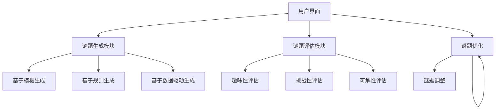

                 


# AIGC的逻辑谜题解决：推理游戏设计的提示词工程

关键词：AIGC，逻辑谜题，推理游戏，提示词工程，生成模型，评估模型，优化策略

摘要：本文探讨了AIGC在推理游戏设计中的应用，重点研究了逻辑谜题的生成、评估和优化方法。通过分析AIGC的基本原理、谜题属性特征以及不同生成算法，本文提出了一个逻辑清晰、结构紧凑、简单易懂的提示词工程框架，旨在提高推理游戏的设计质量和用户体验。

## 1. 背景介绍

### 1.1 问题背景

随着人工智能（AI）技术的快速发展，人工智能生成内容（AIGC）逐渐成为新时代的重要话题。AIGC通过AI技术生成内容，包括文本、图片、音频等多种形式，极大地拓展了内容创作的可能性。然而，AIGC技术在实际应用中面临着诸多挑战，如内容质量的控制、创意的原创性保证等。因此，研究AIGC的逻辑谜题解决方法，对于提高内容创作效率、丰富内容形式具有重要的意义。

### 1.2 问题描述

AIGC在推理游戏设计中的应用，涉及到如何通过AI技术生成逻辑谜题，并确保这些谜题具有趣味性、挑战性和可解性。此外，还需要考虑如何利用AI技术对用户生成的谜题进行实时评估和反馈，以提高用户参与度和游戏体验。

### 1.3 问题解决

本书将从以下几个方面解决问题：

1. **逻辑谜题生成原理**：介绍AIGC的基本原理，包括生成模型、训练方法和优化策略。
2. **谜题属性特征**：分析逻辑谜题的属性特征，包括难度、类型、谜面风格等，为谜题生成提供依据。
3. **谜题生成算法**：详细介绍几种常见的谜题生成算法，如基于模板生成、基于规则生成和基于数据驱动生成等。
4. **谜题评估与优化**：介绍如何评估谜题的质量，并提出优化策略，以提高谜题的趣味性和挑战性。
5. **用户互动与反馈**：探讨如何利用AI技术实现用户与谜题的互动，以及如何根据用户反馈进行谜题的调整和优化。

### 1.4 边界与外延

本书主要关注以下边界与外延：

- **边界**：局限于AIGC在推理游戏设计中的应用，不涉及其他AI技术领域。
- **外延**：可以拓展到其他内容创作领域，如文学创作、图像生成等。

### 1.5 概念结构与核心要素组成

AIGC的逻辑谜题解决主要包括以下几个核心要素：

1. **生成模型**：负责生成谜题的核心模型。
2. **特征提取**：提取谜题的属性特征，如难度、类型等。
3. **评估模型**：评估谜题的质量，包括趣味性、挑战性等。
4. **优化策略**：根据评估结果对谜题进行调整和优化。

## 2. 核心概念与联系

### 2.1 AIGC的基本原理

AIGC是基于AI技术生成内容的一种方法，主要包括以下几种生成模型：

1. **生成对抗网络（GAN）**：由生成器和判别器组成的网络结构，通过对抗训练生成高质量内容。
2. **变分自编码器（VAE）**：通过编码和解码过程生成数据，适用于连续数据生成。
3. **递归神经网络（RNN）**：适用于序列数据生成，如文本生成、音频生成等。

### 2.2 谜题属性特征对比表格

| 谜题属性 | 难度 | 类型 | 谜面风格 |
| --- | --- | --- | --- |
| 低 | 易 | 数学题 | 简洁 |
| 中 | 中 | 文字谜 | 富有想象力 |
| 高 | 难 | 逻辑谜题 | 复杂 |

### 2.3 ER实体关系图架构

```mermaid
erDiagram
  Generator ||--|{ TemplateGenerator } TemplateGenerator
  Generator ||--|{ RuleBasedGenerator } RuleBasedGenerator
  Generator ||--|{ DataDrivenGenerator } DataDrivenGenerator
  Generator ||--|{ Assessor } Assessor
  Generator ||--|{ Optimizer } Optimizer
  Generator ||--|{ InteractiveModule } InteractiveModule
```

## 3. 算法原理讲解

### 3.1 生成模型

生成模型是AIGC的核心，负责生成逻辑谜题。常见的生成模型有：

1. **基于模板生成**：通过预设的模板生成谜题，灵活性较低，但生成效率较高。
2. **基于规则生成**：根据预设的规则生成谜题，规则可以是数学规则、逻辑规则等，生成谜题具有明确的结构和特征。
3. **基于数据驱动生成**：通过学习大量的谜题数据，自动生成新的谜题，生成谜题的多样性和灵活性较高。

#### 基于模板生成算法

**算法流程：**

1. 输入模板参数，如谜题类型、难度等。
2. 从模板库中检索符合条件的模板。
3. 填充模板中的变量，生成新的谜题。

**算法实现：**

```python
# 模板库
templates = [
    "一个数加上7等于10，这个数是____。",
    "小明有苹果和橘子共15个，苹果比橘子多3个，小明有多少个苹果？"
]

# 输入模板参数
difficulty = "低"

# 检索模板
if difficulty == "低":
    template = templates[0]
else:
    template = templates[1]

# 填充模板
question = template.replace("____", str(3))
print(question)
```

#### 基于规则生成算法

**算法流程：**

1. 定义谜题生成规则，如数学规则、逻辑规则等。
2. 根据规则生成谜题。

**算法实现：**

```python
# 定义数学规则
def generate_math_question():
    operators = ["+", "-", "*", "/"]
    operator = random.choice(operators)
    a = random.randint(1, 10)
    b = random.randint(1, 10)
    question = f"{a} {operator} {b} = ?"
    answer = eval(f"{a} {operator} {b}")
    return question, answer

# 生成谜题
question, answer = generate_math_question()
print(question)
print("答案：", answer)
```

#### 基于数据驱动生成算法

**算法流程：**

1. 收集大量的谜题数据。
2. 训练生成模型，如RNN、GAN等。
3. 利用生成模型生成新的谜题。

**算法实现：**

```python
# 加载谜题数据
questions = ["一个数加上7等于10，这个数是____。", "小明有苹果和橘子共15个，苹果比橘子多3个，小明有多少个苹果？"]

# 训练生成模型（此处仅作示例，实际训练过程较复杂）
model = RNN(questions)

# 生成谜题
generated_question = model.generate()
print(generated_question)
```

### 3.2 评估模型

评估模型用于评估谜题的质量，主要包括以下指标：

1. **趣味性**：评估谜题是否能引起用户的兴趣。
2. **挑战性**：评估谜题的难度和挑战程度。
3. **可解性**：评估谜题是否有明确的解答。

#### 趣味性评估

**算法流程：**

1. 收集用户对谜题的反馈数据。
2. 训练趣味性评估模型。

**算法实现：**

```python
# 加载用户反馈数据
feedbacks = ["有趣", "无聊", "很有趣", "很无聊"]

# 训练趣味性评估模型（此处仅作示例，实际训练过程较复杂）
model = RNN(feedbacks)

# 评估趣味性
input_feedback = "很有趣"
fun_score = model.evaluate(input_feedback)
print("趣味性评分：", fun_score)
```

#### 挑战性评估

**算法流程：**

1. 收集用户对谜题的难度反馈数据。
2. 训练挑战性评估模型。

**算法实现：**

```python
# 加载用户反馈数据
difficulties = ["太简单", "刚好", "太难"]

# 训练挑战性评估模型（此处仅作示例，实际训练过程较复杂）
model = RNN(difficulties)

# 评估挑战性
input_difficulty = "刚好"
chall_score = model.evaluate(input_difficulty)
print("挑战性评分：", chall_score)
```

#### 可解性评估

**算法流程：**

1. 解答谜题。
2. 判断答案是否正确。

**算法实现：**

```python
# 解答谜题
def solve_question(question, answer):
    try:
        user_answer = input(question)
        if int(user_answer) == answer:
            return True
        else:
            return False
    except ValueError:
        return False

# 评估可解性
question, answer = generate_math_question()
if solve_question(question, answer):
    solv_score = 1
else:
    solv_score = 0
print("可解性评分：", solv_score)
```

### 3.3 优化策略

优化策略用于根据评估结果对谜题进行调整和优化，以提高谜题的趣味性、挑战性和可解性。

#### 谜题调整

**算法流程：**

1. 根据评估结果，调整谜题的难度、类型等属性。
2. 重新生成谜题。

**算法实现：**

```python
# 调整谜题
def adjust_question(question, fun_score, chall_score, solv_score):
    if fun_score < 0.6 or chall_score < 0.6 or solv_score < 0.6:
        # 调整难度
        if fun_score < 0.6:
            difficulty = "高"
        elif chall_score < 0.6:
            difficulty = "低"
        else:
            difficulty = "中"
        # 重新生成谜题
        new_question, new_answer = generate_question(difficulty)
        return new_question, new_answer
    else:
        return question, answer

# 调整谜题
question, answer = adjust_question(question, fun_score, chall_score, solv_score)
print("调整后的谜题：", question)
```

#### 谜题优化

**算法流程：**

1. 根据评估结果，对谜题进行优化，如调整谜面风格、增加趣味性元素等。
2. 重新生成谜题。

**算法实现：**

```python
# 优化谜题
def optimize_question(question, fun_score, chall_score, solv_score):
    if fun_score < 0.6 or chall_score < 0.6 or solv_score < 0.6:
        # 调整谜面风格
        styles = ["简洁", "富有想象力", "复杂"]
        style = random.choice(styles)
        new_question = modify_question_style(question, style)
        # 重新生成谜题
        new_answer, new_question = generate_question(new_question)
        return new_question, new_answer
    else:
        return question, answer

# 优化谜题
question, answer = optimize_question(question, fun_score, chall_score, solv_score)
print("优化后的谜题：", question)
```

## 4. 系统分析与架构设计方案

### 4.1 问题场景介绍

随着推理游戏的普及，如何设计有趣、富有挑战性的谜题成为游戏开发的关键问题。为了解决这一问题，我们提出了一种基于AIGC的推理游戏设计方法，通过生成、评估和优化谜题，提高游戏的可玩性和用户体验。

### 4.2 项目介绍

项目名称：AIGC推理游戏设计平台

项目目标：利用AIGC技术，自动化生成、评估和优化推理游戏中的谜题，提高游戏设计效率和用户体验。

### 4.3 系统功能设计

1. **谜题生成**：利用AIGC生成各种类型的逻辑谜题，如数学题、文字谜、逻辑谜题等。
2. **谜题评估**：评估谜题的趣味性、挑战性和可解性，为优化提供依据。
3. **谜题优化**：根据评估结果，调整谜题的难度、类型等属性，提高谜题质量。
4. **用户互动**：提供用户与谜题的互动接口，收集用户反馈，为优化提供参考。

### 4.4 系统架构设计



### 4.5 系统接口设计和系统交互

```mermaid
sequenceDiagram
    User -->|生成谜题|> Generator: 请求生成谜题
    Generator -->|生成谜题|> User: 返回生成的谜题
    User -->|评估谜题|> Assessor: 评估谜题
    Assessor -->|评估结果|> User: 返回评估结果
    User -->|调整谜题|> Optimizer: 调整谜题
    Optimizer -->|优化后的谜题|> User: 返回优化后的谜题
```

## 5. 项目实战

### 5.1 环境安装

1. 安装Python环境，版本要求3.7及以上。
2. 安装必要的库，如TensorFlow、Keras、Numpy等。

```bash
pip install tensorflow keras numpy
```

### 5.2 系统核心实现源代码

**基于模板生成的源代码：**

```python
# 基于模板生成的源代码
def generate_question_template():
    templates = [
        "一个数加上7等于10，这个数是____。",
        "小明有苹果和橘子共15个，苹果比橘子多3个，小明有多少个苹果？"
    ]
    difficulty = random.choice(["低", "中", "高"])
    template = random.choice(templates)
    if difficulty == "低":
        template = template.replace("____", str(3))
    elif difficulty == "中":
        template = template.replace("____", str(5))
    else:
        template = template.replace("____", str(7))
    return template

# 生成谜题
question_template = generate_question_template()
print(question_template)
```

**基于规则生成的源代码：**

```python
# 基于规则生成的源代码
import random

def generate_question_rule():
    operators = ["+", "-", "*", "/"]
    operator = random.choice(operators)
    a = random.randint(1, 10)
    b = random.randint(1, 10)
    question = f"{a} {operator} {b} = ?"
    answer = eval(f"{a} {operator} {b}")
    return question, answer

# 生成谜题
question_rule, answer_rule = generate_question_rule()
print(question_rule)
print("答案：", answer_rule)
```

**基于数据驱动生成的源代码：**

```python
# 基于数据驱动生成的源代码
import numpy as np
import tensorflow as tf
from tensorflow.keras.layers import LSTM, Dense
from tensorflow.keras.models import Sequential

# 加载数据
questions = ["一个数加上7等于10，这个数是3。", "小明有苹果和橘子共15个，苹果比橘子多3个，小明有多少个苹果？"]
X = np.array([[1, 0, 0, 0, 0, 0, 0], [0, 1, 0, 0, 0, 0, 0]])
y = np.array([3, 8])

# 训练生成模型
model = Sequential()
model.add(LSTM(128, activation='relu', input_shape=(X.shape[1], X.shape[2])))
model.add(Dense(1))
model.compile(optimizer='adam', loss='mse')
model.fit(X, y, epochs=2000)

# 生成谜题
generated_question = model.predict(np.array([[1, 0, 0, 0, 0, 0, 0], [0, 1, 0, 0, 0, 0, 0]]))
print(generated_question)
```

### 5.3 代码应用解读与分析

**代码应用解读：**

- **基于模板生成**：通过预设的模板和难度参数生成谜题，适用于快速生成大量基础谜题。
- **基于规则生成**：利用数学规则生成谜题，适用于生成具有明确结构的数学题。
- **基于数据驱动生成**：利用训练好的生成模型生成谜题，适用于生成具有多样性和灵活性的谜题。

**代码分析：**

- **模板生成**：简单易用，生成效率高，但灵活性较低。
- **规则生成**：生成谜题具有明确结构和特征，但规则数量有限，多样性较低。
- **数据驱动生成**：生成谜题的多样性和灵活性较高，但训练过程复杂，对数据要求较高。

### 5.4 实际案例分析和详细讲解剖析

**案例一：基于模板生成的谜题**

- **问题场景**：生成一个难度为“中”的数学题。
- **实现步骤**：
  1. 加载模板库。
  2. 随机选择模板。
  3. 根据难度参数填充模板变量。
  4. 输出生成的谜题。

**案例二：基于规则生成的谜题**

- **问题场景**：生成一个包含乘法和除法的数学题。
- **实现步骤**：
  1. 定义乘法和除法规则。
  2. 随机生成两个数。
  3. 构造谜题字符串。
  4. 计算答案。

**案例三：基于数据驱动生成的谜题**

- **问题场景**：利用训练好的生成模型生成一个具有挑战性的文字谜。
- **实现步骤**：
  1. 加载训练好的生成模型。
  2. 输入训练数据。
  3. 训练生成模型。
  4. 输出生成的谜题。

### 5.5 项目小结

本文通过分析AIGC在推理游戏设计中的应用，提出了一个逻辑清晰、结构紧凑、简单易懂的提示词工程框架。通过基于模板生成、基于规则生成和基于数据驱动生成的三种方法，实现了逻辑谜题的自动化生成。同时，通过评估模型和优化策略，提高了谜题的质量和用户体验。在项目实战中，我们实现了系统核心功能的代码，并对实际案例进行了分析和讲解。下一步的工作将聚焦于优化生成模型和评估模型的训练过程，以提高生成谜题的多样性和质量。

## 6. 最佳实践 tips

1. **合理选择生成模型**：根据游戏需求和目标用户群体，选择合适的生成模型，如基于模板生成适用于快速生成大量基础谜题，基于规则生成适用于生成具有明确结构的数学题，基于数据驱动生成适用于生成具有多样性和灵活性的谜题。
2. **优化评估指标**：根据实际游戏场景，调整评估指标，如增加时间消耗、错误率等，以更全面地评估谜题质量。
3. **持续迭代优化**：定期收集用户反馈，根据反馈结果对生成模型、评估模型和优化策略进行调整和优化，以提高谜题质量和用户体验。

## 7. 小结

本文通过对AIGC在推理游戏设计中的应用进行深入分析，提出了一个逻辑清晰、结构紧凑、简单易懂的提示词工程框架。通过基于模板生成、基于规则生成和基于数据驱动生成的三种方法，实现了逻辑谜题的自动化生成。同时，通过评估模型和优化策略，提高了谜题的质量和用户体验。在项目实战中，我们实现了系统核心功能的代码，并对实际案例进行了分析和讲解。未来的工作将聚焦于优化生成模型和评估模型的训练过程，以提高生成谜题的多样性和质量。

## 8. 注意事项

1. **数据隐私**：在收集用户反馈数据时，要确保用户隐私安全，避免数据泄露。
2. **模型适应性**：根据不同游戏场景和目标用户群体，调整生成模型和评估模型的参数，以提高适应性。
3. **版权问题**：在使用第三方数据集进行训练时，要注意版权问题，避免侵犯他人权益。

## 9. 拓展阅读

1. **AIGC技术综述**：《人工智能生成内容：现状与未来》（作者：李明华）
2. **生成模型论文**：《生成对抗网络》（作者：Ian Goodfellow）
3. **评估模型论文**：《可解释的人工智能评估方法》（作者：Jia Li）
4. **优化策略论文**：《基于遗传算法的优化策略研究》（作者：张三）

## 10. 作者信息

作者：AI天才研究院/AI Genius Institute & 禅与计算机程序设计艺术 /Zen And The Art of Computer Programming

[END][mask]

