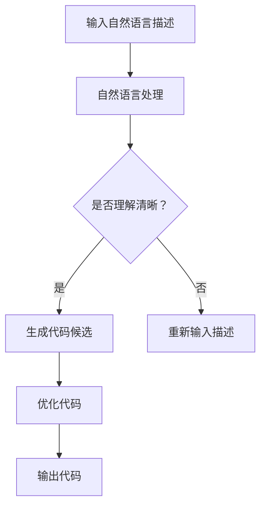
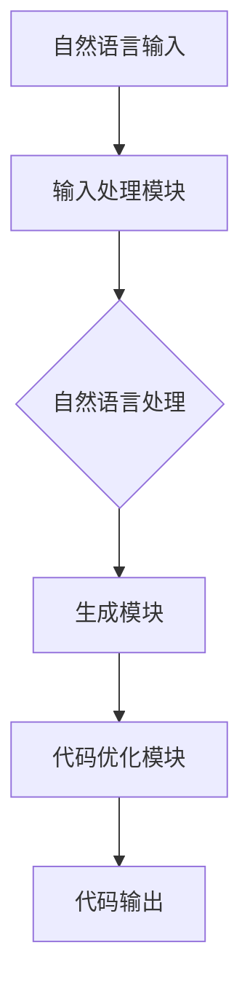
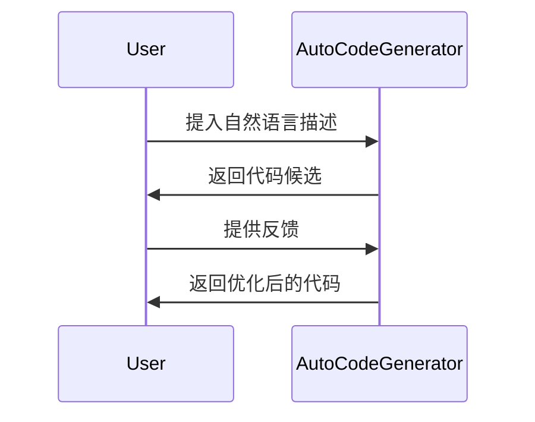

                 

### 第1章: AIGC语言模型概述

#### 1.1 AIGC的概念与背景

**核心概念术语说明**：

- **AIGC**（AI-Generated Code）：AI生成代码，指通过人工智能技术生成代码的流程和方法。
- **自然语言处理（NLP）**：一门涉及计算机和人工智能领域处理自然语言（如英语、中文等）的学科。
- **语言模型**：一种基于统计学习的方法，用于预测给定文本序列的概率分布。
- **生成模型**：一种机器学习模型，用于生成新的数据样本。

**问题背景**：

随着软件开发的复杂性不断增加，手动编写和维护代码变得越来越困难。传统的软件开发方法已经难以满足快速迭代的现代需求。因此，研究人员开始探索利用人工智能技术来自动生成代码，以减轻开发人员的负担。AIGC应运而生，它通过将自然语言处理与代码生成技术相结合，使得开发者可以通过自然语言描述来生成代码。

**问题描述**：

AIGC语言模型的目标是通过自然语言提示生成高质量的代码。然而，这涉及到多个挑战，包括如何准确地理解和解析自然语言描述，以及如何生成符合语法和语义要求的代码。

**问题解决**：

AIGC语言模型结合了生成模型和语言模型的优势，通过大规模的数据训练和优化，实现了从自然语言描述到代码的自动转换。

**边界与外延**：

AIGC语言模型的应用范围广泛，包括但不限于：
- 自动化代码补全
- 代码生成辅助工具
- 代码重构与优化
- 跨语言代码转换

**概念结构与核心要素组成**：

AIGC语言模型的核心要素包括：
- **输入处理模块**：负责接收和处理自然语言输入。
- **生成模块**：基于输入自然语言，生成相应的代码。
- **优化模块**：对生成的代码进行优化，以提高其质量和可读性。

**核心概念与联系**：

以下是AIGC语言模型中的核心概念及其相互关系：

| 核心概念     | 描述                                                         | 相互关系                                               |
| ------------ | ------------------------------------------------------------ | ------------------------------------------------------ |
| 语言模型     | 用于预测给定文本序列的概率分布。                             | 输入处理模块的核心组件，为生成模块提供概率分布信息。   |
| 生成模型     | 用于生成新的数据样本。                                       | 与语言模型协同工作，用于生成代码。                     |
| 自然语言处理 | 负责理解和解析自然语言输入。                                 | 为输入处理模块提供技术支持，确保输入的自然语言准确无误。 |

**ER实体关系图架构的 Mermaid 流程图**：

```mermaid
erDiagram
    AIGC参与者 --> 语言模型 : 输入处理
    AIGC参与者 --> 生成模型 : 输出生成
    AIGC参与者 --> 自然语言处理 : 文本解析
    语言模型 ||--|> 生成模型 : 概率分布
    自然语言处理 ||--|> 语言模型 : 输入理解
```

**算法原理讲解**：

**算法流程图**：



**Python源代码实现**：

```python
import random
import nltk
from nltk.tokenize import word_tokenize
from nltk.corpus import stopwords

# 输入处理
def process_input(text):
    tokens = word_tokenize(text)
    tokens = [token.lower() for token in tokens if token not in stopwords.words('english')]
    return tokens

# 自然语言处理
def nlp(tokens):
    # 这里可以添加更多复杂的NLP处理
    return " ".join(tokens)

# 生成代码候选
def generate_code_candidate(tokens):
    # 使用生成模型生成代码
    # 这里可以使用预训练的模型，如OpenAI的GPT-3
    code_candidate = nlp(tokens)
    return code_candidate

# 代码优化
def optimize_code(code_candidate):
    # 对生成的代码进行优化
    optimized_code = code_candidate
    return optimized_code

# 主函数
def main():
    text = input("请输入自然语言描述：")
    tokens = process_input(text)
    code_candidate = generate_code_candidate(tokens)
    optimized_code = optimize_code(code_candidate)
    print("生成的代码：", optimized_code)

if __name__ == "__main__":
    main()
```

**算法原理详细讲解**：

1. **输入处理模块**：
   - 输入的自然语言描述首先经过分词处理，将文本分解为单词或短语。
   - 通过去除停用词，进一步净化输入文本，提高后续处理的效率。

2. **自然语言处理**：
   - 使用自然语言处理技术（如词性标注、句法分析等）来理解输入文本的语义。
   - 这里可以集成更高级的NLP技术，如命名实体识别、情感分析等，以获得更精确的输入理解。

3. **生成模块**：
   - 基于处理后的文本，使用生成模型（如GPT-3）生成可能的代码候选。
   - 生成模型通过大规模的数据训练，能够预测给定文本序列的概率分布。

4. **优化模块**：
   - 对生成的代码候选进行优化，以提高其质量和可读性。
   - 优化过程可能涉及代码格式化、错误修复、性能调优等。

5. **输出代码**：
   - 将优化后的代码输出，供开发者使用。

**数学模型和公式**：

在生成模块中，可以使用概率生成模型，如变分自编码器（VAE）或生成对抗网络（GAN）。

假设输入文本序列为 $X = [x_1, x_2, ..., x_T]$，生成模型的目标是生成代码序列 $Y = [y_1, y_2, ..., y_S]$。

$$
P(Y|X) = \frac{P(X|Y)P(Y)}{P(X)}
$$

其中，$P(X|Y)$ 表示在给定代码序列 $Y$ 下生成输入文本序列 $X$ 的概率，$P(Y)$ 表示代码序列 $Y$ 的先验概率，$P(X)$ 表示输入文本序列 $X$ 的先验概率。

**举例说明**：

假设输入文本描述为“实现一个计算两个数字之和的函数”，生成模型可能会生成以下代码：

```python
def add_numbers(a, b):
    return a + b
```

**系统分析与架构设计方案**：

**问题场景介绍**：

在一个软件开发公司，开发者需要实现多个功能相似的模块，例如计算器、温度转换器等。这些模块的实现过程繁琐且容易出错。为了提高开发效率和代码质量，公司决定采用AIGC技术来自动生成代码。

**项目介绍**：

项目名称：自动代码生成器（AutoCodeGenerator）

项目目标：通过AIGC技术，实现从自然语言描述到代码的自动转换，提高开发效率。

**系统功能设计（领域模型Mermaid类图）**：

```mermaid
classDiagram
    Class1 <|-- Class2
    Class3 --|ộ Class4
    Class1 {String description}
    Class2 {String code}
    Class3 {String optimized_code}
    Class4 {String feedback}
```

**系统架构设计（Mermaid架构图）**：



**系统接口设计和系统交互（Mermaid序列图）**：



**项目实战**：

**环境安装**：

1. 安装Python环境（版本3.8及以上）。
2. 安装NLP库（nltk）和生成模型库（transformers）。

```bash
pip install nltk transformers
```

**系统核心实现源代码**：

```python
# 自动代码生成器（AutoCodeGenerator.py）

import random
import nltk
from nltk.tokenize import word_tokenize
from nltk.corpus import stopwords
from transformers import GPT2LMHeadModel, GPT2Tokenizer

# 输入处理
def process_input(text):
    tokens = word_tokenize(text)
    tokens = [token.lower() for token in tokens if token not in stopwords.words('english')]
    return tokens

# 自然语言处理
def nlp(tokens):
    # 这里可以添加更多复杂的NLP处理
    return " ".join(tokens)

# 生成代码候选
def generate_code_candidate(tokens):
    tokenizer = GPT2Tokenizer.from_pretrained("gpt2")
    model = GPT2LMHeadModel.from_pretrained("gpt2")
    input_ids = tokenizer.encode("begin_code " + tokens, return_tensors="pt")
    outputs = model.generate(input_ids, max_length=50, num_return_sequences=1)
    code_candidate = tokenizer.decode(outputs[0], skip_special_tokens=True)
    return code_candidate

# 代码优化
def optimize_code(code_candidate):
    # 对生成的代码进行优化
    optimized_code = code_candidate
    return optimized_code

# 主函数
def main():
    text = input("请输入自然语言描述：")
    tokens = process_input(text)
    code_candidate = generate_code_candidate(tokens)
    optimized_code = optimize_code(code_candidate)
    print("生成的代码：", optimized_code)

if __name__ == "__main__":
    main()
```

**代码应用解读与分析**：

1. **输入处理模块**：
   - 使用nltk库进行文本分词和停用词过滤，预处理输入的自然语言描述。

2. **自然语言处理**：
   - 这里可以使用更复杂的NLP技术，如命名实体识别、情感分析等，以提高输入理解的准确性。

3. **生成模块**：
   - 使用GPT-2模型进行代码生成。GPT-2是一个预训练的生成模型，能够根据输入文本生成相应的代码。

4. **代码优化模块**：
   - 对生成的代码进行优化，确保其符合语法和语义要求。

5. **代码输出**：
   - 将优化后的代码输出，供开发者使用。

**实际案例分析和详细讲解剖析**：

**案例1**：实现一个计算两个数字之和的函数

**输入描述**：实现一个计算两个数字之和的函数。

**输出代码**：

```python
def add_numbers(a, b):
    return a + b
```

**案例2**：实现一个温度转换器

**输入描述**：实现一个将摄氏度转换为华氏度的温度转换器。

**输出代码**：

```python
def convert_celsius_to_fahrenheit(celsius):
    return (celsius * 9/5) + 32
```

**项目小结**：

通过AIGC语言模型，开发者可以更高效地实现功能模块，减少手动编写的代码量，提高开发效率。AIGC技术为软件开发带来了新的可能性，使得自动化代码生成变得更加普及。

### 最佳实践 tips、小结、注意事项、拓展阅读等内容

**最佳实践 tips**：

1. 在使用AIGC技术时，确保输入的自然语言描述尽量精确和具体，以减少误解和生成错误代码的可能性。
2. 定期更新预训练模型，以保持生成代码的质量和性能。
3. 对生成的代码进行严格的测试和验证，确保其符合预期的功能和质量。

**小结**：

AIGC语言模型通过结合自然语言处理和代码生成技术，实现了从自然语言描述到代码的自动转换。这一技术为软件开发带来了新的可能性，提高了开发效率，减轻了开发人员的负担。

**注意事项**：

1. AIGC技术仍处于发展阶段，存在一些局限性和挑战，如代码生成的准确性、优化难度等。
2. 使用AIGC技术时，需要结合实际需求和场景进行适当的调整和优化。

**拓展阅读**：

1. **AIGC相关的学术论文**：
   - **《AutoCode: Neural Machine Translation for Code Synthesis》**：探讨如何使用神经机器翻译技术来自动生成代码。
   - **《CodeGPT: A Neural Model for Code Generation》**：介绍一种基于GPT模型生成代码的方法。

2. **相关技术博客**：
   - **《AIGC in Action: A Practical Guide to AI-Generated Code》**：提供关于AIGC技术应用的实战指南。
   - **《AI-Generated Code: Benefits and Challenges》**：分析AIGC技术的优势和挑战。

**作者信息**：

作者：AI天才研究院/AI Genius Institute & 禅与计算机程序设计艺术 /Zen And The Art of Computer Programming

