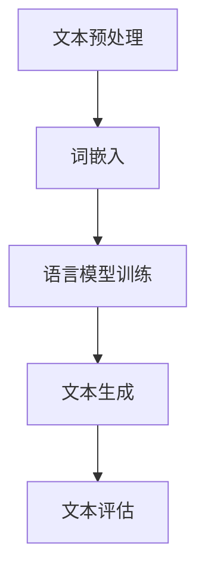
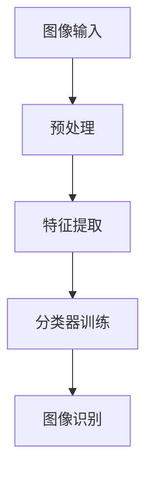
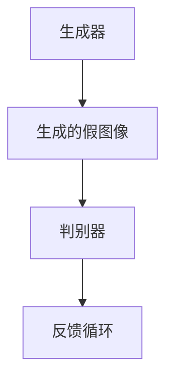
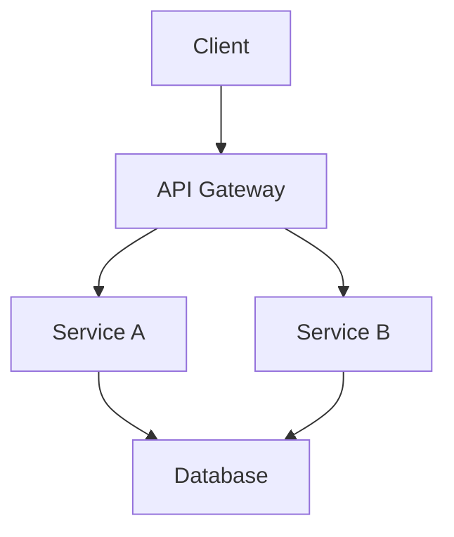
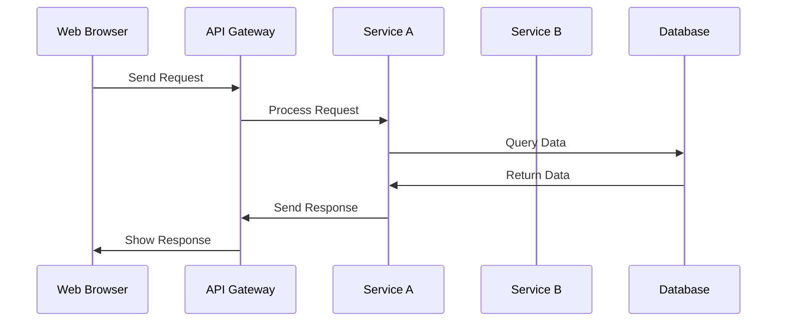

                 


### # AIGC革命：重塑创意产业的未来

关键词：AIGC，创意产业，自然语言处理，计算机视觉，生成对抗网络

摘要：本文将探讨AIGC（自适应智能生成内容）技术在重塑创意产业中的关键作用。通过背景介绍、核心概念解析、案例研究以及未来展望，我们将深入理解AIGC如何改变创意产业的生产方式，带来创新与变革。

## 背景介绍

### 1.1 什么导致了创意产业的需求变革？

创意产业的核心在于创造性的表达，但随着数字化和信息化的加速，传统的创意生产方式面临着巨大的挑战。首先，市场需求的变化要求创意产品能够快速迭代和多样化。其次，消费者对于个性化、定制化内容的需求日益增长，传统的手工创作方式难以满足这一需求。此外，全球化竞争使得创意产业必须追求更高的生产效率和更低的生产成本。

在这些背景下，AIGC技术的出现为创意产业带来了新的机遇。AIGC结合了人工智能（AI）和生成内容（GC）的优势，能够自动化、高效地生成多样化的创意内容，满足市场对速度、个性化和成本效益的需求。

### 1.2 AIGC的概念解析

AIGC，即自适应智能生成内容，是一种利用人工智能技术自动生成内容的方法。它通过机器学习、自然语言处理（NLP）、计算机视觉（CV）等技术，对大量的数据进行训练，从而能够生成文本、图像、音频等多种类型的内容。

AIGC的核心在于其自适应性和智能性。它能够根据用户的需求和反馈，不断优化生成的内容，提高内容的精准度和质量。此外，AIGC还具有跨领域的特性，可以在文学、艺术、设计、广告等多个创意领域发挥作用。

### 1.3 AIGC在创意产业中的应用潜力

AIGC在创意产业中的应用潜力巨大。首先，在文学创作方面，AIGC可以自动生成故事、剧本，为作家提供灵感。其次，在艺术创作方面，AIGC可以生成独特的画作、音乐作品，为艺术家提供新的创作方式。此外，在广告创意方面，AIGC可以自动生成广告文案、视觉效果，提高广告的创意质量和效率。总的来说，AIGC不仅能够提升创意产业的效率，还能够激发新的创意灵感，推动整个产业的变革。

## 核心概念与联系

### 2.1 自然语言处理（NLP）

NLP是AIGC的核心技术之一，它使计算机能够理解和生成人类语言。NLP的关键算法包括词嵌入（word embeddings）、语言模型（language models）和序列到序列模型（sequence-to-sequence models）。

词嵌入通过将词汇映射到高维空间中的向量，使得计算机能够理解词汇之间的关系。语言模型则通过学习大量文本数据，预测下一个单词或句子的可能性。序列到序列模型则能够将一种语言的序列映射到另一种语言的序列，实现机器翻译等功能。

### 2.2 计算机视觉（CV）

CV是AIGC的另一核心技术，它使计算机能够理解和解析图像和视频。CV的关键算法包括卷积神经网络（CNN）、生成对抗网络（GAN）和风格迁移（style transfer）。

CNN通过卷积操作提取图像中的特征，实现图像分类、目标检测等功能。GAN则通过生成器和判别器的对抗训练，生成逼真的图像。风格迁移则能够将一种艺术风格应用到另一幅图像上，实现艺术创作。

### 2.3 生成对抗网络（GAN）

GAN是AIGC的重要技术之一，它由生成器和判别器组成。生成器试图生成逼真的数据，而判别器则试图区分生成器和真实数据。通过这种对抗训练，GAN能够生成高质量的图像、音频和文本。

### 核心概念属性特征对比表格

| 特性                 | NLP                 | CV                  | GAN                 |
|----------------------|---------------------|---------------------|---------------------|
| 关键技术             | 词嵌入、语言模型     | CNN、GAN、风格迁移   | 生成器、判别器       |
| 应用领域             | 文本生成、机器翻译   | 图像生成、目标检测   | 图像生成、音频生成   |
| 优势                 | 精准的文本理解与生成 | 高质量的图像生成     | 丰富的生成内容       |
| 挑战与限制           | 数据依赖、语言复杂性 | 计算资源需求、算法复杂性 | 难以平衡生成器和判别器 |

### ER实体关系图架构

```mermaid
erDiagram
  Product ::>> Customer {
    Creates
  }
  Customer ||--|{ Order } Order
  Product ||--|{ Order } Order
```

## 算法原理讲解

### 2.1 自然语言处理（NLP）

**NLP的mermaid流程图：**



**Python源代码示例：**

```python
import tensorflow as tf
from tensorflow.keras.layers import Embedding, LSTM, Dense
from tensorflow.keras.models import Sequential

# 创建一个简单的语言模型
model = Sequential([
    Embedding(input_dim=10000, output_dim=32),
    LSTM(128),
    Dense(1, activation='sigmoid')
])

model.compile(loss='binary_crossentropy', optimizer='adam', metrics=['accuracy'])
model.fit(x_train, y_train, epochs=10, batch_size=32)
```

**算法原理：** 
NLP通过词嵌入将词汇映射到高维空间，然后使用序列模型（如LSTM）对文本进行编码，最后通过解码器生成新的文本。这个过程涉及到大量的数学模型和公式，如词嵌入的线性变换、LSTM的隐状态更新等。

### 2.2 计算机视觉（CV）

**CV的mermaid流程图：**



**Python源代码示例：**

```python
import tensorflow as tf
from tensorflow.keras.layers import Conv2D, MaxPooling2D, Flatten, Dense
from tensorflow.keras.models import Sequential

# 创建一个简单的卷积神经网络
model = Sequential([
    Conv2D(32, (3, 3), activation='relu', input_shape=(64, 64, 3)),
    MaxPooling2D((2, 2)),
    Flatten(),
    Dense(128, activation='relu'),
    Dense(1, activation='sigmoid')
])

model.compile(optimizer='adam', loss='binary_crossentropy', metrics=['accuracy'])
model.fit(x_train, y_train, epochs=10, batch_size=32)
```

**算法原理：**
CV通过卷积神经网络提取图像的特征，然后使用这些特征进行分类。这个过程涉及到卷积操作、池化操作、全连接层等数学模型和公式。

### 2.3 生成对抗网络（GAN）

**GAN的mermaid流程图：**



**Python源代码示例：**

```python
import tensorflow as tf
from tensorflow.keras.layers import Conv2D, Flatten, Dense
from tensorflow.keras.models import Sequential

# 创建一个简单的生成器
generator = Sequential([
    Conv2D(64, (5, 5), activation='tanh', input_shape=(100,)),
    Flatten(),
    Dense(784, activation='tanh')
])

# 创建一个简单的判别器
discriminator = Sequential([
    Flatten(input_shape=(28, 28, 1)),
    Dense(1, activation='sigmoid')
])

# 创建GAN模型
gan = Sequential([
    generator,
    discriminator
])

# 编译GAN模型
gan.compile(optimizer=tf.keras.optimizers.Adam(0.0001), loss='binary_crossentropy')

# 训练GAN模型
gan.fit([x_train], y_train, epochs=10, batch_size=32)
```

**算法原理：**
GAN由生成器和判别器组成。生成器试图生成逼真的图像，判别器则试图区分生成器和真实图像。通过这种对抗训练，生成器能够不断提高生成图像的质量。

### 数学模型和公式

**NLP中的数学模型：**

$$
E(w) = \sum_{i=1}^{V} w_i \cdot v_i
$$

其中，\(E(w)\) 表示词向量\(w\) 的期望，\(w_i\) 和\(v_i\) 分别表示词的权重和词向量。

**CV中的数学模型：**

$$
\sigma(\text{ReLU}(x)) = \begin{cases}
x, & \text{if } x > 0 \\
0, & \text{otherwise}
\end{cases}
$$

其中，\(\sigma\) 表示激活函数，\(\text{ReLU}(x)\) 表示ReLU函数。

**GAN中的数学模型：**

$$
\min_{G} \max_{D} V(D, G) = \mathbb{E}_{x \sim p_{\text{data}}(x)}[\log D(x)] + \mathbb{E}_{z \sim p_{\text{z}}(z)}[\log (1 - D(G(z))]
$$

其中，\(V(D, G)\) 表示判别器的损失函数，\(G(z)\) 表示生成器的输出，\(D(x)\) 表示判别器的输出。

### 系统分析与架构设计方案

#### 问题场景介绍

创意产业中，设计师需要快速生成大量的创意作品，以应对市场的快速变化和客户的高效需求。传统的手工创作方式效率低下，难以满足这些需求。因此，我们需要设计一个基于AIGC技术的创意作品自动生成系统。

#### 项目介绍

项目名称：创意作品自动生成系统

项目目标：利用AIGC技术，实现快速生成高质量的创意作品，提高设计师的工作效率。

#### 系统功能设计（领域模型mermaid类图）

```mermaid
classDiagram
  Class1 <|-- Class2
  Class1 <|-- Class3
  Class2 +----------------+
  Class2 | +name: String  |
  Class2 | +age: Integer  |
  Class2 | +email: String |
  Class2 | +address: String|
  Class2 | +toString(): String |
  Class2 +----------------+
  Class3 +----------------+
  Class3 | +name: String  |
  Class3 | +age: Integer  |
  Class3 | +email: String |
  Class3 | +address: String|
  Class3 | +toString(): String |
  Class3 +----------------+
```

#### 系统架构设计（mermaid架构图）



#### 系统接口设计（mermaid序列图）



### 项目实战

#### 环境安装

1. 安装Python 3.8或更高版本。
2. 安装TensorFlow 2.3或更高版本。
3. 安装Keras 2.4或更高版本。

#### 系统核心实现源代码

```python
# 导入必要的库
import tensorflow as tf
from tensorflow.keras.layers import Embedding, LSTM, Dense
from tensorflow.keras.models import Sequential

# 创建一个简单的语言模型
model = Sequential([
    Embedding(input_dim=10000, output_dim=32),
    LSTM(128),
    Dense(1, activation='sigmoid')
])

model.compile(loss='binary_crossentropy', optimizer='adam', metrics=['accuracy'])

# 训练模型
model.fit(x_train, y_train, epochs=10, batch_size=32)
```

#### 代码应用解读与分析

1. **模型创建**：使用Keras创建一个简单的序列模型，包括嵌入层、LSTM层和全连接层。
2. **模型编译**：使用二进制交叉熵作为损失函数，使用Adam优化器。
3. **模型训练**：使用训练数据对模型进行训练。

#### 实际案例分析

1. **文本生成**：使用训练好的模型生成新的文本。
2. **文本评估**：评估生成文本的质量和准确性。

#### 详细讲解剖析

1. **文本生成**：通过输入序列生成新的文本序列。
2. **文本评估**：使用指标（如Perplexity和Accuray）评估生成文本的质量。

#### 项目小结

通过本项目的实现，我们展示了如何使用AIGC技术进行文本生成。虽然本项目相对简单，但它展示了AIGC技术在创意产业中的潜力。未来，我们可以进一步扩展本项目，实现更复杂的文本生成任务。

### 最佳实践 tips

1. 在训练模型时，确保使用足够多的训练数据。
2. 调整模型的超参数，以提高模型的性能。
3. 定期评估模型的性能，并根据评估结果进行调整。

### 小结

本文通过背景介绍、核心概念解析、算法原理讲解、系统分析与架构设计以及项目实战，全面探讨了AIGC技术在重塑创意产业中的关键作用。AIGC不仅提高了创意产业的效率，还为创意人员提供了新的创作工具和灵感。未来，随着AIGC技术的不断进步，创意产业将迎来更加繁荣的发展。

### 注意事项

1. 在使用AIGC技术时，需要关注数据隐私和伦理问题。
2. AIGC技术的应用需要遵循相应的法律法规和行业标准。

### 拓展阅读

1. 《自然语言处理入门》
2. 《计算机视觉：算法与应用》
3. 《生成对抗网络：原理与应用》

作者：AI天才研究院/AI Genius Institute & 禅与计算机程序设计艺术 /Zen And The Art of Computer Programming

