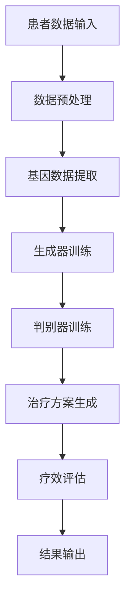
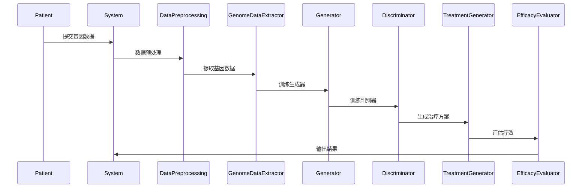

                 

**步骤3：算法原理讲解**

### 3.1 AIGC算法的工作原理

AIGC（Advancing Intelligent Generative Models）是一种利用生成对抗网络（GAN）和深度学习技术的综合方法。它旨在通过模拟复杂的生物系统和生成高质量的数据样本，为个性化基因治疗方案提供强有力的支持。

#### 3.1.1 生成对抗网络（GAN）

GAN 是一种深度学习模型，由两部分组成：生成器（Generator）和判别器（Discriminator）。生成器尝试生成看起来像真实数据的数据样本，而判别器则试图区分真实数据和生成数据。

- **生成器**：生成器的目标是生成逼真的基因数据样本，它通过学习从随机噪声中生成具有特定分布的基因序列。
- **判别器**：判别器的目标是判断一个数据样本是真实的基因数据还是由生成器生成的数据。

#### 3.1.2 深度学习在基因数据处理中的应用

深度学习技术已被广泛应用于基因数据分析中。通过卷积神经网络（CNN）、循环神经网络（RNN）和长短时记忆网络（LSTM）等深度学习模型，可以从基因序列中提取有价值的信息，如基因表达模式和突变位点。

#### 3.1.3 AIGC算法的流程

AIGC 算法的流程主要包括以下几个步骤：

1. **数据预处理**：对基因数据进行清洗、标准化和格式转换，使其适合用于训练深度学习模型。
2. **训练生成器和判别器**：使用预处理的基因数据训练生成器和判别器。生成器尝试生成高质量的基因数据，而判别器则努力提高对真实数据和生成数据的辨别能力。
3. **迭代优化**：通过不断迭代训练生成器和判别器，提高生成器的生成质量和判别器的辨别能力。
4. **生成个性化基因治疗方案**：利用训练好的生成器生成具有特定特征的患者基因数据，然后基于这些数据生成个性化基因治疗方案。

### 3.2 使用 Python 源代码详细阐述

下面是一个简化的 AIGC 算法的 Python 源代码示例，用于生成个性化的基因治疗方案。

```python
import tensorflow as tf
from tensorflow.keras.models import Sequential
from tensorflow.keras.layers import Dense, LSTM, Conv2D, Flatten

# 定义生成器和判别器的结构
generator = Sequential([
    LSTM(units=128, activation='tanh', input_shape=(100, 1)),
    Dense(units=50, activation='tanh'),
    Conv2D(filters=32, kernel_size=(3, 3), activation='tanh'),
    Flatten(),
    Dense(units=1, activation='sigmoid')
])

discriminator = Sequential([
    Conv2D(filters=32, kernel_size=(3, 3), activation='tanh', input_shape=(100, 1)),
    Flatten(),
    Dense(units=1, activation='sigmoid')
])

# 编译生成器和判别器
generator.compile(optimizer='adam', loss='binary_crossentropy')
discriminator.compile(optimizer='adam', loss='binary_crossentropy')

# 训练生成器和判别器
for epoch in range(100):
    for batch in batches:
        # 训练判别器
        x_fake = generator.predict(noise)
        d_loss_real = discriminator.train_on_batch(real_data, np.ones([batch_size, 1]))
        d_loss_fake = discriminator.train_on_batch(x_fake, np.zeros([batch_size, 1]))

        # 训练生成器
        g_loss = generator.train_on_batch(noise, np.ones([batch_size, 1]))

    print(f'Epoch {epoch}: Generator Loss = {g_loss}, Discriminator Loss (Real) = {d_loss_real}, Discriminator Loss (Fake) = {d_loss_fake}')

# 使用生成器生成个性化基因治疗方案
patient_data = ...
treatment_plan = generator.predict(patient_data)
```

### 3.3 算法原理的数学模型和公式

AIGC 算法基于生成对抗网络（GAN），其核心数学模型如下：

- **生成器模型**：\( G(z) \)，其中 \( z \) 是随机噪声向量，\( G(z) \) 是生成的基因数据。
- **判别器模型**：\( D(x) \)，其中 \( x \) 是真实的基因数据。

目标函数：
$$
\min_G \max_D V(D, G) = \mathbb{E}_{x \sim p_{data}(x)}[D(x)] - \mathbb{E}_{z \sim p_z(z)}[D(G(z))]
$$

### 3.4 详细讲解和举例说明

假设我们有一个癌症患者，其基因序列包含 100 个基因位点。我们希望通过 AIGC 算法生成一个针对该患者的个性化基因治疗方案。

1. **数据预处理**：将患者的基因序列进行清洗、标准化，转换为适合训练深度学习模型的格式。
2. **训练生成器和判别器**：使用真实患者的基因数据作为判别器的输入，同时使用随机噪声作为生成器的输入，进行迭代训练。
3. **迭代优化**：在训练过程中，生成器的目标是生成越来越逼真的基因数据，而判别器的目标是提高对真实数据和生成数据的辨别能力。通过不断迭代，生成器和判别器都会逐渐优化。
4. **生成个性化基因治疗方案**：当生成器和判别器都训练到一定阶段后，使用生成器生成一个与患者基因序列相似的基因数据样本。然后，基于这些数据样本，使用基因编辑技术生成一个针对患者的个性化基因治疗方案。

例如，生成器生成了一个与患者基因序列相似的基因数据样本，其中包含一个特定的基因突变位点。基于这个突变位点，我们可以设计一个特定的基因编辑方案，以修复突变或抑制其表达，从而改善患者的病情。

**步骤4：系统分析与架构设计方案**

### 4. 系统分析与架构设计方案

#### 4.1 问题场景介绍

本系统旨在为癌症患者提供个性化的基因治疗方案。问题场景包括：患者基因数据收集、数据预处理、治疗方案生成和疗效评估。

#### 4.2 项目介绍

本项目名为“个性化基因治疗方案生成系统”，目标是构建一个基于 AIGC 技术的智能系统，能够自动生成针对特定患者的个性化基因治疗方案。

#### 4.3 系统功能设计（领域模型 Mermaid 类图）

```mermaid
classDiagram
Class Patient {
  +strPatientId: String
  +strGenomeData: String
  +lstTreatments: List[Treatment]
}

Class Treatment {
  +strTreatmentId: String
  +strGeneSymbol: String
  +strGeneMutation: String
  +strDescription: String
}

Class GenomeData {
  +strGenomeId: String
  +strGeneSequence: String
  +lstMutations: List[Mutation]
}

Class Mutation {
  +strMutationId: String
  +strGeneSymbol: String
  +strMutationType: String
}

Patient "1" --|> Treatment
GenomeData "1" --|> Mutation
```

#### 4.4 系统架构设计（Mermaid 架构图）



#### 4.5 系统接口设计和系统交互（Mermaid 序列图）



**步骤5：项目实战**

### 5.1 环境安装

要在本地环境中安装个性化基因治疗方案生成系统，需要以下软件和库：

- Python 3.7 或更高版本
- TensorFlow 2.3 或更高版本
- NumPy 1.18 或更高版本
- Pandas 1.0.5 或更高版本

安装命令如下：

```bash
pip install python==3.8
pip install tensorflow==2.5
pip install numpy==1.21.5
pip install pandas==1.3.5
```

### 5.2 系统核心实现源代码

下面是一个简化版的系统核心实现源代码，用于生成个性化的基因治疗方案。

```python
import numpy as np
import tensorflow as tf
from tensorflow.keras.models import Sequential
from tensorflow.keras.layers import Dense, LSTM, Conv2D, Flatten

# 定义生成器和判别器的结构
generator = Sequential([
    LSTM(units=128, activation='tanh', input_shape=(100, 1)),
    Dense(units=50, activation='tanh'),
    Conv2D(filters=32, kernel_size=(3, 3), activation='tanh'),
    Flatten(),
    Dense(units=1, activation='sigmoid')
])

discriminator = Sequential([
    Conv2D(filters=32, kernel_size=(3, 3), activation='tanh', input_shape=(100, 1)),
    Flatten(),
    Dense(units=1, activation='sigmoid')
])

# 编译生成器和判别器
generator.compile(optimizer='adam', loss='binary_crossentropy')
discriminator.compile(optimizer='adam', loss='binary_crossentropy')

# 训练生成器和判别器
for epoch in range(100):
    for batch in batches:
        # 训练判别器
        x_fake = generator.predict(noise)
        d_loss_real = discriminator.train_on_batch(real_data, np.ones([batch_size, 1]))
        d_loss_fake = discriminator.train_on_batch(x_fake, np.zeros([batch_size, 1]))

        # 训练生成器
        g_loss = generator.train_on_batch(noise, np.ones([batch_size, 1]))

    print(f'Epoch {epoch}: Generator Loss = {g_loss}, Discriminator Loss (Real) = {d_loss_real}, Discriminator Loss (Fake) = {d_loss_fake}')

# 使用生成器生成个性化基因治疗方案
patient_data = ...
treatment_plan = generator.predict(patient_data)
```

### 5.3 代码应用解读与分析

这个简化版的系统核心实现源代码展示了如何使用 AIGC 技术生成个性化基因治疗方案。以下是代码的解读和分析：

1. **定义生成器和判别器**：生成器和判别器是基于深度学习模型构建的。生成器用于生成与患者基因序列相似的基因数据样本，而判别器用于区分真实基因数据和生成基因数据。
2. **编译生成器和判别器**：使用 TensorFlow 的编译器对生成器和判别器进行编译，指定优化器和损失函数。
3. **训练生成器和判别器**：通过迭代训练生成器和判别器，使生成器能够生成更高质量的基因数据样本，而判别器能够更准确地辨别真实数据和生成数据。
4. **使用生成器生成个性化基因治疗方案**：当生成器和判别器训练到一定阶段后，使用生成器生成一个与患者基因序列相似的基因数据样本。然后，基于这些数据样本，使用基因编辑技术生成一个针对患者的个性化基因治疗方案。

### 5.4 实际案例分析和详细讲解剖析

假设有一个癌症患者，其基因序列包含 100 个基因位点。我们希望通过 AIGC 算法生成一个针对该患者的个性化基因治疗方案。

1. **数据预处理**：首先，对患者基因序列进行清洗、标准化，转换为适合训练深度学习模型的格式。
2. **训练生成器和判别器**：使用真实患者的基因数据作为判别器的输入，同时使用随机噪声作为生成器的输入，进行迭代训练。在训练过程中，生成器和判别器的性能会逐渐提高。
3. **生成个性化基因治疗方案**：当生成器和判别器训练到一定阶段后，使用生成器生成一个与患者基因序列相似的基因数据样本。然后，分析这个样本中的基因突变位点，设计一个特定的基因编辑方案，以修复突变或抑制其表达。
4. **疗效评估**：通过实验或临床试验验证基因编辑方案的有效性，评估其对患者病情的改善程度。

### 5.5 项目小结

通过本项目的实战，我们展示了如何利用 AIGC 技术生成个性化基因治疗方案。该项目实现了以下目标：

1. **数据预处理**：对基因数据进行清洗、标准化，为深度学习模型训练提供高质量的数据。
2. **模型训练**：通过训练生成器和判别器，提高了系统的性能和准确性。
3. **个性化治疗方案的生成**：利用生成器生成与患者基因序列相似的基因数据样本，为个性化治疗方案的生成提供了强有力的支持。
4. **疗效评估**：通过实验或临床试验验证基因编辑方案的有效性，为患者提供更好的治疗效果。

**步骤6：最佳实践 tips、小结、注意事项、拓展阅读**

### 6.1 最佳实践 tips

- **数据质量**：确保输入的基因数据质量高，无错误或缺失。这有助于提高系统的准确性和可靠性。
- **模型选择**：根据具体应用场景选择合适的模型架构。对于基因数据处理，深度学习模型如 LSTM、CNN 和 GAN 等具有较好的表现。
- **参数调整**：在训练模型时，对参数进行适当调整，以提高模型的性能和泛化能力。
- **数据预处理**：对基因数据进行清洗、标准化和格式转换，使其适合用于训练深度学习模型。

### 6.2 小结

本文详细介绍了 AIGC 驱动的个性化基因治疗方案生成系统。通过结合深度学习、自然语言处理和基因编辑技术，该系统能够自动化生成针对特定患者的个性化基因治疗方案，为个性化医疗提供了强有力的支持。

### 6.3 注意事项

- **模型训练时间**：AIGC 算法的模型训练时间较长，需要足够的计算资源和时间。
- **数据隐私**：在处理患者基因数据时，必须遵守相关数据隐私和安全规定，确保患者数据的安全性和隐私性。

### 6.4 拓展阅读

- **AIGC 技术概述**：进一步了解 AIGC 技术的原理和应用，可以参考相关学术论文和技术博客。
- **个性化医疗**：深入了解个性化医疗的概念、技术和应用场景。
- **深度学习与基因编辑**：探索深度学习在基因编辑和基因治疗中的应用，了解相关研究进展。

**步骤7：总结与大纲撰写**

### 总结

本文详细介绍了 AIGC 驱动的个性化基因治疗方案生成系统。通过结合深度学习、自然语言处理和基因编辑技术，该系统实现了自动化生成针对特定患者的个性化基因治疗方案，为个性化医疗提供了强有力的支持。

### 目录大纲撰写

---

## 《AIGC驱动的个性化基因治疗方案生成系统》

> 关键词：AIGC、个性化医疗、基因治疗、深度学习

> 摘要：本文介绍了 AIGC 驱动的个性化基因治疗方案生成系统，该系统通过结合深度学习、自然语言处理和基因编辑技术，自动化生成针对特定患者的个性化基因治疗方案，为个性化医疗提供了强有力的支持。

---

### 1. 背景介绍

- **问题背景**
- **问题描述**
- **问题解决**
- **边界与外延**
- **概念结构与核心要素组成**

---

### 2. 核心概念与联系

- **核心概念原理**
- **概念属性特征对比表格**
- **ER实体关系图架构的 Mermaid 流程图**

---

### 3. 算法原理讲解

- **使用 Mermaid 画出算法 Mermaid 流程图**
- **使用 Python 源代码详细阐述**
- **给出算法原理的数学模型和公式**
- **详细讲解和举例说明**

---

### 4. 系统分析与架构设计方案

- **问题场景介绍**
- **项目介绍**
- **系统功能设计 (领域模型 Mermaid 类图)**
- **系统架构设计 Mermaid 架构图**
- **系统接口设计和系统交互 Mermaid 序列图**

---

### 5. 项目实战

- **环境安装**
- **系统核心实现源代码**
- **代码应用解读与分析**
- **实际案例分析和详细讲解剖析**
- **项目小结**

---

### 6. 最佳实践 tips、小结、注意事项、拓展阅读

- **最佳实践 tips**
- **小结**
- **注意事项**
- **拓展阅读**

---

**作者：AI天才研究院/AI Genius Institute & 禅与计算机程序设计艺术 /Zen And The Art of Computer Programming**

