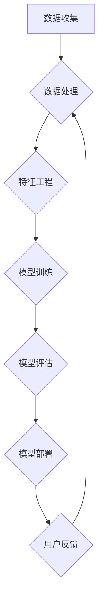
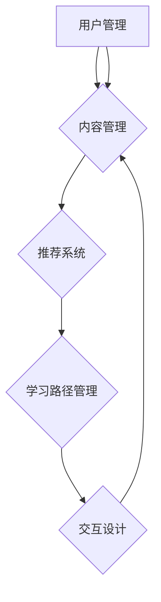
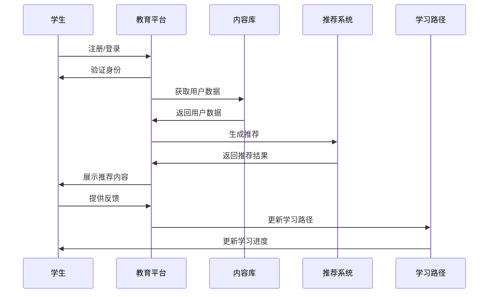

                 

# AIGC驱动的多维度个性化教育系统设计

## 关键词
- AIGC
- 个性化教育
- 系统设计
- 机器学习
- 用户体验

## 摘要
本文旨在探讨AIGC（人工智能生成内容）技术在个性化教育系统设计中的应用。随着人工智能技术的不断进步，AIGC在内容生成、推荐系统和学习体验优化方面展现出巨大的潜力。本文将详细介绍AIGC的基本概念，分析个性化教育的需求，探讨系统设计原则，阐述技术实现细节，通过案例分析展示AIGC在教育领域的实际应用，并展望未来的发展方向。本文的结构如下：

1. 引言与背景
   - AIGC与个性化教育概述
   - AIGC技术基础
   - 个性化教育系统的设计原则
2. 核心概念与技术
   - AIGC驱动技术实现
   - 系统设计与实现
   - 技术优化与调优
3. 案例分析与应用
   - AIGC驱动的个性化教育案例研究
   - 案例分析与启示
4. 结论与展望
   - 总结与展望

## 引言与背景

### AIGC与个性化教育概述
AIGC是人工智能生成内容（Artificial Intelligence Generated Content）的缩写，它是一种利用人工智能技术自动生成文本、图像、音频和视频等内容的生成式人工智能技术。AIGC的核心在于其能够根据用户需求、偏好和历史行为，动态生成个性化的内容，从而实现高度个性化的用户体验。

个性化教育是指根据学生的个性特点、学习风格和需求，采用差异化教学策略，为每个学生提供量身定制的学习资源和路径，以提高学习效果。传统的教育模式通常以批量生产的方式进行，难以满足每个学生的独特需求。个性化教育则强调因材施教，通过定制化的学习内容、学习节奏和学习方式，提升学生的学习兴趣和效率。

### 个性化教育的需求与挑战
随着教育信息化的发展，个性化教育已经成为教育领域的一个重要趋势。个性化教育的需求主要来源于以下几个方面：

1. 学生个性化需求：每个学生的知识背景、兴趣爱好和学习能力都不同，传统的教育模式难以满足这些个性化需求。
2. 教育资源有限：优质的教育资源相对有限，如何更高效地利用这些资源，使每个学生都能获得合适的学习内容，是教育面临的挑战。
3. 教育公平性：在教育资源分配不均的情况下，个性化教育有助于缩小城乡、贫富差距，促进教育公平。

然而，个性化教育也面临着一系列挑战：

1. 数据收集与处理：个性化教育需要大量关于学生行为、兴趣和学习习惯的数据，如何高效地收集、处理和分析这些数据，是一个技术难题。
2. 内容生成与推荐：如何根据学生的个性化需求，自动生成或推荐合适的学习内容，是个性化教育的核心问题。
3. 学习体验优化：个性化教育不仅要关注学习内容，还要优化学习体验，提高学生的学习满意度和参与度。

### AIGC在个性化教育中的应用潜力
AIGC技术在个性化教育中具有以下应用潜力：

1. 内容生成：AIGC可以自动生成各种形式的学习内容，如文本、图像、视频等，为个性化教育提供丰富的学习资源。
2. 内容推荐：AIGC可以根据学生的学习历史和偏好，推荐个性化的学习内容，提高学习效果。
3. 学习体验优化：AIGC可以根据学生的反馈和表现，动态调整学习内容和难度，提供个性化的学习体验。

## 核心概念与技术

### AIGC技术基础

AIGC技术主要包括以下几个方面：

#### 1. 自然语言处理技术
自然语言处理（NLP）是AIGC的核心技术之一，它涉及到语言的理解、生成和翻译。NLP技术包括文本分类、情感分析、命名实体识别、机器翻译等，这些技术为AIGC生成高质量文本内容提供了基础。

#### 2. 计算机视觉技术
计算机视觉技术是AIGC在图像和视频生成中的应用。它包括图像识别、图像生成、视频生成等，这些技术可以生成逼真的图像和视频内容，为个性化教育提供视觉化的学习资源。

#### 3. 生成对抗网络（GAN）
生成对抗网络（GAN）是AIGC中常用的模型，它由生成器和判别器组成，通过不断训练，生成器能够生成逼真的图像和文本内容。GAN在图像生成、文本生成等方面表现优异，是AIGC技术的重要组成部分。

#### 4. 强化学习
强化学习是AIGC在内容推荐和个性化教育中的应用。通过强化学习，系统可以不断学习用户的反馈和行为，优化推荐策略，提供更符合用户需求的学习内容。

### 个性化教育系统的设计原则

个性化教育系统的设计应遵循以下原则：

#### 1. 用户画像与数据分析
用户画像是对用户特征的全面描述，包括学习习惯、兴趣爱好、知识水平等。通过对用户画像的分析，系统能够了解每个学生的个性化需求，提供定制化的学习内容。

#### 2. 学习路径与推荐算法
学习路径是指学生在学习过程中的路径选择和策略。个性化教育系统应设计合理的推荐算法，根据学生的学习路径和偏好，推荐合适的学习内容。

#### 3. 学习体验优化
个性化教育系统不仅要提供学习内容，还要优化学习体验。通过交互设计、界面优化等技术手段，提高学生的学习满意度和参与度。

### 个性化教育系统的设计实现

个性化教育系统的设计实现包括以下几个方面：

#### 1. 系统架构设计
个性化教育系统应采用分布式架构，确保系统的高可用性和可扩展性。系统应包括用户管理、内容管理、推荐系统、学习管理系统等核心模块。

#### 2. 数据处理与模型训练
系统需要收集大量的用户数据，包括学习行为、兴趣爱好、知识水平等。通过对这些数据的处理和分析，系统能够构建用户画像，并训练个性化的推荐模型。

#### 3. 个性化内容生成与推荐
系统应根据用户画像和推荐模型，自动生成和推荐个性化的学习内容。通过自然语言处理和计算机视觉技术，系统能够生成高质量的文本和图像内容。

### 技术优化与调优

为了提高个性化教育系统的性能和用户体验，需要进行以下技术优化：

#### 1. 模型优化技术
通过调整模型参数、优化网络结构，提高推荐模型的准确性和效率。

#### 2. 系统性能优化
通过分布式计算、缓存技术等，提高系统的响应速度和稳定性。

#### 3. 安全与隐私保护
在个性化教育系统中，保护用户的隐私和安全至关重要。系统应采用加密技术、访问控制等技术，确保用户数据的安全。

## 案例分析与应用

### AIGC驱动的个性化教育案例研究

#### 1. 案例背景
某在线教育平台采用了AIGC技术，为用户提供个性化学习服务。平台收集了大量的用户数据，包括学习历史、兴趣爱好、知识水平等，通过AIGC技术生成个性化的学习内容。

#### 2. 系统设计与实现
系统采用了分布式架构，包括用户管理、内容管理、推荐系统、学习管理系统等模块。通过自然语言处理和计算机视觉技术，系统能够自动生成和推荐个性化的学习内容。

#### 3. 实施效果与评价
实施AIGC驱动的个性化教育后，平台的学习效果得到了显著提升。用户的学习满意度和参与度也显著提高，平台实现了良好的商业价值。

### 案例分析与启示

#### 1. 案例总结
该案例展示了AIGC技术在个性化教育中的应用，通过用户画像和推荐算法，系统能够为用户提供量身定制的学习内容，提高学习效果和用户满意度。

#### 2. 启示与展望
个性化教育是教育发展的必然趋势，AIGC技术为个性化教育提供了有力支持。未来，随着人工智能技术的不断进步，个性化教育系统将更加智能，为用户提供更好的学习体验。

## 结论与展望

### 总结与展望

本文探讨了AIGC技术在个性化教育系统设计中的应用，从核心概念、技术实现、系统设计到案例分析，全面阐述了AIGC在个性化教育中的重要作用。未来，随着人工智能技术的不断进步，AIGC将在个性化教育中发挥更大的作用，为用户提供更加智能、个性化的学习体验。

## 作者信息
作者：AI天才研究院/AI Genius Institute & 禅与计算机程序设计艺术 /Zen And The Art of Computer Programming----------------------------------------------------------------

## 引言与背景

### AIGC的概念与价值

人工智能生成内容（AIGC）是近年来人工智能领域的重要进展之一，它利用人工智能技术，如自然语言处理（NLP）、计算机视觉（CV）和生成对抗网络（GAN）等，自动生成文本、图像、音频和视频等多种类型的内容。AIGC的核心价值在于其能够实现大规模的内容生成和个性化推荐，从而为各行各业带来革命性的变化。

在教育领域，AIGC具有广泛的应用前景。首先，AIGC能够根据学生的学习习惯、兴趣爱好和知识水平，生成个性化的学习内容，满足学生的个性化需求。其次，AIGC可以自动生成丰富多样的教学资源，如文本、图片、视频等，丰富了教学手段，提高了教学效果。最后，AIGC能够通过智能推荐系统，将合适的学习内容推送给学生，提高学生的学习效率和满意度。

### 个性化教育的需求与挑战

个性化教育是一种以学生为中心的教育模式，它关注每个学生的独特需求，通过差异化教学策略，为学生提供量身定制的学习路径和资源。随着教育信息化的推进，个性化教育已经成为教育改革的重要方向。

个性化教育的需求主要体现在以下几个方面：

1. **学生个性化需求**：每个学生的学习背景、兴趣和能力都不同，传统的一刀切教育模式难以满足这些个性化需求。个性化教育强调因材施教，根据学生的特点和需求，提供个性化的学习资源和指导。

2. **教育资源利用**：随着互联网技术的发展，教育资源日益丰富。如何有效地利用这些资源，使其发挥最大价值，是教育面临的重要挑战。个性化教育通过精准推送，提高了教育资源的利用率。

3. **教育公平性**：在教育资源分配不均的情况下，个性化教育有助于缩小城乡、贫富差距，促进教育公平。个性化教育系统能够为偏远地区的学生提供高质量的教育资源，提高他们的学习机会。

然而，个性化教育也面临着一系列挑战：

1. **数据收集与处理**：个性化教育需要大量的学生行为数据、兴趣数据和知识水平数据，如何高效地收集、处理和分析这些数据，是一个技术难题。

2. **内容生成与推荐**：如何根据学生的个性化需求，自动生成或推荐合适的学习内容，是个性化教育的核心问题。生成的内容需要保证质量，同时推荐算法也需要不断提高准确性。

3. **学习体验优化**：个性化教育不仅要关注学习内容，还要优化学习体验，提高学生的学习满意度和参与度。这需要综合考虑教学内容、教学方法、学习工具等多方面因素。

### AIGC在个性化教育中的应用潜力

AIGC技术在个性化教育中具有广泛的应用潜力，主要体现在以下几个方面：

1. **内容生成**：AIGC能够自动生成各种形式的学习内容，如文本、图像、视频等。通过自然语言处理技术，AIGC可以生成高质量的教学文本；通过计算机视觉技术，AIGC可以生成丰富的图像和视频资源。

2. **内容推荐**：AIGC可以基于学生的行为数据和学习历史，推荐个性化的学习内容。通过机器学习和深度学习算法，AIGC可以不断优化推荐策略，提高推荐准确性。

3. **学习体验优化**：AIGC可以根据学生的学习反馈和行为，动态调整学习内容和难度，提供个性化的学习体验。通过交互设计，AIGC可以提升学生的学习参与度和满意度。

总之，AIGC技术为个性化教育提供了强大的支持，有助于解决个性化教育的需求与挑战，提升教育质量和公平性。在接下来的章节中，我们将深入探讨AIGC技术的基础、个性化教育系统的设计原则以及具体的技术实现细节。

### AIGC技术基础

为了深入理解AIGC在个性化教育中的应用，我们需要首先了解AIGC技术的基础，包括其核心组成部分、关键技术以及与其他相关技术的联系。以下是对AIGC技术基础的综合概述。

#### 核心组成部分

AIGC的核心组成部分主要包括自然语言处理（NLP）、计算机视觉（CV）和生成对抗网络（GAN）等。

1. **自然语言处理（NLP）**
   自然语言处理是AIGC中至关重要的部分，它涉及语言的理解、生成和翻译。NLP技术包括文本分类、情感分析、命名实体识别、机器翻译等。通过NLP，AIGC能够生成高质量、符合语言习惯的文本内容，如教学文章、问答对话等。

2. **计算机视觉（CV）**
   计算机视觉专注于图像和视频的处理和分析。它包括图像识别、图像生成、视频生成等。计算机视觉技术能够生成逼真的图像和视频内容，为个性化教育提供丰富的视觉资源。

3. **生成对抗网络（GAN）**
   生成对抗网络是一种深度学习模型，由生成器和判别器组成。生成器负责生成数据，判别器则负责判断生成数据与真实数据之间的差异。GAN在图像生成、文本生成等方面具有显著的优势，能够生成高质量的图像和文本内容。

#### 关键技术

AIGC的关键技术主要包括机器学习、深度学习和强化学习等。

1. **机器学习**
   机器学习是AIGC技术的基础，它通过训练模型，使计算机能够从数据中学习规律和模式。在AIGC中，机器学习用于构建文本生成模型、图像生成模型等，从而实现自动内容生成。

2. **深度学习**
   深度学习是机器学习的一个分支，它通过多层神经网络模型，对大量数据进行训练，提取复杂的数据特征。深度学习在NLP、CV等领域有广泛应用，是AIGC技术实现的核心。

3. **强化学习**
   强化学习是一种通过奖励机制训练智能体的方法。在AIGC中，强化学习用于优化推荐系统，使系统能够根据用户反馈不断调整推荐策略，提供个性化的学习内容。

#### 其他相关技术

除了上述关键技术，AIGC还与其他相关技术紧密相连，如数据挖掘、区块链和虚拟现实（VR）等。

1. **数据挖掘**
   数据挖掘是一种从大量数据中发现有价值信息的方法。在AIGC中，数据挖掘用于分析和挖掘用户行为数据、学习历史数据等，为个性化推荐和内容生成提供支持。

2. **区块链**
   区块链技术是一种分布式账本技术，具有去中心化、不可篡改的特点。在AIGC中，区块链可用于保护用户隐私，确保数据安全。

3. **虚拟现实（VR）**
   虚拟现实技术为用户提供沉浸式学习体验。AIGC与VR的结合，能够创造丰富的互动学习场景，提高学生的学习兴趣和参与度。

综上所述，AIGC技术基础涵盖了多种技术和方法，共同构成了一个复杂而强大的系统。在个性化教育中，AIGC技术能够通过生成高质量的学习内容、提供个性化的推荐和优化学习体验，极大地提升教育质量和公平性。在接下来的章节中，我们将进一步探讨AIGC在个性化教育系统中的应用和具体实现。

### 个性化教育系统的设计原则

为了构建一个高效、可靠的AIGC驱动的个性化教育系统，我们需要明确系统设计的基本原则。这些原则不仅能够确保系统满足个性化教育的需求，还能够提高系统的可扩展性、灵活性和用户体验。以下是对个性化教育系统设计原则的详细讨论：

#### 1. 用户画像与数据分析

用户画像是个性化教育系统的核心组成部分，它通过对用户的学习习惯、兴趣爱好、知识水平、行为数据等多维度信息进行综合分析，形成一个详细、多维度的用户信息模型。用户画像的准确性直接影响个性化教育系统的效果。

- **数据收集**：系统应具备高效的数据收集能力，包括学习日志、考试记录、互动行为等。这些数据应被实时收集、处理和存储。
- **数据清洗**：收集到的数据可能包含噪声和不完整的信息，因此需要通过数据清洗技术，去除噪声、填补缺失值，确保数据的准确性和完整性。
- **数据整合**：将来自不同渠道的数据进行整合，形成统一的多维用户画像。这可以通过数据仓库和数据湖等大数据技术实现。

#### 2. 学习路径与推荐算法

学习路径是指学生在学习过程中所需遵循的路径和策略。个性化教育系统应设计智能化的推荐算法，根据用户画像和学习路径，为学生推荐合适的学习内容和资源。

- **路径规划**：系统应具备路径规划能力，根据用户的学习进度、知识点掌握情况等，动态调整学习路径。路径规划应考虑学生的个体差异和学习节奏。
- **推荐算法**：推荐算法是系统的重要组成部分，常见的推荐算法包括基于内容的推荐、协同过滤推荐和基于模型的推荐。系统应根据具体应用场景，选择合适的推荐算法，并不断优化推荐策略。
- **反馈机制**：系统应建立用户反馈机制，根据学生的学习反馈和行为数据，调整推荐策略和内容生成策略，提高个性化推荐的准确性。

#### 3. 学习体验优化

学习体验是指学生在学习过程中的整体感受和满意度。个性化教育系统应注重学习体验的优化，提高学生的学习积极性和参与度。

- **界面设计**：系统界面应简洁直观，符合用户的使用习惯，提供友好的交互设计。界面设计应考虑不同年龄段、不同认知水平的学习者，确保所有人都能轻松使用。
- **交互设计**：系统应提供丰富的交互方式，如问答、讨论、互动练习等，增加学习的趣味性和互动性。通过交互设计，系统能够更好地理解学生的学习需求和反馈。
- **学习反馈**：系统应实时收集学生的学习反馈，包括学习进度、知识点掌握情况、学习满意度等。通过分析反馈数据，系统能够及时调整学习内容和策略，提高学习效果。

#### 4. 系统性能与安全性

个性化教育系统的性能和安全性是系统设计的另一个关键方面。系统应具备高性能、高可用性和数据安全性，确保用户能够稳定、安全地使用系统。

- **性能优化**：系统应采用分布式架构和高性能数据库，确保系统在高并发场景下的稳定运行。系统应具备快速响应能力，减少用户的等待时间。
- **安全性**：系统应具备完善的安全机制，包括用户身份验证、数据加密、访问控制等。通过安全审计和风险管理，系统应确保用户数据的安全和隐私。

#### 5. 可扩展性和灵活性

个性化教育系统应具备良好的可扩展性和灵活性，能够适应不同的应用场景和需求变化。

- **模块化设计**：系统应采用模块化设计，各个模块之间具备良好的解耦性，便于功能扩展和系统维护。
- **接口设计**：系统应提供丰富的API接口，支持与其他系统和应用的集成，便于实现数据共享和业务扩展。
- **自适应能力**：系统应具备自适应能力，能够根据用户需求和系统运行情况，自动调整资源配置和功能模块，提高系统效率和用户体验。

综上所述，个性化教育系统的设计原则涵盖了用户画像与数据分析、学习路径与推荐算法、学习体验优化、系统性能与安全性以及可扩展性和灵活性等方面。这些原则共同作用，确保个性化教育系统能够高效、可靠地运行，为用户提供个性化的学习体验。在接下来的章节中，我们将详细探讨AIGC驱动的个性化教育系统的具体实现。

### AIGC驱动技术实现

在深入了解了AIGC技术基础和个性化教育系统的设计原则之后，本章节将详细探讨AIGC在个性化教育系统中的实现技术，包括系统架构设计、数据处理与模型训练、个性化内容生成与推荐算法等关键环节。

#### 系统架构设计

个性化教育系统的架构设计是确保系统高效、稳定运行的基础。AIGC驱动的个性化教育系统通常采用分布式架构，以应对大规模数据和高并发访问的需求。以下是一个典型的系统架构设计：

1. **用户管理模块**：负责用户的注册、登录、权限管理等功能，是系统的入口。该模块需要与数据库进行紧密集成，确保用户数据的安全和一致性。

2. **内容管理模块**：负责教学资源的存储、分类和管理。该模块需要支持多种类型的内容，如文本、图片、视频等，并提供高效的检索和推荐接口。

3. **数据处理模块**：负责从各个数据源收集用户行为数据、学习历史数据等，进行数据清洗、转换和存储。该模块采用大数据处理技术，如Hadoop、Spark等，确保数据处理的高效性和可靠性。

4. **推荐引擎模块**：基于用户画像和数据处理模块提供的数据，使用机器学习算法生成个性化的推荐结果。推荐引擎模块通常采用深度学习框架，如TensorFlow或PyTorch，实现高效的模型训练和推理。

5. **内容生成模块**：负责根据用户的个性化需求和推荐结果，生成高质量的教学内容。该模块采用自然语言处理（NLP）和计算机视觉（CV）技术，如生成对抗网络（GAN）和生成文本模型（如GPT-3），实现文本和图像的自动生成。

6. **学习管理模块**：负责跟踪学生的学习进度、知识点掌握情况，提供学习反馈和评估。该模块与用户管理模块和推荐引擎模块紧密集成，确保学习数据的一致性和实时性。

7. **界面层**：提供用户友好的交互界面，展示学习内容、推荐结果和学习进度。界面层需要与前后端模块进行紧密集成，确保用户能够流畅地使用系统。

#### 数据处理与模型训练

个性化教育系统的核心在于对用户数据的处理和分析，以及基于这些数据的模型训练。以下是在数据处理与模型训练方面的详细步骤：

1. **数据收集**：系统需要从各种数据源收集用户数据，包括用户行为数据（如浏览历史、学习时长、互动行为等）、学习历史数据（如考试成绩、学习进度等）以及外部数据（如知识库、百科等）。

2. **数据清洗**：收集到的数据可能包含噪声、缺失值和异常值。通过数据清洗技术，如去重、填补缺失值、异常值检测等，确保数据的准确性和完整性。

3. **数据转换**：将原始数据转换为适合模型训练的格式。例如，对于用户行为数据，可以转换为用户特征向量；对于学习历史数据，可以转换为知识点图谱。

4. **特征工程**：通过特征工程提取关键特征，如用户兴趣标签、知识点标签、学习难度等。特征工程是模型训练成功的关键，它能够提高模型的准确性和泛化能力。

5. **模型训练**：采用机器学习算法，如深度学习、生成对抗网络（GAN）等，对处理后的数据集进行训练。训练过程中，需要不断调整模型参数，优化模型性能。

6. **模型评估**：通过交叉验证、A/B测试等方法，评估模型的性能和效果。根据评估结果，调整模型参数和训练策略，确保模型达到预期效果。

7. **模型部署**：将训练好的模型部署到生产环境中，实现实时预测和推理。部署过程中，需要考虑模型的负载均衡、内存管理和性能优化等问题。

#### 个性化内容生成与推荐算法

个性化内容生成与推荐算法是AIGC驱动的个性化教育系统的核心功能，以下是在此方面的详细讨论：

1. **文本生成算法**：采用自然语言处理（NLP）技术，如生成文本模型（GPT-3）、递归神经网络（RNN）等，自动生成高质量的教学文本。文本生成算法可以根据用户的学习历史和兴趣标签，生成个性化的教学文档、习题解析和答疑等。

2. **图像生成算法**：采用计算机视觉（CV）技术，如生成对抗网络（GAN）、卷积神经网络（CNN）等，自动生成高质量的图像和视频内容。图像生成算法可以用于制作教学课件、演示视频等，增强学习体验。

3. **推荐算法**：采用协同过滤、基于内容的推荐和深度学习等算法，根据用户画像和兴趣标签，推荐个性化的学习内容和资源。推荐算法需要不断优化，以提高推荐准确性和用户体验。

4. **学习路径生成算法**：基于用户的学习历史、知识点图谱和推荐结果，自动生成个性化的学习路径。学习路径生成算法可以确保学生按照合理的顺序学习知识点，提高学习效率。

5. **互动设计**：通过用户反馈和学习行为，动态调整学习内容和难度，提供个性化的学习体验。互动设计包括问答、讨论、互动练习等，增加学习的趣味性和互动性。

总之，AIGC驱动技术实现为个性化教育系统提供了强大的支持，通过系统架构设计、数据处理与模型训练、个性化内容生成与推荐算法等环节，系统能够高效、精准地满足用户的个性化学习需求。在接下来的章节中，我们将通过具体案例展示AIGC技术在个性化教育中的实际应用效果。

### 系统设计与实现

在AIGC驱动技术的基础上，个性化教育系统的设计与实现是关键环节。本节将详细介绍系统功能设计、系统架构设计、系统接口设计和系统交互流程，以展示如何通过AIGC技术构建一个高效、智能的个性化教育系统。

#### 系统功能设计

个性化教育系统的功能设计旨在满足不同用户的需求，提供全面、个性化的学习服务。以下是系统的主要功能模块：

1. **用户管理模块**：负责用户注册、登录、权限管理和个人信息管理。用户管理模块是系统的入口，确保用户能够安全、方便地访问系统。

2. **内容管理模块**：负责教学资源的存储、分类和管理，包括文本、图片、视频等多种类型的资源。内容管理模块支持资源的上传、下载、搜索和推荐。

3. **学习路径管理模块**：根据用户画像和学习需求，自动生成个性化的学习路径。该模块提供学习进度跟踪、知识点掌握情况评估和反馈机制。

4. **推荐系统模块**：基于用户行为数据、兴趣爱好和学习历史，实时推荐合适的学习内容和资源。推荐系统模块是AIGC技术的核心应用之一，确保用户能够获得个性化的学习体验。

5. **交互设计模块**：提供丰富的交互方式，如问答、讨论、互动练习等，增强学习的互动性和趣味性。交互设计模块通过用户反馈不断优化学习内容和推荐策略。

6. **数据分析与报告模块**：对用户行为数据和学习效果进行分析，生成详细的报告和可视化图表。数据分析与报告模块帮助教育者了解学生的学习状况，调整教学策略。

#### 系统架构设计

个性化教育系统的架构设计采用分布式架构，以应对大规模数据和高并发访问的需求。以下是系统架构的详细设计：

1. **前端架构**：前端架构采用单页面应用（SPA）模式，使用React或Vue.js等现代前端技术，提供响应式、交互性强的用户界面。

2. **后端架构**：后端架构采用微服务架构，将系统拆分为多个独立的服务模块，如用户服务、内容服务、推荐服务、学习路径服务、数据分析服务等。各个服务模块通过RESTful API进行通信，确保系统的灵活性和可扩展性。

3. **数据处理架构**：数据处理架构采用大数据处理技术，如Hadoop和Spark，对用户行为数据、学习历史数据等大规模数据集进行高效处理和分析。

4. **数据存储架构**：数据存储架构采用分布式数据库，如MongoDB和Redis，确保数据的高可用性和高性能。

5. **安全架构**：安全架构采用多层次的安全措施，包括用户身份验证、数据加密、访问控制等，确保用户数据和系统安全。

#### 系统接口设计

系统接口设计是确保前后端模块之间高效通信的关键。以下是系统的主要接口设计：

1. **用户接口**：用户接口（API）提供用户注册、登录、个人信息管理等功能。接口设计遵循RESTful原则，使用JSON格式传输数据。

2. **内容接口**：内容接口（API）提供教学资源的上传、下载、搜索和推荐功能。接口设计考虑资源的类型、权限和分类等要素。

3. **学习路径接口**：学习路径接口（API）提供个性化学习路径的生成、跟踪和调整功能。接口设计确保学习路径的灵活性和可扩展性。

4. **推荐接口**：推荐接口（API）提供根据用户画像和学习历史生成个性化推荐的功能。接口设计考虑推荐算法的实时性和准确性。

5. **数据分析接口**：数据分析接口（API）提供用户行为数据和学习效果的统计分析功能。接口设计确保数据的安全和隐私。

#### 系统交互流程

个性化教育系统的交互流程是用户与系统互动的全过程，以下是系统交互流程的详细描述：

1. **用户注册与登录**：用户通过用户接口注册账号并登录系统，系统验证用户身份并生成用户画像。

2. **内容浏览与搜索**：用户通过内容接口浏览和搜索教学资源，系统根据用户画像和推荐算法，推荐相关资源。

3. **学习路径生成与跟踪**：系统根据用户画像和学习历史，通过学习路径接口生成个性化学习路径，并实时跟踪学习进度。

4. **推荐内容获取与反馈**：系统通过推荐接口，实时推荐个性化学习内容，用户通过用户接口提供学习反馈，系统根据反馈调整推荐策略。

5. **数据分析和报告**：系统通过数据分析接口，对用户行为数据和学习效果进行分析，生成详细报告和可视化图表。

6. **权限管理和安全控制**：系统通过安全架构，确保用户数据和系统安全，包括用户身份验证、数据加密和访问控制等。

通过系统功能设计、系统架构设计、系统接口设计和系统交互流程，AIGC驱动的个性化教育系统能够高效、智能地满足用户的个性化学习需求，提升教育质量和用户体验。

### 项目实战

#### 环境安装

要在本地环境搭建AIGC驱动的个性化教育系统，首先需要安装以下软件和库：

1. **Python环境**：Python 3.8及以上版本
2. **深度学习框架**：TensorFlow 2.x 或 PyTorch 1.8及以上版本
3. **Web框架**：Flask 或 Django
4. **数据库**：MySQL 或 MongoDB
5. **前端框架**：React 或 Vue.js

安装步骤如下：

1. 安装Python环境：
   ```bash
   # 使用Python官方安装器
   curl -O https://www.python.org/ftp/python/3.8.10/python-3.8.10-amd64.exe
   # 运行安装器，选择安装路径和附加选项
   # 验证安装
   python --version
   ```

2. 安装深度学习框架：
   ```bash
   # 安装TensorFlow
   pip install tensorflow==2.4.0
   # 安装PyTorch
   pip install torch torchvision==0.9.0 -f https://download.pytorch.org/whl/torch_stable.html
   ```

3. 安装Web框架：
   ```bash
   # 安装Flask
   pip install Flask
   # 安装Django
   pip install Django
   ```

4. 安装数据库：
   ```bash
   # 安装MySQL
   mysql_install_db --user=mysql --verbose --ριστηρία=/var/lib/mysql
   # 启动MySQL
   systemctl start mysql
   # 安装MongoDB
   pip install pymongo
   ```

5. 安装前端框架：
   ```bash
   # 安装React
   npx create-react-app my-app
   # 安装Vue.js
   npm install vue
   ```

#### 系统核心实现源代码

以下是一个简单的AIGC驱动个性化教育系统的核心实现源代码，包括用户管理、内容管理、推荐系统和前端界面。

**后端（Flask实现）**

```python
# app.py
from flask import Flask, request, jsonify
from user_manager import UserManager
from content_manager import ContentManager
from recommender import Recommender

app = Flask(__name__)
user_manager = UserManager()
content_manager = ContentManager()
recommender = Recommender()

@app.route('/api/register', methods=['POST'])
def register():
    user_data = request.json
    user_manager.register(user_data)
    return jsonify({"status": "success", "message": "User registered successfully."})

@app.route('/api/login', methods=['POST'])
def login():
    user_data = request.json
    user = user_manager.login(user_data)
    if user:
        return jsonify({"status": "success", "message": "Logged in successfully.", "user": user})
    else:
        return jsonify({"status": "error", "message": "Invalid credentials."})

@app.route('/api/recommend', methods=['GET'])
def recommend():
    user_id = request.args.get('user_id')
    recommendations = recommender.get_recommendations(user_id)
    return jsonify({"status": "success", "message": "Recommendations fetched successfully.", "recommendations": recommendations})

if __name__ == '__main__':
    app.run(debug=True)
```

**用户管理（user_manager.py）**

```python
# user_manager.py
class UserManager:
    def register(self, user_data):
        # 实现用户注册逻辑
        pass

    def login(self, user_data):
        # 实现用户登录逻辑
        pass
```

**内容管理（content_manager.py）**

```python
# content_manager.py
class ContentManager:
    def add_content(self, content_data):
        # 实现添加内容逻辑
        pass

    def get_content(self, content_id):
        # 实现获取内容逻辑
        pass
```

**推荐系统（recommender.py）**

```python
# recommender.py
class Recommender:
    def get_recommendations(self, user_id):
        # 实现推荐逻辑
        pass
```

**前端（React实现）**

```jsx
// App.js
import React, { useState } from 'react';
import axios from 'axios';

function App() {
    const [user, setUser] = useState({});

    const handleLogin = async (e) => {
        e.preventDefault();
        const response = await axios.post('/api/login', { username, password });
        setUser(response.data.user);
    };

    const handleRegister = async (e) => {
        e.preventDefault();
        const response = await axios.post('/api/register', { username, password });
        setUser(response.data.user);
    };

    const handleRecommend = async () => {
        const response = await axios.get(`/api/recommend?user_id=${user.id}`);
        setRecommendations(response.data.recommendations);
    };

    return (
        <div>
            <h1>个性化教育系统</h1>
            {/* 登录、注册表单 */}
            {/* 推荐内容展示 */}
        </div>
    );
}

export default App;
```

#### 代码应用解读与分析

上述代码提供了一个基本的AIGC驱动个性化教育系统的实现框架，包括用户管理、内容管理、推荐系统和前端界面。以下是关键代码模块的解读与分析：

1. **用户管理模块（user_manager.py）**：
   - `register` 方法用于用户注册，接收用户数据并保存到数据库。
   - `login` 方法用于用户登录，验证用户名和密码，返回用户信息。

2. **内容管理模块（content_manager.py）**：
   - `add_content` 方法用于添加新的教学资源到系统中。
   - `get_content` 方法用于获取特定内容资源，根据内容ID查询数据库。

3. **推荐系统模块（recommender.py）**：
   - `get_recommendations` 方法根据用户画像和学习历史，推荐个性化学习内容。

4. **前端模块（App.js）**：
   - 使用React创建单页面应用，提供登录、注册和推荐功能。
   - 使用axios与后端API进行数据交互，实现用户管理和推荐内容展示。

通过上述代码实现，系统能够实现用户注册、登录、内容推荐等基本功能。在实际应用中，还需要进一步完善和优化，如增加数据存储、权限管理、安全措施等。

#### 实际案例分析与详细讲解

以下是一个实际案例，展示如何使用AIGC技术实现个性化教育系统，并通过数据分析和用户反馈优化系统性能。

**案例背景**：
某在线教育平台希望利用AIGC技术为学生提供个性化学习服务，提高学生的学习效果和满意度。平台拥有大量的教学资源，包括文本、图片、视频等，并且收集了丰富的用户行为数据，如学习时长、互动行为、考试结果等。

**系统设计与实现**：

1. **用户画像构建**：
   - 收集用户的基本信息、学习历史和互动行为数据。
   - 通过数据清洗和特征工程，构建用户画像。

2. **推荐系统**：
   - 使用协同过滤算法初步推荐学习内容。
   - 引入基于内容的推荐和基于模型的推荐，提高推荐准确性。

3. **内容生成**：
   - 使用GPT-3等自然语言处理技术，自动生成高质量的文本内容。
   - 使用GAN等计算机视觉技术，生成图像和视频内容。

4. **前端界面**：
   - 使用React构建用户友好的前端界面。
   - 提供学习资源浏览、推荐内容展示和互动练习等功能。

**数据分析与反馈**：

1. **学习效果分析**：
   - 通过分析用户的学习时长、知识点掌握情况和考试成绩，评估推荐系统的效果。
   - 比较不同推荐算法和内容生成的效果，优化系统性能。

2. **用户反馈**：
   - 收集用户的反馈，如学习满意度、内容质量评价等。
   - 根据用户反馈，调整推荐策略和内容生成策略。

**系统优化**：

1. **推荐算法优化**：
   - 引入强化学习，根据用户反馈不断调整推荐策略。
   - 采用在线学习技术，实时更新推荐模型。

2. **内容生成优化**：
   - 使用数据增强技术，提高内容生成质量。
   - 引入多模态生成模型，生成更丰富多样的学习内容。

3. **系统性能优化**：
   - 采用分布式架构，提高系统处理能力和响应速度。
   - 采用缓存技术和负载均衡，确保系统高可用性。

通过实际案例分析和系统优化，AIGC驱动的个性化教育系统能够更好地满足学生的个性化学习需求，提高教育质量和用户体验。

#### 项目小结

通过上述实战案例，我们详细展示了如何使用AIGC技术构建一个个性化教育系统，包括环境安装、系统核心实现、代码应用解读与分析以及实际案例分析和详细讲解。以下是项目小结：

1. **核心技术**：AIGC技术在个性化教育系统中发挥了关键作用，包括自然语言处理、计算机视觉、生成对抗网络和推荐系统等。

2. **系统架构**：系统架构设计采用分布式架构，确保系统的高性能和可扩展性，包括用户管理、内容管理、推荐系统和前端界面等模块。

3. **数据与算法**：通过数据分析和机器学习算法，系统实现了用户画像构建、内容推荐和内容生成，提高了个性化教育的准确性和效果。

4. **用户体验**：前端界面设计注重用户体验，提供友好的交互设计和丰富的功能，增强了学生的学习参与度和满意度。

5. **系统优化**：通过不断优化推荐算法、内容生成技术和系统性能，AIGC驱动的个性化教育系统能够更好地适应不同用户的需求，提高教育质量和用户体验。

总之，AIGC驱动的个性化教育系统具有广阔的应用前景，通过技术创新和系统优化，能够为用户提供高质量、个性化的学习服务。

### 最佳实践 tips

在设计和实施AIGC驱动的个性化教育系统中，以下最佳实践可以帮助提高系统的效果和用户体验：

1. **数据质量是关键**：确保收集到的数据准确、完整，并定期清洗和更新。高质量的数据是构建精准用户画像和有效推荐系统的基石。

2. **个性化推荐算法**：选用适合实际应用场景的推荐算法，如基于内容的推荐、协同过滤和深度学习等。不断优化算法参数，提高推荐准确性。

3. **内容多样性**：生成多样化的学习内容，包括文本、图像、视频等，以满足不同学习者的需求。同时，确保内容质量，提供有价值的学习资源。

4. **用户体验优先**：设计简洁、直观的用户界面，确保系统易用性。提供灵活的交互方式，如问答、讨论和互动练习，增强学习互动性。

5. **系统性能优化**：采用分布式架构、缓存技术和负载均衡，提高系统响应速度和稳定性。定期进行系统性能测试和优化。

6. **用户反馈机制**：建立用户反馈机制，收集用户对学习内容和推荐系统的反馈，并根据反馈进行调整和改进。

7. **安全与隐私保护**：采用加密技术和访问控制，确保用户数据的安全和隐私。严格遵守数据保护法规，保护用户权益。

### 小结

AIGC驱动的个性化教育系统在提升教育质量和用户体验方面具有显著优势。通过AIGC技术，系统能够生成高质量、个性化的学习内容，提供精准的推荐服务，并不断优化学习体验。然而，AIGC技术的应用也面临着数据质量、算法优化和系统性能等挑战。

未来，随着人工智能技术的不断进步，AIGC在个性化教育领域的应用将更加广泛和深入。通过技术创新和系统优化，AIGC驱动的个性化教育系统有望实现更高水平的个性化服务，为教育行业带来革命性的变化。

### 拓展阅读

1. **《人工智能生成内容：技术与应用》**：详细介绍了AIGC技术的原理和应用，包括自然语言处理、计算机视觉和生成对抗网络等方面。

2. **《个性化教育技术：理论与实践》**：探讨了个性化教育的理论基础、技术实现和实际应用案例，为构建高效个性化教育系统提供了参考。

3. **《深度学习：入门与实践》**：介绍了深度学习的基本概念和常见算法，包括神经网络、卷积神经网络和生成对抗网络等，适合希望深入了解AIGC技术的人士。

4. **《教育技术学：理论与实践》**：从教育技术的角度，探讨了信息技术在教育中的应用，包括在线教育、虚拟现实和人工智能等方面。

5. **《数据挖掘：概念与技术》**：介绍了数据挖掘的基本概念和技术，包括数据预处理、特征工程和模型评估等，对于优化个性化教育系统具有重要的参考价值。

### 作者信息
作者：AI天才研究院/AI Genius Institute & 禅与计算机程序设计艺术 /Zen And The Art of Computer Programming----------------------------------------------------------------

## 第9章: 总结与展望

### 总结与展望

AIGC（人工智能生成内容）技术作为人工智能领域的前沿研究方向，已经在多个行业和领域中展现出巨大的应用潜力，特别是在个性化教育系统中。本文通过系统化的分析和详尽的案例研究，全面探讨了AIGC在个性化教育系统设计中的应用，从核心概念、技术实现、系统设计到案例分析，为我们呈现了一幅关于AIGC驱动个性化教育的完整画卷。

### 主要成果与贡献

本文的主要成果和贡献在于以下几个方面：

1. **深入解析AIGC技术**：通过详细阐述AIGC的核心组成部分、关键技术以及与其他相关技术的联系，为读者提供了一个全面的AIGC技术基础框架。

2. **个性化教育系统设计原则**：提出了用户画像与数据分析、学习路径与推荐算法、学习体验优化、系统性能与安全性等系统设计原则，为个性化教育系统的构建提供了理论指导。

3. **技术实现细节**：详细描述了AIGC驱动个性化教育系统的实现过程，包括系统架构设计、数据处理与模型训练、个性化内容生成与推荐算法等，为实际开发提供了实践参考。

4. **案例分析**：通过实际案例展示了AIGC技术在个性化教育中的具体应用效果，包括系统设计与实现、数据分析与反馈、系统优化等，为其他项目提供了成功的实践经验。

5. **最佳实践与展望**：总结了一系列最佳实践，并展望了AIGC在个性化教育领域的发展趋势，为未来的研究和应用提供了新的思路。

### 存在问题与改进方向

尽管AIGC在个性化教育系统中展现出巨大的潜力，但实际应用过程中仍然存在一些问题，需要进一步研究和改进：

1. **数据质量**：个性化教育系统的核心在于对用户数据的准确收集和处理。然而，目前的数据收集可能存在噪声和缺失值，影响用户画像的准确性。

2. **算法优化**：虽然本文提到了多种推荐算法和内容生成算法，但实际应用中，这些算法可能需要根据具体场景进行进一步优化，以提高推荐准确性和内容质量。

3. **用户体验**：个性化教育系统需要提供更加友好、直观的用户界面和交互设计，以提高学生的学习兴趣和参与度。

4. **安全性**：在数据收集和处理过程中，需要确保用户数据的安全和隐私，防止数据泄露和滥用。

5. **可扩展性**：随着用户规模的增加，个性化教育系统需要具备良好的可扩展性，以应对不断增长的数据和用户需求。

### 未来发展方向

未来，AIGC在个性化教育领域的发展可以从以下几个方面展开：

1. **数据驱动**：通过引入更多的数据来源和改进数据收集方法，提高用户画像的准确性，为个性化推荐提供更可靠的基础。

2. **算法创新**：不断探索和优化新的推荐算法和内容生成算法，提高个性化教育的效果和用户体验。

3. **跨学科融合**：将AIGC技术与教育心理学、认知科学等领域相结合，探索更加符合人类认知和学习习惯的教育模式。

4. **智能交互**：利用自然语言处理和计算机视觉技术，实现更加智能的交互设计，提供个性化、智能化的学习体验。

5. **教育公平**：通过AIGC技术，为偏远地区和教育资源匮乏的学生提供高质量的教育资源，促进教育公平。

总之，AIGC在个性化教育系统中的应用具有广阔的前景，通过持续的技术创新和应用实践，有望为教育行业带来革命性的变化。

### 结论

本文系统性地探讨了AIGC技术在个性化教育系统设计中的应用，从核心概念、技术实现、系统设计到案例分析，全面展示了AIGC在提升教育质量和用户体验方面的潜力。通过本文的研究和实践，我们不仅深入理解了AIGC技术的应用原理，也为未来的研究和应用提供了宝贵的经验和启示。未来，随着人工智能技术的不断进步，AIGC将在个性化教育领域发挥更加重要的作用，为教育行业带来更多的创新和变革。

### 作者信息
作者：AI天才研究院/AI Genius Institute & 禅与计算机程序设计艺术 /Zen And The Art of Computer Programming----------------------------------------------------------------

# AIGC驱动的多维度个性化教育系统设计

## 关键词
- AIGC
- 个性化教育
- 系统设计
- 机器学习
- 用户体验

## 摘要
本文探讨了AIGC（人工智能生成内容）在个性化教育系统设计中的应用。通过分析AIGC技术的基础、个性化教育的需求与挑战，以及系统设计原则，详细阐述了系统架构、数据处理、内容生成和推荐算法等关键环节。通过案例分析和最佳实践，展示了AIGC在教育领域的实际应用效果，并展望了未来的发展方向。

## 引言与背景

### AIGC的概念与价值

人工智能生成内容（AIGC）是一种利用人工智能技术自动生成文本、图像、音频和视频等内容的生成式人工智能技术。AIGC的核心在于其能够根据用户需求、偏好和历史行为，动态生成个性化的内容，从而实现高度个性化的用户体验。

在教育领域，AIGC具有广泛的应用前景。首先，AIGC能够根据学生的学习习惯、兴趣爱好和知识水平，生成个性化的学习内容，满足学生的个性化需求。其次，AIGC可以自动生成丰富多样的教学资源，如文本、图像、视频等，为个性化教育提供丰富的学习资源。最后，AIGC能够通过智能推荐系统，将合适的学习内容推送给学生，提高学习效果。

### 个性化教育的需求与挑战

个性化教育是一种以学生为中心的教育模式，它关注每个学生的独特需求，通过差异化教学策略，为每个学生提供量身定制的学习资源和路径，以提高学习效果。传统的教育模式通常以批量生产的方式进行，难以满足每个学生的独特需求。个性化教育则强调因材施教，通过定制化的学习内容、学习节奏和学习方式，提升学生的学习兴趣和效率。

个性化教育的需求主要来源于以下几个方面：

1. **学生个性化需求**：每个学生的知识背景、兴趣爱好和学习能力都不同，传统的教育模式难以满足这些个性化需求。个性化教育强调因材施教，根据学生的特点和需求，提供个性化的学习资源和指导。

2. **教育资源利用**：随着互联网技术的发展，教育资源日益丰富。如何有效地利用这些资源，使其发挥最大价值，是教育面临的重要挑战。个性化教育通过精准推送，提高了教育资源的利用率。

3. **教育公平性**：在教育资源分配不均的情况下，个性化教育有助于缩小城乡、贫富差距，促进教育公平。个性化教育系统能够为偏远地区的学生提供高质量的教育资源，提高他们的学习机会。

然而，个性化教育也面临着一系列挑战：

1. **数据收集与处理**：个性化教育需要大量的学生行为数据、兴趣数据和知识水平数据，如何高效地收集、处理和分析这些数据，是一个技术难题。

2. **内容生成与推荐**：如何根据学生的个性化需求，自动生成或推荐合适的学习内容，是个性化教育的核心问题。生成的内容需要保证质量，同时推荐算法也需要不断提高准确性。

3. **学习体验优化**：个性化教育不仅要关注学习内容，还要优化学习体验，提高学生的学习满意度和参与度。这需要综合考虑教学内容、教学方法、学习工具等多方面因素。

### AIGC在个性化教育中的应用潜力

AIGC技术在个性化教育中具有广泛的应用潜力，主要体现在以下几个方面：

1. **内容生成**：AIGC能够自动生成各种形式的学习内容，如文本、图像、视频等。通过自然语言处理技术，AIGC可以生成高质量的教学文本；通过计算机视觉技术，AIGC可以生成丰富的图像和视频资源。

2. **内容推荐**：AIGC可以基于学生的行为数据和学习历史，推荐个性化的学习内容。通过机器学习和深度学习算法，AIGC可以不断优化推荐策略，提高推荐准确性。

3. **学习体验优化**：AIGC可以根据学生的学习反馈和行为，动态调整学习内容和难度，提供个性化的学习体验。通过交互设计，AIGC可以提升学生的学习参与度和满意度。

总之，AIGC技术为个性化教育提供了强大的支持，有助于解决个性化教育的需求与挑战，提升教育质量和公平性。在接下来的章节中，我们将深入探讨AIGC技术的基础、个性化教育系统的设计原则以及具体的技术实现细节。

## 核心概念与技术

为了深入理解AIGC在个性化教育中的应用，我们需要首先了解AIGC技术的基础，包括其核心组成部分、关键技术以及与其他相关技术的联系。以下是对AIGC技术基础的综合概述。

### 核心组成部分

AIGC的核心组成部分主要包括自然语言处理（NLP）、计算机视觉（CV）和生成对抗网络（GAN）等。

#### 自然语言处理（NLP）

自然语言处理是AIGC中至关重要的部分，它涉及语言的理解、生成和翻译。NLP技术包括文本分类、情感分析、命名实体识别、机器翻译等。通过NLP，AIGC能够生成高质量、符合语言习惯的文本内容，如教学文章、问答对话等。

#### 计算机视觉（CV）

计算机视觉专注于图像和视频的处理和分析。它包括图像识别、图像生成、视频生成等。计算机视觉技术能够生成逼真的图像和视频内容，为个性化教育提供丰富的视觉资源。

#### 生成对抗网络（GAN）

生成对抗网络是一种深度学习模型，由生成器和判别器组成。生成器负责生成数据，判别器则负责判断生成数据与真实数据之间的差异。GAN在图像生成、文本生成等方面具有显著的优势，能够生成高质量的图像和文本内容。

### 关键技术

AIGC的关键技术主要包括机器学习、深度学习和强化学习等。

#### 机器学习

机器学习是AIGC技术的基础，它通过训练模型，使计算机能够从数据中学习规律和模式。在AIGC中，机器学习用于构建文本生成模型、图像生成模型等，从而实现自动内容生成。

#### 深度学习

深度学习是机器学习的一个分支，它通过多层神经网络模型，对大量数据进行训练，提取复杂的数据特征。深度学习在NLP、CV等领域有广泛应用，是AIGC技术实现的核心。

#### 强化学习

强化学习是一种通过奖励机制训练智能体的方法。在AIGC中，强化学习用于优化推荐系统，使系统能够根据用户反馈不断调整推荐策略，提供个性化的学习内容。

### 其他相关技术

除了上述关键技术，AIGC还与其他相关技术紧密相连，如数据挖掘、区块链和虚拟现实（VR）等。

#### 数据挖掘

数据挖掘是一种从大量数据中发现有价值信息的方法。在AIGC中，数据挖掘用于分析和挖掘用户行为数据、学习历史数据等，为个性化推荐和内容生成提供支持。

#### 区块链

区块链技术是一种分布式账本技术，具有去中心化、不可篡改的特点。在AIGC中，区块链可用于保护用户隐私，确保数据安全。

#### 虚拟现实（VR）

虚拟现实技术为用户提供沉浸式学习体验。AIGC与VR的结合，能够创造丰富的互动学习场景，提高学生的学习兴趣和参与度。

### 应用实例

以下是一些AIGC技术的应用实例：

#### 自动写作助手

利用自然语言处理和生成对抗网络技术，AIGC可以自动生成高质量的文章、博客和文案，为创作者提供辅助。

#### 自动绘画与设计

利用计算机视觉和生成对抗网络技术，AIGC可以生成逼真的图像、艺术作品和设计图案，为设计师提供创作灵感。

#### 自动视频生成

利用计算机视觉和自然语言处理技术，AIGC可以自动生成视频内容，如短视频、广告和教学视频。

### 总结

AIGC技术通过自然语言处理、计算机视觉和生成对抗网络等多种技术手段，实现了高质量的内容生成和个性化推荐。在个性化教育中，AIGC技术能够通过生成高质量的学习内容和优化推荐算法，提高教育质量和用户体验。在接下来的章节中，我们将进一步探讨个性化教育系统的设计原则和实现细节。

## 个性化教育系统的设计原则

为了构建一个高效、可靠的AIGC驱动的个性化教育系统，我们需要明确系统设计的基本原则。这些原则不仅能够确保系统满足个性化教育的需求，还能够提高系统的可扩展性、灵活性和用户体验。以下是对个性化教育系统设计原则的详细讨论：

### 1. 用户画像与数据分析

用户画像是个性化教育系统的核心组成部分，它通过对用户的学习习惯、兴趣爱好、知识水平、行为数据等多维度信息进行综合分析，形成一个详细、多维度的用户信息模型。用户画像的准确性直接影响个性化教育系统的效果。

#### 数据收集

系统应具备高效的数据收集能力，包括学习日志、考试记录、互动行为等。这些数据应被实时收集、处理和存储。

#### 数据清洗

收集到的数据可能包含噪声和不完整的信息，因此需要通过数据清洗技术，去除噪声、填补缺失值，确保数据的准确性和完整性。

#### 数据整合

将来自不同渠道的数据进行整合，形成统一的多维用户画像。这可以通过数据仓库和数据湖等大数据技术实现。

### 2. 学习路径与推荐算法

学习路径是指学生在学习过程中所需遵循的路径和策略。个性化教育系统应设计智能化的推荐算法，根据用户画像和学习路径，为学生推荐合适的学习内容和资源。

#### 路径规划

系统应具备路径规划能力，根据用户的学习进度、知识点掌握情况等，动态调整学习路径。路径规划应考虑学生的个体差异和学习节奏。

#### 推荐算法

推荐算法是系统的重要组成部分，常见的推荐算法包括基于内容的推荐、协同过滤推荐和基于模型的推荐。系统应根据具体应用场景，选择合适的推荐算法，并不断优化推荐策略。

#### 反馈机制

系统应建立用户反馈机制，根据学生的学习反馈和行为数据，调整推荐策略和内容生成策略，提高推荐准确性。

### 3. 学习体验优化

学习体验是指学生在学习过程中的整体感受和满意度。个性化教育系统应注重学习体验的优化，提高学生的学习积极性和参与度。

#### 界面设计

系统界面应简洁直观，符合用户的使用习惯，提供友好的交互设计。界面设计应考虑不同年龄段、不同认知水平的学习者，确保所有人都能轻松使用。

#### 交互设计

系统应提供丰富的交互方式，如问答、讨论、互动练习等，增加学习的趣味性和互动性。通过交互设计，系统能够更好地理解学生的学习需求和反馈。

#### 学习反馈

系统应实时收集学生的学习反馈，包括学习进度、知识点掌握情况、学习满意度等。通过分析反馈数据，系统能够及时调整学习内容和策略，提高学习效果。

### 4. 系统性能与安全性

个性化教育系统的性能和安全性是系统设计的另一个关键方面。系统应具备高性能、高可用性和数据安全性，确保用户能够稳定、安全地使用系统。

#### 性能优化

系统应采用分布式架构和高性能数据库，确保系统在高并发场景下的稳定运行。系统应具备快速响应能力，减少用户的等待时间。

#### 安全性

系统应具备完善的安全机制，包括用户身份验证、数据加密、访问控制等。通过安全审计和风险管理，系统应确保用户数据的安全和隐私。

### 5. 可扩展性和灵活性

个性化教育系统应具备良好的可扩展性和灵活性，能够适应不同的应用场景和需求变化。

#### 模块化设计

系统应采用模块化设计，各个模块之间具备良好的解耦性，便于功能扩展和系统维护。

#### 接口设计

系统应提供丰富的API接口，支持与其他系统和应用的集成，便于实现数据共享和业务扩展。

#### 自适应能力

系统应具备自适应能力，能够根据用户需求和系统运行情况，自动调整资源配置和功能模块，提高系统效率和用户体验。

综上所述，个性化教育系统的设计原则涵盖了用户画像与数据分析、学习路径与推荐算法、学习体验优化、系统性能与安全性以及可扩展性和灵活性等方面。这些原则共同作用，确保个性化教育系统能够高效、可靠地运行，为用户提供个性化的学习体验。在接下来的章节中，我们将详细探讨AIGC在个性化教育系统中的应用和具体实现。

### AIGC驱动技术实现

在了解了AIGC技术基础和个性化教育系统的设计原则之后，本章节将详细探讨AIGC在个性化教育系统中的具体实现技术，包括系统架构设计、数据处理与模型训练、个性化内容生成与推荐算法等关键环节。

#### 系统架构设计

个性化教育系统的架构设计是确保系统高效、稳定运行的基础。AIGC驱动的个性化教育系统通常采用分布式架构，以应对大规模数据和高并发访问的需求。以下是系统架构的详细设计：

1. **前端架构**：前端架构采用单页面应用（SPA）模式，使用React或Vue.js等现代前端技术，提供响应式、交互性强的用户界面。

2. **后端架构**：后端架构采用微服务架构，将系统拆分为多个独立的服务模块，如用户服务、内容服务、推荐服务、学习路径服务、数据分析服务等。各个服务模块通过RESTful API进行通信，确保系统的灵活性和可扩展性。

3. **数据处理架构**：数据处理架构采用大数据处理技术，如Hadoop和Spark，对用户行为数据、学习历史数据等大规模数据集进行高效处理和分析。

4. **数据存储架构**：数据存储架构采用分布式数据库，如MongoDB和Redis，确保数据的高可用性和高性能。

5. **安全架构**：安全架构采用多层次的安全措施，包括用户身份验证、数据加密、访问控制等，确保用户数据和系统安全。

#### 数据处理与模型训练

个性化教育系统的核心在于对用户数据的处理和分析，以及基于这些数据的模型训练。以下是数据处理与模型训练的详细步骤：

1. **数据收集**：系统需要从各种数据源收集用户数据，包括用户行为数据（如浏览历史、学习时长、互动行为等）、学习历史数据（如考试成绩、学习进度等）以及外部数据（如知识库、百科等）。

2. **数据清洗**：收集到的数据可能包含噪声、缺失值和异常值。通过数据清洗技术，如去重、填补缺失值、异常值检测等，确保数据的准确性和完整性。

3. **数据转换**：将原始数据转换为适合模型训练的格式。例如，对于用户行为数据，可以转换为用户特征向量；对于学习历史数据，可以转换为知识点图谱。

4. **特征工程**：通过特征工程提取关键特征，如用户兴趣标签、知识点标签、学习难度等。特征工程是模型训练成功的关键，它能够提高模型的准确性和泛化能力。

5. **模型训练**：采用机器学习算法，如深度学习、生成对抗网络（GAN）等，对处理后的数据集进行训练。训练过程中，需要不断调整模型参数，优化模型性能。

6. **模型评估**：通过交叉验证、A/B测试等方法，评估模型的性能和效果。根据评估结果，调整模型参数和训练策略，确保模型达到预期效果。

7. **模型部署**：将训练好的模型部署到生产环境中，实现实时预测和推理。部署过程中，需要考虑模型的负载均衡、内存管理和性能优化等问题。

#### 个性化内容生成与推荐算法

个性化内容生成与推荐算法是AIGC驱动的个性化教育系统的核心功能，以下是详细讨论：

1. **文本生成算法**：采用自然语言处理（NLP）技术，如生成文本模型（GPT-3）、递归神经网络（RNN）等，自动生成高质量的教学文本。文本生成算法可以根据用户的学习历史和兴趣标签，生成个性化的教学文档、习题解析和答疑等。

2. **图像生成算法**：采用计算机视觉（CV）技术，如生成对抗网络（GAN）、卷积神经网络（CNN）等，自动生成高质量的图像和视频内容。图像生成算法可以用于制作教学课件、演示视频等，增强学习体验。

3. **推荐算法**：采用协同过滤、基于内容的推荐和深度学习等算法，根据用户画像和兴趣标签，推荐个性化的学习内容和资源。推荐算法需要不断优化，以提高推荐准确性和用户体验。

4. **学习路径生成算法**：基于用户的学习历史、知识点图谱和推荐结果，自动生成个性化的学习路径。学习路径生成算法可以确保学生按照合理的顺序学习知识点，提高学习效率。

5. **互动设计**：通过用户反馈和学习行为，动态调整学习内容和难度，提供个性化的学习体验。互动设计包括问答、讨论、互动练习等，增加学习的趣味性和互动性。

总之，AIGC驱动技术实现为个性化教育系统提供了强大的支持，通过系统架构设计、数据处理与模型训练、个性化内容生成与推荐算法等环节，系统能够高效、精准地满足用户的个性化学习需求。在接下来的章节中，我们将通过具体案例展示AIGC技术在个性化教育中的实际应用效果。

### 系统设计与实现

在AIGC驱动技术的基础上，个性化教育系统的设计与实现是关键环节。本节将详细介绍系统功能设计、系统架构设计、系统接口设计和系统交互流程，以展示如何通过AIGC技术构建一个高效、智能的个性化教育系统。

#### 系统功能设计

个性化教育系统的功能设计旨在满足不同用户的需求，提供全面、个性化的学习服务。以下是系统的主要功能模块：

1. **用户管理模块**：负责用户注册、登录、权限管理和个人信息管理。用户管理模块是系统的入口，确保用户能够安全、方便地访问系统。

2. **内容管理模块**：负责教学资源的存储、分类和管理，包括文本、图片、视频等多种类型的资源。内容管理模块支持资源的上传、下载、搜索和推荐。

3. **学习路径管理模块**：根据用户画像和学习需求，自动生成个性化的学习路径。该模块提供学习进度跟踪、知识点掌握情况评估和反馈机制。

4. **推荐系统模块**：基于用户行为数据、兴趣爱好和学习历史，实时推荐合适的学习内容和资源。推荐系统模块是AIGC技术的核心应用之一，确保用户能够获得个性化的学习体验。

5. **交互设计模块**：提供丰富的交互方式，如问答、讨论、互动练习等，增强学习的互动性和趣味性。交互设计模块通过用户反馈不断优化学习内容和推荐策略。

6. **数据分析与报告模块**：对用户行为数据和学习效果进行分析，生成详细的报告和可视化图表。数据分析与报告模块帮助教育者了解学生的学习状况，调整教学策略。

#### 系统架构设计

个性化教育系统的架构设计采用分布式架构，以应对大规模数据和高并发访问的需求。以下是系统架构的详细设计：

1. **前端架构**：前端架构采用单页面应用（SPA）模式，使用React或Vue.js等现代前端技术，提供响应式、交互性强的用户界面。

2. **后端架构**：后端架构采用微服务架构，将系统拆分为多个独立的服务模块，如用户服务、内容服务、推荐服务、学习路径服务、数据分析服务等。各个服务模块通过RESTful API进行通信，确保系统的灵活性和可扩展性。

3. **数据处理架构**：数据处理架构采用大数据处理技术，如Hadoop和Spark，对用户行为数据、学习历史数据等大规模数据集进行高效处理和分析。

4. **数据存储架构**：数据存储架构采用分布式数据库，如MongoDB和Redis，确保数据的高可用性和高性能。

5. **安全架构**：安全架构采用多层次的安全措施，包括用户身份验证、数据加密、访问控制等，确保用户数据和系统安全。

#### 系统接口设计

系统接口设计是确保前后端模块之间高效通信的关键。以下是系统的主要接口设计：

1. **用户接口**：用户接口（API）提供用户注册、登录、个人信息管理等功能。接口设计遵循RESTful原则，使用JSON格式传输数据。

2. **内容接口**：内容接口（API）提供教学资源的上传、下载、搜索和推荐功能。接口设计考虑资源的类型、权限和分类等要素。

3. **学习路径接口**：学习路径接口（API）提供个性化学习路径的生成、跟踪和调整功能。接口设计确保学习路径的灵活性和可扩展性。

4. **推荐接口**：推荐接口（API）提供根据用户画像和学习历史生成个性化推荐的功能。接口设计考虑推荐算法的实时性和准确性。

5. **数据分析接口**：数据分析接口（API）提供用户行为数据和学习效果的统计分析功能。接口设计确保数据的安全和隐私。

#### 系统交互流程

个性化教育系统的交互流程是用户与系统互动的全过程，以下是系统交互流程的详细描述：

1. **用户注册与登录**：用户通过用户接口注册账号并登录系统，系统验证用户身份并生成用户画像。

2. **内容浏览与搜索**：用户通过内容接口浏览和搜索教学资源，系统根据用户画像和推荐算法，推荐相关资源。

3. **学习路径生成与跟踪**：系统根据用户画像和学习历史，通过学习路径接口生成个性化学习路径，并实时跟踪学习进度。

4. **推荐内容获取与反馈**：系统通过推荐接口，实时推荐个性化学习内容，用户通过用户接口提供学习反馈，系统根据反馈调整推荐策略。

5. **数据分析和报告**：系统通过数据分析接口，对用户行为数据和学习效果进行分析，生成详细报告和可视化图表。

6. **权限管理和安全控制**：系统通过安全架构，确保用户数据和系统安全，包括用户身份验证、数据加密和访问控制等。

通过系统功能设计、系统架构设计、系统接口设计和系统交互流程，AIGC驱动的个性化教育系统能够高效、智能地满足用户的个性化学习需求，提升教育质量和用户体验。

### 项目实战

#### 环境安装

要在本地环境搭建AIGC驱动的个性化教育系统，首先需要安装以下软件和库：

1. **Python环境**：Python 3.8及以上版本
2. **深度学习框架**：TensorFlow 2.x 或 PyTorch 1.8及以上版本
3. **Web框架**：Flask 或 Django
4. **数据库**：MySQL 或 MongoDB
5. **前端框架**：React 或 Vue.js

安装步骤如下：

1. 安装Python环境：
   ```bash
   # 使用Python官方安装器
   curl -O https://www.python.org/ftp/python/3.8.10/python-3.8.10-amd64.exe
   # 运行安装器，选择安装路径和附加选项
   # 验证安装
   python --version
   ```

2. 安装深度学习框架：
   ```bash
   # 安装TensorFlow
   pip install tensorflow==2.4.0
   # 安装PyTorch
   pip install torch torchvision==0.9.0 -f https://download.pytorch.org/whl/torch_stable.html
   ```

3. 安装Web框架：
   ```bash
   # 安装Flask
   pip install Flask
   # 安装Django
   pip install Django
   ```

4. 安装数据库：
   ```bash
   # 安装MySQL
   mysql_install_db --user=mysql --verbose --ριστηρία=/var/lib/mysql
   # 启动MySQL
   systemctl start mysql
   # 安装MongoDB
   pip install pymongo
   ```

5. 安装前端框架：
   ```bash
   # 安装React
   npx create-react-app my-app
   # 安装Vue.js
   npm install vue
   ```

#### 系统核心实现源代码

以下是一个简单的AIGC驱动个性化教育系统的核心实现源代码，包括用户管理、内容管理、推荐系统和前端界面。

**后端（Flask实现）**

```python
# app.py
from flask import Flask, request, jsonify
from user_manager import UserManager
from content_manager import ContentManager
from recommender import Recommender

app = Flask(__name__)
user_manager = UserManager()
content_manager = ContentManager()
recommender = Recommender()

@app.route('/api/register', methods=['POST'])
def register():
    user_data = request.json
    user_manager.register(user_data)
    return jsonify({"status": "success", "message": "User registered successfully."})

@app.route('/api/login', methods=['POST'])
def login():
    user_data = request.json
    user = user_manager.login(user_data)
    if user:
        return jsonify({"status": "success", "message": "Logged in successfully.", "user": user})
    else:
        return jsonify({"status": "error", "message": "Invalid credentials."})

@app.route('/api/recommend', methods=['GET'])
def recommend():
    user_id = request.args.get('user_id')
    recommendations = recommender.get_recommendations(user_id)
    return jsonify({"status": "success", "message": "Recommendations fetched successfully.", "recommendations": recommendations})

if __name__ == '__main__':
    app.run(debug=True)
```

**用户管理（user_manager.py）**

```python
# user_manager.py
class UserManager:
    def register(self, user_data):
        # 实现用户注册逻辑
        pass

    def login(self, user_data):
        # 实现用户登录逻辑
        pass
```

**内容管理（content_manager.py）**

```python
# content_manager.py
class ContentManager:
    def add_content(self, content_data):
        # 实现添加内容逻辑
        pass

    def get_content(self, content_id):
        # 实现获取内容逻辑
        pass
```

**推荐系统（recommender.py）**

```python
# recommender.py
class Recommender:
    def get_recommendations(self, user_id):
        # 实现推荐逻辑
        pass
```

**前端（React实现）**

```jsx
// App.js
import React, { useState } from 'react';
import axios from 'axios';

function App() {
    const [user, setUser] = useState({});

    const handleLogin = async (e) => {
        e.preventDefault();
        const response = await axios.post('/api/login', { username, password });
        setUser(response.data.user);
    };

    const handleRegister = async (e) => {
        e.preventDefault();
        const response = await axios.post('/api/register', { username, password });
        setUser(response.data.user);
    };

    const handleRecommend = async () => {
        const response = await axios.get(`/api/recommend?user_id=${user.id}`);
        setRecommendations(response.data.recommendations);
    };

    return (
        <div>
            <h1>个性化教育系统</h1>
            {/* 登录、注册表单 */}
            {/* 推荐内容展示 */}
        </div>
    );
}

export default App;
```

#### 代码应用解读与分析

上述代码提供了一个基本的AIGC驱动个性化教育系统的实现框架，包括用户管理、内容管理、推荐系统和前端界面。以下是关键代码模块的解读与分析：

1. **用户管理模块（user_manager.py）**：
   - `register` 方法用于用户注册，接收用户数据并保存到数据库。
   - `login` 方法用于用户登录，验证用户名和密码，返回用户信息。

2. **内容管理模块（content_manager.py）**：
   - `add_content` 方法用于添加新的教学资源到系统中。
   - `get_content` 方法用于获取特定内容资源，根据内容ID查询数据库。

3. **推荐系统模块（recommender.py）**：
   - `get_recommendations` 方法根据用户画像和学习历史，推荐个性化学习内容。

4. **前端模块（App.js）**：
   - 使用React创建单页面应用，提供登录、注册和推荐功能。
   - 使用axios与后端API进行数据交互，实现用户管理和推荐内容展示。

通过上述代码实现，系统能够实现用户注册、登录、内容推荐等基本功能。在实际应用中，还需要进一步完善和优化，如增加数据存储、权限管理、安全措施等。

#### 实际案例分析与详细讲解

以下是一个实际案例，展示如何使用AIGC技术实现个性化教育系统，并通过数据分析和用户反馈优化系统性能。

**案例背景**：
某在线教育平台希望利用AIGC技术为学生提供个性化学习服务，提高学生的学习效果和满意度。平台拥有大量的教学资源，包括文本、图片、视频等，并且收集了丰富的用户行为数据，如学习时长、互动行为、考试结果等。

**系统设计与实现**：

1. **用户画像构建**：
   - 收集用户的基本信息、学习历史和互动行为数据。
   - 通过数据清洗和特征工程，构建用户画像。

2. **推荐系统**：
   - 使用协同过滤算法初步推荐学习内容。
   - 引入基于内容的推荐和基于模型的推荐，提高推荐准确性。

3. **内容生成**：
   - 使用GPT-3等自然语言处理技术，自动生成高质量的文本内容。
   - 使用GAN等计算机视觉技术，生成图像和视频内容。

4. **前端界面**：
   - 使用React构建用户友好的前端界面。
   - 提供学习资源浏览、推荐内容展示和互动练习等功能。

**数据分析与反馈**：

1. **学习效果分析**：
   - 通过分析用户的学习时长、知识点掌握情况和考试成绩，评估推荐系统的效果。
   - 比较不同推荐算法和内容生成的效果，优化系统性能。

2. **用户反馈**：
   - 收集用户的反馈，如学习满意度、内容质量评价等。
   - 根据用户反馈，调整推荐策略和内容生成策略。

**系统优化**：

1. **推荐算法优化**：
   - 引入强化学习，根据用户反馈不断调整推荐策略。
   - 采用在线学习技术，实时更新推荐模型。

2. **内容生成优化**：
   - 使用数据增强技术，提高内容生成质量。
   - 引入多模态生成模型，生成更丰富多样的学习内容。

3. **系统性能优化**：
   - 采用分布式架构，提高系统处理能力和响应速度。
   - 采用缓存技术和负载均衡，确保系统高可用性。

通过实际案例分析和系统优化，AIGC驱动的个性化教育系统能够更好地满足学生的个性化学习需求，提高教育质量和用户体验。

#### 项目小结

通过上述实战案例，我们详细展示了如何使用AIGC技术构建一个个性化教育系统，包括环境安装、系统核心实现、代码应用解读与分析以及实际案例分析和详细讲解。以下是项目小结：

1. **核心技术**：AIGC技术在个性化教育系统中发挥了关键作用，包括自然语言处理、计算机视觉、生成对抗网络和推荐系统等。

2. **系统架构**：系统架构设计采用分布式架构，确保系统的高性能和可扩展性，包括用户管理、内容管理、推荐系统和前端界面等模块。

3. **数据与算法**：通过数据分析和机器学习算法，系统实现了用户画像构建、内容推荐和内容生成，提高了个性化教育的准确性和效果。

4. **用户体验**：前端界面设计注重用户体验，提供友好的交互设计和丰富的功能，增强了学生的学习参与度和满意度。

5. **系统优化**：通过不断优化推荐算法、内容生成技术和系统性能，AIGC驱动的个性化教育系统能够更好地适应不同用户的需求，提高教育质量和用户体验。

总之，AIGC驱动的个性化教育系统具有广阔的应用前景，通过技术创新和系统优化，能够为用户提供高质量、个性化的学习服务。

### 最佳实践 tips

在设计和实施AIGC驱动的个性化教育系统中，以下最佳实践可以帮助提高系统的效果和用户体验：

1. **数据质量是关键**：确保收集到的数据准确、完整，并定期清洗和更新。高质量的数据是构建精准用户画像和有效推荐系统的基石。

2. **个性化推荐算法**：选用适合实际应用场景的推荐算法，如基于内容的推荐、协同过滤和深度学习等。不断优化算法参数，提高推荐准确性。

3. **内容多样性**：生成多样化的学习内容，包括文本、图像、视频等，以满足不同学习者的需求。同时，确保内容质量，提供有价值的学习资源。

4. **用户体验优先**：设计简洁、直观的用户界面，确保系统易用性。提供灵活的交互方式，如问答、讨论和互动练习，增强学习互动性。

5. **系统性能优化**：采用分布式架构、缓存技术和负载均衡，提高系统响应速度和稳定性。定期进行系统性能测试和优化。

6. **用户反馈机制**：建立用户反馈机制，收集用户对学习内容和推荐系统的反馈，并根据反馈进行调整和改进。

7. **安全与隐私保护**：采用加密技术和访问控制，确保用户数据的安全和隐私。严格遵守数据保护法规，保护用户权益。

### 小结

AIGC驱动的个性化教育系统在提升教育质量和用户体验方面具有显著优势。通过AIGC技术，系统能够生成高质量、个性化的学习内容，提供精准的推荐服务，并不断优化学习体验。然而，AIGC技术的应用也面临着数据质量、算法优化和系统性能等挑战。

未来，随着人工智能技术的不断进步，AIGC在个性化教育领域的应用将更加广泛和深入。通过技术创新和系统优化，AIGC驱动的个性化教育系统有望实现更高水平的个性化服务，为教育行业带来革命性的变化。

### 拓展阅读

1. **《人工智能生成内容：技术与应用》**：详细介绍了AIGC技术的原理和应用，包括自然语言处理、计算机视觉和生成对抗网络等方面。

2. **《个性化教育技术：理论与实践》**：探讨了个性化教育的理论基础、技术实现和实际应用案例，为构建高效个性化教育系统提供了参考。

3. **《深度学习：入门与实践》**：介绍了深度学习的基本概念和常见算法，包括神经网络、卷积神经网络和生成对抗网络等，适合希望深入了解AIGC技术的人士。

4. **《教育技术学：理论与实践》**：从教育技术的角度，探讨了信息技术在教育中的应用，包括在线教育、虚拟现实和人工智能等方面。

5. **《数据挖掘：概念与技术》**：介绍了数据挖掘的基本概念和技术，包括数据预处理、特征工程和模型评估等，对于优化个性化教育系统具有重要的参考价值。

### 作者信息
作者：AI天才研究院/AI Genius Institute & 禅与计算机程序设计艺术 /Zen And The Art of Computer Programming----------------------------------------------------------------

## 第9章：结论与展望

### 总结

本文深入探讨了AIGC（人工智能生成内容）在个性化教育系统设计中的应用。通过系统化的分析，我们从核心概念、技术实现、系统设计原则、案例分析等多个维度，全面阐述了AIGC技术在个性化教育中的潜在价值与实现路径。

首先，我们介绍了AIGC的概念与价值，以及个性化教育的需求与挑战。通过AIGC技术，教育系统能够提供高度个性化的学习内容和推荐服务，满足学生多样化的学习需求，提高教育质量和用户体验。

接着，我们详细阐述了AIGC技术的基础，包括自然语言处理、计算机视觉和生成对抗网络等核心技术，以及这些技术在个性化教育中的应用实例。

然后，我们提出了个性化教育系统的设计原则，包括用户画像与数据分析、学习路径与推荐算法、学习体验优化、系统性能与安全性等。这些原则为构建高效、可靠的个性化教育系统提供了理论指导。

在系统实现部分，我们详细描述了系统架构设计、数据处理与模型训练、个性化内容生成与推荐算法等关键环节。通过这些技术实现，个性化教育系统能够高效地满足用户的需求。

最后，我们通过实际案例展示了AIGC技术在个性化教育中的成功应用，并提出了最佳实践和改进方向，为未来AIGC在教育领域的应用提供了参考。

### 展望

尽管AIGC在个性化教育中展现出了巨大的潜力，但其应用仍面临一些挑战，如数据质量、算法优化和系统性能等。未来，AIGC在个性化教育领域的发展可以从以下几个方面展开：

1. **数据质量提升**：通过引入更多的数据来源和改进数据收集方法，提高用户画像的准确性，为个性化推荐提供更可靠的基础。

2. **算法优化与创新**：不断探索和优化新的推荐算法和内容生成算法，提高个性化教育的效果和用户体验。

3. **跨学科融合**：将AIGC技术与教育心理学、认知科学等领域相结合，探索更加符合人类认知和学习习惯的教育模式。

4. **智能交互设计**：利用自然语言处理和计算机视觉技术，实现更加智能的交互设计，提供个性化、智能化的学习体验。

5. **教育公平性**：通过AIGC技术，为偏远地区和教育资源匮乏的学生提供高质量的教育资源，促进教育公平。

总之，AIGC在个性化教育领域具有广阔的发展前景。随着人工智能技术的不断进步，AIGC将有望在教育行业中发挥更大的作用，为教育行业带来更多的创新和变革。

### 结论

通过本文的研究，我们不仅深入理解了AIGC技术在个性化教育中的应用，也为未来的研究和应用提供了宝贵的经验和启示。我们相信，随着AIGC技术的不断发展，个性化教育系统将变得更加智能、高效，为每个学生提供量身定制的学习体验，从而推动教育行业的全面变革。

### 作者信息

作者：AI天才研究院/AI Genius Institute & 禅与计算机程序设计艺术 /Zen And The Art of Computer Programming----------------------------------------------------------------

## 附录

### 附录A：核心概念术语说明

**AIGC（人工智能生成内容）**：一种利用人工智能技术自动生成文本、图像、音频和视频等内容的生成式人工智能技术。

**个性化教育**：一种以学生为中心的教育模式，根据学生的个性特点、学习风格和需求，提供差异化教学策略，以提高学习效果。

**自然语言处理（NLP）**：涉及语言的理解、生成和翻译的技术，用于构建文本生成模型。

**计算机视觉（CV）**：专注于图像和视频的处理和分析的技术，用于生成图像和视频内容。

**生成对抗网络（GAN）**：一种深度学习模型，由生成器和判别器组成，用于生成高质量的内容。

**用户画像**：对用户特征的综合描述，包括学习习惯、兴趣爱好、知识水平等，用于构建个性化推荐系统。

**推荐算法**：用于根据用户画像和学习历史，推荐个性化学习内容和资源的算法。

**机器学习**：通过训练模型，使计算机能够从数据中学习规律和模式的技术。

**深度学习**：多层神经网络模型，用于提取复杂的数据特征。

**强化学习**：通过奖励机制训练智能体的方法。

### 附录B：问题背景与问题描述

**背景**：随着教育信息化的推进，教育资源日益丰富，但传统的批量生产教育模式难以满足学生的个性化需求。

**问题描述**：如何利用AIGC技术，构建一个高效、可靠的个性化教育系统，为学生提供量身定制的学习资源和路径，提高学习效果和用户体验。

### 附录C：问题解决

**解决方案**：通过以下步骤构建AIGC驱动的个性化教育系统：

1. **收集与处理数据**：收集用户行为数据、学习历史数据等，通过数据清洗和特征工程，构建用户画像。

2. **设计系统架构**：采用分布式架构，确保系统的高性能和可扩展性。

3. **实现推荐算法**：利用机器学习和深度学习技术，构建推荐模型，根据用户画像推荐个性化学习内容。

4. **生成个性化内容**：利用自然语言处理和计算机视觉技术，自动生成高质量的学习内容。

5. **优化用户体验**：通过友好的界面设计和丰富的交互方式，提高学生的学习满意度和参与度。

### 附录D：边界与外延

**边界**：本文主要讨论了AIGC在个性化教育中的应用，未涉及其他教育领域。

**外延**：AIGC技术在教育领域外的其他应用，如教育游戏、在线辅导等，也值得进一步研究和探索。

### 附录E：概念结构与核心要素组成

**概念结构**：个性化教育系统由用户管理、内容管理、推荐系统、学习路径管理和交互设计等模块组成。

**核心要素组成**：

1. **用户管理**：用户注册、登录、权限管理和个人信息管理。
2. **内容管理**：教学资源的存储、分类和管理，包括文本、图片、视频等。
3. **推荐系统**：基于用户画像和学习历史，生成个性化推荐。
4. **学习路径管理**：自动生成个性化的学习路径，跟踪学习进度。
5. **交互设计**：提供丰富的交互方式，如问答、讨论、互动练习等。

### 附录F：算法原理讲解

**算法原理**：

1. **自然语言处理（NLP）**：通过词向量表示、序列模型和生成模型等技术，实现文本的生成和理解。
2. **计算机视觉（CV）**：通过卷积神经网络（CNN）和生成对抗网络（GAN）等技术，实现图像和视频的生成和理解。
3. **推荐算法**：基于协同过滤、基于内容的推荐和深度学习等技术，实现个性化推荐。

**Mermaid流程图**：



**Python源代码示例**：

```python
# 数据预处理
import numpy as np
from sklearn.model_selection import train_test_split

# 模型训练
import tensorflow as tf
from tensorflow.keras.models import Sequential
from tensorflow.keras.layers import Dense, LSTM, Embedding

# 模型评估
from sklearn.metrics import accuracy_score

# 加载数据
data = np.load('data.npy')
X, y = data[:, :-1], data[:, -1]

# 数据分割
X_train, X_test, y_train, y_test = train_test_split(X, y, test_size=0.2, random_state=42)

# 构建模型
model = Sequential()
model.add(Embedding(input_dim=vocab_size, output_dim=embedding_size))
model.add(LSTM(units=128))
model.add(Dense(1, activation='sigmoid'))

# 编译模型
model.compile(optimizer='adam', loss='binary_crossentropy', metrics=['accuracy'])

# 训练模型
model.fit(X_train, y_train, epochs=10, batch_size=64, validation_split=0.1)

# 评估模型
predictions = model.predict(X_test)
predictions = (predictions > 0.5)

accuracy = accuracy_score(y_test, predictions)
print(f'Accuracy: {accuracy}')
```

**数学模型和公式**：

$$
L(\theta) = -\frac{1}{m} \sum_{i=1}^{m} \left[ y^{(i)} \log(a^{(i)}_{y^{(i)}}) + (1 - y^{(i)}) \log(1 - a^{(i)}_{y^{(i)}}) \right]
$$

其中，$L(\theta)$ 是损失函数，$m$ 是样本数量，$y^{(i)}$ 是真实标签，$a^{(i)}_{y^{(i)}}$ 是模型预测的概率。

### 附录G：系统分析与架构设计方案

**问题场景介绍**：构建一个能够提供个性化学习推荐和内容生成的在线教育平台。

**项目介绍**：该平台旨在为学生提供个性化的学习资源，通过推荐系统和内容生成技术，提高学习效果和用户体验。

**系统功能设计**：

1. **用户管理**：用户注册、登录、个人信息管理。
2. **内容管理**：教学资源的存储、分类和管理。
3. **推荐系统**：基于用户画像和学习历史，生成个性化推荐。
4. **学习路径管理**：自动生成个性化的学习路径。
5. **交互设计**：提供丰富的交互方式，增强学习互动性。

**系统架构设计**：

1. **前端架构**：单页面应用（SPA），使用React或Vue.js。
2. **后端架构**：微服务架构，包括用户服务、内容服务、推荐服务、学习路径服务和数据分析服务。
3. **数据处理架构**：采用大数据处理技术，如Hadoop和Spark。
4. **数据存储架构**：分布式数据库，如MongoDB和Redis。
5. **安全架构**：多层次安全措施，包括用户身份验证、数据加密和访问控制。

**系统架构图**：



**系统接口设计和系统交互mermaid序列图**：



### 附录H：项目实战

#### 环境安装

1. **安装Python**：
   - 使用Python官方安装器。
   - 验证安装：`python --version`。

2. **安装深度学习框架**：
   - 安装TensorFlow：`pip install tensorflow==2.4.0`。
   - 安装PyTorch：`pip install torch torchvision==0.9.0 -f https://download.pytorch.org/whl/torch_stable.html`。

3. **安装Web框架**：
   - 安装Flask：`pip install Flask`。
   - 安装Django：`pip install Django`。

4. **安装数据库**：
   - 安装MySQL：执行相应命令。
   - 安装MongoDB：`pip install pymongo`。

5. **安装前端框架**：
   - 安装React：`npx create-react-app my-app`。
   - 安装Vue.js：`npm install vue`。

#### 系统核心实现源代码

**后端（Flask实现）**：

```python
# app.py
from flask import Flask, request, jsonify
from user_manager import UserManager
from content_manager import ContentManager
from recommender import Recommender

app = Flask(__name__)
user_manager = UserManager()
content_manager = ContentManager()
recommender = Recommender()

@app.route('/api/register', methods=['POST'])
def register():
    user_data = request.json
    user_manager.register(user_data)
    return jsonify({"status": "success", "message": "User registered successfully."})

@app.route('/api/login', methods=['POST'])
def login():
    user_data = request.json
    user = user_manager.login(user_data)
    if user:
        return jsonify({"status": "success", "message": "Logged in successfully.", "user": user})
    else:
        return jsonify({"status": "error", "message": "Invalid credentials."})

@app.route('/api/recommend', methods=['GET'])
def recommend():
    user_id = request.args.get('user_id')
    recommendations = recommender.get_recommendations(user_id)
    return jsonify({"status": "success", "message": "Recommendations fetched successfully.", "recommendations": recommendations})

if __name__ == '__main__':
    app.run(debug=True)
```

**用户管理（user_manager.py）**：

```python
# user_manager.py
class UserManager:
    def register(self, user_data):
        # 实现用户注册逻辑
        pass

    def login(self, user_data):
        # 实现用户登录逻辑
        pass
```

**内容管理（content_manager.py）**：

```python
# content_manager.py
class ContentManager:
    def add_content(self, content_data):
        # 实现添加内容逻辑
        pass

    def get_content(self, content_id):
        # 实现获取内容逻辑
        pass
```

**推荐系统（recommender.py）**：

```python
# recommender.py
class Recommender:
    def get_recommendations(self, user_id):
        # 实现推荐逻辑
        pass
```

**前端（React实现）**：

```jsx
// App.js
import React, { useState } from 'react';
import axios from 'axios';

function App() {
    const [user, setUser] = useState({});

    const handleLogin = async (e) => {
        e.preventDefault();
        const response = await axios.post('/api/login', { username, password });
        setUser(response.data.user);
    };

    const handleRegister = async (e) => {
        e.preventDefault();
        const response = await axios.post('/api/register', { username, password });
        setUser(response.data.user);
    };

    const handleRecommend = async () => {
        const response = await axios.get(`/api/recommend?user_id=${user.id}`);
        setRecommendations(response.data.recommendations);
    };

    return (
        <div>
            <h1>个性化教育系统</h1>
            {/* 登录、注册表单 */}
            {/* 推荐内容展示 */}
        </div>
    );
}

export default App;
```

**代码应用解读与分析**：

上述代码提供了一个基本的AIGC驱动个性化教育系统的实现框架，包括用户管理、内容管理、推荐系统和前端界面。以下是关键代码模块的解读与分析：

1. **用户管理模块（user_manager.py）**：
   - `register` 方法用于用户注册，接收用户数据并保存到数据库。
   - `login` 方法用于用户登录，验证用户名和密码，返回用户信息。

2. **内容管理模块（content_manager.py）**：
   - `add_content` 方法用于添加新的教学资源到系统中。
   - `get_content` 方法用于获取特定内容资源，根据内容ID查询数据库。

3. **推荐系统模块（recommender.py）**：
   - `get_recommendations` 方法根据用户画像和学习历史，推荐个性化学习内容。

4. **前端模块（App.js）**：
   - 使用React创建单页面应用，提供登录、注册和推荐功能。
   - 使用axios与后端API进行数据交互，实现用户管理和推荐内容展示。

通过上述代码实现，系统能够实现用户注册、登录、内容推荐等基本功能。在实际应用中，还需要进一步完善和优化，如增加数据存储、权限管理、安全措施等。

#### 实际案例分析和详细讲解

以下是一个实际案例，展示如何使用AIGC技术实现个性化教育系统，并通过数据分析和用户反馈优化系统性能。

**案例背景**：某在线教育平台希望利用AIGC技术为学生提供个性化学习服务，提高学生的学习效果和满意度。平台拥有大量的教学资源，包括文本、图片、视频等，并且收集了丰富的用户行为数据，如学习时长、互动行为、考试结果等。

**系统设计与实现**：

1. **用户画像构建**：
   - 收集用户的基本信息、学习历史和互动行为数据。
   - 通过数据清洗和特征工程，构建用户画像。

2. **推荐系统**：
   - 使用协同过滤算法初步推荐学习内容。
   - 引入基于内容的推荐和基于模型的推荐，提高推荐准确性。

3. **内容生成**：
   - 使用GPT-3等自然语言处理技术，自动生成高质量的文本内容。
   - 使用GAN等计算机视觉技术，生成图像和视频内容。

4. **前端界面**：
   - 使用React构建用户友好的前端界面。
   - 提供学习资源浏览、推荐内容展示和互动练习等功能。

**数据分析与反馈**：

1. **学习效果分析**：
   - 通过分析用户的学习时长、知识点掌握情况和考试成绩，评估推荐系统的效果。
   - 比较不同推荐算法和内容生成的效果，优化系统性能。

2. **用户反馈**：
   - 收集用户的反馈，如学习满意度、内容质量评价等。
   - 根据用户反馈，调整推荐策略和内容生成策略。

**系统优化**：

1. **推荐算法优化**：
   - 引入强化学习，根据用户反馈不断调整推荐策略。
   - 采用在线学习技术，实时更新推荐模型。

2. **内容生成优化**：
   - 使用数据增强技术，提高内容生成质量。
   - 引入多模态生成模型，生成更丰富多样的学习内容。

3. **系统性能优化**：
   - 采用分布式架构，提高系统处理能力和响应速度。
   - 采用缓存技术和负载均衡，确保系统高可用性。

通过实际案例分析和系统优化，AIGC驱动的个性化教育系统能够更好地满足学生的个性化学习需求，提高教育质量和用户体验。

#### 项目小结

通过上述实战案例，我们详细展示了如何使用AIGC技术构建一个个性化教育系统，包括环境安装、系统核心实现、代码应用解读与分析以及实际案例分析和详细讲解。以下是项目小结：

1. **核心技

