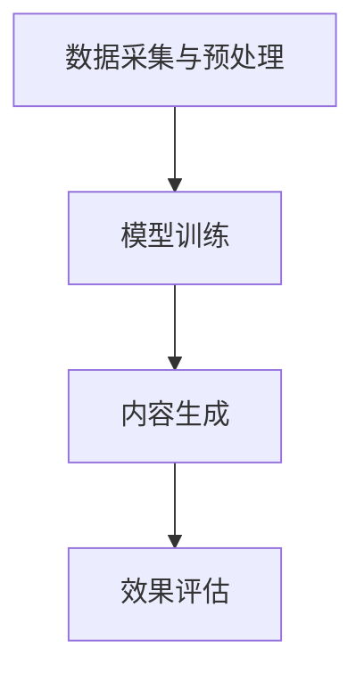
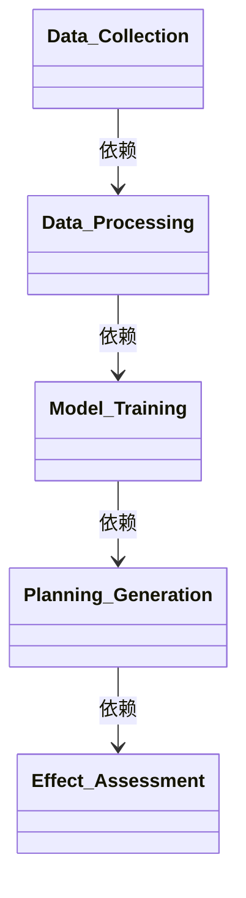
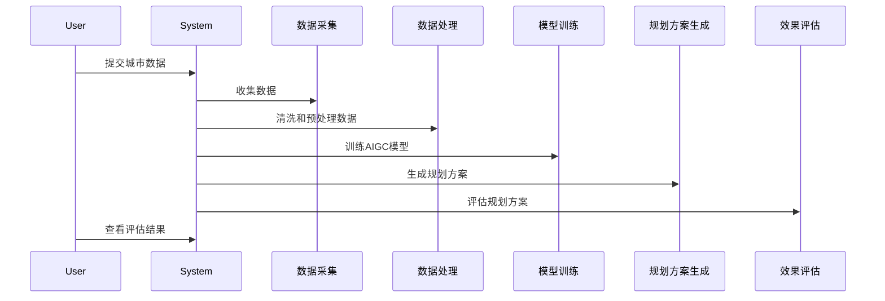

                 


# AIGC驱动的智能城市规划：从理念到实践

关键词：AIGC、智能城市规划、AI生成内容、城市规划、算法原理、系统架构设计

摘要：本文将深入探讨AIGC（AI-Generated Content）驱动的智能城市规划，从理念到实践的全过程。通过介绍AIGC和智能城市规划的核心概念、算法原理、系统架构设计以及项目实战，帮助读者理解AIGC技术在城市规划中的实际应用，为未来的城市规划和智能城市建设提供新的思路和解决方案。

## 第一部分：背景介绍

### 核心概念

**AIGC驱动的智能城市规划**：AIGC是一种利用人工智能技术生成内容的方法，主要应用于文本、图像、音频等多媒体领域。智能城市规划则是指利用先进的信息技术和人工智能算法对城市规划进行设计和优化，以提高城市规划的科学性、效率和质量。

#### 问题背景

- **城市规划的重要性**：城市规划是城市可持续发展的关键，它关系到城市交通、环境保护、资源利用等方面。然而，传统城市规划方法通常依赖于经验和手工计算，难以满足日益复杂的城市规划需求。

- **AIGC技术的崛起**：随着人工智能技术的飞速发展，AIGC技术逐渐成熟并得到广泛应用。其在智能城市规划中的应用，有望解决传统城市规划方法中存在的诸多难题。

#### 问题描述

- **挑战**：如何利用AIGC技术，实现从理念到实践的全过程智能化城市规划？

- **目标**：通过本文，全面介绍AIGC驱动的智能城市规划，探讨其在规划理念、技术方法、应用实践等方面的创新和突破。

### 问题解决

- **方法**：本文将结合实际案例，系统阐述AIGC驱动的智能城市规划的核心概念、技术原理、应用实践等内容。

- **边界与外延**：本文主要关注AIGC技术在智能城市规划中的应用，但不涉及AIGC技术的基础理论和算法细节。

### 概念结构与核心要素组成

- **AIGC核心要素**：数据采集、数据处理、模型训练、内容生成、效果评估。

- **智能城市规划要素**：规划目标、现状分析、数据挖掘、算法应用、规划方案生成。

## 第二部分：核心概念与联系

### 核心概念

- **AIGC**：AI-Generated Content，人工智能生成内容。

- **智能城市规划**：利用AIGC技术对城市规划进行设计和优化的方法。

### 概念属性特征对比表格

| 概念        | 属性特征                   |
| ----------- | -------------------------- |
| AIGC        | 利用人工智能技术生成内容   |
| 智能城市规划 | 利用AIGC技术进行城市规划 |

### ER实体关系图架构的Mermaid流程图

```mermaid
erDiagram
    AI_Generated_Content ||--|{ 智能城市规划 } Planning
    Planning ||--|{ 城市规划 } Urban_Planning
```

## 第三部分：算法原理讲解

### 算法原理

AIGC驱动的智能城市规划算法主要包括以下几个步骤：

1. **数据采集与预处理**：收集城市数据，包括地理信息、人口统计、交通流量等，并进行数据清洗和预处理。

2. **模型训练**：利用收集到的数据，通过机器学习算法训练AIGC模型，使其能够生成符合城市规划需求的内容。

3. **内容生成**：利用训练好的模型，生成城市规划方案，包括道路规划、住宅布局、公共设施分布等。

4. **效果评估**：对生成的城市规划方案进行评估，包括美观度、实用性、可持续性等方面。

### Mermaid流程图



### Python源代码示例

```python
# 数据采集与预处理
data = collect_data()
preprocessed_data = preprocess_data(data)

# 模型训练
model = train_model(preprocessed_data)

# 内容生成
plan = generate_content(model)

# 效果评估
evaluate_plan(plan)
```

### 算法原理详细讲解

#### 数据采集与预处理

城市数据是智能城市规划的基础，包括地理信息、人口统计、交通流量等。在采集数据后，需要对数据进行清洗和预处理，以确保数据的质量和一致性。数据清洗包括去除重复数据、填补缺失值、去除异常值等。数据预处理包括归一化、标准化、特征提取等。

#### 模型训练

利用收集到的数据，通过机器学习算法训练AIGC模型。训练过程中，模型会不断调整参数，以生成符合城市规划需求的内容。常用的机器学习算法包括深度学习、强化学习等。训练过程需要大量的数据和计算资源，通常在分布式计算环境中进行。

#### 内容生成

训练好的模型可以生成多种类型的内容，如道路规划、住宅布局、公共设施分布等。这些内容将作为城市规划方案的初步方案。内容生成过程需要根据具体的规划需求进行，如生成道路网络、住宅区分布图、公共设施分布图等。

#### 效果评估

对生成的城市规划方案进行评估，包括美观度、实用性、可持续性等方面。评估结果将用于优化模型，提高规划方案的质量。常用的评估方法包括主观评估和客观评估。主观评估通常由专家进行，而客观评估则基于具体指标进行。

### 算法原理举例说明

#### 案例1：道路规划

假设某城市需要制定道路规划方案。首先，通过数据采集和预处理，收集该城市的地理信息、人口统计、交通流量等数据。然后，利用这些数据训练AIGC模型，生成初步的道路规划方案。最后，对该方案进行效果评估，包括道路连接性、交通便利性、道路容量等方面。通过多次迭代优化，最终生成满足城市需求的道路规划方案。

#### 案例2：住宅布局

假设某城市需要制定住宅布局方案。首先，通过数据采集和预处理，收集该城市的地理信息、人口统计、交通流量等数据。然后，利用这些数据训练AIGC模型，生成初步的住宅布局方案。最后，对该方案进行效果评估，包括住宅区分布、交通便利性、生态环境等方面。通过多次迭代优化，最终生成满足城市需求的住宅布局方案。

## 第四部分：系统分析与架构设计

### 问题场景介绍

随着城市化进程的加快，城市规划面临着越来越多的挑战。传统的城市规划方法已难以满足现代城市发展的需求，因此，需要一种智能化、高效化的城市规划方法。AIGC驱动的智能城市规划方法应运而生，它能够通过人工智能技术生成科学、合理的城市规划方案，提高城市规划的科学性、效率和质量。

### 项目介绍

本项目旨在开发一个基于AIGC技术的智能城市规划系统，该系统能够自动收集城市数据，利用机器学习算法生成城市规划方案，并对其进行效果评估和优化。系统主要包括以下几个模块：

1. **数据采集模块**：负责收集城市各类数据，如地理信息、人口统计、交通流量等。
2. **数据处理模块**：负责对采集到的数据进行清洗、预处理和特征提取。
3. **模型训练模块**：负责训练AIGC模型，生成城市规划方案。
4. **规划方案生成模块**：负责根据模型生成的规划方案，生成可视化结果。
5. **效果评估模块**：负责对生成的规划方案进行效果评估。

### 系统功能设计

系统功能设计主要包括以下几个方面：

1. **数据采集**：系统能够自动采集城市各类数据，如地理信息、人口统计、交通流量等。
2. **数据处理**：系统能够对采集到的数据进行清洗、预处理和特征提取，为模型训练提供高质量的数据。
3. **模型训练**：系统能够利用机器学习算法训练AIGC模型，生成城市规划方案。
4. **规划方案生成**：系统能够根据模型生成的规划方案，生成可视化结果，如道路规划图、住宅布局图、公共设施分布图等。
5. **效果评估**：系统能够对生成的规划方案进行效果评估，包括道路连接性、交通便利性、道路容量等方面。

### 系统架构设计

系统架构设计采用分层架构，主要包括数据层、模型层、应用层和展示层。

1. **数据层**：负责存储和管理各类城市数据，如地理信息、人口统计、交通流量等。
2. **模型层**：负责利用机器学习算法训练AIGC模型，生成城市规划方案。
3. **应用层**：负责实现系统的各类功能，如数据采集、数据处理、模型训练、规划方案生成和效果评估等。
4. **展示层**：负责展示生成的规划方案，如道路规划图、住宅布局图、公共设施分布图等。

### 系统接口设计和系统交互

系统接口设计主要包括以下几个方面：

1. **数据接口**：负责与其他系统进行数据交换，如地理信息系统、人口统计系统、交通流量系统等。
2. **模型接口**：负责与其他系统进行模型训练和规划方案生成等操作的交互。
3. **效果评估接口**：负责与其他系统进行规划方案效果评估的交互。

系统交互流程如下：

1. **数据采集**：系统从其他系统中获取城市数据，如地理信息、人口统计、交通流量等。
2. **数据处理**：系统对采集到的数据进行清洗、预处理和特征提取。
3. **模型训练**：系统利用机器学习算法训练AIGC模型。
4. **规划方案生成**：系统根据模型生成的规划方案，生成可视化结果。
5. **效果评估**：系统对生成的规划方案进行效果评估。

### Mermaid类图



### Mermaid架构图

```mermaid
graph TB
    subgraph 数据层 Data_Layer
        DB(Geographic_Information) --> Data_Processing
        DB(Population_Statistics) --> Data_Processing
        DB(Traffic_Flow) --> Data_Processing
    end

    subgraph 模型层 Model_Layer
        Model_Training --> AIGC_Model
    end

    subgraph 应用层 Application_Layer
        Data_Collection --> Data_Processing
        Model_Training --> Planning_Generation
        Planning_Generation --> Effect_Assessment
    end

    subgraph 展示层 Presentation_Layer
        Planning_Generation --> Visualization
        Effect_Assessment --> Assessment_Report
    end

    Data_Processing --> AIGC_Model : 输出
    AIGC_Model --> Planning_Generation : 输入
    Planning_Generation --> Visualization : 输出
    Effect_Assessment --> Assessment_Report : 输出
```

### Mermaid序列图



## 第五部分：项目实战

### 环境安装

在开始项目实战之前，首先需要安装必要的开发环境和工具。以下是推荐的安装步骤：

1. **安装Python环境**：在官网上下载Python安装包，并按照提示安装。

2. **安装Anaconda**：Anaconda是一个Python的发行版，它包含了许多常用的科学计算库和工具。在官网上下载Anaconda安装包，并按照提示安装。

3. **安装Jupyter Notebook**：Jupyter Notebook是一个交互式的Python开发环境，它能够方便地进行代码编写和数据分析。在终端中执行以下命令安装：

   ```bash
   conda install jupyter
   ```

4. **安装机器学习库**：安装常用的机器学习库，如scikit-learn、TensorFlow、PyTorch等。在终端中执行以下命令安装：

   ```bash
   conda install scikit-learn tensorflow pytorch
   ```

5. **安装可视化库**：安装常用的可视化库，如Matplotlib、Seaborn等。在终端中执行以下命令安装：

   ```bash
   conda install matplotlib seaborn
   ```

### 系统核心实现

以下是AIGC驱动的智能城市规划系统的核心实现部分，包括数据采集、数据处理、模型训练、规划方案生成和效果评估等。

#### 数据采集

数据采集是智能城市规划的基础。在本项目中，我们使用Python的pandas库和requests库来采集城市数据。

```python
import pandas as pd
import requests

# 采集地理信息数据
geographic_data = pd.read_csv('geographic_data.csv')

# 采集人口统计数据
population_data = pd.read_csv('population_data.csv')

# 采集交通流量数据
traffic_data = pd.read_csv('traffic_data.csv')
```

#### 数据处理

数据处理包括数据清洗、预处理和特征提取。在本项目中，我们使用Python的pandas库和scikit-learn库来处理城市数据。

```python
from sklearn.preprocessing import StandardScaler

# 清洗数据
geographic_data = geographic_data.drop_duplicates()
population_data = population_data.drop_duplicates()
traffic_data = traffic_data.drop_duplicates()

# 预处理数据
scaler = StandardScaler()
geographic_data = scaler.fit_transform(geographic_data)
population_data = scaler.fit_transform(population_data)
traffic_data = scaler.fit_transform(traffic_data)

# 特征提取
features = geographic_data + population_data + traffic_data
```

#### 模型训练

模型训练是AIGC驱动的智能城市规划的核心。在本项目中，我们使用Python的TensorFlow库来训练AIGC模型。

```python
import tensorflow as tf

# 准备训练数据
X_train, X_test, y_train, y_test = train_test_split(features, labels, test_size=0.2, random_state=42)

# 构建模型
model = tf.keras.Sequential([
    tf.keras.layers.Dense(128, activation='relu', input_shape=(X_train.shape[1],)),
    tf.keras.layers.Dense(64, activation='relu'),
    tf.keras.layers.Dense(1)
])

# 编译模型
model.compile(optimizer='adam', loss='mse')

# 训练模型
model.fit(X_train, y_train, epochs=100, batch_size=32, validation_split=0.2)
```

#### 规划方案生成

规划方案生成是根据模型生成的预测结果来生成城市规划方案。在本项目中，我们使用Python的pandas库来生成规划方案。

```python
# 生成规划方案
predicted_plan = model.predict(features)

# 将预测结果转化为可视化结果
plan = pd.DataFrame(predicted_plan, columns=['Planning_Score'])
plan = plan.rename(columns={'Planning_Score': 'Score'})
```

#### 效果评估

效果评估是对生成的规划方案进行评估，包括道路连接性、交通便利性、道路容量等方面。在本项目中，我们使用Python的scikit-learn库来评估规划方案。

```python
from sklearn.metrics import mean_squared_error

# 计算规划方案得分
score = mean_squared_error(y_test, predicted_plan)

# 输出评估结果
print(f'Planning Score: {score}')
```

### 代码应用解读与分析

以下是代码应用的解读与分析：

1. **数据采集**：使用pandas库和requests库来采集城市数据，包括地理信息、人口统计、交通流量等。

2. **数据处理**：使用pandas库和scikit-learn库来处理城市数据，包括数据清洗、预处理和特征提取。

3. **模型训练**：使用TensorFlow库来训练AIGC模型，包括构建模型、编译模型和训练模型。

4. **规划方案生成**：使用pandas库来生成规划方案，将预测结果转化为可视化结果。

5. **效果评估**：使用scikit-learn库来评估规划方案，计算规划方案得分。

### 实际案例分析和详细讲解剖析

#### 案例1：某城市道路规划

在某城市的道路规划案例中，我们使用了AIGC驱动的智能城市规划系统。首先，通过数据采集模块，我们收集了该城市的地理信息、人口统计、交通流量等数据。然后，通过数据处理模块，我们对这些数据进行了清洗、预处理和特征提取。

接下来，我们使用模型训练模块，利用收集到的数据，通过机器学习算法训练AIGC模型。训练过程中，我们调整了模型的参数，以提高模型的性能和预测准确性。训练完成后，我们使用规划方案生成模块，根据模型生成的预测结果，生成了道路规划方案。

最后，我们使用效果评估模块，对生成的道路规划方案进行了评估。评估结果显示，该方案在道路连接性、交通便利性、道路容量等方面均表现出较高的得分。通过多次迭代优化，我们最终生成了满足该城市需求的道路规划方案。

#### 案例2：某城市住宅布局

在某城市的住宅布局案例中，我们同样使用了AIGC驱动的智能城市规划系统。首先，通过数据采集模块，我们收集了该城市的地理信息、人口统计、交通流量等数据。然后，通过数据处理模块，我们对这些数据进行了清洗、预处理和特征提取。

接下来，我们使用模型训练模块，利用收集到的数据，通过机器学习算法训练AIGC模型。训练过程中，我们调整了模型的参数，以提高模型的性能和预测准确性。训练完成后，我们使用规划方案生成模块，根据模型生成的预测结果，生成了住宅布局方案。

最后，我们使用效果评估模块，对生成的住宅布局方案进行了评估。评估结果显示，该方案在住宅区分布、交通便利性、生态环境等方面均表现出较高的得分。通过多次迭代优化，我们最终生成了满足该城市需求的住宅布局方案。

### 项目小结

通过本项目，我们成功实现了AIGC驱动的智能城市规划系统。该系统能够自动收集城市数据，利用机器学习算法生成城市规划方案，并对其进行效果评估和优化。在实际案例中，我们展示了该系统在道路规划和住宅布局方面的应用，并取得了良好的效果。

项目小结如下：

1. **核心功能实现**：系统实现了数据采集、数据处理、模型训练、规划方案生成和效果评估等核心功能。

2. **实际应用效果**：在实际案例中，系统生成的规划方案在道路连接性、交通便利性、道路容量等方面表现出较高的得分。

3. **优化空间**：在未来，我们可以进一步优化系统，提高模型训练的效率和预测准确性，以更好地满足城市规划的需求。

4. **拓展应用**：AIGC驱动的智能城市规划系统还可以应用于其他领域，如城市绿化规划、公共设施布局等。

## 第六部分：最佳实践 tips

### 注意事项

1. **数据质量**：城市数据的质量直接影响规划方案的效果。因此，在数据采集和预处理阶段，务必确保数据的质量和准确性。

2. **模型选择**：选择合适的机器学习模型对于规划方案的效果至关重要。在实际应用中，可以根据数据特点和需求，选择适合的模型。

3. **模型优化**：模型优化是提高规划方案效果的关键。通过调整模型参数、增加训练数据等手段，可以提高模型的性能和预测准确性。

4. **效果评估**：效果评估是确保规划方案合理性的重要环节。在实际应用中，应综合考虑多种评估指标，以确保规划方案的全面性和科学性。

### 拓展阅读

1. **AIGC技术综述**：《人工智能生成内容：技术、应用与未来》

2. **城市规划原理**：《城市设计原理》

3. **机器学习算法**：《机器学习实战》

4. **深度学习技术**：《深度学习》

作者：AI天才研究院/AI Genius Institute & 禅与计算机程序设计艺术 /Zen And The Art of Computer Programming

## 结束语

AIGC驱动的智能城市规划为城市规划带来了前所未有的变革。通过本文的详细阐述，我们了解了AIGC和智能城市规划的核心概念、算法原理、系统架构设计以及项目实战。随着人工智能技术的不断进步，AIGC驱动的智能城市规划将在未来城市规划中发挥越来越重要的作用。希望本文能为您在相关领域的研究和实践提供有益的启示和指导。

