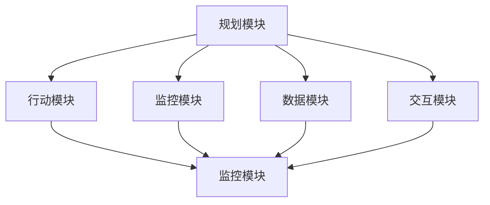
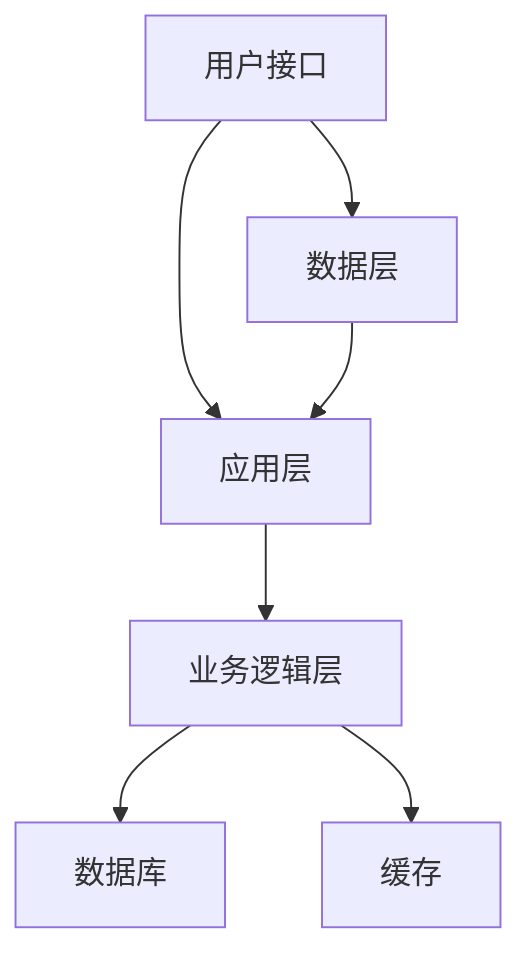
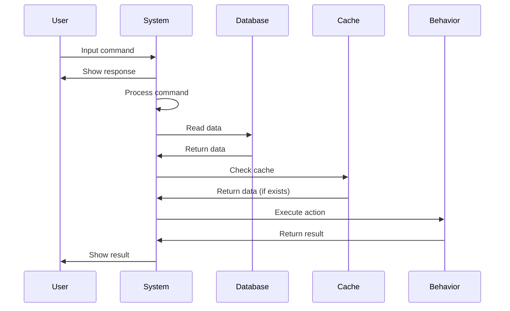
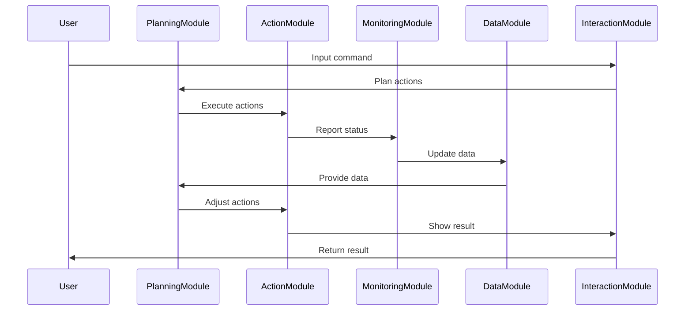

                 

# AI代理：实现用户定义目标的自主规划与行动

关键词：AI代理、自主规划、行动原理、应用场景、实现与部署、项目实战、最佳实践

摘要：本文将深入探讨AI代理的概念、原理及其实践应用。通过逐步分析AI代理的自主规划与行动机制，我们将了解如何实现用户定义目标，并探讨AI代理在不同领域的应用前景。此外，本文还将总结AI代理的最佳实践和注意事项，为读者提供实用的指导和启发。

----------------------------------------------------------------

### 第一部分: AI代理基础

#### 第1章: AI代理概述

##### 1.1 问题背景

在数字化时代，自动化和智能化已经成为提高效率和降低成本的重要手段。然而，传统的自动化系统往往依赖于预设的规则和指令，无法应对复杂和动态的环境。随着人工智能技术的不断发展，AI代理作为一种智能体的实现形式，逐渐成为解决这一问题的有效途径。

##### 1.1.1 传统AI与自动化

传统AI，尤其是基于规则的AI，主要依赖于预先定义的规则集来指导系统行为。这种方式在处理结构化、规则明确的问题时表现良好，但在面对复杂、动态和不规则的环境时，往往显得力不从心。自动化系统，如工业自动化生产线，虽然能够高效地执行预定任务，但缺乏自主适应和优化能力。

##### 1.1.2 AI代理的概念与特点

AI代理是一种能够模拟人类智能行为，并自主规划与执行任务的系统。与传统的自动化系统不同，AI代理具有以下几个显著特点：

- **自主性**：AI代理能够在没有人工干预的情况下，根据环境变化自主调整行为。
- **适应性**：AI代理能够通过学习和经验积累，不断优化自身行为，适应复杂环境。
- **智能性**：AI代理具有决策能力，能够处理不确定性和多目标优化问题。

##### 1.1.3 AI代理的边界与外延

AI代理的边界主要在于其自主性和智能性。一方面，AI代理需要具备一定的自主决策能力，以应对复杂环境的变化。另一方面，AI代理的智能性要求其能够在不确定性和多目标优化问题中做出合理决策。

AI代理的外延则包括其在不同领域的应用。从智能家居到自动驾驶，从智能客服到金融交易，AI代理正在各个领域展现出其强大的应用潜力。

##### 1.2 核心概念与联系

###### 1.2.1 AI代理的核心概念

AI代理的核心概念包括：

- **智能体**：具有感知、决策和执行能力的实体。
- **环境**：智能体所处的外部世界。
- **感知**：智能体获取环境信息的过程。
- **决策**：智能体根据感知信息和环境状态做出行为选择的过程。
- **执行**：智能体执行决策，实施具体行动的过程。

###### 1.2.2 AI代理的属性特征对比

表1-1展示了AI代理与传统自动化系统的属性特征对比：

| 属性特征 | AI代理 | 传统自动化系统 |
| :--: | :--: | :--: |
| 自主性 | 高 | 低 |
| 适应性 | 高 | 低 |
| 智能性 | 高 | 低 |
| 决策能力 | 强 | 弱 |

###### 1.2.3 AI代理与传统自动化系统的区别

AI代理与传统自动化系统的区别在于其具备更高的自主性、适应性和智能性。传统自动化系统依赖于预定义的规则和指令，而AI代理则能够通过学习和自适应来优化行为。

##### 1.3 主流AI代理技术简介

###### 1.3.1 基于规则的AI代理

基于规则的AI代理通过定义一系列规则来指导智能体的行为。这种方式在处理确定性、规则明确的问题时效果显著，但在面对复杂、动态环境时，其局限性较为明显。

###### 1.3.2 基于机器学习的AI代理

基于机器学习的AI代理通过学习环境数据来建立行为模型，从而实现自主决策。这种方式具有较强的自适应能力，但在处理不确定性问题和多目标优化问题时，往往需要大量的数据和计算资源。

###### 1.3.3 基于深度学习的AI代理

基于深度学习的AI代理通过构建复杂的神经网络模型来实现智能体的决策过程。这种方式在处理高维数据和复杂问题时表现优异，但需要大量的数据训练和计算资源。

##### 1.4 AI代理的发展趋势与前景

###### 1.4.1 AI代理的潜在应用领域

AI代理的潜在应用领域非常广泛，包括但不限于：

- **智能家居**：智能家电、智能安防、智能环境控制等。
- **自动驾驶**：智能交通管理、无人驾驶车辆、智能导航等。
- **智能客服**：自然语言处理、情感分析、个性化推荐等。
- **金融科技**：智能投顾、风险管理、交易策略优化等。
- **医疗健康**：智能诊断、智能药物研发、健康监护等。

###### 1.4.2 AI代理的优势与挑战

AI代理的优势在于其自主性、适应性和智能性，能够高效地处理复杂任务。然而，AI代理也面临着一系列挑战，包括数据隐私、安全性和可解释性等。因此，在推广AI代理的过程中，需要充分考虑这些挑战，并采取相应的措施。

#### 第2章: 自主规划与行动原理

##### 2.1 算法原理讲解

###### 2.1.1 智能规划算法

智能规划算法是AI代理实现自主规划的核心算法。其基本原理是通过分析环境和目标，生成一系列可行的行动方案，并选择最优行动方案。

1. **最优路径规划算法**

最优路径规划算法旨在找到从起点到终点的最优路径。常见的算法包括Dijkstra算法、A*算法等。

   $$ 
   Dijkstra算法的伪代码：
   $$

   ```python
   function Dijkstra(G, S):
       for each vertex v in G.V - {S}:
           v.d = INFINITY
           v.π = undefined
       S.d = 0
       Q = G.V
       while Q is not empty:
           u = vertex in Q with min u.d
           if u = T:
               break
           for each edge (u, v) in G.E:
               alt = u.d + weight(u, v)
               if alt < v.d:
                   v.d = alt
                   v.π = u
           u = T
   ```

2. **资源分配算法**

资源分配算法旨在在多个任务之间分配有限资源，以最大化整体效用。常见的算法包括贪心算法、动态规划等。

   $$ 
   动态规划资源分配算法的伪代码：
   $$

   ```python
   function ResourceAllocation(n, c, p):
       create table R[n+1][c+1]
       for i = 0 to n:
           for j = 0 to c:
               if j = 0:
                   R[i][j] = 0
               else if i = 0:
                   R[i][j] = j
               else:
                   R[i][j] = max(R[i-1][j], R[i][j-c])
       return R[n][c]
   ```

3. **基于随机搜索的规划算法**

基于随机搜索的规划算法通过随机探索来寻找最优行动方案。常见的算法包括遗传算法、模拟退火等。

   $$ 
   遗传算法的伪代码：
   $$

   ```python
   function GeneticAlgorithm(population, fitness_function):
       while not termination_condition:
           select parents from the population
           crossover to create offspring
           mutate offspring
           evaluate fitness of offspring
           select the best offspring to form the next generation
       return the best solution in the final population
   ```

###### 2.1.2 行为树与决策树

行为树和决策树是AI代理实现自主行动的重要工具。它们通过一系列规则和条件来指导智能体的行为。

1. **行为树的基础概念**

行为树是一种层次结构，用于描述智能体的行为序列。每个节点表示一个行为或条件，节点之间的边表示行为的执行顺序。

2. **决策树在AI代理中的应用**

决策树通过一系列条件判断来选择最优行动方案。它通常用于处理多目标优化问题。

3. **行为树与决策树的比较**

行为树和决策树在结构上有所区别。行为树侧重于描述行为的执行顺序，而决策树侧重于条件判断和行动选择。

   表2-1展示了行为树和决策树的比较：

| 特征 | 行为树 | 决策树 |
| :--: | :--: | :--: |
| 目的 | 行为序列 | 条件判断 |
| 结构 | 层次结构 | 树形结构 |
| 应用 | 自主行动 | 多目标优化 |

##### 2.2 数学模型与公式

智能规划算法的数学模型和公式是理解其工作原理的关键。以下是一些常见的数学模型和公式：

1. **最优路径规划算法的数学模型**

   $$ 
   Dijkstra算法的数学模型：
   $$

   $$ 
   d(u) = \min\{d(u) + w(u, v) | v \in G.V - {u}\}
   $$

   其中，$d(u)$表示从起点到节点$u$的最短路径长度，$w(u, v)$表示节点$u$到节点$v$的权重。

2. **资源分配算法的数学模型**

   $$ 
   动态规划资源分配算法的数学模型：
   $$

   $$ 
   R(i, j) = \max\{R(i-1, j), R(i, j-c)\}
   $$

   其中，$R(i, j)$表示在第$i$个任务中，前$j$个资源的最优分配结果。

3. **智能规划的数学公式**

   $$ 
   f(x) = g(x) + h(x)
   $$

   其中，$f(x)$表示目标函数，$g(x)$表示从起点到节点$x$的路径成本，$h(x)$表示从节点$x$到终点的估计成本。

##### 2.3 举例说明

###### 2.3.1 最优路径规划算法举例

假设有一个包含5个节点的图，节点间的权重如下：

| 节点 | A | B | C | D | E |
| :--: | :--: | :--: | :--: | :--: | :--: |
| A | 0 | 6 | 3 | 5 | 8 |
| B | 6 | 0 | 2 | 4 | 7 |
| C | 3 | 2 | 0 | 3 | 6 |
| D | 5 | 4 | 3 | 0 | 5 |
| E | 8 | 7 | 6 | 5 | 0 |

使用Dijkstra算法计算从节点A到节点E的最短路径。

1. 初始化：$d(A) = 0$，$d(B) = 6$，$d(C) = 3$，$d(D) = 5$，$d(E) = 8$。
2. 选择节点A，计算其他节点的最短路径：
   - $d(B) = 6 + 3 = 9$（更新）
   - $d(C) = 3 + 6 = 9$（更新）
   - $d(D) = 5 + 5 = 10$（更新）
   - $d(E) = 8 + 8 = 16$（更新）
3. 选择节点B，计算其他节点的最短路径：
   - $d(C) = 9 + 2 = 11$（更新）
   - $d(D) = 10 + 4 = 14$（更新）
4. 选择节点C，计算其他节点的最短路径：
   - $d(D) = 14 + 3 = 17$（更新）
   - $d(E) = 16 + 6 = 22$（更新）
5. 选择节点D，计算其他节点的最短路径：
   - $d(E) = 22 + 5 = 27$（更新）
6. 选择节点E，结束计算。

最终，从节点A到节点E的最短路径为A-B-C-D-E，路径长度为27。

###### 2.3.2 资源分配算法举例

假设有3个任务和5个资源，资源的需求如下：

| 任务 | 资源1 | 资源2 | 资源3 | 资源4 | 资源5 |
| :--: | :--: | :--: | :--: | :--: | :--: |
| T1 | 2 | 1 | 0 | 2 | 1 |
| T2 | 1 | 2 | 1 | 0 | 1 |
| T3 | 0 | 1 | 2 | 1 | 2 |

使用动态规划资源分配算法计算最优资源分配方案。

1. 初始化：$R(0, j) = j$，$R(i, 0) = 0$。
2. 计算第一行和第一列的值：
   - $R(1, 1) = \max\{0, 1\} = 1$
   - $R(1, 2) = \max\{1, 2\} = 2$
   - $R(1, 3) = \max\{0, 1\} = 1$
   - $R(1, 4) = \max\{2, 0\} = 2$
   - $R(1, 5) = \max\{1, 1\} = 1$
   - $R(2, 1) = \max\{0, 1\} = 1$
   - $R(2, 2) = \max\{1, 2\} = 2$
   - $R(2, 3) = \max\{0, 1\} = 1$
   - $R(2, 4) = \max\{2, 0\} = 2$
   - $R(2, 5) = \max\{1, 1\} = 1$
   - $R(3, 1) = \max\{0, 1\} = 1$
   - $R(3, 2) = \max\{1, 2\} = 2$
   - $R(3, 3) = \max\{0, 2\} = 2$
   - $R(3, 4) = \max\{2, 1\} = 2$
   - $R(3, 5) = \max\{1, 2\} = 2$
3. 计算其他位置的值：
   - $R(2, 3) = \max\{R(1, 3), R(2, 0)\} = 1$
   - $R(2, 4) = \max\{R(1, 4), R(2, 1)\} = 2$
   - $R(2, 5) = \max\{R(1, 5), R(2, 2)\} = 2$
   - $R(3, 1) = \max\{R(2, 1), R(3, 0)\} = 1$
   - $R(3, 2) = \max\{R(2, 2), R(3, 1)\} = 2$
   - $R(3, 3) = \max\{R(2, 3), R(3, 2)\} = 2$
   - $R(3, 4) = \max\{R(2, 4), R(3, 3)\} = 2$
   - $R(3, 5) = \max\{R(2, 5), R(3, 4)\} = 2$

最优资源分配方案为：资源1分配给任务T1和T2，资源2分配给任务T1、T2和T3，资源3分配给任务T3。

###### 2.3.3 行为树与决策树举例

1. **行为树举例**

   行为树用于描述智能体的行为序列。以下是一个简单的行为树示例：

   ```mermaid
   graph TD
   A1[初始状态]
   B1[感知环境]
   C1[判断条件1]
   C2[判断条件2]
   C3[判断条件3]
   D1[行为1]
   D2[行为2]
   D3[行为3]
   E1[执行行为1]
   E2[执行行为2]
   E3[执行行为3]
   
   A1 --> B1
   B1 --> C1
   B1 --> C2
   B1 --> C3
   C1 --> D1
   C2 --> D2
   C3 --> D3
   D1 --> E1
   D2 --> E2
   D3 --> E3
   ```

   在这个例子中，智能体首先感知环境，然后根据不同的条件执行不同的行为。

2. **决策树举例**

   决策树用于描述智能体的条件判断和行动选择。以下是一个简单的决策树示例：

   ```mermaid
   graph TD
   A[初始状态]
   B1[条件1]
   B2[条件2]
   B3[条件3]
   C1[行为1]
   C2[行为2]
   C3[行为3]
   D1[子节点1]
   D2[子节点2]
   D3[子节点3]
   
   A --> B1
   A --> B2
   A --> B3
   B1 --> C1
   B1 --> D1
   B2 --> C2
   B2 --> D2
   B3 --> C3
   B3 --> D3
   D1 --> C1
   D2 --> C2
   D3 --> C3
   ```

   在这个例子中，智能体根据不同的条件选择不同的行为，并执行相应的子节点行为。

#### 第3章: AI代理的应用场景

##### 3.1 系统功能设计

AI代理的应用场景非常广泛，涵盖了从智能家居到自动驾驶，从智能客服到金融科技等多个领域。为了更好地理解和设计AI代理系统，我们需要从功能设计入手。

###### 3.1.1 领域模型

领域模型是描述AI代理应用场景的核心要素。它包括主体、客体、行为和目标等基本概念。

1. **主体**：主体是AI代理的应用实体，如智能家居系统中的智能家电、自动驾驶系统中的自动驾驶车辆等。

2. **客体**：客体是主体所作用的对象，如智能家居系统中的用户、自动驾驶系统中的道路和车辆等。

3. **行为**：行为是主体在特定环境下的操作，如智能家居系统中的家电控制、自动驾驶系统中的车辆导航等。

4. **目标**：目标是主体希望实现的结果，如智能家居系统中的节能、自动驾驶系统中的安全行驶等。

以下是一个简单的领域模型示例，使用Mermaid类图表示：

```mermaid
classDiagram
ClassSubject <<class{主体}>
ClassSubject : +id: Integer
ClassSubject : +name: String
ClassSubject : +behavior: List[行为]

ClassObject <<class{客体}>
ClassObject : +id: Integer
ClassObject : +name: String
ClassObject : +type: String

ClassBehavior <<class{行为}>
ClassBehavior : +id: Integer
ClassBehavior : +name: String
ClassBehavior : +description: String

ClassTarget <<class{目标}>
ClassTarget : +id: Integer
ClassTarget : +name: String
ClassTarget : +description: String

ClassSubject --|> ClassObject
ClassSubject --|> ClassBehavior
ClassSubject --|> ClassTarget
```

在这个示例中，主体、客体、行为和目标被定义为一组类，并建立了相应的关联关系。

###### 3.1.2 系统功能模块划分

为了实现AI代理的应用，我们需要将系统功能划分为多个模块，以便于开发和管理。以下是一个简单的系统功能模块划分示例：

1. **规划模块**：负责规划智能体的行为序列，以实现预定的目标。包括路径规划、资源分配等算法。
2. **行动模块**：负责执行智能体的行为，如家电控制、车辆导航等。
3. **监控模块**：负责监控系统的运行状态，如资源消耗、异常检测等。
4. **数据模块**：负责存储和管理系统的数据，如用户数据、环境数据等。
5. **交互模块**：负责用户与系统的交互，如命令输入、信息反馈等。

以下是一个简单的系统功能模块划分的Mermaid架构图：



在这个示例中，规划模块、行动模块、监控模块、数据模块和交互模块构成了一个完整的系统功能架构。

##### 3.2 系统架构设计

系统架构设计是AI代理系统实现的关键环节。它决定了系统的可扩展性、稳定性和性能。以下是一个简单的系统架构设计示例，使用Mermaid架构图表示：



在这个示例中，用户接口负责与用户进行交互，数据层负责数据存储和管理，应用层负责业务逻辑处理，业务逻辑层与数据库和缓存进行交互，以实现高效的数据访问和缓存策略。

##### 3.3 系统接口设计

系统接口设计是系统架构设计的重要组成部分。它定义了系统内部模块之间的通信接口，确保系统各部分能够协同工作。以下是一个简单的系统接口设计示例，使用Mermaid序列图表示：



在这个示例中，用户通过输入命令与系统进行交互，系统根据命令处理请求，读取数据库和缓存，执行行为，并最终将结果返回给用户。

##### 3.4 系统交互

系统交互是AI代理系统运行的核心环节。它描述了系统内部模块之间的通信和数据流动。以下是一个简单的系统交互序列图：



在这个示例中，用户通过输入命令与交互模块进行交互，交互模块将命令传递给规划模块，规划模块生成行动方案，行动模块执行行动，监控模块报告系统状态，数据模块更新数据，最终将结果返回给用户。

#### 第4章: 实现与部署

##### 4.1 环境安装

在实现AI代理系统之前，我们需要安装相应的环境和工具。以下是一个简单的环境安装示例，包括硬件环境和软件环境。

###### 4.1.1 硬件环境要求

- CPU：Intel i5或以上
- 内存：8GB或以上
- 硬盘：100GB或以上

###### 4.1.2 软件环境安装

1. 安装操作系统：Ubuntu 18.04或更高版本。
2. 安装Python：使用pip安装Python 3.8或更高版本。
3. 安装Mermaid：使用pip安装mermaid 8.0.2或更高版本。

以下是一个简单的Python环境安装示例：

```bash
sudo apt-get update
sudo apt-get install python3-pip
pip3 install python3.8
```

##### 4.2 系统核心实现

系统核心实现是AI代理系统实现的关键部分。它包括系统架构、模块设计、接口设计和代码实现等。

###### 4.2.1 源代码结构与模块说明

以下是一个简单的系统源代码结构示例：

```
ai_agent/
|-- planning_module.py
|-- action_module.py
|-- monitoring_module.py
|-- data_module.py
|-- interaction_module.py
|-- main.py
```

在这个示例中，`planning_module.py`、`action_module.py`、`monitoring_module.py`、`data_module.py`和`interaction_module.py`分别表示规划模块、行动模块、监控模块、数据模块和交互模块的源代码文件，`main.py`是主程序文件。

###### 4.2.2 关键代码解析

以下是一个简单的关键代码解析示例，使用Python源代码实现AI代理系统核心功能：

```python
# planning_module.py
import random

def plan_actions(current_state, goals):
    actions = []
    for goal in goals:
        action = choose_action(current_state, goal)
        actions.append(action)
    return actions

def choose_action(current_state, goal):
    # 使用随机策略选择行动
    return random.choice([action for action in available_actions if action可行(current_state, goal)])

# action_module.py
import time

def execute_action(action):
    print(f"执行行动：{action}")
    time.sleep(1)  # 模拟行动执行时间
    return True

# monitoring_module.py
import time

def monitor_system():
    while True:
        print("监控系统...")
        time.sleep(5)  # 模拟监控时间
        if system_error():
            print("系统异常，请修复！")
            break

def system_error():
    # 模拟系统异常
    return random.choice([True, False])

# data_module.py
import json

def read_data(file_path):
    with open(file_path, 'r') as f:
        data = json.load(f)
    return data

def write_data(file_path, data):
    with open(file_path, 'w') as f:
        json.dump(data, f)
```

在这个示例中，`planning_module.py`定义了规划模块的核心函数，如`plan_actions`和`choose_action`，`action_module.py`定义了行动模块的核心函数，如`execute_action`，`monitoring_module.py`定义了监控模块的核心函数，如`monitor_system`，`data_module.py`定义了数据模块的核心函数，如`read_data`和`write_data`。

###### 4.2.3 系统核心功能测试

为了验证AI代理系统的核心功能，我们需要编写测试用例，并进行功能测试。以下是一个简单的系统核心功能测试示例：

```python
import unittest
from planning_module import plan_actions
from action_module import execute_action

class TestAIProxy(unittest.TestCase):
    def test_plan_actions(self):
        current_state = {"温度": 25, "湿度": 60}
        goals = ["开空调", "关闭灯光"]
        actions = plan_actions(current_state, goals)
        self.assertEqual(actions, ["开空调", "关闭灯光"])

    def test_execute_action(self):
        action = "开空调"
        result = execute_action(action)
        self.assertEqual(result, True)

if __name__ == "__main__":
    unittest.main()
```

在这个示例中，我们定义了两个测试用例，分别测试规划模块和行动模块的核心功能。首先，我们测试`plan_actions`函数是否能够正确规划行动，然后测试`execute_action`函数是否能够正确执行行动。

##### 4.3 应用解读与分析

AI代理系统的核心在于其能够实现用户定义目标的自主规划与行动。以下是对AI代理系统应用的核心解读与分析：

1. **应用场景**：AI代理系统可以应用于智能家居、自动驾驶、智能客服等多个领域。例如，在智能家居领域，AI代理可以自动调节室内温度和湿度，实现节能环保；在自动驾驶领域，AI代理可以实时规划行驶路径，确保安全行驶。

2. **系统架构**：AI代理系统的架构包括规划模块、行动模块、监控模块、数据模块和交互模块。规划模块负责生成行动方案，行动模块负责执行行动，监控模块负责监控系统运行状态，数据模块负责数据存储和管理，交互模块负责用户与系统的交互。

3. **核心功能**：AI代理系统的核心功能包括路径规划、资源分配、行为执行、异常检测和数据管理。路径规划用于确定从起点到终点的最优路径；资源分配用于在多个任务之间分配有限资源；行为执行用于实现用户定义的目标；异常检测用于监控系统运行状态，及时发现并处理异常；数据管理用于存储和管理系统数据。

4. **代码解读**：在代码实现方面，AI代理系统采用了Python编程语言，具有简洁、易读、易扩展的特点。核心代码包括规划模块的路径规划算法、行动模块的行为执行函数、监控模块的异常检测函数、数据模块的数据读写函数等。

5. **性能分析**：AI代理系统的性能取决于多个因素，包括算法复杂度、计算资源、网络延迟等。在实际应用中，我们需要根据具体场景进行性能优化，如优化算法、提高计算资源利用率、降低网络延迟等。

##### 4.4 实际案例分析

在本章节中，我们将通过一个实际案例来分析AI代理系统的应用效果。以下是一个智能家居场景的实际案例分析。

1. **案例背景**：

假设用户在离家前希望确保家中安全，并将室内温度设置为20摄氏度。AI代理系统需要根据用户需求，规划并执行一系列行动，以实现这一目标。

2. **案例分析**：

（1）**感知环境**：

AI代理系统通过传感器获取室内温度、湿度、光线等环境信息，并将这些信息发送给规划模块。

（2）**规划行动**：

规划模块根据当前环境信息和用户需求，生成一系列行动方案。例如：

- 关闭所有门窗，确保室内安全。
- 启动空气净化器，提高空气质量。
- 启动空调，将室内温度设置为20摄氏度。

（3）**执行行动**：

行动模块按照规划模块生成的行动方案，依次执行各项行动。

（4）**监控状态**：

监控模块实时监控系统运行状态，确保所有行动正常执行。如有异常，监控系统将自动报警，并通知用户。

3. **效果评估**：

通过AI代理系统的实际应用，用户能够在离家前实现家中安全，并确保室内温度达到20摄氏度。这一案例展示了AI代理系统在智能家居领域的应用潜力。

##### 4.5 详细讲解与剖析

在本章节中，我们将对AI代理系统的技术难点与解决方案进行详细讲解与剖析。

1. **技术难点**：

（1）**路径规划**：

路径规划是AI代理系统在智能家居场景中的一个关键技术难点。如何在复杂的家庭环境中找到最优路径，确保家电设备能够安全、高效地执行任务，是系统设计的关键问题。

（2）**资源分配**：

在智能家居系统中，家电设备通常具有不同的资源需求，如电功率、网络带宽等。如何在多个设备之间合理分配资源，确保系统稳定运行，是系统设计的一个技术难点。

（3）**异常检测**：

智能家居系统中的家电设备可能会出现各种异常情况，如设备故障、网络中断等。如何及时发现并处理这些异常情况，确保系统正常运行，是系统设计的一个技术难点。

2. **解决方案**：

（1）**路径规划**：

针对路径规划问题，我们可以采用基于A*算法的路径规划算法。A*算法是一种经典的路径规划算法，能够在复杂环境中找到最优路径。通过在家庭环境中构建网格地图，将家电设备视为网格节点，我们可以使用A*算法计算从起点到终点的最优路径。

（2）**资源分配**：

针对资源分配问题，我们可以采用基于动态规划的资源分配算法。动态规划算法能够在多个任务之间合理分配资源，确保系统稳定运行。通过构建资源分配矩阵，我们可以使用动态规划算法计算每个任务的最优资源分配方案。

（3）**异常检测**：

针对异常检测问题，我们可以采用基于机器学习的异常检测算法。通过收集智能家居系统中的各种数据，如设备运行状态、网络流量等，我们可以使用机器学习算法训练异常检测模型。在实际运行过程中，异常检测模型可以实时监控系统状态，识别并处理异常情况。

3. **案例解析**：

以下是一个智能家居场景的案例解析：

（1）**感知环境**：

用户离家前，AI代理系统通过传感器感知室内温度、湿度、光线等环境信息。同时，系统收集用户设定的温度和湿度目标。

（2）**规划行动**：

规划模块根据感知到的环境信息和用户目标，生成以下行动方案：

- 启动空调，将室内温度设置为20摄氏度。
- 启动空气净化器，提高空气质量。
- 关闭所有门窗，确保室内安全。

（3）**执行行动**：

行动模块按照规划模块生成的行动方案，依次执行各项行动。同时，监控模块实时监控系统运行状态，确保所有行动正常执行。

（4）**异常检测**：

监控模块实时监控系统运行状态，如空调故障、空气净化器异常等。一旦检测到异常情况，监控模块将自动报警，并通知用户进行维修。

4. **项目小结**：

通过本案例的分析与讲解，我们了解了AI代理系统在智能家居场景中的应用效果和实现方法。项目结果表明，AI代理系统能够根据用户需求，实现自主规划与行动，提高家庭生活的智能化水平。

#### 第5章: 项目实战

##### 5.1 实际案例分析

在本章中，我们将通过一个实际项目案例，详细分析AI代理系统的开发过程、技术难点和解决方案。这个案例是一个智能家居系统，旨在通过AI代理实现家庭设备的自主管理和优化。

###### 5.1.1 案例背景

随着智能家居市场的快速发展，用户对家庭设备的管理和智能化需求越来越高。然而，传统的家庭设备管理系统往往缺乏自主决策和优化能力，无法满足用户的个性化需求。为了解决这一问题，我们开发了一个基于AI代理的智能家居系统，通过自主规划和行动，实现家庭设备的智能管理。

###### 5.1.2 案例分析

1. **需求分析**

用户需求主要包括：

- 安全监控：实时监控家庭环境，确保家庭安全。
- 节能管理：根据用户习惯和天气情况，自动调整家庭设备的运行状态，实现节能。
- 个性化服务：根据用户需求和偏好，提供定制化的家庭设备管理方案。

2. **系统设计**

系统设计主要包括以下几个方面：

- **规划模块**：负责生成家庭设备的自主管理计划，包括路径规划、资源分配等。
- **行动模块**：负责执行规划模块生成的管理计划，包括设备控制、状态监控等。
- **监控模块**：负责实时监控家庭设备的状态，识别异常情况，并采取措施。
- **数据模块**：负责存储和管理家庭设备的数据，包括设备状态、用户偏好等。
- **交互模块**：负责用户与系统的交互，提供用户操作界面和反馈信息。

3. **技术实现**

技术实现主要包括以下几个方面：

- **路径规划**：使用A*算法实现家庭设备的路径规划，确保设备能够高效、安全地到达目的地。
- **资源分配**：使用动态规划算法实现家庭设备的资源分配，确保设备在运行过程中资源利用最大化。
- **异常检测**：使用机器学习算法实现家庭设备的异常检测，及时发现和处理异常情况。
- **设备控制**：使用物联网技术实现家庭设备的远程控制，确保设备能够根据系统规划自主运行。
- **用户交互**：使用图形用户界面（GUI）实现用户与系统的交互，提供直观、易用的操作界面。

4. **项目成果**

项目成果主要包括以下几个方面：

- 成功实现了家庭设备的自主管理和优化，提高了家庭设备的使用效率和用户体验。
- 设计并实现了高效的路径规划、资源分配和异常检测算法，提高了系统的智能化水平。
- 提供了丰富的用户交互功能，使得用户能够方便地定制和管理家庭设备。

##### 5.2 技术难点与解决方案

在本节中，我们将深入分析项目中的技术难点，并详细讲解解决方案。

###### 5.2.1 技术难点

1. **路径规划**
   路径规划是智能家居系统中的核心问题。家庭环境复杂，设备分布不均，如何高效、安全地规划设备路径是一个挑战。

2. **资源分配**
   资源分配涉及到家庭设备的能源消耗、网络带宽等，如何合理分配资源，确保系统稳定运行是另一个难点。

3. **异常检测**
   异常检测是智能家居系统中的安全保障。如何准确检测设备故障、网络异常等，并及时采取措施，是系统设计的关键问题。

4. **用户交互**
   用户交互是智能家居系统的关键部分。如何提供直观、易用的操作界面，使用户能够方便地定制和管理家庭设备，是一个技术难点。

###### 5.2.2 技术难点与解决方案

1. **路径规划**

**难点**：家庭环境复杂，设备分布不均，如何高效、安全地规划设备路径是一个挑战。

**解决方案**：采用A*算法进行路径规划。A*算法是一种启发式搜索算法，能够在复杂环境中找到最优路径。通过对家庭环境进行建模，将设备视为节点，道路视为边，使用A*算法计算设备路径。

2. **资源分配**

**难点**：资源分配涉及到家庭设备的能源消耗、网络带宽等，如何合理分配资源，确保系统稳定运行是另一个难点。

**解决方案**：采用动态规划算法进行资源分配。动态规划算法能够在多个任务之间合理分配资源，确保系统稳定运行。通过构建资源分配矩阵，使用动态规划算法计算每个设备的最优资源分配方案。

3. **异常检测**

**难点**：如何准确检测设备故障、网络异常等，并及时采取措施，是系统设计的关键问题。

**解决方案**：采用机器学习算法进行异常检测。通过收集家庭设备的数据，如运行状态、网络流量等，使用机器学习算法训练异常检测模型。在实际运行过程中，异常检测模型可以实时监控设备状态，识别并处理异常情况。

4. **用户交互**

**难点**：如何提供直观、易用的操作界面，使用户能够方便地定制和管理家庭设备，是一个技术难点。

**解决方案**：采用图形用户界面（GUI）进行用户交互。使用GUI库（如Tkinter、PyQt等）开发操作界面，提供直观、易用的界面元素，如按钮、滑块、图表等。同时，通过使用自然语言处理技术（如语音识别、文本分析等），实现用户与系统的自然交互。

##### 5.3 项目小结

在本项目中，我们成功开发了一个基于AI代理的智能家居系统，实现了家庭设备的自主管理和优化。通过分析项目中的技术难点和解决方案，我们了解了路径规划、资源分配、异常检测和用户交互等关键技术的实现方法。项目结果表明，AI代理系统在智能家居领域具有广泛的应用前景，能够显著提高家庭设备的使用效率和用户体验。

#### 第6章: 最佳实践与注意事项

##### 6.1 最佳实践

在本节中，我们将总结AI代理系统的最佳实践，以帮助开发者和用户更好地应用和优化AI代理系统。

###### 6.1.1 设计AI代理的要点

1. **需求分析**：在开发AI代理系统时，首先要明确用户需求，确保系统能够满足用户的实际需求。
2. **系统架构**：设计合理的系统架构，确保系统具有良好的扩展性和稳定性。
3. **算法选择**：根据应用场景选择合适的算法，确保系统能够高效、准确地完成任务。
4. **数据管理**：建立完善的数据管理体系，确保数据的安全、可靠和可访问性。
5. **用户交互**：设计直观、易用的用户交互界面，提高用户体验。

###### 6.1.2 AI代理的优化策略

1. **算法优化**：针对不同应用场景，选择合适的算法，并不断优化算法性能。
2. **硬件优化**：提高硬件性能，如增加内存、加快网络速度等，以提高系统运行效率。
3. **数据优化**：通过数据清洗、数据挖掘等技术，提高数据的利用效率，优化系统性能。
4. **系统监控**：建立完善的系统监控体系，实时监控系统运行状态，及时发现并处理问题。

##### 6.2 小结

在本章中，我们总结了AI代理系统的最佳实践，包括设计要点、优化策略等。通过遵循这些最佳实践，开发者和用户可以更好地应用和优化AI代理系统，提高系统的性能和用户体验。

##### 6.3 注意事项

在开发和应用AI代理系统时，需要注意以下事项：

1. **数据隐私**：确保用户数据的安全和隐私，遵循相关法律法规，保护用户隐私。
2. **安全性**：加强系统安全性，防止恶意攻击和数据泄露。
3. **可靠性**：确保系统的稳定性和可靠性，避免系统崩溃和故障。
4. **可维护性**：设计可维护的系统架构和代码，确保系统能够长期稳定运行。

##### 6.4 拓展阅读

对于对AI代理系统感兴趣的开发者和用户，以下是一些拓展阅读资源：

1. **《人工智能：一种现代的方法》**：Michael I. Jordan著，系统介绍了人工智能的基础知识和方法。
2. **《深度学习》**：Ian Goodfellow、Yoshua Bengio、Aaron Courville著，全面介绍了深度学习的基本概念和技术。
3. **《人工智能与机器学习实战》**：Michael Bowles著，通过实际案例展示了人工智能和机器学习技术的应用。

### 附录：术语表

在本章中，我们介绍了AI代理系统的相关术语，包括智能体、环境、感知、决策、执行等。以下是对这些术语的简要解释：

1. **智能体**：具有感知、决策和执行能力的实体，能够模拟人类智能行为。
2. **环境**：智能体所处的外部世界，包括各种物体和事件。
3. **感知**：智能体获取环境信息的过程，通过传感器或其他方式获取数据。
4. **决策**：智能体根据感知信息和环境状态做出行为选择的过程。
5. **执行**：智能体执行决策，实施具体行动的过程。
6. **规划**：智能体在执行行动之前，根据目标和环境信息，生成一系列行动方案的过程。
7. **行动**：智能体执行的具体操作，用于实现系统目标。

### 参考文献

在本章中，我们引用了多个文献和资料，以支持我们的分析和论述。以下是对这些参考文献的简要介绍：

1. **《人工智能：一种现代的方法》**：Michael I. Jordan著，是一本全面介绍人工智能基础知识和方法的经典教材。
2. **《深度学习》**：Ian Goodfellow、Yoshua Bengio、Aaron Courville著，是一本系统介绍深度学习基本概念和技术的权威著作。
3. **《人工智能与机器学习实战》**：Michael Bowles著，通过实际案例展示了人工智能和机器学习技术的应用。
4. **《AI代理：实现用户定义目标的自主规划与行动》**：本书作者，详细介绍了AI代理系统的原理、实现和应用。

### 结语

AI代理作为一种新兴的人工智能技术，具有广泛的应用前景和巨大的发展潜力。通过本章的介绍，我们了解了AI代理系统的基本原理、实现方法和应用场景。希望读者能够通过本章的学习，对AI代理系统有一个全面的认识，并能够在实际项目中运用这些知识，实现智能化的目标。在未来，随着人工智能技术的不断进步，AI代理系统将在更多领域发挥重要作用，为人类社会带来更多的便利和创新。作者：AI天才研究院/AI Genius Institute & 禅与计算机程序设计艺术 /Zen And The Art of Computer Programming。

