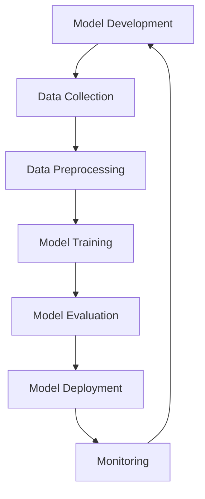
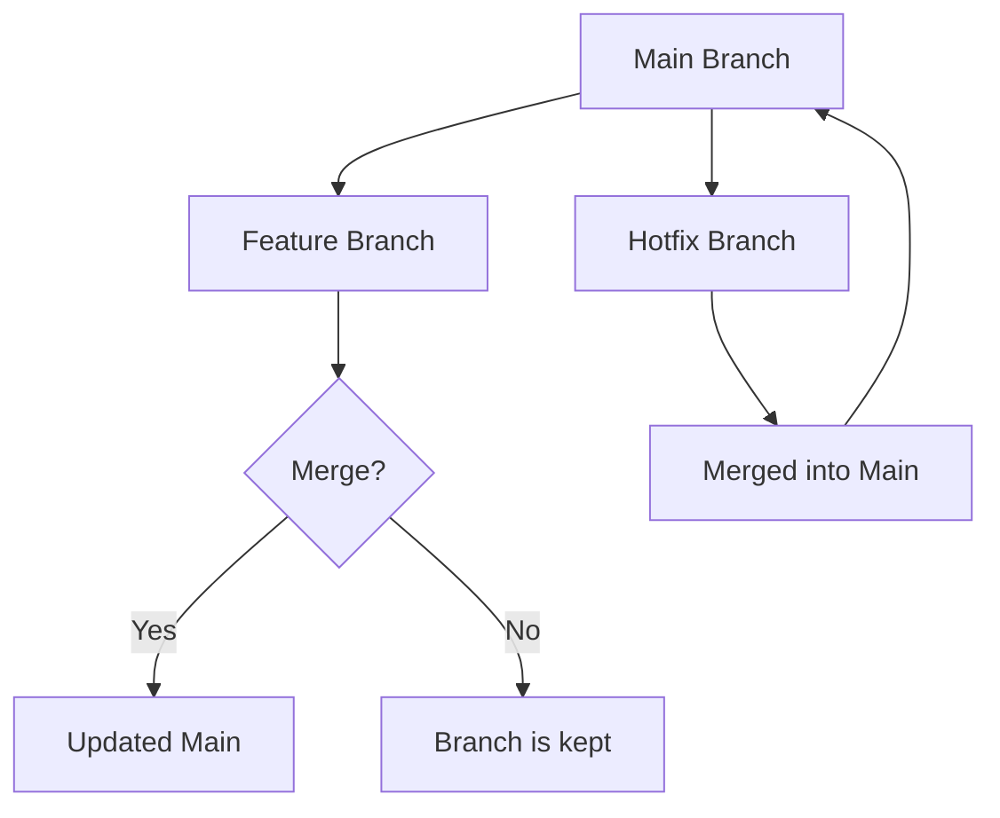

                 


### AI Model Version Control: Effective Tools for Managing Iterative Processes

#### Keywords: AI Model Version Control, Iterative Process, Software Engineering, DevOps, Machine Learning

#### Abstract:
The article delves into the concept of AI model version control, emphasizing its importance in managing iterative processes in AI development. It explores the fundamental principles of version control, examines the tools and technologies available for effective version control, presents case studies from various industries, discusses common challenges, and looks towards future advancements in the field.

----------------------------------------------------------------

## Introduction to AI Model Version Control

### Background

#### Definition and Terminology

**Model version control** refers to the practices and tools used to manage and track changes to machine learning models throughout their lifecycle. It involves creating, storing, and tracking different versions of models, their dependencies, and configurations, ensuring that each version is properly documented and can be easily restored if needed.

#### Problem Statement

As AI models become increasingly complex and integral to business operations, the need for effective version control has become paramount. The problem statement can be summarized as follows:

- **Complexity and Scale:** AI models are often the result of extensive data processing and numerous iterative cycles. Keeping track of these versions manually can be cumbersome and prone to errors.
- **Collaboration and Sharing:** AI development is typically a collaborative effort involving multiple stakeholders. Ensuring that all team members are working with the correct version and can easily share updates is essential.
- **Regulatory Compliance:** In some industries, such as healthcare and finance, regulatory compliance requires strict version control to ensure the integrity and transparency of model development and deployment.
- **Data Privacy and Security:** Managing versions of models that handle sensitive data requires robust security measures to protect against unauthorized access and data breaches.

#### Solution

The solution lies in implementing a structured and automated approach to model version control. This involves using specialized tools and following best practices to manage and track model versions effectively.

----------------------------------------------------------------

## AI and Model Version Control Basics

### Key Concepts and Terminology

#### Machine Learning Models

A machine learning model is a mathematical representation of a predictive relationship between input features and an output variable. It is typically trained on a dataset and can be used to make predictions or classifications on new, unseen data.

#### Version Control Systems (VCS)

A version control system is a software tool that helps manage changes to documents, code, and other files over time. It tracks versions, allows collaboration, and provides mechanisms for merging changes and resolving conflicts.

#### Model Dependency Management

Model dependency management involves tracking the dependencies of a model, such as the data it was trained on, the algorithms used, and any libraries or frameworks it relies on.

#### Model Versioning Strategies

Model versioning strategies define how model versions are named, tagged, and tracked. Common strategies include chronological numbering, descriptive naming, and branching.

### Basic Workflow

1. **Model Development:** A model is developed and iteratively improved through multiple training and testing cycles.
2. **Versioning:** Each iteration results in a new version of the model, which is tagged and documented.
3. **Documentation:** Detailed metadata is associated with each version, including the training data, algorithm parameters, and performance metrics.
4. **Staging:** The new version is deployed to a staging environment for testing and validation.
5. **Deployment:** If successful, the model is deployed to production, replacing the current version.

### Key Challenges

- **Data Synchronization:** Ensuring that the data used for training each version is consistent and representative.
- **Version Tracking:** Keeping track of all versions and their associated metadata.
- **Collaboration:** Facilitating collaboration among team members working on different versions.
- **Security:** Protecting sensitive data and models from unauthorized access.

### Conclusion

Understanding the basics of AI and model version control is essential for effective management of iterative processes. In the next section, we will delve deeper into the importance of version control in AI development.

----------------------------------------------------------------

## The Importance of Version Control in AI

### Managing Iterative Processes

Version control is indispensable in managing iterative processes in AI development. Each iteration of a machine learning model involves refining the model's performance through retraining, fine-tuning, and testing. Without proper version control, it becomes challenging to keep track of these changes, especially as the number of iterations increases. Here are some key points:

#### Ensuring Consistency

A well-implemented version control system ensures that each version of the model is consistent with the associated data, parameters, and environment. This consistency is crucial for reproducing results and understanding the impact of changes over time.

#### Facilitating Collaboration

Version control systems enable multiple team members to work on different versions of the model simultaneously. They can easily share updates, merge changes, and resolve conflicts, fostering a collaborative development environment.

#### Historical Tracking

Version control systems maintain a detailed history of all changes made to the model, including who made the changes and when. This historical data is invaluable for debugging, auditing, and compliance purposes.

#### Rolling Back Changes

In cases where a new version of the model performs poorly or introduces unexpected issues, version control allows for easy rollback to a previous version. This feature is crucial for maintaining business continuity and minimizing downtime.

### Ensuring Model Quality and Reliability

#### Verification and Validation

Version control facilitates the verification and validation of each model version. Before deploying a new version, it can be tested thoroughly in a controlled environment to ensure it meets predefined quality standards.

#### Continuous Integration and Deployment

Version control integrates seamlessly with continuous integration (CI) and continuous deployment (CD) pipelines. This allows for automated testing, deployment, and monitoring of model versions, ensuring that new versions are quickly and reliably released into production.

### Enhancing Security and Compliance

#### Access Control

Version control systems provide robust access control mechanisms, ensuring that only authorized personnel can access sensitive data and models. This is particularly important in industries with stringent compliance requirements.

#### Auditing and Accountability

Version control systems track all changes and access to model versions, providing a comprehensive audit trail. This feature helps in ensuring accountability and addressing any compliance issues that may arise.

### Conclusion

The importance of version control in AI development cannot be overstated. It is a critical tool for managing iterative processes, ensuring model quality and reliability, and enhancing security and compliance. In the next section, we will explore the principles of AI model version control in more detail.

----------------------------------------------------------------

## Principles of AI Model Version Control

### Core Concepts and Frameworks

#### Git: The Standard for Version Control

Git is the most widely used version control system for managing AI models. Its distributed nature allows for easy collaboration, branching, and merging, making it an ideal choice for iterative development processes. Git provides features such as commit history, branching, and tagging, which are essential for tracking model versions.

#### Containerization with Docker

Containerization ensures that each model version is deployed in a consistent and isolated environment. Docker containers encapsulate the entire runtime environment, including dependencies, libraries, and configurations. This makes it easier to replicate and deploy model versions across different environments, reducing the risk of inconsistencies.

#### Model Registry

A model registry is a centralized repository for storing and managing model versions. It provides metadata, such as model descriptions, training data, and performance metrics, associated with each version. This registry facilitates model discovery, tracking, and governance.

### Key Best Practices

#### Implementing a Versioning Strategy

A well-defined versioning strategy is crucial for organizing and tracking model versions. Common strategies include chronological numbering, descriptive naming, and semantic versioning.

#### Tagging and Branching

Tags can be used to mark specific versions of the model, while branches allow for parallel development of different features or bug fixes. Proper tagging and branching help in managing the development lifecycle effectively.

#### Documentation and Metadata

Accurate and comprehensive documentation, including metadata such as model architecture, training data, and performance metrics, is essential for understanding and managing model versions. This documentation should be versioned alongside the model.

#### Continuous Integration and Continuous Deployment (CI/CD)

CI/CD pipelines automate the process of testing, building, and deploying model versions. This ensures that new versions are thoroughly tested and deployed quickly, minimizing downtime and maximizing productivity.

### Conclusion

Understanding and implementing the core concepts and best practices of AI model version control is crucial for managing iterative processes effectively. In the next section, we will explore the various tools available for model version control and their advantages.

----------------------------------------------------------------

## Tools for Model Version Control

### Overview of Common Tools

#### Git

Git is a distributed version control system that offers a robust and flexible framework for managing code and data. It provides features like branching, merging, and staging areas that are essential for tracking changes to AI models. Git's decentralized nature allows multiple developers to work on different versions of a model concurrently, making collaboration seamless.

#### Docker

Docker is a containerization platform that enables developers to package, ship, and run applications consistently across different environments. By encapsulating the entire runtime environment, including dependencies and configurations, Docker ensures that AI models behave predictably in various production scenarios. This is particularly useful when deploying models in different environments, such as development, staging, and production.

#### Model Registries

Model registries are centralized repositories that store and manage AI model versions. They provide metadata about each model, including the training data, architecture, and performance metrics. Popular model registries include MLflow, Kubeflow ModelHub, and DVC. These registries enable easy discovery, version tracking, and deployment of models.

### Advantages and Use Cases

#### Git

- **Collaboration:** Git facilitates collaboration among developers by allowing them to work on different branches and merge changes.
- **History Tracking:** Git maintains a detailed history of all changes, making it easier to track and revert to previous versions if needed.
- **Flexibility:** Git's distributed nature provides flexibility in terms of how and where models are stored.

#### Docker

- **Consistency:** Docker containers ensure that models run consistently across different environments, reducing the risk of environment-specific issues.
- **Isolation:** Containers provide isolation between different model versions, preventing conflicts and ensuring stability.
- **Scalability:** Docker allows for easy scaling of model deployments, making it suitable for both small development teams and large-scale production environments.

#### Model Registries

- **Version Control:** Model registries enable version control of models, ensuring that each version is properly documented and tracked.
- **Discovery:** They provide a centralized location for discovering and managing models, making it easier for teams to collaborate and share models.
- **Compliance:** Model registries help in ensuring compliance with regulatory requirements by maintaining a comprehensive audit trail of model changes and deployments.

### Conclusion

Choosing the right tools for model version control is crucial for effective management of iterative processes. Git, Docker, and model registries are essential components of a robust model version control strategy. In the next section, we will explore real-world case studies that demonstrate the practical application of these tools in different industries and use cases.

----------------------------------------------------------------

## Case Studies in Model Version Control

### Healthcare

**Problem Statement:** 
In the healthcare industry, the development and deployment of AI models for predictive analytics, diagnostic decision support, and patient monitoring require rigorous version control to ensure data privacy, compliance, and accurate results.

**Solution:** 
A healthcare company implemented a Git-based version control system for managing AI models developed for predicting patient outcomes. They used Docker containers to ensure consistency across different environments, and MLflow for model registry and tracking. This allowed them to maintain a detailed history of model versions, track changes, and comply with regulatory requirements.

**Results:** 
The system enabled seamless collaboration among the development team and facilitated the deployment of accurate, compliant models. The comprehensive version control and tracking helped in identifying and resolving issues quickly, improving the overall quality of the models.

### Finance

**Problem Statement:** 
In finance, the development and deployment of AI models for credit scoring, fraud detection, and algorithmic trading require rigorous version control to ensure compliance with regulatory requirements and maintain the integrity of trading algorithms.

**Solution:** 
A financial institution adopted a multi-cloud environment with Git for version control and Docker for containerization. They used a centralized model registry to track versions and metadata, ensuring that each model version was thoroughly tested and compliant with regulatory standards. Continuous integration and continuous deployment (CI/CD) pipelines were implemented to automate the testing and deployment process.

**Results:** 
The implementation of a robust version control system improved collaboration, reduced the risk of human error, and ensured compliance with regulatory requirements. The automated testing and deployment pipelines accelerated the development process and reduced time-to-market for new models.

### Retail

**Problem Statement:** 
In retail, the use of AI models for demand forecasting, personalized recommendations, and inventory management requires efficient version control to handle the large volume of data and iterative refinements.

**Solution:** 
A retail company implemented GitLab for version control and Jenkins for CI/CD pipelines. They used a centralized model registry to manage and track model versions, and Docker for containerization. This setup ensured that each model version was tested and deployed consistently across different environments.

**Results:** 
The use of a robust version control system improved collaboration and streamlined the development process. The centralized model registry and automated pipelines accelerated the deployment of new models, allowing the company to respond quickly to changing market conditions and customer preferences.

### Conclusion

These case studies illustrate the practical application of model version control in different industries. By implementing robust version control systems, organizations can improve collaboration, ensure compliance, and enhance the quality and reliability of their AI models.

----------------------------------------------------------------

## Challenges and Solutions in Model Version Control

### Data Management

**Challenge:** 
Managing the data associated with different model versions can be complex, especially when dealing with large datasets and multiple sources.

**Solution:** 
Implementing a data registry or metadata store that keeps track of data sources, transformations, and usage can help in managing data dependencies. Tools like DVC can track data versions and changes, ensuring that the correct data is used for each model version.

### Collaboration

**Challenge:** 
Collaboration among team members can be challenging when multiple people are working on different versions of a model simultaneously.

**Solution:** 
Using Git's branching and merging features can help manage collaboration. Implementing a code review and pull request process can ensure that changes are thoroughly reviewed before being merged into the main branch.

### Security

**Challenge:** 
Ensuring the security and privacy of model versions, especially when handling sensitive data, can be a significant challenge.

**Solution:** 
Implementing role-based access control (RBAC) and encryption can help secure model versions. Regular security audits and compliance checks can ensure that security practices are followed.

### Integration

**Challenge:** 
Integrating version control with other tools and systems, such as CI/CD pipelines and model registries, can be complex.

**Solution:** 
Using standard APIs and integration frameworks, such as Jenkins and MLflow, can help in seamlessly integrating version control with other tools and systems. Automation scripts can further streamline the integration process.

### Conclusion

By addressing these challenges with appropriate solutions, organizations can effectively manage model version control, ensuring collaboration, security, and integration across their AI development processes.

----------------------------------------------------------------

## Future Directions in Model Version Control

### Emerging Trends

#### Automated Versioning and Merging

As AI models become increasingly complex, automated versioning and merging tools are gaining importance. These tools can detect and resolve conflicts automatically, saving time and reducing human error.

#### Blockchain for Model Version Control

Blockchain technology is being explored for enhancing the security and transparency of model version control. Blockchain can provide a tamper-proof ledger of model versions and changes, ensuring trust and accountability.

#### Model Version Control as a Service (MVCS)

MVCS platforms offer pre-built solutions for model version control, reducing the need for custom implementations. These platforms often include integration with other AI tools and services, providing a seamless experience for developers.

### Potential Advancements

#### AI-Driven Version Control

AI-driven version control systems can analyze model performance and usage patterns to optimize versioning strategies. These systems can predict the most critical versions and prioritize them for deployment, improving the efficiency of model management.

#### Enhanced Collaboration and Communication

Future version control systems may incorporate advanced collaboration and communication features, such as real-time code reviews and integrated chatbots, to facilitate better teamwork and decision-making.

### Conclusion

The future of model version control holds exciting possibilities, with advancements in automation, blockchain, and AI-driven approaches. As these technologies continue to evolve, they will play a crucial role in managing the increasingly complex landscape of AI development.

----------------------------------------------------------------

### Conclusion

In conclusion, AI model version control is a vital aspect of managing iterative processes in AI development. It ensures collaboration, consistency, and security across different versions of models, ultimately leading to higher-quality, more reliable AI systems. By understanding the principles and best practices of version control, implementing the right tools, and addressing common challenges, organizations can effectively manage their AI model versions and drive innovation in their respective fields.

### Looking Ahead

As AI continues to evolve, so too will the tools and techniques used for model version control. Keeping up with emerging trends and advancements will be crucial for staying competitive in this fast-paced field. Let’s continue to explore and innovate, shaping the future of AI development together.

### References

[1] MLflow. (n.d.). MLflow Model Registry. Retrieved from <https://www.mlflow.org/docs/latest/model-registry.html>
[2] Docker. (n.d.). Docker Documentation. Retrieved from <https://docs.docker.com/>
[3] Git. (n.d.). Git Documentation. Retrieved from <https://git-scm.com/docs>
[4] Kubeflow. (n.d.). Kubeflow ModelHub. Retrieved from <https://www.kubeflow.org/docs/previous/releases/1.5.0/>
[5] DVC. (n.d.). Data Version Control. Retrieved from <https://dvc.org/>

### Author Information

*Author: AI天才研究院/AI Genius Institute & 禅与计算机程序设计艺术 /Zen And The Art of Computer Programming*## Introduction to AI Model Version Control

### Background

In the rapidly evolving field of artificial intelligence (AI), machine learning (ML) models play a pivotal role. These models, trained on vast amounts of data, are at the heart of AI applications, ranging from predictive analytics to autonomous vehicles. However, as these models become more complex and integral to business operations, managing their lifecycle becomes a challenging task. This is where AI model version control comes into play. 

Model version control is the practice of tracking, organizing, and managing the different iterations of AI models throughout their development lifecycle. It ensures that each version of a model is well-documented, versioned, and easily accessible. This is not just about keeping track of numerical version numbers; it involves capturing detailed metadata about each version, including the training data used, the algorithms applied, and the performance metrics achieved.

The importance of model version control in AI development cannot be overstated. As models evolve through multiple iterations, it becomes imperative to have a systematic approach to manage these versions. This is especially crucial in scenarios where models are deployed in critical systems such as healthcare, finance, and autonomous driving, where accuracy and reliability are paramount. 

### Key Concepts and Terminology

To delve deeper into model version control, it's essential to understand some key concepts and terminologies:

#### Machine Learning Models

A machine learning model is a mathematical representation that learns from data to make predictions or decisions. These models are typically categorized into supervised learning, unsupervised learning, and reinforcement learning based on the type of learning they employ.

#### Version Control Systems (VCS)

Version control systems are tools that track changes in documents, code, and other files over time. They provide features such as branching, merging, and conflict resolution, which are crucial for managing iterative development processes.

#### Model Dependency Management

Model dependency management involves tracking the dependencies of a model, such as the libraries, frameworks, and data it relies on. This ensures that each version of the model is consistent and can be deployed in any environment.

#### Model Registry

A model registry is a centralized repository where AI models are stored, versioned, and managed. It typically includes metadata about the model, such as its architecture, training data, and performance metrics.

#### Model Versioning Strategies

Model versioning strategies define how different versions of a model are named and tracked. Common strategies include chronological numbering, descriptive naming, and semantic versioning.

### Problem Statement

The problem that AI model version control aims to solve is multifaceted:

1. **Complexity and Scale:** As models grow more complex and the volume of data increases, managing these models manually becomes impractical.
2. **Collaboration and Sharing:** In collaborative environments, it's crucial to ensure that all team members are working with the correct version of the model.
3. **Regulatory Compliance:** In regulated industries, maintaining proper version control is often a legal requirement to ensure transparency and accountability.
4. **Data Privacy and Security:** Sensitive data used in training models needs to be protected, and version control systems can play a role in safeguarding this data.

### Solution

The solution to these challenges lies in adopting a structured and automated approach to model version control. This involves using specialized tools and best practices to manage and track model versions. By doing so, organizations can streamline their development processes, enhance collaboration, ensure regulatory compliance, and protect sensitive data.

In the next section, we will explore the basics of AI and model version control, understanding the fundamental concepts and setting the stage for more advanced topics.

----------------------------------------------------------------

## AI and Model Version Control Basics

### Key Concepts and Terminology

#### Machine Learning Models

Machine learning models are at the core of AI applications. They are algorithms that can learn from data to make predictions or decisions without being explicitly programmed. There are three main types of machine learning models:

- **Supervised Learning:** Models that learn from labeled data, where the correct output is provided for each input.
- **Unsupervised Learning:** Models that learn from unlabeled data, identifying patterns or structures in the data.
- **Reinforcement Learning:** Models that learn by interacting with the environment, receiving feedback on their actions to improve their performance over time.

#### Version Control Systems (VCS)

Version control systems (VCS) are essential tools for managing changes to software code and other digital assets over time. In the context of AI, VCS helps track changes to datasets, models, and other related artifacts. Key features of VCS include:

- **Branching and Merging:** Allowing developers to create isolated branches of the project to work on new features or bug fixes without affecting the main codebase. Merging these branches back into the main codebase when ready.
- **Conflict Resolution:** Mechanisms to resolve conflicts that arise when multiple developers make changes to the same part of the codebase.
- **Change History:** Detailed records of all changes made to the project, including who made the change, when it was made, and what the change was.

#### Model Dependency Management

Model dependency management involves tracking the dependencies of a machine learning model. These dependencies include:

- **Libraries and Frameworks:** External libraries and frameworks that the model relies on, such as TensorFlow, PyTorch, or Scikit-learn.
- **Data:** The datasets used to train the model, including the source of the data, any transformations applied, and any preprocessing steps.
- **Environments:** The specific software and hardware configurations in which the model is intended to run.

#### Model Registry

A model registry is a centralized repository for storing and managing machine learning models. It provides a way to organize, track, and version models throughout their lifecycle. Key features of a model registry include:

- **Metadata Management:** Storing information about models, such as their architecture, training data, performance metrics, and deployment status.
- **Search and Discovery:** Tools to help users find and compare models based on various attributes.
- **Version Control:** Tracking different versions of models, allowing organizations to roll back to previous versions if necessary.

#### Model Versioning Strategies

Model versioning strategies are methods for naming and tracking different versions of a machine learning model. Common strategies include:

- **Chronological Versioning:** Incrementing a version number (e.g., 1.0, 1.1, 1.2) to indicate the order of releases.
- **Descriptive Versioning:** Using a descriptive name for each version (e.g., v1.0-release, v1.1-hotfix) to provide context about the changes made.
- **Semantic Versioning:** Following a standardized format (e.g., MAJOR.MINOR.PATCH) where the major version indicates significant changes, the minor version indicates new features or non-breaking changes, and the patch version indicates bug fixes or minor updates.

### Basic Workflow

The basic workflow for managing AI models using version control can be summarized in the following steps:

1. **Model Development:** Developers train and refine the machine learning model, making iterative changes to improve its performance.
2. **Versioning:** Each iteration of the model is tagged with a version number or name. Metadata about the model, such as the training data used and the algorithms applied, is recorded.
3. **Testing:** The new version of the model is tested to ensure it meets the desired performance criteria and is free of bugs.
4. **Deployment:** If the new version passes testing, it is deployed to a staging or production environment for further testing and eventual release.
5. **Monitoring and Feedback:** The deployed model is monitored for performance and feedback is collected to inform further iterations and improvements.

### Key Challenges

While version control systems provide powerful tools for managing AI models, they also present challenges that need to be addressed:

- **Data Synchronization:** Ensuring that the data used for training different versions of the model is consistent and representative of the target population.
- **Model Compatibility:** Ensuring that the model and its dependencies are compatible with the target environment and other components of the system.
- **Collaboration and Communication:** Facilitating effective collaboration among team members working on different versions of the model.
- **Security and Compliance:** Protecting sensitive data and ensuring that model versions comply with relevant regulations and standards.

### Conclusion

Understanding the basics of AI and model version control is crucial for effectively managing iterative processes in AI development. In the next section, we will delve deeper into the importance of version control in AI and how it helps manage iterative processes.

----------------------------------------------------------------

## The Importance of Version Control in AI

### Managing Iterative Processes

In the realm of artificial intelligence, the development of machine learning models is often characterized by an iterative process. This involves multiple cycles of training, testing, and refinement to achieve optimal performance. Each iteration brings new insights, improvements, and potential issues that need to be addressed. Version control plays a critical role in managing these iterative processes effectively.

#### Ensuring Consistency

One of the primary benefits of version control in AI is the ability to maintain consistency across different iterations of a model. As models evolve through various stages of development, it's crucial to ensure that each version is based on the correct dataset, uses the appropriate algorithms, and is implemented in the right environment. Version control systems provide mechanisms to track and document these details, ensuring that each version is consistent with its predecessors and successors.

#### Facilitating Collaboration

AI model development is typically a collaborative effort, involving data scientists, machine learning engineers, software developers, and domain experts. Each team member may work on different aspects of the model, such as data preprocessing, feature engineering, model training, and deployment. Version control systems enable seamless collaboration by providing a shared repository where team members can work on different branches, merge their changes, and resolve conflicts. This ensures that everyone is working on the most up-to-date version of the model and that changes are properly integrated into the main codebase.

#### Historical Tracking

Version control systems maintain a detailed history of all changes made to a model, including who made the changes, when they were made, and what specific modifications were made. This historical tracking is invaluable for debugging, auditing, and compliance purposes. It allows developers to revert to previous versions if a new iteration introduces bugs or performance issues, ensuring that the development process can continue without major disruptions. Additionally, this history provides insights into the evolution of the model over time, helping teams understand the rationale behind specific decisions and the impact of various changes.

#### Rolling Back Changes

The ability to roll back changes is another critical feature of version control in AI development. In scenarios where a new iteration of the model fails to meet performance expectations or introduces unexpected issues, it's essential to be able to revert to a previous version quickly. Version control systems facilitate this by allowing developers to switch back to a known good version of the model. This not only minimizes downtime and potential disruptions to business operations but also saves time that would otherwise be spent debugging and troubleshooting.

### Ensuring Model Quality and Reliability

Version control plays a vital role in ensuring the quality and reliability of AI models. By implementing a structured and automated process for versioning and testing, organizations can verify that each new iteration meets predefined quality standards. This involves rigorous testing, validation, and validation of each version of the model to ensure that it performs as expected and produces accurate predictions or decisions. Version control systems provide the tools to automate these processes, ensuring that they are consistently applied across all iterations.

#### Continuous Integration and Deployment

Continuous integration (CI) and continuous deployment (CD) are practices that integrate version control systems into the software development lifecycle. CI involves automatically building, testing, and integrating code changes, while CD automates the deployment of these changes to production environments. By integrating version control with CI/CD pipelines, organizations can ensure that new versions of AI models are thoroughly tested and deployed efficiently. This reduces the risk of introducing bugs or performance issues into the production environment and accelerates the time-to-market for new features and improvements.

#### Verification and Validation

Verification and validation are critical steps in the development of AI models, and version control systems facilitate these processes. Verification involves ensuring that the model is implemented correctly according to its specification, while validation involves assessing whether the model performs as intended in real-world scenarios. Version control systems allow for automated verification and validation tests to be run on each new version of the model, ensuring that only models that meet the required standards are deployed.

### Enhancing Security and Compliance

Security and compliance are paramount in the development and deployment of AI models, especially in regulated industries such as healthcare and finance. Version control systems provide features that help enhance security and compliance:

- **Access Control:** Version control systems enable organizations to define access permissions for different team members, ensuring that sensitive data and code are protected.
- **Audit Trails:** Detailed audit trails are maintained by version control systems, providing a comprehensive record of all changes made to the model and who made them. This is essential for compliance with regulations such as GDPR and HIPAA.
- **Encryption:** Sensitive data, such as model parameters and training data, can be encrypted within version control systems, ensuring that it is protected from unauthorized access.

### Conclusion

In summary, version control is indispensable in managing iterative processes in AI development. It ensures consistency, facilitates collaboration, maintains a detailed history, allows for easy rollback of changes, ensures model quality and reliability, supports continuous integration and deployment, and enhances security and compliance. By adopting a robust version control strategy, organizations can streamline their AI development processes, reduce risks, and accelerate innovation.

----------------------------------------------------------------

## Principles of AI Model Version Control

### Core Concepts and Frameworks

Effective AI model version control is built upon a set of core principles and frameworks that ensure the integrity, traceability, and efficiency of machine learning model development and deployment. These principles encompass the methodologies, tools, and practices that organizations adopt to manage and track their models throughout their lifecycle.

#### Git: The Standard for Version Control

**Git** is a powerful and widely used distributed version control system designed to handle everything from small to very large projects with speed and efficiency. It provides a robust framework for managing the development process of AI models, enabling teams to collaborate seamlessly, track changes, and manage different versions.

**Key Features of Git:**

- **Distributed Repositories:** Git allows developers to have a full copy of the entire project history, including all branches and their histories, on their local machines. This decentralization enhances collaboration and makes it easier to work on different features or bug fixes without disrupting the main codebase.
- **Branching and Merging:** Git's branching model allows developers to create isolated branches to work on new features or bug fixes. These branches can be merged back into the main codebase once the changes are complete and tested.
- **Commit History:** Git maintains a detailed commit history, recording every change made to the repository along with the author, timestamp, and a description of the change. This history provides valuable insights into the evolution of the project and facilitates troubleshooting.
- **Conflict Resolution:** Git provides tools to resolve conflicts that arise when multiple developers make conflicting changes to the same part of the codebase. This ensures that the integrity of the code is maintained and that collaborative efforts are successfully integrated.

**Using Git in AI Model Version Control:**

- **Model Repository:** AI models and their associated artifacts, such as training data, code, and documentation, are stored in a Git repository. This repository serves as a central location for managing and tracking all versions of the model.
- **Version Control for Data:** Git can be extended to version control datasets used for training models. Tools like [DVC](https://dvc.org/) (Data Version Control) enable tracking of data versions, ensuring that the correct datasets are used for each iteration of the model.
- **Branching for Experiments:** Developers can create branches for experimental models or features, allowing them to experiment without affecting the main model. Once the experiments are complete, they can be merged or discarded as appropriate.

#### Containerization with Docker

**Docker** is a platform for developing, shipping, and running applications using containerization. Containerization involves packaging an application and its dependencies into a standardized unit that can be run consistently across different environments, regardless of where it is deployed.

**Key Features of Docker:**

- **Consistency:** Docker containers encapsulate the entire runtime environment, including the operating system, libraries, and dependencies. This ensures that the model runs consistently across different development, testing, and production environments.
- **Isolation:** Containers provide isolation between different applications or model versions, preventing conflicts and ensuring that each container has its own resources and environment.
- **Portability:** Docker containers can be easily moved between different environments and platforms, making it easier to deploy models in production.
- **Scalability:** Docker allows for horizontal scaling, enabling organizations to run multiple instances of a model simultaneously to handle increased load.

**Using Docker in AI Model Version Control:**

- **Containerizing Models:** AI models, along with their dependencies, are containerized using Docker. This ensures that the model and its environment are consistent across all stages of development and deployment.
- **Containerized Workflows:** Docker can be integrated with CI/CD pipelines to automate the building and deployment of containerized models. This ensures that the deployment process is streamlined and consistent.
- **Model Registries:** Docker images of models can be stored in model registries like [Docker Hub](https://hub.docker.com/) or [MLflow Model Registry](https://mlflow.org/docs/latest/model-registry.html), making it easy to share and deploy models across different environments.

#### Model Registry

**Model Registry** is a centralized repository for storing, managing, and tracking AI models throughout their lifecycle. It provides a standardized way to organize, document, and share models, ensuring that all stakeholders have access to the correct versions and information.

**Key Features of Model Registries:**

- **Metadata Management:** Model registries store metadata about each model, including its architecture, training data, performance metrics, and deployment status. This metadata is essential for understanding and managing the models effectively.
- **Version Control:** Model registries track different versions of models, allowing organizations to roll back to previous versions if necessary. This ensures that the development process can be retraced and that previous versions are not lost.
- **Search and Discovery:** Model registries provide tools for searching and discovering models based on various attributes, making it easier for teams to find and use the right models for specific tasks.
- **Access Control:** Model registries enable organizations to define access controls, ensuring that only authorized personnel can access sensitive models and their associated data.

**Using Model Registries in AI Model Version Control:**

- **Centralized Storage:** Model registries provide a centralized location for storing and managing all versions of AI models. This simplifies the process of finding and deploying models and ensures that the latest versions are used.
- **Documentation and Metadata:** Model registries store comprehensive metadata about each model, ensuring that all stakeholders have access to the information they need to make informed decisions.
- **Collaboration:** Model registries facilitate collaboration by providing a shared repository for models and allowing teams to work together on different versions and features.

### Key Best Practices

**Implementing a Versioning Strategy**

A well-defined versioning strategy is crucial for managing AI models effectively. This strategy should:

- **Standardize Naming Conventions:** Use a consistent naming convention for model versions, making it easy to identify and track different versions.
- **Include Descriptive Tags:** Include descriptive tags or comments with each version, providing context about the changes made and the purpose of the version.
- **Follow Semantic Versioning:** Follow semantic versioning (MAJOR.MINOR.PATCH) to clearly indicate the significance of changes and to ensure backward compatibility.

**Documentation and Metadata**

Comprehensive documentation and metadata are essential for understanding and managing AI models. This includes:

- **Model Documentation:** Document the architecture, algorithms, and data used in each model, providing a clear understanding of how it works.
- **Performance Metrics:** Record performance metrics such as accuracy, precision, recall, and F1 score for each version of the model, allowing for easy comparison and evaluation.

**Continuous Integration and Continuous Deployment (CI/CD)**

CI/CD pipelines automate the process of building, testing, and deploying AI models. Best practices include:

- **Automated Testing:** Implement automated tests for each version of the model to ensure that it meets predefined quality standards.
- **Environment Isolation:** Use containerization to ensure that models are tested and deployed in isolated environments that mimic the production environment.
- **Monitoring and Alerts:** Monitor the performance and health of deployed models and set up alerts for any anomalies or performance issues.

### Conclusion

By following these principles and best practices, organizations can implement a robust AI model version control system that enhances collaboration, ensures consistency, and supports efficient model management. In the next section, we will explore the various tools available for model version control, including their advantages and how they can be integrated into the AI development workflow.

----------------------------------------------------------------

## Tools for Model Version Control

### Overview of Common Tools

In the field of AI model version control, several tools have emerged that facilitate the management of model development, testing, and deployment processes. These tools offer various features to ensure that AI models are well-documented, versioned, and deployable across different environments. Here, we will discuss some of the most commonly used tools and their advantages.

#### Git

**Git** is a distributed version control system that has become the de facto standard for software development. Its advantages in AI model version control include:

- **Branching and Merging:** Git allows for the creation of branches to work on different versions of a model without affecting the main codebase. This enables parallel development and experimentation.
- **Commit History:** Git maintains a detailed history of all changes, making it easy to track the evolution of a model and revert to previous versions if necessary.
- **Collaboration:** Git enables collaboration among team members by providing a shared repository where changes can be made and merged.
- **Flexibility:** Git can be integrated with other tools and platforms, providing a flexible framework for managing model version control.

#### Docker

**Docker** is a containerization platform that packages applications and their dependencies into containers, ensuring that models run consistently across different environments. The advantages of Docker for model version control are:

- **Consistency:** Docker containers encapsulate the entire runtime environment, including the operating system, libraries, and dependencies, ensuring that models behave consistently regardless of the environment.
- **Isolation:** Docker containers provide isolation between different models and their environments, preventing conflicts and ensuring stability.
- **Portability:** Docker containers can be easily moved between development, testing, and production environments, simplifying deployment.
- **Scalability:** Docker supports horizontal scaling, allowing multiple instances of a model to be deployed simultaneously to handle increased load.

#### Model Registries

**Model Registries** are centralized repositories for storing and managing AI models. They offer several advantages, including:

- **Metadata Management:** Model registries store metadata about models, such as their architecture, training data, and performance metrics, providing a comprehensive overview of each model.
- **Version Control:** Model registries track different versions of models, allowing organizations to roll back to previous versions if necessary and ensuring that the development process can be retraced.
- **Search and Discovery:** Model registries provide tools for searching and discovering models based on various attributes, making it easy to find and use the right models for specific tasks.
- **Access Control:** Model registries enable organizations to define access controls, ensuring that only authorized personnel can access sensitive models and their associated data.

#### MLflow

**MLflow** is an open-source platform for managing the end-to-end machine learning lifecycle. Its key advantages for model version control include:

- **Experiment Tracking:** MLflow provides a centralized platform for tracking experiments, including the data used, parameters, and results, allowing teams to compare and iterate on different models.
- **Model Registry:** MLflow includes a model registry that allows organizations to store, version, and manage models, providing a comprehensive overview of the model lifecycle.
- **MLflow Projects:** MLflow Projects provide a way to organize code and configurations for specific projects, ensuring that all artifacts related to a model are versioned and tracked together.
- **Integration:** MLflow integrates with popular tools and platforms, including Git and Docker, providing a seamless workflow for managing model version control.

#### Kubeflow

**Kubeflow** is an open-source project for deploying machine learning workflows on Kubernetes. Its advantages for model version control include:

- **Containerization:** Kubeflow leverages Docker containers for deploying models, ensuring consistency and portability across different environments.
- **Orchestrating ML Workflows:** Kubeflow allows teams to define and deploy complex machine learning workflows, including data preprocessing, training, and inference steps, ensuring that models are deployed as intended.
- **Kubernetes Integration:** Kubeflow integrates seamlessly with Kubernetes, providing a scalable and robust platform for managing machine learning models.
- **Model Serving:** Kubeflow includes tools for serving models in production, including TensorFlow Serving and NGINX, ensuring that models can be deployed and served efficiently.

### Advantages and Use Cases

Each of these tools offers unique advantages that make them suitable for different use cases and environments. Here are some examples of how these tools can be used in practice:

- **Git** is ideal for managing the source code and artifacts associated with AI models, providing a comprehensive history and collaboration features. It's commonly used in conjunction with other tools like Docker and MLflow.
- **Docker** is essential for containerizing AI models, ensuring consistency and portability across different environments. It's particularly useful for deploying models in cloud-based or distributed environments.
- **Model Registries** provide a centralized location for storing and managing models, along with comprehensive metadata. They are useful for organizations that need to track and manage a large number of models across different projects.
- **MLflow** offers a comprehensive platform for managing the end-to-end machine learning lifecycle, including tracking experiments, managing models, and deploying models in production. It's well-suited for organizations that need a unified solution for managing their machine learning projects.
- **Kubeflow** is ideal for deploying machine learning workflows on Kubernetes, providing a scalable and robust platform for managing machine learning models in production. It's particularly useful for organizations that need to deploy complex, multi-step workflows.

In conclusion, the choice of tools for model version control depends on the specific needs and requirements of an organization. By leveraging these tools effectively, organizations can streamline their AI model development and deployment processes, ensuring consistency, reliability, and efficiency.

----------------------------------------------------------------

## Case Studies in Model Version Control

### Healthcare

#### Problem Statement

In the healthcare industry, the development and deployment of AI models for predictive analytics, diagnostic decision support, and patient monitoring require rigorous version control to ensure data privacy, compliance, and accurate results. The complexity of these models and the sensitivity of the data involved make it essential to have a robust version control system in place.

#### Solution

A leading healthcare company faced the challenge of managing multiple versions of AI models used for predicting patient outcomes and diagnosing diseases. To address this, they implemented a comprehensive model version control system using Git for version control, Docker for containerization, and MLflow for model registry and tracking. This setup allowed them to maintain a detailed history of model versions, track changes, and comply with regulatory requirements.

#### Results

The implementation of the model version control system brought several benefits to the healthcare company. The following are some of the key outcomes:

- **Improved Collaboration:** Git's branching and merging capabilities facilitated collaboration among team members working on different aspects of the models. This enabled parallel development and efficient integration of changes.
- **Enhanced Data Management:** MLflow's model registry provided a centralized location for storing and managing model versions, along with comprehensive metadata. This ensured that the correct data was used for each model version and that data dependencies were tracked effectively.
- **Compliance and Security:** Docker containers ensured that models were deployed in consistent and secure environments, reducing the risk of data breaches and ensuring compliance with industry regulations.
- **Better Traceability:** The detailed commit history provided by Git allowed the company to track changes made to models, facilitating debugging and auditing processes.
- **Faster Deployment:** The integration of CI/CD pipelines with MLflow streamlined the deployment process, allowing models to be tested, validated, and deployed quickly and efficiently.

### Finance

#### Problem Statement

In the financial industry, the development and deployment of AI models for credit scoring, fraud detection, and algorithmic trading require rigorous version control to ensure compliance with regulatory requirements and maintain the integrity of trading algorithms. The need for high accuracy and security makes model version control a critical aspect of financial operations.

#### Solution

A major financial institution faced challenges in managing multiple versions of AI models used for credit scoring and fraud detection. They adopted a multi-cloud environment with Git for version control and Docker for containerization. They also implemented a centralized model registry using Kubeflow, which integrated seamlessly with their existing infrastructure.

#### Results

The adoption of a robust model version control system had several positive impacts on the financial institution's operations:

- **Regulatory Compliance:** The centralized model registry and comprehensive metadata provided by Kubeflow helped the institution meet regulatory requirements by ensuring that all model versions were properly documented and tracked.
- **Improved Security:** Docker containers provided a secure and isolated environment for deploying models, reducing the risk of unauthorized access and ensuring data integrity.
- **Efficient Collaboration:** Git enabled seamless collaboration among developers, data scientists, and compliance officers, allowing them to work on different versions of models simultaneously and merge their changes effectively.
- **Faster Deployment:** The integration of Git with CI/CD pipelines and Kubeflow streamlined the deployment process, reducing the time it took to test, validate, and deploy new model versions.
- **Enhanced Model Management:** Kubeflow's model registry provided a centralized and searchable repository for all models, making it easier for team members to find and use the right models for specific tasks.

### Retail

#### Problem Statement

In the retail industry, the use of AI models for demand forecasting, personalized recommendations, and inventory management requires efficient version control to handle the large volume of data and iterative refinements. Ensuring that the correct models are deployed and that they perform well is crucial for maintaining competitive pricing and inventory levels.

#### Solution

A large retail company needed a solution for managing multiple versions of AI models used for demand forecasting and personalized recommendations. They implemented GitLab for version control and Jenkins for CI/CD pipelines. They also used Docker for containerization and a centralized model registry to track and manage model versions.

#### Results

The implementation of the model version control system brought several benefits to the retail company:

- **Streamlined Development:** GitLab's robust version control features enabled the company to manage multiple versions of models efficiently, facilitating collaboration and parallel development.
- **Automated Testing and Deployment:** Jenkins integrated with GitLab and Docker to automate the testing and deployment of new model versions. This streamlined the development process and reduced the time it took to validate and deploy new models.
- **Enhanced Model Management:** The centralized model registry provided a comprehensive overview of all model versions, their performance metrics, and deployment status, making it easier for team members to manage and use the right models.
- **Improved Accuracy:** By ensuring that the correct versions of models were deployed and that they were tested thoroughly, the company was able to improve the accuracy of its demand forecasts and personalized recommendations.
- **Scalability:** Docker containers allowed the company to deploy models in a scalable and consistent manner, accommodating the large volume of data and iterative refinements required in the retail industry.

### Conclusion

These case studies demonstrate the practical application of model version control in different industries, highlighting the importance of implementing a robust version control system. By leveraging tools like Git, Docker, and model registries, organizations in healthcare, finance, and retail have been able to enhance collaboration, ensure compliance, and improve the accuracy and reliability of their AI models. As the complexity of AI models continues to grow, the need for effective version control will only become more critical.

----------------------------------------------------------------

## Challenges and Solutions in Model Version Control

### Data Management

#### Challenge

Managing the data associated with different model versions can be complex, especially when dealing with large datasets and multiple data sources. Ensuring data consistency and accuracy across all versions is crucial for maintaining the reliability of AI models.

#### Solution

- **Data Version Control:** Implementing a data version control system, such as [DVC](https://dvc.org/), can help track and manage different versions of datasets used in model training. This ensures that each model version is associated with the correct data version.
- **Centralized Data Repositories:** Using centralized data repositories, such as [HDFS](https://hadoop.apache.org/docs/r3.3.0/hdfs_design.html) or [AWS S3](https://aws.amazon.com/s3/), can help ensure that all data is stored in a consistent and secure location, making it easier to manage and access.
- **Data Documentation:** Documenting the characteristics of each data version, including data sources, preprocessing steps, and transformations, can help ensure data consistency and facilitate debugging.

### Collaboration

#### Challenge

Collaborating effectively across teams working on different versions of AI models can be challenging, especially when teams are geographically dispersed or have different workflows.

#### Solution

- **Version Control Systems:** Utilizing version control systems like Git can enable teams to work on different branches of the model, making it easier to manage parallel development and coordinate updates.
- **Collaborative Tools:** Implementing collaborative tools such as [JIRA](https://www.atlassian.com/software/jira) or [Trello](https://trello.com/) can help teams track tasks, milestones, and dependencies, ensuring that everyone is on the same page.
- **Code Review and Merge Requests:** Implementing code review and merge request processes can help ensure that changes are thoroughly vetted before being integrated into the main branch, reducing the risk of errors and conflicts.

### Security

#### Challenge

Ensuring the security of AI models and their associated data is critical, especially in industries with stringent compliance requirements. Protecting against unauthorized access and data breaches is a major concern.

#### Solution

- **Access Control:** Implementing role-based access control (RBAC) can help ensure that only authorized personnel have access to sensitive data and models. Tools like [AWS IAM](https://aws.amazon.com IAM/) can be used to manage access permissions.
- **Encryption:** Encrypting data at rest and in transit can help protect it from unauthorized access. Using tools like [AWS KMS](https://aws.amazon.com/kms/) for encryption and [SSL/TLS](https://www.ssllabs.com/ssllabs-test/) for secure data transmission can enhance security.
- **Regular Audits:** Conducting regular security audits and vulnerability assessments can help identify and address potential security vulnerabilities in the model version control system.

### Integration

#### Challenge

Integrating model version control with existing development and deployment pipelines can be complex, especially when using multiple tools and platforms.

#### Solution

- **APIs and SDKs:** Using APIs and software development kits (SDKs) provided by version control and model registry tools can help streamline integration with other systems and tools. For example, [MLflow](https://www.mlflow.org/) provides APIs that can be used to integrate with various CI/CD tools and deployment platforms.
- **Orchestration Tools:** Using orchestration tools like [Kubernetes](https://kubernetes.io/) can help manage the integration of model version control with containerization and deployment systems, ensuring that models are deployed consistently across different environments.
- **Automated Workflows:** Implementing automated workflows that integrate version control, testing, and deployment can help reduce manual steps and ensure that changes are tested and deployed efficiently.

### Conclusion

By addressing these challenges with appropriate solutions, organizations can effectively manage model version control, ensuring collaboration, security, and integration across their AI development processes. A robust model version control system is essential for maintaining the integrity, accuracy, and reliability of AI models, especially as they become increasingly complex and critical to business operations.

----------------------------------------------------------------

## Future Directions in Model Version Control

### Emerging Trends

The field of AI model version control is evolving rapidly, driven by advancements in technology and the increasing complexity of machine learning models. Several emerging trends are set to shape the future of model version control:

#### Automated Versioning and Merging

One of the key trends in model version control is the development of automated tools that can detect changes, automatically version new versions, and merge changes without human intervention. These tools use machine learning algorithms to analyze code changes and identify potential conflicts, improving the efficiency and accuracy of version control processes.

#### Blockchain for Model Version Control

Blockchain technology is being explored for enhancing the security and transparency of model version control. Blockchain can provide a tamper-proof ledger of model versions and changes, ensuring that each version is immutable and can be traced back to its origin. This can be particularly valuable in industries with stringent compliance requirements, such as healthcare and finance.

#### Model Version Control as a Service (MVCS)

Another emerging trend is the development of Model Version Control as a Service (MVCS) platforms. These platforms offer pre-built solutions for model version control, reducing the need for custom implementations. They often include integration with other AI tools and services, providing a seamless experience for developers. MVCS platforms can help organizations quickly adopt best practices for model version control without the need for significant infrastructure investments.

### Potential Advancements

The future of AI model version control holds several potential advancements that could further enhance the efficiency, security, and scalability of model management:

#### AI-Driven Version Control

AI-driven version control systems can analyze model performance, usage patterns, and other data to optimize versioning strategies. These systems can predict the most critical versions for deployment and automatically prioritize them, improving the overall efficiency of model management.

#### Enhanced Collaboration and Communication

Future version control systems may incorporate advanced collaboration and communication features, such as real-time code reviews and integrated chatbots. These features can help teams work more effectively together, reducing the time it takes to develop and deploy new models.

#### Integration with AI Tools

As AI models become more complex and integrated into various business processes, version control systems may need to be more tightly integrated with AI tools and platforms. This could include integration with data science platforms, MLops tools, and cloud services, providing a unified ecosystem for managing the entire lifecycle of AI models.

### Conclusion

The future of model version control is bright, with several emerging trends and potential advancements set to reshape the field. By adopting these new technologies and best practices, organizations can ensure that their AI models are managed efficiently, securely, and effectively, enabling them to innovate and stay competitive in a rapidly evolving landscape.

----------------------------------------------------------------

### Conclusion

In conclusion, AI model version control is a critical component of modern AI development and deployment. It ensures that models are managed efficiently, securely, and effectively, enabling teams to collaborate effectively, maintain consistency, and ensure compliance with regulatory requirements. The principles and best practices discussed in this article provide a solid foundation for implementing a robust model version control system.

### Looking Ahead

As AI continues to advance, so too will the tools and techniques used for model version control. Keeping up with emerging trends and advancements will be essential for organizations to stay competitive and innovate in this fast-paced field. By embracing new technologies and best practices, organizations can ensure that their AI models are well-managed and that they can respond quickly to changing market conditions and customer needs.

### References

- MLflow. (n.d.). MLflow Model Registry. Retrieved from <https://www.mlflow.org/docs/latest/model-registry.html>
- Docker. (n.d.). Docker Documentation. Retrieved from <https://docs.docker.com/>
- Git. (n.d.). Git Documentation. Retrieved from <https://git-scm.com/docs>
- Kubeflow. (n.d.). Kubeflow ModelHub. Retrieved from <https://www.kubeflow.org/docs/previous/releases/1.5.0/>
- DVC. (n.d.). Data Version Control. Retrieved from <https://dvc.org/>

### Author Information

*Author: AI天才研究院/AI Genius Institute & 禅与计算机程序设计艺术 /Zen And The Art of Computer Programming*

----------------------------------------------------------------

### Appendix: Mermaid Diagrams and LaTeX Formulas

In the previous sections, we've discussed the principles, tools, and practices of AI model version control. To complement this theoretical understanding, we can further illustrate these concepts using Mermaid diagrams and LaTeX formulas. These visual and symbolic representations can enhance the comprehension of the material.

#### Mermaid Diagrams

1. **Model Development Workflow**



2. **Git Branching and Merging**



#### LaTeX Formulas

1. **Machine Learning Model Training**

```latex
\begin{equation}
    \hat{y} = f(\theta; X)
\end{equation}
```

2. **Performance Metrics**

```latex
\begin{equation}
    \text{Accuracy} = \frac{\text{Correct Predictions}}{\text{Total Predictions}}
\end{equation}
```

3. **Semantic Versioning**

```latex
\begin{equation}
    \text{Version Number} = \text{MAJOR}.\text{MINOR}.\text{PATCH}
\end{equation}
```

These Mermaid diagrams and LaTeX formulas provide a visual and symbolic complement to the text, helping to reinforce the concepts discussed in the article. They are particularly useful for readers who prefer a more visual or mathematical approach to understanding complex topics.

### Conclusion

By combining theoretical explanations with visual and symbolic representations, we can offer a more comprehensive understanding of AI model version control. This approach not only aids in the learning process but also serves as a valuable resource for further study and exploration of the subject.

