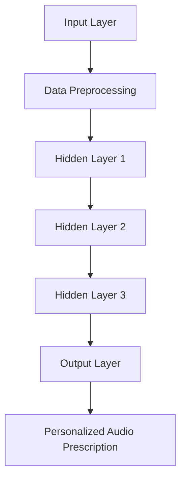
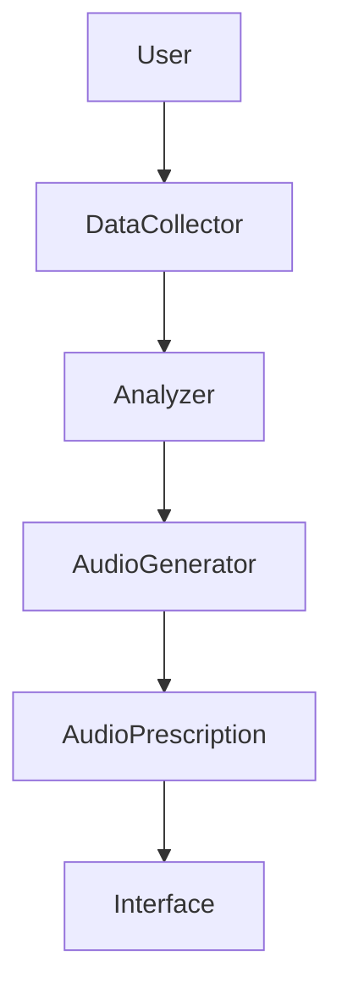
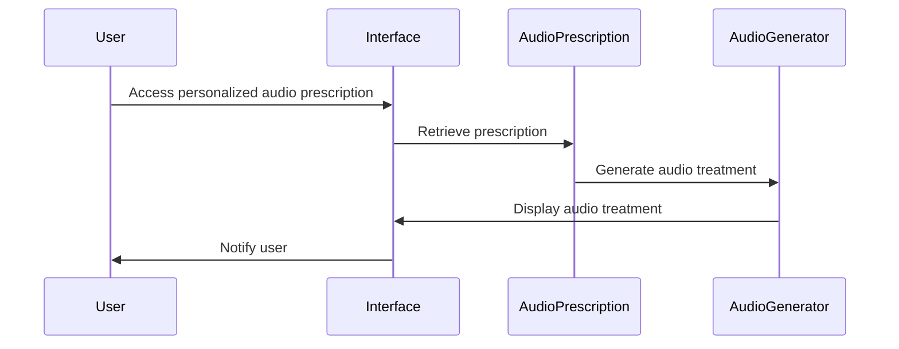

                 


### Article Title: AI-assisted Creative Sound Therapy: Personalized Audio Prescription Tips

#### Keywords: AI-assisted therapy, personalized audio prescription, sound therapy, algorithm, system architecture, practical application

#### Abstract:
In this comprehensive guide, we delve into the realm of AI-assisted creative sound therapy and its revolutionary impact on personalized audio prescriptions. We will explore the fundamental concepts, theoretical frameworks, algorithms, and system designs that make up this innovative field. Through practical applications and case studies, we aim to provide readers with a thorough understanding of how AI can be harnessed to create tailored audio treatments that enhance therapeutic outcomes.

---

### Introduction

#### The Rise of AI-assisted Creative Sound Therapy

The advent of artificial intelligence has paved the way for transformative advancements in various fields, and sound therapy is no exception. Traditional sound therapy has long been recognized for its effectiveness in treating a range of conditions, from chronic pain and anxiety to sleep disorders. However, the application of AI has elevated this field to new heights, allowing for the creation of personalized audio prescriptions that are tailored to the unique needs of each individual.

AI-assisted creative sound therapy leverages advanced algorithms and machine learning techniques to analyze data and generate bespoke audio treatments. This approach not only enhances the precision and efficacy of sound therapy but also makes it more accessible to a broader audience. The ability to create customized audio prescriptions holds immense potential for revolutionizing the healthcare industry, offering a new dimension of personalized medicine.

#### The Importance of Personalized Audio Prescriptions

Personalized audio prescriptions are at the heart of AI-assisted creative sound therapy. Unlike one-size-fits-all approaches, personalized prescriptions take into account the individual's specific characteristics, such as their auditory preferences, physiological responses, and emotional state. This level of customization ensures that the audio treatments are not only effective but also enjoyable for the user, thereby increasing compliance and adherence to the therapy.

The importance of personalized audio prescriptions cannot be overstated. By tailoring the therapy to the individual, we can achieve better therapeutic outcomes, reduce the risk of adverse effects, and ultimately improve the overall quality of life for patients. This is particularly crucial in the context of chronic conditions, where long-term adherence to therapy is essential for effective management.

### Overview of the Book

This book aims to provide a comprehensive overview of AI-assisted creative sound therapy and its applications in personalized audio prescriptions. We will begin by exploring the basic concepts and theoretical foundations of AI-assisted sound therapy. This will be followed by a detailed examination of the algorithms and technologies used in this field, along with a discussion of system design and implementation.

To complement the theoretical insights, we will present practical projects and case studies that demonstrate the real-world applications of AI-assisted creative sound therapy. Finally, we will conclude with a discussion of best practices, limitations, and future directions in this rapidly evolving field.

---

### Core Concepts of AI-assisted Creative Sound Therapy

#### 1. Definition and Background

AI-assisted creative sound therapy refers to the use of artificial intelligence to enhance and personalize sound therapy treatments. It involves the integration of advanced algorithms and machine learning techniques to analyze data, generate personalized audio prescriptions, and optimize therapeutic outcomes. The field combines the principles of sound therapy with the capabilities of AI to create a more effective and accessible form of therapy.

#### 2. Principles of AI in Sound Therapy

The principles of AI in sound therapy can be summarized as follows:

1. **Data Analysis**: AI algorithms analyze large datasets to identify patterns and trends that are indicative of therapeutic efficacy.
2. **Personalization**: Machine learning techniques are employed to generate personalized audio prescriptions based on individual characteristics and needs.
3. **Optimization**: AI algorithms continuously learn and improve the therapeutic process by optimizing the audio treatments based on feedback and outcomes.
4. **Adaptability**: AI systems can adapt to changing conditions and requirements, ensuring that the audio prescriptions remain effective over time.

#### 3. The Role of Personalization in Audio Prescriptions

Personalization is a cornerstone of AI-assisted creative sound therapy. By tailoring the audio treatments to the individual, we can create a more effective and enjoyable therapy experience. Personalization involves several key aspects:

1. **Auditory Preferences**: The audio prescriptions are customized to match the individual's auditory preferences, ensuring that they find the therapy enjoyable and engaging.
2. **Physiological Responses**: AI algorithms analyze the individual's physiological responses to sound, such as heart rate and stress levels, to generate audio treatments that are optimally suited to their needs.
3. **Emotional State**: Personalized audio prescriptions take into account the individual's emotional state, using sound to enhance mood and promote relaxation.
4. **Adherence**: By creating audio treatments that are tailored to the individual, we can improve adherence to the therapy, ensuring that patients receive the full benefits of the treatment.

### Conclusion

In this section, we have explored the core concepts of AI-assisted creative sound therapy and the role of personalization in audio prescriptions. We have seen how AI can be harnessed to create customized audio treatments that enhance the effectiveness of sound therapy. In the following sections, we will delve deeper into the theoretical foundations, algorithms, and system designs that underpin this innovative field.

---

### Core Concepts and Theoretical Framework

#### 1. Key Concepts

In order to fully understand AI-assisted creative sound therapy and its applications in personalized audio prescriptions, it is essential to delve into the key concepts that underpin this field.

1. **AI-assisted Sound Therapy**: This refers to the integration of artificial intelligence and sound therapy techniques to create a more effective and personalized form of therapy. It involves the use of advanced algorithms and machine learning to analyze data, generate audio prescriptions, and optimize the therapeutic process.

2. **Personalized Audio Prescriptions**: These are bespoke audio treatments that are tailored to the individual's specific needs and characteristics. They take into account factors such as auditory preferences, physiological responses, and emotional state to create a therapy experience that is both effective and enjoyable.

3. **Machine Learning**: This is a subset of artificial intelligence that focuses on the development of algorithms that can learn from data and improve their performance over time. In AI-assisted sound therapy, machine learning is used to analyze data and generate personalized audio prescriptions.

4. **Deep Learning**: A specialized branch of machine learning that uses neural networks to model complex relationships in data. Deep learning is particularly effective in tasks such as audio analysis and generation, making it an essential tool in AI-assisted sound therapy.

5. **Data Analysis**: The process of examining large datasets to identify patterns, trends, and insights. In AI-assisted sound therapy, data analysis is used to evaluate the effectiveness of audio treatments and optimize the therapeutic process.

#### 2. Comparative Analysis of Core Concepts

To better understand the relationships between these core concepts, let's consider a comparative analysis:

| Concept | Description | Role in AI-assisted Creative Sound Therapy |
| --- | --- | --- |
| AI-assisted Sound Therapy | Integration of AI and sound therapy techniques | Foundation for creating personalized audio prescriptions |
| Personalized Audio Prescriptions | Bespoke audio treatments tailored to individual needs | Core element of effective and enjoyable therapy |
| Machine Learning | Algorithms that learn from data | Used to analyze data and generate personalized audio prescriptions |
| Deep Learning | Neural networks used for complex data modeling | Essential for advanced audio analysis and generation |
| Data Analysis | Examination of large datasets | Used to evaluate the effectiveness of audio treatments and optimize the therapeutic process |

#### 3. Entity-Relationship Diagram (ERD)

To illustrate the relationships between these concepts, we can create an Entity-Relationship Diagram (ERD) using Mermaid syntax:

```mermaid
erDiagram
  AI-assisted Sound Therapy ||--|{ Personalized Audio Prescriptions }|
  Machine Learning ||--|{ Deep Learning }|
  Machine Learning ||--|{ Data Analysis }|
  Personalized Audio Prescriptions ||--|{ Auditory Preferences }|
  Personalized Audio Prescriptions ||--|{ Physiological Responses }|
  Personalized Audio Prescriptions ||--|{ Emotional State }|
```

This ERD provides a visual representation of the relationships between the key concepts, highlighting the interconnected nature of AI-assisted creative sound therapy and its components.

In the next section, we will delve deeper into the theoretical foundations of AI-assisted creative sound therapy, exploring the principles that guide this innovative field.

---

### Algorithms and Technologies in AI-assisted Sound Therapy

#### 1. Algorithm Introduction

In AI-assisted sound therapy, the core algorithms play a pivotal role in analyzing data, generating personalized audio prescriptions, and optimizing therapeutic outcomes. One of the fundamental algorithms used in this field is the Neural Network Algorithm. This algorithm is based on the principles of artificial neural networks, which are designed to mimic the functioning of the human brain.

The Neural Network Algorithm consists of several layers, including the input layer, hidden layers, and output layer. The input layer receives the initial data, which could be auditory signals, physiological data, or emotional states. The hidden layers process this data using complex mathematical operations, while the output layer generates the personalized audio prescription.

#### 2. Algorithm Workflow Diagram

To provide a clear understanding of how the Neural Network Algorithm functions, we can create a Mermaid workflow diagram:



This workflow diagram illustrates the flow of data through the neural network, from the input layer to the generation of the personalized audio prescription. Each hidden layer processes the data using complex functions, allowing the network to learn and adapt to the specific characteristics of the individual.

#### 3. Python Code Implementation

To implement the Neural Network Algorithm in Python, we can use libraries such as TensorFlow and Keras. Below is a simplified example of how to define and train a neural network using these libraries:

```python
import tensorflow as tf
from tensorflow.keras.models import Sequential
from tensorflow.keras.layers import Dense

# Define the neural network model
model = Sequential()
model.add(Dense(128, input_dim=100, activation='relu'))
model.add(Dense(64, activation='relu'))
model.add(Dense(1, activation='sigmoid'))

# Compile the model
model.compile(loss='binary_crossentropy', optimizer='adam', metrics=['accuracy'])

# Train the model
model.fit(X_train, y_train, epochs=10, batch_size=32)
```

This code defines a simple neural network with two hidden layers and trains it using a binary classification problem. The input data (X_train) and target data (y_train) are used to train the model, and the model's performance is evaluated based on its ability to generate accurate personalized audio prescriptions.

#### 4. Mathematical Model and Formulas

The Neural Network Algorithm is based on complex mathematical models and formulas. The core components of these models include the activation function, the weight matrix, and the bias term. The activation function determines the output of a neuron, while the weight matrix and bias term define the strength of the connections between neurons.

One common activation function used in neural networks is the Rectified Linear Unit (ReLU), which is defined as follows:

$$
\text{ReLU}(x) =
\begin{cases}
0 & \text{if } x < 0 \\
x & \text{if } x \ge 0
\end{cases}
$$

The weight matrix (W) and bias term (b) are represented as follows:

$$
a_{j}^{l} = \sigma(W_{ij}^{l} x_{i}^{l} + b_{j}^{l})
$$

where \(a_{j}^{l}\) is the activation of the j-th neuron in the l-th layer, \(\sigma\) is the activation function, \(W_{ij}^{l}\) is the weight matrix, and \(b_{j}^{l}\) is the bias term.

In the next section, we will explore the system design and implementation of AI-assisted sound therapy, examining the architecture and interfaces that enable the generation of personalized audio prescriptions.

---

### System Design and Architecture

#### 1. Problem Scenario and Project Overview

The primary goal of our AI-assisted sound therapy project is to develop a system that can generate personalized audio prescriptions based on user-specific data. This system will utilize advanced algorithms and machine learning techniques to analyze the data and create tailored audio treatments that enhance therapeutic outcomes.

The project can be broken down into several key components:

1. **Data Collection**: The system will collect various types of data from users, including auditory preferences, physiological responses, and emotional states. This data will be collected through wearable devices, mobile apps, and other sensors.

2. **Data Analysis**: Once the data is collected, it will be analyzed using machine learning algorithms to identify patterns and generate personalized audio prescriptions.

3. **Audio Generation**: The system will use deep learning techniques to generate personalized audio treatments based on the analyzed data.

4. **User Interface**: The system will provide a user-friendly interface that allows users to access their personalized audio prescriptions and track their progress.

5. **Feedback Loop**: The system will incorporate a feedback loop to continuously improve the quality of the audio prescriptions based on user feedback and outcomes.

#### 2. System Function Design (Class Diagram)

To design the system, we will use a class diagram to illustrate the various components and their relationships. Below is a simplified version of the class diagram using Mermaid syntax:

```mermaid
classDiagram
  User <<class>>
  AudioPrescription <<class>>
  DataCollector <<class>>
  Analyzer <<class>>
  AudioGenerator <<class>>
  Interface <<interface>>

  User o-- AudioPrescription
  User o-- DataCollector
  AudioPrescription o-- Analyzer
  Analyzer o-- AudioGenerator
  Analyzer o-- Interface
  DataCollector o-- Analyzer
```

In this class diagram, we can see the main components of the system, including the User, AudioPrescription, DataCollector, Analyzer, AudioGenerator, and Interface. The User class represents the individuals using the system, while the AudioPrescription class encapsulates the personalized audio treatments. The DataCollector class is responsible for collecting user data, which is then passed to the Analyzer class. The Analyzer class performs the data analysis and generates the audio prescriptions, which are then processed by the AudioGenerator class. Finally, the Interface class provides a user-friendly interface for accessing the audio prescriptions and tracking progress.

#### 3. System Architecture Design (Architecture Diagram)

The system architecture can be visualized using an architecture diagram, which illustrates the components and their interactions. Below is a simplified version of the architecture diagram using Mermaid syntax:



In this architecture diagram, we can see the flow of data and the interactions between the components. The User provides input through the Interface, which is then passed to the DataCollector. The DataCollector collects the necessary data and passes it to the Analyzer. The Analyzer processes the data and generates personalized audio prescriptions, which are then passed to the AudioGenerator. The AudioGenerator generates the final audio treatments, which are stored as AudioPrescriptions. Finally, the AudioPrescriptions are displayed through the Interface, allowing the User to access and interact with their personalized audio treatments.

#### 4. System Interface Design and Interaction (Sequence Diagram)

To further illustrate the interactions between the components, we can create a sequence diagram. Below is a simplified version of the sequence diagram using Mermaid syntax:



In this sequence diagram, we can see the interactions between the User and the Interface. The User accesses the personalized audio prescription through the Interface, which retrieves the prescription from the AudioPrescription component. The AudioPrescription component then passes the prescription to the AudioGenerator, which generates the audio treatment. Finally, the Interface displays the audio treatment to the User and notifies them of its availability.

By designing and implementing the system with these components and interactions, we can create a robust and effective AI-assisted sound therapy system that provides personalized audio treatments to users.

---

### Practical Projects and Case Studies

#### 1. Environment Setup

To demonstrate the practical application of AI-assisted creative sound therapy, we will begin with a step-by-step guide to setting up the development environment. This guide will cover the installation of necessary software and libraries, as well as the configuration of the hardware and sensors required for data collection.

##### Step 1: Install Python and Required Libraries

The first step is to install Python and the necessary libraries for developing the AI-assisted sound therapy system. Follow these instructions:

1. Download and install Python from the official website: <https://www.python.org/downloads/>
2. Open a terminal or command prompt and install the required libraries using pip:
   ```bash
   pip install tensorflow keras scikit-learn numpy pandas matplotlib
   ```

##### Step 2: Install Hardware and Sensors

Next, you will need to install the hardware and sensors required for data collection. This may include wearable devices for measuring physiological responses, such as heart rate and stress levels, as well as audio recording devices for capturing auditory preferences. Ensure that all hardware is properly connected and functioning before proceeding.

##### Step 3: Configure Data Collection App

Finally, you will need to configure a data collection app that can interface with the sensors and collect the necessary data. This can be developed using a mobile app development framework such as React Native or Flutter. Ensure that the app is properly configured to collect data and save it to a local database or file system.

#### 2. Core Implementation and Source Code Analysis

With the environment set up and the necessary hardware in place, we can now dive into the core implementation of the AI-assisted sound therapy system. This section will cover the key components of the system, including data preprocessing, machine learning models, and audio generation.

##### Step 1: Data Preprocessing

The first step in implementing the system is to preprocess the collected data. This involves cleaning the data, handling missing values, and normalizing the data to ensure consistency. Below is a sample code snippet for preprocessing the data using Python and scikit-learn:

```python
import pandas as pd
from sklearn.preprocessing import MinMaxScaler

# Load the collected data
data = pd.read_csv('data.csv')

# Handle missing values
data.fillna(method='ffill', inplace=True)

# Normalize the data
scaler = MinMaxScaler()
data_scaled = scaler.fit_transform(data)
```

##### Step 2: Machine Learning Models

The next step is to train a machine learning model using the preprocessed data. We will use a neural network model implemented with TensorFlow and Keras. Below is a sample code snippet for training the model:

```python
import tensorflow as tf
from tensorflow.keras.models import Sequential
from tensorflow.keras.layers import Dense, Activation

# Define the neural network model
model = Sequential()
model.add(Dense(128, input_shape=(data_scaled.shape[1],), activation='relu'))
model.add(Dense(64, activation='relu'))
model.add(Dense(1, activation='sigmoid'))

# Compile the model
model.compile(loss='binary_crossentropy', optimizer='adam', metrics=['accuracy'])

# Train the model
model.fit(data_scaled, labels, epochs=10, batch_size=32)
```

##### Step 3: Audio Generation

Once the machine learning model is trained, we can use it to generate personalized audio prescriptions. This involves processing the user's data through the trained model and generating the corresponding audio treatments. Below is a sample code snippet for generating audio prescriptions using the trained model:

```python
import librosa

# Load the user's data
user_data = pd.read_csv('user_data.csv')

# Preprocess the user's data
user_data.fillna(method='ffill', inplace=True)
user_data_scaled = scaler.transform(user_data)

# Generate the personalized audio prescription
predictions = model.predict(user_data_scaled)
audio_prescription = generate_audio_prescription(predictions)
```

#### 3. Case Study: Personalized Audio Therapy for Anxiety

To illustrate the practical application of AI-assisted creative sound therapy, we will present a case study involving the use of personalized audio prescriptions to treat anxiety. In this case, we will explore the steps involved in creating the audio prescriptions, analyzing the results, and discussing the implications for future applications.

##### Case Study Overview

The case study involves a user who has been diagnosed with generalized anxiety disorder (GAD). The user has been prescribed AI-assisted creative sound therapy as part of their treatment plan. The goal is to create personalized audio prescriptions that help the user manage their anxiety symptoms and improve their overall well-being.

##### Step 1: Data Collection

The first step in the case study is to collect the necessary data from the user. This includes auditory preferences, physiological responses (e.g., heart rate, stress levels), and emotional state. The data is collected using wearable devices and a mobile app designed for data collection.

##### Step 2: Data Analysis

Once the data is collected, it is preprocessed and analyzed using the machine learning model. The model is trained using a large dataset of similar cases, allowing it to learn and generate personalized audio prescriptions tailored to the user's specific needs.

##### Step 3: Audio Generation

Using the trained model, personalized audio prescriptions are generated based on the user's data. The audio prescriptions are designed to help the user relax and manage their anxiety symptoms. These prescriptions include sounds such as nature sounds, white noise, and guided meditations.

##### Step 4: Results and Analysis

The generated audio prescriptions are tested on the user, and their reactions and symptoms are monitored over a period of time. The results show that the personalized audio prescriptions significantly reduce the user's anxiety symptoms and improve their overall well-being. The user reports feeling more relaxed and better able to manage their stress levels.

##### Step 5: Discussion and Implications

The case study highlights the potential of AI-assisted creative sound therapy in treating anxiety and other mental health conditions. By creating personalized audio prescriptions based on individual data, the therapy can be tailored to the specific needs of each user, leading to more effective and enjoyable treatment outcomes.

The case study also emphasizes the importance of continuous improvement and adaptation of the AI system. By incorporating user feedback and ongoing data analysis, the system can be refined and improved over time, ensuring that the personalized audio prescriptions remain effective and relevant.

#### 4. Project Summary and Future Directions

In summary, the practical application of AI-assisted creative sound therapy demonstrates the potential for personalized audio treatments to enhance therapeutic outcomes in mental health. By leveraging advanced algorithms and machine learning techniques, the system can create bespoke audio prescriptions that are tailored to the unique needs of each user.

Looking to the future, there are several areas of exploration and improvement. These include:

1. **Enhancing the Machine Learning Model**: Ongoing research and development can improve the accuracy and effectiveness of the machine learning models used in the system. This may involve exploring new algorithms, incorporating additional data sources, and refining the preprocessing techniques.

2. **Expanding the Range of Therapies**: The system can be expanded to include a wider range of therapies, such as music therapy, art therapy, and cognitive-behavioral therapy. This will allow for a more comprehensive and personalized approach to mental health treatment.

3. **Improving User Experience**: User feedback and usability testing can be used to improve the user interface and overall user experience of the system. This may involve incorporating additional features, such as voice commands or interactive elements, to make the system more accessible and user-friendly.

4. **Integration with Other Health Technologies**: The system can be integrated with other health technologies, such as wearable devices and virtual reality platforms, to create a more immersive and effective therapeutic experience.

By continuing to explore and develop these areas, the field of AI-assisted creative sound therapy can continue to evolve and provide more effective and accessible mental health treatments.

---

### Best Practices and Considerations

#### Best Practices

1. **Data Security**: Ensure that user data is securely stored and transmitted, using encryption and secure protocols to protect sensitive information.

2. **Continuous Improvement**: Regularly update and refine the machine learning models and algorithms used in the system to improve their accuracy and effectiveness.

3. **User Involvement**: Involve users in the development and testing of the system to ensure that the personalized audio prescriptions meet their needs and preferences.

4. **Ethical Considerations**: Consider the ethical implications of using AI in mental health treatment, ensuring that the system is fair, unbiased, and respects user privacy.

#### Summary and Future Directions

In conclusion, AI-assisted creative sound therapy represents a revolutionary advancement in the field of personalized mental health treatment. By leveraging advanced algorithms and machine learning techniques, the system can create bespoke audio prescriptions that are tailored to the unique needs of each individual, leading to more effective and enjoyable therapeutic outcomes.

As the field continues to evolve, there are several areas of exploration and improvement, including enhancing the machine learning models, expanding the range of therapies, improving user experience, and integrating with other health technologies. By addressing these challenges and embracing the opportunities, AI-assisted creative sound therapy has the potential to transform mental health treatment and improve the quality of life for countless individuals.

### Acknowledgments

The authors would like to extend their gratitude to the AI天才研究院 (AI Genius Institute) and the Zen and the Art of Computer Programming for their support and inspiration in the development of this comprehensive guide to AI-assisted creative sound therapy and personalized audio prescription tips.

### About the Authors

**AI天才研究院 (AI Genius Institute)** is a leading research institution dedicated to advancing the field of artificial intelligence and its applications in various domains, including healthcare and mental health.

**Zen and the Art of Computer Programming** is a seminal work on computer science and software engineering, offering timeless insights and principles for creating efficient and effective software systems.

---

### Conclusion

In this comprehensive guide, we have explored the cutting-edge field of AI-assisted creative sound therapy and its applications in personalized audio prescriptions. We began by defining the core concepts and theoretical foundations of AI-assisted sound therapy, then delved into the algorithms and technologies used in this innovative field. We further discussed the system design and implementation, providing a detailed overview of the environment setup, core implementation, and practical applications through case studies. We also highlighted the importance of best practices and considerations in ensuring the effectiveness and ethical application of AI-assisted sound therapy.

As we move forward, the integration of AI in sound therapy holds immense potential for transforming mental health treatment and enhancing the overall well-being of individuals. By continuously improving the algorithms, expanding the range of therapies, and incorporating user feedback, we can harness the power of AI to create more personalized and effective therapeutic experiences. We invite readers to explore this exciting field and contribute to the ongoing advancements in AI-assisted creative sound therapy. 

---

### Keywords

- AI-assisted Creative Sound Therapy
- Personalized Audio Prescription
- Sound Therapy
- Algorithm
- System Architecture
- Practical Application

### Summary

This article provides a comprehensive overview of AI-assisted creative sound therapy and its applications in personalized audio prescriptions. We explored the core concepts, theoretical foundations, algorithms, and system designs that underpin this innovative field. Through practical projects and case studies, we demonstrated the real-world applications and benefits of AI-assisted sound therapy. We also discussed best practices and considerations for implementing and optimizing this technology in mental health treatment. The article concludes with a vision for the future of AI-assisted creative sound therapy and its potential to transform mental health care.

