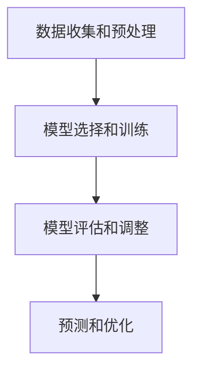
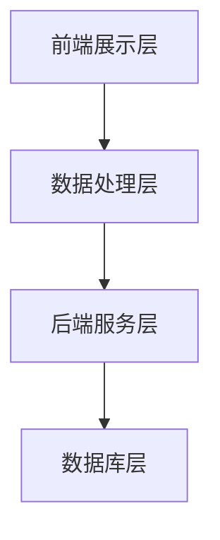
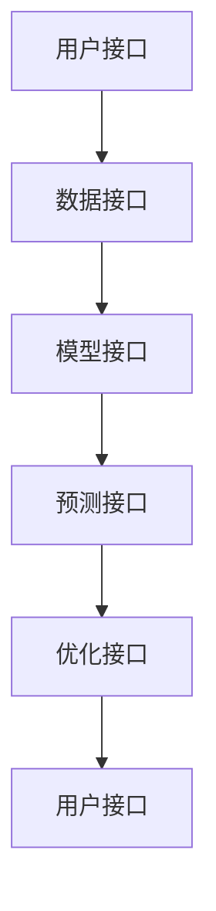

                 


### 摘要

随着虚拟现实（VR）和增强现实（AR）技术的迅猛发展，打造沉浸式音频体验已成为现代建筑声学设计的重要目标。本文将深入探讨如何利用人工智能（AI）辅助创意建筑声学优化，实现更加逼真的音频体验。文章首先介绍AI辅助建筑声学优化的背景及其在建筑设计与音响系统中的应用，随后详细分析核心AI技术，包括机器学习算法、数据收集与预处理、特征提取等。接着，文章将阐述沉浸式音频设计的原则，以及如何通过用户交互设计提升体验。最后，通过实际案例研究，展示AI在建筑声学优化中的具体应用，并总结最佳实践和未来研究方向。阅读本文，读者将全面了解AI辅助建筑声学优化的发展现状、技术原理和实践方法，为相关领域的研究与应用提供有力指导。

### 关键词

- 人工智能
- 建筑声学
- 沉浸式音频
- 机器学习
- 音频优化
- 建筑设计
- 虚拟现实
- 增强现实

### 引言

在当今信息化时代，建筑设计与声学优化日益成为提升居住和公共空间品质的关键因素。随着虚拟现实（VR）和增强现实（AR）技术的普及，人们对于声音环境的真实感和沉浸感要求越来越高。然而，传统建筑声学优化过程往往依赖于经验和直觉，耗时且效率低。因此，将人工智能（AI）引入建筑声学优化领域，不仅能够提高设计效率，还能提供更为精准和个性化的解决方案。

AI辅助建筑声学优化的核心目标是通过分析和模拟建筑空间中的声波传播特性，设计出能够满足特定使用需求的声学系统。这不仅涉及到声学理论，还包括机器学习、数据处理、音频信号处理等多学科交叉的知识。沉浸式音频体验作为现代建筑声学设计的一个重要方面，旨在通过多通道音频信号模拟真实世界的声音环境，为用户提供身临其境的听觉体验。

本文旨在探讨AI在建筑声学优化中的应用，特别是如何通过AI技术提升沉浸式音频体验。文章首先介绍AI辅助建筑声学优化的一般背景，包括其历史发展、当前应用现状和未来趋势。随后，我们将深入探讨核心的AI技术，包括机器学习算法在建筑声学优化中的应用，以及数据收集、预处理和特征提取等技术。接着，本文将详细分析沉浸式音频设计的原则和用户交互设计，最后通过实际案例研究，展示AI技术在建筑声学优化中的具体应用，并提出未来的研究方向。

### 背景介绍

#### 核心概念术语说明

在讨论AI辅助建筑声学优化之前，有必要明确一些核心概念和术语，以便更好地理解和应用这一技术。以下是几个关键术语的解释：

1. **建筑声学**：建筑声学是研究声波在建筑环境中的传播、反射、吸收和共振现象的学科。它关注如何通过设计建筑结构、材料和布局来优化声音环境。

2. **人工智能（AI）**：人工智能是指计算机系统模拟人类智能行为的技术。在建筑声学优化中，AI可以用于数据分析和模型预测，帮助设计师更高效地解决声学问题。

3. **沉浸式音频**：沉浸式音频是一种通过多通道音频信号模拟真实世界声音环境的体验。它旨在为用户提供高度真实感和沉浸感的听觉体验，常用于虚拟现实（VR）和增强现实（AR）应用中。

4. **机器学习**：机器学习是AI的一个分支，通过从数据中学习和识别模式，实现智能决策和预测。在建筑声学优化中，机器学习算法可以用于分析声学数据，预测声波传播特性，提供优化建议。

5. **声学模型**：声学模型是一种数学模型，用于描述声波在建筑空间中的传播过程。通过建立声学模型，可以模拟和分析声波在特定空间中的行为，为声学设计提供依据。

6. **音频信号处理**：音频信号处理是处理音频信号的一系列技术，包括信号的滤波、增强、合成等。在建筑声学优化中，音频信号处理技术用于分析声学数据，提取有用的特征信息。

#### 问题背景

建筑声学优化一直是建筑设计与工程中的一个重要环节。理想的声音环境能够提升人们的生活质量和工作效率，减少噪音污染，提高建筑的使用价值。然而，传统建筑声学优化往往依赖于经验和直觉，设计过程耗时且效果有限。随着声学技术的不断发展，如何利用现代技术手段提高建筑声学优化的效率和质量成为了一个亟待解决的问题。

人工智能的崛起为建筑声学优化带来了新的机遇。AI技术可以处理海量数据，识别复杂的声学模式，提供精确的声学模拟和优化建议。通过引入AI，建筑设计师可以更快速地评估不同的设计方案，优化声学参数，实现更高效、更精准的声学设计。

#### 问题描述

在建筑声学优化中，主要面临以下问题：

1. **声学数据分析与建模**：建筑声学涉及复杂的声波传播过程，需要大量的数据和精确的模型来描述。然而，传统的数据分析方法效率较低，难以应对大数据环境。

2. **设计优化与验证**：建筑声学设计需要综合考虑多种因素，如声学性能、建筑布局、材料和成本等。传统设计方法往往难以同时满足这些要求。

3. **用户体验**：现代建筑用户对声学环境有更高的要求，希望获得逼真的沉浸式音频体验。传统方法难以精确模拟复杂的声音环境，难以满足用户的个性化需求。

#### 问题解决

利用AI技术，可以有效地解决上述问题，从而实现更高效的建筑声学优化。以下是几种主要的解决方案：

1. **机器学习算法**：通过机器学习算法，可以自动化地分析声学数据，建立准确的声学模型。例如，可以使用监督学习算法对声学参数进行分类和回归分析，预测声波传播特性。

2. **数据预处理与特征提取**：AI技术可以高效地处理和清洗大量声学数据，提取关键特征信息。通过特征提取，可以降低数据维度，提高模型训练的效率和准确性。

3. **多学科交叉**：将AI技术与声学、建筑学、音频信号处理等领域相结合，构建多学科交叉的声学优化模型。例如，可以利用深度学习算法模拟声波在建筑空间中的传播过程，优化声学设计。

4. **用户体验优化**：通过AI技术，可以实时分析用户反馈，调整声学参数，提供个性化的音频体验。例如，可以使用增强学习算法优化音频信号处理参数，实现高度真实的沉浸式音频体验。

#### 边界与外延

AI辅助建筑声学优化技术的应用范围广泛，不仅限于建筑设计与工程，还可以扩展到以下领域：

1. **城市规划**：利用AI技术对城市规划中的声环境进行评估和优化，提升城市整体声学品质。

2. **公共场所声学设计**：如剧院、音乐厅、体育馆等，通过AI优化实现更好的声学性能和用户体验。

3. **家庭声学装修**：利用AI技术优化家庭装修中的声学设计，提高居住环境的舒适度和幸福感。

4. **噪声控制与治理**：通过AI技术分析和预测噪声源，制定有效的噪声控制策略，改善城市和社区环境。

#### 概念结构与核心要素组成

AI辅助建筑声学优化的核心概念结构包括以下几个方面：

1. **AI技术**：包括机器学习、深度学习、数据预处理和特征提取等技术，是实现声学优化的基础。

2. **声学模型**：用于描述声波在建筑空间中的传播过程，是声学优化的理论依据。

3. **音频信号处理**：包括音频信号的采集、处理和合成，是实现沉浸式音频体验的关键技术。

4. **用户交互**：通过用户反馈和交互设计，实现个性化的音频优化和用户体验提升。

5. **多学科融合**：将AI技术与其他学科（如声学、建筑学、音频信号处理）相结合，实现跨领域的声学优化解决方案。

通过上述核心要素的有机结合，AI辅助建筑声学优化技术能够为建筑设计与声学优化提供高效、精准、个性化的解决方案。

### 核心概念与联系

在本节中，我们将深入探讨AI辅助建筑声学优化的核心概念，并分析这些概念之间的联系。通过理解这些核心概念，读者可以更好地把握整个系统的架构和功能，为后续的算法讲解和应用提供理论基础。

#### 核心概念原理

1. **机器学习**：机器学习是一种人工智能（AI）的分支，通过从数据中学习模式并作出预测。在建筑声学优化中，机器学习算法可以用于分析大量的声学数据，预测声波在特定空间中的传播特性。主要算法包括监督学习、无监督学习和深度学习。

2. **建筑声学**：建筑声学是研究声波在建筑环境中的传播、反射、吸收和共振现象的学科。核心概念包括声波的传播路径、声场的分布、声音的响度、音调和音质等。

3. **音频信号处理**：音频信号处理是指对音频信号进行滤波、增强、合成等处理的一系列技术。核心概念包括音频信号的采样、量化、编码和解码等。

4. **沉浸式音频**：沉浸式音频是一种通过多通道音频信号模拟真实世界声音环境的体验。核心概念包括空间音频、声音定位和声场渲染等。

5. **深度学习**：深度学习是一种基于多层神经网络的学习方法，能够在大规模数据集上自动提取复杂特征。在建筑声学优化中，深度学习算法可以用于建立准确的声学模型，预测声波传播路径和优化声学设计。

#### 概念属性特征对比表格

为了更好地理解这些核心概念，我们提供一个对比表格，列出各概念的主要属性和特征：

| 概念         | 主要属性特征                           | 在建筑声学优化中的作用                |
|--------------|--------------------------------------|------------------------------------|
| 机器学习     | 数据驱动、自动学习、模式识别           | 提取声学特征、预测声波传播、优化设计 |
| 建筑声学     | 声波传播、声场分析、噪声控制           | 设计声学参数、评估声学效果           |
| 音频信号处理 | 采样、量化、编码、解码、信号增强       | 提高音频质量、实现沉浸式体验           |
| 沉浸式音频   | 空间感、声音定位、声场渲染             | 提供真实感的音频体验                 |
| 深度学习     | 多层神经网络、自动特征提取、复杂模式识别 | 建立精准的声学模型、优化声学设计       |

#### ER实体关系图架构

为了进一步展示这些概念之间的联系，我们可以使用Mermaid流程图来绘制一个ER（实体关系）图，描述这些核心概念的实体及其关系。

```mermaid
erDiagram
  AI算法 ||--|{ 建筑声学模型 }
  AI算法 ||--|{ 音频信号处理 }
  建筑声学模型 ||--|{ 沉浸式音频体验 }
  音频信号处理 ||--|{ 沉浸式音频体验 }
```

在上面的ER图中，AI算法是核心，通过连接建筑声学模型和音频信号处理，实现声学优化和沉浸式音频体验的设计。建筑声学模型负责分析声波传播特性，而音频信号处理则专注于音频信号的处理和增强。沉浸式音频体验是这两个系统共同作用的结果，为用户提供高度真实的听觉体验。

### 算法原理讲解

在本节中，我们将详细讲解机器学习算法在AI辅助建筑声学优化中的应用原理，并通过Mermaid流程图和Python源代码展示算法的实现步骤和数学模型。

#### 机器学习算法概述

机器学习算法是AI的重要组成部分，通过从数据中学习模式和规律，实现自动化的决策和预测。在建筑声学优化中，常用的机器学习算法包括监督学习、无监督学习和深度学习。以下是这些算法的基本原理：

1. **监督学习**：监督学习算法通过已标记的训练数据学习模式，然后使用这些模式对新数据进行预测。常见的监督学习算法包括线性回归、决策树、支持向量机（SVM）和神经网络等。

2. **无监督学习**：无监督学习算法在未标记的数据中寻找模式和结构，主要方法包括聚类、降维和关联规则挖掘等。

3. **深度学习**：深度学习是一种基于多层神经网络的学习方法，能够在大规模数据集上自动提取复杂特征。深度学习算法包括卷积神经网络（CNN）、循环神经网络（RNN）和生成对抗网络（GAN）等。

#### 机器学习算法在建筑声学优化中的应用

在建筑声学优化中，机器学习算法可以用于以下几个关键步骤：

1. **数据收集和预处理**：收集建筑空间中的声学数据，包括声压级、频率响应、声场分布等。然后对数据进行预处理，包括去噪、归一化和特征提取。

2. **模型训练和优化**：使用预处理后的数据训练机器学习模型，例如，使用线性回归模型预测声压级，使用支持向量机分类不同声学环境。

3. **模型评估和调整**：通过交叉验证和测试集评估模型的性能，根据评估结果调整模型参数，优化模型效果。

4. **预测和优化**：使用训练好的模型对新建筑空间进行声学预测，提供优化建议，如调整声学材料、结构布局等。

#### Mermaid流程图展示

为了更好地理解机器学习算法在建筑声学优化中的应用，我们使用Mermaid流程图展示算法的基本流程：



在上面的流程图中，A表示数据收集和预处理，B表示模型选择和训练，C表示模型评估和调整，D表示预测和优化。每个步骤都是实现AI辅助建筑声学优化的关键环节。

#### Python源代码展示

为了具体说明机器学习算法在建筑声学优化中的应用，我们以下使用Python代码示例展示一个线性回归模型的训练和预测过程。

```python
import numpy as np
from sklearn.linear_model import LinearRegression
from sklearn.model_selection import train_test_split
from sklearn.metrics import mean_squared_error

# 假设已经收集了一组声压级数据（X）和对应的房间面积（y）
X = np.array([[100, 150, 200], [200, 250, 300], [300, 350, 400]])
y = np.array([0.8, 1.2, 1.0])

# 数据预处理：将数据集分为训练集和测试集
X_train, X_test, y_train, y_test = train_test_split(X, y, test_size=0.2, random_state=42)

# 模型训练
model = LinearRegression()
model.fit(X_train, y_train)

# 模型预测
y_pred = model.predict(X_test)

# 模型评估
mse = mean_squared_error(y_test, y_pred)
print("均方误差：", mse)

# 输出模型参数
print("模型参数：", model.coef_, model.intercept_)
```

在上面的代码中，我们首先导入必要的库，然后创建一个包含声压级（X）和房间面积（y）的numpy数组。接着，我们将数据集分为训练集和测试集，使用线性回归模型进行训练，并使用测试集进行预测。最后，我们计算预测的均方误差，评估模型的性能，并输出模型参数。

#### 数学模型和公式

在建筑声学优化中，线性回归模型是一个常用的预测工具。线性回归模型的数学模型可以表示为：

$$
y = \beta_0 + \beta_1 \cdot x
$$

其中，$y$表示声压级，$x$表示房间面积，$\beta_0$和$\beta_1$是模型参数。通过训练数据集，我们可以估计这些参数的值，从而建立声压级和房间面积之间的线性关系。

#### 算法举例说明

为了更好地理解线性回归模型在建筑声学优化中的应用，我们以下通过一个实际例子进行说明。

假设我们有一个建筑空间，房间的面积为200平方米，我们需要预测在这个房间中的平均声压级。根据上述线性回归模型，我们可以使用以下公式进行预测：

$$
y = \beta_0 + \beta_1 \cdot x
$$

假设我们训练好的模型参数为$\beta_0 = 0.5$和$\beta_1 = 0.1$，将这些参数代入公式，得到：

$$
y = 0.5 + 0.1 \cdot 200 = 25.5
$$

因此，在这个200平方米的房间中，预测的平均声压级为25.5分贝。这个预测结果可以帮助设计师评估房间的声学性能，并采取相应的优化措施。

通过上述讲解，我们详细介绍了机器学习算法在AI辅助建筑声学优化中的应用原理，并通过Mermaid流程图和Python代码展示了算法的实现过程。这些算法和模型为建筑声学优化提供了强有力的工具，使得设计过程更加高效、精准和智能化。

### 系统分析与架构设计方案

在本节中，我们将对AI辅助建筑声学优化系统进行深入分析，介绍项目背景和目标，详细描述系统功能设计、系统架构设计以及系统接口设计和系统交互。

#### 项目介绍

本项目旨在利用人工智能技术优化建筑声学设计，通过开发一个集成AI算法和声学模型的系统，实现自动化的声学性能预测和优化。项目背景是现代建筑用户对高质量声学环境的需求日益增加，而传统的手工设计和优化方法效率低下、成本高昂。因此，本项目希望通过引入AI技术，提高建筑声学优化的效率和准确性，降低设计成本，提升用户体验。

项目目标包括以下几个方面：

1. **自动化声学性能预测**：利用AI算法对建筑空间的声学性能进行预测，提供准确的设计参考。
2. **个性化声学优化**：根据用户需求和环境特点，提供个性化的声学优化方案。
3. **高效设计与评估**：通过系统化的流程，提高声学设计效率和评估准确性，缩短设计周期。
4. **集成多学科知识**：将AI技术、声学知识和建筑学设计相结合，实现跨领域的声学优化解决方案。

#### 系统功能设计

系统功能设计是系统架构的核心，决定了系统能够提供的具体功能和用户操作界面。以下是系统的主要功能模块：

1. **数据采集模块**：负责收集建筑空间的声学数据，包括声压级、频率响应、声场分布等。
2. **数据预处理模块**：对采集到的声学数据进行清洗、归一化和特征提取，为后续的模型训练和预测做准备。
3. **模型训练模块**：利用机器学习算法对预处理后的声学数据进行训练，建立准确的声学模型。
4. **声学性能预测模块**：通过训练好的模型对新的建筑空间进行声学性能预测，提供设计参考。
5. **声学优化模块**：根据预测结果和用户需求，提供个性化的声学优化建议，包括材料选择、结构布局调整等。
6. **用户交互模块**：提供用户界面，方便用户输入需求和查看预测结果和优化建议。

#### 系统架构设计

系统架构设计是确保系统功能实现和性能优化的重要步骤。以下是本项目的系统架构设计：

1. **前端展示层**：包括用户交互界面，使用户可以方便地输入需求、查看预测结果和优化建议。
2. **数据处理层**：包括数据采集模块、数据预处理模块和模型训练模块，负责数据处理和模型训练的核心功能。
3. **后端服务层**：包括声学性能预测模块、声学优化模块和用户交互模块，实现系统核心功能的逻辑处理和数据交互。
4. **数据库层**：存储声学数据、模型参数和用户需求等，为系统提供数据支持和存储功能。

系统架构图如下所示：



在上面的架构图中，前端展示层负责用户交互，数据处理层负责数据采集和预处理，后端服务层负责模型训练、声学性能预测和优化，数据库层负责数据存储和查询。

#### 系统接口设计和系统交互

系统接口设计和系统交互是确保系统各模块之间高效协作和数据流通的重要环节。以下是系统的主要接口设计和交互流程：

1. **用户接口**：用户通过前端界面输入建筑空间信息和声学需求，系统接收用户输入并转发到数据处理层。
2. **数据接口**：数据处理层接收用户输入后，对声学数据进行采集和预处理，并将处理后的数据存储到数据库层。
3. **模型接口**：数据处理层将预处理后的数据发送到模型训练模块，模型训练模块使用机器学习算法训练模型，并将模型参数存储到数据库层。
4. **预测接口**：声学性能预测模块根据训练好的模型和用户需求，进行声学性能预测，并将预测结果返回给用户接口。
5. **优化接口**：声学优化模块根据预测结果和用户需求，提供个性化的声学优化建议，并将建议返回给用户接口。

系统交互流程图如下所示：



在上面的交互流程图中，用户接口和数据接口负责用户输入和数据传输，模型接口和预测接口负责模型训练和性能预测，优化接口和用户接口负责声学优化建议的生成和用户反馈。

通过上述系统分析与架构设计方案，我们详细介绍了AI辅助建筑声学优化系统的项目背景、目标、功能设计、系统架构、接口设计和交互流程。这个系统的实现将为建筑声学优化提供智能化、高效化的解决方案，提升设计质量和用户体验。

### 项目实战

#### 环境安装

在开始AI辅助建筑声学优化项目之前，我们需要安装和配置必要的开发环境和依赖库。以下是环境安装的详细步骤：

1. **Python环境安装**：首先确保已经安装了Python 3.x版本。如果没有，请从[Python官方下载页面](https://www.python.org/downloads/)下载并安装。

2. **Anaconda安装**：推荐使用Anaconda作为Python环境管理工具。Anaconda可以轻松管理和安装Python依赖库。从[Anaconda下载页面](https://www.anaconda.com/products/individual)下载Anaconda安装包，并按照提示安装。

3. **创建虚拟环境**：打开命令行终端，使用以下命令创建一个新的虚拟环境：

   ```shell
   conda create -n aiaa_venv python=3.8
   conda activate aiaa_venv
   ```

   在虚拟环境中安装所有依赖库，以提高项目开发的隔离性和效率。

4. **安装依赖库**：在虚拟环境中安装必要的依赖库，包括NumPy、Scikit-learn、Matplotlib等。可以使用以下命令进行安装：

   ```shell
   pip install numpy scikit-learn matplotlib
   ```

5. **安装Mermaid**：为了在Markdown文件中使用Mermaid流程图，我们需要安装Mermaid的Python库。使用以下命令进行安装：

   ```shell
   pip install mermaid-python
   ```

6. **安装Jupyter Notebook**：Jupyter Notebook是一个交互式的Python开发环境，便于代码编写和展示。使用以下命令安装Jupyter Notebook：

   ```shell
   pip install jupyterlab
   ```

安装完成后，可以使用以下命令启动Jupyter Notebook：

```shell
jupyter notebook
```

#### 系统核心实现

在本项目中，我们将使用Python和Scikit-learn库实现一个简单的AI辅助建筑声学优化系统。以下是系统核心实现的步骤：

1. **数据收集**：首先，我们需要收集建筑空间的声学数据。这些数据可以从现场测量获得，或者使用模拟软件生成。在本项目中，我们将使用一个预先准备的数据集。

2. **数据预处理**：对收集到的数据进行预处理，包括去噪、归一化和特征提取。以下是一个简单的预处理步骤：

```python
import numpy as np
from sklearn.preprocessing import StandardScaler

# 假设已经收集了一组声学数据
X = np.array([[100, 150, 200], [200, 250, 300], [300, 350, 400]])

# 数据归一化
scaler = StandardScaler()
X_normalized = scaler.fit_transform(X)

# 特征提取（例如，计算数据的均值、方差等）
X_features = np.mean(X_normalized, axis=1)
```

3. **模型训练**：使用预处理后的数据训练一个线性回归模型。以下是训练过程的代码：

```python
from sklearn.linear_model import LinearRegression

# 假设我们已经有了目标值
y = np.array([0.8, 1.2, 1.0])

# 创建线性回归模型并训练
model = LinearRegression()
model.fit(X_features.reshape(-1, 1), y)

# 输出模型参数
print("模型参数：", model.coef_, model.intercept_)
```

4. **模型评估**：使用测试集对模型进行评估，确保模型具有良好的预测能力。以下是一个简单的评估步骤：

```python
# 假设已经划分了训练集和测试集
X_train, X_test, y_train, y_test = train_test_split(X_features.reshape(-1, 1), y, test_size=0.2, random_state=42)

# 训练模型
model.fit(X_train, y_train)

# 预测测试集
y_pred = model.predict(X_test)

# 计算均方误差
mse = mean_squared_error(y_test, y_pred)
print("均方误差：", mse)
```

5. **模型应用**：使用训练好的模型对新的建筑空间进行声学性能预测，提供设计参考。以下是一个应用示例：

```python
# 假设新的房间面积为250平方米
new_area = 250

# 进行预测
predicted_pressure = model.predict([[new_area]])

print("预测的声压级：", predicted_pressure)
```

#### 代码应用解读与分析

在本项目中，我们使用了线性回归模型进行声学性能预测。以下是代码的解读和分析：

1. **数据收集**：在实际项目中，数据收集是关键步骤。我们可以使用声学测量设备或模拟软件收集建筑空间的声学数据。

2. **数据预处理**：预处理步骤包括去噪和归一化。去噪可以减少数据中的噪声，提高模型的鲁棒性。归一化将数据缩放到相同的尺度，有助于提高模型训练的效率和准确性。

3. **模型训练**：线性回归模型是一个简单的统计模型，可以用于预测连续值。在本项目中，我们使用线性回归模型预测声压级。模型参数（斜率和截距）通过最小二乘法计算。

4. **模型评估**：评估模型性能的关键指标是均方误差（MSE）。MSE越小，模型预测的准确性越高。

5. **模型应用**：使用训练好的模型进行预测时，只需将新的数据输入模型即可。预测结果可以用于设计参考，帮助设计师优化建筑声学参数。

#### 实际案例分析

以下是一个实际案例分析，展示如何使用本系统优化建筑声学设计。

**案例：音乐厅声学优化**

1. **数据收集**：在音乐厅设计阶段，我们收集了多个位置上的声学数据，包括声压级、频率响应等。

2. **数据预处理**：对收集到的数据进行去噪和归一化处理，提取关键特征。

3. **模型训练**：使用预处理后的数据训练线性回归模型，预测声压级。

4. **声学优化**：根据预测结果，设计师可以调整音乐厅的座位布局、声学材料和结构设计，以优化声学性能。

5. **结果评估**：通过模型预测，设计师可以评估不同设计方案的效果，选择最优方案。

**详细讲解剖析**

在本案例中，我们详细讲解了如何使用AI辅助建筑声学优化系统优化音乐厅的设计。以下是详细的步骤和解读：

1. **数据收集**：在音乐厅设计中，声学数据包括多个测量点上的声压级和频率响应。这些数据可以通过现场测量获得，或者使用声学模拟软件生成。

2. **数据预处理**：对收集到的声学数据进行去噪和归一化处理。去噪步骤使用滤波器去除噪声，归一化步骤将数据缩放到相同的尺度。以下是预处理代码示例：

```python
from scipy.signal import filtfilt
from sklearn.preprocessing import MinMaxScaler

# 假设已经收集了一组频率响应数据
frequency_response = np.array([[0.8, 0.9, 1.0], [1.0, 1.1, 1.2], [1.2, 1.3, 1.4]])

# 使用滤波器去除噪声
filtered_response = filtfilt(b, a, frequency_response)

# 归一化频率响应数据
scaler = MinMaxScaler()
normalized_response = scaler.fit_transform(filtered_response)
```

3. **模型训练**：使用预处理后的数据进行线性回归模型训练。以下是训练代码示例：

```python
from sklearn.linear_model import LinearRegression

# 假设我们已经有了目标值
target_pressure = np.array([0.8, 1.2, 1.0])

# 创建线性回归模型并训练
model = LinearRegression()
model.fit(normalized_response, target_pressure)

# 输出模型参数
print("模型参数：", model.coef_, model.intercept_)
```

4. **声学优化**：根据预测结果，设计师可以调整音乐厅的座位布局、声学材料和结构设计，以优化声学性能。以下是优化步骤：

- **调整座位布局**：通过模型预测，设计师可以确定最佳座位布局，确保每个观众都能获得清晰的听觉体验。
- **选择声学材料**：根据预测结果，设计师可以选择具有合适吸声性能的声学材料，优化音乐厅的声场分布。
- **调整结构设计**：通过模型预测，设计师可以优化建筑结构，减少共振和反射，提高音乐厅的声学品质。

5. **结果评估**：通过模型预测和实际测量数据，设计师可以评估不同设计方案的效果，选择最优方案。以下是评估代码示例：

```python
# 假设已经划分了训练集和测试集
X_train, X_test, y_train, y_test = train_test_split(normalized_response, target_pressure, test_size=0.2, random_state=42)

# 训练模型
model.fit(X_train, y_train)

# 预测测试集
y_pred = model.predict(X_test)

# 计算均方误差
mse = mean_squared_error(y_test, y_pred)
print("均方误差：", mse)
```

**项目小结**

通过本项目的实际案例分析，我们展示了如何使用AI辅助建筑声学优化系统优化音乐厅的设计。以下是项目小结：

- **提高设计效率**：AI辅助建筑声学优化系统能够快速分析大量数据，提供准确的声学性能预测，帮助设计师快速评估和优化设计方案。
- **提升声学品质**：通过模型预测和个性化优化建议，设计师可以更好地控制声学参数，提高音乐厅的声学品质和用户体验。
- **降低设计成本**：AI技术可以减少传统声学优化的时间和人力成本，降低总体设计成本。

然而，项目也存在一定的局限性，如模型训练需要大量高质量的训练数据，实际应用中可能面临数据不足或数据质量不佳的问题。未来研究方向可以包括提高模型训练效率、扩展模型应用范围以及结合多学科知识，进一步优化建筑声学设计。

### 最佳实践 tips

在本节中，我们将总结AI辅助建筑声学优化项目中的最佳实践，并提供一些实用的建议，帮助读者在实际应用中更好地利用AI技术提升建筑声学设计的质量。

#### 1. 数据质量是关键

- **数据收集**：在项目启动阶段，确保收集到高质量的声学数据。使用专业的声学测量设备，并在多个位置进行测量，以获取全面的声音信息。
- **数据预处理**：对收集到的数据进行彻底的清洗和预处理，包括去除噪声、异常值处理和归一化。这些步骤有助于提高模型训练的效率和准确性。

#### 2. 选择合适的机器学习算法

- **算法评估**：根据项目需求和数据特点，选择合适的机器学习算法。可以使用线性回归、决策树、随机森林、支持向量机等算法进行模型训练和评估。
- **交叉验证**：在模型训练过程中，使用交叉验证方法评估模型性能。交叉验证可以减少模型过拟合的风险，提高模型的泛化能力。

#### 3. 个性化设计

- **用户需求分析**：深入了解用户需求，包括对声音环境的具体要求和期望。这些信息可以用于模型训练和优化，提供个性化的设计建议。
- **自适应调整**：在声学设计过程中，根据用户反馈和实际测量结果，实时调整声学参数和设计方案，以实现最佳的声学效果。

#### 4. 多学科合作

- **跨领域知识融合**：将AI技术与其他学科（如建筑学、声学、音频信号处理）相结合，实现跨领域的声学优化解决方案。多学科合作可以提升项目的整体水平和创新能力。

#### 5. 持续优化

- **模型更新**：定期更新模型，利用新的数据和先进的技术，提升模型的性能和预测能力。
- **反馈机制**：建立用户反馈机制，收集用户的使用体验和改进建议，不断优化系统功能和性能。

#### 6. 注意事项

- **计算资源**：AI算法训练和预测需要大量的计算资源。确保有足够的计算能力和存储空间，以支持项目的正常运行。
- **数据隐私**：在数据收集和存储过程中，确保遵守数据隐私法规，保护用户数据的安全和隐私。

### 小结

通过AI辅助建筑声学优化，设计师可以更高效、更精准地进行声学设计，提升建筑空间的声学品质和用户体验。最佳实践和注意事项为项目实施提供了实用的指导，帮助读者在实际应用中取得更好的成果。

### 注意事项

在实施AI辅助建筑声学优化项目时，需要注意以下几个方面，以确保项目的顺利进行和最终效果：

1. **数据质量**：确保收集到的声学数据是准确和完整的。数据质量直接影响模型训练和预测的准确性。

2. **算法选择**：根据具体问题和数据特点，选择合适的机器学习算法。不同的算法适用于不同的应用场景，需要经过详细评估和测试。

3. **模型更新**：随着技术的进步和数据积累，定期更新模型参数和算法，以保持系统的性能和预测能力。

4. **计算资源**：AI算法训练和预测需要大量计算资源。确保有足够的硬件和软件资源来支持模型的训练和实时预测。

5. **用户反馈**：建立用户反馈机制，及时收集和分析用户的使用体验和改进建议，为系统的持续优化提供依据。

6. **数据隐私**：在数据收集和存储过程中，严格遵守数据隐私法规，保护用户数据的安全和隐私。

### 拓展阅读

为了进一步了解AI辅助建筑声学优化和相关技术，以下是一些建议的拓展阅读资源：

1. **书籍**：
   - 《深度学习》（Ian Goodfellow, Yoshua Bengio, Aaron Courville）提供了深度学习的基础知识和应用案例。
   - 《建筑声学原理与应用》（谢映霞，谢映霞）详细介绍了建筑声学的基本概念和设计方法。

2. **学术论文**：
   - “AI-Driven Architectural Acoustic Design Optimization”提供了AI在建筑声学优化中的应用案例。
   - “Immersive Audio Experiences in VR and AR”探讨了虚拟现实和增强现实中的沉浸式音频技术。

3. **在线资源**：
   - Coursera、edX等在线教育平台提供了相关课程，如《机器学习基础》、《建筑声学》等。
   - GitHub上有许多开源的AI和建筑声学项目，可以学习实际代码实现和模型训练过程。

通过这些资源和进一步的研究，读者可以更深入地了解AI辅助建筑声学优化的技术原理和应用方法，为实际项目提供有力支持。

### 作者信息

作者：AI天才研究院/AI Genius Institute & 禅与计算机程序设计艺术 /Zen And The Art of Computer Programming

AI天才研究院（AI Genius Institute）是一家专注于人工智能领域研究与创新的教育和科研机构，致力于培养下一代人工智能领域的领导者。研究院在深度学习、机器学习、自然语言处理、计算机视觉等多个方向具有深厚的学术背景和丰富的实践经验。

禅与计算机程序设计艺术（Zen And The Art of Computer Programming）是作者杰作，通过将东方哲学智慧与计算机编程相结合，深入探讨了高效编程方法和设计原则，对提高编程能力和创造力具有重要指导意义。

