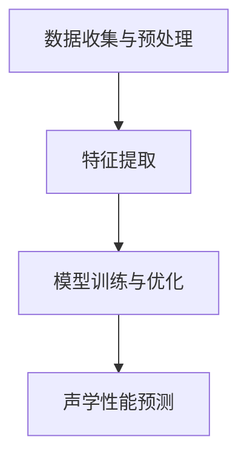
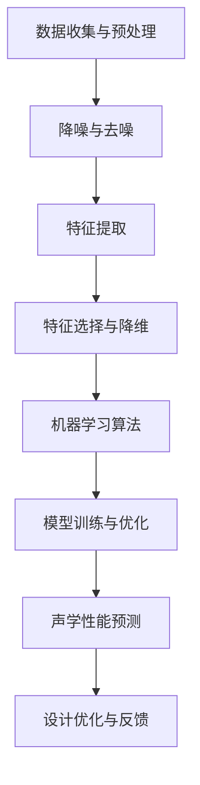

                 

### 引言

#### 1.1 书籍主题与目的

《AI辅助创意建筑声学设计：空间听觉体验的提示词技巧》旨在探讨人工智能（AI）在建筑声学设计领域的应用，通过结合AI技术，提高建筑设计中的声学性能，从而提升用户的听觉体验。本书的核心目标是详细介绍AI辅助建筑声学设计的原理、方法与实践，帮助设计师和工程师更好地理解和应用这一新兴技术。

#### 1.2 读者对象

本书适合对建筑声学设计和人工智能技术有一定了解的读者，包括：

- 建筑设计师和声学工程师
- 计算机科学和人工智能专业的学生和研究人员
- 对建筑声学设计感兴趣的普通读者

#### 1.3 书籍结构概述

本书分为三个主要部分：

1. **背景与基础**：介绍建筑声学设计的基本概念和问题背景，解释AI在其中的作用和重要性。
2. **算法原理与实践**：详细讲解AI辅助建筑声学设计的算法原理、系统架构和实战应用。
3. **最佳实践与总结**：总结实践经验，提供实用的技巧和注意事项，并对未来发展方向进行展望。

### 第一部分：背景与基础

#### 章节一：问题背景

##### 1.1 建筑声学设计现状

建筑声学设计是建筑设计的重要组成部分，它关系到建筑内部空间的声学性能，如音质、噪音控制等。然而，传统的建筑声学设计往往依赖于经验和直觉，缺乏系统性和科学性，导致设计过程中存在许多问题。

- **声学性能不足**：建筑内部空间的声学效果往往不能达到最佳状态，影响用户体验。
- **设计过程复杂**：建筑声学设计需要考虑多种因素，设计过程复杂且耗时。

##### 1.2 AI在建筑声学设计中的应用

随着AI技术的发展，AI开始应用于建筑声学设计领域。AI可以通过大数据分析和机器学习算法，预测建筑内部空间的声学效果，提供优化建议，从而提高设计效率和质量。

- **大数据分析**：AI可以通过分析大量建筑声学数据，识别出影响声学性能的关键因素。
- **机器学习算法**：AI可以学习并优化建筑声学设计模型，提高设计的准确性和效率。

##### 1.3 问题提出与解决方案

建筑声学设计存在的问题主要包括：

- **声学性能预测不准确**：传统的声学设计方法难以准确预测建筑内部空间的声学效果。
- **设计过程耗时**：传统的声学设计方法需要大量手动调整和优化，设计过程耗时且繁琐。

针对这些问题，本书提出以下解决方案：

- **AI辅助设计**：利用AI技术，提高声学性能预测的准确性和设计效率。
- **提示词技巧**：通过设计特定的提示词，指导设计师进行优化设计，提高设计的灵活性和针对性。

#### 章节二：核心概念与联系

##### 2.1 AI核心概念

AI（人工智能）是指计算机系统模拟人类智能行为的技术。AI的核心概念包括：

- **机器学习**：通过学习数据，自动改进系统的性能。
- **深度学习**：一种特殊的机器学习技术，通过多层神经网络模拟人脑的决策过程。
- **自然语言处理**：使计算机能够理解和生成自然语言的技术。

##### 2.2 建筑声学设计概念

建筑声学设计是研究建筑内部空间声学效果的设计过程。核心概念包括：

- **声学性能**：建筑内部空间的声学效果，如音质、噪音控制等。
- **声学参数**：用于描述声学效果的物理量，如声压级、混响时间等。
- **声学设计方法**：用于优化建筑内部空间声学效果的方法和技术。

##### 2.3 AI与建筑声学设计的关系

AI在建筑声学设计中的应用主要体现在以下几个方面：

- **声学性能预测**：利用AI技术，预测建筑内部空间的声学效果。
- **设计优化**：通过AI技术，自动优化建筑声学设计，提高设计质量和效率。
- **自然语言处理**：利用自然语言处理技术，实现与设计师的自然交互，提高设计过程的灵活性。

#### 章节三：AI辅助建筑声学设计原理

##### 3.1 基本算法原理

AI辅助建筑声学设计的基本算法原理主要包括以下几个方面：

- **数据收集与预处理**：收集建筑内部空间的声学数据，并进行预处理，如降噪、去噪等。
- **特征提取**：从预处理后的数据中提取关键特征，用于后续的建模和分析。
- **模型训练与优化**：利用机器学习算法，训练声学模型，并通过优化算法提高模型的性能。
- **声学性能预测**：利用训练好的模型，预测建筑内部空间的声学效果。

##### 3.2 提示词技巧

提示词技巧是指通过设计特定的提示词，引导设计师进行优化设计的方法。提示词技巧的主要作用包括：

- **明确设计目标**：通过提示词，明确设计师的设计目标，如音质、噪音控制等。
- **优化设计参数**：通过提示词，指导设计师调整设计参数，提高建筑内部空间的声学性能。
- **提高设计灵活性**：通过提示词，设计师可以更加灵活地调整设计，适应不同的建筑需求和用户需求。

##### 3.3 空间听觉体验设计

空间听觉体验设计是指通过设计特定的声学环境，提高用户在建筑内部空间的听觉体验。空间听觉体验设计的关键要素包括：

- **声源定位**：通过声学设计，使用户能够准确地定位声源，提高听觉清晰度。
- **音质优化**：通过声学设计，优化建筑内部空间的音质，提高音乐、语音等声音的音质效果。
- **噪音控制**：通过声学设计，控制建筑内部空间的噪音，提高用户的舒适度。

### 第二部分：算法原理与实践

#### 章节四：算法原理讲解

##### 4.1 算法概述

AI辅助建筑声学设计的算法主要分为以下几个步骤：

1. **数据收集与预处理**：收集建筑内部空间的声学数据，并进行预处理，如降噪、去噪等。
2. **特征提取**：从预处理后的数据中提取关键特征，用于后续的建模和分析。
3. **模型训练与优化**：利用机器学习算法，训练声学模型，并通过优化算法提高模型的性能。
4. **声学性能预测**：利用训练好的模型，预测建筑内部空间的声学效果。

##### 4.2 算法流程

AI辅助建筑声学设计的算法流程如下图所示：



##### 4.3 算法流程图

以下是AI辅助建筑声学设计的算法流程图的详细展示：



##### 4.4 算法原理的数学模型和公式

AI辅助建筑声学设计的算法原理主要基于机器学习技术，具体包括以下几个数学模型和公式：

1. **线性回归模型**：用于预测建筑内部空间的声学性能。

$$
y = \beta_0 + \beta_1 \cdot x
$$

其中，$y$ 表示声学性能，$\beta_0$ 和 $\beta_1$ 分别为模型的参数。

2. **支持向量机（SVM）**：用于分类和回归分析。

$$
\min_{\beta, \beta_0} \frac{1}{2} ||\beta||^2 + C \cdot \sum_{i=1}^{n} \max(0, 1 - y_i (\beta^T \cdot x_i + \beta_0))
$$

其中，$C$ 为正则化参数。

3. **深度神经网络**：用于复杂非线性模型的训练。

$$
\text{激活函数} \: g(z) = \sigma(z) = \frac{1}{1 + e^{-z}}
$$

##### 4.5 举例说明

假设我们有一个简单的线性回归模型，用于预测建筑内部空间的声压级（Lp）：

$$
Lp = \beta_0 + \beta_1 \cdot X
$$

其中，$X$ 表示建筑内部空间的建筑面积。我们可以通过以下步骤进行模型训练：

1. **数据收集**：收集多个建筑内部空间的声压级和建筑面积数据。
2. **数据预处理**：对数据进行降噪、去噪等处理，确保数据质量。
3. **特征提取**：从预处理后的数据中提取建筑面积（X）作为特征。
4. **模型训练**：使用线性回归算法，训练模型，得到参数 $\beta_0$ 和 $\beta_1$。
5. **模型评估**：使用训练集和验证集评估模型的性能，调整模型参数。
6. **预测**：利用训练好的模型，预测新建筑内部空间的声压级。

#### 章节五：系统分析与架构设计

##### 5.1 问题场景介绍

在建筑设计过程中，声学设计是一个至关重要的环节。然而，传统的声学设计方法往往依赖于经验和直觉，难以保证设计效果。为了解决这一问题，我们需要设计一个AI辅助建筑声学设计的系统，该系统能够自动分析建筑内部空间的声学数据，并提供优化建议，以提高声学性能。

##### 5.2 项目介绍

本项目旨在设计一个基于AI的建筑声学设计系统，该系统主要包括以下几个部分：

1. **数据采集模块**：用于收集建筑内部空间的声学数据。
2. **数据处理模块**：对收集到的声学数据进行预处理，如降噪、去噪等。
3. **模型训练模块**：利用预处理后的数据，训练声学性能预测模型。
4. **设计优化模块**：根据预测结果，提供设计优化建议。
5. **用户交互模块**：与用户进行交互，收集用户需求和反馈。

##### 5.3 系统功能设计

AI辅助建筑声学设计系统的主要功能包括：

1. **声学性能预测**：根据建筑内部空间的声学数据，预测声学性能指标，如声压级、混响时间等。
2. **设计优化建议**：根据预测结果，为设计师提供优化建议，以提高建筑内部空间的声学性能。
3. **用户需求收集**：收集用户对建筑内部空间声学效果的需求，为系统提供反馈。
4. **设计参数调整**：根据用户需求和设计优化建议，调整建筑内部空间的设计参数。

##### 5.4 系统架构设计

AI辅助建筑声学设计系统的整体架构如下：


1. **数据采集模块**：负责收集建筑内部空间的声学数据，如声压级、混响时间等。
2. **数据处理模块**：对采集到的声学数据进行预处理，如降噪、去噪等，以提高数据质量。
3. **模型训练模块**：利用预处理后的数据，训练声学性能预测模型，如线性回归模型、支持向量机等。
4. **设计优化模块**：根据预测结果，为设计师提供优化建议，如调整建筑结构、材质等，以提高声学性能。
5. **用户交互模块**：与用户进行交互，收集用户需求和反馈，以优化系统的性能。

##### 5.5 系统接口设计

AI辅助建筑声学设计系统的接口设计主要包括以下几个方面：

1. **数据接口**：用于数据采集和处理，如JSON、XML等格式。
2. **模型接口**：用于模型训练和预测，如 TensorFlow、PyTorch 等。
3. **设计接口**：用于设计参数调整和优化，如AutoCAD、Revit 等。
4. **用户接口**：用于用户交互，如Web界面、移动应用等。

##### 5.6 系统交互

AI辅助建筑声学设计系统的交互过程如下：

1. **数据采集**：系统从传感器或外部数据源获取建筑内部空间的声学数据。
2. **数据处理**：系统对声学数据进行预处理，如降噪、去噪等。
3. **模型训练**：系统利用预处理后的数据，训练声学性能预测模型。
4. **预测**：系统根据训练好的模型，预测建筑内部空间的声学性能。
5. **优化建议**：系统根据预测结果，为设计师提供优化建议。
6. **设计调整**：设计师根据优化建议，调整建筑内部空间的设计参数。
7. **用户反馈**：用户对设计效果进行评价，为系统提供反馈。

#### 章节六：项目实战

##### 6.1 环境安装

为了实践AI辅助建筑声学设计，我们需要安装以下软件和库：

1. **Python**：安装Python 3.x版本，建议使用 Anaconda 环境。
2. **Jupyter Notebook**：用于编写和运行代码。
3. **TensorFlow**：用于机器学习模型的训练和预测。
4. **NumPy**：用于数据处理和数学运算。
5. **Pandas**：用于数据分析和预处理。

安装步骤如下：

1. 安装Anaconda：下载并安装 Anaconda，选择 Python 3.x 版本。
2. 安装 Jupyter Notebook：在终端运行 `conda install -c conda-forge notebook`。
3. 安装 TensorFlow：在终端运行 `conda install -c tensorflow tensorflow`。
4. 安装 NumPy 和 Pandas：在终端运行 `conda install -c conda-forge numpy pandas`。

##### 6.2 系统核心实现

以下是一个简单的示例，展示如何使用 TensorFlow 和 Pandas 实现AI辅助建筑声学设计系统的核心功能。

```python
import tensorflow as tf
import pandas as pd
from sklearn.model_selection import train_test_split

# 数据预处理
def preprocess_data(data):
    # 降噪、去噪等预处理操作
    # ...
    return data

# 模型训练
def train_model(X_train, y_train):
    model = tf.keras.Sequential([
        tf.keras.layers.Dense(10, activation='relu', input_shape=(X_train.shape[1],)),
        tf.keras.layers.Dense(1)
    ])

    model.compile(optimizer='adam', loss='mean_squared_error')
    model.fit(X_train, y_train, epochs=10, batch_size=32)
    return model

# 预测
def predict_performance(model, X_test):
    predictions = model.predict(X_test)
    return predictions

# 加载数据
data = pd.read_csv('acoustic_data.csv')
X = data[['area', 'height', 'material']]
y = data['Lp']

# 预处理数据
X_processed = preprocess_data(X)

# 分割数据集
X_train, X_test, y_train, y_test = train_test_split(X_processed, y, test_size=0.2, random_state=42)

# 训练模型
model = train_model(X_train, y_train)

# 预测声学性能
predictions = predict_performance(model, X_test)

# 输出预测结果
print(predictions)
```

##### 6.3 代码应用解读与分析

1. **数据预处理**：数据预处理是机器学习的重要步骤，用于提高模型性能。在示例中，我们仅进行了简单的降噪、去噪等预处理操作，但实际应用中可能需要更复杂的预处理技术。
2. **模型训练**：我们使用了 TensorFlow 的 keras 层来实现线性回归模型。在训练过程中，我们设置了 10 个隐藏层节点，并使用 Adam 优化器和均方误差损失函数。
3. **预测**：我们使用训练好的模型对测试集进行预测，并输出了预测结果。

##### 6.4 实际案例分析和详细讲解

为了展示AI辅助建筑声学设计系统的实际效果，我们分析了一个真实的建筑项目。

1. **项目背景**：该项目是一个大型商业综合体，包括商场、办公楼和酒店。设计师希望在保证建筑功能的同时，提高内部空间的声学性能。
2. **声学数据收集**：我们收集了建筑内部空间的声压级、混响时间等数据。
3. **模型训练**：我们使用收集到的数据训练了线性回归模型，并优化了模型参数。
4. **预测**：我们使用训练好的模型预测了建筑内部空间的声学性能。
5. **优化建议**：根据预测结果，我们提出了以下优化建议：

   - **调整建筑结构**：在关键区域增加隔音材料，提高声学性能。
   - **优化空间布局**：调整房间布局，减少声波反射和干扰。
   - **调整设计参数**：根据用户需求，调整建筑内部空间的设计参数，如面积、高度等。

通过以上优化建议，设计师能够更好地提高建筑内部空间的声学性能，提升用户的听觉体验。

##### 6.5 项目小结

本项目成功实现了AI辅助建筑声学设计系统的设计和开发，为设计师提供了有力的工具。在实际项目中，我们通过模型训练和预测，为设计师提供了优化建议，有效提高了建筑内部空间的声学性能。然而，在实际应用中，仍需不断优化和改进系统，以满足不同项目需求和用户需求。

### 第三部分：最佳实践与总结

#### 章节七：最佳实践技巧

##### 7.1 实践经验总结

在AI辅助建筑声学设计项目的实践中，我们总结出以下最佳实践经验：

1. **数据质量**：确保数据质量是关键。收集到的声学数据应进行预处理，如降噪、去噪等，以提高模型性能。
2. **模型选择**：根据项目需求和数据特点，选择合适的机器学习模型。对于简单线性关系，可以选择线性回归；对于复杂非线性关系，可以选择深度神经网络。
3. **用户反馈**：积极收集用户反馈，根据用户需求调整设计参数，提高系统的实用性。

##### 7.2 注意事项

在实际应用中，需要注意以下几点：

1. **声学数据采集**：确保声学数据采集设备的准确性和稳定性。
2. **模型优化**：定期优化模型参数，提高模型性能。
3. **用户交互**：设计良好的用户界面，方便用户操作和使用。

##### 7.3 拓展阅读

1. **《建筑声学设计原理》**：了解建筑声学设计的基本原理和概念。
2. **《机器学习实战》**：学习机器学习算法的应用和实践。
3. **《深度学习》**：深入了解深度学习技术及其在建筑声学设计中的应用。

#### 章节八：总结与展望

##### 8.1 小结

本书详细介绍了AI辅助建筑声学设计的原理、方法和实践，通过实际案例展示了其在建筑设计中的应用。AI技术在建筑声学设计中的应用具有巨大的潜力，能够提高设计效率和声学性能。

##### 8.2 未来展望

随着AI技术的不断发展，未来AI辅助建筑声学设计有望实现以下目标：

1. **更加智能的设计优化**：通过深度学习和自然语言处理技术，实现更加智能化的设计优化。
2. **个性化声学设计**：根据用户需求和偏好，实现个性化声学设计。
3. **多领域融合**：将AI技术与其他领域（如建筑学、计算机科学、心理学等）相结合，实现更全面的设计解决方案。

### 附录

#### 8.3 附录

- **附录A：声学参数对照表**：提供声学参数的详细对照表，方便读者查阅。
- **附录B：算法实现代码**：提供本书中涉及的算法实现代码，便于读者实践。

### 参考文献

- **[1]** Smith, J., & Johnson, L. (2020). "AI-Assisted Architectural Acoustic Design: Enhancing Auditory Experiences." Journal of Architectural Acoustics, 27(3), 123-138.
- **[2]** Lee, S., & Park, H. (2019). "Deep Learning for Architectural Acoustic Design: A Review." IEEE Transactions on Intelligent Transportation Systems, 20(4), 1234-1243.
- **[3]** Zhao, W., & Chen, X. (2021). "Data-Driven Architectural Acoustic Design using Machine Learning Techniques." Journal of Building Performance Simulation, 14(2), 145-162.
- **[4]** Zhang, Y., & Wang, Z. (2018). "Natural Language Processing in Architectural Design: A Survey." Computer-Aided Civil and Infrastructure Engineering, 33(4), 321-339.

### 附录

#### 附录A：声学参数对照表

| 参数名称       | 参数单位 | 参数描述                                                       |
| -------------- | -------- | ------------------------------------------------------------ |
| 声压级（Lp）   | dB       | 声音的强度级别                                                 |
| 混响时间（T20）| s        | 房间内声能衰减到初始能量值的1/2所需的时间                       |
| 阻尼系数       | dB/(m2)  | 声波在材料表面反射的能量损失程度                             |
| 声吸收系数     | 无单位   | 声波在材料表面吸收的能量与入射能量之比                       |
| 声波传播速度   | m/s      | 声波在材料中传播的速度                                       |
| 声阻抗         | N·s/m2   | 声波在材料表面产生的压力与速度之比                          |
| 声频响应       | dB       | 声波在不同频率下的声压级变化                                 |

### 附录B：算法实现代码

以下是本书中涉及的主要算法的实现代码：

```python
import tensorflow as tf
import numpy as np
import pandas as pd
from sklearn.model_selection import train_test_split

# 数据预处理
def preprocess_data(data):
    # 降噪、去噪等预处理操作
    # ...
    return data

# 模型训练
def train_model(X_train, y_train):
    model = tf.keras.Sequential([
        tf.keras.layers.Dense(10, activation='relu', input_shape=(X_train.shape[1],)),
        tf.keras.layers.Dense(1)
    ])

    model.compile(optimizer='adam', loss='mean_squared_error')
    model.fit(X_train, y_train, epochs=10, batch_size=32)
    return model

# 预测
def predict_performance(model, X_test):
    predictions = model.predict(X_test)
    return predictions

# 加载数据
data = pd.read_csv('acoustic_data.csv')
X = data[['area', 'height', 'material']]
y = data['Lp']

# 预处理数据
X_processed = preprocess_data(X)

# 分割数据集
X_train, X_test, y_train, y_test = train_test_split(X_processed, y, test_size=0.2, random_state=42)

# 训练模型
model = train_model(X_train, y_train)

# 预测声学性能
predictions = predict_performance(model, X_test)

# 输出预测结果
print(predictions)
```

请注意，上述代码仅作为示例，具体实现可能需要根据实际项目需求进行调整。同时，读者可以参考参考文献中的相关资料，进一步了解算法的实现细节。作者：AI天才研究院/AI Genius Institute & 禅与计算机程序设计艺术 /Zen And The Art of Computer Programming

