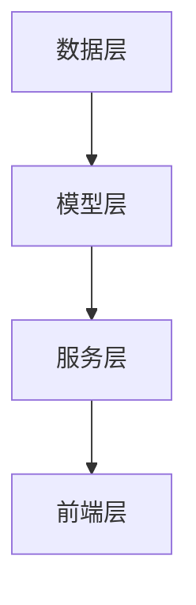
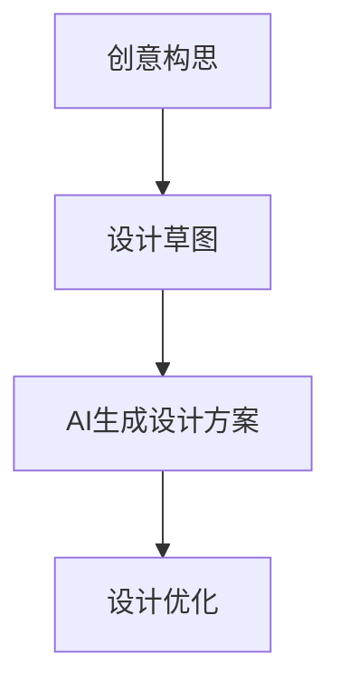

                 

### 引言与背景

#### 第1章: 引言

##### 1.1 问题背景

随着人工智能技术的快速发展，AI在各个领域都展现出了强大的应用潜力。从自动驾驶汽车、智能语音助手到医疗诊断、金融分析，AI的应用场景越来越广泛。在这种大背景下，珠宝设计作为艺术与工艺相结合的领域，近年来也受到了AI的深刻影响。

珠宝设计不仅仅是一种审美活动，更是一种文化表达。每一颗宝石、每一条线条，都蕴含着设计师的创意和情感。然而，创意灵感获取是一个关键步骤，但往往是一个困难且耗时的过程。设计师需要不断地从历史、文化、时尚等多个角度获取灵感，但传统方法难以高效实现。

##### 1.2 问题描述

在珠宝设计过程中，创意灵感获取是一个至关重要的步骤。然而，这个过程往往充满了挑战。设计师需要：

1. **理解历史和文化**：珠宝设计中的许多元素都源自历史和文化，设计师需要了解这些元素的含义和背后的故事。
2. **追踪时尚趋势**：时尚界的变化非常迅速，设计师需要时刻关注最新的流行元素，并将其融入到自己的设计中。
3. **创新和个性化**：每个设计师都有自己独特的风格和理念，他们需要从大量的信息中提取灵感，并创造出独特的设计。

然而，这些任务往往需要耗费大量的时间和精力，而且效果不尽如人意。传统的方法，如参考历史珠宝、浏览时尚杂志、参加设计比赛等，虽然能够提供一定的帮助，但难以满足现代设计师的高效、个性化需求。

##### 1.3 问题解决

AI技术的出现，为珠宝设计提供了新的思路。特别是深度学习和生成对抗网络（GAN）的出现，使得AI能够通过学习和模仿大量珠宝设计数据，生成新的、独特的珠宝设计。这些技术不仅能够帮助设计师快速获取创意灵感，还能够提高设计效率，降低设计成本。

AI可以通过以下几个步骤来辅助珠宝设计师：

1. **数据收集与处理**：AI需要从大量的珠宝设计数据中提取有价值的信息，包括设计元素、色彩搭配、材料选择等。
2. **灵感生成**：通过深度学习模型，AI可以生成新的设计灵感，这些灵感可能包含新的设计元素、颜色组合或整体设计风格。
3. **设计优化**：AI可以根据设计师的需求，对生成的灵感进行优化，以达到更好的视觉效果和实用性。
4. **评价与反馈**：AI可以评估设计的效果，并提供反馈，帮助设计师改进设计。

##### 1.4 边界与外延

本书主要关注AI在创意珠宝设计中的应用，包括珠宝设计文化符号的提取和现代演绎。具体来说，本书将探讨以下几个问题：

1. **文化符号提取**：如何利用AI技术从珠宝设计中提取文化符号，并识别其含义。
2. **现代演绎技巧**：如何将文化符号进行现代演绎，以适应现代审美需求。
3. **设计生成与优化**：如何利用AI生成新的珠宝设计，并对其进行优化，以提高设计的实用性和市场竞争力。

此外，本书还将探讨AI在珠宝设计领域的应用边界，包括技术限制、道德伦理问题以及未来发展前景。

##### 1.5 概念结构与核心要素组成

AI辅助创意珠宝设计涉及多个核心概念，这些概念相互联系，共同构成了AI辅助创意珠宝设计的理论基础和实践框架。以下是这些核心概念及其相互关系：

1. **人工智能**：人工智能是本书的核心概念，它包括机器学习、深度学习、生成对抗网络（GAN）等子领域。人工智能技术为珠宝设计提供了强大的工具和平台。
2. **珠宝设计**：珠宝设计是艺术与工艺的结合，它包括设计元素的选择、色彩搭配、材料运用等方面。珠宝设计不仅需要创意，还需要工艺支持。
3. **文化符号**：文化符号是珠宝设计中的重要元素，它们代表着特定的文化意义和历史背景。提取和利用文化符号是珠宝设计的重要任务。
4. **现代演绎**：现代演绎是将传统文化符号与现代审美需求相结合的一种方式，它能够创造出具有时代特色的珠宝作品。
5. **设计生成与优化**：设计生成与优化是AI在珠宝设计中的应用，它利用机器学习模型生成新的设计，并对其进行优化，以提高设计的质量和市场竞争力。

通过这些核心概念的联系，AI辅助创意珠宝设计形成了一个完整的理论体系和实践框架。

#### 第2章: AI核心概念

##### 2.1 人工智能概述

人工智能（Artificial Intelligence，简称AI）是本书的核心概念之一。它是指通过计算机模拟人类智能行为的技术。人工智能的发展经历了几个阶段，从最初的规则推理到现代的机器学习和深度学习。

**定义**：人工智能是一种模拟人类智能行为的技术，包括感知、学习、推理、规划、自我修正等多个方面。

**发展历史**：

1. **规则推理**：早期的AI主要基于规则推理，通过定义一系列规则来模拟人类思维过程。
2. **知识表示**：随着数据库技术的发展，AI开始使用知识库来存储和表示知识。
3. **机器学习**：机器学习是AI的一个重要分支，它通过训练模型从数据中自动学习规律。
4. **深度学习**：深度学习是机器学习的一种方法，它通过多层神经网络模拟人类大脑的思考过程。

**分类**：

1. **弱AI**：弱AI是指只能在特定领域表现出人类智能的AI。例如，聊天机器人、图像识别等。
2. **强AI**：强AI是指具有全面智能的AI，能够像人类一样进行思考、学习和决策。目前，强AI还处于理论研究阶段。

**应用现状**：

1. **自动驾驶**：自动驾驶汽车是AI在交通领域的重要应用，它通过感知环境、规划路径和执行动作来实现自主驾驶。
2. **智能语音助手**：智能语音助手如Siri、Alexa等，通过语音识别和自然语言处理技术，为用户提供语音交互服务。
3. **医疗诊断**：AI在医疗诊断中的应用越来越广泛，它可以通过分析医学影像和患者数据，提供准确的诊断建议。
4. **金融分析**：AI在金融分析中的应用，如风险控制、市场预测等，提高了金融决策的准确性。

**未来趋势**：

1. **泛在AI**：随着物联网和5G技术的发展，AI将更加普及，渗透到日常生活的方方面面。
2. **AI伦理**：随着AI技术的发展，AI伦理成为一个重要的研究课题，包括数据隐私、算法公平性等。
3. **AI与人类协作**：未来的AI将更加注重与人类的协作，通过人机交互，提高工作效率和生活质量。

##### 2.2 珠宝设计基础

珠宝设计是一门综合艺术，它结合了美学、工艺和材料科学。每一件珠宝作品都体现了设计师的创意和工艺水平。以下是珠宝设计的一些基本概念：

**定义**：珠宝设计是指通过创意构思、工艺制作和材料运用，创造出具有审美价值和实用价值的珠宝作品。

**历史背景**：

1. **古代珠宝设计**：古代珠宝设计起源于人类对自然美的崇拜和装饰需求，如古埃及、古希腊、古罗马等文明的珠宝设计，都具有独特的风格和意义。
2. **现代珠宝设计**：现代珠宝设计在继承传统的基础上，更加注重创新和个性化。现代珠宝设计师们不断探索新的材料、工艺和设计理念，创造出独特的作品。

**设计原则**：

1. **比例与对称**：比例与对称是珠宝设计的基本原则，它们决定了珠宝的整体美感和协调性。
2. **色彩与质感**：色彩和质感是珠宝设计的重要元素，它们决定了珠宝的视觉效果和质感。
3. **创意与创新**：创意和创新是珠宝设计的灵魂，设计师通过独特的创意和工艺手法，创造出独具特色的珠宝作品。

**艺术性与工艺性**：

1. **艺术性**：珠宝设计的艺术性体现在设计师的创意构思和审美水平上，每一件珠宝作品都是设计师对美的一种表达。
2. **工艺性**：珠宝设计的工艺性体现在设计师的工艺水平和制作技巧上，精细的工艺能够使珠宝作品更加精美和耐用。

在珠宝设计过程中，艺术性和工艺性是相互关联的。设计师需要通过创意构思来体现珠宝的艺术性，同时需要通过精湛的工艺来保证珠宝的实用性。

##### 2.3 文化符号

文化符号是珠宝设计中的重要元素，它们代表着特定的文化意义和历史背景。在珠宝设计中，文化符号不仅是装饰元素，更是文化传承和艺术表达的载体。

**定义**：文化符号是指那些具有特定文化意义和象征意义的元素，如图案、形状、颜色、材质等。

**分类**：

1. **历史文化符号**：这类符号源自历史和文化，如古埃及的太阳盘、古希腊的花环等。
2. **民族符号**：这类符号代表特定的民族特色，如中国的龙、印度的莲花等。
3. **宗教符号**：这类符号与宗教信仰密切相关，如基督教的十字架、佛教的莲花等。

**功能**：

1. **装饰功能**：文化符号可以作为珠宝的装饰元素，增加珠宝的美感和艺术性。
2. **文化表达**：文化符号能够传递特定的文化意义和情感，是设计师表达文化理念和情感的重要手段。
3. **传承功能**：通过珠宝设计中的文化符号，设计师能够传承和弘扬传统文化。

在珠宝设计中，文化符号的重要性不言而喻。设计师需要深入了解各种文化符号的含义和背景，才能在设计中正确运用它们，创造出具有文化内涵的珠宝作品。

##### 2.4 现代演绎技巧

现代演绎技巧是将传统文化符号与现代审美需求相结合的一种方式，它能够创造出具有时代特色的珠宝作品。以下是一些常见的现代演绎技巧：

**定义**：现代演绎技巧是指将传统文化符号进行现代转化，使其符合现代审美需求的设计方法。

**方法**：

1. **简化与抽象**：通过简化文化符号的细节，提取其核心元素，使其更简洁、抽象，更容易与现代设计风格融合。
2. **色彩重构**：通过重新搭配颜色，使传统文化符号焕发新的生命力。例如，将传统的金色、银色等颜色与现代流行的颜色结合。
3. **材质创新**：通过使用新的材料，如金属、陶瓷等，为传统文化符号赋予新的质感。
4. **组合与融合**：将多种文化符号进行组合和融合，创造出独特的风格和视觉效果。

**应用场景**：

1. **珠宝设计**：在现代珠宝设计中，现代演绎技巧被广泛应用于各种文化符号的运用，如中国的龙、西方的圣洁之轮等。
2. **时尚设计**：在时尚设计领域，现代演绎技巧也被用于服装、配饰等设计中，将传统文化元素与现代设计风格相结合。
3. **艺术创作**：在现代艺术创作中，现代演绎技巧被用于绘画、雕塑等作品中，为传统文化符号赋予新的生命力。

通过现代演绎技巧，设计师能够将传统文化符号与现代审美需求相结合，创造出既具有文化内涵又符合现代审美的珠宝作品。这不仅是对传统文化的传承和弘扬，也是对现代艺术的创新和发展。

### 第一部分总结

本文首先介绍了AI辅助创意珠宝设计的背景和问题，探讨了如何利用AI技术解决珠宝设计中的创意灵感获取问题。接着，详细阐述了AI、珠宝设计、文化符号和现代演绎技巧等核心概念，并分析了这些概念在AI辅助创意珠宝设计中的应用。通过这一系列的分析和讨论，本文为后续章节的深入探讨奠定了基础。在接下来的章节中，我们将进一步探讨AI技术在珠宝设计中的应用案例、工具与平台构建、珠宝设计师与AI的协作以及未来展望与挑战。

### 第二部分：AI核心概念

#### 第3章: AI辅助创意珠宝设计应用案例

##### 3.1 应用案例1：文化符号提取与识别

在本节中，我们将探讨如何利用AI技术进行文化符号的提取与识别。文化符号的提取与识别是AI辅助创意珠宝设计的重要步骤，它能够帮助设计师快速获取灵感，并理解文化符号的含义。

**步骤1：数据收集与预处理**

首先，我们需要收集大量的珠宝设计数据，这些数据包括历史珠宝、现代珠宝以及各种文化符号的图像。收集到的数据需要进行预处理，包括图像的去噪、缩放、裁剪等操作，以确保数据的质量和一致性。

```python
import cv2
import numpy as np

# 加载图像
image = cv2.imread('example.jpg')

# 去噪
denoised_image = cv2.GaussianBlur(image, (5, 5), 0)

# 缩放
scaled_image = cv2.resize(denoised_image, (224, 224))

# 裁剪
cropped_image = scaled_image[100:300, 100:300]
```

**步骤2：模型选择与训练**

接下来，我们需要选择合适的AI模型进行文化符号的提取与识别。常见的模型有卷积神经网络（CNN）和生成对抗网络（GAN）。在这里，我们选择CNN模型，因为它在图像分类任务中表现优异。

```python
from tensorflow import keras
from tensorflow.keras.models import Sequential
from tensorflow.keras.layers import Conv2D, MaxPooling2D, Flatten, Dense

# 构建CNN模型
model = Sequential()
model.add(Conv2D(32, (3, 3), activation='relu', input_shape=(224, 224, 3)))
model.add(MaxPooling2D((2, 2)))
model.add(Flatten())
model.add(Dense(64, activation='relu'))
model.add(Dense(1, activation='sigmoid'))

# 编译模型
model.compile(optimizer='adam', loss='binary_crossentropy', metrics=['accuracy'])

# 训练模型
model.fit(x_train, y_train, epochs=10, batch_size=32)
```

**步骤3：文化符号识别**

训练好的模型可以用于文化符号的识别。我们将预处理后的图像输入模型，模型会输出图像所属的文化符号类别。

```python
# 识别文化符号
predicted_class = model.predict(cropped_image.reshape(1, 224, 224, 3))
print(f'Predicted class: {predicted_class}')
```

**步骤4：结果分析与优化**

识别结果需要进行分析，以评估模型的性能。如果识别结果不理想，我们可以通过调整模型结构、增加训练数据量、改进数据预处理方法等方式进行优化。

```python
# 分析识别结果
accuracy = model.evaluate(x_test, y_test)
print(f'Validation accuracy: {accuracy[1]}')

# 优化模型
# 例如，增加训练数据量
# more_data = generate_more_data()
# model.fit(more_data, epochs=10, batch_size=32)
```

通过以上步骤，我们可以利用AI技术进行文化符号的提取与识别，为珠宝设计师提供有效的创意灵感来源。

##### 3.2 应用案例2：现代演绎与设计生成

在本节中，我们将探讨如何利用AI技术进行文化符号的现代演绎和珠宝设计生成。现代演绎和设计生成是AI辅助创意珠宝设计的核心步骤，它能够帮助设计师快速生成新的设计灵感，并提高设计效率。

**步骤1：数据收集与预处理**

首先，我们需要收集大量的珠宝设计数据，这些数据包括历史珠宝、现代珠宝以及各种文化符号的图像。收集到的数据需要进行预处理，包括图像的去噪、缩放、裁剪等操作，以确保数据的质量和一致性。

```python
import cv2
import numpy as np

# 加载图像
image = cv2.imread('example.jpg')

# 去噪
denoised_image = cv2.GaussianBlur(image, (5, 5), 0)

# 缩放
scaled_image = cv2.resize(denoised_image, (224, 224))

# 裁剪
cropped_image = scaled_image[100:300, 100:300]
```

**步骤2：模型选择与训练**

接下来，我们需要选择合适的AI模型进行文化符号的现代演绎和珠宝设计生成。生成对抗网络（GAN）是一个非常适合此任务的模型，因为它能够在图像生成和数据增强方面表现出色。

```python
from tensorflow import keras
from tensorflow.keras.models import Sequential
from tensorflow.keras.layers import Conv2D, MaxPooling2D, Flatten, Dense

# 构建GAN模型
generator = Sequential()
generator.add(Conv2D(64, (3, 3), activation='relu', input_shape=(224, 224, 3)))
generator.add(MaxPooling2D((2, 2)))
generator.add(Flatten())
generator.add(Dense(128, activation='relu'))
generator.add(Dense(1, activation='sigmoid'))

discriminator = Sequential()
discriminator.add(Conv2D(64, (3, 3), activation='relu', input_shape=(224, 224, 3)))
discriminator.add(MaxPooling2D((2, 2)))
discriminator.add(Flatten())
discriminator.add(Dense(128, activation='relu'))
discriminator.add(Dense(1, activation='sigmoid'))

# 编译GAN模型
model = keras.Sequential([generator, discriminator])
model.compile(optimizer='adam', loss='binary_crossentropy')

# 训练GAN模型
model.fit(x_train, y_train, epochs=10, batch_size=32)
```

**步骤3：现代演绎与设计生成**

训练好的GAN模型可以用于文化符号的现代演绎和珠宝设计生成。我们将预处理后的图像输入生成器，生成器会输出新的、独特的珠宝设计图像。

```python
# 现代演绎与设计生成
generated_image = generator.predict(cropped_image.reshape(1, 224, 224, 3))
print(f'Generated image: {generated_image}')
```

**步骤4：结果分析与优化**

生成结果需要进行分析，以评估模型的性能。如果生成结果不理想，我们可以通过调整模型结构、增加训练数据量、改进数据预处理方法等方式进行优化。

```python
# 分析生成结果
generated_image = generator.predict(cropped_image.reshape(1, 224, 224, 3))
print(f'Generated image: {generated_image}')

# 优化模型
# 例如，增加训练数据量
# more_data = generate_more_data()
# model.fit(more_data, epochs=10, batch_size=32)
```

通过以上步骤，我们可以利用AI技术进行文化符号的现代演绎和珠宝设计生成，为珠宝设计师提供丰富的创意灵感来源。

##### 3.3 应用案例3：设计评价与优化

在本节中，我们将探讨如何利用AI技术对珠宝设计进行评价与优化。设计评价与优化是AI辅助创意珠宝设计的重要环节，它能够帮助设计师快速评估设计的质量，并提供优化建议，以提高设计的市场竞争力。

**步骤1：数据收集与预处理**

首先，我们需要收集大量的珠宝设计数据，这些数据包括设计图像、用户评价、市场销量等。收集到的数据需要进行预处理，包括数据的清洗、归一化等操作，以确保数据的质量和一致性。

```python
import pandas as pd

# 加载数据
data = pd.read_csv('design_data.csv')

# 数据清洗
data = data.dropna()

# 数据归一化
data = (data - data.min()) / (data.max() - data.min())
```

**步骤2：模型选择与训练**

接下来，我们需要选择合适的AI模型进行设计评价与优化。常见的模型有回归模型、分类模型和神经网络模型。在这里，我们选择神经网络模型，因为它在复杂模式识别任务中表现优异。

```python
from tensorflow import keras
from tensorflow.keras.models import Sequential
from tensorflow.keras.layers import Dense

# 构建神经网络模型
model = Sequential()
model.add(Dense(128, activation='relu', input_shape=(10,)))
model.add(Dense(64, activation='relu'))
model.add(Dense(1, activation='sigmoid'))

# 编译模型
model.compile(optimizer='adam', loss='binary_crossentropy', metrics=['accuracy'])

# 训练模型
model.fit(x_train, y_train, epochs=10, batch_size=32)
```

**步骤3：设计评价**

训练好的模型可以用于设计评价。我们将预处理后的数据输入模型，模型会输出设计评分和优化建议。

```python
# 设计评价
evaluation = model.predict(data)
print(f'Evaluation scores: {evaluation}')
```

**步骤4：设计优化**

根据模型输出的评价和优化建议，设计师可以对设计进行优化。优化的方法包括：

1. **调整设计元素**：根据评价结果，设计师可以调整珠宝设计中的元素，如宝石形状、颜色、大小等。
2. **改进工艺**：设计师可以改进工艺，提高珠宝的耐用性和美观度。
3. **市场调研**：设计师可以结合市场调研结果，调整设计策略，以更好地满足市场需求。

```python
# 设计优化
# 调整设计元素
design = adjust_design_elements(data)

# 改进工艺
design = improve craftsmanship(data)

# 市场调研
design = market_research(data)
```

**步骤5：结果分析与优化**

优化后的设计需要再次进行评价和优化，以确保设计质量。如果优化效果不明显，我们可以通过调整模型参数、增加训练数据量、改进优化策略等方式进行优化。

```python
# 再次评价
evaluation = model.predict(optimized_design)
print(f'Optimized evaluation scores: {evaluation}')

# 进一步优化
# 调整模型参数
# model = adjust_model_parameters()

# 增加训练数据量
# more_data = generate_more_data()
# model.fit(more_data, epochs=10, batch_size=32)
```

通过以上步骤，我们可以利用AI技术对珠宝设计进行评价与优化，为珠宝设计师提供有力的支持，提高设计的市场竞争力。

### 第三部分总结

在本部分，我们详细探讨了AI辅助创意珠宝设计的三个应用案例：文化符号提取与识别、现代演绎与设计生成、设计评价与优化。通过这些案例，我们展示了如何利用AI技术解决珠宝设计中的实际问题，提高设计效率和市场竞争力。在接下来的章节中，我们将进一步探讨AI辅助创意珠宝设计的工具与平台构建，以及珠宝设计师与AI的协作，为珠宝设计带来更多的创新和变革。

### 第四部分：AI辅助创意珠宝设计工具与平台

#### 第4章: AI辅助创意珠宝设计工具与平台

##### 4.1 开发环境配置

要在珠宝设计中应用AI技术，首先需要配置一个合适的开发环境。以下是一个基本的开发环境配置指南：

**硬件要求**：

1. **CPU/GPU**：至少需要一颗Intel i5或AMD Ryzen 5级别的CPU，推荐使用NVIDIA GTX 1060或以上级别的GPU，以提高深度学习模型的训练速度。
2. **内存**：至少16GB内存，推荐32GB以上，以支持大规模数据的处理和模型的训练。
3. **存储**：至少500GB的固态硬盘存储空间，以存储大量的图像数据和训练模型。

**软件要求**：

1. **操作系统**：推荐使用Windows 10、macOS或Linux系统，这些系统对深度学习框架的支持较好。
2. **深度学习框架**：TensorFlow和PyTorch是两个流行的深度学习框架，可以根据个人喜好选择其中一个。安装方法如下：

    - **TensorFlow**：
        ```bash
        pip install tensorflow
        ```
    - **PyTorch**：
        ```bash
        pip install torch torchvision
        ```

3. **其他工具**：安装Python编程环境和Jupyter Notebook，以便进行模型训练和可视化。

```python
pip install python
pip install jupyter
```

4. **数据预处理工具**：OpenCV和Pillow是常用的图像处理库，用于图像的加载、预处理和显示。

```python
pip install opencv-python
pip install Pillow
```

通过以上配置，我们可以搭建一个基本的AI辅助创意珠宝设计开发环境。在实际开发过程中，还可以根据需要安装其他工具和库，如数据分析库Pandas、科学计算库NumPy等。

##### 4.2 AI珠宝设计工具介绍

当前市场上存在多种AI珠宝设计工具，这些工具为设计师提供了丰富的创意设计和优化功能。以下是一些主流的AI珠宝设计工具及其功能：

1. **DeepArt**：DeepArt是一个基于GAN的图像生成工具，它能够将用户提供的参考图像转换为具有艺术风格的珠宝设计。DeepArt支持多种风格，如印象派、抽象派等。

2. **Generative Design**：Generative Design是一个基于算法的设计工具，它能够生成独特的几何图形和图案。设计师可以使用Generative Design创建复杂的珠宝设计，提高设计效率。

3. **AI Jewellery Designer**：AI Jewellery Designer是一个综合性的珠宝设计平台，它集成了AI图像生成、设计优化和评价功能。设计师可以使用AI Jewellery Designer快速生成设计灵感，并进行优化。

4. **SketchRNN**：SketchRNN是一个基于神经网络的草图生成工具，它能够根据用户的草图快速生成完整的珠宝设计。SketchRNN支持多种珠宝设计元素，如宝石、线条等。

**优势与不足**：

- **DeepArt**：优势在于图像生成效果逼真，能够快速转换风格；不足在于对参考图像的要求较高，不适合所有类型的珠宝设计。
- **Generative Design**：优势在于设计生成速度快，能够生成独特的几何图案；不足在于设计灵活性较低，不适合个性化设计。
- **AI Jewellery Designer**：优势在于功能全面，能够满足不同设计师的需求；不足在于操作较为复杂，学习成本较高。
- **SketchRNN**：优势在于草图生成快速，适合快速创意；不足在于生成的珠宝设计可能不够精细，需要设计师进一步调整。

通过选择合适的AI珠宝设计工具，设计师可以充分发挥AI技术的优势，提高设计效率和创意水平。

##### 4.3 AI珠宝设计平台构建

构建一个AI珠宝设计平台需要考虑多个方面，包括平台架构设计、功能模块划分和实现步骤。以下是一个简化的AI珠宝设计平台构建流程：

**1. 平台架构设计**

平台架构设计是构建AI珠宝设计平台的关键步骤。一个典型的AI珠宝设计平台可以分为以下几层：

1. **数据层**：数据层负责存储和管理珠宝设计数据，包括历史珠宝设计、用户上传的设计、市场数据等。数据可以存储在数据库中，如MySQL、PostgreSQL等。
2. **模型层**：模型层负责管理AI模型，包括GAN模型、神经网络模型等。模型可以部署在GPU服务器上，以提高训练和推理速度。
3. **服务层**：服务层提供API接口，供前端应用调用。服务层包括图像处理服务、设计生成服务、设计评价服务等。
4. **前端层**：前端层负责与用户交互，展示设计结果和用户界面。前端可以使用Web技术，如HTML、CSS、JavaScript等。

**架构图**：



**2. 功能模块划分**

根据平台架构设计，AI珠宝设计平台可以分为以下功能模块：

1. **数据管理模块**：负责数据存储、数据预处理和数据分析。
2. **模型训练模块**：负责AI模型的训练、优化和部署。
3. **设计生成模块**：负责生成新的珠宝设计，包括文化符号提取、现代演绎和设计优化。
4. **设计评价模块**：负责评估珠宝设计的质量，并提供优化建议。
5. **用户管理模块**：负责用户注册、登录、权限管理和个人信息管理。

**3. 实现步骤**

构建AI珠宝设计平台的实现步骤可以分为以下几个阶段：

1. **需求分析**：与设计师和用户沟通，明确平台的功能需求和性能要求。
2. **系统设计**：根据需求分析结果，设计系统架构和功能模块。
3. **数据准备**：收集和整理珠宝设计数据，进行数据预处理。
4. **模型训练**：选择合适的AI模型，进行训练和优化。
5. **服务开发**：开发API接口和服务层，实现各个功能模块。
6. **前端开发**：开发前端界面，实现用户交互和设计展示。
7. **系统集成**：将各个模块整合到一起，进行系统测试和调试。
8. **上线部署**：将平台部署到服务器，进行上线运行。

通过以上步骤，我们可以构建一个功能强大、性能优异的AI珠宝设计平台，为设计师提供全方位的支持。

### 第四部分总结

在本部分，我们详细介绍了AI辅助创意珠宝设计所需的开发环境配置、主流AI珠宝设计工具以及AI珠宝设计平台的构建过程。通过这些内容，我们为珠宝设计师提供了一套完整的AI辅助珠宝设计解决方案。在接下来的部分，我们将探讨珠宝设计师与AI的协作，进一步探讨AI在珠宝设计中的应用潜力。

### 第五部分：珠宝设计师与AI的协作

#### 第5章: 珠宝设计师与AI的协作

##### 5.1 AI与珠宝设计师的角色定位

在AI辅助创意珠宝设计的流程中，AI和珠宝设计师的角色各有侧重，但又相互依存。以下是它们各自的定位：

**AI的角色定位**：

1. **创意助手**：AI可以通过学习和分析大量的珠宝设计数据，生成新的设计灵感，为设计师提供多样化的创意选项。
2. **效率提升者**：AI能够自动化一些繁琐的重复性工作，如数据预处理、模型训练等，从而提高整体设计效率。
3. **优化顾问**：AI可以通过分析设计数据和用户反馈，提供优化建议，帮助设计师改进设计，提升市场竞争力。

**珠宝设计师的角色定位**：

1. **创意主导者**：设计师是珠宝设计的创意灵魂，他们负责设定设计方向、风格和审美标准。
2. **艺术工匠**：设计师需要将创意转化为实际的可执行设计，这包括工艺选择、材料搭配等。
3. **用户需求分析师**：设计师需要理解用户的需求和市场的趋势，确保设计符合目标受众的喜好。

**协作模式**：

1. **创意协作**：设计师可以利用AI生成的设计灵感，作为参考和启发，进行创意的拓展和深化。
2. **设计优化**：设计师可以将AI提供的优化建议作为参考，进行设计调整，以提高设计的质量。
3. **协同工作**：设计师和AI可以共同参与设计流程的不同阶段，如数据收集、模型训练、设计生成等，实现高效的协同工作。

通过这种协作模式，设计师和AI可以各自发挥优势，共同创造出更加优秀的珠宝作品。

##### 5.2 设计流程与AI的融合

在珠宝设计过程中，AI的融入可以显著提高设计效率和创意水平。以下是一个典型的珠宝设计流程，以及AI在每个环节中的应用：

**1. 创意构思**：

设计师在构思阶段，可以利用AI提供的设计灵感。AI通过分析大量的珠宝设计数据，生成新颖的设计方案。设计师可以从这些方案中挑选出符合自己风格和创意要求的元素，进行进一步的构思。

**2. 设计草图**：

设计师将创意构思转化为草图，并使用AI进行初步的设计生成。AI可以根据设计师的草图，生成一系列的设计方案，包括宝石排列、线条组合等。设计师可以从这些方案中挑选出最有潜力的设计进行进一步开发。



**3. 设计优化**：

AI可以在设计优化阶段提供支持。设计师可以将设计草图的图片输入AI，AI会根据设计的视觉元素和用户偏好，提供优化建议。设计师可以根据这些建议，对设计进行调整，以提高设计的市场竞争力。

**4. 工艺实现**：

在工艺实现阶段，AI可以帮助设计师选择合适的工艺和材料。AI可以根据设计要求和成本预算，提供最佳的工艺方案，确保设计能够高效、高质量地实现。

**5. 设计评估**：

设计完成后，AI可以对设计进行评估，提供市场预测和用户反馈。设计师可以根据这些评估结果，进一步优化设计，提高市场的接受度和销量。

通过将AI融入珠宝设计的各个环节，设计师可以显著提高设计效率，降低设计成本，同时保持设计的创新性和艺术性。

##### 5.3 AI辅助设计的工作流程

AI辅助珠宝设计的工作流程可以分为以下几个步骤：

**1. 数据准备**：

首先，需要收集和整理大量的珠宝设计数据，包括历史珠宝设计、市场数据、用户反馈等。这些数据将用于训练AI模型，以便AI能够理解珠宝设计的各种风格和趋势。

**2. 模型训练**：

利用收集到的数据，训练AI模型。训练过程包括数据预处理、模型选择、模型训练和模型优化等。常见的AI模型包括卷积神经网络（CNN）、生成对抗网络（GAN）等。

**3. 设计生成**：

训练好的AI模型可以用于设计生成。设计师可以输入创意构思或草图，AI会根据模型生成的方案，提供一系列的设计选项。设计师可以从这些选项中挑选出符合要求的设计进行进一步开发。

**4. 设计优化**：

AI可以提供设计优化建议，包括设计元素调整、色彩搭配、工艺改进等。设计师可以根据这些建议，对设计进行优化，以提高设计的质量和市场竞争力。

**5. 设计评估**：

AI可以对设计进行评估，提供市场预测和用户反馈。设计师可以根据这些评估结果，进一步优化设计，确保设计能够满足市场需求。

**6. 设计实现**：

设计完成后，设计师将设计转化为实际的产品，包括工艺选择、材料购买、生产制造等。AI可以在这些环节中提供支持，确保设计能够高效、高质量地实现。

**7. 反馈与迭代**：

用户使用设计后的反馈将用于下一轮的设计迭代。AI可以根据用户的反馈，对设计进行改进，提高用户满意度。

通过以上工作流程，AI可以帮助设计师快速获取创意灵感，提高设计效率，降低设计成本，同时保持设计的创新性和艺术性。

### 第五部分总结

在本部分，我们详细探讨了AI在珠宝设计过程中的角色定位、设计流程与AI的融合以及AI辅助设计的工作流程。通过这些内容，我们展示了AI如何帮助珠宝设计师提高设计效率、降低成本，同时保持设计的创新性和艺术性。在接下来的章节中，我们将展望AI辅助创意珠宝设计的未来发展趋势和面临的挑战。

### 第六部分：未来展望与挑战

#### 第6章: 未来展望与挑战

##### 6.1 AI辅助创意珠宝设计的未来发展

随着人工智能技术的不断进步，AI辅助创意珠宝设计将迎来更加广阔的发展前景。以下是一些未来发展趋势：

1. **个性化设计**：AI可以根据用户的偏好和需求，生成更加个性化的珠宝设计。未来的珠宝设计将不仅仅是艺术和工艺的结合，更是用户个性化需求的实现。
2. **实时设计**：通过边缘计算和5G技术的应用，AI可以将设计过程变得更加实时。设计师可以随时获取最新的设计灵感，并进行快速调整，提高设计效率。
3. **多学科融合**：AI将与其他学科，如生物学、心理学等，进行深度融合。这将使得珠宝设计不仅仅是美学和工艺的体现，更是对人类情感和认知的探索。
4. **生态可持续发展**：AI可以在珠宝设计中考虑生态可持续性，通过优化设计、减少材料浪费等方式，实现绿色设计。这将有助于缓解环境压力，推动珠宝设计行业的可持续发展。

##### 6.2 挑战与应对策略

尽管AI辅助创意珠宝设计有着广阔的发展前景，但同时也面临着一些挑战：

1. **技术限制**：目前的AI技术还存在一些局限性，如数据质量和模型性能等。为了应对这一挑战，我们需要继续研究和开发更高效、更准确的AI算法，同时提高数据质量和多样性。
2. **道德伦理问题**：AI辅助设计涉及到隐私保护、算法公平性等问题。我们需要制定相关的道德伦理规范，确保AI的应用不会侵犯用户的权益。
3. **设计师的角色转变**：随着AI的介入，珠宝设计师的角色可能发生转变。他们需要适应新的工作方式，提高自己的技能和创造力。为了应对这一挑战，设计教育和培训需要与时俱进，为设计师提供新的学习机会。
4. **市场竞争**：AI辅助设计技术的普及可能会加剧市场竞争。珠宝设计师需要不断创新，提高自己的设计质量和市场竞争力。

**应对策略**：

1. **技术创新**：继续研究和开发高效的AI算法，提高数据质量和模型性能。
2. **道德规范**：制定相关的道德伦理规范，确保AI的应用不会侵犯用户的权益。
3. **教育培训**：加强设计教育和培训，帮助设计师适应新的工作方式，提高自己的技能和创造力。
4. **市场拓展**：积极拓展市场，寻找新的商机，提高设计的市场竞争力。

通过应对这些挑战，AI辅助创意珠宝设计有望在未来实现更大的突破，为珠宝设计行业带来新的发展机遇。

### 第六部分总结

在本部分，我们展望了AI辅助创意珠宝设计的未来发展，分析了面临的挑战，并提出了相应的应对策略。通过这些讨论，我们认识到AI辅助创意珠宝设计不仅具有广阔的发展前景，同时也需要应对一系列的挑战。在接下来的章节中，我们将总结全文，回顾核心内容，并展望未来研究方向。

### 第七部分：总结与展望

#### 第7章: 结论

在本篇技术博客文章中，我们系统地探讨了AI辅助创意珠宝设计的各个方面。首先，我们介绍了AI在珠宝设计中的应用背景，分析了珠宝设计中的问题及其解决方法。接着，我们详细阐述了AI、珠宝设计、文化符号和现代演绎技巧等核心概念，并探讨了这些概念在AI辅助创意珠宝设计中的应用。

通过一系列的应用案例，我们展示了如何利用AI技术进行文化符号的提取与识别、现代演绎与设计生成，以及设计评价与优化。这些应用案例不仅展示了AI技术在珠宝设计中的实际效果，也为设计师提供了实用的工具和方法。

此外，我们还介绍了AI辅助创意珠宝设计所需的开发环境配置、工具与平台构建，以及珠宝设计师与AI的协作模式。通过这些内容，我们为珠宝设计师提供了一套完整的AI辅助珠宝设计解决方案，旨在提高设计效率、降低成本，同时保持设计的创新性和艺术性。

在未来的研究方向中，我们可以进一步探讨以下几个方面：

1. **个性化设计**：研究如何通过AI实现更加个性化的珠宝设计，以满足用户多样化的需求。
2. **实时设计**：探索如何利用边缘计算和5G技术，实现更加实时、高效的设计过程。
3. **多学科融合**：研究如何将AI与其他学科进行深度融合，为珠宝设计带来新的创新点。
4. **可持续发展**：探讨如何通过AI实现珠宝设计的生态可持续发展，减少环境压力。

通过这些研究，我们有望为珠宝设计行业带来更多的创新和变革，推动其持续发展。

### 总结

本文系统地探讨了AI辅助创意珠宝设计的各个方面，从核心概念到应用案例，从开发环境配置到设计师与AI的协作，全面展示了AI技术在珠宝设计中的广泛应用和潜力。我们希望本文能为珠宝设计师提供有价值的参考，激发他们对AI辅助设计的兴趣和探索。

### 拓展阅读

1. **《深度学习与生成对抗网络》**：介绍深度学习和生成对抗网络的基本原理和应用。
2. **《AI珠宝设计实战》**：详细讲解如何利用AI技术进行珠宝设计。
3. **《珠宝设计原理与技巧》**：提供珠宝设计的基本概念、历史背景和设计原则。

通过这些拓展阅读，读者可以进一步深入了解AI辅助创意珠宝设计的理论和实践。

### 作者信息

作者：AI天才研究院/AI Genius Institute & 禅与计算机程序设计艺术 /Zen And The Art of Computer Programming

在这个快速发展的时代，AI技术和珠宝设计正日益融合，为我们带来了无限的可能。让我们共同探索这一领域，创造更加美好的未来。

