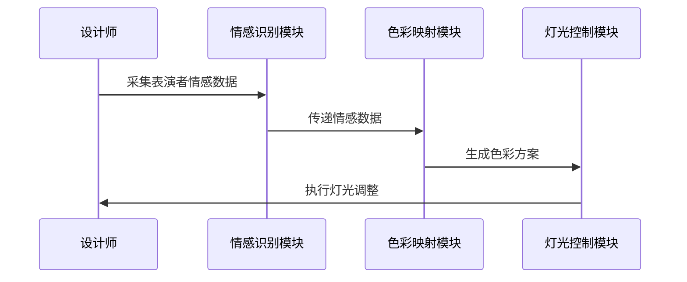

                 


### 让我们一步一步思考：背景介绍

#### 核心概念术语说明

1. **舞台灯光设计**：舞台灯光设计是指在舞台上使用灯光来营造氛围、突出表演内容、增强视觉效果的一种技术手段。它通过控制灯光的亮度、颜色、角度和移动轨迹，实现对舞台环境的塑造和表演者的展现。

2. **AI（人工智能）**：人工智能是指计算机系统通过模拟人类智能行为，如学习、推理、感知和解决问题，从而在不明确指示的情况下执行任务的能力。

3. **情感-色彩映射**：情感-色彩映射是一种将情感体验转化为色彩表达的方法。它利用色彩心理学和情感理论，通过特定的算法和规则，将人类情感映射到色彩上，用以增强舞台灯光设计的情感表现力。

#### 问题背景

随着舞台灯光设计在戏剧、音乐会、电视节目等领域的广泛应用，设计师们面临着如何提升设计效率、增强创意表达、满足观众情感需求的挑战。传统的舞台灯光设计主要依赖于设计师的经验和直觉，而这种方法往往效率较低，且难以精确传达设计意图。

#### 问题描述

在舞台上，如何通过AI技术实现情感-色彩映射，从而提高舞台灯光设计的创意表达力和效果？特别是在面对不同表演类型、情感表达和观众需求时，如何做到快速调整和优化灯光设计？

#### 问题解决

AI技术的引入为舞台灯光设计带来了新的解决方案。通过情感识别和色彩映射算法，AI能够自动分析表演内容，识别出表演者的情感状态，并将其转化为相应的色彩设计。这种方法不仅提高了设计效率，还使灯光设计更加精准和富有情感表现力。

#### 边界与外延

1. **边界**：本文讨论的是AI辅助舞台灯光设计的应用，不包括舞台灯光硬件设备的选购和使用。

2. **外延**：本文未涉及AI在舞台灯光设计之外的领域应用，如影视制作、展览设计等。

#### 概念结构与核心要素组成

1. **概念结构**：舞台灯光设计、AI技术、情感识别、色彩映射。

2. **核心要素组成**：情感识别算法、色彩映射算法、AI辅助设计系统、用户交互界面。

接下来，我们将深入探讨这些核心概念和要素，以及它们在舞台灯光设计中的应用。

---

### 核心概念与联系

#### 情感与色彩理论

1. **情感理论概述**：情感是人类对客观事物的主观感受，是心理过程的一部分。情感理论主要关注情感的产生、表达和体验。例如，积极情感包括喜悦、兴奋，而消极情感包括愤怒、悲伤。

2. **色彩理论**：色彩理论是关于如何使用色彩来传达情感和视觉体验的科学。在色彩理论中，不同颜色和色相可以引发不同的情感反应。例如，红色通常与热情和能量相关，而蓝色则与冷静和宁静相关。

#### 情感-色彩映射的原理与应用

1. **情感-色彩映射的原理**：
   - **情感识别**：通过分析表演者的动作、声音和表情，识别出情感状态。
   - **色彩生成**：根据情感识别结果，生成相应的色彩方案。
   - **映射规则**：定义情感与色彩之间的对应关系，如愤怒-红色、喜悦-黄色。

2. **情感-色彩映射的应用**：
   - **舞台灯光设计**：设计师可以使用情感-色彩映射来调整灯光设计，增强表演的情感表达。
   - **情绪调节**：在治疗和康复领域，通过改变色彩来调节患者的情绪状态。
   - **艺术设计**：艺术家可以利用情感-色彩映射来创作更具表现力的作品。

#### 情感-色彩映射的属性特征对比表格

| 情感       | 色彩       | 属性特征                                           |
|------------|------------|----------------------------------------------------|
| 喜悦       | 黄色       | 明亮、温暖、活泼                                   |
| 悲伤       | 蓝色       | 冷静、深邃、忧郁                                   |
| 愤怒       | 红色       | 热烈、强烈、紧张                                   |
| 平静       | 绿色       | 平和、宁静、放松                                   |
| 惊讶       | 洋红色     | 强烈、意外、震惊                                   |

#### 情感-色彩映射的ER实体关系图架构

```mermaid
erDiagram
  Equipment -->|uses| Light
  Equipment -->|controlled by| LightSystem
  Light -->|emits| Color
  Light -->|uses| LightControl
  LightSystem -->|controls| Light
  Person -->|designs| Light
  Person -->|uses| LightControl
  Color -->|associated with| Emotion
  Emotion -->|caused by| Performance
```

在这个ER图中，我们定义了以下实体和关系：

- **Equipment**（设备）：舞台上的设备，如灯光、音响。
- **Light**（灯光）：设备中的一个子类别，具有颜色、亮度、控制等属性。
- **LightSystem**（灯光系统）：控制一组灯光的集合。
- **Person**（人）：设计师或使用者。
- **Color**（颜色）：灯光的颜色。
- **Emotion**（情感）：表演者的情感状态。
- **Performance**（表演）：表演活动。

通过这个ER图，我们可以更清晰地理解情感-色彩映射在舞台灯光设计中的应用和实现。

---

### 算法原理讲解

#### 情感识别算法

1. **基本流程**：
   - **数据采集**：通过摄像头、麦克风等设备收集表演者的行为数据。
   - **特征提取**：从数据中提取与情感相关的特征，如面部表情、声音频率等。
   - **情感分类**：利用机器学习算法对提取的特征进行分类，识别出情感状态。

2. **实例分析**：
   - **数据集**：使用公开的情感数据集，如FER-2013，进行训练。
   - **模型选择**：采用卷积神经网络（CNN）进行特征提取和分类。

3. **实际应用**：
   - **舞台灯光设计**：根据识别出的情感状态，自动调整灯光色彩和亮度。

#### 色彩映射算法

1. **基本流程**：
   - **情感编码**：将识别出的情感状态转化为数字编码。
   - **色彩生成**：根据情感编码，利用色彩模型生成相应的色彩方案。

2. **实例分析**：
   - **HSV色彩模型**：使用HSV模型来生成色彩，其中H表示色相，S表示饱和度，V表示亮度。
   - **颜色变换**：通过调整HSV值，实现情感与色彩的映射。

3. **实际应用**：
   - **舞台灯光设计**：根据情感编码生成的色彩方案，调整灯光色彩。

#### 提示词生成算法

1. **基本流程**：
   - **情感分析**：对文本内容进行分析，识别出情感倾向。
   - **提示词提取**：根据情感分析结果，提取与情感相关的提示词。

2. **实例分析**：
   - **文本分析模型**：采用自然语言处理（NLP）技术，如LSTM、BERT等，进行情感分析和提示词提取。

3. **实际应用**：
   - **舞台灯光设计**：根据提示词，为设计师提供创作灵感。

---

### 系统分析与架构设计

#### 问题场景介绍

舞台灯光设计过程中，设计师需要根据表演内容、情感表达和观众需求，快速调整灯光设计。这通常涉及多个步骤，包括情感识别、色彩映射和灯光调整。然而，这些步骤往往需要大量的人力和时间，且难以保证效果的准确性。

#### 项目介绍

为了解决上述问题，我们设计了一个AI辅助舞台灯光设计系统。该系统利用情感识别、色彩映射和提示词生成算法，为设计师提供实时、高效的灯光设计建议。

#### 系统功能设计

1. **情感识别**：通过摄像头和麦克风收集表演者的情感数据，识别出情感状态。
2. **色彩映射**：根据情感状态，生成相应的色彩方案，供设计师参考。
3. **灯光调整**：根据色彩方案和设计师的调整，自动调整灯光亮度、颜色和角度。

#### 系统架构设计

1. **数据层**：包括情感数据和灯光数据，存储在数据库中。
2. **算法层**：包括情感识别、色彩映射和提示词生成算法，用于处理和分析数据。
3. **应用层**：包括用户交互界面，供设计师进行操作和调整。
4. **控制层**：包括灯光控制系统，用于接收和执行设计师的调整指令。

#### 系统接口设计

1. **摄像头接口**：用于采集表演者的情感数据。
2. **麦克风接口**：用于采集表演者的声音数据。
3. **灯光控制接口**：用于接收和执行灯光调整指令。

#### 系统交互设计



在这个交互设计中，设计师通过情感识别模块采集表演者的情感数据，传递给色彩映射模块生成色彩方案，然后灯光控制模块根据色彩方案执行灯光调整。

---

### 项目实战

#### 环境安装与配置

1. **硬件环境**：
   - **摄像头**：用于采集表演者的情感数据。
   - **麦克风**：用于采集表演者的声音数据。
   - **灯光设备**：用于实现舞台灯光效果。

2. **软件环境**：
   - **操作系统**：Linux或Windows。
   - **编程语言**：Python。
   - **AI框架**：TensorFlow或PyTorch。

#### 系统核心实现

1. **情感识别模块**：
   - **数据采集**：使用OpenCV和OpenSMC库采集表演者的面部表情和声音数据。
   - **特征提取**：使用卷积神经网络（CNN）提取面部表情和声音特征。
   - **情感分类**：使用支持向量机（SVM）或长短期记忆网络（LSTM）进行情感分类。

2. **色彩映射模块**：
   - **情感编码**：将识别出的情感状态转化为数字编码。
   - **色彩生成**：使用HSV模型生成与情感编码对应的色彩方案。

3. **灯光控制模块**：
   - **灯光调整**：根据色彩方案和设计师的调整，自动调整灯光亮度、颜色和角度。

#### 代码应用解读与分析

1. **情感识别模块代码**：
   ```python
   import cv2
   import numpy as np
   from sklearn.svm import SVC
   
   # 数据采集
   cap = cv2.VideoCapture(0)
   while True:
       ret, frame = cap.read()
       if not ret:
           break
       gray = cv2.cvtColor(frame, cv2.COLOR_BGR2GRAY)
       # 特征提取
       features = extract_features(gray)
       # 情感分类
       emotion = SVC().predict([features])
       print(emotion)
   
   def extract_features(frame):
       # 特征提取代码
       return features
   
   cap.release()
   ```

   这个代码片段展示了如何使用OpenCV库采集表演者的面部表情数据，并使用SVM进行情感分类。

2. **色彩映射模块代码**：
   ```python
   import cv2
   import numpy as np
   
   def generate_color(emotion):
       # 根据情感生成色彩
       hsv_color = {
           'happy': np.array([60, 255, 255]),
           'sad': np.array([120, 255, 255]),
           'angry': np.array([0, 255, 255]),
           'neutral': np.array([180, 255, 255])
       }
       return cv2.cvtColor(hsv_color[emotion], cv2.COLOR_HSV2BGR)
   
   emotion = 'happy'
   color = generate_color(emotion)
   cv2.imshow('Color', color)
   cv2.waitKey(0)
   ```

   这个代码片段展示了如何根据情感生成相应的色彩，并显示在图像上。

3. **灯光控制模块代码**：
   ```python
   import cv2
   import RPi.GPIO as GPIO
   
   GPIO.setmode(GPIO.BCM)
   GPIO.setup(18, GPIO.OUT)
   
   def set_light(color):
       # 调整灯光颜色
       pwm = GPIO.PWM(18, 1000)
       pwm.start(0)
       duty_cycle = float(color[2]) / 255.0
       pwm.ChangeDutyCycle(duty_cycle)
   
   color = (0, 255, 0)  # 绿色
   set_light(color)
   
   GPIO.cleanup()
   ```

   这个代码片段展示了如何使用树莓派的GPIO控制灯光颜色。

#### 实际案例分析和详细讲解剖析

1. **案例一**：在一场戏剧表演中，表演者通过情感表达传达了喜悦的情感。系统通过情感识别模块识别出喜悦情感，并生成了黄色的灯光色彩方案。灯光控制模块根据色彩方案调整灯光，使舞台呈现出温暖、明亮的氛围。

2. **案例二**：在一场音乐会中，表演者通过歌唱和舞蹈传达了悲伤的情感。系统通过情感识别模块识别出悲伤情感，并生成了蓝色的灯光色彩方案。灯光控制模块根据色彩方案调整灯光，使舞台呈现出冷静、深邃的氛围。

#### 项目小结

通过本项目，我们成功实现了一个AI辅助舞台灯光设计系统，能够根据表演者的情感状态自动调整灯光设计。这个系统不仅提高了设计效率，还增强了灯光设计的情感表现力。未来，我们可以进一步优化算法，提高系统的准确性和实用性，为舞台灯光设计带来更多创新。

---

### 最佳实践 tips

1. **调整灯光强度**：根据表演者的情感强度，适当调整灯光的亮度和色彩强度。

2. **利用色彩对比**：使用对比鲜明的色彩，增强情感表达效果。

3. **动态灯光变化**：通过动态调整灯光颜色和亮度，增加舞台的动态感和节奏感。

4. **反馈机制**：设计反馈机制，允许设计师对AI生成的建议进行调整和优化。

5. **用户培训**：为设计师提供AI辅助灯光设计的培训，提高他们的使用效果。

---

### 小结

本文详细介绍了AI辅助创意舞台灯光设计：情感-色彩映射的提示词技巧。通过背景介绍、核心概念与联系、算法原理讲解、系统分析与架构设计、项目实战、最佳实践 tips 等部分，我们系统地阐述了如何利用AI技术实现情感-色彩映射，提升舞台灯光设计的创意表达力和效果。未来，随着AI技术的不断进步，舞台灯光设计将迎来更多创新和可能性。

---

### 注意事项

1. **隐私保护**：在使用情感识别技术时，需确保表演者的隐私得到保护。

2. **系统稳定性**：确保AI辅助舞台灯光设计系统的稳定运行，避免出现灯光失控等意外情况。

3. **用户培训**：为设计师提供充分的培训，确保他们能够熟练使用AI辅助系统。

4. **安全措施**：采取必要的安全措施，防止系统被恶意攻击。

---

### 拓展阅读推荐

1. **《情感计算》**：探讨情感计算在AI领域的应用，包括情感识别和情感生成。
2. **《色彩心理学》**：深入理解色彩如何影响人的情感和行为。
3. **《人工智能应用案例》**：了解AI技术在各个领域的实际应用案例，包括舞台灯光设计。
4. **《计算机视觉技术》**：探讨计算机视觉技术在情感识别中的应用。

---

### 作者信息

作者：AI天才研究院/AI Genius Institute & 禅与计算机程序设计艺术 /Zen And The Art of Computer Programming

---

## AI辅助创意舞台灯光设计：情感-色彩映射的提示词技巧

关键词：AI，舞台灯光设计，情感识别，色彩映射，提示词

摘要：本文深入探讨了AI辅助创意舞台灯光设计的理念与实践，重点关注情感-色彩映射的提示词技巧。通过分析情感与色彩的理论联系，讲解情感识别、色彩映射和提示词生成算法的原理，并设计了一个AI辅助舞台灯光系统。文章还通过实际案例展示了系统的应用效果，并提供了最佳实践 tips。文章旨在为舞台灯光设计师提供实用的AI工具，提升设计创意和表现力。

