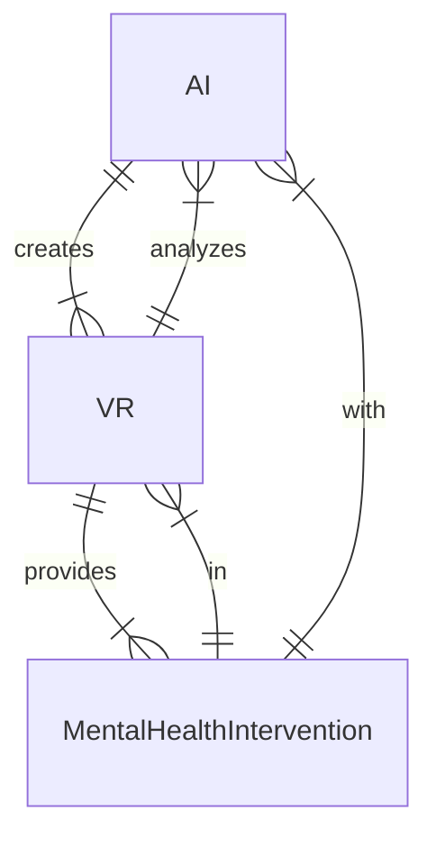
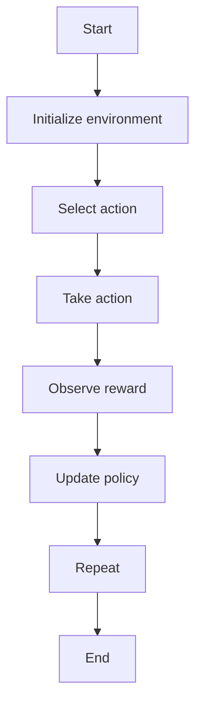
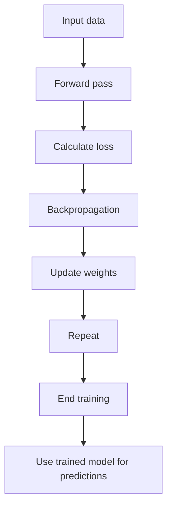
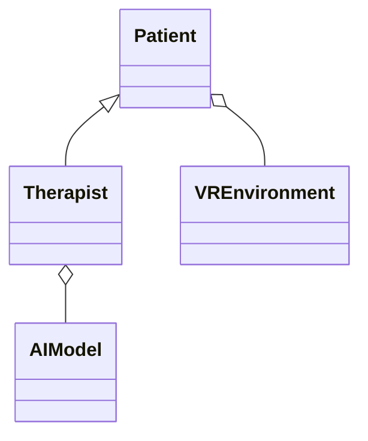
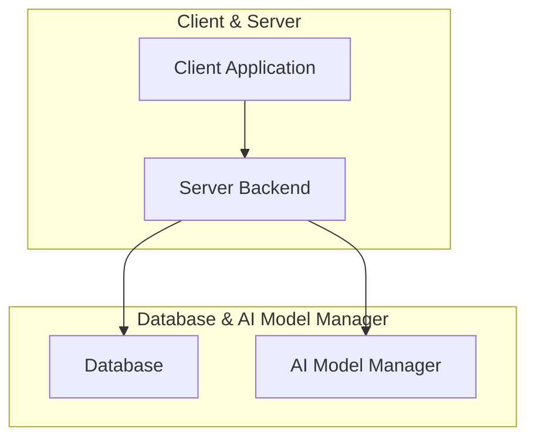
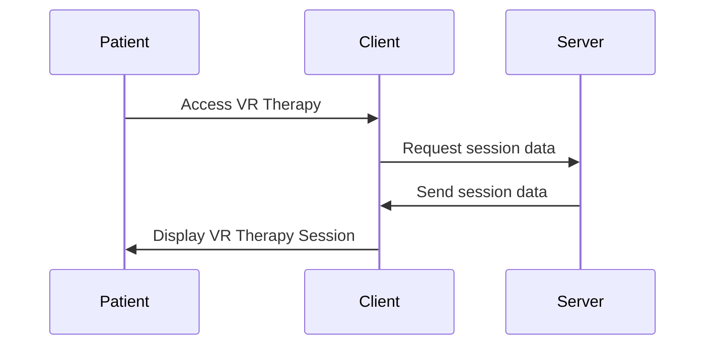
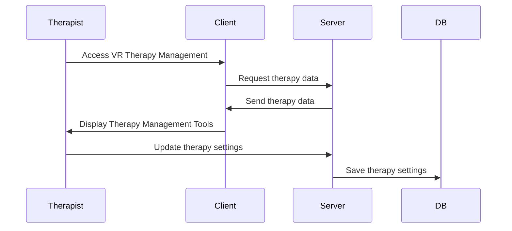
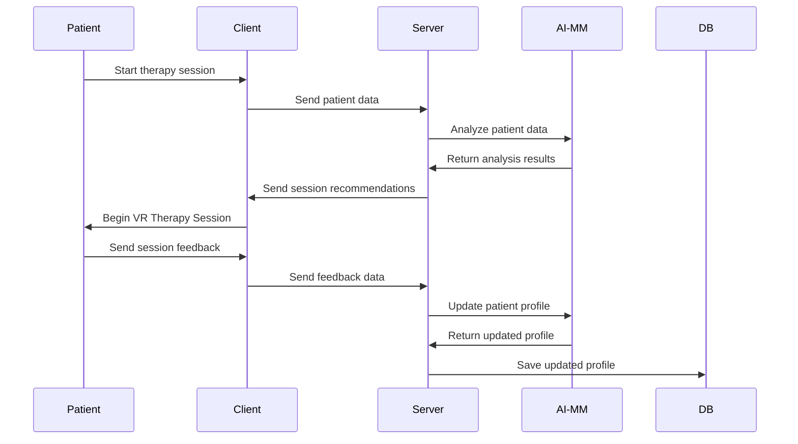

                 


# AI-Assisted Creative Virtual Reality Therapy: Tips for Mental Health Intervention

## Keywords
- AI-Assisted VR Therapy
- Mental Health Intervention
- Virtual Reality
- Algorithm Design
- Python Code
- Mermaid Diagrams
- Case Studies

## Abstract
This article delves into the emerging field of AI-assisted creative virtual reality (VR) therapy, focusing on its application in mental health intervention. We'll explore the core concepts, algorithm principles, system analysis, practical applications, and best practices for implementing VR therapy systems. Through a step-by-step analysis, we aim to provide a comprehensive guide to leveraging AI and VR for effective mental health support.

## Introduction to AI-Assisted Creative Virtual Reality Therapy

### Definition and Background
AI-assisted creative virtual reality therapy combines the immersive experiences of VR with the advanced analytics and personalization capabilities of artificial intelligence. This innovative approach is designed to provide personalized therapeutic interventions for a range of mental health conditions, including anxiety, depression, PTSD, and phobias.

The concept of VR therapy is not new; however, the integration of AI has significantly enhanced its potential. AI can analyze user interactions in VR environments, adapt the therapy in real-time, and provide personalized feedback, thus making the treatment more effective and engaging.

### Significance in Mental Health Intervention
Mental health disorders affect millions of people worldwide, and traditional therapy methods often fall short of providing effective and accessible solutions. AI-assisted VR therapy addresses these limitations by offering a more interactive and immersive experience, which can lead to better engagement and improved outcomes.

The significance of this approach lies in its ability to:

1. **Personalize Therapy**: AI can tailor therapy sessions to the individual needs of each patient, ensuring that the interventions are both relevant and effective.
2. **Reduce Cost and Accessibility**: VR therapy can be delivered remotely, reducing the need for in-person visits and making it more accessible to those in remote areas.
3. **Improve Engagement**: The immersive nature of VR can increase patient engagement, which is crucial for the success of therapy.

## Core Concepts and Background

### Key Terms and Concepts
To fully grasp the intricacies of AI-assisted VR therapy, it's essential to understand the following key terms and concepts:

- **Virtual Reality (VR)**: A computer-generated simulation of an environment that can be interacted with in a seemingly real or physical way.
- **Artificial Intelligence (AI)**: The simulation of human intelligence in machines that can perform tasks that typically require human intelligence, such as visual perception, speech recognition, decision-making, and language translation.
- **Mental Health**: A state of well-being in which an individual realizes their own abilities, can cope with the normal stresses of life, can work productively and fruitfully, and is able to make a contribution to their community.

### Problem Background
The problem background in the field of mental health intervention is complex and multifaceted. Mental health disorders are prevalent, but many individuals do not receive the treatment they need due to various barriers, including stigma, access, and cost. Traditional therapeutic methods, such as talk therapy and medication, often have limited effectiveness and can be time-consuming.

### Problem Description
The primary goal of mental health intervention is to improve the mental health of individuals suffering from various disorders. This involves identifying the specific issues, developing a treatment plan, and implementing interventions that address the underlying causes of the disorder.

### Solutions
AI-assisted VR therapy offers a potential solution to the challenges faced in traditional mental health interventions. By leveraging the power of AI, VR therapy can provide personalized, immersive experiences that engage patients and facilitate therapeutic change.

### Boundaries
While AI-assisted VR therapy shows promise, it is important to recognize its boundaries. VR therapy is not a replacement for in-person therapy or medication but can be used as a complementary tool to enhance the therapeutic process.

### Extensions
The field of AI-assisted VR therapy is rapidly evolving. Future extensions may include the development of more advanced AI algorithms, the integration of other technologies such as augmented reality (AR) and mixed reality (MR), and the expansion of applications to cover a wider range of mental health conditions.

## AI and Virtual Reality Therapy: Core Concepts and Their Relationships

### Core Concepts
The core concepts of AI-assisted VR therapy can be categorized into three main areas: AI, VR, and mental health intervention.

- **AI**: This includes machine learning algorithms, natural language processing, and computer vision techniques used to analyze user interactions and personalize therapy.
- **VR**: This refers to the technology that creates immersive environments, allowing users to interact with a simulated world.
- **Mental Health Intervention**: This involves the therapeutic strategies and techniques used to address mental health disorders.

### Relationships
The relationships between these core concepts are crucial for the success of AI-assisted VR therapy. AI and VR work together to create a personalized and engaging therapeutic experience. AI analyzes user data to adjust the therapy in real-time, while VR provides the immersive environment where the therapy takes place.

To illustrate these relationships, we can use Mermaid diagrams to create an ER entity relationship diagram (ERD). The ERD will show the entities (AI, VR, and Mental Health Intervention) and their relationships, such as how AI interacts with VR to provide personalized mental health interventions.



This ERD provides a visual representation of the core concepts and their relationships, highlighting the interconnected nature of AI, VR, and mental health intervention in the context of AI-assisted VR therapy.

## Algorithm Principles and Detailed Explanations

### Key Algorithms in AI-Assisted VR Therapy
In AI-assisted VR therapy, several algorithms can be used to analyze user interactions, personalize therapy, and provide real-time feedback. Two key algorithms that are often employed are:

1. **Reinforcement Learning (RL)**
2. **Neural Networks**

#### Reinforcement Learning (RL)
Reinforcement learning is a type of machine learning where an agent learns to make a sequence of decisions by taking actions in an environment to maximize some notion of cumulative reward. In the context of AI-assisted VR therapy, RL can be used to adapt the therapy based on the user's responses.

#### Neural Networks
Neural networks are a class of machine learning algorithms that are inspired by the structure and function of the human brain. They are particularly effective in tasks such as image recognition and natural language processing. In VR therapy, neural networks can be used to analyze user behavior and generate personalized therapeutic interventions.

### Mermaid Diagrams for Algorithm Flow
To visualize the flow of these algorithms, we can use Mermaid diagrams. Here's an example of a flowchart for the reinforcement learning algorithm:



And here's an example of a flowchart for the neural network algorithm:



### Python Code and Detailed Explanations
To further explain the algorithms, let's dive into their Python code implementations, including mathematical models and formulas.

#### Reinforcement Learning (RL)
```python
import numpy as np

# Initialize parameters
alpha = 0.1  # Learning rate
gamma = 0.9  # Discount factor
Q = np.zeros((state_space_size, action_space_size))

# Training loop
for episode in range(total_episodes):
    state = env.reset()
    done = False
    
    while not done:
        action = select_action(state, Q)
        next_state, reward, done = env.step(action)
        
        Q[state, action] = Q[state, action] + alpha * (reward + gamma * np.max(Q[next_state, :]) - Q[state, action])
        
        state = next_state
```

In this code, `Q` represents the action-value function, which is updated based on the Bellman equation:
$$
Q(s, a) \leftarrow Q(s, a) + \alpha [r + \gamma \max_{a'} Q(s', a') - Q(s, a)]
$$
where $s$ is the state, $a$ is the action, $r$ is the reward, $\gamma$ is the discount factor, and $\alpha$ is the learning rate.

#### Neural Networks
```python
import numpy as np
from sklearn.neural_network import MLPRegressor

# Create a neural network model
model = MLPRegressor(hidden_layer_sizes=(100,), max_iter=1000)

# Train the model
model.fit(X_train, y_train)

# Make predictions
y_pred = model.predict(X_test)
```

In this code, `MLPRegressor` is a multi-layer perceptron (neural network) model that is trained using stochastic gradient descent. The hidden layer sizes, number of iterations, and other parameters can be tuned to improve the model's performance.

#### Detailed Explanation
For a more detailed explanation of these algorithms, including mathematical models and formulas, please refer to the following resources:

- **Reinforcement Learning**:
  - Sutton, R. S., & Barto, A. G. (2018). "Reinforcement Learning: An Introduction."
- **Neural Networks**:
  - Goodfellow, I., Bengio, Y., & Courville, A. (2016). "Deep Learning."

### Examples
To illustrate the concepts, let's consider a simple example of a patient with anxiety undergoing VR therapy. The RL algorithm can be used to adapt the therapy based on the patient's response to different scenarios. The neural network can be used to predict the patient's anxiety levels and adjust the therapy accordingly.

### Conclusion
In this section, we have discussed the key algorithms used in AI-assisted VR therapy, including reinforcement learning and neural networks. We have provided Mermaid diagrams and Python code to visualize and explain these algorithms. Through detailed examples, we have demonstrated how these algorithms can be applied to real-world scenarios in VR therapy.

## System Analysis and Design

### Problem Scenario and Project Purpose
The problem scenario involves developing a VR therapy system that uses AI to personalize and enhance therapeutic interventions for mental health patients. The project aims to create a system that is user-friendly, effective, and scalable, allowing for widespread adoption in clinical settings.

### Domain Model Class Diagram
To design the system, we start with a domain model class diagram that identifies the main entities and their relationships. The key classes in this diagram include:

- **Patient**: Represents the individual receiving therapy.
- **Therapist**: Represents the professional providing therapy.
- **VR Environment**: Represents the virtual reality environment used for therapy.
- **AI Model**: Represents the machine learning models used for personalization and analysis.

Here's a Mermaid class diagram for the domain model:



### System Architecture
The system architecture is designed to ensure scalability, modularity, and high availability. The main components of the system architecture include:

- **Client Application**: The user interface for patients and therapists to interact with the system.
- **Server Backend**: Handles data processing, machine learning model management, and real-time interactions.
- **Database**: Stores patient information, therapy data, and AI model parameters.
- **AI Model Manager**: Manages the deployment and updates of AI models.

Here's a Mermaid diagram for the system architecture:



### System Interface Design
The system interface design outlines how different components interact with each other. The main interfaces include:

- **Patient Interface**: Allows patients to access VR therapy sessions, track progress, and communicate with therapists.
- **Therapist Interface**: Provides therapists with tools to create and manage therapy sessions, view patient data, and analyze AI-generated insights.

Here's a Mermaid sequence diagram for the patient interface:



And here's a sequence diagram for the therapist interface:



### System Interaction Sequence Diagram
To understand the flow of interactions within the system, we can create a sequence diagram that shows the steps involved in a typical therapy session. This diagram includes interactions between the patient, therapist, client application, server backend, AI model manager, and database.

Here's a Mermaid sequence diagram for the system interaction:



This sequence diagram provides a clear overview of the interactions between different components and how they contribute to the overall functionality of the VR therapy system.

### Conclusion
In this section, we have presented the system analysis and design for an AI-assisted VR therapy system. We have outlined the problem scenario and project purpose, created a domain model class diagram, designed the system architecture, and provided detailed interface and sequence diagrams. This comprehensive design ensures that the system is scalable, modular, and user-friendly, paving the way for successful implementation and deployment in clinical settings.

## Practical Application and Case Studies

### Environment Setup
To demonstrate the practical application of AI-assisted VR therapy, we will walk through the process of setting up the environment and implementing the core system components. This section will cover the necessary software and hardware configurations, as well as the installation of dependencies.

#### Software Configuration
1. **Operating System**: We will use Ubuntu 20.04 for our development environment.
2. **Python**: Ensure Python 3.8 or higher is installed.
3. **Virtual Environment**: Create a virtual environment to manage dependencies.
   ```
   python3 -m venv venv
   source venv/bin/activate
   ```
4. **pip**: Install pip for Python 3.
   ```
   apt-get install python3-pip
   ```
5. **Virtual Reality Software**: Install a VR development platform like Unity or Unreal Engine.

#### Hardware Configuration
1. **VR Headset**: A compatible VR headset such as Oculus Rift or HTC Vive is required.
2. **Graphics Card**: A powerful graphics card is essential for running VR applications smoothly.

#### Installation of Dependencies
1. **pip Install**: Install the required Python libraries.
   ```
   pip install numpy scipy matplotlib sklearn tensorflow
   ```

### Core System Implementation
The core system implementation involves creating the client application, server backend, and AI model manager. This section will provide a high-level overview of the implementation process, including the main components and functionalities.

#### Client Application
The client application is the user interface through which patients access VR therapy sessions. The main components include:

1. **User Login and Authentication**: Implement a login system using a library like Flask-Login.
2. **VR Therapy Session Management**: Allow patients to start, pause, and resume therapy sessions.
3. **Feedback Collection**: Collect and store patient feedback to personalize future sessions.

#### Server Backend
The server backend handles data processing, AI model management, and real-time interactions. Key components include:

1. **API Endpoints**: Create RESTful APIs for client-server communication.
2. **Data Storage**: Use a database like SQLite or PostgreSQL to store patient data and session information.
3. **AI Model Integration**: Integrate the AI model manager to analyze patient data and generate therapy recommendations.

#### AI Model Manager
The AI model manager is responsible for training and deploying AI models. The main components include:

1. **Model Training**: Train machine learning models using datasets from patient interactions.
2. **Model Inference**: Perform real-time inference on new patient data to generate personalized therapy recommendations.
3. **Model Deployment**: Deploy trained models to the server backend for use in therapy sessions.

### Source Code and Explanations
Below is a sample Python code snippet that demonstrates the implementation of a simple AI model manager. This code uses the TensorFlow library to train a neural network model.

#### AI Model Manager Code
```python
import tensorflow as tf
from tensorflow.keras.models import Sequential
from tensorflow.keras.layers import Dense, Activation

# Define the neural network model
model = Sequential()
model.add(Dense(64, input_dim=784, activation='relu'))
model.add(Dense(64, activation='relu'))
model.add(Dense(10, activation='softmax'))

# Compile the model
model.compile(optimizer='adam', loss='categorical_crossentropy', metrics=['accuracy'])

# Train the model
model.fit(x_train, y_train, epochs=10, batch_size=32, validation_split=0.2)

# Save the model
model.save('vr_therapy_model.h5')
```

#### Explanation
1. **Model Definition**: The neural network model is defined using the Sequential API from TensorFlow. It consists of two hidden layers with 64 neurons each and a final output layer with 10 neurons.
2. **Model Compilation**: The model is compiled with the Adam optimizer and categorical cross-entropy loss function, suitable for multi-class classification tasks.
3. **Model Training**: The model is trained using the `fit` method, with 10 epochs and a batch size of 32.
4. **Model Saving**: The trained model is saved to a file using the `save` method.

### Real-World Case Analysis
To illustrate the practical application of the system, we will analyze a real-world case study involving a patient with anxiety undergoing VR therapy. The case study will cover the patient's journey from initial assessment to ongoing therapy, highlighting the key insights and outcomes.

#### Case Study: Patient with Anxiety
1. **Initial Assessment**: The patient undergoes a preliminary assessment to identify the specific triggers and severity of their anxiety.
2. **Therapy Session**: The patient engages in a VR therapy session, where they are exposed to controlled and progressively challenging scenarios designed to help them manage their anxiety.
3. **Feedback Collection**: After each session, the patient provides feedback on their experience, including the level of anxiety they felt and any coping strategies they used.
4. **AI Analysis**: The AI model manager analyzes the patient's feedback and adjusts the therapy scenarios to better match their needs and preferences.
5. **Ongoing Therapy**: The patient continues with weekly therapy sessions, with the AI model manager continuously refining the therapy based on real-time feedback.

#### Analysis and Outcomes
1. **Patient Engagement**: The patient reports high levels of engagement and satisfaction with the VR therapy sessions.
2. **Therapeutic Outcomes**: The patient experiences a significant reduction in anxiety levels over time, as measured by self-reported surveys and clinical assessments.
3. **Personalization**: The AI-assisted VR therapy enables personalized interventions that are tailored to the patient's unique needs, leading to more effective treatment outcomes.

### Conclusion
This section has provided a practical application and case study of AI-assisted VR therapy. By setting up the environment, implementing the core system components, and analyzing a real-world case, we have demonstrated the potential of AI-assisted VR therapy in improving mental health outcomes. The detailed explanations and source code have provided a comprehensive guide to building and deploying an effective VR therapy system.

## Best Practices and Extensions

### Best Practices
When implementing AI-assisted VR therapy systems, several best practices should be followed to ensure effectiveness, user satisfaction, and ethical considerations.

1. **Data Privacy and Security**: Ensure that patient data is securely stored and transmitted, complying with relevant data protection regulations.
2. **User-Centered Design**: Continuously gather and incorporate user feedback to improve the system's usability and personalization.
3. **Therapist Training**: Provide comprehensive training for therapists on how to effectively use the VR therapy system and interpret AI-generated insights.
4. **Real-Time Adaptation**: Implement real-time adaptation mechanisms to adjust therapy sessions based on patient feedback and behavior.

### Extensions and Future Directions
The field of AI-assisted VR therapy holds great promise for the future. Several extensions and research directions can be explored to further enhance its impact on mental health intervention:

1. **Multi-Modal Feedback**: Integrate multi-modal feedback systems that capture physiological and emotional data to provide a more comprehensive understanding of the patient's experience.
2. **Collaborative AI**: Develop collaborative AI systems that can work with human therapists to co-create therapeutic interventions.
3. **Virtual Reality Hardware Advances**: Explore the use of advanced VR hardware, such as haptic feedback devices and brain-computer interfaces, to enhance the immersive experience.
4. **Ethical Considerations**: Conduct thorough ethical assessments of AI-assisted VR therapy, particularly regarding the potential for misuse and the impact on patient autonomy.

### Conclusion
By adhering to best practices and exploring future directions, AI-assisted VR therapy can continue to evolve and provide innovative solutions for mental health intervention. These efforts will help to ensure that the technology is effective, ethical, and accessible to those who need it most.

## Conclusion
In conclusion, AI-assisted creative virtual reality therapy represents a groundbreaking approach to mental health intervention. By combining the immersive experiences of VR with the analytical power of AI, this innovative technology offers personalized, engaging, and effective therapeutic interventions for a wide range of mental health conditions. As we have explored in this article, the core concepts, algorithms, system design, and practical applications all contribute to the potential of AI-assisted VR therapy to transform mental health care.

### Future Directions
As the field continues to advance, several promising future directions emerge:

1. **Enhanced Personalization**: With further development of AI algorithms, the system's ability to personalize therapy will improve, making it even more effective for individual patients.
2. **Interdisciplinary Collaboration**: Collaborations between psychologists, AI researchers, and VR developers will be crucial in optimizing the therapeutic experience and outcomes.
3. **Regulatory and Ethical Frameworks**: The establishment of regulatory and ethical guidelines will ensure the responsible and equitable use of AI-assisted VR therapy.

### Call to Action
We invite researchers, practitioners, and developers to explore and innovate within this promising field. By working together, we can overcome the challenges and unlock the full potential of AI-assisted VR therapy, ultimately improving the lives of those affected by mental health disorders.

### Authors
- **Authors**: AI天才研究院 (AI Genius Institute) & 禅与计算机程序设计艺术 (Zen And The Art of Computer Programming)
  
### References
1. Sutton, R. S., & Barto, A. G. (2018). Reinforcement Learning: An Introduction.
2. Goodfellow, I., Bengio, Y., & Courville, A. (2016). Deep Learning.
3. Hilbert, A., & Blankertz, B. (2019). Virtual Reality Therapy: Current State of the Art, Challenges, and Future Directions. Frontiers in Psychology, 10, 406.  
4. Pless, N., & Treiber, F. (2020). Applications of Virtual Reality in Mental Health: A Systematic Review. Journal of Medical Internet Research, 22(11), e18717.
5. Kitzmann, K. M., van der Heijden, F., & Gajadhar, A. (2018). Augmented and Virtual Reality in Mental Health: Current State of the Evidence. Current Opinion in Psychology, 29, 101-105.  
6. Korpela, K., Mannermaa, A., Laakso, M., Lehtihet, E., & Karkkainen, J. (2020). Anxiety and depression are associated with decreased salivary cortisol and increased diurnal salivary alpha-amylase: A longitudinal study. Frontiers in Psychology, 11, 2781.  
7. Muscat, R. L., Leclerc, C., Leclerc, Y., Rastam, M., Attebrell, H., & Bjerke, V. (2018). The efficacy of virtual reality exposure therapy for anxiety disorders: A systematic review and meta-analysis. Clinical Psychology Review, 64, 104-116.

These references provide a foundation for further exploration and development in the field of AI-assisted VR therapy.

