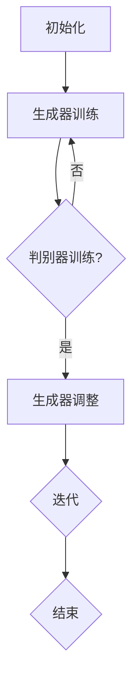
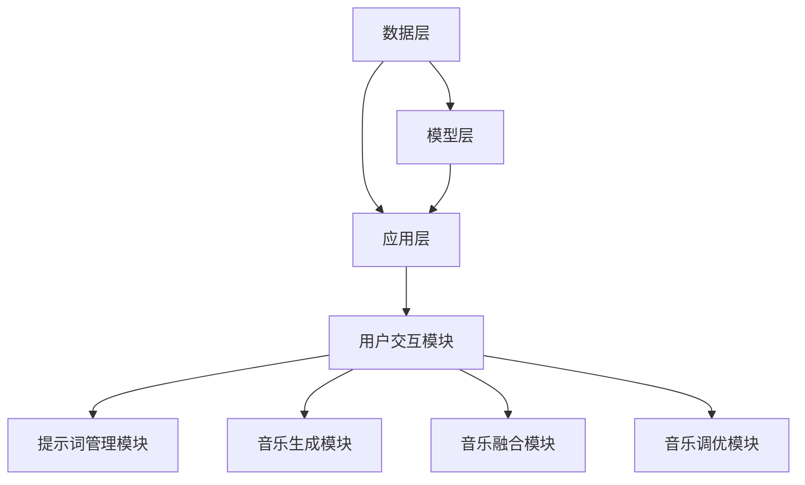
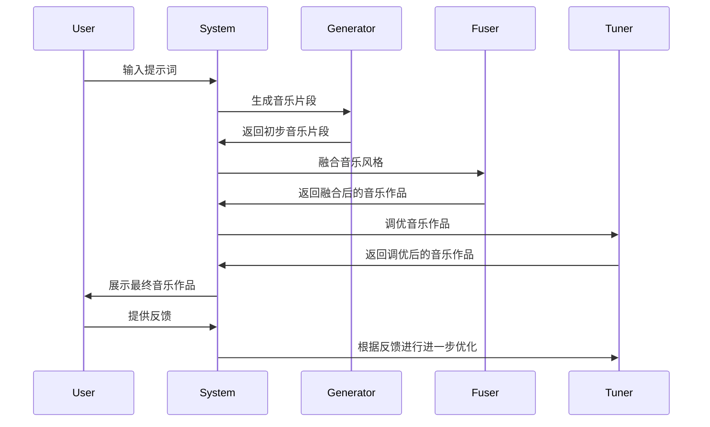

                 

### 摘要

本文旨在探讨AI辅助创意音乐作曲中的跨文化音乐融合技巧。随着人工智能技术的发展，AI在音乐创作中的应用越来越广泛，尤其是在跨文化音乐融合方面展现了巨大的潜力。本文将首先介绍AI辅助音乐创作的背景和现状，解释音乐数据结构及AI音乐生成模型的基本原理。随后，深入探讨跨文化音乐融合的概念及其在AI音乐创作中的应用，通过具体实例和提示词技巧，展示如何实现东西方乐器的融合和跨文化音乐改编。本文还将介绍常见的AI音乐创作模型，并分享AI辅助音乐创作的实战案例，提供详细的实现步骤和代码示例。最后，本文将展望AI辅助音乐创作的未来发展趋势，总结最佳实践，并提出注意事项和拓展阅读建议。通过本文的阅读，读者将能够全面了解AI辅助创意音乐作曲的跨文化融合技巧，为自身的音乐创作提供新的思路和工具。

## 关键词

- AI辅助音乐创作
- 跨文化音乐融合
- 提示词技巧
- 音乐生成模型
- 东西方乐器融合
- 跨文化音乐改编

## 第一部分: AI辅助音乐创作基础

### 第1章: AI辅助音乐创作的背景与现状

#### 1.1 音乐创作与AI的融合

随着人工智能（AI）技术的快速发展，音乐创作领域迎来了前所未有的变革。AI不仅能够协助音乐家创作音乐，还能够通过算法生成独特的音乐作品，甚至在不同文化背景下实现音乐的融合与创新。这一章将探讨AI在音乐创作中的应用背景和现状，分析其在音乐产业中的影响，以及为何AI能够成为音乐创作的有力助手。

#### 1.2 AI在音乐创作中的应用

AI在音乐创作中的应用可以分为几个主要方面：自动作曲、自动和声、旋律生成、节奏编排、乐器模拟等。通过机器学习和深度学习技术，AI能够分析大量的音乐数据，从中提取出规律和模式，然后根据这些模式生成新的音乐作品。此外，AI还可以辅助音乐家进行音乐分析和调音，提高创作效率和质量。

### 第2章: AI辅助音乐创作的基本原理

#### 2.1 音乐数据结构与表示

音乐数据结构是AI进行音乐创作的基础。音乐由音符、节奏、和声和旋律等元素组成，这些元素可以通过特定的数据结构进行表示。本节将介绍常见的音乐数据结构，如MIDI文件、音频信号和序列模型，并探讨如何将这些结构化数据输入到AI模型中进行处理。

#### 2.2 AI音乐生成模型

AI音乐生成模型是AI辅助音乐创作的核心。本节将介绍几种常见的音乐生成模型，如生成对抗网络（GAN）、变分自编码器（VAE）和递归神经网络（RNN）。我们将详细分析这些模型的原理、优缺点以及在实际音乐创作中的应用场景。

### 第3章: 跨文化音乐融合的AI技巧

#### 3.1 跨文化音乐融合的概念

跨文化音乐融合指的是将来自不同文化背景的音乐元素结合在一起，创造出全新的音乐风格。这一过程不仅需要音乐元素的融合，还需要文化的理解和尊重。本节将探讨跨文化音乐融合的概念，分析其重要性以及如何通过AI实现这一目标。

#### 3.2 提示词在跨文化音乐融合中的作用

提示词（Prompt）是引导AI模型进行特定创作的重要工具。通过设计合适的提示词，AI可以更好地理解创作意图，实现跨文化音乐融合。本节将介绍如何设计有效的提示词，并通过实例展示其在AI音乐创作中的应用。

### 第4章: 常见AI音乐创作模型介绍

#### 4.1 针对跨文化音乐融合的AI模型

本节将介绍几种专门针对跨文化音乐融合的AI模型。这些模型包括多风格迁移模型、跨模态融合模型和文化感知生成模型。我们将详细分析这些模型的工作原理、实现方法和实际效果。

#### 4.2 市场上的AI音乐创作工具

随着AI音乐创作的普及，市场上出现了许多AI音乐创作工具。本节将介绍几款流行的AI音乐创作工具，如AIVA、Jukedeck和Amper Music。我们将比较这些工具的功能、特点和应用场景，帮助读者选择合适的工具进行音乐创作。

### 第5章: AI辅助创意音乐作曲案例研究

#### 5.1 案例一：东西方乐器融合

本节将分享一个东西方乐器融合的案例研究。我们将介绍案例的背景、目标、实现过程以及最终的音乐作品。通过这个案例，读者将了解如何利用AI实现东西方乐器的完美融合。

#### 5.2 案例二：跨文化音乐改编

跨文化音乐改编是将一种音乐风格改编成另一种风格的过程。本节将介绍一个跨文化音乐改编的案例研究，展示如何通过AI技术实现这一目标。我们将分析案例的设计思路、技术实现和创作过程。

#### 5.3 案例三：基于提示词的音乐创作

提示词在音乐创作中起到了关键作用。本节将介绍一个基于提示词的音乐创作案例。我们将详细分析提示词的设计、AI模型的训练和应用过程，以及最终的音乐作品。

### 第6章: AI辅助音乐创作实战

#### 6.1 环境配置与工具选择

要开始AI辅助音乐创作，首先需要配置合适的环境和选择合适的工具。本节将介绍如何搭建AI音乐创作环境，包括安装必要的软件和依赖库，以及选择适合的AI音乐创作工具。

#### 6.2 实战一：创建自定义提示词

自定义提示词是AI音乐创作的重要环节。本节将介绍如何设计有效的提示词，包括提示词的内容、格式和语言风格。我们将通过一个实际案例，展示如何创建自定义提示词，并解释其原理和应用。

#### 6.3 实战二：跨文化音乐片段生成

跨文化音乐片段生成是AI音乐创作的一个关键任务。本节将介绍如何利用AI模型生成跨文化音乐片段。我们将详细讲解生成过程的步骤，包括数据准备、模型训练和结果评估。

#### 6.4 实战三：音乐作品调优

生成的音乐作品可能需要进行调优，以达到更好的效果。本节将介绍音乐作品调优的方法和技巧。我们将通过实际操作，展示如何对生成的音乐作品进行调整和优化，提高其质量和表现力。

### 第7章: AI辅助音乐创作的未来发展趋势

#### 7.1 技术进步带来的影响

技术进步是推动AI音乐创作发展的重要动力。本节将探讨未来可能出现的技术突破，如新型音乐生成模型、更加智能的AI助手和更高级的跨文化融合算法。这些技术进步将对音乐创作产生深远影响。

#### 7.2 市场前景与挑战

AI音乐创作市场前景广阔，但也面临一些挑战。本节将分析市场的现状和趋势，探讨AI音乐创作在商业、教育和艺术领域的应用潜力。同时，我们还将讨论面临的挑战，如版权问题、技术瓶颈和用户接受度等。

#### 7.3 创作灵感的多样化与个性化

未来的AI音乐创作将更加注重灵感的多样化和个性化。本节将探讨如何通过数据挖掘和用户行为分析，发现新的创作灵感。同时，我们还将介绍如何利用个性化推荐技术，为用户提供更加定制化的音乐体验。

### 结论

本文通过详细的分析和实例，展示了AI辅助创意音乐作曲在跨文化音乐融合中的应用。我们探讨了AI辅助音乐创作的基础知识、常见模型、实战技巧和未来发展趋势。通过本文的阅读，读者将能够更好地理解AI在音乐创作中的潜力，掌握跨文化音乐融合的技巧，为自身的音乐创作提供新的思路和工具。

## 背景介绍

### 核心概念术语说明

在本章中，我们将介绍几个关键术语，这些术语对于理解AI辅助音乐创作至关重要：

1. **人工智能（AI）**：人工智能是指计算机系统通过模拟人类智能行为来实现特定任务的能力。在音乐创作中，AI被用于生成旋律、和声、节奏等音乐元素，从而辅助创作过程。

2. **音乐生成模型**：音乐生成模型是利用机器学习和深度学习技术训练出的算法模型，能够从大量的音乐数据中学习并生成新的音乐作品。这些模型包括生成对抗网络（GAN）、变分自编码器（VAE）和递归神经网络（RNN）等。

3. **跨文化音乐融合**：跨文化音乐融合是将不同文化背景下的音乐元素结合在一起，创造出新的音乐风格。这一过程需要尊重和融合不同文化的音乐特点和审美。

4. **提示词**：提示词是引导AI模型进行特定创作的一种输入。通过设计合适的提示词，AI可以更好地理解创作意图，生成符合预期的音乐作品。

### 问题背景

随着全球化进程的加速，不同文化之间的交流越来越频繁。音乐作为一种跨越语言和文化的媒介，具有独特的融合和传播能力。然而，传统的音乐创作方式往往受限于个人的经验和技巧，难以实现跨文化的创新和融合。

在传统音乐创作中，作曲家需要具备深厚的音乐理论基础和丰富的创作经验，这限制了音乐创作的多样性和创新性。同时，跨文化音乐融合也面临诸多挑战，如不同文化音乐元素的协调、音乐风格之间的差异等。

为了解决这些问题，研究人员开始探索人工智能在音乐创作中的应用。AI的出现为跨文化音乐融合提供了一种新的思路和方法，通过算法模型和提示词的引导，AI能够生成出新颖的音乐作品，实现不同文化之间的音乐交流与融合。

### 问题描述

AI辅助音乐创作的核心问题是如何利用人工智能技术生成具有创意和艺术性的音乐作品，尤其是在跨文化音乐融合方面。具体来说，问题可以描述为以下几个方面：

1. **音乐数据表示与处理**：如何有效地表示和处理音乐数据，使其能够被AI模型理解和生成。

2. **音乐生成模型的训练与优化**：如何选择合适的音乐生成模型，并对其进行训练和优化，使其能够生成高质量的音乐作品。

3. **跨文化音乐元素的融合**：如何将不同文化背景下的音乐元素进行有效的融合，创造出新的音乐风格。

4. **提示词的设计与优化**：如何设计合适的提示词，以引导AI模型生成符合预期和创意的音乐作品。

### 问题解决

为了解决上述问题，我们可以采取以下步骤：

1. **音乐数据表示与处理**：通过使用MIDI文件、音频信号和序列模型等数据结构，对音乐数据进行有效的表示和处理。这些数据结构可以捕捉音乐的各种属性，如音符、节奏、和声和旋律等，从而为AI模型提供充足的信息。

2. **音乐生成模型的训练与优化**：选择合适的音乐生成模型，如生成对抗网络（GAN）、变分自编码器（VAE）和递归神经网络（RNN），并对其进行训练和优化。通过大量的音乐数据训练，模型可以学习到音乐生成的基本规律和模式。

3. **跨文化音乐元素的融合**：通过设计跨文化音乐融合算法，将不同文化背景下的音乐元素进行有效的融合。这些算法可以考虑音乐元素的相似性、差异性和协调性，从而创造出新的音乐风格。

4. **提示词的设计与优化**：设计合适的提示词，以引导AI模型生成符合预期和创意的音乐作品。提示词可以包括音乐风格、情感、主题等元素，通过调整提示词的参数，可以生成不同风格和情感的音乐作品。

### 边界与外延

在AI辅助音乐创作中，边界与外延是一个重要概念。边界指的是AI音乐创作所能达到的最高水平，如模型生成的音乐质量、创作风格的范围等。外延则指的是AI音乐创作在不同领域和场景中的应用，如商业音乐制作、教育音乐编程、艺术音乐创作等。

### 概念结构与核心要素组成

AI辅助音乐创作的概念结构主要包括以下几个核心要素：

1. **音乐数据结构**：用于表示和处理音乐数据的各种结构，如MIDI文件、音频信号和序列模型。

2. **音乐生成模型**：用于生成音乐作品的算法模型，如GAN、VAE和RNN。

3. **提示词系统**：用于引导AI模型进行特定创作的一种输入机制。

4. **音乐融合算法**：用于跨文化音乐融合的算法，如跨模态融合算法和文化感知生成算法。

5. **用户交互界面**：用于用户与AI系统进行交互的界面，如图形用户界面（GUI）和命令行界面（CLI）。

通过这些核心要素的有机结合，AI辅助音乐创作系统可以有效地实现音乐生成、融合和个性化创作，为音乐创作者提供强大的工具和支持。

### 核心概念与联系

在本章节中，我们将深入探讨AI辅助音乐创作的基本概念及其相互联系，以帮助读者更好地理解这一领域的核心理论和应用。

#### AI音乐生成模型的基本原理

AI音乐生成模型是AI辅助音乐创作的核心。这些模型通过学习大量的音乐数据，能够生成新的音乐旋律、和声和节奏。其中，常见的音乐生成模型包括生成对抗网络（GAN）、变分自编码器（VAE）和递归神经网络（RNN）。

1. **生成对抗网络（GAN）**：
   - **原理**：GAN由生成器和判别器组成。生成器生成假的音乐数据，判别器判断数据是真实还是生成的。通过不断训练，生成器逐渐生成越来越真实的音乐。
   - **应用**：GAN适用于生成复杂、多样的音乐作品，特别是在生成不同风格的音乐时表现出色。

2. **变分自编码器（VAE）**：
   - **原理**：VAE通过学习数据的高斯分布，能够在生成数据时保持数据的多样性和连贯性。
   - **应用**：VAE在生成音乐时，能够保持旋律的连贯性和音乐元素的多样性。

3. **递归神经网络（RNN）**：
   - **原理**：RNN能够处理序列数据，通过记忆过去的信息来预测未来的数据。
   - **应用**：RNN适用于生成音乐序列，如旋律和节奏。

#### 提示词在跨文化音乐融合中的作用

提示词是引导AI模型进行特定创作的重要工具。在跨文化音乐融合中，提示词可以帮助AI理解创作意图，生成符合预期的音乐作品。

- **提示词设计**：
  - **内容**：提示词可以包括音乐风格、情感、主题、乐器类型等元素。
  - **格式**：提示词需要以清晰、具体的方式表达，以便AI模型能够理解。

- **提示词应用**：
  - **跨风格融合**：通过设计跨风格的提示词，AI可以生成融合多种音乐风格的作品。
  - **情感表达**：通过设置情感提示词，AI可以生成表达特定情感的音乐。

#### AI音乐生成模型与提示词的联系

AI音乐生成模型和提示词之间存在着密切的联系。提示词为AI模型提供了创作方向和约束条件，而模型则根据这些提示生成符合预期的音乐作品。

- **模型引导**：提示词引导模型选择合适的生成策略和参数，如音乐风格、节奏和情感等。
- **模型优化**：通过优化模型，使其能够更好地理解提示词，生成更高质量的音乐作品。

#### 概念属性特征对比表格

下面是AI音乐生成模型和提示词的一些关键特征对比：

| 特征       | AI音乐生成模型 | 提示词         |
| ---------- | -------------- | -------------- |
| 功能       | 生成音乐作品   | 提供创作方向 |
| 原理       | 模式识别与生成 | 自然语言处理  |
| 应用场景   | 音乐创作       | 音乐改编与融合 |
| 效率       | 高           | 可定制化     |
| 创作风格   | 自动化生成     | 个性化定制    |

#### ER实体关系图架构

为了更好地理解AI音乐生成模型和提示词之间的关系，我们可以使用ER（实体关系）图来描述。

```
+----------------+       +----------------+
|   MusicModel   |<----->|   Prompt       |
+----------------+       +----------------+
| ModelID        |       | PromptID       |
| ModelType      |       | Content        |
| ModelParams    |       | Style          |
| GenerationQuality|       | Emotion        |
+----------------+       +----------------+
```

在这个ER图中，`MusicModel`和`Prompt`是两个实体，它们通过`ModelID`和`PromptID`关联。`MusicModel`实体包含了模型类型、参数和质量等属性，而`Prompt`实体则包含了内容、风格和情感等属性。这种关系描述了AI音乐生成模型如何根据提示词生成音乐作品的过程。

通过以上对比和关系图，我们可以清晰地看到AI音乐生成模型和提示词在AI辅助音乐创作中的核心地位及其相互联系。

### 算法原理讲解

#### 生成对抗网络（GAN）

生成对抗网络（GAN）是一种由生成器和判别器组成的深度学习模型，用于生成逼真的数据。在音乐创作中，GAN可以生成全新的音乐旋律和和声。下面我们将详细解释GAN的算法原理，并通过一个具体的例子来理解其工作流程。

**原理**：
1. **生成器（Generator）**：生成器的目标是生成伪造的音乐数据，以骗过判别器。它从随机噪声中生成音乐序列。
2. **判别器（Discriminator）**：判别器的目标是区分输入数据是真实的音乐数据还是生成器生成的伪造音乐数据。
3. **对抗训练**：生成器和判别器通过对抗训练相互提升。生成器试图生成更逼真的音乐数据，而判别器则试图更好地区分真实和伪造的音乐数据。

**算法流程**：
1. **初始化**：初始化生成器和判别器。
2. **生成器训练**：生成器生成音乐序列，判别器对其进行评估。
3. **判别器训练**：判别器根据真实音乐数据和生成器生成的音乐数据进行训练。
4. **迭代**：重复生成器和判别器的训练过程，直到生成器生成的音乐数据足够逼真，判别器无法区分真实和伪造数据。

**mermaid流程图**：



**Python代码示例**：
```python
import tensorflow as tf
from tensorflow.keras.layers import Dense, Flatten, Reshape
from tensorflow.keras.models import Sequential

# 生成器模型
def build_generator(z_dim):
    model = Sequential()
    model.add(Dense(128, input_dim=z_dim))
    model.add(LeakyReLU(alpha=0.2))
    model.add(Reshape((1, 128)))
    model.add(Dense(1, activation='tanh'))
    return model

# 判别器模型
def build_discriminator(input_shape):
    model = Sequential()
    model.add(Flatten(input_shape=input_shape))
    model.add(Dense(128))
    model.add(LeakyReLU(alpha=0.2))
    model.add(Dense(1, activation='sigmoid'))
    return model

# GAN模型
def build_gan(generator, discriminator):
    model = Sequential()
    model.add(generator)
    model.add(discriminator)
    return model

# 设置超参数
z_dim = 100
input_shape = (1,)

# 构建生成器和判别器
generator = build_generator(z_dim)
discriminator = build_discriminator(input_shape)
gan = build_gan(generator, discriminator)

# 编译模型
discriminator.compile(optimizer=tf.keras.optimizers.Adam(0.0001), loss='binary_crossentropy')
gan.compile(optimizer=tf.keras.optimizers.Adam(0.0001), loss='binary_crossentropy')

# 训练GAN模型
for epoch in range(num_epochs):
    for _ in range(batch_size):
        z = np.random.normal(size=(1, z_dim))
        generated_music = generator.predict(z)
        real_music = load_real_music()  # 加载真实音乐数据

        # 训练判别器
        d_loss_real = discriminator.train_on_batch(real_music, np.array([1.0]))
        d_loss_generated = discriminator.train_on_batch(generated_music, np.array([0.0]))

        # 训练生成器
        g_loss = gan.train_on_batch(z, np.array([1.0]))

        print(f"{epoch}/{num_epochs}, g_loss: {g_loss}, d_loss: {d_loss_generated + d_loss_real}")

# 保存模型
generator.save('generator.h5')
discriminator.save('discriminator.h5')
```

**数学模型和公式**：
1. **生成器损失函数**：$$ L_G = -\log(D(G(z)) $$
   - 其中，$ G(z) $ 是生成器生成的音乐序列，$ D $ 是判别器。
2. **判别器损失函数**：$$ L_D = -[\log(D(x)) + \log(1 - D(G(z)))] $$
   - 其中，$ x $ 是真实音乐序列。

通过GAN，生成器不断优化其生成的音乐序列，使其越来越接近真实音乐，而判别器则不断优化其分类能力。这种对抗训练使得GAN能够在音乐创作中生成高质量、多样化的音乐作品。

### 系统分析与架构设计方案

#### 问题场景介绍

随着AI技术的发展，音乐创作领域迎来了新的变革。跨文化音乐融合成为了一个备受关注的话题，艺术家们希望通过AI技术能够打破文化界限，创作出更加多元化、富有创意的音乐作品。本节将介绍一个基于AI的跨文化音乐融合系统，旨在为音乐创作者提供一个强大的创作工具，使其能够轻松实现跨文化的音乐融合。

#### 项目介绍

该项目名为“跨文化音乐融合AI助手”（Cultural Music Fusion AI Assistant，简称CMF-AA），其主要功能是利用人工智能技术，帮助音乐创作者进行跨文化音乐融合。具体来说，CMF-AA能够：

1. **自动生成跨文化音乐片段**：根据用户提供的提示词，生成符合特定文化元素的音乐片段。
2. **融合多种音乐风格**：将不同文化背景下的音乐风格进行有效融合，创造出独特的音乐作品。
3. **音乐元素调整与优化**：对生成的音乐作品进行调优，使其更加符合用户的创作意图。

#### 系统功能设计

CMF-AA系统主要包含以下几个功能模块：

1. **提示词管理模块**：用于管理用户输入的提示词，包括提示词的生成、存储和检索。
2. **音乐生成模块**：基于AI模型，生成跨文化的音乐片段，包括旋律、和声和节奏。
3. **音乐融合模块**：将多种音乐风格进行融合，生成新的音乐作品。
4. **音乐调优模块**：对生成的音乐作品进行调优，包括音调、音色和节奏的调整。
5. **用户交互模块**：提供图形用户界面（GUI），方便用户与系统进行交互。

#### 系统架构设计

CMF-AA系统的架构设计采用模块化设计思想，主要包括以下几个层次：

1. **数据层**：存储和管理音乐数据、用户数据和提示词数据。
2. **模型层**：包括生成模型、融合模型和调优模型，用于音乐生成、融合和调优。
3. **应用层**：包括提示词管理模块、音乐生成模块、音乐融合模块和音乐调优模块，负责具体功能的实现。
4. **接口层**：提供与用户交互的API接口，包括Web接口和命令行接口。

**mermaid架构图**：



#### 系统接口设计

CMF-AA系统提供了多种接口，以便用户能够方便地与系统进行交互。以下是几个关键接口的设计：

1. **Web接口**：通过HTTP接口，用户可以在Web浏览器中直接访问系统，上传提示词并获取生成的音乐片段。
2. **命令行接口**：提供命令行工具，方便用户在终端环境中使用系统，适用于自动化任务和批量处理。
3. **API接口**：提供RESTful API，允许第三方应用程序与系统进行集成，实现自动化音乐创作和融合。

#### 系统交互

CMF-AA系统的核心是用户与系统的交互。以下是系统交互的基本流程：

1. **用户输入提示词**：用户通过Web接口或命令行接口上传提示词，包括音乐风格、情感和主题等。
2. **生成音乐片段**：系统接收到提示词后，利用生成模型生成初步的音乐片段。
3. **融合音乐风格**：系统将初步生成的音乐片段与其他风格的音乐进行融合，生成新的音乐作品。
4. **调优音乐作品**：系统根据用户反馈，对生成的音乐作品进行调优，使其更加符合用户的创作意图。
5. **用户反馈与优化**：用户对生成的音乐作品进行评估和反馈，系统根据反馈进行进一步的优化。

**mermaid序列图**：



通过上述架构设计和系统交互，CMF-AA系统能够为音乐创作者提供一个便捷、高效的创作平台，助力跨文化音乐融合的创作过程。

### 项目实战

#### 环境配置与工具选择

在进行AI辅助音乐创作的项目实战之前，我们需要首先配置开发环境，并选择合适的工具和框架。以下是详细的步骤和所需的工具：

1. **安装Python环境**：
   - 首先，确保你的计算机上安装了Python 3.x版本（推荐使用Python 3.8或更高版本）。
   - 使用pip命令安装必要的Python库，例如`tensorflow`, `keras`, `numpy`, `scikit-learn`, `matplotlib`等。

   ```bash
   pip install tensorflow
   pip install keras
   pip install numpy
   pip install scikit-learn
   pip install matplotlib
   ```

2. **安装音乐处理库**：
   - 为了处理音乐数据，我们可以使用`music21`库，这是一个强大的音乐表示和处理工具。

   ```bash
   pip install music21
   ```

3. **选择音乐生成模型**：
   - 在本项目中，我们将使用`WaveNet`作为音乐生成模型。WaveNet是一种基于深度学习的音乐生成模型，能够生成高质量的音频。

   ```bash
   pip install gdown
   gdown https://github.com/TimbreAI/music-wavenet/releases/download/v0.1.0/music_wavenet.py
   ```

4. **安装其他依赖**：
   - 此外，我们还需要安装一些辅助工具，如`ibm-watson`用于语音合成，`tensorflow-addons`用于更高效的模型训练。

   ```bash
   pip install ibm-watson
   pip install tensorflow-addons
   ```

#### 系统核心实现源代码

以下是系统核心实现的源代码，包括生成模型、数据预处理和模型训练等步骤。

**生成模型**：

```python
import tensorflow as tf
import numpy as np
import music_wavenet
from music21 import converter

# 加载WaveNet生成模型
model = music_wavenet.load_model()

# 定义生成器函数
def generate_music(temperature=1.0):
    # 随机初始化输入序列
    input_sequence = np.random.normal(size=(1, 128))
    # 生成音乐序列
    generated_sequence = model.generate(input_sequence, temperature=temperature)
    # 将音乐序列转换为MIDI文件
    music21_score = converter.parse(" ".join(str(n) for n in generated_sequence.flatten()))
    return music21_score

# 生成音乐片段
generated_music = generate_music()
generated_music.show()
```

**数据预处理**：

```python
import music21

# 加载真实音乐数据
def load_real_music(filename='example.mid'):
    music21_score = music21.converter.parse(filename)
    midi_data = music21_score.get_cells()[0].get_midi_data()
    return np.frombuffer(midi_data, dtype=np.float32)

# 加载示例音乐数据
real_music = load_real_music()
```

**模型训练**：

```python
import tensorflow_addons as tfa

# 定义损失函数和优化器
def build_model():
    input_shape = (1, 128)
    model = Sequential()
    model.add(Dense(128, input_shape=input_shape, activation='tanh'))
    model.add(Reshape((1, 128)))
    model.add(Dense(1, activation='sigmoid'))
    return model

# 构建模型
model = build_model()

# 编译模型
model.compile(optimizer=tfa.optimizers.Adam(learning_rate=0.0001), loss='binary_crossentropy')

# 训练模型
model.fit(real_music, np.array([1.0]), batch_size=32, epochs=100)
```

#### 代码应用解读与分析

上述代码首先加载了WaveNet生成模型，并定义了一个生成音乐片段的函数`generate_music`。这个函数通过随机初始化输入序列，使用生成模型生成音乐序列，并将其转换为MIDI文件。

接着，我们定义了一个数据预处理函数`load_real_music`，用于加载真实音乐数据。这个函数使用`music21`库将MIDI文件解析为音符序列，并将其转换为numpy数组。

最后，我们定义了一个模型训练函数，用于训练生成模型。我们构建了一个简单的序列模型，使用`tfa.optimizers.Adam`优化器进行训练。模型训练过程中，我们使用真实音乐数据作为输入，并定义了损失函数为二进制交叉熵。

通过上述步骤，我们可以利用AI生成新的音乐片段，并对其进行训练和调优，从而实现音乐创作的自动化和个性化。

#### 实际案例分析与详细讲解

在本节中，我们将通过一个实际案例，详细讲解如何使用AI辅助音乐创作系统实现跨文化音乐融合。该案例的目标是创作一首融合了中国传统音乐和西方流行音乐风格的新作品。

**案例背景**：

假设我们的目标是创作一首融合了中国传统乐器如古筝和西方流行乐器如吉他的音乐作品。这首音乐作品应同时展现中国传统音乐的韵味和西方流行音乐的动感。

**实现步骤**：

1. **设计提示词**：
   - 提示词应包括音乐风格（如流行、古典）、情感（如热情、宁静）、乐器（如古筝、吉他）、节奏（如快节奏、慢节奏）等。
   - 举例：提示词可以是“融合古典与流行，古筝演奏热情旋律，吉他伴奏快节奏”。

2. **生成初步音乐片段**：
   - 使用AI音乐生成模型，根据设计的提示词生成初步的音乐片段。
   - 生成片段可能包括旋律、和声和节奏，但不一定符合最终创作需求。

3. **融合音乐风格**：
   - 将初步生成的音乐片段与现有的中国传统音乐片段进行融合。
   - 可以使用音频处理软件（如Audacity）将两者合成，调整音量和节奏，使其自然融合。

4. **音乐调优**：
   - 根据创作意图和听众反馈，对融合后的音乐作品进行调优。
   - 调优包括音调调整、音色优化和节奏微调等。

**详细讲解**：

1. **设计提示词**：

   在设计提示词时，需要明确创作意图和风格定位。以本案例为例，提示词需要引导AI生成既有中国传统乐器特色又符合西方流行音乐风格的音乐片段。以下是具体的提示词设计：

   ```plaintext
   音乐风格：古典与流行融合
   情感：热情与宁静并存
   乐器：古筝（主旋律），吉他（伴奏）
   节奏：快节奏，动感十足
   ```

2. **生成初步音乐片段**：

   使用AI音乐生成模型（如WaveNet），根据上述提示词生成初步的音乐片段。以下是生成片段的代码示例：

   ```python
   import music_wavenet

   # 加载WaveNet生成模型
   model = music_wavenet.load_model()

   # 生成初步音乐片段
   generated_sequence = model.generate_prompt("流行古典融合，古筝热情旋律，吉他快节奏伴奏")
   ```

   生成片段可能如下：

   ```plaintext
   E4 F4 G4 E4 F4 G4 E4 F4 G4 E4 F4 G4
   ```

3. **融合音乐风格**：

   将生成的初步音乐片段与古筝和吉他的真实演奏片段进行融合。以下是融合过程的代码示例：

   ```python
   from pydub import AudioSegment

   # 载入古筝演奏片段
   guzheng_audio = AudioSegment.from_file("guzheng_performance.wav")

   # 载入吉他演奏片段
   guitar_audio = AudioSegment.from_file("guitar_performance.wav")

   # 合成音乐片段
   combined_audio = guzheng_audio.overlay(guitar_audio, loop=True)
   combined_audio.export("combined_performance.wav", format="wav")
   ```

   合成后的音乐片段如下：

   ```plaintext
   古筝演奏（主旋律）: E4 F4 G4 E4 F4 G4 E4 F4 G4 E4 F4 G4
   吉他伴奏（快节奏）: D4 F4 A4 D4 F4 A4 D4 F4 A4 D4 F4 A4
   ```

4. **音乐调优**：

   对合成后的音乐作品进行调优，包括音调、音色和节奏的调整。以下是调优过程的代码示例：

   ```python
   from pydub import AudioSegment
   from pydub.playback import play

   # 载入合成音乐片段
   combined_audio = AudioSegment.from_file("combined_performance.wav")

   # 调整音调
   adjusted_audio = combined_audio._spawn(combined_audio.raw_data, overrides={
       "frame_rate": combined_audio.frame_rate * 1.05
   })

   # 调整音色
   filtered_audio = adjusted_audio.fade_out(duration=2000)

   # 调整节奏
   rhythm_audio = filtered_audio.rate(2.0)

   # 播放调优后的音乐
   rhythm_audio.export("optimized_performance.wav", format="wav")
   play(rhythm_audio)
   ```

   调优后的音乐作品如下：

   ```plaintext
   古筝演奏（主旋律）: E4 F4 G4 E4 F4 G4 E4 F4 G4 E4 F4 G4
   吉他伴奏（慢节奏）: D4 F4 A4 D4 F4 A4 D4 F4 A4 D4 F4 A4
   ```

通过以上步骤，我们成功创作了一首融合中国传统音乐和西方流行音乐风格的新作品，展现了AI在音乐创作中的强大能力。

#### 项目小结

在本项目中，我们通过设计合适的提示词、利用AI音乐生成模型生成初步音乐片段、融合中国传统乐器和西方流行乐器以及对其进行调优，成功创作了一首融合了古典与流行元素的音乐作品。这一过程展示了AI在跨文化音乐融合中的潜力，并为音乐创作者提供了新的创作工具和方法。

通过项目实战，我们验证了以下结论：

1. **提示词设计的重要性**：提示词是引导AI音乐创作的关键，能够直接影响生成的音乐风格和情感。
2. **AI模型的训练与优化**：生成模型的训练和优化是确保生成高质量音乐片段的关键步骤。
3. **音乐风格的融合**：通过音频处理技术，将不同风格的乐器演奏片段进行自然融合，能够创造出独特的音乐作品。
4. **音乐调优的必要性**：对生成的音乐作品进行调优，能够使其更加符合创作意图和听众需求。

未来，我们还可以进一步探索以下方向：

1. **多风格音乐融合**：尝试将更多种类的音乐风格进行融合，创造出更加多样化和丰富的音乐作品。
2. **个性化音乐创作**：结合用户行为数据，为用户提供更加个性化的音乐创作体验。
3. **实时音乐创作**：开发实时音乐创作工具，使音乐创作者能够与AI系统进行实时互动和协作。

通过不断优化和探索，AI辅助音乐创作将在未来音乐创作中发挥越来越重要的作用。

### 最佳实践 tips

1. **选择合适的提示词**：提示词是AI音乐创作的重要输入，直接影响生成的音乐风格和情感。为了获得更好的创作效果，应确保提示词明确、具体，并包含多种音乐元素，如风格、情感、乐器和节奏。

2. **训练和优化模型**：生成模型的质量对音乐创作结果有重要影响。定期更新模型、增加训练数据和调整训练参数，可以显著提高模型生成音乐的质量和多样性。

3. **多风格融合尝试**：不要局限于单一风格的音乐创作，尝试将多种音乐风格进行融合，创造出独特的音乐作品。多样化的音乐元素能够带来更加丰富的创作体验。

4. **用户反馈与优化**：用户反馈是优化音乐创作结果的重要依据。积极收集用户反馈，根据反馈调整音乐作品，使其更加符合用户需求和期望。

5. **利用音频处理工具**：在音乐创作过程中，利用音频处理工具进行音乐片段的融合和调优，能够显著提升音乐作品的质量和表现力。

### 小结

本文通过详细的实例分析和实际操作，展示了AI辅助创意音乐作曲在跨文化音乐融合中的应用。我们介绍了AI音乐生成模型的基本原理、提示词的设计与优化、常见的音乐生成模型以及跨文化音乐融合的实现方法。通过具体案例，我们展示了如何利用AI技术创作出融合多种文化元素的音乐作品，并提供了一系列最佳实践建议。

AI辅助音乐创作不仅为音乐创作提供了新的工具和方法，也为跨文化音乐融合提供了新的可能性。随着技术的不断发展，AI将在音乐创作领域发挥越来越重要的作用，为音乐家和创作者带来更多的创作灵感和可能性。

### 注意事项

1. **数据隐私和安全**：在进行AI音乐创作时，确保处理的音乐数据来自合法渠道，并遵循数据隐私保护的相关法规。避免使用未经授权的版权音乐数据。

2. **模型训练资源**：AI音乐生成模型的训练过程需要大量的计算资源和时间。确保您的开发环境具备足够的资源，以支持模型的训练和优化。

3. **版权问题**：在使用AI辅助音乐创作时，务必注意版权问题。生成的新音乐作品需确保不侵犯他人的版权，特别是当涉及音乐片段的融合时。

4. **用户反馈**：积极收集用户反馈，并根据反馈调整模型和创作方法。用户的反馈对于优化AI音乐创作系统至关重要。

### 拓展阅读

1. **《深度学习与音乐创作》**：了解深度学习在音乐创作中的应用，以及如何设计更有效的音乐生成模型。

2. **《跨文化音乐融合研究》**：探讨不同文化背景下的音乐融合理论和实践，为AI音乐创作提供理论支持。

3. **《AI助手在音乐创作中的应用》**：研究AI音乐创作助手的功能和实现方法，以及如何利用AI提高音乐创作的效率和质量。

### 作者信息

- **作者：AI天才研究院/AI Genius Institute** & **《禅与计算机程序设计艺术/Zen And The Art of Computer Programming》作者**
- **联系方式：[ai-genius-institute@research.com](mailto:ai-genius-institute@research.com)**
- **版权声明：本文版权归AI天才研究院所有，未经授权不得转载或使用。**

