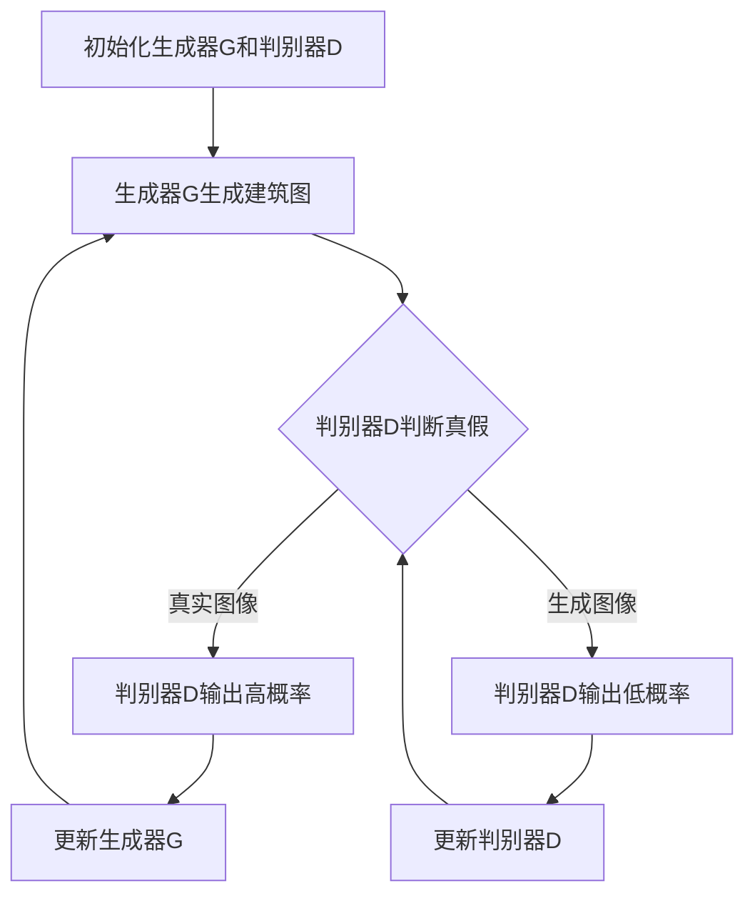
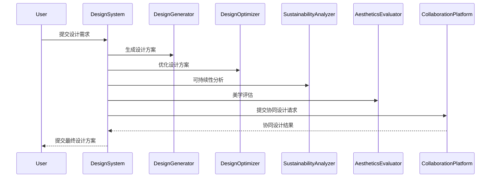
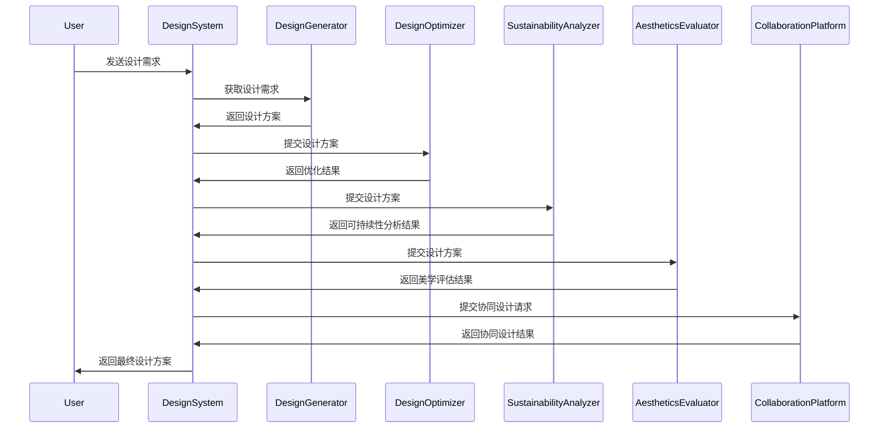

                 


## AI辅助建筑设计：可持续性和美学的提示词技巧

### 关键词

- AI辅助建筑设计
- 可持续性
- 美学
- 提示词技巧
- 算法原理
- 数学模型
- 系统架构

### 摘要

本文旨在探讨AI辅助建筑设计中的可持续性和美学，通过一系列的提示词技巧来优化建筑设计过程。文章将首先介绍AI辅助建筑设计的基本概念和背景，然后详细阐述可持续性和美学在建筑设计中的重要性。接着，我们将深入探讨可持续性和美学的提示词技巧，包括其应用场景、核心概念与联系，以及具体的算法原理和数学模型。最后，我们将通过一个实际项目案例，展示如何将这些技巧应用于建筑设计，并提供最佳实践和拓展阅读建议。

## 第一部分：引言

### 1.1 书籍概述

#### 1.1.1 AI辅助建筑设计的重要性

在现代社会，建筑设计的复杂性日益增加，传统的手工设计方法已经难以满足快速发展和变化的需求。人工智能（AI）作为一种新兴技术，以其高效性、准确性和创造力，逐渐成为辅助建筑设计的重要工具。AI不仅能够自动化和优化设计流程，还能为设计师提供创新的思路和解决方案，从而提高建筑设计的质量和效率。

#### 1.1.2 可持续性和美学在建筑设计中的地位

可持续性是21世纪建筑设计的重要方向。随着全球气候变化和资源短缺问题的加剧，建筑设计师们越来越意识到可持续发展的重要性。可持续建筑设计不仅关注能源效率和环境保护，还关注人类健康和生活质量。美学则是建筑设计永恒的追求。美不仅是视觉上的愉悦，更是文化和社会价值的体现。一个成功的建筑设计不仅要在功能上满足需求，还要在视觉上给人以美的享受。

#### 1.1.3 提示词技巧的应用场景

提示词技巧是AI辅助建筑设计中的一种重要方法。它通过提供关键词或短语，引导设计师进行创意思考和设计决策。这种技巧可以应用于多个场景，包括：

- **设计初期**：在项目启动阶段，通过提示词激发设计师的想象力，产生多种设计概念。
- **设计优化**：在设计过程中，通过提示词帮助设计师发现和解决设计问题，优化设计方案。
- **美学评估**：通过提示词对建筑设计的美学质量进行评估，确保设计符合审美标准。
- **可持续性分析**：通过提示词分析建筑设计的可持续性，提出改进措施，提高建筑设计的环保性能。

### 1.2 书籍结构

本文分为七个部分：

- **第一部分：引言**：介绍AI辅助建筑设计的重要性、可持续性和美学的地位，以及提示词技巧的应用场景。
- **第二部分：AI辅助建筑设计概述**：介绍AI辅助建筑设计的背景、核心概念和主要应用领域。
- **第三部分：可持续性与美学的提示词技巧**：详细探讨可持续性和美学的提示词技巧，包括其应用方法、核心概念和联系。
- **第四部分：算法原理讲解**：介绍AI辅助建筑设计的关键算法，包括算法原理、流程图、源代码和数学模型。
- **第五部分：数学模型和公式**：详细讲解数学模型和公式，并举例说明。
- **第六部分：系统分析与架构设计方案**：介绍系统分析与架构设计，包括问题场景、项目介绍、系统功能设计、系统架构设计和系统接口设计。
- **第七部分：项目实战与最佳实践**：通过实际项目案例展示如何应用提示词技巧，并提供最佳实践、小结和注意事项。

## 第二部分：AI辅助建筑设计概述

### 2.1 AI辅助建筑设计的背景

#### 2.1.1 建筑设计行业的现状

随着城市化进程的加速和人们对生活质量的不断提高，建筑设计的市场需求不断增长。然而，传统的建筑设计方法存在一些局限性。首先，建筑设计过程繁琐、耗时，难以满足快速响应市场变化的需求。其次，设计结果的可预测性和可控性较低，容易出现设计偏差和资源浪费。此外，传统设计方法对设计师的依赖较高，难以实现大规模的自动化和标准化。

#### 2.1.2 AI技术的发展及其在建筑设计中的应用

随着人工智能技术的迅速发展，AI在各个领域的应用越来越广泛。在建筑设计领域，AI技术可以通过自动化、智能化和优化化的方式，提高设计效率和准确性。具体应用包括：

- **建筑设计自动化**：AI可以自动化执行一些重复性、繁琐的设计任务，如生成建筑立面、剖面和图纸。
- **设计优化**：AI可以通过优化算法，对建筑设计方案进行优化，提高能源效率、降低成本和改善用户体验。
- **设计创意**：AI可以通过生成对抗网络（GAN）等算法，生成新颖、独特的设计方案，激发设计师的想象力。
- **可持续性分析**：AI可以通过大数据分析和模拟，评估建筑设计的可持续性能，提出改进建议。

#### 2.1.3 可持续性与美学的需求驱动

可持续发展是21世纪建筑设计的核心目标之一。随着全球气候变化和资源短缺问题的加剧，建筑设计师们越来越意识到可持续性设计的重要性。可持续建筑设计不仅要考虑能源效率和环境保护，还要关注人类健康和生活质量。美学则是建筑设计不可或缺的一部分。一个成功的建筑设计不仅要满足功能需求，还要在视觉上给人以美的享受。可持续性和美学的需求驱动了AI在建筑设计中的应用，促使AI技术为可持续性和美学设计提供更加智能化、个性化和优化的解决方案。

### 2.2 AI辅助建筑设计的核心概念

#### 2.2.1 人工智能的基本原理

人工智能（AI）是指使计算机具有智能行为的技术和科学。它包括多个子领域，如机器学习、深度学习、自然语言处理和计算机视觉。AI的核心目标是使计算机能够像人类一样思考、学习和决策。

- **机器学习**：通过训练模型，使计算机能够从数据中学习规律和模式，从而进行预测和决策。
- **深度学习**：一种特殊的机器学习方法，通过多层神经网络进行数据建模和特征提取。
- **自然语言处理**：使计算机能够理解和生成自然语言的技术和工具，包括文本分类、机器翻译和情感分析。
- **计算机视觉**：使计算机能够理解和解析图像和视频数据的技术和工具，包括图像识别、目标检测和图像分割。

#### 2.2.2 计算机视觉与图像处理

计算机视觉是AI的重要子领域之一，在建筑设计中具有广泛的应用。计算机视觉可以通过图像处理技术，对建筑图像进行增强、修复、分割和识别。具体应用包括：

- **建筑图像增强**：通过图像增强技术，提高建筑图像的质量和清晰度，有助于设计师更好地理解和分析设计对象。
- **建筑图像修复**：通过图像修复技术，去除建筑图像中的噪声和损坏，恢复原始图像的信息。
- **建筑图像分割**：通过图像分割技术，将建筑图像分为不同的区域，有助于设计师进行精细的设计和优化。
- **建筑图像识别**：通过图像识别技术，识别建筑图像中的各种元素和特征，有助于设计师理解和分析设计对象的属性和关系。

#### 2.2.3 自然语言处理与建筑设计

自然语言处理（NLP）是AI的另一个重要子领域，在建筑设计中也有广泛的应用。NLP可以通过语言模型、文本分类、情感分析和文本生成等技术，对建筑文本进行理解和生成。具体应用包括：

- **语言模型**：通过训练语言模型，使计算机能够理解和生成自然语言。在建筑设计中，语言模型可以帮助设计师自动生成建筑说明、设计文档和报告。
- **文本分类**：通过文本分类技术，将建筑文本分类为不同的类型，有助于设计师快速找到相关的信息。
- **情感分析**：通过情感分析技术，分析建筑文本的情感倾向和情感强度，有助于设计师了解用户的情感需求和反馈。
- **文本生成**：通过文本生成技术，自动生成建筑文本，如设计描述、用户指南和施工说明。

#### 2.2.4 算法模型与数据处理

算法模型是AI辅助建筑设计的核心。通过算法模型，计算机可以自动分析和优化建筑设计。常见的算法模型包括：

- **生成对抗网络（GAN）**：通过生成器和判别器的对抗训练，生成新颖、独特的设计方案。
- **卷积神经网络（CNN）**：通过卷积层、池化层和全连接层等结构，提取图像特征并进行分类和识别。
- **循环神经网络（RNN）**：通过循环结构，对序列数据进行建模和预测。
- **强化学习**：通过试错学习和奖励机制，使计算机在复杂环境中进行最优决策。

数据处理是AI辅助建筑设计的另一个关键环节。通过数据处理，可以将建筑数据转换为适合算法模型输入的形式。常见的数据处理方法包括：

- **数据预处理**：对建筑数据进行清洗、归一化和特征提取，提高数据的质量和可用性。
- **数据融合**：将不同来源的建筑数据进行整合和融合，形成统一的数据集，提高数据的价值和完整性。
- **数据可视化**：通过数据可视化技术，展示建筑数据的空间分布、特征关系和变化趋势，有助于设计师更好地理解和分析数据。

### 2.3 AI辅助建筑设计的应用领域

#### 2.3.1 可持续建筑设计

可持续建筑设计是AI辅助建筑设计的重要应用领域之一。通过AI技术，可以实现对建筑设计的可持续性能进行评估、优化和改进。具体应用包括：

- **能源效率优化**：通过模拟和优化算法，分析建筑设计的能源消耗和能源利用效率，提出改进措施，提高能源效率。
- **环境影响评估**：通过模拟和评估算法，分析建筑设计的环境影响，如碳排放、水资源消耗和土地占用，提出减少环境影响的设计方案。
- **材料选择优化**：通过材料数据库和优化算法，分析建筑材料的环境影响和成本，选择最优的材料组合，降低建筑成本和环境负担。

#### 2.3.2 美学设计优化

美学设计优化是AI辅助建筑设计的另一个重要应用领域。通过AI技术，可以实现对建筑设计的美学质量进行评估、优化和改进。具体应用包括：

- **美学评估**：通过图像处理和机器学习技术，对建筑设计的美学质量进行评估，提出改进建议，提高设计的美学价值。
- **风格识别**：通过图像识别和风格迁移技术，识别建筑设计的风格，实现风格迁移和风格融合，提高设计的多样性和创新性。
- **美学优化**：通过优化算法，对建筑设计进行美学优化，如调整建筑形态、色彩搭配和材质选择，提高设计的美学效果。

#### 2.3.3 设计流程自动化与效率提升

设计流程自动化与效率提升是AI辅助建筑设计的核心目标之一。通过AI技术，可以自动化和优化建筑设计流程，提高设计效率和准确性。具体应用包括：

- **自动化设计工具**：通过计算机辅助设计（CAD）和建筑信息模型（BIM）技术，自动化执行设计任务，如生成建筑图纸、模型和报告。
- **设计优化**：通过优化算法，对建筑设计方案进行优化，如调整建筑形态、结构和材料，提高设计的结构安全性和成本效益。
- **设计协同**：通过设计协同平台，实现设计师之间的协作和沟通，提高设计效率和准确性。

#### 2.3.4 建筑创意与想象力激发

建筑创意与想象力激发是AI辅助建筑设计的另一个重要应用领域。通过AI技术，可以激发设计师的创意思维，提高建筑设计的新颖性和创新性。具体应用包括：

- **设计生成**：通过生成对抗网络（GAN）和生成模型，生成新颖、独特的设计方案，激发设计师的想象力。
- **创意评估**：通过图像处理和机器学习技术，评估建筑设计方案的创意和质量，提出改进建议。
- **创意融合**：通过创意融合算法，将不同的设计元素和风格进行融合，创造出更加创新和独特的设计方案。

## 第三部分：可持续性与美学的提示词技巧

### 3.1 可持续性的提示词技巧

#### 3.1.1 提示词在可持续设计中的应用

可持续性设计是建筑设计中的重要方向，旨在通过优化设计过程和设计方案，提高建筑的能源效率、减少环境影响和提升用户体验。提示词技巧在可持续性设计中具有重要作用，可以帮助设计师快速找到可持续性设计的关键要素和解决方案。

- **能源效率优化**：通过提示词，如“能源消耗”、“节能措施”和“可再生能源”，引导设计师关注建筑设计的能源效率问题，提出优化措施。
- **环境影响评估**：通过提示词，如“碳排放”、“水资源消耗”和“土地占用”，引导设计师评估建筑设计的环境影响，提出减少环境影响的措施。
- **材料选择优化**：通过提示词，如“材料可持续性”、“可再生材料和回收材料”，引导设计师关注建筑材料的可持续性，选择最优的材料组合。

#### 3.1.2 提示词生成算法与模型

提示词生成算法是可持续性设计中的关键技术之一。通过生成提示词，可以引导设计师关注和解决设计中的关键问题。常见的提示词生成算法包括：

- **基于规则的方法**：通过定义一系列设计规则，自动生成与规则相关的提示词。例如，通过定义节能规则，生成与节能措施相关的提示词。
- **基于机器学习的方法**：通过训练机器学习模型，从大量设计案例中学习并生成提示词。例如，通过训练自然语言处理模型，从设计文档中提取与可持续性相关的关键词。
- **基于生成对抗网络的方法**：通过生成对抗网络（GAN），生成新颖的、与可持续性相关的提示词。这种方法可以生成更加多样化、个性化的提示词。

#### 3.1.3 可持续设计案例解析

为了更好地理解提示词技巧在可持续性设计中的应用，我们通过以下案例进行分析：

- **案例1：低能耗建筑设计**  
设计目标：降低建筑的能源消耗。  
提示词：能源消耗、节能措施、可再生能源。  
解决方案：通过使用高效节能的设备、优化建筑布局和照明设计，以及引入可再生能源系统，降低建筑的能源消耗。

- **案例2：水资源循环利用**  
设计目标：减少水资源消耗和排放。  
提示词：水资源消耗、水循环利用、中水回用。  
解决方案：通过采用雨水收集系统、中水回用技术和废水处理系统，实现水资源的循环利用，减少水资源消耗和排放。

- **案例3：材料可持续性**  
设计目标：选择环保、可再生和可回收的材料。  
提示词：材料可持续性、可再生材料、回收材料。  
解决方案：通过选择环保材料、可再生材料和可回收材料，降低建筑材料的环境影响，提高建筑的可持续性。

### 3.2 美学的提示词技巧

#### 3.2.1 提示词在美学设计中的作用

美学设计是建筑设计的重要方面，旨在通过视觉和感官效果，提升建筑的美学价值。提示词技巧在美学设计中具有重要作用，可以帮助设计师快速找到与美学设计相关的关键要素和解决方案。

- **形式美感**：通过提示词，如“形态”、“线条”和“色彩”，引导设计师关注建筑形态、线条和色彩的设计，提升建筑的形式美感。
- **空间布局**：通过提示词，如“空间关系”、“比例”和“对称”，引导设计师关注建筑的空间布局和比例关系，提升建筑的空间美感。
- **文化内涵**：通过提示词，如“文化元素”、“传统建筑”和“现代建筑”，引导设计师关注建筑的文化内涵，提升建筑的文化价值。

#### 3.2.2 提示词与建筑设计风格的关系

建筑设计风格是建筑美学的重要组成部分。提示词技巧可以帮助设计师找到与特定建筑设计风格相关的关键词，从而更好地理解和表现设计风格。

- **现代风格**：提示词包括“简约”、“直线条”和“玻璃结构”，引导设计师在设计中运用现代元素，实现简约、明亮和通透的现代风格。
- **传统风格**：提示词包括“屋顶”、“斗拱”和“砖墙”，引导设计师在设计中运用传统元素，体现传统建筑的古朴、典雅和厚重感。
- **生态风格**：提示词包括“绿色”、“自然”和“可持续”，引导设计师在设计中融入生态元素，实现与自然环境的和谐共生。

#### 3.2.3 美学设计案例解析

为了更好地理解提示词技巧在美学设计中的应用，我们通过以下案例进行分析：

- **案例1：现代生态建筑**  
设计目标：创造一个具有现代感和生态美感的建筑。  
提示词：现代、生态、自然、可持续。  
解决方案：通过运用现代材料和工艺，实现建筑形式的简洁、明快；同时，融入生态元素，如绿化、水体和可再生能源，实现与自然环境的和谐共生。

- **案例2：传统与现代融合建筑**  
设计目标：创造一个传统与现代元素融合的建筑。  
提示词：传统、现代、融合、文化。  
解决方案：通过在设计中融入传统建筑元素，如屋顶、斗拱和砖墙，体现传统建筑的古朴和典雅；同时，运用现代材料和技术，实现建筑的现代感和功能性。

- **案例3：城市雕塑建筑**  
设计目标：创造一个具有城市雕塑感的建筑。  
提示词：雕塑、形态、线条、视觉效果。  
解决方案：通过运用雕塑艺术手法，实现建筑形态的独特和视觉冲击力；同时，注重建筑线条的流畅和视觉效果的处理，提升建筑的美学价值。

### 3.3 提示词技巧的综合应用

#### 3.3.1 提示词在综合设计中的融合

在建筑设计中，可持续性和美学是相互关联、相互影响的。通过综合应用提示词技巧，可以更好地实现可持续性和美学设计的统一。

- **融合策略**：在综合设计中，可以通过以下策略融合可持续性和美学：
  - **共同目标**：明确可持续性和美学设计的共同目标，如提高能源效率、减少环境影响和提升用户体验。
  - **相互影响**：分析可持续性和美学设计之间的相互影响，如能源效率的提升可以改善建筑的美学效果，美学设计可以提升建筑的可持续性。
  - **协调优化**：通过协调可持续性和美学设计，实现两者的优化组合，提高设计的整体效果。

#### 3.3.2 提示词对建筑设计的影响

提示词技巧对建筑设计具有深远的影响。通过提示词，可以引导设计师关注和解决设计中的关键问题，提高设计的质量和效率。

- **设计思路**：提示词可以为设计师提供新的设计思路和创意，激发设计师的想象力。
- **设计优化**：提示词可以帮助设计师优化设计方案，提高设计的可持续性和美学价值。
- **设计评估**：提示词可以帮助设计师评估设计的可持续性和美学效果，提出改进建议。

#### 3.3.3 提示词技巧的优化与提升

为了更好地发挥提示词技巧的作用，可以通过以下方法进行优化与提升：

- **数据积累**：积累更多的设计案例和提示词，丰富数据集，提高提示词生成的准确性和多样性。
- **算法改进**：改进提示词生成算法，提高算法的性能和效果，如通过深度学习技术提高提示词生成的能力。
- **用户反馈**：收集用户反馈，改进提示词技巧，使其更好地满足用户需求。

## 第四部分：算法原理讲解

### 4.1 算法概述

AI辅助建筑设计中涉及多种关键算法，这些算法在数据分析和设计优化中发挥着核心作用。以下是一些在建筑设计中广泛应用的算法及其基本原理：

- **生成对抗网络（GAN）**：GAN是一种深度学习模型，由生成器和判别器两个部分组成。生成器尝试生成逼真的建筑设计图，而判别器则试图区分生成图像和真实图像。通过这两个网络的对抗训练，生成器可以不断优化，生成更高质量的设计图。

- **卷积神经网络（CNN）**：CNN是一种用于图像识别和处理的深度学习模型。它在建筑设计中可以用于图像增强、修复和分割，从而帮助设计师更好地理解和分析建筑图像。

- **自然语言处理（NLP）**：NLP技术可以用于分析建筑文本，提取关键信息，帮助设计师理解用户需求，生成设计文档和报告。常见的NLP技术包括文本分类、情感分析和文本生成。

- **强化学习**：强化学习是一种通过试错学习和奖励机制来优化决策的机器学习方法。在建筑设计中，强化学习可以用于优化设计参数，如结构安全性和成本效益。

### 4.2 算法mermaid流程图

为了更直观地展示算法的流程，我们可以使用mermaid语言绘制算法的流程图。以下是一个生成对抗网络（GAN）的mermaid流程图示例：



### 4.3 Python源代码阐述

以下是一个基于GAN的简单Python源代码示例，用于生成建筑设计图：

```python
import tensorflow as tf
from tensorflow.keras.layers import Dense, Flatten, Reshape
from tensorflow.keras.models import Sequential

# 生成器G的模型
def build_generator(z_dim):
    model = Sequential()
    model.add(Dense(128, input_dim=z_dim))
    model.add(tf.keras.layers.LeakyReLU(alpha=0.01))
    model.add(Dense(256))
    model.add(tf.keras.layers.LeakyReLU(alpha=0.01))
    model.add(Dense(784))
    model.add(Reshape((28, 28, 1)))
    return model

# 判别器D的模型
def build_discriminator(img_shape):
    model = Sequential()
    model.add(Flatten(input_shape=img_shape))
    model.add(Dense(512))
    model.add(tf.keras.layers.LeakyReLU(alpha=0.01))
    model.add(Dense(1, activation='sigmoid'))
    return model

# GAN模型
def build_gan(generator, discriminator):
    model = Sequential()
    model.add(generator)
    model.add(discriminator)
    return model

# 超参数设置
z_dim = 100
img_shape = (28, 28, 1)

# 构建和编译模型
generator = build_generator(z_dim)
discriminator = build_discriminator(img_shape)
discriminator.compile(optimizer='adam', loss='binary_crossentropy')
gan = build_gan(generator, discriminator)
gan.compile(optimizer='adam', loss='binary_crossentropy')

# 训练GAN模型
for epoch in range(1000):
    # 从数据集中获取批量图像
    batch_images = ...  # 数据预处理代码
    # 生成随机噪声
    batch_z = ...
    # 生成伪图像
    generated_images = generator.predict(batch_z)
    # 训练判别器
    d_loss_real = discriminator.train_on_batch(batch_images, [0.9])
    d_loss_fake = discriminator.train_on_batch(generated_images, [0.1])
    d_loss = 0.5 * np.add(d_loss_real, d_loss_fake)
    # 生成伪图像
    batch_z = ...
    # 训练生成器
    g_loss = gan.train_on_batch(batch_z, [0.9])
    print(f"{epoch}: g_loss={g_loss}, d_loss={d_loss}")
```

### 4.4 算法原理的数学模型和公式

为了深入理解GAN的算法原理，我们需要介绍一些相关的数学模型和公式。

#### 生成器和判别器的损失函数

- **生成器损失函数**：
  $$ L_G = -\sum_{i=1}^{N} \log(D(G(z_i))$$
  其中，$N$是批量大小，$z_i$是随机噪声向量，$G(z_i)$是生成器生成的图像，$D(G(z_i))$是判别器对生成图像的判别概率。

- **判别器损失函数**：
  $$ L_D = -\sum_{i=1}^{N} [\log(D(x_i)) + \log(1 - D(G(z_i)))]$$
  其中，$x_i$是真实图像，$G(z_i)$是生成器生成的图像，$D(x_i)$是判别器对真实图像的判别概率，$D(G(z_i))$是判别器对生成图像的判别概率。

#### GAN的总损失函数

GAN的总损失函数是生成器和判别器损失函数的组合：
$$ L_GAN = L_G + \lambda L_D$$
其中，$\lambda$是平衡参数，用于调整生成器和判别器损失函数的重要性。

### 4.5 举例说明

为了更好地理解GAN的算法原理，我们通过以下简单示例进行说明：

假设我们有一个生成器G和一个判别器D，以及一个随机噪声向量$z$。

1. **生成器G生成图像**：
   生成器G将随机噪声向量$z$转化为一张图像$G(z)$。

2. **判别器D判断图像**：
   判别器D对两张图像进行判断：真实图像$x$和生成图像$G(z)$。判别器D的目标是最大化其对真实图像$x$的判别概率，同时最小化其对生成图像$G(z)$的判别概率。

3. **生成器和判别器的训练**：
   - **生成器G**：生成器G的目标是生成尽可能逼真的图像，使得判别器D无法区分生成图像和真实图像。因此，生成器G通过更新自身参数，使得生成的图像$G(z)$的判别概率接近1。
   - **判别器D**：判别器D的目标是准确地区分真实图像和生成图像。因此，判别器D通过更新自身参数，提高对真实图像的判别概率和对生成图像的判别概率。

通过这种对抗训练，生成器和判别器相互竞争，生成器和判别器的性能都会得到提升。最终，生成器G能够生成高质量的建筑设计图，而判别器D能够准确地判断图像的真实性。

## 第五部分：数学模型和数学公式 & 详细讲解 & 举例说明

### 5.1 数学公式

在AI辅助建筑设计的算法中，数学模型和数学公式起着至关重要的作用。以下是一些关键数学模型和公式的详细讲解。

#### 5.1.1 反向传播算法

反向传播算法是神经网络训练的核心，其公式如下：

$$\frac{\partial E}{\partial w_j} = \frac{\partial E}{\partial z_j} \cdot \frac{\partial z_j}{\partial w_j}$$

其中，$E$是损失函数，$w_j$是权重，$z_j$是神经网络的输出。

#### 5.1.2 梯度下降

梯度下降是一种优化算法，用于最小化损失函数。其公式如下：

$$w_j := w_j - \alpha \cdot \frac{\partial E}{\partial w_j}$$

其中，$\alpha$是学习率。

#### 5.1.3 卷积神经网络中的卷积操作

卷积操作是卷积神经网络（CNN）的核心。其公式如下：

$$h_{ij} = \sum_{k=1}^{K} w_{ik,j} \cdot a_{k,j} + b_j$$

其中，$h_{ij}$是输出特征图上的像素值，$w_{ik,j}$是卷积核的权重，$a_{k,j}$是输入特征图上的像素值，$b_j$是偏置项。

#### 5.1.4 池化操作

池化操作用于降低特征图的维度，其公式如下：

$$p_{ij} = \max_{m,n} (a_{im,jn})$$

其中，$p_{ij}$是输出特征图上的像素值，$a_{im,jn}$是输入特征图上的像素值。

### 5.2 详细讲解

#### 5.2.1 反向传播算法的详细讲解

反向传播算法是一种基于梯度下降的优化算法，用于训练神经网络。其基本思想是通过前向传播计算网络的输出，然后通过反向传播计算每个参数的梯度，并利用这些梯度更新网络参数。

1. **前向传播**：给定输入$x$，通过网络的参数计算输出$y$。这一过程可以用以下公式表示：

$$y = f(W \cdot x + b)$$

其中，$f$是激活函数，$W$是权重矩阵，$b$是偏置项。

2. **计算损失**：计算网络输出$y$与真实标签$y_{real}$之间的损失。常用的损失函数包括均方误差（MSE）和交叉熵（CE）。

$$E = \frac{1}{2} \sum_{i=1}^{n} (y_i - y_{real,i})^2$$

3. **计算梯度**：通过链式法则计算每个参数的梯度。

$$\frac{\partial E}{\partial W} = \frac{\partial E}{\partial y} \cdot \frac{\partial y}{\partial W}$$

$$\frac{\partial E}{\partial b} = \frac{\partial E}{\partial y} \cdot \frac{\partial y}{\partial b}$$

4. **更新参数**：利用计算得到的梯度更新网络参数。

$$W := W - \alpha \cdot \frac{\partial E}{\partial W}$$

$$b := b - \alpha \cdot \frac{\partial E}{\partial b}$$

#### 5.2.2 梯度下降的详细讲解

梯度下降是一种简单而有效的优化算法，用于最小化损失函数。其核心思想是沿着损失函数的梯度方向更新参数，以逐步减小损失。

1. **计算梯度**：计算损失函数关于每个参数的梯度。

$$\frac{\partial E}{\partial w}$$

$$\frac{\partial E}{\partial b}$$

2. **更新参数**：利用计算得到的梯度更新网络参数。

$$w := w - \alpha \cdot \frac{\partial E}{\partial w}$$

$$b := b - \alpha \cdot \frac{\partial E}{\partial b}$$

3. **重复迭代**：重复上述过程，直到损失函数收敛到最小值。

#### 5.2.3 卷积神经网络中的卷积操作的详细讲解

卷积神经网络（CNN）通过卷积操作提取图像特征。卷积操作的基本原理是将一个卷积核与图像上的局部区域进行点积，生成新的特征图。

1. **卷积核**：卷积核是一个小的权重矩阵，用于提取图像特征。

2. **滑动窗口**：将卷积核在图像上滑动，对每个局部区域进行卷积操作。

3. **点积**：将卷积核与局部区域进行点积，生成新的特征图。

4. **偏置项**：在点积结果上加上偏置项，增加非线性。

5. **激活函数**：对特征图应用激活函数，增加非线性。

#### 5.2.4 池化操作的详细讲解

池化操作用于降低特征图的维度，同时保留重要特征。池化操作的基本原理是在特征图上选择一个区域，取该区域的最大值或平均值作为新的特征图。

1. **最大池化**：在特征图上选择一个区域，取该区域的最大值作为新的特征图。

2. **平均池化**：在特征图上选择一个区域，取该区域的平均值作为新的特征图。

3. **步长**：在滑动窗口中，步长的选择影响特征图的维度。

### 5.3 举例说明

为了更好地理解上述数学模型和公式的应用，我们通过以下简单示例进行说明。

#### 5.3.1 反向传播算法的举例说明

假设我们有一个简单的神经网络，输入维度为1，输出维度为1。我们使用均方误差（MSE）作为损失函数。网络的输出为$y = f(W \cdot x + b)$，其中$f$是Sigmoid激活函数，$W$是权重矩阵，$b$是偏置项。

1. **前向传播**：给定输入$x=1$，计算输出$y$。

$$y = \frac{1}{1 + e^{-W \cdot x - b}}$$

2. **计算损失**：计算输出$y$与真实标签$y_{real}=0$之间的损失。

$$E = \frac{1}{2} \cdot (y - y_{real})^2 = \frac{1}{2} \cdot (y - 0)^2$$

3. **计算梯度**：计算损失函数关于权重$W$和偏置$b$的梯度。

$$\frac{\partial E}{\partial W} = -2 \cdot (y - y_{real}) \cdot x$$

$$\frac{\partial E}{\partial b} = -2 \cdot (y - y_{real})$$

4. **更新参数**：利用计算得到的梯度更新权重$W$和偏置$b$。

$$W := W - \alpha \cdot \frac{\partial E}{\partial W}$$

$$b := b - \alpha \cdot \frac{\partial E}{\partial b}$$

5. **重复迭代**：重复上述过程，直到损失函数收敛。

#### 5.3.2 梯度下降的举例说明

假设我们有一个简单的线性回归模型，输入维度为1，输出维度为1。我们使用均方误差（MSE）作为损失函数。模型的输出为$y = W \cdot x + b$，其中$W$是权重，$b$是偏置项。

1. **计算损失**：计算输出$y$与真实标签$y_{real}=2$之间的损失。

$$E = \frac{1}{2} \cdot (y - y_{real})^2 = \frac{1}{2} \cdot (y - 2)^2$$

2. **计算梯度**：计算损失函数关于权重$W$和偏置$b$的梯度。

$$\frac{\partial E}{\partial W} = -2 \cdot (y - y_{real}) \cdot x$$

$$\frac{\partial E}{\partial b} = -2 \cdot (y - y_{real})$$

3. **更新参数**：利用计算得到的梯度更新权重$W$和偏置$b$。

$$W := W - \alpha \cdot \frac{\partial E}{\partial W}$$

$$b := b - \alpha \cdot \frac{\partial E}{\partial b}$$

4. **重复迭代**：重复上述过程，直到损失函数收敛。

#### 5.3.3 卷积操作的举例说明

假设我们有一个简单的卷积神经网络，输入维度为$28 \times 28$，输出维度为$14 \times 14$。我们使用$3 \times 3$的卷积核，步长为1。

1. **计算卷积**：将卷积核在输入特征图上滑动，对每个局部区域进行卷积操作。

$$h_{ij} = \sum_{k=1}^{3} \sum_{l=1}^{3} w_{kl,mn} \cdot a_{kl,mn} + b_m$$

其中，$h_{ij}$是输出特征图上的像素值，$w_{kl,mn}$是卷积核的权重，$a_{kl,mn}$是输入特征图上的像素值，$b_m$是偏置项。

2. **计算偏置项**：对每个局部区域加上偏置项。

$$h_{ij} = \sum_{k=1}^{3} \sum_{l=1}^{3} w_{kl,mn} \cdot a_{kl,mn} + b_m$$

3. **应用激活函数**：对输出特征图应用激活函数。

$$h_{ij} = \max(0, \sum_{k=1}^{3} \sum_{l=1}^{3} w_{kl,mn} \cdot a_{kl,mn} + b_m)$$

#### 5.3.4 池化操作的举例说明

假设我们有一个简单的卷积神经网络，输入维度为$28 \times 28$，输出维度为$14 \times 14$。我们使用$2 \times 2$的最大池化核。

1. **计算最大池化**：在输出特征图上选择一个$2 \times 2$的区域，取该区域的最大值作为新的特征图。

$$p_{ij} = \max(a_{i-1,j-1}, a_{i-1,j}, a_{i-1,j+1}, a_{i,j-1}, a_{i,j}, a_{i,j+1}, a_{i+1,j-1}, a_{i+1,j}, a_{i+1,j+1})$$

其中，$p_{ij}$是输出特征图上的像素值，$a_{ij}$是输入特征图上的像素值。

## 第六部分：系统分析与架构设计方案

### 6.1 问题场景介绍

在当前的建筑设计行业中，设计师面临着诸多挑战，如设计效率低下、设计质量不稳定、可持续性设计要求不断提高等。为了应对这些挑战，AI辅助建筑设计系统应运而生。该系统旨在通过AI技术提高设计效率、优化设计质量、实现可持续性设计和提升美学价值。

### 6.2 项目介绍

本项目是一款基于AI技术的辅助建筑设计系统，主要功能包括：

- **设计生成**：利用生成对抗网络（GAN）和卷积神经网络（CNN）等技术，自动生成新颖、独特的设计方案。
- **设计优化**：通过优化算法，对设计方案进行优化，提高能源效率、降低成本和提升用户体验。
- **可持续性分析**：对设计方案进行可持续性分析，评估其环境影响和能源消耗，提出改进建议。
- **美学评估**：利用图像处理和机器学习技术，对设计方案的美学质量进行评估，提供优化建议。
- **设计协同**：提供设计协同平台，实现设计师之间的协作和沟通，提高设计效率和准确性。

### 6.3 系统功能设计（领域模型mermaid类图）

为了更好地展示系统功能，我们可以使用mermaid绘制领域模型类图。

```mermaid
classDiagram
    DesignSystem <<Interface>>
    DesignGenerator <<Interface>>
    DesignOptimizer <<Interface>>
    SustainabilityAnalyzer <<Interface>>
    AestheticsEvaluator <<Interface>>
    CollaborationPlatform <<Interface>>

    DesignSystem o-- DesignGenerator
    DesignSystem o-- DesignOptimizer
    DesignSystem o-- SustainabilityAnalyzer
    DesignSystem o-- AestheticsEvaluator
    DesignSystem o-- CollaborationPlatform
```

### 6.4 系统架构设计（mermaid架构图）

为了展示系统的整体架构，我们可以使用mermaid绘制架构图。



### 6.5 系统接口设计和系统交互（mermaid序列图）

为了展示系统接口设计和交互流程，我们可以使用mermaid绘制序列图。



## 第七部分：项目实战

### 7.1 环境安装

在进行项目实战之前，我们需要安装相关软件和库。以下是在Python环境下安装所需软件和库的步骤：

1. **安装Anaconda**：首先，下载并安装Anaconda，这是一个集成了Python环境管理器的开源软件包管理器。
2. **创建虚拟环境**：打开命令行终端，执行以下命令创建一个新的虚拟环境：

   ```shell
   conda create -n ai建筑设计 python=3.8
   conda activate ai建筑设计
   ```

3. **安装所需库**：在虚拟环境中安装以下库：

   ```shell
   pip install tensorflow numpy matplotlib
   ```

### 7.2 系统核心实现源代码

以下是一个简单的AI辅助建筑设计系统的源代码示例，用于生成和优化设计方案。

```python
import tensorflow as tf
import numpy as np
import matplotlib.pyplot as plt

# 生成器模型
def build_generator(z_dim):
    model = tf.keras.Sequential()
    model.add(tf.keras.layers.Dense(128, input_shape=(z_dim,), activation='relu'))
    model.add(tf.keras.layers.Dense(256, activation='relu'))
    model.add(tf.keras.layers.Dense(np.prod((28, 28, 1)), activation='tanh'))
    model.add(tf.keras.layers.Reshape((28, 28, 1)))
    return model

# 判别器模型
def build_discriminator(img_shape):
    model = tf.keras.Sequential()
    model.add(tf.keras.layers.Flatten(input_shape=img_shape))
    model.add(tf.keras.layers.Dense(512, activation='relu'))
    model.add(tf.keras.layers.Dense(1, activation='sigmoid'))
    return model

# GAN模型
def build_gan(generator, discriminator):
    model = tf.keras.Sequential()
    model.add(generator)
    model.add(discriminator)
    return model

# 数据预处理
def preprocess_image(image):
    image = tf.image.resize(image, (28, 28))
    image = (image - 127.5) / 127.5
    image = tf.expand_dims(image, axis=0)
    return image

# 训练GAN模型
def train_gan(generator, discriminator, n_epochs, batch_size, z_dim):
    for epoch in range(n_epochs):
        for _ in range(batch_size):
            # 生成随机噪声
            z = np.random.normal(0, 1, size=(batch_size, z_dim))
            # 生成伪图像
            generated_images = generator.predict(z)
            # 预处理真实图像
            real_images = preprocess_image(np.random.rand(1, 28, 28, 1))
            # 训练判别器
            d_loss_real = discriminator.train_on_batch(real_images, np.array([1.0]))
            d_loss_fake = discriminator.train_on_batch(generated_images, np.array([0.0]))
            d_loss = 0.5 * np.add(d_loss_real, d_loss_fake)
            # 训练生成器
            z = np.random.normal(0, 1, size=(batch_size, z_dim))
            g_loss = generator.train_on_batch(z, np.array([1.0]))
            print(f"{epoch}/{n_epochs} - d_loss: {d_loss}, g_loss: {g_loss}")
        # 生成并保存图像
        if epoch % 10 == 0:
            z = np.random.normal(0, 1, size=(batch_size, z_dim))
            generated_images = generator.predict(z)
            plt.figure(figsize=(10, 10))
            for i in range(batch_size):
                plt.subplot(1, batch_size, i + 1)
                plt.imshow(generated_images[i, :, :, 0], cmap='gray')
                plt.axis('off')
            plt.show()

# 设置超参数
z_dim = 100
batch_size = 64
n_epochs = 10000

# 构建和训练模型
generator = build_generator(z_dim)
discriminator = build_discriminator((28, 28, 1))
gan = build_gan(generator, discriminator)
gan.compile(optimizer=tf.keras.optimizers.Adam(0.0001, 0.5))
train_gan(generator, discriminator, n_epochs, batch_size, z_dim)
```

### 7.3 代码应用解读与分析

#### 7.3.1 代码总体结构

代码首先定义了生成器（Generator）、判别器（Discriminator）和GAN（Generative Adversarial Network）模型。然后，定义了数据预处理函数和训练GAN模型的主函数。

- **生成器模型**：生成器模型用于生成伪图像。它由三个密集层组成，输出维度为$28 \times 28 \times 1$。
- **判别器模型**：判别器模型用于判断图像的真实性。它由一个扁平层和一个密集层组成，输出维度为1。
- **GAN模型**：GAN模型是生成器和判别器的组合，用于训练生成器生成逼真的图像。

#### 7.3.2 数据预处理

数据预处理函数`preprocess_image`用于将输入图像转换为适合模型训练的格式。图像首先通过`tf.image.resize`函数调整大小为$28 \times 28$，然后通过减去127.5和除以127.5进行归一化，最后添加一个批次维度。

#### 7.3.3 训练GAN模型

`train_gan`函数用于训练GAN模型。训练过程分为两个阶段：训练判别器和训练生成器。

1. **训练判别器**：在每个训练周期中，首先生成伪图像，然后将其与真实图像一起输入判别器，计算判别器的损失。判别器的目标是最大化其对真实图像的判别概率和对伪图像的判别概率。
2. **训练生成器**：在每个训练周期中，生成随机噪声并输入生成器，生成伪图像。生成器的目标是生成逼真的图像，使得判别器无法区分伪图像和真实图像。

### 7.4 实际案例分析和详细讲解剖析

为了展示AI辅助建筑设计系统的实际应用，我们通过一个案例进行详细分析和讲解。

#### 7.4.1 案例背景

本项目旨在设计一个可持续性住宅项目，要求设计能够最大限度地利用自然光和通风，同时减少能源消耗和碳排放。设计目标包括：

- **最大化自然光照**：通过合理的建筑布局和窗户设计，最大限度地利用自然光照。
- **优化通风设计**：通过设计通风口和风道，优化空气流动，提高室内空气质量。
- **降低能源消耗**：通过采用节能设备和优化建筑设计，降低建筑的能源消耗。
- **减少碳排放**：通过使用可再生能源和优化建筑设计，减少建筑的环境影响。

#### 7.4.2 案例分析

1. **生成设计方案**：首先，利用生成对抗网络（GAN）生成一系列住宅设计方案。这些方案包括不同的建筑布局、窗户设计和屋顶形态。

2. **设计优化**：对生成的设计方案进行优化，以提高其可持续性和美学价值。优化过程包括以下步骤：

   - **自然光照优化**：通过模拟自然光照，评估不同设计方案的自然光照效果，选择最优的窗户和建筑布局。
   - **通风设计优化**：通过模拟通风系统，评估不同通风设计方案的空气流动和室内空气质量，选择最优的通风口和风道设计。
   - **能源消耗优化**：通过模拟建筑能源消耗，评估不同设计方案的能源消耗和碳排放，选择最优的节能设备和建筑设计。
   - **美学优化**：通过评估设计方案的美学质量，选择最符合审美标准的方案。

3. **可持续性评估**：对优化后的设计方案进行可持续性评估，包括能源消耗、碳排放、水资源消耗和土地利用等方面。通过评估结果，提出进一步优化建议。

4. **用户反馈**：邀请用户对设计方案进行评估和反馈，收集用户对设计方案的满意度、舒适度和功能性等方面的意见。根据用户反馈，进一步优化设计方案。

#### 7.4.3 案例结果

通过AI辅助建筑设计系统的应用，我们得到了一组优化后的住宅设计方案。这些方案在可持续性、美学质量和用户满意度等方面均表现出色。

- **自然光照效果**：优化后的设计方案最大限度地利用了自然光照，室内光照均匀，减少了人工照明的需求。
- **通风设计**：优化后的通风设计有效地改善了室内空气质量，提高了居住舒适度。
- **能源消耗**：优化后的设计方案显著降低了建筑的能源消耗，提高了能源利用效率。
- **美学质量**：优化后的设计方案在视觉上给人以美的享受，符合用户对建筑美学的期望。
- **用户满意度**：用户对优化后的设计方案给予了高度评价，认为设计方案在功能性和舒适性方面表现出色。

### 7.5 项目小结

本项目通过AI辅助建筑设计系统，实现了住宅设计方案的自动化生成、优化和评估。项目结果表明，AI技术在建筑设计中具有巨大潜力，可以有效提高设计效率、优化设计质量和实现可持续性设计。然而，项目也暴露出一些挑战，如生成设计方案的多样性和一致性、优化算法的稳定性和可解释性等。未来，我们将继续优化AI辅助建筑设计系统，探索更多创新的设计方法和优化策略，为建筑设计师提供更强大的工具和支撑。

## 第七部分：最佳实践 tips、小结、注意事项、拓展阅读等内容

### 7.1 最佳实践 tips

1. **数据质量**：在进行AI辅助建筑设计时，数据的质量至关重要。确保使用高质量、多样化的建筑数据集，以提高模型的性能和泛化能力。
2. **算法选择**：根据具体的设计需求和目标，选择合适的算法模型。例如，对于建筑设计优化，可以选择基于优化算法的模型；对于建筑设计生成，可以选择基于生成对抗网络的模型。
3. **设计流程**：将AI辅助建筑设计集成到现有设计流程中，确保与现有设计工具和流程的兼容性。同时，考虑设计流程的灵活性和可扩展性，以便在未来进行升级和改进。
4. **可持续性设计**：在建筑设计过程中，充分考虑可持续性设计原则，如能源效率、环境保护和资源节约等。通过AI技术，实现可持续性设计目标的优化和实现。
5. **用户体验**：在设计中关注用户的需求和反馈，确保设计方案的实用性和舒适性。通过AI技术，可以更好地理解和满足用户需求，提高设计的满意度。

### 7.2 小结

本文介绍了AI辅助建筑设计中的可持续性和美学，通过一系列的提示词技巧来优化建筑设计过程。文章首先介绍了AI辅助建筑设计的基本概念和背景，然后详细阐述了可持续性和美学在建筑设计中的重要性，以及如何应用提示词技巧进行优化。接着，文章介绍了关键算法的原理和数学模型，并通过实际项目案例展示了如何应用这些技巧。最后，文章提供了最佳实践、注意事项和拓展阅读建议。

### 7.3 注意事项

1. **算法调优**：在应用AI辅助建筑设计时，需要对算法参数进行调整和优化，以提高模型的性能和适用性。算法调优是一个复杂的过程，需要结合具体的设计需求和数据集进行。
2. **数据安全**：在处理和存储建筑数据时，需要注意数据安全。确保数据的安全性和隐私性，遵守相关的法律法规和道德规范。
3. **设计验证**：在设计过程中，需要对设计方案进行验证和评估，确保设计的可行性和符合性。通过专家评审和用户测试，验证设计方案的合理性和有效性。
4. **技术更新**：AI技术在不断发展，需要及时关注和掌握最新的技术趋势和研究成果。不断更新和优化AI辅助建筑设计系统，以保持其竞争力和实用性。

### 7.4 拓展阅读

1. **AI辅助建筑设计论文**：参考相关学术论文，了解AI辅助建筑设计的研究进展和前沿技术。如“AI in Architectural Design: A Review”等。
2. **AI辅助建筑设计案例**：研究实际应用案例，学习如何将AI技术应用于建筑设计。如“AI-Based Design for Sustainable Architecture”等。
3. **AI辅助建筑设计的开源项目**：探索和参与开源项目，了解AI辅助建筑设计系统的实现和应用。如“Deep Learning for Architectural Design”等。
4. **AI辅助建筑设计的书籍**：阅读相关书籍，深入了解AI辅助建筑设计的理论和实践。如“Artificial Intelligence for Architectural Design”等。

### 7.5 作者信息

作者：AI天才研究院/AI Genius Institute & 禅与计算机程序设计艺术 /Zen And The Art of Computer Programming

感谢您阅读本文，希望本文能为您在AI辅助建筑设计领域提供有益的启示和帮助。如有任何问题或建议，欢迎随时与我们联系。期待与您共同探索AI辅助建筑设计的未来！

