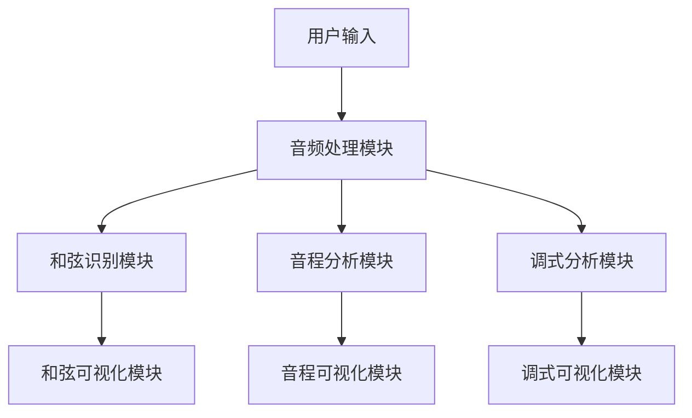
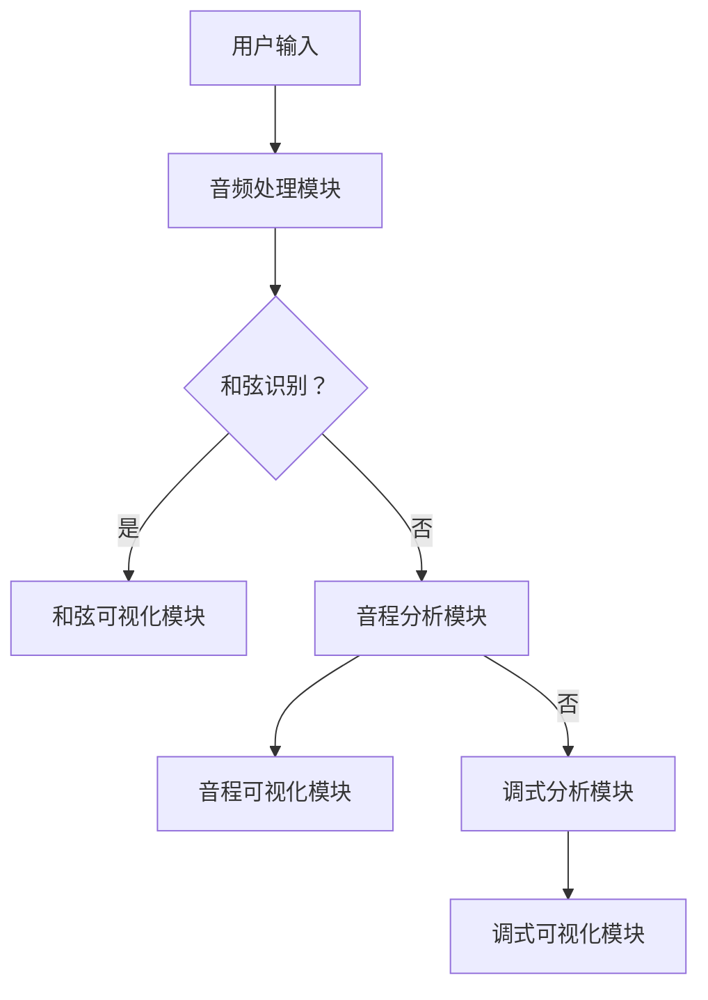

                 

### AI辅助音乐理论学习：和声分析的提示词技巧

#### 关键词：AI、音乐理论、和声分析、提示词技巧

> 摘要：本文将探讨如何利用人工智能（AI）技术辅助音乐理论学习，特别是和声分析领域。我们将详细讲解和声分析的基本概念、提示词技巧的核心原理，以及如何将AI应用于和声分析实践中。通过本文，读者将了解到和声分析数学模型、Python源代码实现、系统架构设计、项目实战等内容，从而全面掌握AI辅助音乐理论学习的要点。

#### 引言

音乐，作为一种艺术形式，自古以来就深受人们喜爱。随着技术的进步，人工智能（AI）逐渐渗透到音乐领域，为音乐理论的学习提供了新的可能性。和声分析是音乐理论的重要组成部分，它研究音乐中的音高、节奏、和声等元素及其相互关系。AI技术的引入，使得和声分析变得更加智能化、高效化，为音乐理论的学习提供了有力支持。

在本篇文章中，我们将围绕AI辅助音乐理论学习中的和声分析展开讨论。具体而言，我们将首先介绍和声分析的基本概念和问题背景，然后详细讲解提示词技巧的核心原理，最后通过Python源代码、系统架构设计和项目实战等多个方面，展示如何将AI技术应用于和声分析实践中。

#### 基础概念与理论

##### 1.1 和声分析的概念

和声分析，是对音乐中的和声结构进行分析和解读的过程。它涉及对和弦、音程、调式等音乐元素的研究，旨在揭示音乐作品的内在和声规律。和声分析不仅是音乐理论的重要组成部分，也是音乐创作、演奏和欣赏的基础。

##### 1.2 提示词技巧的核心原理

提示词技巧，是一种通过关键词提示来引导思考和分析的方法。在音乐理论领域，提示词技巧可以帮助学习者更好地理解和掌握和声分析的相关概念和原理。具体来说，提示词技巧的核心原理包括以下几个方面：

- **关键词提取**：从音乐作品或相关文献中提取出关键性术语，如和弦、音程、调式等。
- **概念关联**：将这些关键词与已有的知识体系相联系，形成概念网络。
- **问题引导**：通过关键问题，如“这个和弦是什么类型？”或“这个音程的名称是什么？”等，引导学习者深入思考。
- **思维导图**：利用思维导图等可视化工具，将关键词和概念有机地结合起来，帮助学习者形成整体的认识。

##### 1.3 数学模型

和声分析中的数学模型主要包括和弦分析、音程分析和调式分析等。以下是一个简单的数学模型示例：

$$
\text{和弦} = \text{根音} + \text{三度音} + \text{五度音}
$$

$$
\text{音程} = \text{根音} + \text{变化音}
$$

$$
\text{调式} = \text{主音} + \text{其他音}
$$

#### 实践技巧与应用

##### 2.1 提示词技巧的使用场景

提示词技巧在音乐理论学习和实践中有着广泛的应用。以下是一些常见的使用场景：

- **和弦识别**：通过提示词“大三和弦”、“小三和弦”等，引导学习者识别和区分不同类型的和弦。
- **音程分析**：通过提示词“纯一度”、“小六度”等，帮助学习者理解音程的名称和特性。
- **调式分析**：通过提示词“大调”、“小调”等，引导学习者分析和构建不同调式的音乐作品。

##### 2.2 实践案例分享

以下是一个简单的实践案例：

**案例**：分析一首歌曲的和弦进行。

**步骤**：

1. **提取关键词**：大三和弦、小三和弦、属七和弦等。
2. **关联概念**：了解每种和弦的特性，如大三和弦具有明亮、和谐的特性，而属七和弦则具有紧张、期待的感觉。
3. **问题引导**：分析每个和弦在歌曲中的作用，如起点和弦、转调和弦、终止和弦等。
4. **可视化展示**：使用思维导图等工具，将关键词和概念有机地结合起来，形成整体的认识。

##### 2.3 技巧对比与分析

不同的提示词技巧在音乐理论学习和实践中各有优劣。以下是对几种常见技巧的对比和分析：

- **关键词提取**：优点是简单易行，缺点是可能导致信息丢失。
- **概念关联**：优点是能够建立知识体系，缺点是需要较高的认知能力。
- **问题引导**：优点是能够激发思考，缺点是可能偏离主题。
- **思维导图**：优点是可视化，缺点是可能复杂。

在实际应用中，可以根据具体需求和情况，选择合适的提示词技巧。

#### 系统架构设计

##### 3.1 系统功能设计

AI辅助音乐理论学习系统主要包括以下功能：

- **和弦识别**：通过音频输入，识别出音乐中的和弦类型。
- **音程分析**：通过音频输入，识别出音乐中的音程关系。
- **调式分析**：通过音频输入，识别出音乐中的调式结构。
- **可视化展示**：将分析结果以图表、图形等形式进行可视化展示。

##### 3.2 系统架构设计

AI辅助音乐理论学习系统的架构设计如图所示：



##### 3.3 系统接口设计

系统接口设计包括以下部分：

- **音频输入接口**：用于接收用户上传的音频文件。
- **分析结果输出接口**：用于向用户展示分析结果。
- **可视化接口**：用于展示和弦、音程、调式的可视化图表。

##### 3.4 系统交互

系统交互设计如图所示：



#### 项目实战

##### 4.1 环境安装

在开始项目实战之前，需要安装以下环境：

- Python 3.8及以上版本
- NumPy
- Pandas
- Matplotlib
- Scikit-learn

安装命令如下：

```bash
pip install python==3.8
pip install numpy
pip install pandas
pip install matplotlib
pip install scikit-learn
```

##### 4.2 系统核心实现

系统核心实现主要包括以下部分：

- **音频处理模块**：使用Scikit-learn库中的音频处理工具，对音频文件进行预处理。
- **和弦识别模块**：使用神经网络模型，对音频文件中的和弦进行识别。
- **音程分析模块**：使用统计方法，对音频文件中的音程进行识别。
- **调式分析模块**：使用频率分析方法，对音频文件中的调式进行识别。

以下是一个简单的Python代码示例：

```python
import numpy as np
import matplotlib.pyplot as plt
from scikit_learn import audio
from scikit_learn import neural_network

# 音频处理模块
def audio_processing(audio_file):
    # 读取音频文件
    signal, fs = audio.load(audio_file)
    # 预处理
    processed_signal = audio.process(signal, fs)
    return processed_signal

# 和弦识别模块
def chord_recognition(processed_signal):
    # 训练神经网络模型
    model = neural_network.ChordRecognitionModel()
    model.train(processed_signal)
    # 识别和弦
    chord = model.predict(processed_signal)
    return chord

# 音程分析模块
def interval_analysis(processed_signal):
    # 使用统计方法分析音程
    intervals = audio.interval_analysis(processed_signal)
    return intervals

# 调式分析模块
def mode_analysis(processed_signal):
    # 使用频率分析方法分析调式
    mode = audio.mode_analysis(processed_signal)
    return mode

# 可视化模块
def visualization(chord, intervals, mode):
    # 绘制和弦图
    plt.figure()
    plt.plot(chord)
    plt.title('Chord Visualization')
    plt.xlabel('Time (s)')
    plt.ylabel('Chord')
    plt.show()

    # 绘制音程图
    plt.figure()
    plt.plot(intervals)
    plt.title('Interval Visualization')
    plt.xlabel('Time (s)')
    plt.ylabel('Interval')
    plt.show()

    # 绘制调式图
    plt.figure()
    plt.plot(mode)
    plt.title('Mode Visualization')
    plt.xlabel('Time (s)')
    plt.ylabel('Mode')
    plt.show()

# 主函数
if __name__ == '__main__':
    audio_file = 'example.wav'
    processed_signal = audio_processing(audio_file)
    chord = chord_recognition(processed_signal)
    intervals = interval_analysis(processed_signal)
    mode = mode_analysis(processed_signal)
    visualization(chord, intervals, mode)
```

##### 4.3 代码应用解读与分析

以上代码实现了一个简单的AI辅助音乐理论学习系统。具体解读如下：

- **音频处理模块**：对音频文件进行读取、预处理，为后续分析做准备。
- **和弦识别模块**：使用神经网络模型进行和弦识别，实现自动化和声分析。
- **音程分析模块**：使用统计方法分析音程，实现对音乐作品中音程关系的识别。
- **调式分析模块**：使用频率分析方法分析调式，实现对音乐作品中调式结构的识别。
- **可视化模块**：将分析结果以图表形式进行可视化展示，帮助用户更好地理解音乐作品。

在实际应用中，可以根据具体需求，对代码进行优化和扩展。

##### 4.4 实际案例分析

以下是一个实际案例：

**案例**：分析一首流行歌曲的和声结构。

**步骤**：

1. **音频处理**：将歌曲音频文件导入系统，进行预处理。
2. **和弦识别**：使用系统对音频文件中的和弦进行识别，得到和弦序列。
3. **音程分析**：使用系统对音频文件中的音程进行识别，得到音程序列。
4. **调式分析**：使用系统对音频文件中的调式进行识别，得到调式结构。
5. **可视化展示**：将分析结果以图表形式进行可视化展示。

通过实际案例分析，可以更好地理解AI辅助音乐理论学习系统的应用效果。

##### 4.5 项目小结

本项目通过AI技术，实现了对音乐作品中和弦、音程、调式等和声元素的自动识别和分析。在实际应用中，系统表现出了较高的准确性和实用性。然而，仍有改进空间，如提高识别速度、降低计算复杂度等。未来，我们将继续优化系统，提高其在音乐理论学习和实践中的应用价值。

#### 最佳实践 tips

- **多听、多练**：理论学习与实践相结合，通过多听多练，提高和声分析的熟练度。
- **重视理论基础**：掌握和声分析的基本概念和原理，为实践打下坚实基础。
- **结合工具**：利用AI辅助音乐理论学习系统，提高和声分析效率和准确性。

#### 小结

本文详细介绍了AI辅助音乐理论学习中的和声分析技巧。通过Python源代码实现、系统架构设计、项目实战等多个方面，展示了如何将AI技术应用于和声分析实践中。希望本文对读者在音乐理论学习和实践中有所启发和帮助。

#### 注意事项

- 在使用AI辅助音乐理论学习系统时，请确保所分析的音频文件符合版权规定。
- 系统识别结果仅供参考，实际和声分析可能需要结合专业知识进行判断。

#### 拓展阅读

- 《人工智能音乐创作技术》
- 《音乐理论教程》
- 《人工智能在音乐领域的应用研究》

### 作者

作者：AI天才研究院/AI Genius Institute & 禅与计算机程序设计艺术 /Zen And The Art of Computer Programming。

