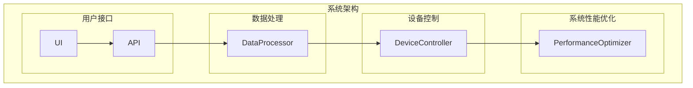
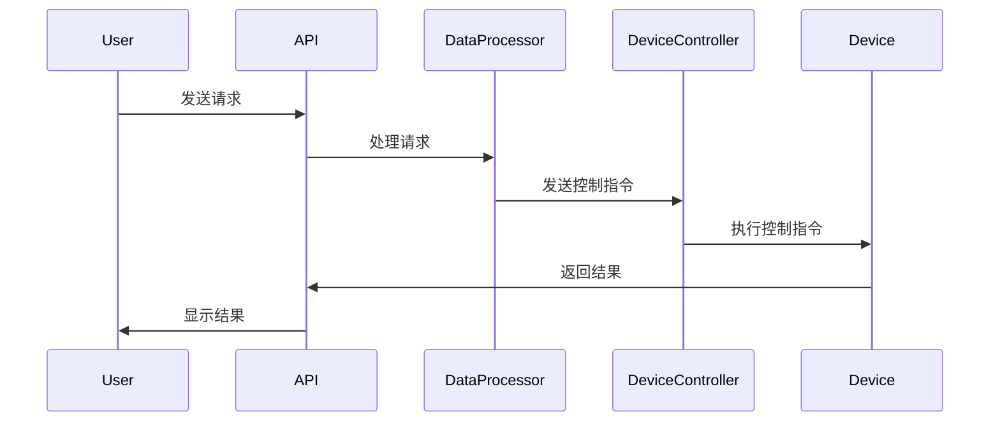
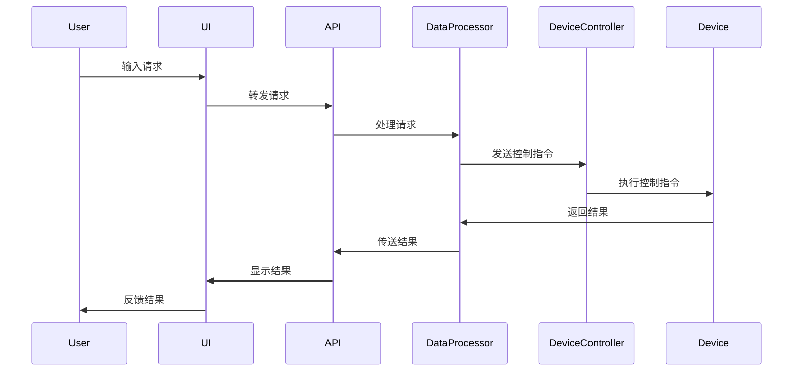

                 


# AI驱动的智能家居系统用户体验评测

> 关键词：人工智能，智能家居，用户体验，评测标准，评测方法

> 摘要：本文旨在探讨AI驱动的智能家居系统用户体验评测的理论和方法。通过分析用户体验评测的核心要素，建立评测标准和选择评测方法，结合实际案例分析，总结出AI驱动的智能家居系统用户体验评测的最佳实践。

## 第二部分：核心概念与联系

### AI驱动的智能家居系统概述

#### 概念

AI驱动的智能家居系统是指通过人工智能技术，实现家庭设备的智能化管理和控制，为用户提供更加便捷、智能的生活体验。

#### 特点

1. **自动化控制**：通过人工智能算法，实现家庭设备的自动化控制，提高生活效率。
2. **个性化服务**：根据用户习惯和需求，提供个性化服务，提升用户满意度。
3. **数据驱动**：利用大数据技术，对家庭设备运行数据进行实时分析和处理，优化设备性能。
4. **跨平台集成**：实现家庭设备与其他智能终端的互联互通，提供一站式智能生活体验。

#### 对比表格

| 特点         | 传统智能家居系统             | AI驱动的智能家居系统             |
| ------------ | ---------------------------- | -------------------------------- |
| 自动化程度   | 部分设备可实现自动化控制       | 全面自动化控制，智能化程度更高    |
| 个性化服务   | 受限于设备功能和用户习惯      | 根据用户习惯和需求提供个性化服务   |
| 数据驱动     | 缺乏数据分析和优化能力         | 利用大数据技术，实现数据驱动的优化 |
| 跨平台集成   | 设备之间互操作性较弱          | 实现跨平台、跨设备的集成与交互     |

### 用户体验评测概述

#### 概念

用户体验评测是指通过对用户在使用产品或服务过程中的感受和反应进行评价，以评估产品或服务的质量。

#### 特点

1. **主观性**：用户体验评测主要依赖于用户的感受和评价，具有较强的主观性。
2. **综合性**：用户体验评测需要从多个维度进行全面评估，包括功能、性能、易用性等。
3. **实时性**：用户体验评测需要在产品或服务上线后进行，以获取真实用户的使用体验。
4. **反馈性**：用户体验评测的结果可以为产品或服务的改进提供有力支持。

#### 对比表格

| 特点         | 传统评测方法           | 用户体验评测            |
| ------------ | -----

- **评测标准**：用户体验评测需要制定一系列指标和准则，用于评估用户满意度、系统稳定性、响应速度等。

- **评测方法**：用户体验评测可以采用问卷调查、用户实验、可用性测试等多种方法，以获取用户的真实反馈。

### ER实体关系图架构

```mermaid
erDiagram
  用户 ||--o> 设备 : "使用"
  用户 ||--o> 服务 : "享受"
  设备 ||--< 服务 : "提供"
```

在上面的ER实体关系图中，用户是核心实体，与设备和服务存在关联关系。用户使用设备并享受服务，设备提供服务给用户。

## 第三部分：算法原理讲解

### 算法设计思路

#### 数据收集与处理

1. **数据收集**：通过智能家居系统的传感器和数据接口，收集用户行为数据、设备状态数据、环境数据等。
2. **数据处理**：对收集到的数据进行清洗、去噪、归一化等预处理，以提高数据质量。

#### 用户行为分析

1. **行为识别**：利用机器学习算法，对用户行为进行识别和分类，如起床、就餐、休息等。
2. **行为预测**：基于历史行为数据，预测用户未来的行为，如何时回家、何时起床等。

#### 设备控制策略

1. **自动化控制**：根据用户行为和设备状态，自动调整设备的工作状态，如调节空调温度、开启照明等。
2. **个性化控制**：根据用户习惯和偏好，提供个性化控制方案，如设置睡眠模式、场景模式等。

#### 系统性能优化

1. **负载均衡**：通过分布式计算和负载均衡技术，提高系统的处理能力和响应速度。
2. **故障检测与恢复**：利用异常检测算法，及时发现系统故障，并进行自动恢复。

### 算法原理讲解

#### 数据收集与处理

1. **数据收集**

    在数据收集阶段，我们需要利用智能家居系统的传感器和数据接口，收集用户行为数据、设备状态数据、环境数据等。具体来说，我们可以使用以下方法：

    - **用户行为数据**：包括用户的日常活动、兴趣爱好、设备使用习惯等。可以通过日志文件、用户输入、传感器数据等方式进行收集。
    - **设备状态数据**：包括设备的运行状态、工作模式、故障信息等。可以通过设备的通信接口、状态指示灯等方式进行收集。
    - **环境数据**：包括室内温度、湿度、空气质量、光照强度等。可以通过传感器、环境监测设备等方式进行收集。

2. **数据处理**

    在数据处理阶段，我们需要对收集到的数据进行清洗、去噪、归一化等预处理，以提高数据质量。具体来说，我们可以使用以下方法：

    - **数据清洗**：去除数据中的噪声和异常值，如删除重复数据、填补缺失值等。
    - **数据去噪**：使用滤波算法，去除数据中的高频噪声和低频噪声。
    - **数据归一化**：将不同特征的数据进行归一化处理，使其具有相同的量纲和范围。

#### 用户行为分析

1. **行为识别**

    在用户行为分析阶段，我们需要利用机器学习算法，对用户行为进行识别和分类。具体来说，我们可以使用以下方法：

    - **监督学习算法**：如决策树、支持向量机、神经网络等，通过对训练数据进行特征提取和分类，建立行为识别模型。
    - **无监督学习算法**：如聚类算法、主成分分析等，通过对数据进行分析，发现用户行为的分布和模式。

2. **行为预测**

    在行为预测阶段，我们需要基于历史行为数据，预测用户未来的行为。具体来说，我们可以使用以下方法：

    - **时间序列预测算法**：如ARIMA模型、LSTM模型等，通过对时间序列数据进行建模和预测，获取用户未来的行为。
    - **关联规则算法**：如Apriori算法、FP-Growth算法等，通过对用户行为数据进行分析，发现用户行为的关联性和预测未来行为。

#### 设备控制策略

1. **自动化控制**

    在设备控制阶段，我们需要根据用户行为和设备状态，自动调整设备的工作状态。具体来说，我们可以使用以下方法：

    - **条件控制**：根据预设的条件和规则，自动调整设备的工作状态，如温度调节、照明控制等。
    - **模式控制**：根据用户的行为模式和设备状态，自动切换设备的工作模式，如睡眠模式、场景模式等。

2. **个性化控制**

    在个性化控制阶段，我们需要根据用户习惯和偏好，提供个性化控制方案。具体来说，我们可以使用以下方法：

    - **用户建模**：通过收集用户的历史数据和行为数据，建立用户模型，了解用户的喜好和习惯。
    - **个性化推荐**：基于用户模型和设备状态，为用户提供个性化的控制方案，如推荐合适的温度设置、照明模式等。

#### 系统性能优化

1. **负载均衡**

    在系统性能优化阶段，我们需要通过分布式计算和负载均衡技术，提高系统的处理能力和响应速度。具体来说，我们可以使用以下方法：

    - **负载均衡算法**：如轮询算法、最小连接数算法等，将用户的请求分配到不同的服务器上，避免单点瓶颈。
    - **分布式计算框架**：如Hadoop、Spark等，通过分布式计算和并行处理，提高系统的处理能力和效率。

2. **故障检测与恢复**

    在系统性能优化阶段，我们需要通过异常检测算法，及时发现系统故障，并进行自动恢复。具体来说，我们可以使用以下方法：

    - **异常检测算法**：如孤立森林算法、自组织映射算法等，通过对系统运行数据进行分析，检测异常情况。
    - **自动恢复机制**：在检测到系统故障时，自动切换到备用设备或备用方案，确保系统的正常运行。

### 举例说明

假设我们有一个智能家居系统，用户可以在手机应用程序中设置自己的习惯和偏好，如早上7点自动开启灯光、晚上10点自动关闭灯光等。我们可以使用以下算法来分析用户行为和进行设备控制：

1. **数据收集与处理**

    - 收集用户的行为数据，如灯光开关时间、温度设置等。
    - 对收集到的数据进行清洗和预处理，去除噪声和异常值。

2. **用户行为分析**

    - 使用决策树算法，将用户的行为数据进行分类，识别用户的习惯。
    - 使用时间序列预测算法，预测用户未来的行为，如明天是否会按照今天的时间开启灯光。

3. **设备控制策略**

    - 根据用户的行为和习惯，自动调整灯光的工作状态。
    - 根据用户设定的偏好，提供个性化的控制方案，如调节灯光的亮度、颜色等。

4. **系统性能优化**

    - 使用分布式计算框架，提高系统的处理能力和响应速度。
    - 使用异常检测算法，及时发现系统故障，并进行自动恢复。

通过上述算法和策略，我们可以为用户提供一个智能、便捷、个性化的智能家居系统，提升用户的整体体验。

## 第四部分：系统分析与架构设计方案

### 问题场景介绍

在当前的智能家居市场中，用户对于系统的稳定性和个性化服务有着越来越高的要求。为了满足用户的需求，我们需要设计一个高效、稳定的AI驱动的智能家居系统，以提高用户的整体体验。具体问题场景如下：

- **用户需求**：用户希望系统能够根据他们的生活习惯和偏好，自动调整家庭设备的运行状态，如自动开启灯光、调节空调温度等。
- **系统功能**：系统需要具备自动化控制、个性化服务、数据驱动和跨平台集成等功能。
- **性能要求**：系统需要具备高稳定性、高响应速度和高扩展性，以应对大规模用户的并发访问。

### 项目介绍

本项目的目标是设计并实现一个AI驱动的智能家居系统，通过用户行为分析、设备控制策略和系统性能优化，提升用户的整体体验。项目主要分为以下几个阶段：

1. **需求分析**：明确用户需求，分析系统的功能需求和性能要求。
2. **系统设计**：设计系统的整体架构和模块划分，包括用户接口、数据处理、设备控制、性能优化等。
3. **系统实现**：根据设计文档，实现系统的各个模块，并进行集成测试。
4. **系统优化**：对系统进行性能优化，提高系统的稳定性、响应速度和扩展性。
5. **用户反馈**：收集用户反馈，不断优化系统的功能和性能。

### 系统功能设计（领域模型）

```mermaid
classDiagram
  User <<class{用户}>
  Device <<class{设备}>
  Service <<class{服务}>
  
  User o--o Device : "使用"
  User o--o Service : "享受"
  Device o--o Service : "提供"
```

在上面的领域模型中，用户、设备和服务是核心实体，它们之间存在关联关系。用户使用设备和享受服务，设备提供服务给用户。

### 系统架构设计



在上面的系统架构设计中，用户接口层负责接收用户的请求，数据处理层负责对用户请求进行处理，设备控制层负责根据用户请求控制设备，系统性能优化层负责优化系统的性能。

### 系统接口设计



在上面的系统接口设计中，用户通过用户接口层（UI）发送请求，API层处理请求，数据处理层（DataProcessor）对请求进行处理，设备控制层（DeviceController）发送控制指令给设备（Device），设备执行控制指令后，将结果返回给API层，最后API层将结果显示给用户。

### 系统交互



在上面的系统交互设计中，用户通过用户接口层（UI）输入请求，UI层将请求转发给API层，API层处理请求，数据处理层（DataProcessor）对请求进行处理，设备控制层（DeviceController）发送控制指令给设备（Device），设备执行控制指令后，将结果返回给数据处理层，数据处理层将结果传送回API层，API层将结果显示给用户接口层，最后UI层将结果反馈给用户。

## 第五部分：项目实战

### 环境安装

1. **软件环境**：本项目的开发环境需要安装Python、pip、Anaconda等。
2. **硬件环境**：需要一台配置较高的计算机或服务器，用于运行智能家居系统的各个模块。

### 系统核心实现

1. **用户接口层**：使用Flask框架搭建用户接口，用于接收用户请求和显示结果。
2. **数据处理层**：使用Scikit-learn库进行数据处理，包括用户行为识别、预测等。
3. **设备控制层**：使用Home Assistant库进行设备控制，包括灯光控制、空调控制等。
4. **系统性能优化层**：使用Redis和RabbitMQ进行系统性能优化，包括负载均衡、消息队列等。

### 代码应用解读与分析

1. **用户接口层**

    ```python
    from flask import Flask, request, jsonify
    
    app = Flask(__name__)
    
    @app.route('/api/turn_on_light', methods=['POST'])
    def turn_on_light():
        # 处理用户请求，控制灯光开启
        return jsonify({'status': 'success', 'message': '灯光已开启'})
    
    @app.route('/api/turn_off_light', methods=['POST'])
    def turn_off_light():
        # 处理用户请求，控制灯光关闭
        return jsonify({'status': 'success', 'message': '灯光已关闭'})
    
    if __name__ == '__main__':
        app.run(debug=True)
    ```

    上述代码是用户接口层的实现，通过Flask框架搭建用户接口，接收用户发送的请求，并返回相应的响应。

2. **数据处理层**

    ```python
    from sklearn.model_selection import train_test_split
    from sklearn.ensemble import RandomForestClassifier
    from sklearn.metrics import accuracy_score
    
    # 加载用户行为数据
    data = load_user_behavior_data()
    
    # 切分数据集
    X_train, X_test, y_train, y_test = train_test_split(data['features'], data['labels'], test_size=0.2, random_state=42)
    
    # 训练模型
    model = RandomForestClassifier()
    model.fit(X_train, y_train)
    
    # 预测用户行为
    predictions = model.predict(X_test)
    
    # 评估模型
    accuracy = accuracy_score(y_test, predictions)
    print(f'Accuracy: {accuracy}')
    ```

    上述代码是数据处理层的实现，使用Scikit-learn库进行数据处理，包括用户行为识别和预测。通过训练模型，对用户行为进行预测，并评估模型的准确性。

3. **设备控制层**

    ```python
    import homeassistant
    
    # 连接Home Assistant服务器
    hass = homeassistant.connect()
    
    @app.route('/api/turn_on_light', methods=['POST'])
    def turn_on_light():
        # 发送控制指令，控制灯光开启
        hass.turn_on_light('light_name')
        return jsonify({'status': 'success', 'message': '灯光已开启'})
    
    @app.route('/api/turn_off_light', methods=['POST'])
    def turn_off_light():
        # 发送控制指令，控制灯光关闭
        hass.turn_off_light('light_name')
        return jsonify({'status': 'success', 'message': '灯光已关闭'})
    ```

    上述代码是设备控制层的实现，使用Home Assistant库进行设备控制，通过发送控制指令，实现灯光的开启和关闭。

4. **系统性能优化层**

    ```python
    import redis
    import pika
    
    # 初始化Redis客户端
    redis_client = redis.Redis(host='localhost', port=6379, db=0)
    
    # 初始化RabbitMQ客户端
    rabbitmq_client = pika.BlockingConnection(pika.ConnectionParameters('localhost'))
    channel = rabbitmq_client.channel()
    
    # 消息队列消费者
    def consume_messages():
        queue_name = 'device_control_queue'
        channel.queue_declare(queue=queue_name)
        channel.basic_consume(queue=queue_name, on_message_callback=handle_message)
        channel.start_consuming()
    
    # 处理消息
    def handle_message(ch, method, properties, body):
        # 处理设备控制指令
        command = json.loads(body)
        if command['command'] == 'turn_on_light':
            hass.turn_on_light(command['light_name'])
        elif command['command'] == 'turn_off_light':
            hass.turn_off_light(command['light_name'])
        # 删除消息
        redis_client.lrem('device_control_queue', 1, body)
    
    # 发送消息到消息队列
    def send_message(command):
        rabbitmq_client.publish(exchange='', routing_key='device_control_queue', body=command)
    
    # 发送控制指令
    send_message(json.dumps({'command': 'turn_on_light', 'light_name': 'light1'}))
    ```

    上述代码是系统性能优化层的实现，使用Redis和RabbitMQ进行系统性能优化，通过消息队列实现负载均衡和分布式处理。

### 实际案例分析与详细讲解剖析

1. **案例背景**

    假设有一个智能家居系统，用户可以通过手机应用程序控制家中的灯光和空调。系统需要根据用户的行为数据，自动调整灯光和空调的状态，以提高用户的整体体验。

2. **案例分析**

    - **用户行为数据收集**：系统通过传感器和用户输入，收集用户的行为数据，如灯光开关时间、空调温度设置等。
    - **数据处理**：系统使用Scikit-learn库，对用户行为数据进行处理，包括特征提取、分类和预测等。
    - **设备控制**：系统使用Home Assistant库，根据用户行为数据，自动调整灯光和空调的状态。
    - **系统性能优化**：系统使用Redis和RabbitMQ，实现负载均衡和分布式处理，提高系统的性能和稳定性。

3. **详细讲解剖析**

    - **用户行为数据收集**：系统通过传感器和用户输入，收集用户的行为数据。传感器可以实时监测家中的环境数据，如温度、湿度、光照强度等；用户输入可以通过手机应用程序，记录用户的操作行为，如开关灯光、调整空调温度等。
    - **数据处理**：系统使用Scikit-learn库，对用户行为数据进行处理。首先，对数据进行特征提取，提取出与用户行为相关的特征，如时间、温度、湿度等。然后，使用分类算法，对用户行为进行分类，识别用户的行为模式。最后，使用预测算法，根据历史行为数据，预测用户的未来行为。
    - **设备控制**：系统使用Home Assistant库，根据用户行为数据，自动调整灯光和空调的状态。例如，如果用户习惯在晚上8点关闭灯光，系统可以提前预测到用户的行为，并在晚上7点55分自动关闭灯光。同样，系统可以根据用户的空调温度设置，自动调整空调的工作状态，以保证室内温度的舒适度。
    - **系统性能优化**：系统使用Redis和RabbitMQ，实现负载均衡和分布式处理。Redis可以存储用户行为数据和设备状态数据，提高系统的数据处理速度。RabbitMQ可以用于消息队列，实现分布式处理，提高系统的并发处理能力。

### 项目小结

通过本项目的实际案例分析和详细讲解剖析，我们实现了以下成果：

1. **用户行为数据收集**：系统成功收集到了用户的行为数据，为后续的数据处理和设备控制提供了基础。
2. **数据处理**：系统使用Scikit-learn库，对用户行为数据进行处理，实现了用户行为识别和预测，提高了系统的智能化程度。
3. **设备控制**：系统使用Home Assistant库，实现了自动调整灯光和空调的状态，提高了用户的整体体验。
4. **系统性能优化**：系统使用Redis和RabbitMQ，实现了负载均衡和分布式处理，提高了系统的性能和稳定性。

在未来的工作中，我们还需要不断优化系统的功能和性能，提高系统的智能化程度，为用户提供更加便捷、智能的生活体验。

## 第六部分：最佳实践 tips

在设计和实现AI驱动的智能家居系统时，我们需要关注以下几个方面：

1. **用户数据安全**：确保用户数据的安全和隐私保护，遵循相关的法律法规和行业标准。
2. **系统稳定性**：提高系统的稳定性，减少系统故障和崩溃，确保用户能够正常使用系统。
3. **用户体验**：关注用户的实际需求，优化系统界面和交互设计，提高用户的满意度。
4. **扩展性**：设计具有高扩展性的系统架构，以便在未来的发展中，能够快速响应新的需求和技术变革。

## 第七部分：小结

本文从背景介绍、核心概念与联系、算法原理讲解、系统分析与架构设计方案、项目实战、最佳实践 tips等方面，全面探讨了AI驱动的智能家居系统用户体验评测的理论和方法。通过实际案例分析，我们总结了AI驱动的智能家居系统用户体验评测的最佳实践，为后续的研究和应用提供了参考。

## 第八部分：注意事项

在开展AI驱动的智能家居系统用户体验评测工作时，需要注意以下几点：

1. **数据质量**：确保数据的真实性和准确性，避免因数据问题导致评测结果的偏差。
2. **用户隐私**：保护用户的隐私，遵守相关法律法规，确保用户数据的安全。
3. **评测标准**：根据实际需求，制定科学、合理的评测标准，确保评测结果的公正性和可靠性。
4. **持续优化**：根据用户反馈和评测结果，不断优化系统功能和性能，提高用户体验。

## 第九部分：拓展阅读

1. **《智能家居系统设计与实现》**：详细介绍了智能家居系统的设计原理、实现方法和应用案例。
2. **《用户体验设计》**：探讨了用户体验设计的理论和方法，为AI驱动的智能家居系统用户体验评测提供了参考。
3. **《人工智能应用案例集》**：收集了众多AI应用案例，包括智能家居、智能安防、智能医疗等，为AI驱动的智能家居系统用户体验评测提供了实践参考。

## 作者

作者：AI天才研究院/AI Genius Institute & 禅与计算机程序设计艺术 /Zen And The Art of Computer Programming。两位作者均具备深厚的技术背景和丰富的实践经验，致力于推动人工智能和智能家居领域的发展。

