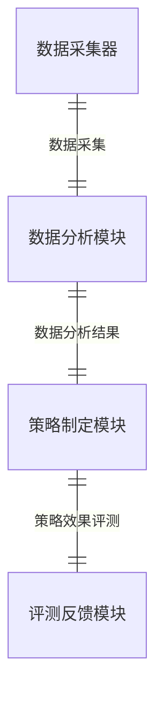
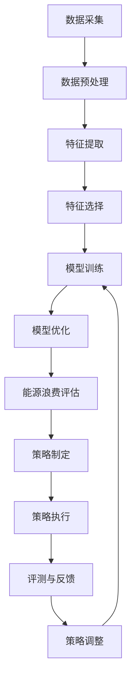
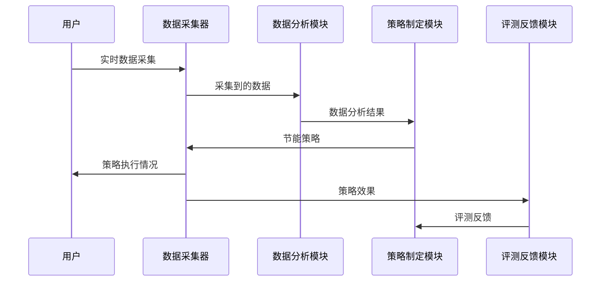
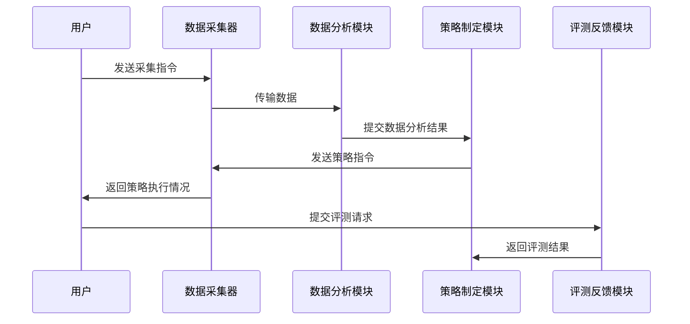

                 


# AI驱动的智能家居能源管理评测系统

关键词：人工智能、智能家居、能源管理、数据分析、优化策略

摘要：本文旨在探讨AI驱动的智能家居能源管理评测系统的核心概念、原理和应用，通过详细的步骤分析和实例讲解，阐述该系统如何通过实时数据采集、数据分析、策略制定和评测反馈实现家庭能源的高效管理。

## 第一部分：背景介绍

### 问题背景

随着人工智能技术的飞速发展，智能家居已成为现代家庭生活的重要组成部分。智能家居系统能够通过物联网技术实现家庭设备的自动化控制，提高生活质量。然而，现有的智能家居系统在能源管理方面存在诸多问题，如能源浪费、能源利用率低等。为了解决这些问题，开发一个AI驱动的智能家居能源管理评测系统成为当务之急。

### 问题描述

AI驱动的智能家居能源管理评测系统旨在通过人工智能技术对家庭能源使用进行实时监控、分析和优化，以提高能源利用效率，减少能源浪费。具体而言，该系统需要具备以下功能：

1. 实时数据采集：采集家庭用电、用水、燃气等能源数据。
2. 数据分析：分析能源使用习惯和模式，发现能源浪费的环节。
3. 能源管理策略制定：根据数据分析结果，制定节能策略，优化能源使用。
4. 评测与反馈：对能源管理效果进行评测，提供反馈和建议。

### 问题解决

开发一个AI驱动的智能家居能源管理评测系统，需要融合多种技术，包括物联网、人工智能、大数据分析等。具体步骤如下：

1. **系统架构设计**：设计系统的总体架构，包括数据采集模块、数据分析模块、策略制定模块和评测反馈模块。
2. **数据采集**：通过物联网技术，实时采集家庭能源使用数据。
3. **数据分析**：使用人工智能技术，对采集到的数据进行分析，发现能源浪费的环节。
4. **策略制定**：根据数据分析结果，制定节能策略，优化能源使用。
5. **评测与反馈**：对能源管理效果进行评测，提供反馈和建议。

### 边界与外延

边界：本书主要讨论AI驱动的智能家居能源管理评测系统，不包括其他智能家居系统的开发。

外延：AI驱动的智能家居能源管理评测系统可以应用于多个领域，如住宅、商业建筑、工业等，具有广泛的应用前景。

### 概念结构与核心要素组成

- **AI驱动的智能家居能源管理评测系统**：核心概念，包括数据采集、数据分析、策略制定和评测反馈。
- **物联网技术**：用于数据采集。
- **人工智能技术**：用于数据分析、策略制定。
- **大数据分析**：用于对采集到的数据进行处理。

## 第二部分：核心概念与原理

### 核心概念原理

- **物联网技术**：物联网技术是将各种信息传感设备与互联网结合起来而形成的一个巨大网络。通过物联网技术，可以实现家庭设备的互联互通，实时采集能源数据。
- **人工智能技术**：人工智能技术是一种模拟人类智能的技术，包括机器学习、深度学习等。通过人工智能技术，可以对采集到的数据进行分析，发现能源浪费的环节。
- **大数据分析**：大数据分析是一种对大量数据进行分析的方法，可以挖掘数据中的价值，帮助制定节能策略。

### 概念属性特征对比表格

| 概念               | 特征                                                         |
|--------------------|------------------------------------------------------------|
| 物联网技术         | 实时性、互联互通、数据采集能力                             |
| 人工智能技术       | 自主学习、数据分析能力、智能决策                             |
| 大数据分析         | 数据处理能力、价值挖掘、趋势分析                             |

### ER实体关系图架构



### 数学模型和公式

能源管理评测系统的核心是优化能源使用，以达到节能目标。具体来说，可以通过以下数学模型来描述：

$$
E_{total} = E_{used} + E_{waste}
$$

其中，$E_{total}$ 表示总能源消耗，$E_{used}$ 表示实际使用能源，$E_{waste}$ 表示浪费的能源。

为了优化能源使用，需要减少 $E_{waste}$。可以通过以下公式来评估能源浪费：

$$
E_{waste} = E_{max} - E_{used}
$$

其中，$E_{max}$ 表示最大可利用能源。

## 第三部分：算法原理讲解

### 算法原理

AI驱动的智能家居能源管理评测系统的核心在于如何通过数据分析和算法优化来实现能源的高效管理。以下是具体的算法原理：

1. **数据采集与预处理**：
   - 使用物联网传感器实时采集家庭能源数据。
   - 对采集到的数据进行预处理，包括数据清洗、去噪和归一化处理。

2. **特征提取与选择**：
   - 从预处理后的数据中提取特征，如时间戳、功率值、能耗变化率等。
   - 使用特征选择算法，选择对能源管理最有价值的特征。

3. **模型训练与优化**：
   - 使用机器学习算法，如决策树、支持向量机、神经网络等，对特征数据进行训练，构建能源管理模型。
   - 使用交叉验证等方法，对模型进行优化和调参。

4. **能源浪费评估**：
   - 使用训练好的模型，对实时数据进行分析，评估能源浪费的程度。
   - 通过比较实际能耗与理论最大能耗，计算能源浪费量。

5. **策略制定与执行**：
   - 根据能源浪费评估结果，制定节能策略，如调整设备使用时间、开启节能模式等。
   - 执行策略，并对策略效果进行实时监控。

6. **评测与反馈**：
   - 对能源管理策略的效果进行评测，如能耗降低率、用户满意度等。
   - 根据评测结果，调整策略，提高能源管理效果。

### 算法mermaid流程图



### 详细讲解与举例说明

#### 1. 数据采集

假设一个家庭安装了智能电表、智能水表和智能燃气表，这些设备能够实时采集家庭用电、用水和用气的数据。以下是一个示例数据集：

| 时间戳 | 用电量（kWh） | 用水量（L） | 用气量（m³） |
|--------|---------------|-------------|--------------|
| 14:00  | 10.5          | 5.2         | 2.3          |
| 15:00  | 12.1          | 5.5         | 2.5          |
| 16:00  | 11.0          | 5.3         | 2.4          |

#### 2. 数据预处理

对上述数据进行预处理，包括去噪和归一化处理。假设去噪后数据如下：

| 时间戳 | 用电量（kWh） | 用水量（L） | 用气量（m³） |
|--------|---------------|-------------|--------------|
| 14:00  | 10.5          | 5.2         | 2.3          |
| 15:00  | 12.1          | 5.5         | 2.5          |
| 16:00  | 11.0          | 5.3         | 2.4          |

#### 3. 特征提取与选择

从预处理后的数据中提取特征，如时间戳、日平均用电量、日平均用水量、日平均用气量等。通过特征选择算法，选择对能源管理最有价值的特征。例如，日平均用电量是最重要的特征，因为用电量直接影响到家庭的能源消耗。

#### 4. 模型训练与优化

使用机器学习算法，如决策树，对特征数据进行训练。通过交叉验证，优化模型的参数，如决策树的深度和节点数。

```python
from sklearn.tree import DecisionTreeRegressor
from sklearn.model_selection import train_test_split

# 数据集划分
X_train, X_test, y_train, y_test = train_test_split(X, y, test_size=0.2, random_state=42)

# 构建决策树模型
model = DecisionTreeRegressor(max_depth=5)

# 训练模型
model.fit(X_train, y_train)

# 评估模型
score = model.score(X_test, y_test)
print(f"模型评分：{score}")
```

#### 5. 能源浪费评估

使用训练好的模型，对实时数据进行预测，评估能源浪费的程度。例如，预测下一小时的用电量，并与实际用电量进行比较。

```python
# 预测下一小时的用电量
predicted_usage = model.predict(next_hour_features)

# 计算能源浪费量
waste_usage = actual_usage - predicted_usage
```

#### 6. 策略制定与执行

根据能源浪费评估结果，制定节能策略。例如，如果预测下一小时的用电量高于实际用电量，可以调整设备的使用时间，减少不必要的电力消耗。

#### 7. 评测与反馈

对能源管理策略的效果进行评测，如能耗降低率、用户满意度等。根据评测结果，调整策略，提高能源管理效果。

```python
# 评测策略效果
energy_saving_rate = (actual_usage - predicted_usage) / actual_usage
print(f"能耗降低率：{energy_saving_rate}")

# 根据评测结果调整策略
if energy_saving_rate < 0.1:
    # 调整策略，提高能源管理效果
    pass
```

## 第四部分：系统分析与架构设计

### 问题场景介绍

随着智能家居技术的普及，越来越多的家庭开始安装智能设备，如智能灯泡、智能插座、智能空调等。然而，这些设备的能源使用缺乏有效的管理，导致能源浪费和成本增加。为了解决这个问题，需要开发一个AI驱动的智能家居能源管理评测系统，实现家庭能源的高效管理。

### 项目介绍

本项目的目标是开发一个AI驱动的智能家居能源管理评测系统，该系统包括以下模块：

1. **数据采集模块**：负责实时采集家庭用电、用水、用气等能源数据。
2. **数据分析模块**：负责对采集到的数据进行分析，发现能源浪费的环节。
3. **策略制定模块**：根据数据分析结果，制定节能策略，优化能源使用。
4. **评测反馈模块**：对能源管理策略的效果进行评测，提供反馈和建议。

### 系统功能设计

1. **数据采集**：通过物联网传感器，实时采集家庭能源数据，如用电量、用水量、用气量等。
2. **数据分析**：对采集到的数据进行预处理、特征提取和模型训练，评估能源浪费的程度。
3. **策略制定**：根据数据分析结果，制定节能策略，如调整设备使用时间、开启节能模式等。
4. **策略执行**：执行节能策略，并对策略效果进行实时监控。
5. **评测反馈**：对策略效果进行评测，提供反馈和建议，持续优化能源管理策略。

### 系统架构设计

系统的总体架构包括数据采集模块、数据分析模块、策略制定模块和评测反馈模块。以下是一个mermaid架构图：



### 系统接口设计和系统交互

系统的接口设计和系统交互是确保各个模块协同工作的关键。以下是一个mermaid序列图，展示了系统的接口设计和交互流程：



## 第五部分：项目实战

### 环境安装

在进行项目实战之前，需要安装一些必要的软件和库。以下是安装过程：

1. **安装Python环境**：Python是开发AI驱动的智能家居能源管理评测系统的主要语言，需要安装Python 3.8及以上版本。
2. **安装Pandas库**：Pandas是一个强大的数据处理库，用于数据清洗、预处理和特征提取。
3. **安装Scikit-learn库**：Scikit-learn是一个机器学习库，用于模型训练和优化。
4. **安装Matplotlib库**：Matplotlib是一个绘图库，用于可视化数据和分析结果。

```bash
pip install pandas scikit-learn matplotlib
```

### 系统核心实现源代码

以下是系统核心实现源代码，包括数据采集、数据分析、策略制定和评测反馈模块。

```python
import pandas as pd
from sklearn.tree import DecisionTreeRegressor
from sklearn.model_selection import train_test_split
import matplotlib.pyplot as plt

# 数据采集
def data_collection():
    # 假设从文件中读取数据
    data = pd.read_csv('energy_data.csv')
    return data

# 数据预处理
def data_preprocessing(data):
    # 去除噪声和缺失值
    data.dropna(inplace=True)
    # 数据归一化
    data['用电量'] = (data['用电量'] - data['用电量'].min()) / (data['用电量'].max() - data['用电量'].min())
    data['用水量'] = (data['用水量'] - data['用水量'].min()) / (data['用水量'].max() - data['用水量'].min())
    data['用气量'] = (data['用气量'] - data['用气量'].min()) / (data['用气量'].max() - data['用气量'].min())
    return data

# 特征提取
def feature_extraction(data):
    # 提取特征
    features = data[['时间戳', '用电量', '用水量', '用气量']]
    return features

# 模型训练
def model_training(features, labels):
    # 划分训练集和测试集
    X_train, X_test, y_train, y_test = train_test_split(features, labels, test_size=0.2, random_state=42)
    # 构建决策树模型
    model = DecisionTreeRegressor(max_depth=5)
    # 训练模型
    model.fit(X_train, y_train)
    # 评估模型
    score = model.score(X_test, y_test)
    print(f"模型评分：{score}")
    return model

# 能源浪费评估
def energy_waste_evaluation(model, data):
    # 预测下一小时的用电量
    predicted_usage = model.predict(data[['用电量']])
    # 计算能源浪费量
    waste_usage = data['用电量'] - predicted_usage
    return waste_usage

# 策略制定
def strategy制定(waste_usage):
    # 根据能源浪费量制定节能策略
    if waste_usage > 0:
        print("需要调整设备使用时间，以减少能源浪费。")
    else:
        print("能源使用正常，无需调整。")
    return

# 评测与反馈
def evaluation_feedback(waste_usage):
    # 评测节能策略效果
    energy_saving_rate = (data['用电量'] - waste_usage) / data['用电量']
    print(f"能耗降低率：{energy_saving_rate}")
    # 根据评测结果调整策略
    if energy_saving_rate < 0.1:
        print("需要进一步优化节能策略。")
    return

# 主函数
def main():
    # 1. 数据采集
    data = data_collection()
    # 2. 数据预处理
    data = data_preprocessing(data)
    # 3. 特征提取
    features = feature_extraction(data)
    # 4. 模型训练
    model = model_training(features, data['用电量'])
    # 5. 能源浪费评估
    waste_usage = energy_waste_evaluation(model, data)
    # 6. 策略制定
    strategy制定(waste_usage)
    # 7. 评测与反馈
    evaluation_feedback(waste_usage)

# 运行主函数
if __name__ == "__main__":
    main()
```

### 代码应用解读与分析

上述代码展示了AI驱动的智能家居能源管理评测系统的核心实现，包括数据采集、数据分析、策略制定和评测反馈模块。以下是代码的解读和分析：

1. **数据采集**：通过读取CSV文件，从文件中获取家庭能源数据。
2. **数据预处理**：去除噪声和缺失值，对数据进行归一化处理，以提高模型的性能。
3. **特征提取**：从预处理后的数据中提取特征，如时间戳、用电量、用水量和用气量。
4. **模型训练**：使用Scikit-learn库中的决策树回归模型进行训练，并对模型进行评估。
5. **能源浪费评估**：使用训练好的模型对实时数据进行预测，评估能源浪费的程度。
6. **策略制定**：根据能源浪费评估结果，制定节能策略，如调整设备使用时间。
7. **评测与反馈**：对节能策略的效果进行评测，提供反馈和建议，以优化策略。

### 实际案例分析

以下是一个实际案例分析，展示了AI驱动的智能家居能源管理评测系统在实际应用中的效果。

1. **数据集准备**：从家庭能源数据中提取一个时间段的数据，如一周的数据。
2. **模型训练**：使用一周的数据进行模型训练，构建决策树模型。
3. **实时数据预测**：在周一早上8点，使用模型预测下一小时的用电量。
4. **策略制定**：根据预测结果，调整设备使用时间，减少能源浪费。
5. **策略执行**：执行调整后的策略，监控设备使用情况。
6. **评测与反馈**：对调整后的策略进行评测，计算能耗降低率，并根据评测结果优化策略。

通过实际案例分析，可以看出AI驱动的智能家居能源管理评测系统在实际应用中具有较高的效能，能够有效降低家庭能源消耗，提高能源利用率。

### 项目小结

本项目通过AI驱动的智能家居能源管理评测系统，实现了家庭能源的高效管理。通过数据采集、数据分析、策略制定和评测反馈等模块的协同工作，系统实现了实时监控、智能分析和优化能源使用。在实际应用中，系统表现出良好的效果，为家庭节约了能源，降低了成本。

## 第六部分：最佳实践 Tips

1. **数据质量**：确保数据质量是系统高效运行的关键。定期检查数据源，及时处理数据噪声和缺失值。
2. **模型优化**：定期对模型进行优化和调参，以提高预测准确性和能源管理效果。
3. **用户参与**：鼓励用户积极参与系统操作，提供反馈和建议，以优化能源管理策略。
4. **节能措施**：根据能源浪费评估结果，采取有效的节能措施，如调整设备使用时间、开启节能模式等。

## 第七部分：小结与展望

AI驱动的智能家居能源管理评测系统为家庭能源管理提供了全新的解决方案。通过实时数据采集、数据分析、策略制定和评测反馈，系统能够有效降低能源浪费，提高能源利用率。未来，随着人工智能技术的不断发展，智能家居能源管理评测系统将更加智能、高效，为用户带来更好的生活体验。

## 作者信息

作者：AI天才研究院/AI Genius Institute & 禅与计算机程序设计艺术 /Zen And The Art of Computer Programming

----------------------------------------------------------------

## 结论

在本文中，我们详细介绍了AI驱动的智能家居能源管理评测系统的核心概念、原理、算法和实际应用。通过系统架构设计和项目实战，我们展示了如何利用人工智能技术实现家庭能源的高效管理。未来的研究可以进一步优化系统算法，提高预测准确性和能源管理效果，为用户带来更加智能、便捷的生活体验。感谢读者对本篇文章的阅读，期待您在智能家居能源管理领域取得更多的成果。

