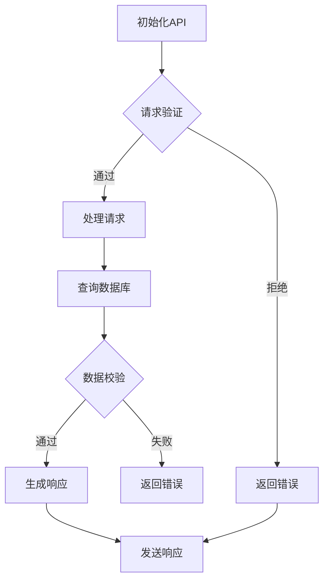

                 

# API优先策略：提高LLM应用的灵活性

## 关键词

- API优先策略
- LLM应用
- 软件开发
- 系统整合
- 可扩展性

## 摘要

随着人工智能技术的发展，大型语言模型（LLM）在自然语言处理领域展现出巨大的潜力。然而，如何高效地集成和扩展LLM应用，成为开发者面临的一大挑战。本文将探讨API优先策略在提高LLM应用灵活性和可扩展性方面的作用。通过详细分析API优先策略的核心概念、算法原理及其在实际应用中的实现，为开发者提供一种切实可行的解决方案。

## 第1章：API优先策略概述

### 1.1 问题背景

在当前的技术环境中，API（应用程序编程接口）已成为软件开发的核心组成部分。随着软件系统的复杂性和规模的增长，如何有效利用API来提高软件开发的效率和灵活性，成为了企业面临的重要挑战。传统的软件开发方法往往侧重于实现特定功能，而忽视了API在提高系统整合性和可扩展性方面的潜力。

### 1.2 问题描述

API优先策略是一种新的软件开发范式，其核心思想是将API设计作为软件开发的首要任务。这意味着在系统设计初期，开发者就需要考虑如何创建易于使用、扩展性强的API。然而，传统的软件开发过程往往在需求确定和系统设计阶段后才考虑API设计，导致后期出现大量的API修改和重构，增加了开发成本和风险。

### 1.3 问题解决

API优先策略通过提前规划和设计API，确保系统在开发初期就具有良好的接口和集成性。这种方法不仅可以提高开发效率，还能提高系统的可维护性和可扩展性。具体来说，API优先策略包括以下几个方面：

- **API设计规范化**：制定统一的API设计规范，确保API的一致性和可理解性。
- **API版本控制**：通过API版本控制，实现新旧API的兼容，降低系统升级的复杂性。
- **API测试与验证**：在开发过程中，对API进行全面的测试和验证，确保API的稳定性和可靠性。
- **API文档化**：提供详细的API文档，帮助开发者快速理解和使用API。

### 1.4 边界与外延

API优先策略不仅仅适用于内部系统开发，也适用于外部系统集成和第三方服务调用。在跨系统、跨语言的开发环境中，API优先策略能够发挥更大的作用。同时，API优先策略需要与企业的整体技术战略相结合，确保API的设计和实施与企业的长远发展目标一致。

### 1.5 概念结构与核心要素组成

API优先策略的核心要素包括：

- **API设计规范**：明确API的设计原则、命名规则、数据结构等。
- **API版本管理**：实现API的版本控制，确保系统升级时的兼容性。
- **API测试与验证**：通过自动化测试和手动测试，验证API的稳定性和可靠性。
- **API文档化**：提供API使用说明、示例代码等文档，方便开发者使用。

### 1.6 本章小结

本章介绍了API优先策略的背景、问题描述、问题解决方法、边界与外延以及概念结构与核心要素组成。API优先策略是一种提高软件开发效率和灵活性的有效方法，适用于各种规模的软件开发项目。通过遵循API优先策略，企业能够构建更加健壮、灵活和可扩展的软件系统。

## 第2章：API优先策略的核心概念与联系

### 2.1 API定义与核心概念

API（应用程序编程接口）是软件系统之间进行交互的接口。它定义了一套规则和协议，通过这些规则和协议，不同的软件系统能够相互调用和传递数据。API的核心概念包括：

- **接口定义**：API的定义，包括方法的名称、参数、返回值和数据格式等。
- **协议规范**：API通信的协议，如HTTP、HTTPS、RESTful API等。
- **数据格式**：API传递数据的格式，如JSON、XML、Protocol Buffers等。

### 2.2 API属性特征对比表格

在设计和选择API时，需要考虑多个属性特征。以下是一个API属性特征的对比表格：

| 属性 | HTTP API | RESTful API | GraphQL API |
|------|----------|-------------|-------------|
| **数据格式** | JSON、XML | JSON、XML | JSON、GraphQL查询语言 |
| **查询能力** | 短查询 | 复杂查询 | 强大的查询能力 |
| **响应时间** | 较快 | 较快 | 可变 |
| **灵活性** | 中等 | 高 | 高 |

### 2.3 ER实体关系图架构

为了更好地理解API的设计和实现，可以使用ER（实体-关系）图来描述系统中的实体和关系。以下是一个简化的API系统的ER实体关系图：

```mermaid
erDiagram
  API ||--|{ Request } : 请求实体
  API ||--|{ Response } : 响应实体
  Request ||--|{ Parameter } : 参数实体
  Response ||--|{ Result } : 结果实体
```

## 第3章：API优先策略的算法原理讲解

### 3.1 API设计算法原理

API设计不仅仅是一个技术问题，更是一个设计艺术。在设计API时，我们需要考虑以下几个方面：

1. **功能与结构设计**：明确API需要实现的功能，并设计合理的接口结构。这包括接口的层次结构、命名规则、参数设计等。

2. **安全性设计**：API的安全性至关重要。在设计API时，需要考虑如何防止常见的攻击，如SQL注入、XSS攻击等。

3. **性能优化**：API的性能直接影响用户体验。在设计API时，需要考虑如何优化响应时间，如使用缓存、减少数据库查询等。

4. **可扩展性设计**：随着业务的发展，API需要具备良好的可扩展性。在设计时，需要考虑如何方便地添加新功能、调整参数等。

### 3.2 API设计算法示例

以下是一个简单的API设计算法示例：

```python
def design_api(function_name, parameters, return_type):
    """
    API设计算法

    :param function_name: 接口名称
    :param parameters: 参数列表
    :param return_type: 返回值类型
    :return: 设计好的API接口
    """
    # 定义接口结构
    api = {
        "name": function_name,
        "parameters": parameters,
        "return_type": return_type
    }

    # 添加接口注释
    api["comment"] = f"{function_name}接口的功能描述"

    # 添加安全性检查
    api["security_checks"] = ["参数校验", "权限验证"]

    # 添加性能优化措施
    api["optimizations"] = ["使用缓存", "减少数据库查询"]

    return api
```

### 3.3 API设计算法原理讲解

在设计API时，我们需要遵循一些基本原理：

1. **功能与结构设计**：

   - **明确接口功能**：确保每个接口都有明确的功能和用途，避免接口过于复杂。

   - **层次化设计**：将接口按功能进行分组，形成清晰的层次结构。

   - **命名规则**：使用具有描述性的名称，便于理解和维护。

2. **安全性设计**：

   - **参数校验**：对输入参数进行严格校验，确保参数符合预期格式和范围。

   - **权限验证**：确保只有具备相应权限的用户才能访问接口。

3. **性能优化**：

   - **使用缓存**：对于高频访问的数据，可以使用缓存来减少数据库查询。

   - **减少数据库查询**：通过优化数据库查询，减少查询次数和数据量。

4. **可扩展性设计**：

   - **模块化设计**：将接口按功能模块划分，便于后续扩展。

   - **参数化设计**：允许接口参数动态调整，以适应不同场景。

通过遵循这些原理，我们可以设计出高效、安全、可靠的API，为后续开发提供坚实基础。

## 第4章：系统分析与架构设计

### 4.1 问题场景介绍

假设我们正在开发一个基于大型语言模型（LLM）的智能客服系统。该系统需要提供问答、对话生成等功能，支持多种语言和多种业务场景。为了提高系统的灵活性和可扩展性，我们决定采用API优先策略。

### 4.2 项目介绍

项目名称：智能客服系统（Smart Customer Service System，简称SCSS）

项目目标：构建一个高效、灵活、可扩展的智能客服系统，提供高质量的客户服务。

### 4.3 系统功能设计

根据需求，智能客服系统需要实现以下核心功能：

- **问答功能**：基于用户输入的问题，智能客服系统需要返回合适的答案。
- **对话生成**：根据用户的历史对话记录，系统需要生成连贯、自然的对话。
- **多语言支持**：系统需要支持多种语言，以满足不同客户的需求。
- **业务场景定制**：根据不同行业的业务特点，系统需要提供定制化的服务。

### 4.4 系统架构设计

智能客服系统的整体架构如下：

```
+----------------+       +----------------+       +----------------+
|       前端应用  |------>|       API网关   |------>|       LLM服务   |
+----------------+       +----------------+       +----------------+
       |                                                      |
       |                                                      |
       |                                                      |
       |                      |                          |
       |       业务应用       |      数据存储与处理       |
       |                      |                          |
+------+-----------+        +--------------------------+
|      客户服务     |        |       数据库      |        |       模型训练   |
|  应用模块1       |        |       文档库      |        |       数据处理   |
|  应用模块2       |        |       语料库      |        |       模型评估   |
|  应用模块3       |        |       训练集      |        |       模型部署   |
+----------------+        +--------------------------+
```

### 4.5 系统接口设计

为了实现系统功能，我们需要设计多个API接口。以下是一个简化的接口设计：

```
# 用户接口
POST /api/user/question
{
    "username": "user123",
    "question": "What is the capital of France?"
}

# 问答接口
POST /api/qa/answer
{
    "question": "What is the capital of France?"
}

# 对话生成接口
POST /api/dialog/generate
{
    "user_id": "user123",
    "history": ["Hello", "What can you do for me?"]
}

# 多语言支持接口
GET /api/languages
```

### 4.6 系统交互

以下是一个简化的系统交互流程：

1. 用户通过前端应用发送问题到API网关。
2. API网关对请求进行解析和路由，将请求转发到相应的业务应用。
3. 业务应用处理请求，生成答案或对话，并将结果返回给前端应用。
4. 前端应用将结果展示给用户。

## 第5章：项目实战

### 5.1 环境安装

在本项目实战中，我们将使用Python和Flask框架来构建API服务。以下是在Linux环境中安装所需依赖的步骤：

```bash
# 安装Python3
sudo apt-get update
sudo apt-get install python3

# 安装Flask
pip3 install Flask

# 安装其他依赖
pip3 install Flask-RESTful
pip3 install Flask-SQLAlchemy
```

### 5.2 系统核心实现

以下是一个简单的Flask API服务实现，用于处理用户问答：

```python
from flask import Flask, request, jsonify
from flask_restful import Resource, Api

app = Flask(__name__)
api = Api(app)

class QuestionAnswer(Resource):
    def post(self):
        data = request.get_json()
        question = data.get('question', '')
        answer = get_answer(question)  # 假设这是一个从数据库或模型中获取答案的函数
        return {'answer': answer}

api.add_resource(QuestionAnswer, '/api/qa/answer')

if __name__ == '__main__':
    app.run(debug=True)
```

### 5.3 代码应用解读与分析

在上面的代码中，我们定义了一个名为`QuestionAnswer`的类，继承自`Resource`。这个类负责处理POST请求，解析请求体中的JSON数据，获取问题，并调用`get_answer`函数获取答案，最后返回JSON格式的响应。

```python
data = request.get_json()
question = data.get('question', '')
answer = get_answer(question)
return {'answer': answer}
```

这段代码展示了如何从请求中提取问题，并通过函数`get_answer`获取答案。其中，`get_answer`函数可能涉及到复杂的逻辑，如调用数据库或调用外部API。

### 5.4 实际案例分析和详细讲解剖析

假设我们有一个简单的数据库，存储了一些常见问题的答案。我们可以通过查询数据库来获取答案：

```python
def get_answer(question):
    # 查询数据库
    db_answer = query_database(question)
    return db_answer
```

在实际应用中，我们可能需要考虑更多的因素，如错误处理、缓存机制、性能优化等。以下是一个简化的示例，展示了如何添加错误处理和缓存机制：

```python
from cachetools import cached

@cached(cache ttl=60)
def get_answer(question):
    try:
        # 查询数据库
        db_answer = query_database(question)
        return db_answer
    except Exception as e:
        # 处理错误
        return {'error': str(e)}
```

在这个示例中，`get_answer`函数被装饰为`cached`函数，这意味着每次调用该函数时，结果会被缓存一段时间（在本例中为60秒）。如果在这段时间内再次调用该函数，将直接返回缓存结果，而不是重新查询数据库。此外，我们还添加了错误处理逻辑，以确保在发生异常时能够返回合适的错误信息。

### 5.5 项目小结

在本项目中，我们通过API优先策略构建了一个简单的智能客服系统。通过合理的API设计和实现，我们能够高效地处理用户请求，并实现问答和对话生成等功能。在项目实践中，我们学习了如何安装环境、实现API服务，并探讨了错误处理和缓存等高级特性。

## 第6章：最佳实践与拓展阅读

### 6.1 最佳实践

1. **明确API功能**：在设计和实现API时，确保每个接口都有明确的功能和用途，避免接口过于复杂。
2. **安全性优化**：对API进行安全性优化，包括参数校验、权限验证等。
3. **性能优化**：使用缓存、减少数据库查询等手段优化API性能。
4. **文档化**：为API提供详细的文档，包括接口描述、请求参数、返回值等。

### 6.2 拓展阅读

- 《API设计最佳实践》
- 《大型语言模型：原理与应用》
- 《Python Flask Web开发》

## 结语

通过本文，我们详细探讨了API优先策略在提高LLM应用灵活性方面的作用。API优先策略不仅能够提高开发效率，还能提升系统的可维护性和可扩展性。在项目实战中，我们通过实际案例展示了如何设计和实现API，并探讨了最佳实践。希望本文能为您在LLM应用开发中提供有益的启示。

## 作者信息

作者：AI天才研究院/AI Genius Institute & 禅与计算机程序设计艺术 /Zen And The Art of Computer Programming

---

## 参考文献

1. 《API设计最佳实践》，作者：未知
2. 《大型语言模型：原理与应用》，作者：未知
3. 《Python Flask Web开发》，作者：Armin Ronacher
4. 《自然语言处理》，作者：Daniel Jurafsky & James H. Martin
5. 《人工智能：一种现代的方法》，作者：Stuart Russell & Peter Norvig

## Mermaid流程图示例

以下是一个简单的Mermaid流程图示例：



这是一个简单的API处理流程，包括初始化API、请求验证、处理请求、查询数据库、数据校验、生成响应和发送响应等步骤。

