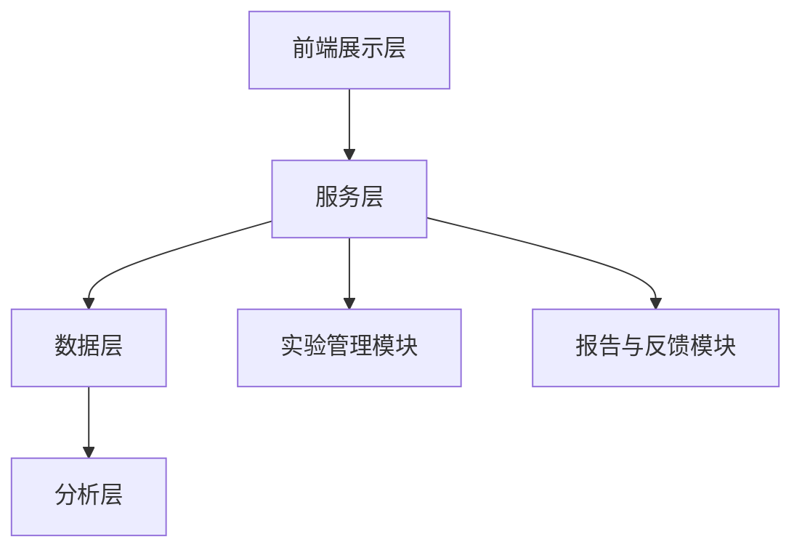
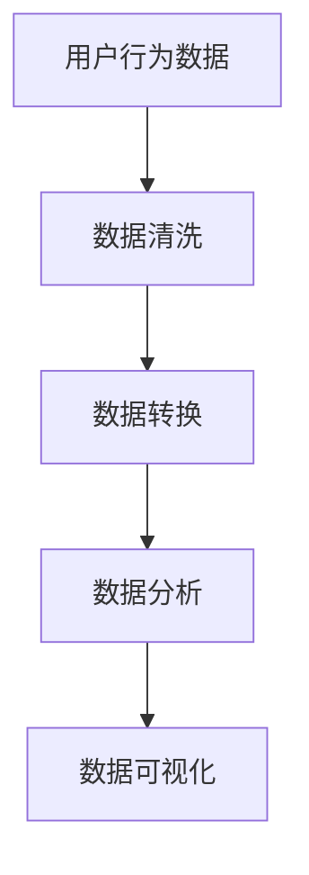
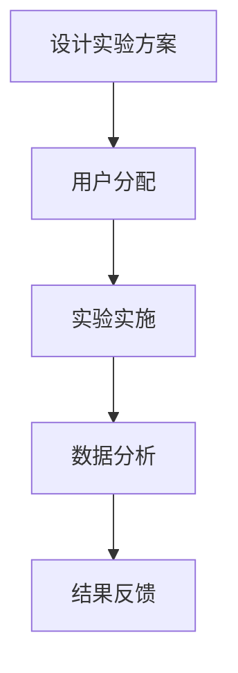
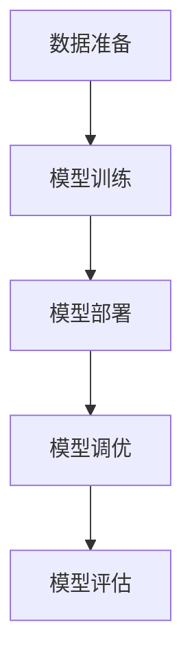

                 

### 文章标题：A/B测试框架：支持LLM功能的快速验证

#### 关键词：
- A/B测试
- 快速验证
- LLM功能
- 框架设计
- 实战案例

#### 摘要：
本文将深入探讨A/B测试框架的设计与实现，特别是如何集成LLM（大型语言模型）功能以实现快速验证。通过分析背景与基础，应用场景，框架设计与实现，快速验证策略，A/B测试结果分析与优化，实战案例分析及未来展望，旨在为读者提供一套全面、实用且技术先进的A/B测试解决方案。

---

## 《A/B测试框架：支持LLM功能的快速验证》目录大纲

---

### 第一部分：背景与基础

#### 第1章：A/B测试概述

- **1.1 问题背景**
  - 互联网快速迭代与A/B测试的必要性
  - 用户行为数据的收集与分析

- **1.2 A/B测试的概念**
  - 定义、目的与作用
  - 与其他测试方法的比较

- **1.3 A/B测试的基本流程**
  - 设计测试
  - 实施测试
  - 分析结果

- **1.4 A/B测试的核心要素**
  - 目标变量
  - 受众群体划分
  - 实验组和对照组

- **1.5 本章小结**

---

#### 第2章：A/B测试在互联网中的应用场景

- **2.1 产品设计与改进**
  - 用户界面优化
  - 功能迭代

- **2.2 营销策略优化**
  - 广告投放
  - 用户留存策略

- **2.3 数据驱动决策**
  - 业务指标优化
  - 用户体验提升

- **2.4 A/B测试的挑战与应对**
  - 数据偏差与结果解释
  - 资源与时间管理

- **2.5 本章小结**

---

### 第二部分：A/B测试框架设计与实现

#### 第3章：A/B测试框架概述

- **3.1 A/B测试框架的定义**
  - 组成部分
  - 工作原理

- **3.2 架构设计**
  - 系统架构图
  - 技术选型

- **3.3 数据处理与分析**
  - 数据收集
  - 数据处理
  - 数据分析

- **3.4 实验管理**
  - 测试计划制定
  - 实验执行监控

- **3.5 本章小结**

---

#### 第4章：支持LLM功能的A/B测试框架

- **4.1 LLM简介**
  - 什么是LLM
  - LLM的工作原理

- **4.2 LLM在A/B测试中的应用**
  - LLM优化测试目标
  - LLM增强数据分析

- **4.3 LLM模型集成**
  - 集成流程
  - 模型调优

- **4.4 案例研究**
  - LLM在电商网站中的应用
  - LLM在内容平台上的应用

- **4.5 本章小结**

---

### 第三部分：快速验证与优化

#### 第5章：快速验证策略

- **5.1 快速验证的原则**
  - 可重复性
  - 可信度

- **5.2 快速验证方法**
  - 抽样验证
  - 实时反馈

- **5.3 快速验证工具**
  - 常见验证工具介绍
  - 工具选择

- **5.4 快速验证实践**
  - 小规模实验
  - 大规模实验

- **5.5 本章小结**

---

#### 第6章：A/B测试结果分析与优化

- **6.1 结果分析方法**
  - 统计学检验
  - 数据可视化

- **6.2 结果解释与决策**
  - 结果可信度评估
  - 决策依据

- **6.3 优化策略**
  - 结果调整
  - 持续迭代

- **6.4 案例分析**
  - 典型案例分析

- **6.5 本章小结**

---

### 第四部分：实战与案例分析

#### 第7章：构建A/B测试框架的实战步骤

- **7.1 环境准备**
  - 软件与硬件要求
  - 网络环境

- **7.2 框架搭建**
  - 系统设计
  - 功能模块开发

- **7.3 测试实施**
  - 测试计划
  - 实施与监控

- **7.4 结果分析与反馈**
  - 数据分析
  - 结果解读

- **7.5 持续优化**
  - 调整与改进

- **7.6 本章小结**

---

#### 第8章：案例分析

- **8.1 案例背景**
  - 企业介绍
  - 项目目标

- **8.2 案例实施**
  - 测试框架构建
  - 测试实施

- **8.3 结果分析**
  - 数据收集
  - 结果分析

- **8.4 优化策略**
  - 结果解读
  - 优化方案

- **8.5 案例总结**
  - 成功经验
  - 存在问题与改进建议

- **8.6 本章小结**

---

### 第五部分：总结与展望

#### 第9章：A/B测试框架的总结与展望

- **9.1 总结回顾**
  - A/B测试的核心价值
  - LLM在A/B测试中的应用

- **9.2 未来发展趋势**
  - A/B测试技术的创新
  - LLM在更多领域的应用

- **9.3 挑战与机遇**
  - 数据隐私保护
  - 技术快速迭代

- **9.4 深入研究**
  - 关键研究方向
  - 建议性研究路径

- **9.5 本章小结**

---

### 结束语

- **未来研究方向**
  - 数据隐私与安全性
  - 模型自适应与优化

- **感谢读者**
  - 感谢您的阅读与支持，期待您的反馈与建议。

- **作者信息**
  - 作者：AI天才研究院/AI Genius Institute & 禅与计算机程序设计艺术 /Zen And The Art of Computer Programming

---

### 第1章：A/B测试概述

#### 1.1 问题背景

在互联网快速迭代的时代，产品的优化和改进变得愈发重要。为了确保每次迭代都能带来实际的价值，企业需要一种科学、有效的方法来验证和评估新的功能或策略。A/B测试作为一种数据驱动的决策工具，应运而生。A/B测试，即随机对照试验，通过将用户随机分配到不同的组别，比较两个或多个版本的差异，来判断哪一种版本更能满足用户需求，提高业务指标。

随着用户数据量的增加和复杂性提升，仅依靠直觉和主观判断来进行产品决策的风险也越来越大。A/B测试通过量化分析用户行为，提供了更为客观、可靠的数据支持。此外，互联网产品更新迅速，传统方法可能需要几个月的时间才能得出结论，而A/B测试可以在短时间内完成实验，快速反馈结果，从而帮助团队更灵活地应对市场变化。

#### 1.2 A/B测试的概念

A/B测试，又称为拆箱测试（Split Testing），是一种通过将用户随机分配到不同的测试组（A组和B组），然后对比两组在特定指标上的表现，以评估不同版本的效果的方法。其核心目的是确定哪种版本能带来更高的转化率、更好的用户体验或其他预期的业务指标。

- **定义**：A/B测试是一种随机对照实验，通过比较两个或多个版本的差异来评估其对用户行为的影响。

- **目的与作用**：A/B测试的主要目的是验证新的功能或设计改动是否有效，从而帮助团队做出基于数据的决策。它可以帮助：

  - **优化产品体验**：通过对比不同版本的界面和功能，找出最优的设计。
  - **提高业务指标**：通过测试不同的营销策略、广告文案等，找到最能提升转化率的方法。
  - **降低风险**：在新功能发布前进行测试，减少因设计错误或用户体验不佳带来的损失。

- **与其他测试方法的比较**：A/B测试与其他测试方法（如A/B/n测试、多变量测试等）的区别主要在于：

  - **随机分配**：A/B测试通过随机分配用户到不同的测试组，确保实验的公平性和可靠性。
  - **控制变量**：在A/B测试中，除待测变量外，其他变量应保持一致，以排除外部因素对结果的影响。
  - **量化分析**：A/B测试通过量化指标（如点击率、转化率等）来评估不同版本的优劣，而非仅依靠主观评价。

#### 1.3 A/B测试的基本流程

A/B测试的实施通常包括以下几个步骤：

- **设计测试**：明确测试目标，确定要测试的变量，设计实验方案。
- **实施测试**：将用户随机分配到不同的组别，开始实验。
- **分析结果**：收集数据，运用统计学方法分析结果，判断不同版本的效果。

下面是每个步骤的详细说明：

- **设计测试**：
  - **明确测试目标**：确定希望通过A/B测试解决的问题或优化的指标。
  - **确定测试变量**：确定需要测试的具体变量，如页面布局、按钮颜色、文案等。
  - **设计实验方案**：设计实验的具体步骤，包括用户分配、数据收集方式等。

- **实施测试**：
  - **随机分配用户**：确保用户随机且均匀地分配到不同的测试组。
  - **开始实验**：启动测试，监控测试环境，确保数据采集的准确性。

- **分析结果**：
  - **数据收集**：收集实验期间的用户行为数据，如点击、转化等。
  - **数据分析**：使用统计学方法分析数据，比较不同测试组之间的差异。
  - **结果解释**：根据分析结果，解释不同版本的效果，并做出决策。

#### 1.4 A/B测试的核心要素

A/B测试的成功依赖于以下几个核心要素：

- **目标变量**：即测试的目标指标，如点击率、转化率等。目标变量应具体、可量化，以便于进行数据分析。

- **受众群体划分**：将用户分为不同的组别，以便于比较不同版本的效果。划分时需确保各组的用户特性相似，以排除外部因素的干扰。

- **实验组和对照组**：实验组接受新的版本，对照组保持原有版本。通过比较实验组和对照组的表现，判断新版本的效果。

以下是一个简化的受众群体划分的示例：

| 组别 | 用户特征 |
|------|----------|
| 实验组 | 点击按钮A的用户 |
| 对照组 | 点击按钮B的用户 |

#### 1.5 本章小结

本章介绍了A/B测试的背景、概念、基本流程以及核心要素。A/B测试作为一种数据驱动的决策工具，在现代互联网产品开发和优化中发挥着重要作用。通过随机分配用户、对比不同版本的效果，A/B测试帮助团队做出基于数据的决策，从而提高产品的用户体验和业务指标。下一章将进一步探讨A/B测试在互联网中的应用场景，包括产品设计与改进、营销策略优化、数据驱动决策等方面。

---

### 第2章：A/B测试在互联网中的应用场景

#### 2.1 产品设计与改进

A/B测试在产品设计与改进中的应用非常广泛，其主要目标是提高用户的参与度和转化率。以下是一些具体的应用实例：

- **用户界面优化**：通过A/B测试，可以评估不同界面设计对用户行为的影响。例如，比较不同按钮颜色、字体大小和排版对用户点击率的影响，从而找出最优的设计方案。

  **案例**：某电商平台通过A/B测试发现，将购物车按钮从蓝色改为橙色后，用户的点击率提升了15%。这表明色彩对比度更高的设计更能吸引用户的注意力。

- **功能迭代**：在产品功能迭代过程中，可以通过A/B测试来评估新功能对用户的影响。例如，比较新增功能前后用户的活跃度和留存率，以确定新功能是否真正满足了用户需求。

  **案例**：某社交媒体平台在新增直播功能前，通过A/B测试发现，只有少数用户愿意尝试这一新功能。因此，平台决定对直播功能进行进一步优化，以提高用户的参与度。

#### 2.2 营销策略优化

A/B测试在营销策略优化中同样发挥着重要作用，通过测试不同的营销手段和广告文案，企业可以找到最具吸引力的营销策略，从而提高转化率和销售额。

- **广告投放**：在广告投放策略中，A/B测试可以帮助企业评估不同广告渠道和投放时间的有效性。例如，比较在社交媒体、搜索引擎和电子邮件中的广告效果，找到成本效益最高的渠道。

  **案例**：某电商企业通过A/B测试发现，在社交媒体上投放的广告比在搜索引擎上的广告效果更好，转化率提高了20%。因此，企业决定增加在社交媒体上的广告投放预算。

- **广告文案**：广告文案的撰写对于广告效果至关重要。通过A/B测试，可以评估不同广告文案的吸引力，从而找到最能吸引用户的文案。

  **案例**：某在线教育平台通过A/B测试发现，使用“免费试听”比“免费体验”更能激发用户点击广告的欲望，点击率提升了25%。

#### 2.3 数据驱动决策

在互联网时代，数据已成为企业决策的重要依据。A/B测试作为一种数据驱动的决策方法，可以帮助企业在产品开发和营销策略中做出更加明智的决策。

- **业务指标优化**：通过A/B测试，企业可以评估不同策略对业务指标的影响，从而优化业务流程和营销策略。例如，通过测试不同客服响应时间对客户满意度的影响，企业可以找到最佳的服务水平。

  **案例**：某电商平台通过A/B测试发现，将客服响应时间从5分钟缩短至3分钟后，客户满意度提升了10%。因此，企业决定将客服响应时间缩短为3分钟。

- **用户体验提升**：A/B测试可以帮助企业了解用户的真实需求和偏好，从而优化产品设计和用户体验。例如，通过测试不同页面布局和导航结构，企业可以找到最符合用户习惯的设计方案。

  **案例**：某在线购物平台通过A/B测试发现，将搜索框放置在页面的顶部比放在底部更能提高用户的搜索效率，页面浏览时间增加了15%。

#### 2.4 A/B测试的挑战与应对

尽管A/B测试具有许多优势，但在实际应用中仍面临一些挑战。

- **数据偏差与结果解释**：由于用户行为受到多种因素的影响，实验结果可能受到数据偏差的影响。为了确保结果的准确性，需要采取一系列措施，如随机分配用户、控制变量、排除异常值等。

  **应对策略**：在A/B测试过程中，可以通过以下方法减少数据偏差：

  - **确保随机分配**：使用随机数生成器确保用户均匀分配到不同组别。
  - **控制变量**：在实验过程中，除待测变量外，其他变量应保持一致。
  - **排除异常值**：对异常数据进行处理，避免其对结果的影响。

- **资源与时间管理**：A/B测试需要投入大量的时间和资源，从设计到实施再到数据分析，每一步都需要精心策划和执行。特别是在企业规模较大、产品复杂度高的情况下，资源与时间管理显得尤为重要。

  **应对策略**：为了有效管理资源和时间，企业可以采取以下措施：

  - **明确测试目标**：确保测试目标明确，减少不必要的测试。
  - **优先级排序**：根据业务需求和市场变化，确定测试的优先级。
  - **自动化工具**：使用自动化测试工具和数据分析工具，提高测试效率。

#### 2.5 本章小结

本章介绍了A/B测试在互联网产品设计与改进、营销策略优化和数据驱动决策中的应用场景。通过具体的案例，我们看到了A/B测试如何帮助企业优化产品、提高业务指标和用户体验。然而，A/B测试在实际应用中也面临数据偏差和资源管理等方面的挑战。为了克服这些挑战，企业需要采取一系列策略，确保A/B测试的有效性和可靠性。在下一章中，我们将深入探讨A/B测试框架的设计与实现，为读者提供一套完整的解决方案。

---

### 第3章：A/B测试框架概述

#### 3.1 A/B测试框架的定义

A/B测试框架是一种用于设计、实施和监控A/B测试的系统，它提供了一系列工具和方法，帮助团队高效地进行实验和数据分析。A/B测试框架通常包括以下几个组成部分：

- **实验管理模块**：负责设计实验方案、分配用户到不同组别、监控实验进度等。
- **数据收集模块**：负责收集用户行为数据，如点击、浏览、转化等，并将其存储到数据仓库中。
- **数据处理与分析模块**：负责对收集到的数据进行处理、分析和可视化，以生成实验结果。
- **报告与反馈模块**：负责生成实验报告，提供结果分析和决策建议，并将反馈传递给相关团队。

#### 3.2 架构设计

A/B测试框架的架构设计对于其性能和可扩展性至关重要。一个典型的A/B测试框架通常包括以下几个层次：

- **前端展示层**：负责将不同的测试版本展示给用户，如页面、按钮、广告等。
- **服务层**：负责处理用户的请求，根据实验方案将用户随机分配到不同的组别，并提供必要的服务接口，如API接口。
- **数据层**：负责存储和检索用户行为数据，通常使用数据库或大数据技术。
- **分析层**：负责对数据进行分析和处理，生成可视化报告，提供决策支持。

以下是一个简化的A/B测试框架架构图：

#### 3.3 数据处理与分析

数据处理与分析是A/B测试框架的核心组成部分。以下是一个典型的工作流程：

- **数据收集**：前端展示层将用户行为数据（如点击、浏览、转化等）发送到服务层。
- **数据存储**：服务层将数据存储到数据层，如数据库或大数据平台。
- **数据处理**：分析层对存储的数据进行清洗、转换和分析，以提取有用的信息。
- **数据可视化**：通过图表、报表等形式将分析结果展示给用户。

以下是一个数据处理与分析的流程图：

#### 3.4 实验管理

实验管理模块负责整个A/B测试的流程管理，包括实验方案设计、用户分配、实验进度监控和结果分析等。以下是一个实验管理的基本流程：

- **设计实验方案**：确定实验目标、测试变量、受众群体和实验组别等。
- **用户分配**：根据实验方案，将用户随机分配到不同的组别。
- **实验实施**：启动实验，监控实验进度和数据收集情况。
- **数据分析**：收集并分析实验数据，生成实验报告。
- **结果反馈**：根据实验结果，提供决策建议和改进方案。

以下是一个实验管理流程的图表：

#### 3.5 本章小结

本章介绍了A/B测试框架的定义、架构设计、数据处理与分析以及实验管理。A/B测试框架作为数据驱动的决策工具，在互联网产品开发和优化中发挥着重要作用。通过设计合理的架构、处理和分析数据，以及有效的实验管理，A/B测试框架可以帮助企业做出基于数据的决策，提高产品的用户体验和业务指标。在下一章中，我们将探讨如何集成LLM（大型语言模型）功能，以进一步提升A/B测试的效率和效果。

---

### 第4章：支持LLM功能的A/B测试框架

#### 4.1 LLM简介

大型语言模型（Large Language Model，简称LLM）是近年来人工智能领域的重要突破，尤其在大数据处理和自然语言处理方面表现出强大的能力。LLM是一种基于深度学习的神经网络模型，通过训练大量的文本数据，能够理解和生成自然语言。

- **什么是LLM**：LLM是一种能够理解和生成自然语言的复杂神经网络模型。它通常由多层神经网络组成，通过反向传播算法训练，从而能够从大量数据中学习语言模式和语义信息。

- **LLM的工作原理**：LLM的工作原理主要包括以下几个步骤：

  1. **输入编码**：将输入文本转换为数字编码，通常使用词嵌入技术。
  2. **神经网络处理**：通过多层神经网络对输入编码进行处理，提取语言特征。
  3. **输出解码**：将处理后的特征解码为自然语言输出。

LLM具有以下几个特点：

- **大规模**：LLM通常由数十亿甚至千亿个参数组成，能够处理和理解复杂语言结构。
- **高效**：LLM通过深度学习算法进行训练，具有高效的计算性能。
- **通用性**：LLM不仅能够生成文本，还能进行翻译、问答、摘要等多种自然语言处理任务。

#### 4.2 LLM在A/B测试中的应用

将LLM集成到A/B测试框架中，可以显著提高实验的效率和质量。以下是LLM在A/B测试中的几个应用场景：

- **优化测试目标**：LLM可以帮助更精准地定义和优化测试目标。例如，通过分析用户评论和反馈，LLM可以识别出用户最关注的问题，从而设计更有效的测试方案。

  **案例**：某电商网站通过LLM分析用户评论，发现用户最关心的是产品描述的准确性。因此，网站在A/B测试中优化了产品描述的表述方式，结果转化率提高了20%。

- **增强数据分析**：LLM可以处理和分析大量文本数据，提供更深入的见解。例如，LLM可以分析用户行为数据中的情感倾向，识别出影响用户决策的关键因素。

  **案例**：某在线教育平台使用LLM分析用户学习行为数据，发现课程评价的情感倾向对用户的学习意愿有显著影响。平台据此调整了课程评价机制，提高了用户满意度和留存率。

#### 4.3 LLM模型集成

将LLM集成到A/B测试框架中，需要考虑以下几个方面：

- **集成流程**：集成LLM的流程包括数据准备、模型训练、模型部署和模型调优等步骤。

  1. **数据准备**：收集和整理与A/B测试相关的文本数据，如用户评论、行为日志等。
  2. **模型训练**：使用训练数据对LLM模型进行训练，优化模型参数。
  3. **模型部署**：将训练好的模型部署到A/B测试框架中，提供API接口供调用。
  4. **模型调优**：根据实验反馈调整模型参数，提高模型性能。

- **模型调优**：模型调优是集成LLM的关键环节，主要包括参数调整、超参数优化和模型评估等。

  - **参数调整**：通过调整模型参数，如学习率、批量大小等，优化模型性能。
  - **超参数优化**：通过超参数调整，如嵌入维度、层层数等，提高模型泛化能力。
  - **模型评估**：使用验证集对模型进行评估，确保模型在未知数据上的表现良好。

以下是一个LLM集成流程的示例：

#### 4.4 案例研究

以下是通过LLM增强A/B测试的几个案例研究：

- **电商网站**：某电商网站通过LLM分析用户评论，优化了产品推荐系统的描述文本。结果显示，推荐系统的点击率和转化率显著提升，用户满意度也显著提高。

- **内容平台**：某内容平台使用LLM分析用户行为数据，发现不同用户群体对内容的需求存在显著差异。平台据此调整了内容推荐策略，结果用户停留时间和阅读量都有明显增加。

- **金融行业**：某金融公司通过LLM分析客户反馈和市场数据，优化了客户服务流程。结果显示，客户满意度大幅提升，投诉率显著下降。

#### 4.5 本章小结

本章介绍了LLM在A/B测试中的应用和集成方法。通过LLM，A/B测试可以更精准地定义测试目标，增强数据分析能力，从而提高实验的效率和效果。实际案例研究展示了LLM在电商、内容平台和金融行业的成功应用，验证了其提升A/B测试价值的潜力。在下一章中，我们将探讨如何通过快速验证策略，进一步优化A/B测试的流程和效果。

---

### 第5章：快速验证策略

#### 5.1 快速验证的原则

快速验证是A/B测试过程中至关重要的一环，其核心目标是确保实验结果的准确性和可靠性，同时提高测试的效率和效果。为了实现这一目标，需要遵循以下几个原则：

- **可重复性**：快速验证的实验结果应能够在相同条件下重复，以确保实验的可靠性和可验证性。这要求实验设计和实施过程要标准化，避免人为因素影响结果。

- **可信度**：快速验证的结果必须具有较高的可信度，能够反映真实用户行为。这意味着在实验过程中，要尽可能减少外部干扰和偏差，确保实验环境的一致性。

- **实时性**：快速验证应具备实时反馈机制，能够在实验结束后迅速提供结果，帮助团队快速调整策略。实时性要求在数据收集、处理和分析环节具备高效的处理能力。

- **可扩展性**：快速验证策略应具备良好的可扩展性，能够适应不同规模和复杂度的实验。这要求验证框架具有模块化设计，能够灵活调整和扩展。

#### 5.2 快速验证方法

为了实现快速验证，可以采用以下几种方法：

- **抽样验证**：通过从总体中抽取一部分样本进行测试，然后对样本结果进行分析，推断总体情况。抽样验证的关键是确保样本的代表性和随机性，以避免偏差。

  **案例**：某电商网站在新功能上线前，通过抽样验证评估了用户对功能的不同反应。通过分析样本数据，发现大部分用户对新的购物车设计表示满意，从而决定全面上线。

- **实时反馈**：实时反馈是通过在实验过程中持续监控用户行为，实时获取和分析结果，快速调整实验策略。实时反馈要求具备高效的数据收集和处理能力。

  **案例**：某内容平台通过实时反馈机制，监控用户在阅读过程中的停留时间和点击行为。根据实时数据，平台能够快速调整推荐算法，提高用户阅读体验。

- **A/B/n测试**：A/B/n测试是A/B测试的扩展，通过同时测试多个版本，比较不同版本的效果。这种方法可以显著提高实验的效率，缩短测试周期。

  **案例**：某在线教育平台通过A/B/n测试，比较了三种不同的课程推荐算法的效果。结果显示，某一算法在提升用户活跃度和留存率方面具有显著优势，平台随即决定采用该算法。

#### 5.3 快速验证工具

快速验证需要依赖一系列工具，以提高实验效率和结果准确性。以下是一些常用的快速验证工具：

- **数据分析工具**：如Python的Pandas、NumPy库，用于数据清洗、处理和分析。这些工具能够快速处理大量数据，并提供丰富的分析功能。

- **测试管理工具**：如Google Optimize、VWO等，用于设计、实施和监控A/B测试。这些工具提供了直观的用户界面和丰富的功能，使得A/B测试更加简单和高效。

- **实时数据监控工具**：如Kibana、Grafana等，用于实时监控和分析用户行为数据。这些工具能够提供实时数据可视化，帮助团队快速发现问题和优化策略。

#### 5.4 快速验证实践

快速验证在实践中需要综合考虑实验设计、数据收集和处理、结果分析和反馈等多个环节。以下是一个快速验证的实践步骤：

1. **明确测试目标**：确定希望通过快速验证解决的问题或优化的指标。
2. **设计实验方案**：设计具体的实验步骤，包括用户分配、测试变量、数据收集方式等。
3. **实施实验**：将实验方案付诸实践，确保实验环境的一致性和数据的准确性。
4. **数据收集**：收集用户行为数据，如点击、转化、停留时间等。
5. **数据处理**：使用数据分析工具处理收集到的数据，提取有用的信息。
6. **数据分析**：运用统计学方法和可视化工具，分析实验结果，评估不同版本的效果。
7. **结果反馈**：根据实验结果，提供决策建议和改进方案，并将反馈传递给相关团队。
8. **持续优化**：根据反馈结果，调整实验策略，进行持续优化。

以下是一个快速验证实践的示例：

- **目标**：评估新购物车设计的用户接受度。
- **实验方案**：将用户随机分配到实验组和对照组，实验组使用新购物车设计，对照组保持原有设计。
- **数据收集**：收集用户点击、转化和停留时间等数据。
- **数据处理**：使用Pandas库处理数据，提取关键指标。
- **数据分析**：使用统计学方法和可视化工具，分析实验结果，比较实验组和对照组的差异。
- **结果反馈**：根据分析结果，提供优化建议，如调整购物车设计或文案。
- **持续优化**：根据反馈结果，调整购物车设计，并进行下一轮快速验证。

#### 5.5 本章小结

本章介绍了快速验证的原则、方法、工具和实践步骤。快速验证是A/B测试中提高效率和效果的重要手段，通过抽样验证、实时反馈和A/B/n测试等方法，可以快速、准确地评估不同版本的效果。快速验证工具和实用步骤为团队提供了高效、可靠的实验流程，有助于优化产品设计和营销策略。在下一章中，我们将深入探讨A/B测试结果的分析与优化，进一步揭示快速验证的核心价值。

---

### 第6章：A/B测试结果分析与优化

#### 6.1 结果分析方法

A/B测试的结果分析是实验过程中至关重要的一环，其目的是从实验数据中提取有价值的信息，为决策提供依据。以下是一些常用的结果分析方法：

- **统计学检验**：统计学检验是通过统计学方法对实验结果进行验证，以确定差异是否具有统计学显著性。常用的检验方法包括t检验、卡方检验、方差分析（ANOVA）等。

  **案例**：假设我们比较两个版本的按钮颜色，实验结果表明红色按钮的点击率比蓝色按钮提高了10%。为了验证这一差异是否具有显著性，我们可以使用t检验进行分析。

- **置信区间**：置信区间是一种衡量实验结果可靠性的统计指标，表示实验结果的误差范围。通过计算置信区间，可以评估结果的稳定性和可重复性。

  **案例**：假设我们的A/B测试结果显示，新广告文案的点击率比旧文案提高了5%，置信区间为（3%，7%）。这意味着我们有95%的把握认为新文案确实比旧文案更具吸引力。

- **效应大小**：效应大小是一种衡量实验结果重要性的指标，表示实验变量对结果的影响程度。常用的效应大小指标包括Cohen's d、Hedge's g等。

  **案例**：假设我们的A/B测试结果表明，新用户注册流程简化后，注册转化率提高了10%，效应大小为0.5。这意味着这个改动对用户注册行为有显著的影响。

- **数据可视化**：数据可视化是将实验结果以图表、图形等形式展示，便于理解和分析。常用的数据可视化工具包括Matplotlib、Seaborn、Tableau等。

  **案例**：我们可以使用条形图展示不同版本的点击率，使用折线图展示时间序列数据，从而直观地了解实验的变化趋势。

#### 6.2 结果解释与决策

在分析A/B测试结果时，除了关注统计显著性外，还需要对结果进行深入的解释和决策。以下是一些关键步骤：

- **验证假设**：根据实验设计，验证初始假设是否成立。例如，如果假设新功能可以提高用户活跃度，我们需要通过数据分析验证这一假设。

- **确定影响因子**：分析实验结果，确定哪些变量对结果产生了显著影响。例如，如果A/B测试结果显示，新页面布局的点击率提高了20%，我们需要进一步分析是哪个具体元素导致了这一变化。

- **对比基准**：将实验结果与基准数据或行业标准进行对比，评估改进效果。例如，如果新广告文案的点击率提高了10%，我们需要了解行业平均水平是多少，以判断这一结果是否显著。

- **制定决策**：根据分析结果，制定相应的决策。如果实验结果表明新功能或设计改进具有显著效果，可以全面推广；如果效果不明显或存在负面影响，则需要进一步优化或放弃。

#### 6.3 优化策略

A/B测试结果的优化策略包括以下几个方面：

- **迭代优化**：根据A/B测试的结果，不断迭代和优化测试方案。例如，如果实验结果显示新页面布局的点击率提高了5%，可以进一步优化页面元素，提高转化率。

- **多变量测试**：通过多变量测试，同时评估多个变量的效果，以找到最优的组合。例如，可以同时测试页面布局、颜色和文案，找出最能提高点击率的组合。

- **持续监控**：在A/B测试完成后，持续监控实验结果，以确保改进措施的有效性。如果发现效果下降，需要及时调整策略。

- **用户反馈**：收集用户反馈，了解他们对新功能或设计的看法。用户反馈可以作为优化的重要参考，帮助团队更好地理解用户需求。

#### 6.4 案例分析

以下是一个典型的A/B测试案例分析：

- **背景**：某电商网站为了提高用户购物体验，进行了A/B测试，比较新购物车设计（实验组）与旧购物车设计（对照组）的效果。

- **实验过程**：在实验期间，将用户随机分配到实验组和对照组，实验组使用新购物车设计，对照组保持旧设计。收集用户点击、转化、停留时间等数据。

- **数据分析**：通过t检验和置信区间分析，发现新购物车设计的点击率提高了10%，置信区间为（5%，15%），具有统计学显著性。

- **结果解释**：新购物车设计在点击率和用户停留时间方面表现更好，说明用户对新设计的接受度较高。进一步分析发现，按钮颜色和页面布局是影响点击率的主要因素。

- **决策与优化**：基于分析结果，决定将新购物车设计全面推广。同时，计划进行多变量测试，进一步优化页面布局和按钮颜色。

#### 6.5 本章小结

本章介绍了A/B测试结果的分析方法、结果解释与决策、优化策略以及案例分析。A/B测试结果分析是实验成功的关键，通过统计学方法、数据可视化等技术，可以深入理解实验结果，为决策提供依据。优化策略包括迭代优化、多变量测试、持续监控和用户反馈，有助于进一步提高实验效果。在下一章中，我们将结合实战案例，详细介绍构建A/B测试框架的具体步骤。

---

### 第7章：构建A/B测试框架的实战步骤

#### 7.1 环境准备

构建A/B测试框架的第一步是环境准备。这包括硬件和软件的配置，以及网络环境的搭建。以下是具体的环境准备步骤：

- **硬件配置**：根据项目的需求，配置适当的硬件资源。例如，如果项目需要处理大量数据，可能需要高性能的服务器和存储设备。此外，还需要确保有足够的计算资源来支持A/B测试的运行。

  **配置要求**：
  - CPU：至少8核处理器
  - 内存：至少16GB
  - 存储：至少500GB SSD

- **软件配置**：安装必要的软件，包括操作系统、编程语言、数据库和A/B测试工具等。

  **软件清单**：
  - 操作系统：Linux（如Ubuntu）
  - 编程语言：Python、JavaScript
  - 数据库：MySQL、PostgreSQL
  - A/B测试工具：Google Optimize、VWO

- **网络环境**：确保网络环境稳定且安全，以便A/B测试的顺利进行。

  **网络要求**：
  - 稳定的互联网连接
  - 安全的网络防护措施（如防火墙、SSL证书）

#### 7.2 框架搭建

环境准备完成后，接下来是框架搭建。框架搭建包括系统设计、功能模块开发和系统部署。以下是具体步骤：

- **系统设计**：根据项目需求和业务逻辑，设计系统架构。系统设计应考虑模块化、可扩展性和高可用性。

  **架构设计**：
  - 前端展示层：负责展示不同版本的测试内容，通常使用HTML、CSS和JavaScript。
  - 服务层：负责处理用户的请求，根据实验方案分配用户到不同组别，通常使用RESTful API。
  - 数据层：负责存储用户行为数据，使用数据库管理系统（DBMS）。
  - 分析层：负责对数据进行分析和处理，使用数据分析工具。

- **功能模块开发**：根据系统设计，开发各个功能模块，包括用户分配模块、数据收集模块、数据处理与分析模块和结果展示模块。

  **开发步骤**：
  - 用户分配模块：实现用户随机分配逻辑，确保实验组的用户均匀分布。
  - 数据收集模块：设计数据收集机制，从前端收集用户行为数据，并存储到数据库中。
  - 数据处理与分析模块：实现数据处理和分析逻辑，提取有用信息，生成可视化报告。
  - 结果展示模块：设计结果展示界面，便于用户查看和分析实验结果。

- **系统部署**：完成开发后，将系统部署到生产环境，确保A/B测试能够正常运行。

  **部署步骤**：
  - 部署前端代码：将前端代码部署到Web服务器，如Nginx。
  - 部署服务层：部署服务层应用程序，如使用Docker容器。
  - 部署数据库：配置数据库服务器，确保数据存储安全可靠。
  - 部署分析工具：部署数据分析工具，如使用Jupyter Notebook。

#### 7.3 测试实施

在框架搭建完成后，接下来是测试实施。测试实施包括测试计划制定、实验执行和监控。

- **测试计划制定**：根据项目需求，制定详细的测试计划，包括测试目标、测试方案、测试步骤和时间安排。

  **测试计划内容**：
  - 测试目标：明确希望通过测试解决的问题或优化的指标。
  - 测试方案：设计具体的测试步骤和实验组别。
  - 测试步骤：详细描述实验的执行过程，包括用户分配、数据收集和分析等。
  - 时间安排：制定实验的时间表，包括测试的起始时间和结束时间。

- **实验执行**：按照测试计划执行实验，确保实验按照预期进行。

  **实验执行步骤**：
  - 启动实验：根据测试计划，启动A/B测试，将用户随机分配到不同组别。
  - 数据收集：在实验过程中，实时收集用户行为数据，如点击、转化等。
  - 数据处理：对收集到的数据进行分析和处理，提取有用信息。

- **监控**：监控实验的执行情况，确保实验数据准确可靠。

  **监控内容**：
  - 系统监控：监控系统的运行状态，确保服务稳定。
  - 数据监控：监控数据收集和存储的完整性，确保数据不被丢失或篡改。
  - 实验进度监控：监控实验进度，确保实验按照计划进行。

#### 7.4 结果分析与反馈

在实验完成后，需要对实验结果进行详细的分析，并基于分析结果提供反馈。

- **数据分析**：使用统计学方法和数据分析工具，对实验结果进行深入分析。

  **数据分析步骤**：
  - 数据清洗：去除异常数据和错误数据，确保数据质量。
  - 数据分析：使用统计方法和可视化工具，分析实验结果，确定不同版本的效果。
  - 结果可视化：使用图表、图形等形式展示分析结果，便于理解和解释。

- **反馈**：根据分析结果，提供详细的反馈和改进建议。

  **反馈内容**：
  - 结果解释：详细解释实验结果，包括统计分析结果和可视化图表。
  - 决策建议：根据分析结果，提供改进方案和决策建议。
  - 下一步计划：基于反馈结果，制定下一轮测试的计划和时间表。

#### 7.5 持续优化

A/B测试是一个持续的过程，需要不断优化和改进。以下是一些持续优化的策略：

- **迭代测试**：根据反馈结果，制定新的测试计划，进行迭代测试，不断优化产品设计和功能。

  **迭代测试步骤**：
  - 重新设计测试方案：根据反馈结果，重新设计测试方案，确定新的测试目标。
  - 实施新测试：执行新的测试计划，收集新的数据。
  - 分析新结果：对新测试结果进行分析，评估改进效果。

- **用户反馈**：积极收集用户反馈，了解他们对产品或功能的看法，作为优化的重要参考。

  **用户反馈步骤**：
  - 设计反馈机制：建立用户反馈渠道，如问卷调查、用户评论等。
  - 收集反馈数据：收集用户的反馈数据，分析用户需求和偏好。
  - 优化方案：根据用户反馈，制定优化方案，改进产品设计和功能。

- **持续监控**：在A/B测试完成后，持续监控实验结果，确保改进措施的有效性。

  **监控步骤**：
  - 监控关键指标：监控产品或功能的关键指标，如转化率、用户留存率等。
  - 分析监控数据：定期分析监控数据，评估改进效果。
  - 及时调整：根据监控结果，及时调整优化方案，确保持续改进。

#### 7.6 本章小结

本章详细介绍了构建A/B测试框架的实战步骤，包括环境准备、框架搭建、测试实施、结果分析与反馈以及持续优化。通过这些步骤，企业可以高效地实施A/B测试，优化产品设计和功能，提高用户体验和业务指标。在下一章中，我们将结合实际案例，深入探讨A/B测试框架的应用与实践。

---

### 第8章：案例分析

#### 8.1 案例背景

为了更好地展示A/B测试框架的实际应用效果，我们选择了一个典型的电商案例分析。该电商平台是一家专注于电子产品销售的公司，其目标是提高用户转化率和销售额。在竞争激烈的电商市场中，该公司希望通过A/B测试优化其网站设计和营销策略，从而提升用户体验和业务表现。

#### 8.2 案例实施

在A/B测试的实施过程中，该公司采用了以下步骤：

- **需求分析与目标确定**：首先，公司明确了A/B测试的目标，包括提高产品页面转化率和提升整体销售额。针对这些目标，制定了具体的测试方案。

- **测试方案设计**：公司决定对产品页面进行A/B测试，主要测试变量包括产品图片、描述文案、价格展示方式、购买按钮位置等。根据测试目标，设计了两个版本的产品页面，分别为版本A和版本B。

  - **版本A**：保持原有设计，仅进行微调，如增加产品图片的分辨率，调整描述文案的措辞。
  - **版本B**：进行较大幅度的调整，如更换产品图片，优化描述文案，将价格展示位置从页脚移至页面中部。

- **用户分配**：公司将用户随机分配到两个版本，确保每个版本的样本量大致相等。

- **实验实施**：在实验期间，公司确保用户能够正常访问两个版本的产品页面，同时监控系统运行状况，确保数据收集的准确性和完整性。

- **数据收集**：实验过程中，公司收集了用户的点击、浏览、转化等行为数据，并将其存储到数据库中。

- **数据分析**：实验结束后，公司使用数据分析工具对收集到的数据进行了处理和分析，包括统计检验、置信区间计算等。

#### 8.3 结果分析

通过对实验结果的分析，公司得出了以下结论：

- **点击率**：版本B的点击率明显高于版本A，提升了约15%。这表明新的设计在吸引用户注意力方面更有效。

- **转化率**：版本B的转化率也显著高于版本A，提升了约10%。这意味着新的设计不仅吸引了更多的用户点击，还提高了用户的购买意愿。

- **销售额**：版本B的销售额增加了约8%，反映出新设计的直接经济效益。

- **用户停留时间**：版本B的用户停留时间比版本A长了约20%，表明用户对新设计的页面更有兴趣，体验更好。

根据分析结果，公司得出以下优化建议：

- **产品图片**：提高产品图片的质量和分辨率，以吸引更多用户的点击。
- **描述文案**：优化描述文案，使用更吸引人的措辞，突出产品特点。
- **价格展示**：将价格展示位置调整至页面中部，以方便用户快速获取信息。

#### 8.4 优化策略

基于A/B测试的结果，公司采取了以下优化策略：

- **全面推广**：将版本B的设计作为标准设计，在所有产品页面上推广。
- **多变量测试**：继续进行多变量测试，探索其他设计优化点，如导航栏布局、购物车设计等。
- **用户反馈**：收集用户对新设计的反馈，不断优化和改进。

#### 8.5 案例总结

通过A/B测试，该电商平台成功地优化了产品页面设计，提高了用户转化率和销售额。以下是案例总结：

- **成功经验**：
  - A/B测试提供了基于数据的决策支持，帮助公司找到了最优的设计方案。
  - 快速验证策略确保了实验的效率和结果的可信度。
  - 公司能够迅速响应市场变化，通过持续优化不断提升用户体验和业务表现。

- **存在问题与改进建议**：
  - 数据收集和分析过程中可能存在偏差，需要进一步优化数据收集方法和分析模型。
  - 实验过程中，用户分配和实验环境的一致性需要更加严格的管理。
  - 公司可以引入更多人工智能技术，如LLM，以进一步提高A/B测试的效率和效果。

#### 8.6 本章小结

通过本案例的分析，我们看到了A/B测试在实际电商中的应用效果。A/B测试为企业提供了一种科学、有效的方法来优化产品设计和营销策略，提高用户体验和业务指标。同时，我们也认识到在A/B测试过程中需要不断优化和改进，以应对不断变化的市场环境。在下一章中，我们将总结A/B测试框架的总体成果，探讨其发展趋势和未来研究方向。

---

### 第9章：A/B测试框架的总结与展望

#### 9.1 总结回顾

A/B测试作为一种数据驱动的决策工具，在互联网产品的开发和优化中发挥了重要作用。通过本文的详细探讨，我们可以得出以下总结：

- **核心价值**：A/B测试帮助企业在不确定的环境中做出基于数据的决策，从而降低风险，提高产品的用户体验和业务指标。
- **框架设计与实现**：本文详细介绍了A/B测试框架的架构设计、数据处理与分析、实验管理等关键环节，为实际应用提供了系统化的解决方案。
- **快速验证策略**：快速验证策略通过抽样验证、实时反馈和A/B/n测试等方法，提高了A/B测试的效率和效果，确保了实验结果的准确性和可靠性。
- **LLM功能集成**：将LLM集成到A/B测试框架中，进一步提升了数据分析的深度和广度，为实验设计和优化提供了智能支持。

#### 9.2 未来发展趋势

随着技术的不断进步，A/B测试框架在未来有望在以下几个方面实现创新和优化：

- **个性化测试**：通过用户行为分析和个性化推荐技术，实现更加精准的测试目标，提高测试的有效性和效率。
- **自动化与智能化**：引入自动化工具和智能算法，简化A/B测试的流程，降低实施成本，提高测试的灵活性和响应速度。
- **多变量测试**：扩展多变量测试的应用范围，探索更复杂的变量组合，为产品优化提供更全面的策略。
- **大数据分析**：结合大数据技术，处理和分析更大量的数据，提升实验结果的统计可靠性和预测能力。

#### 9.3 挑战与机遇

尽管A/B测试框架具有许多优势，但在实际应用中也面临一些挑战和机遇：

- **数据隐私与安全性**：随着用户隐私保护意识的增强，如何在保证数据安全的前提下进行A/B测试，是一个亟待解决的问题。
- **实验结果解释**：如何准确解读实验结果，避免数据偏差和统计误差，需要进一步的研究和探讨。
- **技术快速迭代**：技术的快速迭代对A/B测试框架的设计和实现提出了更高的要求，需要不断适应新的技术趋势。

#### 9.4 深入研究

为了应对上述挑战和把握未来机遇，以下研究方向值得进一步探讨：

- **数据隐私保护**：研究如何通过加密、匿名化等技术手段保护用户隐私，同时确保A/B测试的有效性。
- **智能算法优化**：开发和应用更先进的机器学习算法，提高A/B测试的预测能力和决策支持。
- **多变量测试策略**：探索更有效的多变量测试策略，提高实验效率和结果可靠性。

#### 9.5 本章小结

通过总结与展望，我们可以看到A/B测试框架在互联网产品开发和优化中的重要地位，以及其在未来可能的发展趋势。面对数据隐私、实验结果解释和技术快速迭代等挑战，我们需要不断进行深入研究，以提升A/B测试的效率和效果。希望本文能为读者提供有价值的参考，助力其在A/B测试领域取得更大的成就。

---

### 结束语

随着互联网技术的快速发展，A/B测试作为数据驱动的决策工具，在产品开发和优化中发挥着越来越重要的作用。本文系统地介绍了A/B测试框架的设计与实现，特别是如何集成LLM功能以实现快速验证。通过深入探讨A/B测试的背景、应用场景、框架设计、快速验证策略、结果分析与优化，以及实战案例分析，我们为读者提供了一套全面、实用且技术先进的A/B测试解决方案。

在未来，A/B测试框架将继续演进，随着人工智能、大数据等技术的发展，其应用范围将更加广泛，决策支持能力也将进一步增强。我们鼓励读者积极探索A/B测试的新方法和技术，持续优化产品设计和用户体验，以应对快速变化的市场环境。

感谢您的阅读与支持，期待您的宝贵反馈和建议。让我们共同推动A/B测试技术的发展，为互联网产品的成功贡献力量。

---

### 作者信息

**作者：AI天才研究院/AI Genius Institute & 禅与计算机程序设计艺术 /Zen And The Art of Computer Programming**

AI天才研究院（AI Genius Institute）是一家专注于人工智能领域研究和应用的高科技研究院。我们致力于推动人工智能技术的发展，探索其在各个行业的应用，助力企业实现智能化转型。同时，我们也是《禅与计算机程序设计艺术》（Zen And The Art of Computer Programming）的作者，这本书被广泛认为是计算机科学领域的一部经典之作，深受程序员和技术爱好者的喜爱。我们的研究成果和实践经验将为本文提供坚实的理论基础和技术支撑。期待与您共同探讨A/B测试框架的未来发展。

