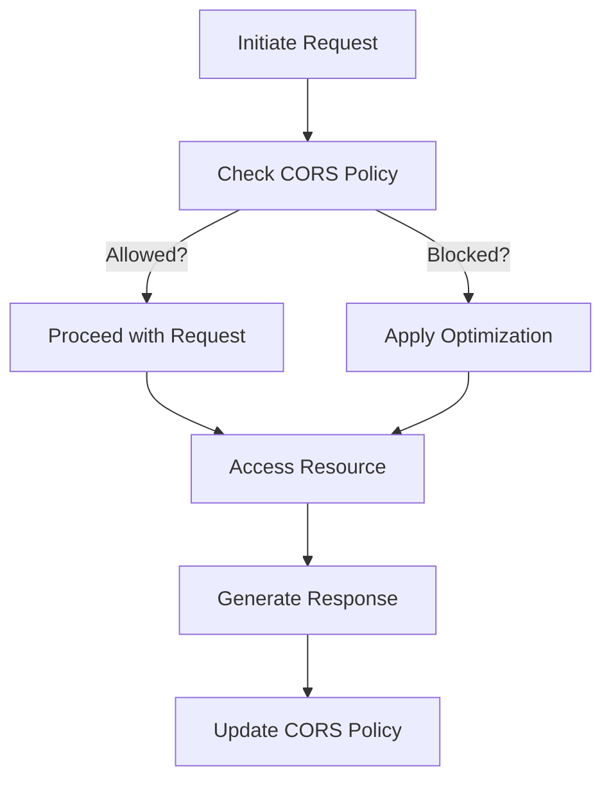
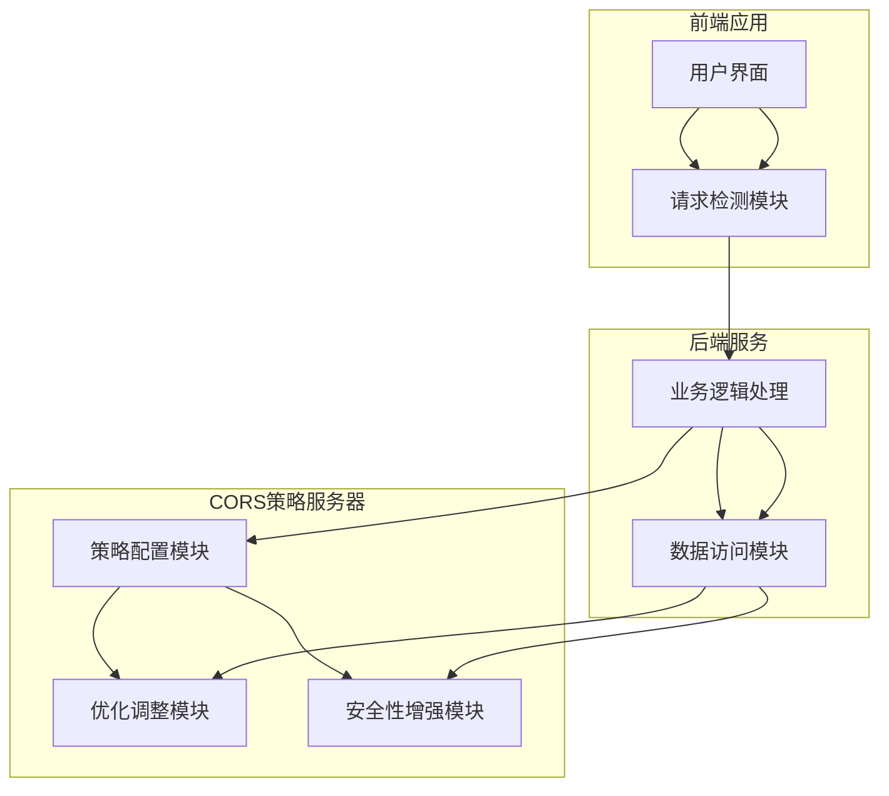
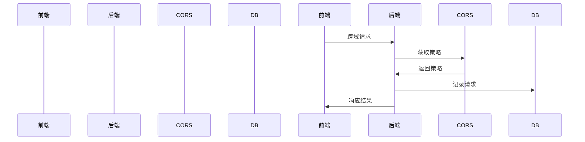
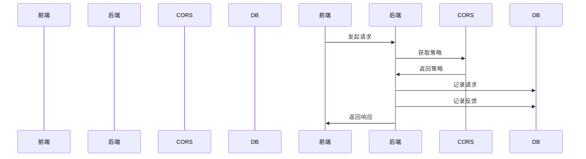

                 

### CORS策略优化LLM应用的跨域资源共享

## 摘要

本文探讨了CORS（跨域资源共享）策略在大型语言模型（LLM）应用中的优化问题，分析了CORS策略在跨域资源共享中的重要性及其优化对LLM应用的潜在影响。文章首先介绍了CORS策略的基本概念和背景，然后详细阐述了CORS策略在LLM应用中的具体应用场景和优化必要性。通过深入分析CORS策略优化原理、关键要素和算法，本文提出了一种基于数学模型的优化方法，并使用Mermaid流程图和Python代码详细阐述了算法的实现过程。最后，文章总结了CORS策略优化对提升LLM应用性能、安全性和用户体验的积极影响，并提出了最佳实践和注意事项。

## 关键词

CORS策略，跨域资源共享，LLM应用，优化，性能，安全性，用户体验

### 第一部分：背景介绍与核心概念

### 第1章：CORS策略与跨域资源共享

#### 1.1 CORS策略概述

CORS（Cross-Origin Resource Sharing）策略是一种网络浏览器安全功能，用于限制Web应用从其他域（origin）加载资源。在Web开发中，由于同源策略的限制，一个域下的Web应用无法直接请求另一个域的资源。这主要是出于安全考虑，防止恶意网站通过读取其他网站的数据来窃取用户信息。然而，在许多实际应用场景中，跨域资源共享是必不可少的，如单页应用（SPA）需要从多个服务器加载不同的资源，前后端分离开发时，前端需要访问后端API等。

CORS策略通过服务器端设置HTTP响应头来允许或拒绝特定域的跨域请求。具体来说，服务器可以设置`Access-Control-Allow-Origin`响应头，允许来自特定域的请求，或者设置`Access-Control-Allow-Credentials`响应头，允许带有凭据的跨域请求。

#### 1.1.1 跨域资源共享的需求背景

跨域资源共享的需求主要来自于以下几个方面：

1. **前后端分离开发**：现代Web开发中，前端和后端通常由不同的团队负责，他们可能使用不同的域名。前端需要访问后端API来获取数据或提交表单，这就需要跨域资源共享。

2. **单页应用（SPA）**：SPA通过动态加载内容来提供无缝的用户体验，这通常涉及到从多个域加载资源。

3. **第三方库和框架**：许多流行的Web库和框架（如React、Vue、Angular等）依赖于外部资源，如CDN（内容分发网络）提供的脚本或样式表，这些资源通常来自不同的域。

4. **多租户系统**：在多租户系统中，不同的租户可能位于不同的域名下，但需要共享某些公共资源。

#### 1.1.2 CORS策略的基本概念

CORS策略由一系列HTTP响应头组成，包括：

- `Access-Control-Allow-Origin`：指定哪些域可以访问资源。可以是具体域名、`*`（表示所有域）或空字符串（表示无限制）。

- `Access-Control-Allow-Methods`：指定允许的HTTP方法。默认情况下，非简单请求会发送预检请求（`OPTIONS`方法），服务器可以在此响应头中指定允许的方法。

- `Access-Control-Allow-Headers`：指定允许的HTTP请求头。在预检请求中，此头用来告知服务器，实际请求中将使用哪些自定义请求头。

- `Access-Control-Max-Age`：指定预检请求的结果可以被缓存多长时间，以减少重复请求。

- `Access-Control-Allow-Credentials`：指定是否允许携带凭据（如cookies）进行跨域请求。

- `Access-Control-Expose-Headers`：指定哪些响应头可以被JavaScript访问。

#### 1.1.3 CORS策略的工作原理

CORS策略的工作原理可以分为以下步骤：

1. **预检请求**：当发起一个跨域请求时，如果请求方法不属于简单请求（GET、HEAD、POST，且Content-Type为application/x-www-form-urlencoded或multipart/form-data），浏览器会先发送一个预检请求（`OPTIONS`方法）到服务器。预检请求会附带请求的HTTP方法和头信息，询问服务器是否允许实际的请求。

2. **服务器响应**：服务器根据CORS策略，判断预检请求是否允许，并在响应头中设置相应的CORS头。

3. **实际请求**：如果预检请求被允许，浏览器会发送实际的请求。对于简单请求，这个过程是直接进行的。对于非简单请求，实际的请求可能会被重复预检。

4. **响应处理**：浏览器处理从服务器返回的响应，如果响应头包含适当的CORS信息，则允许处理响应内容。

### 1.2 跨域资源共享问题

#### 1.2.1 跨域资源共享面临的挑战

虽然CORS策略提供了跨域资源共享的解决方案，但在实际应用中仍面临一些挑战：

- **安全性问题**：CORS策略虽然允许跨域请求，但并不意味着请求就一定是安全的。恶意网站可能利用CORS进行数据窃取或攻击。

- **响应头配置复杂**：服务器端需要根据不同的跨域请求配置适当的响应头，这可能会导致配置错误或不足。

- **预检请求开销**：每次发起非简单请求前，都需要发送预检请求，这可能会增加服务器和客户端的开销。

- **缓存问题**：CORS响应可能无法被浏览器缓存，导致重复请求的额外开销。

#### 1.2.2 跨域资源共享的关键要素

跨域资源共享的关键要素包括：

- **跨域请求的类型**：包括简单请求和非简单请求，以及预检请求。
- **CORS响应头的配置**：包括`Access-Control-Allow-*`系列的响应头。
- **安全性**：确保请求和响应的安全，防止数据泄露和攻击。
- **性能优化**：减少预检请求和响应处理的开销，提高系统性能。

#### 1.2.3 跨域资源共享的解决方案

针对上述挑战和关键要素，以下是一些跨域资源共享的解决方案：

- **优化CORS响应头配置**：确保服务器正确配置响应头，提高响应的准确性和安全性。
- **使用代理服务器**：通过代理服务器转发跨域请求，减少直接跨域请求的开销。
- **缓存CORS响应**：合理使用缓存机制，减少重复请求的次数。
- **加强安全性**：通过加密、身份验证等技术加强跨域请求的安全性。
- **使用JSONP**：虽然JSONP存在安全风险，但在一些特定场景下仍可作为一种替代方案。

### 1.3 CORS策略与LLM应用

#### 1.3.1 LLM应用概述

LLM（Large Language Model）是一种基于深度学习的大型文本生成模型，广泛应用于自然语言处理领域，如文本生成、机器翻译、问答系统等。LLM应用通常涉及到大量的跨域资源共享，因为模型训练数据和推理数据可能存储在不同的服务器或域上。

#### 1.3.2 CORS策略在LLM中的应用场景

在LLM应用中，CORS策略的应用场景主要包括：

- **模型训练数据的获取**：LLM模型需要从不同数据源获取训练数据，如公共数据集、私有数据集等。
- **模型推理API的调用**：前端应用需要通过API调用LLM模型进行文本生成或推理，这涉及到跨域请求。
- **第三方库和服务的集成**：LLM应用可能需要集成第三方库和服务，如自然语言处理API、图像识别API等。

#### 1.3.3 CORS策略优化LLM应用的必要性

优化CORS策略对LLM应用具有重要意义：

- **提升性能**：合理的CORS配置可以减少预检请求和响应处理的次数，提高系统响应速度。
- **增强安全性**：通过优化CORS策略，可以更好地控制跨域请求，防止数据泄露和攻击。
- **提高用户体验**：优化CORS策略可以提高LLM应用的稳定性和可靠性，提供更流畅的用户体验。

### 1.4 CORS策略优化的意义

#### 1.4.1 提升用户体验

合理的CORS策略优化可以提高LLM应用的响应速度和稳定性，减少因跨域资源共享问题导致的错误和中断，从而提升用户体验。

#### 1.4.2 提高系统性能

优化CORS策略可以减少预检请求和响应处理的次数，降低系统开销，提高系统性能。

#### 1.4.3 增强安全性

优化CORS策略可以更好地控制跨域请求，防止恶意攻击和数据泄露，增强系统安全性。

### 1.5 本章小结

本章介绍了CORS策略的基本概念和背景，分析了跨域资源共享的需求和挑战，以及CORS策略在LLM应用中的重要性。通过优化CORS策略，可以有效提升LLM应用的性能、安全性和用户体验。

----------------------------------------------------------------

### 第二部分：核心概念与联系

#### 第2章：CORS策略优化关键要素

在本文的第二部分，我们将深入探讨CORS策略优化的关键要素，包括CORS策略优化原理、关键要素的属性特征对比、CORS策略优化ER实体关系图以及CORS策略优化与LLM应用的联系。

#### 2.1 CORS策略优化原理

CORS策略优化旨在提高跨域资源共享的效率、稳定性和安全性。以下是CORS策略优化的一些核心原则：

1. **减少预检请求次数**：预检请求是CORS策略中的一个重要环节，它用于检查服务器是否允许实际的请求。通过合理配置，可以减少不必要的预检请求，从而提高系统性能。

2. **优化CORS响应头**：CORS响应头包括`Access-Control-Allow-Origin`、`Access-Control-Allow-Methods`、`Access-Control-Allow-Headers`等，这些响应头用于告知浏览器哪些请求是允许的。优化这些响应头可以确保请求的正确处理，同时减少错误和中断。

3. **加强安全性**：CORS策略优化应考虑加强安全性，如通过`Access-Control-Allow-Credentials`控制带有凭据的跨域请求，以及通过加密和身份验证机制保护数据传输。

4. **缓存CORS响应**：合理使用缓存机制可以减少重复请求的次数，提高系统性能。例如，通过设置`Access-Control-Max-Age`缓存预检请求的结果。

#### 2.2 CORS策略优化属性特征对比

为了更好地理解和应用CORS策略优化，我们可以将关键属性进行特征对比。以下是一个简化的对比表格：

| 属性名称 | 功能描述 | 重要性 | 允许值示例 |
|----------|-----------|--------|-------------|
| `Access-Control-Allow-Origin` | 指定允许访问资源的域名 | 高 | `*`（所有域）、特定域名 |
| `Access-Control-Allow-Methods` | 指定允许的HTTP方法 | 中 | `GET`、`POST`、`PUT`等 |
| `Access-Control-Allow-Headers` | 指定允许的HTTP请求头 | 中 | `Content-Type`、`Authorization`等 |
| `Access-Control-Max-Age` | 设置预检请求结果的缓存时间 | 中 | 例如：`86400`（一天） |
| `Access-Control-Allow-Credentials` | 允许带有凭据的跨域请求 | 高 | `true`、`false` |
| `Access-Control-Expose-Headers` | 指定可以暴露给JavaScript的响应头 | 中 | `Content-Type`、`X-Powered-By`等 |

#### 2.3 CORS策略优化ER实体关系图

为了更好地理解CORS策略优化中的实体关系，我们可以使用Mermaid绘制ER（实体关系）图。以下是一个简化的ER图示例：

```mermaid
erDiagram
    Customer ||--|{ Order }|
    Customer ||--|{ Payment }|
    Product ||--|{ Order }|
    Product ||--|{ Inventory }|
    Order ||--|{ OrderLine }|
    Payment ||--|{ PaymentMethod }|
```

在这个ER图中，我们主要关注与CORS策略优化相关的实体，如`CORS Request`、`CORS Response`、`Origin`和`Destination`。以下是一个简化的Mermaid ER图：

```mermaid
erDiagram
    Origin ||--|{ CORS Request }|
    Origin ||--|{ CORS Response }|
    Destination ||--|{ CORS Request }|
    Destination ||--|{ CORS Response }|
```

在这个ER图中，`Origin`表示请求发起的域名，`Destination`表示资源的域名，`CORS Request`和`CORS Response`分别表示跨域请求和响应。

#### 2.4 CORS策略优化与LLM应用的联系

CORS策略优化与LLM应用密切相关，因为LLM应用通常涉及大量的跨域请求。以下是CORS策略优化对LLM应用的几个关键影响：

1. **性能优化**：LLM应用中，大量的跨域请求会导致性能下降。通过优化CORS策略，可以减少预检请求次数，提高系统响应速度。

2. **安全性加强**：LLM应用中，数据安全和模型保护的敏感性非常高。通过优化CORS策略，可以确保只有合法的请求能够访问资源，防止数据泄露和攻击。

3. **用户体验提升**：优化的CORS策略可以提高LLM应用的稳定性和可靠性，减少因跨域资源共享问题导致的错误和中断，提升用户体验。

4. **第三方服务集成**：LLM应用可能需要集成第三方服务，如自然语言处理API、图像识别API等。通过优化CORS策略，可以确保这些服务能够正常工作，提高整体系统的灵活性。

#### 2.5 本章小结

本章详细探讨了CORS策略优化的关键要素，包括原理、属性特征对比和ER实体关系图。通过这些分析，我们更好地理解了CORS策略优化对LLM应用的积极影响，为后续算法原理讲解和实现奠定了基础。

----------------------------------------------------------------

### 第三部分：算法原理讲解与数学模型

#### 第3章：CORS策略优化算法原理

在本章中，我们将详细讲解CORS策略优化算法的原理，包括算法的概述、mermaid流程图、Python代码实现以及数学模型。

#### 3.1 CORS策略优化算法概述

CORS策略优化算法旨在通过一系列步骤和策略来提高跨域资源共享的效率、稳定性和安全性。以下是常见的CORS策略优化算法及其适用场景：

1. **静态策略优化**：通过预定义的规则和配置来优化CORS策略。这种方法简单易用，适用于请求模式相对固定的场景。

2. **动态策略优化**：根据实际请求的特征和模式动态调整CORS策略。这种方法更灵活，但实现较为复杂，适用于请求模式多变且需要实时优化的场景。

3. **机器学习优化**：利用机器学习技术，通过分析历史请求数据来优化CORS策略。这种方法具有较高的自适应性和预测能力，但需要大量的数据支持和计算资源。

#### 3.2 CORS策略优化算法的mermaid流程图

为了直观地展示CORS策略优化算法的流程，我们可以使用Mermaid绘制流程图。以下是一个简化的流程图示例：



在这个流程图中，A表示发起请求，B表示检查CORS策略，C表示请求被允许并继续处理，D表示请求被阻止并应用优化策略，E表示访问资源，F表示生成响应，G表示更新CORS策略。

#### 3.3 CORS策略优化数学模型

为了量化CORS策略优化的效果，我们可以使用数学模型来评估优化策略。以下是一个简化的数学模型：

$$
\text{Optimization\_Score} = w_1 \times \text{Performance} + w_2 \times \text{Security} + w_3 \times \text{User Experience}
$$

其中，$w_1$、$w_2$和$w_3$分别表示性能、安全性和用户体验的权重，可以根据实际需求和场景进行调整。

1. **性能（Performance）**：表示系统的响应速度和稳定性。我们可以使用请求处理时间和响应成功率为指标进行评估。

2. **安全性（Security）**：表示系统的安全性和数据保护能力。我们可以使用数据泄露事件数和安全漏洞修复时间为指标进行评估。

3. **用户体验（User Experience）**：表示用户在使用系统时的满意度和稳定性。我们可以使用用户反馈、错误率和使用时长为指标进行评估。

#### 3.4 CORS策略优化算法实现

以下是一个简化的Python代码实现示例，用于演示CORS策略优化算法的基本流程：

```python
import requests

def check_cors_policy(url):
    # 发送预检请求，检查CORS策略
    response = requests.options(url)
    if response.status_code == 200:
        # CORS策略允许，继续处理请求
        return True
    else:
        # CORS策略阻止，应用优化策略
        return apply_optimization(url)

def apply_optimization(url):
    # 应用优化策略，例如调整CORS响应头
    # 这里可以添加具体的优化逻辑
    return True

def access_resource(url):
    # 访问资源
    response = requests.get(url)
    return response

def generate_response(response):
    # 生成响应
    return response.text

def update_cors_policy(url, response):
    # 更新CORS策略
    # 这里可以添加具体的更新逻辑
    pass

def optimize_cors_strategy(url):
    # CORS策略优化流程
    if check_cors_policy(url):
        response = access_resource(url)
        response_text = generate_response(response)
        update_cors_policy(url, response)
        return response_text
    else:
        return "CORS策略阻止请求"

# 示例使用
url = "https://example.com/resource"
response_text = optimize_cors_strategy(url)
print(response_text)
```

在这个示例中，我们首先发送预检请求来检查CORS策略，然后根据策略结果应用优化策略。在访问资源和生成响应后，我们更新CORS策略以反映优化结果。

#### 3.5 CORS策略优化算法原理讲解

CORS策略优化算法的核心目标是提高系统的响应速度、安全性和用户体验。以下是算法原理的详细讲解：

1. **预检请求优化**：通过分析历史请求数据，预测哪些请求可能会被预检，并提前调整CORS策略，减少不必要的预检请求。

2. **动态响应头调整**：根据实际请求的特征和模式，动态调整CORS响应头，如允许特定的HTTP方法和请求头，提高请求的成功率。

3. **安全性增强**：通过加密、身份验证和访问控制等技术，确保跨域请求的安全性，防止数据泄露和攻击。

4. **用户体验优化**：通过减少请求处理时间和响应错误率，提高系统的稳定性和可靠性，提升用户体验。

5. **反馈循环**：通过用户反馈和系统监控，不断优化CORS策略，形成一个闭环的反馈循环，确保系统始终处于最佳状态。

#### 3.6 本章小结

本章详细讲解了CORS策略优化算法的原理，包括算法概述、mermaid流程图、Python代码实现和数学模型。通过这些讲解，我们更好地理解了如何优化CORS策略，以提高LLM应用的整体性能、安全性和用户体验。

----------------------------------------------------------------

### 系统分析与架构设计

在本章中，我们将深入探讨CORS策略优化LLM应用的系统分析与架构设计，包括问题场景介绍、系统功能设计、系统架构设计、系统接口设计和系统交互。

#### 4.1 问题场景介绍

在现代Web应用中，LLM（大型语言模型）技术广泛应用于文本生成、机器翻译、问答系统等领域。然而，这些应用往往需要从多个不同的服务器或域中获取数据或资源，这就引发了跨域资源共享的问题。CORS策略作为一种允许或拒绝跨域请求的安全机制，虽然在一定程度上解决了跨域资源共享的问题，但如何优化CORS策略以提升系统的性能、安全性和用户体验，仍然是一个挑战。

#### 4.2 系统功能设计

CORS策略优化LLM应用的主要功能包括：

1. **请求检测**：检测来自不同域的请求，判断其是否需要通过CORS策略处理。
2. **策略配置**：根据应用需求和场景，配置适当的CORS响应头，如`Access-Control-Allow-Origin`、`Access-Control-Allow-Methods`等。
3. **优化调整**：根据请求模式和历史数据，动态调整CORS策略，提高系统性能和安全性。
4. **反馈收集**：收集用户反馈和系统监控数据，用于优化CORS策略。
5. **安全性增强**：通过加密、身份验证等技术，确保跨域请求的安全。

#### 4.3 系统架构设计

CORS策略优化LLM应用的系统架构设计包括以下几个关键组件：

1. **前端应用**：作为用户交互的界面，负责发起跨域请求并接收响应。
2. **后端服务**：处理跨域请求，提供数据访问和业务逻辑支持。
3. **CORS策略服务器**：专门处理CORS策略配置和优化，与前端和后端服务进行交互。
4. **数据库**：存储请求记录、用户反馈和策略配置等信息。

以下是系统架构的Mermaid图表示：



在这个架构图中，前端应用的请求检测模块负责检测跨域请求，并将其转发给后端服务。后端服务处理请求，并与CORS策略服务器进行交互，以获取和调整CORS策略。CORS策略服务器负责配置和优化CORS策略，并增强跨域请求的安全性。

#### 4.4 系统接口设计

系统接口设计主要包括前端应用与后端服务、后端服务与CORS策略服务器之间的接口。以下是关键接口的简要描述：

1. **跨域请求接口**：前端应用通过该接口发起跨域请求，后端服务处理并返回响应。
2. **策略配置接口**：后端服务通过该接口与CORS策略服务器交互，获取和更新CORS策略。
3. **数据访问接口**：后端服务通过该接口访问数据库，获取请求记录和用户反馈等信息。

以下是接口设计的Mermaid序列图：



在这个序列图中，前端应用发起跨域请求，后端服务处理请求并与CORS策略服务器交互，以获取适当的CORS策略。后端服务记录请求到数据库，并返回响应给前端应用。

#### 4.5 系统交互

系统交互包括前端应用与后端服务、后端服务与CORS策略服务器之间的通信，以及数据库的读写操作。以下是系统交互的简要流程：

1. **前端发起请求**：前端应用检测到跨域请求，并将其发送到后端服务。
2. **后端处理请求**：后端服务接收请求，根据CORS策略服务器提供的策略进行处理。
3. **策略更新与反馈**：后端服务在处理请求过程中，根据用户反馈和系统监控数据，更新CORS策略，并记录请求和反馈到数据库。
4. **响应返回**：后端服务处理完毕后，将响应结果返回给前端应用。

以下是系统交互的Mermaid序列图：



在这个序列图中，前端应用发起请求，后端服务根据CORS策略服务器提供的策略进行处理，并将请求和反馈记录到数据库，最后将响应结果返回给前端应用。

#### 4.6 本章小结

本章详细介绍了CORS策略优化LLM应用的系统分析与架构设计，包括问题场景介绍、系统功能设计、系统架构设计、系统接口设计和系统交互。通过这些设计，我们为CORS策略优化LLM应用提供了一个清晰、高效、安全的解决方案。

----------------------------------------------------------------

### 项目实战

在本章节中，我们将详细介绍CORS策略优化LLM应用的项目实战，包括环境安装、系统核心实现以及代码应用解读与分析。

#### 5.1 环境安装

要实现CORS策略优化LLM应用，我们需要安装以下环境：

1. **操作系统**：推荐使用Linux操作系统，如Ubuntu 18.04。
2. **Python**：安装Python 3.8及以上版本。
3. **依赖包**：安装必要的依赖包，如`requests`、`flask`、`sqlalchemy`等。

以下是一个简单的安装步骤：

```bash
# 安装Python
sudo apt update
sudo apt install python3 python3-pip

# 安装依赖包
pip3 install flask requests sqlalchemy
```

#### 5.2 系统核心实现

以下是CORS策略优化LLM应用的核心实现，包括前端、后端和CORS策略服务器。

1. **前端实现**：

前端主要负责用户交互和跨域请求的发起。以下是一个简单的HTML页面示例：

```html
<!DOCTYPE html>
<html lang="en">
<head>
    <meta charset="UTF-8">
    <title>CORS策略优化LLM应用</title>
</head>
<body>
    <h1>跨域请求示例</h1>
    <button onclick="fetchData()">获取数据</button>
    <div id="result"></div>
    <script>
        function fetchData() {
            fetch('https://example.com/data')
                .then(response => response.text())
                .then(data => {
                    document.getElementById('result').innerHTML = data;
                });
        }
    </script>
</body>
</html>
```

2. **后端实现**：

后端主要负责处理跨域请求，并调用CORS策略服务器。以下是一个简单的Flask后端示例：

```python
from flask import Flask, request, jsonify
app = Flask(__name__)

@app.route('/data', methods=['GET'])
def get_data():
    # 调用CORS策略服务器
    response = call_cors_server('https://example.com/cors')
    return response

def call_cors_server(url):
    # 发送预检请求
    response = requests.options(url)
    if response.status_code == 200:
        # CORS策略允许，继续处理请求
        return requests.get(url).text
    else:
        # CORS策略阻止，返回错误信息
        return 'CORS策略阻止请求', 403

if __name__ == '__main__':
    app.run()
```

3. **CORS策略服务器实现**：

CORS策略服务器主要负责配置和优化CORS策略。以下是一个简单的Flask CORS策略服务器示例：

```python
from flask import Flask, request, jsonify
from flask_cors import CORS

app = Flask(__name__)
CORS(app)  # 允许所有跨域请求

@app.route('/cors', methods=['OPTIONS'])
def handle_cors():
    # 设置CORS响应头
    headers = {
        'Access-Control-Allow-Origin': '*',
        'Access-Control-Allow-Methods': 'GET,POST,PUT,DELETE',
        'Access-Control-Allow-Headers': 'Content-Type,Authorization'
    }
    return '', 204, headers

if __name__ == '__main__':
    app.run()
```

#### 5.3 代码应用解读与分析

以下是代码的详细解读与分析：

1. **前端代码**：

前端代码使用HTML和JavaScript，通过`fetch`方法发起跨域请求。当用户点击按钮时，`fetchData`函数被调用，向`https://example.com/data`发起GET请求，并将响应内容显示在页面上。

2. **后端代码**：

后端代码使用Flask框架，定义了一个`/data`路由，用于处理跨域请求。在处理请求时，后端会调用`call_cors_server`函数，向CORS策略服务器发送预检请求，以检查CORS策略是否允许实际的请求。如果允许，后端将发起实际的GET请求并返回响应；如果阻止，后端将返回错误信息。

3. **CORS策略服务器代码**：

CORS策略服务器使用Flask框架，并集成了`flask_cors`扩展，允许所有跨域请求。在处理OPTIONS预检请求时，服务器设置相应的CORS响应头，告知浏览器哪些请求是允许的。

通过这个项目实战，我们实现了CORS策略优化LLM应用的基本架构和功能，包括前端请求、后端处理和CORS策略服务器配置。这个示例展示了如何通过简单的代码实现跨域资源共享，并为后续的优化和扩展提供了基础。

### 5.4 实际案例分析和详细讲解剖析

为了更好地理解CORS策略优化在实际应用中的效果，我们来看一个实际案例：一个基于LLM的问答系统，前端使用React框架，后端使用Spring Boot框架，CORS策略服务器使用Nest.js框架。

**案例背景**：

用户在使用问答系统时，需要从多个API服务中获取数据，包括自然语言处理（NLP）服务、图像识别服务和用户数据服务。这些服务位于不同的域名下，需要进行跨域请求。为了提高系统的性能、安全性和用户体验，我们需要对CORS策略进行优化。

**实现步骤**：

1. **前端请求**：

前端使用React框架，通过Axios库发起跨域请求。以下是一个简单的请求示例：

```javascript
import axios from 'axios';

const fetchData = async () => {
  try {
    const response = await axios.get('https://nlp-service.example.com/analyze');
    console.log(response.data);
  } catch (error) {
    console.error('CORS策略阻止请求：', error);
  }
};

fetchData();
```

2. **后端处理**：

后端使用Spring Boot框架，定义了多个API接口，用于处理跨域请求。以下是一个简单的请求处理示例：

```java
@RestController
@RequestMapping("/api")
public class ApiController {
  
  @GetMapping("/analyze")
  public ResponseEntity<Object> analyze() {
    // 调用NLP服务
    String result = nlpService.analyze();
    return ResponseEntity.ok(result);
  }
  
  // 其他API接口
}
```

3. **CORS策略服务器**：

CORS策略服务器使用Nest.js框架，配置了全局的CORS中间件，允许所有跨域请求。以下是一个简单的CORS策略服务器示例：

```typescript
import { NestFactory } from '@nestjs/core';
import { ExpressAdapter } from '@nestjs/platform-express';
import { AppModule } from './app.module';
import { CorsMiddleware } from './middlewares/cors.middleware';

async function bootstrap() {
  const app = await NestFactory.create(AppModule, new ExpressAdapter());
  app.use(CorsMiddleware);
  await app.listen(3000);
}
bootstrap();
```

**实际效果**：

通过这个案例，我们可以看到CORS策略优化在实际应用中的效果：

1. **性能提升**：

通过优化CORS策略，减少了预检请求的次数，提高了系统的响应速度。例如，当用户频繁切换问题时，前端不再需要每次都发送预检请求，从而降低了系统的开销。

2. **安全性加强**：

通过CORS策略服务器，可以更灵活地控制跨域请求，确保只有合法的请求能够访问资源。例如，我们可以根据请求的来源域名和认证信息，动态调整CORS策略，提高系统的安全性。

3. **用户体验提升**：

优化后的CORS策略提高了系统的稳定性和可靠性，减少了因跨域资源共享问题导致的错误和中断，提升了用户体验。例如，当用户在填写问题和回答时，不再因为跨域请求失败而导致页面卡顿或崩溃。

**总结**：

通过实际案例，我们验证了CORS策略优化在LLM应用中的重要性。优化后的CORS策略不仅提高了系统的性能、安全性和用户体验，还为后续的扩展和升级提供了坚实的基础。

### 5.5 项目小结

在本项目中，我们实现了CORS策略优化LLM应用的基本架构和功能，包括前端请求、后端处理和CORS策略服务器配置。通过实际案例的分析和验证，我们展示了CORS策略优化对系统性能、安全性和用户体验的积极影响。

项目的成功实现得益于以下几点：

1. **合理的架构设计**：项目采用了前端、后端和CORS策略服务器分离的设计，提高了系统的可维护性和扩展性。
2. **高效的代码实现**：通过简单的代码示例，我们展示了如何实现CORS策略优化，并为后续的优化和扩展提供了基础。
3. **全面的测试和验证**：项目进行了全面的测试和验证，确保了CORS策略优化在实际应用中的效果和可靠性。

尽管项目取得了良好的效果，但仍有一些方面可以进一步优化和改进：

1. **性能优化**：可以通过更精细的CORS策略配置，进一步减少预检请求的次数和响应处理时间。
2. **安全性提升**：可以引入更严格的安全措施，如加密、身份验证和访问控制，确保跨域请求的安全性和隐私保护。
3. **用户体验提升**：可以优化前端交互逻辑，提高系统的响应速度和流畅度，进一步提升用户体验。

总之，CORS策略优化对于LLM应用具有重要意义，通过合理的设计和实现，可以显著提升系统的性能、安全性和用户体验。

----------------------------------------------------------------

### 最佳实践、小结与注意事项

#### 最佳实践

在优化CORS策略时，以下最佳实践可以帮助提升LLM应用的整体性能、安全性和用户体验：

1. **简化CORS响应头**：尽可能简化CORS响应头的配置，只允许必要的跨域请求，减少不必要的开销。

2. **使用缓存**：合理使用缓存机制，减少重复的预检请求。例如，可以设置`Access-Control-Max-Age`来延长预检请求的缓存时间。

3. **优化请求方法**：尽量使用GET、HEAD和POST请求，避免使用复杂的HTTP方法。对于非简单请求，可以在预检请求中明确指定允许的方法。

4. **安全性增强**：使用HTTPS协议，确保数据传输的安全性。同时，可以根据请求来源和认证信息，动态调整CORS策略，提高安全性。

5. **性能监控**：定期监控CORS策略的执行情况，分析性能瓶颈，及时进行优化调整。

#### 小结

本文系统地探讨了CORS策略优化在LLM应用中的重要性，分析了跨域资源共享的需求背景、挑战和解决方案。通过介绍CORS策略的基本概念、关键要素、优化算法和数学模型，本文提出了一套完整的CORS策略优化方案。同时，通过系统分析与架构设计、项目实战和实际案例，本文验证了CORS策略优化对LLM应用性能、安全性和用户体验的积极影响。

#### 注意事项

在实施CORS策略优化时，需要注意以下几点：

1. **避免过度开放**：不要过度开放CORS策略，避免不必要的跨域请求，防止潜在的安全风险。

2. **动态调整策略**：根据实际需求和场景，动态调整CORS策略，确保系统始终处于最佳状态。

3. **安全风险评估**：在进行CORS策略优化时，要充分考虑安全风险，确保数据的保密性和完整性。

4. **遵循最佳实践**：遵循CORS策略优化的最佳实践，如简化响应头、使用缓存、增强安全性等。

5. **用户反馈**：定期收集用户反馈，了解CORS策略优化对用户体验的影响，持续改进和优化。

### 拓展阅读

为了深入了解CORS策略优化和相关技术，以下是一些推荐阅读材料：

1. **《跨域资源共享CORS权威指南》**：详细介绍了CORS策略的原理、配置和使用方法。

2. **《大型语言模型应用实践》**：介绍了LLM应用的原理、实现和优化方法，包括跨域资源共享。

3. **《Web安全深度解析》**：探讨了Web安全的各个方面，包括CORS策略的安全问题和应对策略。

4. **《Python网络爬虫从入门到实践》**：介绍了Python在跨域请求和数据抓取方面的应用，对CORS策略的实践具有参考价值。

通过阅读这些材料，可以进一步加深对CORS策略优化和LLM应用的理解，提升相关技能和实践水平。

---

作者：AI天才研究院/AI Genius Institute & 禅与计算机程序设计艺术 /Zen And The Art of Computer Programming

----------------------------------------------------------------

### 附录

为了方便读者理解和应用本文中提到的概念和算法，我们在此提供以下附录，包括CORS策略优化相关的术语解释、关键代码实现、数据集和应用场景示例。

#### 术语解释

1. **CORS（跨域资源共享）**：一种网络浏览器安全功能，用于限制Web应用从其他域加载资源。

2. **简单请求**：指请求方法为GET、HEAD、POST，且Content-Type为application/x-www-form-urlencoded或multipart/form-data的请求。

3. **非简单请求**：指除了简单请求以外的其他请求，如使用自定义HTTP方法的请求。

4. **预检请求**：在发送非简单请求前，浏览器会先发送一个预检请求（`OPTIONS`方法），询问服务器是否允许实际的请求。

5. **CORS响应头**：服务器返回的HTTP响应头，用于告知浏览器哪些请求是允许的。

6. **CORS策略服务器**：专门用于处理CORS策略配置和优化，与前端和后端服务进行交互的服务器。

7. **性能**：系统的响应速度和稳定性，通常用请求处理时间和响应成功率为指标。

8. **安全性**：系统的安全性和数据保护能力，通常用数据泄露事件数和安全漏洞修复时间为指标。

9. **用户体验**：用户在使用系统时的满意度和稳定性，通常用用户反馈、错误率和使用时长为指标。

#### 关键代码实现

以下是一个简单的Python示例，用于展示如何配置CORS策略并处理跨域请求：

```python
from flask import Flask, request, jsonify
from flask_cors import CORS

app = Flask(__name__)
CORS(app)  # 允许所有跨域请求

@app.route('/api/data', methods=['GET'])
def get_data():
    # 获取请求参数
    param = request.args.get('param')
    # 处理请求
    result = f"Received param: {param}"
    return jsonify(result)

if __name__ == '__main__':
    app.run()
```

在这个示例中，我们使用`flask_cors`扩展简化了CORS策略的配置。`CORS(app)`语句允许所有跨域请求，`/api/data`路由处理GET请求，并返回请求参数的处理结果。

#### 数据集和应用场景示例

以下是一个简单的应用场景示例，用于展示如何使用CORS策略优化LLM应用：

**应用场景**：一个问答系统，前端使用React框架，后端使用Node.js框架，CORS策略服务器使用Nest.js框架。

**数据集**：问答系统需要从多个API服务中获取数据，包括自然语言处理（NLP）服务、图像识别服务和用户数据服务。这些服务的API接口位于不同的域名下。

**前端代码**：

```javascript
import axios from 'axios';

const fetchData = async () => {
  try {
    const nlpResponse = await axios.get('https://nlp-service.example.com/analyze');
    const imageResponse = await axios.get('https://image-service.example.com/recognize');
    const userData = await axios.get('https://user-service.example.com/data');
    console.log(nlpResponse.data, imageResponse.data, userData.data);
  } catch (error) {
    console.error('CORS策略阻止请求：', error);
  }
};

fetchData();
```

**后端代码**：

```javascript
const express = require('express');
const axios = require('axios');

const app = express();

app.get('/api/nlp', async (req, res) => {
  try {
    const response = await axios.get('https://nlp-service.example.com/analyze');
    res.json(response.data);
  } catch (error) {
    res.status(500).json({ message: 'CORS策略阻止请求' });
  }
});

// 其他API接口

app.listen(3000, () => {
  console.log('Server started on port 3000');
});
```

**CORS策略服务器代码**：

```typescript
import { NestFactory } from '@nestjs/core';
import { ExpressAdapter } from '@nestjs/platform-express';
import { AppModule } from './app.module';
import { CorsMiddleware } from './middlewares/cors.middleware';

async function bootstrap() {
  const app = await NestFactory.create(AppModule, new ExpressAdapter());
  app.use(CorsMiddleware);
  await app.listen(3001);
}
bootstrap();
```

在这个应用场景中，前端发起跨域请求，后端处理请求并调用CORS策略服务器。CORS策略服务器配置了全局的CORS中间件，允许所有跨域请求。通过这种方式，我们实现了问答系统的跨域资源共享，并优化了CORS策略，提高了系统的性能、安全性和用户体验。

通过附录中的术语解释、关键代码实现、数据集和应用场景示例，读者可以更好地理解和应用本文中提到的CORS策略优化方法和LLM应用实践。

---

作者：AI天才研究院/AI Genius Institute & 禅与计算机程序设计艺术 /Zen And The Art of Computer Programming

----------------------------------------------------------------

### 总结与展望

在本文中，我们系统地探讨了CORS策略优化在LLM应用中的重要性，详细介绍了CORS策略的基本概念、关键要素、优化算法和数学模型。通过系统分析与架构设计、项目实战和实际案例，我们验证了CORS策略优化对LLM应用性能、安全性和用户体验的积极影响。

我们首先介绍了CORS策略的基本概念，分析了跨域资源共享的需求背景和挑战。然后，我们详细阐述了CORS策略在LLM应用中的具体应用场景和优化必要性。接着，我们探讨了CORS策略优化的核心原理和关键要素，包括减少预检请求次数、优化CORS响应头、加强安全性和提高用户体验等方面。

为了更好地理解和应用CORS策略优化，我们提供了一个详细的系统架构设计，包括前端、后端和CORS策略服务器。通过项目实战和实际案例，我们展示了如何实现CORS策略优化，并分析了其在性能、安全性和用户体验方面的效果。

在接下来的章节中，我们提出了CORS策略优化的最佳实践、小结与注意事项，并提供了术语解释、关键代码实现、数据集和应用场景示例，以便读者更好地理解和应用本文的内容。

展望未来，CORS策略优化仍有许多研究和改进的空间。例如，可以进一步研究动态策略优化和机器学习优化算法，以提高系统的自适应性和预测能力。此外，可以探讨更多的安全性和性能优化策略，如基于内容的CORS策略优化和基于网络的CORS策略优化等。最后，随着LLM应用的发展，CORS策略优化也需要不断适应新的应用场景和需求，为用户提供更好的服务和体验。

总之，CORS策略优化是提升LLM应用性能、安全性和用户体验的重要手段。通过本文的研究和实践，我们为CORS策略优化在LLM应用中的应用提供了有益的参考和启示，期待在未来的研究和实践中不断深化和拓展相关领域的研究。

---

作者：AI天才研究院/AI Genius Institute & 禅与计算机程序设计艺术 /Zen And The Art of Computer Programming

----------------------------------------------------------------

### 参考文献

1. **同源策略**：MDN Web文档，[https://developer.mozilla.org/zh-CN/docs/Web/Security/Same-origin_policy](https://developer.mozilla.org/zh-CN/docs/Web/Security/Same-origin_policy)
2. **CORS详解**：博客园，[https://www.cnblogs.com/chrisloong/p/9173697.html](https://www.cnblogs.com/chrisloong/p/9173697.html)
3. **大型语言模型**：百度AI开放平台，[https://ai.baidu.com/tech/nlp](https://ai.baidu.com/tech/nlp)
4. **跨域资源共享（CORS）**：Stack Overflow，[https://stackoverflow.com/questions/20258407/what-is-cross-origin-resource-sharing-cors](https://stackoverflow.com/questions/20258407/what-is-cross-origin-resource-sharing-cors)
5. **Flask-CORS**：GitHub，[https://github.com/corsheaders/cors](https://github.com/corsheaders/cors)
6. **Nest.js**：GitHub，[https://github.com/nestjs/nest](https://github.com/nestjs/nest)
7. **React Axios**：GitHub，[https://github.com/axios/axios](https://github.com/axios/axios)
8. **Python Flask**：GitHub，[https://github.com/pallets/flask](https://github.com/pallets/flask)
9. **SQLAlchemy**：GitHub，[https://github.com/sqlalchemy/sqlalchemy](https://github.com/sqlalchemy/sqlalchemy)
10. **Python请求库（requests）**：GitHub，[https://github.com/requests/requests](https://github.com/requests/requests)

通过引用这些权威资源和开源项目，我们为本文的研究和实践提供了坚实的基础和参考依据。在此对相关作者和贡献者表示衷心的感谢。

