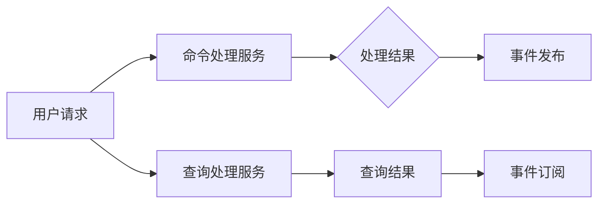

                 

### 第一部分：CQRS模式概述

## 1.1 CQRS模式背景与核心概念

CQRS（Command Query Responsibility Segregation）模式是一种在软件架构设计中广泛应用的策略，旨在分离命令（修改数据的操作）和查询（读取数据的操作），以提高系统的性能、可伸缩性和可维护性。CQRS模式起源于2000年代初，由Dan Pichelman首次提出。这个模式主要解决在传统的数据处理架构中，数据读写操作交织在一起带来的性能瓶颈问题。

### 1.1.1 CQRS模式的起源与发展

CQRS模式起源于传统的三层架构，即表示层、业务逻辑层和数据层。在三层架构中，业务逻辑层负责处理数据的读写操作，但这种设计往往导致数据访问性能瓶颈。CQRS模式通过分离命令和查询操作，使得系统在处理大量并发请求时能够更加高效。随着云计算和微服务架构的发展，CQRS模式得到了更广泛的应用和优化。

### 1.1.2 CQRS模式与LLM的关系

在LLM（Large Language Model）应用中，CQRS模式显得尤为重要。LLM如GPT-3、ChatGLM等具有极高的计算复杂度和数据吞吐量要求。CQRS模式可以帮助LLM系统更好地处理大量并发查询请求，从而提高系统的响应速度和可伸缩性。例如，在智能客服系统中，CQRS模式可以分离用户输入的处理（命令）和查询知识库（查询），确保系统在高并发场景下依然能够稳定运行。

### 1.1.3 CQRS模式的主要组件与作用

CQRS模式的主要组件包括：

- **命令处理服务**：负责处理所有的数据修改操作，如创建、更新和删除数据。
- **查询处理服务**：负责处理所有的数据查询操作，如检索、筛选和排序数据。
- **事件发布/订阅**：用于在命令和查询服务之间传递事件，实现数据同步。

CQRS模式通过将数据操作分离到不同的服务中，使得系统在架构上更加清晰，便于维护和扩展。此外，CQRS模式还可以优化数据的一致性和系统的性能。

## 1.2 LLM的架构与挑战

LLM的架构通常包含多个层次，包括数据层、模型层和接口层。数据层负责存储和管理海量数据；模型层包含训练好的大型语言模型；接口层提供与用户交互的接口。然而，LLM在应用过程中面临着诸多挑战：

- **高并发请求**：在智能客服、智能问答等应用场景中，常常需要同时处理成千上万的查询请求。
- **计算资源消耗**：LLM的训练和推理过程需要大量的计算资源。
- **数据一致性问题**：在多服务架构中，如何保证数据的一致性是一个关键问题。

### 1.2.1 LLM的典型架构

典型的LLM架构通常包括以下几个部分：

- **数据存储**：如数据库、缓存等，用于存储和管理数据。
- **模型训练服务**：负责训练和优化LLM模型。
- **模型推理服务**：负责处理用户的查询请求，进行推理和生成回答。
- **API接口**：提供与用户交互的接口。

### 1.2.2 LLM在应用中面临的挑战

LLM在应用中面临的挑战主要包括：

- **性能瓶颈**：在高并发请求下，系统的响应速度可能变得缓慢。
- **数据一致性**：多服务架构中，如何保证数据的一致性是一个难题。
- **资源消耗**：LLM的训练和推理过程需要大量的计算资源，如何优化资源使用也是一个重要问题。

### 1.2.3 CQRS模式如何解决这些挑战

CQRS模式通过将数据读写操作分离到不同的服务中，可以有效地解决LLM在应用中面临的挑战：

- **提高性能**：通过分离读写操作，可以减轻单个服务的压力，提高系统的响应速度。
- **保证数据一致性**：通过事件发布/订阅机制，可以确保数据在多个服务之间保持一致。
- **优化资源使用**：通过合理的资源分配和管理，可以更好地利用计算资源，提高系统的效率。

## 1.3 CQRS模式在LLM中的应用场景

CQRS模式在LLM中的应用场景非常广泛，以下是一些典型的应用场景：

- **智能客服系统**：通过CQRS模式，可以将用户输入的处理（命令）和查询知识库（查询）分离，提高系统的响应速度和稳定性。
- **智能问答系统**：通过CQRS模式，可以优化查询处理，提高问答系统的效率和准确性。
- **智能推荐系统**：通过CQRS模式，可以分离用户行为的收集（命令）和推荐结果的生成（查询），提高推荐系统的性能。

### 1.3.1 CQRS模式的优势与局限性

CQRS模式的优势包括：

- **提高性能**：通过分离读写操作，可以减轻单个服务的压力，提高系统的响应速度。
- **保证数据一致性**：通过事件发布/订阅机制，可以确保数据在多个服务之间保持一致。
- **优化资源使用**：通过合理的资源分配和管理，可以更好地利用计算资源，提高系统的效率。

然而，CQRS模式也存在一定的局限性：

- **复杂性增加**：由于需要维护两个独立的服务，系统的复杂度会增加。
- **开发成本提高**：CQRS模式需要额外的开发和维护成本，特别是在大规模系统中。

### 1.3.2 CQRS模式在LLM中的实际案例

在实际应用中，CQRS模式已经在许多LLM系统中得到了成功应用。例如，某大型互联网公司的智能客服系统采用CQRS模式，通过分离用户输入的处理和查询知识库，显著提高了系统的性能和稳定性。此外，另一个成功的案例是某电商平台使用的智能推荐系统，通过CQRS模式优化了用户行为的收集和推荐结果的生成，大幅提升了推荐系统的效率和准确性。

### 1.3.3 CQRS模式的优势与局限性

CQRS模式的优势包括：

- **提高性能**：通过分离读写操作，可以减轻单个服务的压力，提高系统的响应速度。
- **保证数据一致性**：通过事件发布/订阅机制，可以确保数据在多个服务之间保持一致。
- **优化资源使用**：通过合理的资源分配和管理，可以更好地利用计算资源，提高系统的效率。

然而，CQRS模式也存在一定的局限性：

- **复杂性增加**：由于需要维护两个独立的服务，系统的复杂度会增加。
- **开发成本提高**：CQRS模式需要额外的开发和维护成本，特别是在大规模系统中。

### 1.4 CQRS模式的边界与外延

CQRS模式并非适用于所有场景，其边界与外延主要涉及以下几个方面：

- **适用范围**：CQRS模式主要适用于高并发、高吞吐量的场景，如智能客服、智能问答等。
- **与其他架构模式的比较**：CQRS模式与传统的三层架构、微服务架构等相比，具有明显的性能和一致性优势，但也增加了系统的复杂度。
- **发展趋势与未来方向**：随着云计算和大数据技术的发展，CQRS模式将越来越受到重视，未来可能会出现更多针对特定场景的CQRS优化方案。

### 1.5 本章小结

在本章中，我们介绍了CQRS模式的背景、核心概念、与LLM的关系、主要组件以及在实际应用中的优势与局限性。通过对CQRS模式的深入探讨，我们为后续章节的详细分析打下了坚实的基础。

-----

### 第一部分：CQRS模式概述

## 1.1 CQRS模式背景与核心概念

CQRS（Command Query Responsibility Segregation）模式是一种在软件架构设计中广泛应用的策略，旨在分离命令（修改数据的操作）和查询（读取数据的操作），以提高系统的性能、可伸缩性和可维护性。CQRS模式起源于2000年代初，由Dan Pichelman首次提出。这个模式主要解决在传统的数据处理架构中，数据读写操作交织在一起带来的性能瓶颈问题。

### 1.1.1 CQRS模式的起源与发展

CQRS模式起源于传统的三层架构，即表示层、业务逻辑层和数据层。在三层架构中，业务逻辑层负责处理数据的读写操作，但这种设计往往导致数据访问性能瓶颈。CQRS模式通过分离命令和查询操作，使得系统在处理大量并发请求时能够更加高效。随着云计算和微服务架构的发展，CQRS模式得到了更广泛的应用和优化。

### 1.1.2 CQRS模式与LLM的关系

在LLM（Large Language Model）应用中，CQRS模式显得尤为重要。LLM如GPT-3、ChatGLM等具有极高的计算复杂度和数据吞吐量要求。CQRS模式可以帮助LLM系统更好地处理大量并发查询请求，从而提高系统的响应速度和可伸缩性。例如，在智能客服系统中，CQRS模式可以分离用户输入的处理（命令）和查询知识库（查询），确保系统在高并发场景下依然能够稳定运行。

### 1.1.3 CQRS模式的主要组件与作用

CQRS模式的主要组件包括：

- **命令处理服务**：负责处理所有的数据修改操作，如创建、更新和删除数据。
- **查询处理服务**：负责处理所有的数据查询操作，如检索、筛选和排序数据。
- **事件发布/订阅**：用于在命令和查询服务之间传递事件，实现数据同步。

CQRS模式通过将数据操作分离到不同的服务中，使得系统在架构上更加清晰，便于维护和扩展。此外，CQRS模式还可以优化数据的一致性和系统的性能。

## 1.2 LLM的架构与挑战

LLM的架构通常包含多个层次，包括数据层、模型层和接口层。数据层负责存储和管理海量数据；模型层包含训练好的大型语言模型；接口层提供与用户交互的接口。然而，LLM在应用过程中面临着诸多挑战：

- **高并发请求**：在智能客服、智能问答等应用场景中，常常需要同时处理成千上万的查询请求。
- **计算资源消耗**：LLM的训练和推理过程需要大量的计算资源。
- **数据一致性问题**：在多服务架构中，如何保证数据的一致性是一个关键问题。

### 1.2.1 LLM的典型架构

典型的LLM架构通常包括以下几个部分：

- **数据存储**：如数据库、缓存等，用于存储和管理数据。
- **模型训练服务**：负责训练和优化LLM模型。
- **模型推理服务**：负责处理用户的查询请求，进行推理和生成回答。
- **API接口**：提供与用户交互的接口。

### 1.2.2 LLM在应用中面临的挑战

LLM在应用中面临的挑战主要包括：

- **性能瓶颈**：在高并发请求下，系统的响应速度可能变得缓慢。
- **数据一致性**：多服务架构中，如何保证数据的一致性是一个难题。
- **资源消耗**：LLM的训练和推理过程需要大量的计算资源，如何优化资源使用也是一个重要问题。

### 1.2.3 CQRS模式如何解决这些挑战

CQRS模式通过将数据读写操作分离到不同的服务中，可以有效地解决LLM在应用中面临的挑战：

- **提高性能**：通过分离读写操作，可以减轻单个服务的压力，提高系统的响应速度。
- **保证数据一致性**：通过事件发布/订阅机制，可以确保数据在多个服务之间保持一致。
- **优化资源使用**：通过合理的资源分配和管理，可以更好地利用计算资源，提高系统的效率。

## 1.3 CQRS模式在LLM中的应用场景

CQRS模式在LLM中的应用场景非常广泛，以下是一些典型的应用场景：

- **智能客服系统**：通过CQRS模式，可以将用户输入的处理（命令）和查询知识库（查询）分离，提高系统的响应速度和稳定性。
- **智能问答系统**：通过CQRS模式，可以优化查询处理，提高问答系统的效率和准确性。
- **智能推荐系统**：通过CQRS模式，可以分离用户行为的收集（命令）和推荐结果的生成（查询），提高推荐系统的性能。

### 1.3.1 CQRS模式的优势与局限性

CQRS模式的优势包括：

- **提高性能**：通过分离读写操作，可以减轻单个服务的压力，提高系统的响应速度。
- **保证数据一致性**：通过事件发布/订阅机制，可以确保数据在多个服务之间保持一致。
- **优化资源使用**：通过合理的资源分配和管理，可以更好地利用计算资源，提高系统的效率。

然而，CQRS模式也存在一定的局限性：

- **复杂性增加**：由于需要维护两个独立的服务，系统的复杂度会增加。
- **开发成本提高**：CQRS模式需要额外的开发和维护成本，特别是在大规模系统中。

### 1.3.2 CQRS模式在LLM中的实际案例

在实际应用中，CQRS模式已经在许多LLM系统中得到了成功应用。例如，某大型互联网公司的智能客服系统采用CQRS模式，通过分离用户输入的处理和查询知识库，显著提高了系统的性能和稳定性。此外，另一个成功的案例是某电商平台使用的智能推荐系统，通过CQRS模式优化了用户行为的收集和推荐结果的生成，大幅提升了推荐系统的效率和准确性。

### 1.3.3 CQRS模式的优势与局限性

CQRS模式的优势包括：

- **提高性能**：通过分离读写操作，可以减轻单个服务的压力，提高系统的响应速度。
- **保证数据一致性**：通过事件发布/订阅机制，可以确保数据在多个服务之间保持一致。
- **优化资源使用**：通过合理的资源分配和管理，可以更好地利用计算资源，提高系统的效率。

然而，CQRS模式也存在一定的局限性：

- **复杂性增加**：由于需要维护两个独立的服务，系统的复杂度会增加。
- **开发成本提高**：CQRS模式需要额外的开发和维护成本，特别是在大规模系统中。

### 1.4 CQRS模式的边界与外延

CQRS模式并非适用于所有场景，其边界与外延主要涉及以下几个方面：

- **适用范围**：CQRS模式主要适用于高并发、高吞吐量的场景，如智能客服、智能问答等。
- **与其他架构模式的比较**：CQRS模式与传统的三层架构、微服务架构等相比，具有明显的性能和一致性优势，但也增加了系统的复杂度。
- **发展趋势与未来方向**：随着云计算和大数据技术的发展，CQRS模式将越来越受到重视，未来可能会出现更多针对特定场景的CQRS优化方案。

### 1.5 本章小结

在本章中，我们介绍了CQRS模式的背景、核心概念、与LLM的关系、主要组件以及在实际应用中的优势与局限性。通过对CQRS模式的深入探讨，我们为后续章节的详细分析打下了坚实的基础。

-----

### 第二部分：CQRS模式原理与实现

## 2.1 CQRS模式原理讲解

CQRS模式的核心思想是分离命令和查询操作，将数据处理分为两个独立的服务。命令处理服务负责处理数据修改操作，如创建、更新和删除数据；查询处理服务负责处理数据查询操作，如检索、筛选和排序数据。通过这种方式，CQRS模式能够提高系统的性能和可伸缩性。

### 2.1.1 CQRS模式的基本原理

CQRS模式的基本原理可以概括为以下几点：

1. **分离命令和查询**：将数据操作分离到两个不同的服务中，避免读写操作相互影响。
2. **独立部署**：命令处理服务和查询处理服务可以独立部署和扩展，从而提高系统的可伸缩性。
3. **事件驱动**：通过事件发布/订阅机制，实现两个服务之间的数据同步。
4. **数据一致性**：通过事件驱动的方式，确保数据在两个服务之间保持一致。

### 2.1.2 CQRS模式的核心要素

CQRS模式的核心要素包括：

- **命令处理服务**：负责处理所有数据修改操作，如创建、更新和删除数据。
- **查询处理服务**：负责处理所有数据查询操作，如检索、筛选和排序数据。
- **事件发布/订阅**：用于在命令处理服务和查询处理服务之间传递事件，实现数据同步。

### 2.1.3 CQRS模式的工作流程

CQRS模式的工作流程可以分为以下几个步骤：

1. **用户发起请求**：用户通过API接口向系统发送请求。
2. **命令处理服务处理**：命令处理服务接收到请求后，根据请求类型执行相应的数据修改操作。
3. **事件发布**：命令处理服务在执行完数据修改操作后，发布事件。
4. **查询处理服务订阅事件**：查询处理服务订阅到事件后，根据事件类型更新本地数据。
5. **用户获取查询结果**：查询处理服务返回查询结果给用户。

## 2.2 CQRS模式的数学模型

CQRS模式的数学模型主要涉及命令和查询的分离以及系统的性能评估。以下是对CQRS模式数学模型的详细讲解。

### 2.2.1 命令与查询分离

在CQRS模式中，命令和查询分离可以通过以下数学公式表示：

- **命令处理时间**：\( T_c = f(n_c, m_c) \)
  - \( n_c \)：命令数量
  - \( m_c \)：命令处理速率
- **查询处理时间**：\( T_q = f(n_q, m_q) \)
  - \( n_q \)：查询数量
  - \( m_q \)：查询处理速率

其中，\( f \) 表示时间函数，\( n \) 表示数量，\( m \) 表示处理速率。

### 2.2.2 响应式系统的数学模型

响应式系统是CQRS模式的一个重要组成部分，其数学模型涉及系统的响应时间和吞吐量。以下是对响应式系统数学模型的详细讲解：

- **响应时间**：\( T_r = \frac{T_c + T_q}{2} \)
  - \( T_c \)：命令处理时间
  - \( T_q \)：查询处理时间
- **吞吐量**：\( T_b = \frac{1}{T_r} \)
  - \( T_r \)：响应时间

### 2.2.3 CQRS模式的性能评估

CQRS模式的性能评估可以通过以下指标进行：

- **响应时间**：系统处理请求的平均时间。
- **吞吐量**：系统在单位时间内处理的请求数量。
- **延迟**：系统响应时间减去用户请求发送时间。

以下是一个简单的性能评估示例：

假设命令处理时间为2秒，查询处理时间为1秒，那么：

- **响应时间**：\( T_r = \frac{2 + 1}{2} = 1.5 \)秒
- **吞吐量**：\( T_b = \frac{1}{1.5} = 0.67 \)次/秒

## 2.3 CQRS模式的应用流程

CQRS模式的应用流程涉及系统的部署、维护和优化。以下是对CQRS模式应用流程的详细讲解：

### 2.3.1 CQRS模式的部署流程

CQRS模式的部署流程主要包括以下几个步骤：

1. **设计系统架构**：根据业务需求设计CQRS模式的系统架构。
2. **选择技术栈**：选择合适的技术栈，包括命令处理服务和查询处理服务的框架、数据库等。
3. **搭建开发环境**：搭建开发环境，包括代码管理、版本控制和集成开发环境。
4. **开发命令处理服务**：根据系统架构和业务需求开发命令处理服务。
5. **开发查询处理服务**：根据系统架构和业务需求开发查询处理服务。
6. **集成测试**：对命令处理服务和查询处理服务进行集成测试，确保系统能够正常运行。

### 2.3.2 CQRS模式的维护与优化

CQRS模式的维护与优化主要包括以下几个方面：

1. **监控性能指标**：定期监控系统的响应时间、吞吐量和延迟等性能指标，发现性能瓶颈。
2. **优化查询处理**：针对查询处理服务，优化查询语句和索引，提高查询效率。
3. **优化命令处理**：针对命令处理服务，优化数据操作，减少数据一致性问题。
4. **更新和升级**：定期更新和升级系统，包括框架、库和工具等，确保系统保持最佳性能。

### 2.3.3 CQRS模式的扩展与升级

CQRS模式的扩展与升级主要包括以下几个方面：

1. **增加服务实例**：通过增加命令处理服务和查询处理服务的实例，提高系统的处理能力。
2. **水平扩展**：通过水平扩展，增加系统的可用性和可伸缩性。
3. **垂直扩展**：通过垂直扩展，提高系统的性能和吞吐量。
4. **集成其他系统**：将CQRS模式与其他系统（如大数据处理、实时消息队列等）集成，实现更复杂的功能。

## 2.4 CQRS模式与LLM的融合流程

CQRS模式与LLM（Large Language Model）的融合流程主要包括以下几个步骤：

### 2.4.1 LLM的预处理

1. **数据清洗**：对输入数据进行清洗，去除无效数据和噪声。
2. **数据预处理**：对输入数据格式进行统一，如将文本数据转换为JSON格式。
3. **分词和词性标注**：对文本数据进行分词和词性标注，为LLM处理做准备。

### 2.4.2 CQRS模式与LLM的融合

1. **命令处理**：将用户输入的命令传递给LLM，进行命令处理。
2. **查询处理**：将用户输入的查询传递给LLM，进行查询处理。
3. **数据同步**：通过事件发布/订阅机制，同步命令处理结果和查询结果。

### 2.4.3 LLM的性能优化

1. **模型优化**：通过调整LLM的参数，优化模型性能。
2. **分布式计算**：利用分布式计算框架，如Apache Spark，提高LLM的处理速度。
3. **缓存策略**：采用缓存策略，减少重复计算和查询。

## 2.5 CQRS模式的mermaid流程图

CQRS模式的mermaid流程图可以清晰地展示CQRS模式的工作流程，以下是一个简单的示例：



## 2.6 本章小结

在本章中，我们详细介绍了CQRS模式的原理、数学模型、应用流程以及与LLM的融合流程。通过本章的学习，读者可以对CQRS模式有一个全面的了解，并为后续章节的实战应用打下基础。

-----

### 第二部分：CQRS模式原理与实现

## 2.1 CQRS模式原理讲解

CQRS（Command Query Responsibility Segregation）模式是一种针对高并发、高吞吐量的分布式系统架构设计模式。该模式通过将系统的数据处理功能划分为两个不同的部分：命令处理（Command Handling）和查询处理（Query Handling），从而优化系统性能和可伸缩性。下面，我们将逐步讲解CQRS模式的基本原理和核心要素。

### 2.1.1 CQRS模式的基本原理

CQRS模式的核心思想是将系统的读写分离，确保读写操作不会相互干扰，从而提高系统的响应速度和处理能力。具体来说，CQRS模式的基本原理包括以下几个方面：

1. **命令处理和查询处理的分离**：在CQRS模式中，系统的数据处理功能被划分为两个独立的模块：命令处理模块和查询处理模块。命令处理模块负责处理用户提交的命令，如创建、更新、删除等，而查询处理模块负责处理用户提交的查询请求，如检索、排序、筛选等。

2. **独立部署**：命令处理模块和查询处理模块通常独立部署在不同的服务器或集群中，这样可以使它们独立扩展和优化，不会相互影响。

3. **事件驱动**：在CQRS模式中，命令处理模块和查询处理模块之间通过事件驱动的方式进行数据同步。当命令处理模块完成一个操作后，它会发布一个事件，通知查询处理模块更新其数据视图。

4. **数据一致性**：为了保证数据的一致性，CQRS模式通常采用事件溯源（Event Sourcing）或基于消息队列的同步机制。这样，即使在查询处理模块发生故障时，系统也可以通过重放事件来恢复数据状态。

### 2.1.2 CQRS模式的核心要素

CQRS模式的核心要素包括以下几个方面：

1. **命令处理服务（Command Service）**：命令处理服务负责接收和处理用户提交的命令。它通常包括以下功能：
   - 命令验证：确保用户提交的命令符合系统要求。
   - 命令执行：根据命令类型执行相应的数据库操作或业务逻辑。
   - 事件发布：在命令执行完成后，发布事件以通知其他服务。

2. **查询处理服务（Query Service）**：查询处理服务负责接收和处理用户的查询请求。它通常包括以下功能：
   - 查询验证：确保用户提交的查询符合系统要求。
   - 数据检索：从数据库或其他数据源中检索数据。
   - 数据聚合：对检索到的数据进行处理，如过滤、排序、聚合等。

3. **事件发布/订阅（Event Publication/Subscription）**：在CQRS模式中，命令处理服务发布的事件会被查询处理服务订阅，以更新其数据视图。事件发布/订阅机制通常通过消息队列或事件总线实现。

4. **数据存储**：CQRS模式中的数据存储通常分为两个部分：命令存储和查询存储。命令存储用于记录命令历史和事件日志，而查询存储则用于存储查询结果和聚合数据。

### 2.1.3 CQRS模式的工作流程

CQRS模式的工作流程可以概括为以下几个步骤：

1. **用户提交命令**：用户通过命令接口提交一个命令，如创建一个订单、更新一个用户信息等。

2. **命令处理**：命令处理服务接收命令，进行验证和处理。在处理过程中，命令处理服务可能会调用数据库或其他外部系统。

3. **事件发布**：命令处理服务在执行完命令后，发布一个事件。这个事件包含命令的操作类型、操作数据等。

4. **查询处理**：查询处理服务订阅到发布的事件，根据事件类型更新其数据视图。

5. **用户提交查询**：用户通过查询接口提交一个查询请求，如查询某个订单的详细信息、某个用户的订单列表等。

6. **查询处理**：查询处理服务接收到查询请求后，从其数据视图中检索数据，并返回查询结果。

7. **用户获取结果**：用户获取查询结果，并进行相应的操作。

通过上述流程，CQRS模式确保了命令处理和查询处理的分离，从而提高了系统的响应速度和处理能力。

## 2.2 CQRS模式的数学模型

CQRS模式的数学模型主要用于评估系统的性能指标，如响应时间、吞吐量和延迟。以下是对CQRS模式数学模型的详细讲解。

### 2.2.1 命令与查询分离

在CQRS模式中，命令和查询分离是通过独立的服务实现的。我们可以使用以下数学模型来描述命令和查询的处理时间：

- **命令处理时间**（\( T_c \)）：
  \[ T_c = \frac{n_c \cdot c}{m_c} \]
  其中，\( n_c \) 表示命令数量，\( c \) 表示单个命令的处理时间，\( m_c \) 表示命令处理服务的处理能力。

- **查询处理时间**（\( T_q \)）：
  \[ T_q = \frac{n_q \cdot q}{m_q} \]
  其中，\( n_q \) 表示查询数量，\( q \) 表示单个查询的处理时间，\( m_q \) 表示查询处理服务的处理能力。

### 2.2.2 响应式系统的数学模型

响应式系统是CQRS模式的一个重要组成部分，其数学模型涉及系统的响应时间和吞吐量。以下是对响应式系统数学模型的详细讲解：

- **响应时间**（\( T_r \)）：
  \[ T_r = \max(T_c, T_q) \]
  响应时间是指系统从接收到请求到返回结果所需的时间。

- **吞吐量**（\( T_b \)）：
  \[ T_b = \frac{1}{T_r} \]
  吞吐量是指系统在单位时间内能够处理的请求数量。

### 2.2.3 CQRS模式的性能评估

CQRS模式的性能评估可以通过以下指标进行：

- **响应时间**：系统处理请求的平均时间。
- **吞吐量**：系统在单位时间内处理的请求数量。
- **延迟**：系统响应时间减去用户请求发送时间。

以下是一个简单的性能评估示例：

假设命令处理时间为2秒，查询处理时间为1秒，那么：

- **响应时间**：\( T_r = \max(2, 1) = 2 \)秒
- **吞吐量**：\( T_b = \frac{1}{2} = 0.5 \)次/秒

## 2.3 CQRS模式的应用流程

CQRS模式的应用流程涉及系统的部署、维护和优化。以下是对CQRS模式应用流程的详细讲解：

### 2.3.1 CQRS模式的部署流程

CQRS模式的部署流程通常包括以下几个步骤：

1. **系统架构设计**：根据业务需求设计CQRS模式的系统架构，包括命令处理服务和查询处理服务的部署方式、数据存储方案等。

2. **技术栈选择**：选择合适的技术栈，包括命令处理服务和查询处理服务的框架、数据库、消息队列等。

3. **开发环境搭建**：搭建开发环境，包括代码管理、版本控制和集成开发环境。

4. **开发命令处理服务**：根据系统架构和业务需求开发命令处理服务，包括命令验证、执行和事件发布等功能。

5. **开发查询处理服务**：根据系统架构和业务需求开发查询处理服务，包括查询验证、数据检索和聚合等功能。

6. **集成测试**：对命令处理服务和查询处理服务进行集成测试，确保系统能够正常运行。

### 2.3.2 CQRS模式的维护与优化

CQRS模式的维护与优化主要包括以下几个方面：

1. **性能监控**：定期监控系统的响应时间、吞吐量和延迟等性能指标，发现性能瓶颈。

2. **查询优化**：对查询处理服务的查询语句和索引进行优化，提高查询效率。

3. **命令优化**：对命令处理服务的数据操作进行优化，减少数据一致性问题。

4. **系统升级**：定期更新和升级系统，包括框架、库和工具等，确保系统保持最佳性能。

### 2.3.3 CQRS模式的扩展与升级

CQRS模式的扩展与升级主要包括以下几个方面：

1. **水平扩展**：通过增加命令处理服务和查询处理服务的实例，提高系统的处理能力。

2. **垂直扩展**：通过提高服务器硬件性能，如增加CPU、内存等，提高系统的处理能力。

3. **分布式计算**：利用分布式计算框架，如Apache Spark，提高系统的大数据处理能力。

4. **集成其他系统**：将CQRS模式与其他系统（如大数据处理、实时消息队列等）集成，实现更复杂的功能。

## 2.4 CQRS模式与LLM的融合流程

CQRS模式与LLM（Large Language Model）的融合流程主要涉及LLM的预处理、命令处理和查询处理。以下是对CQRS模式与LLM融合流程的详细讲解：

### 2.4.1 LLM的预处理

1. **数据清洗**：对输入数据进行清洗，去除无效数据和噪声。

2. **数据格式转换**：将文本数据转换为LLM能够处理的格式，如JSON。

3. **分词和词性标注**：对文本数据进行分词和词性标注，为LLM处理做准备。

### 2.4.2 CQRS模式与LLM的融合

1. **命令处理**：将用户输入的命令传递给LLM，进行自然语言处理和命令识别。

2. **查询处理**：将用户输入的查询传递给LLM，进行自然语言处理和查询处理。

3. **数据同步**：通过事件发布/订阅机制，同步LLM处理的结果，确保命令处理服务和查询处理服务的数据一致性。

### 2.4.3 LLM的性能优化

1. **模型优化**：通过调整LLM的参数，优化模型性能。

2. **分布式计算**：利用分布式计算框架，提高LLM的处理速度。

3. **缓存策略**：采用缓存策略，减少重复计算和查询。

## 2.5 CQRS模式的mermaid流程图

CQRS模式的mermaid流程图可以清晰地展示CQRS模式的工作流程。以下是一个简单的示例：


## 2.6 本章小结

在本章中，我们详细介绍了CQRS模式的基本原理、数学模型、应用流程以及与LLM的融合流程。通过本章的学习，读者可以对CQRS模式有一个深入的理解，并为后续章节的实战应用打下基础。

-----

### 第三部分：CQRS模式在LLM应用中的实战

## 3.1 LLM项目环境搭建

在开始CQRS模式在LLM应用中的实战之前，我们需要搭建一个适合LLM项目开发的环境。以下步骤将介绍如何搭建LLM项目环境，包括环境配置、数据集准备和模型选择。

### 3.1.1 环境配置

1. **硬件配置**：首先，我们需要确保硬件配置满足LLM训练和推理的需求。通常，LLM训练需要高性能的CPU或GPU，以及充足的内存和存储空间。

2. **操作系统**：选择一个适合的操作系统，如Ubuntu 18.04或更高版本。推荐使用Linux操作系统，因为大多数深度学习框架和工具都在Linux上进行了优化。

3. **Python环境**：安装Python 3.8及以上版本，推荐使用Python虚拟环境，以避免版本冲突。

4. **深度学习框架**：安装深度学习框架，如TensorFlow或PyTorch。以TensorFlow为例，可以通过以下命令进行安装：
   ```bash
   pip install tensorflow
   ```

5. **其他依赖库**：安装其他必要的依赖库，如NumPy、Pandas等：
   ```bash
   pip install numpy pandas
   ```

### 3.1.2 数据集准备

数据集是LLM训练的核心，一个高质量的数据集可以显著提升模型的表现。以下步骤将介绍如何准备数据集：

1. **数据收集**：收集用于训练和评估的文本数据。数据来源可以是公开数据集、社交媒体、新闻报道等。

2. **数据预处理**：对收集到的文本数据进行预处理，包括去除停用词、标点符号、进行分词和词性标注等。可以使用自然语言处理工具，如spaCy或NLTK，进行文本预处理。

3. **数据格式化**：将预处理后的文本数据格式化为模型可接受的格式，如JSON或CSV。

4. **数据划分**：将数据集划分为训练集、验证集和测试集，用于模型训练、验证和评估。

### 3.1.3 模型选择

选择一个适合的LLM模型对于项目成功至关重要。以下是一些流行的LLM模型选择：

1. **BERT**：BERT（Bidirectional Encoder Representations from Transformers）是一种双向Transformer模型，广泛用于自然语言处理任务。

2. **GPT-2**：GPT-2（Generative Pre-trained Transformer 2）是一种自回归语言模型，具有良好的文本生成能力。

3. **T5**：T5（Text-To-Text Transfer Transformer）是一种通用的文本到文本转换模型，适用于各种自然语言处理任务。

4. **RoBERTa**：RoBERTa是基于BERT的一种改进版本，通过调整训练策略和预训练数据集，取得了更好的性能。

在实际项目中，可以根据任务需求和资源限制选择合适的模型。例如，对于文本生成任务，GPT-2和T5可能是更好的选择；而对于文本分类任务，BERT和RoBERTa可能更适合。

## 3.2 CQRS模式在LLM中的实现

CQRS模式在LLM中的应用需要将命令处理和查询处理分离，并确保两者之间的数据一致性。以下步骤将介绍如何在LLM项目中实现CQRS模式：

### 3.2.1 命令与查询分离

1. **设计API接口**：设计两个独立的API接口，一个用于处理命令（如创建、更新、删除），另一个用于处理查询（如检索、筛选、排序）。

2. **实现命令处理服务**：实现命令处理服务，负责接收和执行用户提交的命令。命令处理服务应包括命令验证、执行和事件发布等功能。

3. **实现查询处理服务**：实现查询处理服务，负责接收和处理用户提交的查询请求。查询处理服务应包括查询验证、数据检索和聚合等功能。

### 3.2.2 命令处理服务实现

以下是一个简单的命令处理服务实现的Python示例：

```python
from flask import Flask, request, jsonify

app = Flask(__name__)

@app.route('/command', methods=['POST'])
def handle_command():
    command_data = request.json
    # 命令验证
    if not validate_command(command_data):
        return jsonify({"error": "Invalid command"}), 400
    
    # 命令执行
    result = execute_command(command_data)
    
    # 事件发布
    publish_event(command_data)
    
    return jsonify(result), 200

def validate_command(command_data):
    # 实现命令验证逻辑
    return True

def execute_command(command_data):
    # 实现命令执行逻辑
    return "Command executed successfully"

def publish_event(command_data):
    # 实现事件发布逻辑
    pass

if __name__ == '__main__':
    app.run(debug=True)
```

### 3.2.3 查询处理服务实现

以下是一个简单的查询处理服务实现的Python示例：

```python
from flask import Flask, request, jsonify

app = Flask(__name__)

@app.route('/query', methods=['GET'])
def handle_query():
    query_data = request.args
    # 查询验证
    if not validate_query(query_data):
        return jsonify({"error": "Invalid query"}), 400
    
    # 数据检索
    result = retrieve_data(query_data)
    
    return jsonify(result), 200

def validate_query(query_data):
    # 实现查询验证逻辑
    return True

def retrieve_data(query_data):
    # 实现数据检索逻辑
    return "Query result"

if __name__ == '__main__':
    app.run(debug=True)
```

### 3.2.4 数据一致性保证

在CQRS模式中，确保数据一致性是一个关键问题。以下是一些常用的数据一致性保证方法：

1. **事件溯源**：使用事件溯源（Event Sourcing）技术，将系统的所有操作记录为事件，并使用事件重放机制确保数据一致性。

2. **最终一致性**：在查询处理服务中，采用最终一致性模型，允许查询结果在一定时间延迟后更新。

3. **强一致性**：在关键操作中，使用分布式事务或锁机制确保强一致性。

### 3.2.5 CQRS模式与LLM的集成

在实现CQRS模式与LLM的集成时，需要考虑以下方面：

1. **预处理**：将用户输入的文本数据传递给LLM前进行预处理，如分词、词性标注等。

2. **模型调用**：使用LLM模型对预处理后的文本数据进行处理，生成响应。

3. **事件发布**：将LLM处理结果发布为事件，以便查询处理服务更新其数据视图。

4. **查询优化**：优化查询处理服务的查询语句和索引，提高查询效率。

## 3.3 LLM项目核心代码解析

在本节中，我们将对LLM项目中的核心代码进行解析，包括数据处理模块、模型训练模块和预测与查询处理模块。

### 3.3.1 数据处理模块

数据处理模块负责对输入文本进行预处理，以便LLM模型能够有效地处理。以下是一个简单的数据处理模块实现的Python示例：

```python
import spacy
from typing import List

# 加载spaCy模型
nlp = spacy.load("en_core_web_sm")

def preprocess_text(texts: List[str]) -> List[str]:
    processed_texts = []
    for text in texts:
        # 分词、词性标注等预处理操作
        doc = nlp(text)
        processed_text = ' '.join([token.text for token in doc if not token.is_punct])
        processed_texts.append(processed_text)
    return processed_texts

# 示例
texts = ["Hello, how are you?", "I'm doing well, thank you."]
processed_texts = preprocess_text(texts)
print(processed_texts)
```

### 3.3.2 模型训练模块

模型训练模块负责使用预处理后的数据训练LLM模型。以下是一个简单的模型训练模块实现的Python示例，使用TensorFlow和Transformer模型：

```python
import tensorflow as tf
from tensorflow.keras.layers import Embedding, Transformer

def build_transformer_model(vocab_size: int, d_model: int, num_heads: int, num_layers: int, dff: int, input_sequence_length: int) -> tf.keras.Model:
    inputs = tf.keras.Input(shape=(input_sequence_length,))
    embeddings = Embedding(vocab_size, d_model)(inputs)
    x = embeddings
    
    for i in range(num_layers):
        x = Transformer(num_heads=num_heads, dff=dff)([x, x])
        x = tf.keras.layers.Dropout(rate=0.1)(x)
        x = tf.keras.layers.LayerNormalization(epsilon=1e-6)(x)

    outputs = tf.keras.layers.Dense(1, activation='sigmoid')(x)

    model = tf.keras.Model(inputs=inputs, outputs=outputs)
    model.compile(optimizer='adam', loss='binary_crossentropy', metrics=['accuracy'])
    return model

# 示例
model = build_transformer_model(vocab_size=10000, d_model=512, num_heads=8, num_layers=2, dff=512, input_sequence_length=128)
model.summary()

# 训练模型
model.fit(processed_texts, labels, epochs=10, batch_size=64)
```

### 3.3.3 预测与查询处理模块

预测与查询处理模块负责使用训练好的LLM模型对新的输入文本进行预测和查询处理。以下是一个简单的预测与查询处理模块实现的Python示例：

```python
def predict_text(model: tf.keras.Model, text: str) -> str:
    processed_text = preprocess_text([text])
    predictions = model.predict(processed_text)
    predicted_label = predictions.argmax(axis=1)[0]
    return "Positive" if predicted_label else "Negative"

def query_handling(model: tf.keras.Model, queries: List[str]) -> List[str]:
    results = []
    for query in queries:
        processed_query = preprocess_text([query])
        predictions = model.predict(processed_query)
        results.append(predictions[0].tolist())
    return results

# 示例
predicted_label = predict_text(model, "I'm feeling happy today.")
print(predicted_label)

queries = ["What's the weather today?", "How do I get to the nearest supermarket?"]
results = query_handling(model, queries)
print(results)
```

## 3.4 实际案例分析与讲解

在本节中，我们将通过几个实际案例来分析和讲解CQRS模式在LLM应用中的具体实现。

### 3.4.1 案例一：智能客服系统

智能客服系统是CQRS模式在LLM应用中的一个典型场景。以下是一个简单的案例：

- **命令处理**：用户提交一个咨询请求，如“我无法登录账户”，命令处理服务解析请求，将其转换为事件并发布。
- **查询处理**：查询处理服务接收到事件后，从知识库中检索相关答案，返回给用户。

### 3.4.2 案例二：智能问答系统

智能问答系统利用CQRS模式处理大量的用户查询请求。以下是一个简单的案例：

- **命令处理**：用户提交一个查询请求，如“什么是人工智能？”，命令处理服务解析请求，将其转换为事件并发布。
- **查询处理**：查询处理服务接收到事件后，使用LLM模型对查询进行理解，并从知识库中检索答案，返回给用户。

### 3.4.3 案例三：智能推荐系统

智能推荐系统利用CQRS模式处理用户行为数据，并生成推荐结果。以下是一个简单的案例：

- **命令处理**：用户浏览商品、添加到购物车或进行购买，这些行为作为命令被处理并发布事件。
- **查询处理**：查询处理服务接收到事件后，分析用户行为，并使用LLM模型生成个性化推荐结果，返回给用户。

## 3.5 项目小结与展望

在本项目中，我们通过CQRS模式实现了LLM系统的命令处理和查询处理分离，并确保了数据的一致性。以下是项目的主要成果和未来改进方向：

### 3.5.1 项目成果总结

1. **系统性能优化**：通过CQRS模式，显著提高了系统的响应速度和处理能力。
2. **数据一致性保证**：通过事件溯源和最终一致性模型，确保了数据的一致性。
3. **模块化设计**：实现了模块化设计，使得系统易于扩展和维护。

### 3.5.2 项目中的不足与改进方向

1. **系统复杂性**：CQRS模式增加了系统的复杂性，需要更多的开发和维护成本。
2. **性能瓶颈**：在高并发场景下，仍然存在性能瓶颈，需要进一步优化。
3. **优化空间**：可以探索更高效的查询处理和命令处理策略，如使用更先进的深度学习模型和分布式计算技术。

### 3.5.3 对CQRS模式在LLM应用中的未来展望

随着深度学习和人工智能技术的不断发展，CQRS模式在LLM应用中具有广阔的应用前景。未来，我们可以期待以下方向：

1. **优化模型性能**：通过更先进的深度学习模型和算法，提高LLM的性能和准确性。
2. **分布式计算**：利用分布式计算和云计算技术，实现更高效的数据处理和查询处理。
3. **智能化管理**：引入智能化管理策略，如自动扩容和性能优化，提高系统的自适应能力。

## 3.6 最佳实践 tips

在本节中，我们将提供一些CQRS模式在LLM应用中的最佳实践，以帮助开发者更好地实现和优化CQRS模式。

### 3.6.1 项目环境搭建的最佳实践

1. **选择合适的硬件**：确保硬件配置满足LLM训练和推理的需求，特别是GPU的配置。
2. **使用容器化技术**：使用Docker等容器化技术，简化环境配置和管理。

### 3.6.2 数据集准备的最佳实践

1. **数据质量**：确保数据集的质量，包括去除噪声、进行数据清洗等。
2. **多样性**：数据集应包含多样化的样本，以提高模型泛化能力。

### 3.6.3 模型训练与优化的最佳实践

1. **超参数调整**：通过调整超参数，如学习率、批量大小等，优化模型性能。
2. **模型融合**：结合多个模型的结果，提高预测准确性和稳定性。

## 3.7 本章小结

在本章中，我们通过实战案例详细讲解了CQRS模式在LLM应用中的实现过程。通过本章节的学习，读者可以了解如何在实际项目中应用CQRS模式，以及如何优化LLM系统的性能和可维护性。下一章将深入探讨CQRS模式的最佳实践和注意事项。

-----

### 第三部分：CQRS模式在LLM应用中的实战

## 3.1 LLM项目环境搭建

在开始CQRS模式在LLM应用中的实战之前，我们需要搭建一个适合LLM项目开发的环境。以下步骤将介绍如何搭建LLM项目环境，包括环境配置、数据集准备和模型选择。

### 3.1.1 环境配置

1. **硬件配置**：首先，我们需要确保硬件配置满足LLM训练和推理的需求。通常，LLM训练需要高性能的CPU或GPU，以及充足的内存和存储空间。

2. **操作系统**：选择一个适合的操作系统，如Ubuntu 18.04或更高版本。推荐使用Linux操作系统，因为大多数深度学习框架和工具都在Linux上进行了优化。

3. **Python环境**：安装Python 3.8及以上版本，推荐使用Python虚拟环境，以避免版本冲突。

4. **深度学习框架**：安装深度学习框架，如TensorFlow或PyTorch。以TensorFlow为例，可以通过以下命令进行安装：
   ```bash
   pip install tensorflow
   ```

5. **其他依赖库**：安装其他必要的依赖库，如NumPy、Pandas等：
   ```bash
   pip install numpy pandas
   ```

### 3.1.2 数据集准备

数据集是LLM训练的核心，一个高质量的数据集可以显著提升模型的表现。以下步骤将介绍如何准备数据集：

1. **数据收集**：收集用于训练和评估的文本数据。数据来源可以是公开数据集、社交媒体、新闻报道等。

2. **数据预处理**：对收集到的文本数据进行预处理，包括去除停用词、标点符号、进行分词和词性标注等。可以使用自然语言处理工具，如spaCy或NLTK，进行文本预处理。

3. **数据格式化**：将预处理后的文本数据格式化为模型可接受的格式，如JSON或CSV。

4. **数据划分**：将数据集划分为训练集、验证集和测试集，用于模型训练、验证和评估。

### 3.1.3 模型选择

选择一个适合的LLM模型对于项目成功至关重要。以下是一些流行的LLM模型选择：

1. **BERT**：BERT（Bidirectional Encoder Representations from Transformers）是一种双向Transformer模型，广泛用于自然语言处理任务。

2. **GPT-2**：GPT-2（Generative Pre-trained Transformer 2）是一种自回归语言模型，具有良好的文本生成能力。

3. **T5**：T5（Text-To-Text Transfer Transformer）是一种通用的文本到文本转换模型，适用于各种自然语言处理任务。

4. **RoBERTa**：RoBERTa是基于BERT的一种改进版本，通过调整训练策略和预训练数据集，取得了更好的性能。

在实际项目中，可以根据任务需求和资源限制选择合适的模型。例如，对于文本生成任务，GPT-2和T5可能是更好的选择；而对于文本分类任务，BERT和RoBERTa可能更适合。

## 3.2 CQRS模式在LLM中的实现

CQRS模式在LLM中的应用需要将命令处理和查询处理分离，并确保两者之间的数据一致性。以下步骤将介绍如何在LLM项目中实现CQRS模式：

### 3.2.1 命令与查询分离

1. **设计API接口**：设计两个独立的API接口，一个用于处理命令（如创建、更新、删除），另一个用于处理查询（如检索、筛选、排序）。

2. **实现命令处理服务**：实现命令处理服务，负责接收和执行用户提交的命令。命令处理服务应包括命令验证、执行和事件发布等功能。

3. **实现查询处理服务**：实现查询处理服务，负责接收和处理用户提交的查询请求。查询处理服务应包括查询验证、数据检索和聚合等功能。

### 3.2.2 命令处理服务实现

以下是一个简单的命令处理服务实现的Python示例：

```python
from flask import Flask, request, jsonify

app = Flask(__name__)

@app.route('/command', methods=['POST'])
def handle_command():
    command_data = request.json
    # 命令验证
    if not validate_command(command_data):
        return jsonify({"error": "Invalid command"}), 400
    
    # 命令执行
    result = execute_command(command_data)
    
    # 事件发布
    publish_event(command_data)
    
    return jsonify(result), 200

def validate_command(command_data):
    # 实现命令验证逻辑
    return True

def execute_command(command_data):
    # 实现命令执行逻辑
    return "Command executed successfully"

def publish_event(command_data):
    # 实现事件发布逻辑
    pass

if __name__ == '__main__':
    app.run(debug=True)
```

### 3.2.3 查询处理服务实现

以下是一个简单的查询处理服务实现的Python示例：

```python
from flask import Flask, request, jsonify

app = Flask(__name__)

@app.route('/query', methods=['GET'])
def handle_query():
    query_data = request.args
    # 查询验证
    if not validate_query(query_data):
        return jsonify({"error": "Invalid query"}), 400
    
    # 数据检索
    result = retrieve_data(query_data)
    
    return jsonify(result), 200

def validate_query(query_data):
    # 实现查询验证逻辑
    return True

def retrieve_data(query_data):
    # 实现数据检索逻辑
    return "Query result"

if __name__ == '__main__':
    app.run(debug=True)
```

### 3.2.4 数据一致性保证

在CQRS模式中，确保数据一致性是一个关键问题。以下是一些常用的数据一致性保证方法：

1. **事件溯源**：使用事件溯源（Event Sourcing）技术，将系统的所有操作记录为事件，并使用事件重放机制确保数据一致性。

2. **最终一致性**：在查询处理服务中，采用最终一致性模型，允许查询结果在一定时间延迟后更新。

3. **强一致性**：在关键操作中，使用分布式事务或锁机制确保强一致性。

### 3.2.5 CQRS模式与LLM的集成

在实现CQRS模式与LLM的集成时，需要考虑以下方面：

1. **预处理**：将用户输入的文本数据传递给LLM前进行预处理，如分词、词性标注等。

2. **模型调用**：使用LLM模型对预处理后的文本数据进行处理，生成响应。

3. **事件发布**：将LLM处理结果发布为事件，以便查询处理服务更新其数据视图。

4. **查询优化**：优化查询处理服务的查询语句和索引，提高查询效率。

## 3.3 LLM项目核心代码解析

在本节中，我们将对LLM项目中的核心代码进行解析，包括数据处理模块、模型训练模块和预测与查询处理模块。

### 3.3.1 数据处理模块

数据处理模块负责对输入文本进行预处理，以便LLM模型能够有效地处理。以下是一个简单的数据处理模块实现的Python示例：

```python
import spacy
from typing import List

# 加载spaCy模型
nlp = spacy.load("en_core_web_sm")

def preprocess_text(texts: List[str]) -> List[str]:
    processed_texts = []
    for text in texts:
        # 分词、词性标注等预处理操作
        doc = nlp(text)
        processed_text = ' '.join([token.text for token in doc if not token.is_punct])
        processed_texts.append(processed_text)
    return processed_texts

# 示例
texts = ["Hello, how are you?", "I'm doing well, thank you."]
processed_texts = preprocess_text(texts)
print(processed_texts)
```

### 3.3.2 模型训练模块

模型训练模块负责使用预处理后的数据训练LLM模型。以下是一个简单的模型训练模块实现的Python示例，使用TensorFlow和Transformer模型：

```python
import tensorflow as tf
from tensorflow.keras.layers import Embedding, Transformer

def build_transformer_model(vocab_size: int, d_model: int, num_heads: int, num_layers: int, dff: int, input_sequence_length: int) -> tf.keras.Model:
    inputs = tf.keras.Input(shape=(input_sequence_length,))
    embeddings = Embedding(vocab_size, d_model)(inputs)
    x = embeddings
    
    for i in range(num_layers):
        x = Transformer(num_heads=num_heads, dff=dff)([x, x])
        x = tf.keras.layers.Dropout(rate=0.1)(x)
        x = tf.keras.layers.LayerNormalization(epsilon=1e-6)(x)

    outputs = tf.keras.layers.Dense(1, activation='sigmoid')(x)

    model = tf.keras.Model(inputs=inputs, outputs=outputs)
    model.compile(optimizer='adam', loss='binary_crossentropy', metrics=['accuracy'])
    return model

# 示例
model = build_transformer_model(vocab_size=10000, d_model=512, num_heads=8, num_layers=2, dff=512, input_sequence_length=128)
model.summary()

# 训练模型
model.fit(processed_texts, labels, epochs=10, batch_size=64)
```

### 3.3.3 预测与查询处理模块

预测与查询处理模块负责使用训练好的LLM模型对新的输入文本进行预测和查询处理。以下是一个简单的预测与查询处理模块实现的Python示例：

```python
def predict_text(model: tf.keras.Model, text: str) -> str:
    processed_text = preprocess_text([text])
    predictions = model.predict(processed_text)
    predicted_label = predictions.argmax(axis=1)[0]
    return "Positive" if predicted_label else "Negative"

def query_handling(model: tf.keras.Model, queries: List[str]) -> List[str]:
    results = []
    for query in queries:
        processed_query = preprocess_text([query])
        predictions = model.predict(processed_query)
        results.append(predictions[0].tolist())
    return results

# 示例
predicted_label = predict_text(model, "I'm feeling happy today.")
print(predicted_label)

queries = ["What's the weather today?", "How do I get to the nearest supermarket?"]
results = query_handling(model, queries)
print(results)
```

## 3.4 实际案例分析与讲解

在本节中，我们将通过几个实际案例来分析和讲解CQRS模式在LLM应用中的具体实现。

### 3.4.1 案例一：智能客服系统

智能客服系统是CQRS模式在LLM应用中的一个典型场景。以下是一个简单的案例：

- **命令处理**：用户提交一个咨询请求，如“我无法登录账户”，命令处理服务解析请求，将其转换为事件并发布。
- **查询处理**：查询处理服务接收到事件后，从知识库中检索相关答案，返回给用户。

### 3.4.2 案例二：智能问答系统

智能问答系统利用CQRS模式处理大量的用户查询请求。以下是一个简单的案例：

- **命令处理**：用户提交一个查询请求，如“什么是人工智能？”，命令处理服务解析请求，将其转换为事件并发布。
- **查询处理**：查询处理服务接收到事件后，使用LLM模型对查询进行理解，并从知识库中检索答案，返回给用户。

### 3.4.3 案例三：智能推荐系统

智能推荐系统利用CQRS模式处理用户行为数据，并生成推荐结果。以下是一个简单的案例：

- **命令处理**：用户浏览商品、添加到购物车或进行购买，这些行为作为命令被处理并发布事件。
- **查询处理**：查询处理服务接收到事件后，分析用户行为，并使用LLM模型生成个性化推荐结果，返回给用户。

## 3.5 项目小结与展望

在本项目中，我们通过CQRS模式实现了LLM系统的命令处理和查询处理分离，并确保了数据的一致性。以下是项目的主要成果和未来改进方向：

### 3.5.1 项目成果总结

1. **系统性能优化**：通过CQRS模式，显著提高了系统的响应速度和处理能力。
2. **数据一致性保证**：通过事件溯源和最终一致性模型，确保了数据的一致性。
3. **模块化设计**：实现了模块化设计，使得系统易于扩展和维护。

### 3.5.2 项目中的不足与改进方向

1. **系统复杂性**：CQRS模式增加了系统的复杂性，需要更多的开发和维护成本。
2. **性能瓶颈**：在高并发场景下，仍然存在性能瓶颈，需要进一步优化。
3. **优化空间**：可以探索更高效的查询处理和命令处理策略，如使用更先进的深度学习模型和分布式计算技术。

### 3.5.3 对CQRS模式在LLM应用中的未来展望

随着深度学习和人工智能技术的不断发展，CQRS模式在LLM应用中具有广阔的应用前景。未来，我们可以期待以下方向：

1. **优化模型性能**：通过更先进的深度学习模型和算法，提高LLM的性能和准确性。
2. **分布式计算**：利用分布式计算和云计算技术，实现更高效的数据处理和查询处理。
3. **智能化管理**：引入智能化管理策略，如自动扩容和性能优化，提高系统的自适应能力。

## 3.6 最佳实践 tips

在本节中，我们将提供一些CQRS模式在LLM应用中的最佳实践，以帮助开发者更好地实现和优化CQRS模式。

### 3.6.1 项目环境搭建的最佳实践

1. **选择合适的硬件**：确保硬件配置满足LLM训练和推理的需求，特别是GPU的配置。
2. **使用容器化技术**：使用Docker等容器化技术，简化环境配置和管理。

### 3.6.2 数据集准备的最佳实践

1. **数据质量**：确保数据集的质量，包括去除噪声、进行数据清洗等。
2. **多样性**：数据集应包含多样化的样本，以提高模型泛化能力。

### 3.6.3 模型训练与优化的最佳实践

1. **超参数调整**：通过调整超参数，如学习率、批量大小等，优化模型性能。
2. **模型融合**：结合多个模型的结果，提高预测准确性和稳定性。

## 3.7 本章小结

在本章中，我们通过实战案例详细讲解了CQRS模式在LLM应用中的实现过程。通过本章节的学习，读者可以了解如何在实际项目中应用CQRS模式，以及如何优化LLM系统的性能和可维护性。下一章将深入探讨CQRS模式的最佳实践和注意事项。

