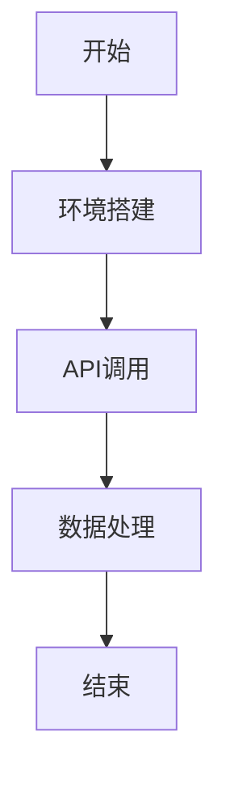

                 

# 《ChatGPT API集成：从构思到实现》

> 关键词：ChatGPT、API集成、自然语言处理、Python、软件开发、应用案例

> 摘要：本文将详细介绍ChatGPT API的集成过程，从基础概念到实际应用，帮助读者了解如何从构思到实现ChatGPT API的集成。我们将分步骤讲解，包括环境搭建、API调用、数据处理等，并通过实际案例展示如何优化和解决常见问题。

## 目录大纲

### 《ChatGPT API集成：从构思到实现》

> 关键词：ChatGPT、API集成、自然语言处理、Python、软件开发、应用案例

> 摘要：本文将详细介绍ChatGPT API的集成过程，从基础概念到实际应用，帮助读者了解如何从构思到实现ChatGPT API的集成。我们将分步骤讲解，包括环境搭建、API调用、数据处理等，并通过实际案例展示如何优化和解决常见问题。

### 第一部分：ChatGPT与API集成基础

#### 第1章：ChatGPT概述

##### 1.1.1 ChatGPT的产生背景

##### 1.1.2 ChatGPT的核心功能

##### 1.1.3 ChatGPT的优势

#### 第2章：API集成的概念与重要性

##### 2.1.1 API的定义

##### 2.1.2 API集成的必要性

##### 2.1.3 API集成的挑战

### 第二部分：ChatGPT API集成

#### 第3章：准备工作

##### 3.1.1 环境搭建

##### 3.1.2 ChatGPT API使用

##### 3.1.3 API集成工具

#### 第4章：API集成实现

##### 4.1.1 集成流程

##### 4.1.2 集成示例

##### 4.1.3 集成优化

#### 第5章：常见问题与解决方案

##### 5.1.1 API调用问题

##### 5.1.2 集成问题

##### 5.1.3 解决方案

#### 第6章：ChatGPT API应用案例

##### 6.1.1 案例介绍

##### 6.1.2 案例实现

##### 6.1.3 案例分析

#### 第7章：未来展望与趋势

##### 7.1.1 ChatGPT API的发展方向

##### 7.1.2 API集成的挑战与机遇

##### 7.1.3 未来趋势

---

### 第1章：ChatGPT概述

#### 1.1.1 ChatGPT的产生背景

ChatGPT是由OpenAI开发的一款基于GPT-3.5模型的人工智能对话系统。GPT-3.5是GPT-3模型的升级版，拥有更强大的语言生成能力和知识理解能力。ChatGPT的诞生标志着人工智能对话系统进入了一个新的时代，它能够与人类进行流畅的对话，提供有用的信息和帮助。

ChatGPT的开发团队由一批顶尖的人工智能研究者组成，他们致力于推动自然语言处理技术的发展，使计算机能够更好地理解和使用人类语言。ChatGPT的问世，是自然语言处理领域的一个重要里程碑。

#### 1.1.2 ChatGPT的核心功能

ChatGPT的核心功能是自然语言处理，它能够理解用户的语言输入，并生成相应的回复。具体来说，ChatGPT具备以下几个核心功能：

1. **语言生成能力**：ChatGPT能够根据用户的输入生成连贯、自然的语言输出，使得对话过程更加流畅。
2. **知识理解和推理能力**：ChatGPT不仅能够理解用户的输入，还能够根据输入的内容进行推理，提供更加精准的回复。
3. **多轮对话能力**：ChatGPT能够与用户进行多轮对话，不断积累对话信息，使对话过程更加深入。

#### 1.1.3 ChatGPT的优势

ChatGPT具有以下优势：

1. **强大的语言生成能力**：ChatGPT能够生成高质量、连贯的自然语言输出，使得对话过程更加自然流畅。
2. **广泛的应用场景**：ChatGPT可以应用于多种场景，如智能客服、自动问答系统、智能助手等。
3. **灵活的接口调用**：ChatGPT提供了多种接口调用方式，方便开发者进行集成和使用。

### 第2章：API集成的概念与重要性

#### 2.1.1 API的定义

API（应用程序编程接口）是一种允许应用程序与系统或其他应用程序进行交互的接口。通过API，开发者可以访问和使用其他程序的功能和服务，实现复杂的业务逻辑和功能。

API通常由一组函数或类组成，定义了应用程序之间的交互方式。API的使用使得软件开发变得更加模块化，提高了开发效率和可维护性。

#### 2.1.2 API集成的必要性

API集成的重要性体现在以下几个方面：

1. **系统模块化**：通过API集成，可以将系统拆分成多个模块，每个模块负责特定的功能，使得系统更加模块化，易于维护和扩展。
2. **提高开发效率**：API集成使得开发者可以复用现有的功能和资源，减少重复开发的工作量，提高开发效率。
3. **资源共享**：通过API集成，可以实现不同系统之间的资源共享，提高资源利用效率，降低成本。

#### 2.1.3 API集成的挑战

API集成也面临一些挑战：

1. **API兼容性**：不同API之间的兼容性问题可能会影响集成的效果，需要开发者进行细致的兼容性测试。
2. **安全性问题**：API集成涉及到数据传输和访问，需要确保数据的安全性，防止数据泄露和恶意攻击。

### 第3章：准备工作

#### 3.1.1 环境搭建

在开始集成ChatGPT API之前，我们需要搭建合适的环境。首先，我们需要安装Python环境和相关的依赖库。具体步骤如下：

1. 安装Python环境
   - 通过官方网站下载Python安装包
   - 执行安装过程，选择合适的安装选项

2. 安装依赖库
   - 使用pip命令安装所需的依赖库，如requests、numpy等

#### 3.1.2 ChatGPT API使用

接下来，我们需要了解如何使用ChatGPT API。首先，我们需要获取API的密钥，这是进行API调用的必要条件。具体步骤如下：

1. 访问OpenAI官方网站，注册并登录账户
2. 在账户设置中找到ChatGPT API密钥
3. 将密钥复制并保存到本地

然后，我们可以使用Python编写代码来调用ChatGPT API。以下是一个简单的示例：

```python
import requests

# 设置API的URL
url = "https://api.openai.com/v1/engine/davinci-codex/completions"

# 设置请求头，包括API密钥
headers = {
    "Authorization": "Bearer 你的API密钥",
    "Content-Type": "application/json",
}

# 设置请求体，包括输入文本和参数
data = {
    "prompt": "请描述一下你的工作职责",
    "temperature": 0.5,
    "max_tokens": 50,
}

# 发送请求并获取响应
response = requests.post(url, headers=headers, json=data)

# 获取回复文本
reply = response.json()["choices"][0]["text"]
print(reply)
```

#### 3.1.3 API集成工具

为了方便开发者进行ChatGPT API集成，我们可以使用一些API集成工具。这里我们推荐使用requests库，这是一个简单易用的HTTP客户端库，能够发送GET、POST等请求。此外，还有一些专门的API集成框架，如Flask、Django等，可以根据项目需求选择使用。

---

### 第4章：API集成实现

#### 4.1.1 集成流程

集成ChatGPT API的基本流程如下：

1. **准备数据**：首先需要准备好要发送给ChatGPT API的数据，包括输入文本和相关的参数。
2. **发起请求**：使用HTTP请求库（如requests）向ChatGPT API发起请求，传递数据并获得响应。
3. **处理响应**：对获得的响应进行处理，提取需要的文本信息，并将其用于后续的应用。

以下是一个简单的集成示例：

```python
import requests

def chat_with_gpt(prompt, api_key):
    url = "https://api.openai.com/v1/completions"
    headers = {
        "Authorization": f"Bearer {api_key}",
        "Content-Type": "application/json",
    }
    data = {
        "model": "text-davinci-003",
        "prompt": prompt,
        "temperature": 0.5,
        "max_tokens": 50,
    }
    response = requests.post(url, headers=headers, json=data)
    if response.status_code == 200:
        return response.json()["choices"][0]["text"]
    else:
        return "抱歉，请求失败。"

# 使用示例
api_key = "你的API密钥"
prompt = "你能帮我写一篇关于ChatGPT API集成的文章吗？"
print(chat_with_gpt(prompt, api_key))
```

#### 4.1.2 集成示例

下面我们通过一个具体的示例来展示如何使用ChatGPT API实现一个简单的聊天机器人。

1. **环境准备**：首先确保已经安装了Python和requests库。

2. **API调用**：我们使用requests库发起API请求，获取ChatGPT的回复。

3. **用户交互**：与用户进行交互，接收用户的输入并调用API获取回复。

以下是一个简单的聊天机器人实现：

```python
import requests

def chat_with_gpt(prompt, api_key):
    url = "https://api.openai.com/v1/completions"
    headers = {
        "Authorization": f"Bearer {api_key}",
        "Content-Type": "application/json",
    }
    data = {
        "model": "text-davinci-003",
        "prompt": prompt,
        "temperature": 0.5,
        "max_tokens": 50,
    }
    response = requests.post(url, headers=headers, json=data)
    if response.status_code == 200:
        return response.json()["choices"][0]["text"]
    else:
        return "抱歉，请求失败。"

def start_chat(api_key):
    print("欢迎来到ChatGPT聊天机器人！")
    while True:
        user_input = input("请输入你的问题：")
        if user_input.lower() == "退出":
            print("谢谢你的使用，再见！")
            break
        reply = chat_with_gpt(user_input, api_key)
        print("ChatGPT回复：", reply)

# 使用示例
api_key = "你的API密钥"
start_chat(api_key)
```

#### 4.1.3 集成优化

在实际应用中，为了提高ChatGPT API的集成效果，我们可以进行以下优化：

1. **异步处理**：使用异步编程技术（如asyncio）处理API请求，提高并发处理能力，减少延迟。

2. **错误处理**：对API请求进行错误处理，如超时处理、重试机制等，确保系统的稳定性和可靠性。

3. **缓存机制**：使用缓存技术（如Redis）存储API响应结果，减少重复请求，提高系统性能。

4. **参数优化**：根据实际需求调整API参数，如调整`temperature`和`max_tokens`等参数，获取更符合预期的回复。

---

### 第5章：常见问题与解决方案

#### 5.1.1 API调用问题

在集成ChatGPT API的过程中，可能会遇到一些调用问题，以下是一些常见的问题和解决方案：

1. **调用失败**：原因可能是API密钥错误、网络连接问题等。解决方案是检查API密钥是否正确，确保网络连接正常。

2. **参数错误**：如果请求体中的参数设置不正确，会导致API调用失败。解决方案是检查API文档，确保参数设置符合要求。

3. **响应格式错误**：有时API响应的格式可能不符合预期，导致无法正确解析。解决方案是检查API文档，了解响应格式，并使用正确的解析方法。

#### 5.1.2 集成问题

在集成ChatGPT API的过程中，可能会遇到一些集成问题，以下是一些常见的问题和解决方案：

1. **系统兼容性**：不同系统之间的兼容性问题可能会影响集成的效果。解决方案是进行兼容性测试，确保系统能够正常运行。

2. **调用频率限制**：某些API对调用频率有限制，超过限制可能会导致调用失败。解决方案是合理规划调用频率，避免超过限制。

3. **数据格式问题**：API调用时，数据格式不正确可能会导致集成失败。解决方案是检查数据格式，确保符合API要求。

#### 5.1.3 解决方案

针对上述常见问题，以下是一些具体的解决方案：

1. **错误处理**：在代码中添加错误处理逻辑，如超时处理、重试机制等，确保系统的稳定性和可靠性。

2. **日志记录**：记录API调用过程中的日志信息，方便问题追踪和调试。

3. **文档阅读**：仔细阅读API文档，了解API的使用方法和注意事项，避免出现不必要的错误。

---

### 第6章：ChatGPT API应用案例

#### 6.1.1 案例介绍

本案例介绍如何使用ChatGPT API构建一个自动问答系统，该系统可以回答用户提出的问题，提供有用的信息和帮助。

#### 6.1.2 案例实现

1. **环境准备**：确保已经安装了Python和requests库。

2. **API调用**：编写代码调用ChatGPT API，获取回答。

3. **用户交互**：接收用户的输入，调用API获取回答，并显示给用户。

以下是一个简单的自动问答系统实现：

```python
import requests

def chat_with_gpt(prompt, api_key):
    url = "https://api.openai.com/v1/completions"
    headers = {
        "Authorization": f"Bearer {api_key}",
        "Content-Type": "application/json",
    }
    data = {
        "model": "text-davinci-003",
        "prompt": prompt,
        "temperature": 0.5,
        "max_tokens": 50,
    }
    response = requests.post(url, headers=headers, json=data)
    if response.status_code == 200:
        return response.json()["choices"][0]["text"]
    else:
        return "抱歉，请求失败。"

def start问答系统(api_key):
    print("欢迎来到自动问答系统！")
    while True:
        user_input = input("请提出你的问题：")
        if user_input.lower() == "退出":
            print("谢谢你的使用，再见！")
            break
        reply = chat_with_gpt(user_input, api_key)
        print("回答：", reply)

# 使用示例
api_key = "你的API密钥"
start问答系统(api_key)
```

#### 6.1.3 案例分析

通过该案例，我们实现了使用ChatGPT API构建一个自动问答系统。用户可以提出问题，系统会调用ChatGPT API获取回答，并显示给用户。这个案例展示了ChatGPT API在自动问答场景中的强大能力。

为了提高系统的性能和用户体验，我们可以进行以下优化：

1. **缓存机制**：使用缓存技术存储已回答的问题和答案，减少重复调用API的次数。

2. **多轮对话**：实现多轮对话功能，使系统能够更好地理解用户的问题，提供更加精准的答案。

3. **错误处理**：增加错误处理逻辑，确保系统在遇到问题时能够优雅地处理并给出提示。

---

### 第7章：未来展望与趋势

#### 7.1.1 ChatGPT API的发展方向

随着自然语言处理技术的不断发展，ChatGPT API在未来有望实现以下发展方向：

1. **模型升级**：不断优化和升级模型，提高语言生成能力和知识理解能力，提供更高质量的回答。

2. **多模态支持**：扩展支持多种模态的数据，如图像、音频等，实现跨模态的对话生成。

3. **个性化服务**：根据用户的喜好和历史行为，提供个性化的对话体验。

#### 7.1.2 API集成的挑战与机遇

API集成在未来面临着一些挑战和机遇：

1. **安全性问题**：随着API的广泛应用，安全性问题日益突出，需要不断加强安全措施。

2. **跨平台集成**：随着移动设备和物联网的兴起，API的跨平台集成变得越来越重要。

3. **智能化**：随着人工智能技术的发展，API的智能化程度将不断提高，提供更加智能化的服务和功能。

#### 7.1.3 未来趋势

未来，ChatGPT API的发展趋势将呈现以下特点：

1. **智能化**：ChatGPT API将更加智能化，能够根据用户的需求和场景提供个性化的服务。

2. **个性化**：ChatGPT API将更好地理解用户，提供更加个性化的对话体验。

3. **多样化**：ChatGPT API的应用场景将越来越多样化，从客服到教育、医疗等各个领域都有广泛的应用。

---

## 总结

本文从ChatGPT概述、API集成基础、API集成实现、常见问题与解决方案、应用案例到未来展望，全面介绍了ChatGPT API的集成过程。通过本文的学习，读者可以了解到如何从构思到实现ChatGPT API的集成，掌握相关技术和方法。

在未来的发展中，ChatGPT API将继续发挥其强大的能力，为各个领域提供智能化的服务。同时，API集成也将面临新的挑战和机遇，需要不断探索和创新。

作者：AI天才研究院/AI Genius Institute & 禅与计算机程序设计艺术 /Zen And The Art of Computer Programming

---

### 附录

本文中使用了Mermaid流程图、类图和序列图来展示系统架构和流程。以下是一个Mermaid流程图的示例：



通过Markdown格式，我们可以在文章中插入这些图形，使得内容更加直观和易懂。

### 注意事项

1. **API密钥保护**：确保API密钥的安全，避免泄露给未经授权的人员。

2. **合理使用API**：遵循API的使用规定，避免滥用API导致服务受限。

3. **代码安全**：在编写代码时，注意防范常见的安全问题，如SQL注入、XSS攻击等。

4. **性能优化**：在实际应用中，根据需求进行性能优化，提高系统的响应速度和处理能力。

### 拓展阅读

1. **OpenAI官方文档**：深入了解ChatGPT API的使用方法和最佳实践。

2. **《自然语言处理入门》**：学习自然语言处理的基础知识，为更好地理解和应用ChatGPT API打下基础。

3. **《Python编程：从入门到实践》**：学习Python编程，掌握API调用和数据处理等技能。

通过以上拓展阅读，读者可以进一步深入了解ChatGPT API的相关知识，提高实际应用能力。希望本文对您的学习有所帮助！

