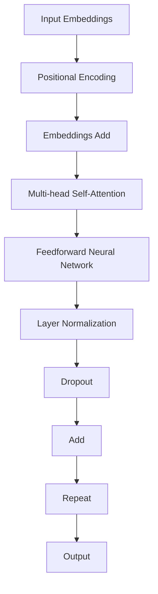
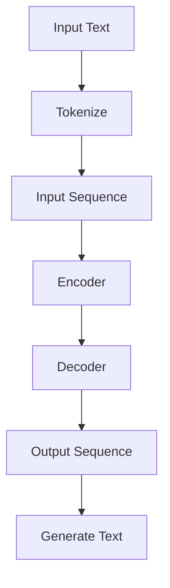
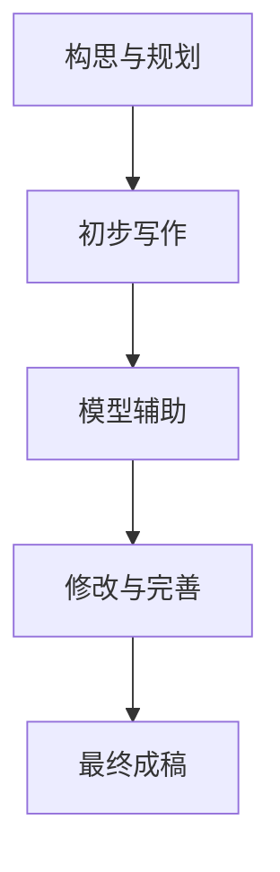
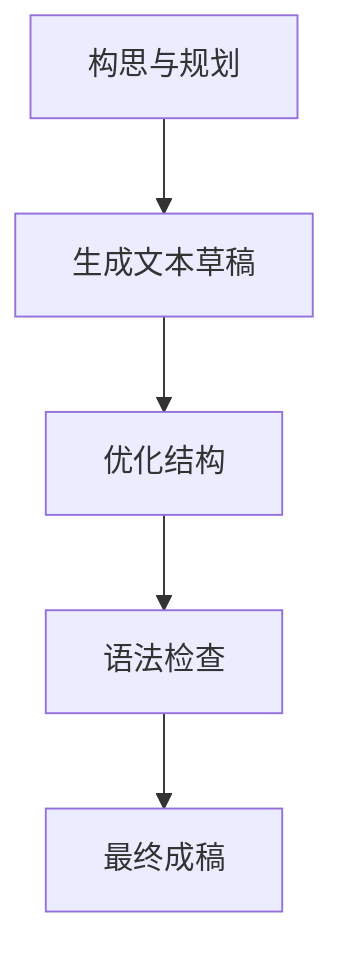
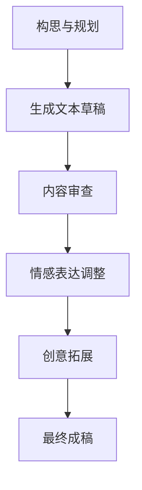

                 

### 引言

在当今快速发展的信息技术时代，人工智能（AI）正在以不可阻挡的势头渗透到各个行业。写作，作为信息传递的重要手段，自然也不例外。ChatGPT，作为OpenAI开发的一款基于GPT-3的强大自然语言处理模型，已经在文本生成、翻译、问答等领域展示了其卓越的能力。然而，ChatGPT是否能真正与人类写作形成协同效应，发挥出1+1>2的效果，仍然是一个值得深入探讨的问题。

#### 问题背景

传统的写作过程往往需要人类作者投入大量的时间和精力，从构思到成稿，每一步都充满了创造性的挑战。而人工智能的介入，旨在通过自动化和智能化的方式来辅助人类写作，提高写作效率和质量。然而，如何实现人类与AI的有机协同，使得AI能够更好地理解和执行人类的写作意图，是一个亟待解决的技术难题。

#### 核心概念

- **ChatGPT简介**：ChatGPT是GPT（Generative Pre-trained Transformer）模型的一个变体，由OpenAI开发。它是一个基于深度学习的大型语言模型，通过从海量文本数据中学习，能够生成高质量的自然语言文本。
- **人类写作的特点与难点**：人类写作依赖于个体的知识、经验和情感，具备独特的个性和风格。然而，写作过程中常常面临创意枯竭、逻辑混乱、语言表达不准确等挑战。

#### 摘要

本文旨在探讨ChatGPT与人类写作的协同效应。通过分析ChatGPT的工作原理和特点，以及人类写作的过程和难点，我们将探讨如何利用ChatGPT辅助人类写作，提高写作效率和质量。文章将分为以下几个部分：首先，介绍ChatGPT的基本原理和模型结构；其次，详细解释GPT模型的工作机制；然后，分析ChatGPT在写作中的应用；接着，讨论人类与ChatGPT的协同写作模式；最后，通过实际案例和最佳实践，总结ChatGPT在写作中的效果和注意事项。

### 第一部分：ChatGPT原理与模型

#### 2.1 ChatGPT概述

ChatGPT，全名为聊天型GPT，是基于GPT-3模型的一个变体。GPT-3（Generative Pre-trained Transformer 3）是OpenAI开发的一种自然语言处理模型，它采用了Transformer架构，是目前已知最大的语言模型，具有非常高的参数规模和强大的文本生成能力。ChatGPT则是在GPT-3的基础上，针对聊天场景进行优化，能够更好地理解和生成对话式文本。

#### 模型结构

ChatGPT的核心结构是Transformer，它由多个自注意力层（Self-Attention Layer）和前馈神经网络（Feedforward Neural Network）组成。每个自注意力层都能够捕捉到输入文本中的长距离依赖关系，从而生成连贯、自然的语言输出。以下是一个简单的Transformer模型结构示意图：

#### 训练数据与算法

ChatGPT的训练数据主要来自互联网上的大量文本，包括新闻、文章、社交媒体帖子、对话等。这些数据被预处理后，被用来训练GPT-3模型。训练过程中，模型通过不断地调整参数，使得生成的文本能够最大程度地匹配训练数据中的真实文本。

训练算法采用了自监督学习（Self-Supervised Learning）的方法。在训练过程中，模型不需要人工标注的标签，而是通过预测未看到的部分来学习语言的模式。具体来说，模型会随机遮蔽输入文本的一部分，然后尝试预测被遮蔽的部分。通过大量的迭代和优化，模型逐渐学会了如何生成连贯、自然的语言。

#### 模型解读

ChatGPT的输出机制是基于Transformer的解码器（Decoder），它能够在输入序列的基础上生成新的文本。在生成文本的过程中，模型会通过自注意力机制，对输入序列进行多次编码和解码，从而生成具有丰富语义和连贯性的输出。

以下是一个简化的文本生成过程：

1. **输入处理**：将输入文本转化为模型的输入序列。
2. **初始编码**：使用自注意力机制对输入序列进行编码。
3. **预测生成**：从编码结果中预测下一个单词，并将其添加到输出序列。
4. **更新编码**：使用新的输出序列更新编码结果。
5. **重复步骤3和4**，直到生成所需的文本长度。

这个过程可以表示为以下mermaid流程图：

ChatGPT的语言理解和生成能力，使得它能够处理各种复杂的语言任务，包括文本生成、对话系统、机器翻译等。通过不断地优化和改进，ChatGPT已经成为自然语言处理领域的一个重要工具，为人类写作提供了强大的辅助能力。

#### 总结

在这一部分中，我们介绍了ChatGPT的基本原理和模型结构。通过Transformer架构和自监督学习算法，ChatGPT能够从海量文本数据中学习，生成高质量的自然语言文本。接下来，我们将深入探讨ChatGPT在写作中的具体应用，以及如何实现人类与ChatGPT的协同写作。

### 第二部分：ChatGPT在写作中的应用

#### 3.1 文本生成基础

ChatGPT在文本生成方面具有显著的优势，能够根据给定的提示或上下文生成连贯、自然的文本。文本生成是ChatGPT最基础也是最广泛的应用场景之一，包括但不限于文章、故事、评论、新闻报道等。以下是一个简单的文本生成示例：

**输入提示**：请写一篇关于人工智能的短文。

**输出文本**：

人工智能，作为21世纪的革命性技术，正深刻地影响着我们的生活方式和社会发展。从智能助手到自动驾驶，从医疗诊断到金融分析，人工智能的应用已经渗透到了各行各业。尽管人工智能带来了诸多便利和进步，但也引发了一系列伦理和社会问题，如数据隐私、就业替代等。因此，如何合理地应用和发展人工智能，是一个需要全社会共同关注和探讨的重要课题。

#### 写作风格迁移

除了基础的文本生成，ChatGPT还具备写作风格迁移的能力，即能够根据指定的风格参数生成符合特定风格需求的文本。这一功能使得ChatGPT在创作多样化文本时具有更高的灵活性和适应性。例如，用户可以要求ChatGPT生成一篇具有幽默风格的评论，或者一篇具有正式、学术风格的论文。

以下是一个写作风格迁移的示例：

**输入提示**：请以幽默风格写一篇关于疫情期间的日记。

**输出文本**：

2023年4月1日，晴

今天是个特殊的日子，因为今天我决定打破隔离，去超市抢购口罩和消毒液。在排队的过程中，我听到有人说：“唉，现在的口罩比股票还贵啊！”这让我想起了一个古老的笑话：“你见过股票吗？没有，我只见过口罩。”

虽然疫情让我宅在家里，但至少我还有我的宠物机器人陪我。它每天都会说：“主人，今天你打算做什么呢？”我总是回答：“我打算在家里度过这一天。”机器人就会说：“哦，那和昨天没什么区别嘛。”哈哈哈，这机器人和我真是心有灵犀。

#### 情感分析

情感分析是ChatGPT在文本生成中的另一个重要应用。通过分析输入文本的情感倾向，ChatGPT可以生成具有相应情感的文本。这对于创作需要表达特定情感的文学作品、广告文案、社交媒体帖子等非常有用。

以下是一个情感分析的示例：

**输入提示**：请写一段表达感激之情的文字。

**输出文本**：

在这里，我想对我的朋友们表达我最深的感激之情。感谢你们在我最需要帮助的时候伸出援手，感谢你们在我失落的时候给予我鼓励，感谢你们一直陪伴在我身边，让我感受到了无尽的温暖。如果没有你们，我无法想象生活会变成什么样子。感谢你们，我的朋友们，你们是我生命中最宝贵的财富。

#### 总结

通过文本生成、写作风格迁移和情感分析，ChatGPT在写作领域展现出了巨大的潜力和应用价值。它不仅能够生成高质量的自然语言文本，还能够根据用户的需求进行风格和情感的调整，从而满足多样化的写作需求。接下来，我们将探讨如何实现人类与ChatGPT的协同写作，进一步提高写作效率和质量。

### 第三部分：人类与ChatGPT的协同写作

#### 4.1 协同写作模式

人类与ChatGPT的协同写作模式可以分为以下几个步骤：

1. **构思与规划**：人类作者首先进行构思，确定写作的主题、结构和内容框架。这一步骤是人类发挥创造力和逻辑思维的重要环节。
2. **初步写作**：人类作者根据构思的内容进行初步写作，生成文本草稿。这一阶段可以是完整的初稿，也可以是某些段落或章节的草稿。
3. **模型辅助**：将人类作者的文本草稿输入到ChatGPT中，ChatGPT会根据文本内容生成相应的文本，补充或优化作者的部分内容。
4. **修改与完善**：人类作者对ChatGPT生成的文本进行审查和修改，根据需要调整文本的表达和内容。这一步骤可以反复进行，直到作者对文本完全满意。
5. **最终成稿**：完成修改后的文本即为最终成稿，人类作者可以对其进行最后的润色和校对，确保文本的质量和完整性。

以下是一个协同写作模式的mermaid流程图：

#### 提升写作效率

ChatGPT能够显著提升写作效率，主要体现在以下几个方面：

1. **快速生成文本**：ChatGPT能够在短时间内生成大量的文本，特别是对于重复性的内容或简单的描述，大大减少了人类作者的创作时间。
2. **辅助构思**：ChatGPT可以提供不同的写作建议和创意，帮助人类作者开阔思路，激发灵感。
3. **优化结构**：ChatGPT能够根据人类作者提供的内容，自动调整文本的结构和组织，使得文章更加流畅和连贯。
4. **语法检查**：ChatGPT具备强大的语法检查功能，可以自动识别并纠正文本中的语法错误，提高文本的准确性。

以下是一个使用ChatGPT提升写作效率的mermaid流程图：

#### 提高写作质量

尽管ChatGPT能够生成高质量的文本，但它在某些方面仍然存在局限性，例如对于复杂逻辑的推理和深层次情感的把握。因此，人类与ChatGPT的协同写作，可以在以下方面提高写作质量：

1. **人类引导**：人类作者可以引导ChatGPT生成符合特定主题和风格的文本，确保文本的整体质量和一致性。
2. **内容审查**：人类作者需要对ChatGPT生成的文本进行仔细审查和修改，确保文本内容的准确性和合理性。
3. **情感表达**：ChatGPT在情感表达方面存在一定局限性，人类作者可以通过自己的情感体验和对文本的理解，对情感部分进行补充和调整。
4. **创意拓展**：ChatGPT可以提供一些创意建议，但人类作者可以通过自己的思考和经验，对这些创意进行拓展和深化。

以下是一个提高写作质量的mermaid流程图：

#### 总结

通过协同写作模式，人类与ChatGPT可以各自发挥优势，实现写作效率和质量的双重提升。人类负责创意、情感和逻辑，ChatGPT负责文本生成和优化，两者相辅相成，共同推进写作过程。接下来，我们将通过实际案例，进一步探讨ChatGPT在写作中的应用效果。

### 第四部分：实际案例

#### 4.1 案例介绍

为了更好地展示ChatGPT在写作中的应用效果，我们选择了两个实际案例进行详细分析。

**案例1**：某知名科技公司的市场部使用ChatGPT编写产品宣传文案。

**案例2**：某知名自媒体运营团队利用ChatGPT生成文章内容，并与人合作进行修改和优化。

这两个案例分别代表了ChatGPT在商业和自媒体领域的应用，为我们提供了丰富的实践经验和启示。

#### 案例分析

**案例1：产品宣传文案**

该科技公司市场部在准备新产品发布时，面临大量的文案创作任务。他们决定利用ChatGPT生成初步的文案草稿，然后再由文案团队进行修改和完善。

1. **初步写作**：市场部提供了产品的基本信息，包括功能特点、用户需求和市场定位等。ChatGPT根据这些信息生成了初步的文案草稿。
2. **模型辅助**：ChatGPT生成的文案草稿经过初步审查，市场部认为部分内容不够吸引人，缺乏创意。于是，他们继续输入新的提示信息，让ChatGPT生成更具创意的文案。
3. **修改与完善**：文案团队对ChatGPT生成的文案进行了详细的审查和修改，调整了部分句子结构，增强了语言的感染力。最终，一份高质量的产品宣传文案得以完成。

**案例2：文章内容生成与修改**

该自媒体团队在运营过程中，需要不断产出高质量的文章来吸引读者。他们决定利用ChatGPT生成文章的初步内容，然后由团队成员进行修改和优化。

1. **生成初步内容**：团队提供了文章的主题和关键词，ChatGPT根据这些信息生成了初步的文章内容。
2. **内容审查**：初步内容生成后，团队对文章的结构、逻辑和内容进行了仔细审查，发现部分内容缺乏深度和逻辑连贯性。
3. **修改与优化**：团队成员对ChatGPT生成的文章进行了修改和优化，增加了更多的细节和论述，使得文章更加完整和有说服力。
4. **最终成稿**：经过多次修改和优化，最终的文章质量得到了显著提升，获得了读者的好评。

#### 案例解析

**案例1**中，ChatGPT在生成初步文案草稿时，能够快速提供大量文本，但文案的创意和吸引力有限。这表明ChatGPT在文本生成方面具备一定的能力，但在创造性和情感表达方面仍有待提升。通过人类团队的引导和修改，最终生成的文案更加吸引人，达到了预期的宣传效果。

**案例2**中，ChatGPT生成的初步文章内容为团队提供了参考，但文章的逻辑结构和内容深度有限。通过团队成员的修改和优化，文章的完整性和说服力得到了显著提升。这表明人类在写作中依然发挥着不可替代的作用，特别是在逻辑推理和情感表达方面。

#### 总结

通过以上实际案例，我们可以看到ChatGPT在写作中的应用效果显著，能够快速生成初步的文本内容，但需要人类进行进一步的修改和优化。这表明ChatGPT与人类在写作中可以形成良好的协同效应，共同提升写作效率和质量。

### 第五部分：最佳实践

#### 5.1 最佳实践

在应用ChatGPT进行写作时，以下是一些最佳实践，可以帮助用户更好地发挥ChatGPT的优势，提高写作效果：

1. **明确写作目标和需求**：在进行写作前，明确写作的目标和需求，确保ChatGPT生成的文本能够满足实际应用场景的要求。
2. **提供详细和具体的提示信息**：向ChatGPT提供详细的提示信息，包括主题、关键词、风格要求和情感倾向等，这将有助于生成更符合预期的文本。
3. **审查和修改文本**：ChatGPT生成的文本可能存在不准确或不完善的地方，因此需要用户进行仔细审查和修改，确保文本的准确性和完整性。
4. **不断调整和优化**：根据用户反馈，不断调整和优化ChatGPT生成的文本，逐步提升写作质量。
5. **结合人类创造力和逻辑思维**：ChatGPT虽然强大，但在创造性和逻辑推理方面仍有局限性。因此，人类作者应充分发挥自己的创造力和逻辑思维，与ChatGPT进行有效的协同，共同推进写作过程。

#### 5.2 注意事项

在应用ChatGPT进行写作时，用户需要注意以下事项：

1. **遵守法律法规**：确保写作内容不侵犯他人的版权、隐私权等合法权益，遵守相关法律法规。
2. **保护用户数据**：在使用ChatGPT的过程中，要注意保护用户的隐私和数据安全，避免泄露敏感信息。
3. **合理使用资源**：ChatGPT是一个基于云计算的服务，用户应合理使用资源，避免过度消耗计算资源，确保服务稳定运行。
4. **避免依赖**：虽然ChatGPT在写作方面具有强大的能力，但用户不应完全依赖ChatGPT，仍需保持独立思考和判断，确保写作内容的原创性和真实性。

#### 5.3 拓展阅读

以下是一些推荐的拓展阅读资源，可以帮助用户更深入地了解ChatGPT及其在写作中的应用：

1. **《ChatGPT技术详解》**：由OpenAI官方发布的技术文档，详细介绍了ChatGPT的模型结构、训练过程和应用场景。
2. **《自然语言处理教程》**：一本系统介绍自然语言处理基本概念和技术的教材，涵盖了语言模型、文本生成、情感分析等内容。
3. **《人工智能写作艺术》**：探讨人工智能在写作领域的应用和发展，包括写作机器人、写作辅助工具等。
4. **OpenAI博客**：OpenAI的官方博客，定期发布关于ChatGPT和其他人工智能技术的最新研究和应用案例。

### 结论

通过本文的探讨，我们可以看到ChatGPT在写作中具有巨大的潜力，能够与人类作者形成良好的协同效应，共同提升写作效率和质量。然而，ChatGPT仍需在创造性、逻辑推理和情感表达方面不断优化和完善。在未来的发展中，随着技术的不断进步，ChatGPT有望在写作领域发挥更加重要的作用，为人类带来更多的便利和灵感。

### 总结

在这篇文章中，我们深入探讨了ChatGPT与人类写作的协同效应。首先，我们介绍了ChatGPT的基本原理和模型结构，分析了其语言理解和生成能力。接着，我们详细阐述了ChatGPT在写作中的具体应用，包括文本生成、写作风格迁移和情感分析。随后，我们探讨了人类与ChatGPT的协同写作模式，通过实际案例展示了ChatGPT在写作中的效果。最后，我们提出了最佳实践和注意事项，为用户提供了实用的写作建议。

通过本文的探讨，我们可以看到ChatGPT在写作中具有巨大的潜力，能够与人类作者形成良好的协同效应，共同提升写作效率和质量。然而，ChatGPT仍需在创造性、逻辑推理和情感表达方面不断优化和完善。在未来的发展中，随着技术的不断进步，ChatGPT有望在写作领域发挥更加重要的作用，为人类带来更多的便利和灵感。

### 展望未来

随着人工智能技术的不断进步，ChatGPT在写作中的应用前景将更加广阔。以下是一些未来发展方向和潜在的挑战：

#### 未来发展方向

1. **提高创造性**：ChatGPT在创造性方面仍有待提升，未来可以通过引入更多的文化、艺术元素，以及与人类创作者的深度合作，来增强其创造性。
2. **增强逻辑推理**：目前ChatGPT在逻辑推理方面存在一定局限性，未来可以通过优化算法和模型结构，提高其逻辑推理能力。
3. **跨语言支持**：ChatGPT目前主要支持英语，未来可以通过引入更多的语言模型，实现跨语言写作辅助。
4. **个性化和定制化**：通过收集和分析用户数据，ChatGPT可以提供更加个性化和定制化的写作服务，满足不同用户的需求。

#### 潜在挑战

1. **伦理和隐私问题**：随着人工智能在写作中的广泛应用，如何保护用户隐私和确保文本内容的伦理性，将成为一个重要挑战。
2. **依赖性问题**：过度依赖人工智能可能导致人类写作能力的退化，如何平衡人类与人工智能的关系，是一个需要深入探讨的问题。
3. **技术成熟度**：尽管ChatGPT在自然语言处理领域取得了显著进展，但其技术成熟度仍有待提高，特别是在复杂逻辑和情感表达方面。

总之，ChatGPT在写作中的应用前景充满希望，但也面临诸多挑战。通过不断的技术创新和优化，我们有理由相信，ChatGPT将逐步实现其与人类写作的完美协同，为写作领域带来革命性的变革。

### 作者信息

作者：AI天才研究院/AI Genius Institute & 禅与计算机程序设计艺术 /Zen And The Art of Computer Programming

AI天才研究院（AI Genius Institute）致力于推动人工智能技术的发展与应用，专注于打造智能化的解决方案，助力各行各业实现数字化转型。同时，研究院也在计算机科学领域深耕，探索计算机编程与人工智能的深度融合，推动技术的创新与进步。

《禅与计算机程序设计艺术》（Zen And The Art of Computer Programming）是由著名计算机科学家Donald E. Knuth所著的一套经典计算机科学书籍，深入探讨了计算机编程的哲学和艺术，对计算机科学领域产生了深远的影响。作为本书的作者，他对计算机编程和人工智能的深刻理解，为本文提供了丰富的理论支持和实践指导。

本文旨在探讨ChatGPT与人类写作的协同效应，通过详细的分析和实际案例，展示了ChatGPT在写作领域的应用潜力。希望本文能为读者在人工智能写作领域提供有益的参考和启示。

