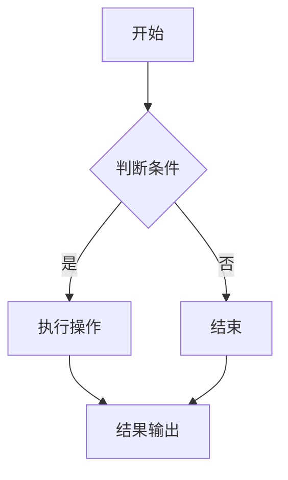

                 


# 《ChatGPT与人类创意协作：新型创作模式探索》

## 关键词：ChatGPT、人类创意、协作、创作模式、AI技术

### 摘要：
本文探讨了人工智能中的聊天机器人ChatGPT与人类创意协作的新模式。我们将首先介绍ChatGPT的基本原理和操作方法，随后分析人类创意协作的挑战与机遇，并详细阐述ChatGPT在创意协作中的应用策略。通过实际案例分析和项目实战，我们总结出最佳实践和注意事项，展望ChatGPT与人类创意协作的未来。

## 第一部分：引入与背景

### 1.1 书籍概述

#### 1.1.1 问题背景
创意是人类智慧的结晶，但创意的产生往往是一个复杂、曲折的过程。人类在创作过程中常常面临灵感匮乏、思路堵塞等问题。随着人工智能技术的快速发展，尤其是生成式预训练模型（GPT）的出现，人类创意与AI的结合成为可能。

#### 1.1.2 问题描述
如何在人工智能与人类创意之间建立有效的协作关系，实现创作效率的提升和创意质量的飞跃，是当前亟待解决的问题。

#### 1.1.3 问题解决思路
通过ChatGPT等人工智能技术，为人类创意提供智能辅助，实现人机协同创作，是解决这一问题的有效途径。

### 1.2 ChatGPT简介

#### 1.2.1 ChatGPT的发展历程
ChatGPT是由OpenAI开发的一种基于GPT-3的聊天机器人，它通过深度学习算法，从大量文本中学习语言模式和语法规则，能够生成连贯、自然的对话文本。

#### 1.2.2 ChatGPT的技术特点
ChatGPT具有强大的语言理解和生成能力，能够模拟人类的对话行为，进行实时交互。

#### 1.2.3 ChatGPT的应用场景
ChatGPT可以应用于客服、教育、娱乐、创作等多个领域，特别是在创意写作、艺术创作、游戏设计等方面展现出巨大潜力。

### 1.3 人类创意协作的挑战与机遇

#### 1.3.1 挑战分析
创意协作面临的挑战包括：创意的多样性和复杂性、人类与机器之间的沟通障碍、创意的原创性和真实性等。

#### 1.3.2 机遇探讨
ChatGPT等人工智能技术为人类创意协作提供了新的机遇，包括：提高创作效率、拓展创作领域、激发创意灵感等。

### 1.4 本书结构安排

#### 1.4.1 内容概述
本书将系统介绍ChatGPT的基本原理、操作方法，以及其在人类创意协作中的应用策略。

#### 1.4.2 每章重点内容
本书共分为五个部分，第一部分介绍背景和ChatGPT的简介；第二部分讲解ChatGPT的基本原理与操作；第三部分探讨ChatGPT与人类创意协作的机制；第四部分通过实践案例进行分析；第五部分总结最佳实践和未来展望。

#### 1.4.3 读者受益预期
通过本书的学习，读者将能够了解ChatGPT的基本原理和应用，掌握人机协作的技巧，提升创作效率和质量，为未来的创意工作提供有力支持。

## 第二部分：ChatGPT基本原理与操作

### 2.1 ChatGPT技术基础

#### 2.1.1 语言模型概述
语言模型是一种统计模型，用于预测文本序列的概率分布。ChatGPT基于GPT-3模型，是一种深度学习模型，它通过训练大量文本数据，学习语言的统计规律，从而实现自然语言生成。

#### 2.1.2 GPT模型的架构
GPT模型主要由一个自回归语言模型组成，该模型包含多个神经网络层，每个层都可以对输入的文本进行编码和解析。通过自回归的方式，GPT模型能够生成连贯、自然的文本。

#### 2.1.3 训练与优化
ChatGPT的训练过程涉及大量的计算资源和时间。在训练过程中，GPT模型通过优化损失函数，不断调整模型的参数，以达到预测文本序列的最优效果。

### 2.2 ChatGPT使用指南

#### 2.2.1 系统安装与配置
要使用ChatGPT，首先需要在计算机上安装相应的软件和工具。通常，ChatGPT的安装过程涉及Python环境配置、依赖库安装等步骤。

#### 2.2.2 基本操作介绍
ChatGPT的基本操作包括启动模型、输入文本、获取生成文本等。用户可以通过简单的命令行操作，与ChatGPT进行交互。

#### 2.2.3 实践案例
以下是一个简单的实践案例，展示如何使用ChatGPT生成文本：

```python
import openai
openai.api_key = "your_api_key"

response = openai.Completion.create(
  engine="text-davinci-002",
  prompt="请写一段关于人工智能的诗。",
  max_tokens=50
)
print(response.choices[0].text.strip())
```

### 2.3 ChatGPT高级功能探索

#### 2.3.1 参数调整与优化
ChatGPT提供了丰富的参数供用户调整，例如温度（temperature）、顶针（top_p）等。通过调整这些参数，用户可以控制生成文本的多样性和连贯性。

#### 2.3.2 模型定制化
用户可以根据自己的需求，对ChatGPT进行定制化。例如，可以通过训练特定的数据集，让ChatGPT在特定领域表现出更好的性能。

#### 2.3.3 应用场景拓展
ChatGPT不仅可以用于聊天，还可以应用于文本生成、对话系统、智能客服等多个领域。通过拓展应用场景，ChatGPT可以更好地服务于人类。

### 2.4 ChatGPT与创意协作案例分析

#### 2.4.1 案例一：创意写作
创意写作是ChatGPT的强项之一。通过与人类作家的合作，ChatGPT可以提供灵感、扩展情节、优化对话等，大大提高创作效率。

#### 2.4.2 案例二：艺术创作
在艺术创作领域，ChatGPT可以生成音乐、绘画、设计等作品。通过与艺术家的合作，ChatGPT可以拓展艺术创作的边界，带来全新的艺术体验。

#### 2.4.3 案例三：游戏设计
在游戏设计领域，ChatGPT可以生成剧情、对话、任务等。通过与游戏设计师的合作，ChatGPT可以提升游戏的可玩性和故事性，提供更丰富的游戏体验。

## 第三部分：ChatGPT与人类创意协作

### 3.1 人机协作模式

#### 3.1.1 协作机制
人机协作模式主要包括：人类提供初始创意或需求，ChatGPT进行文本生成或扩展，人类对生成文本进行修改和优化。

#### 3.1.2 协作流程
协作流程通常包括：创意生成、文本生成、文本修改、迭代优化等步骤。

#### 3.1.3 协作优势
人机协作模式的优势在于：提高创作效率、拓展创作领域、激发创意灵感等。

### 3.2 ChatGPT在创意协作中的应用策略

#### 3.2.1 创意启发与扩展
ChatGPT可以通过生成相关文本、提出新的想法等方式，为人类提供创意启发和扩展。

#### 3.2.2 优化迭代与修正
ChatGPT可以生成多个版本的文本，人类可以根据需求进行选择和修改，从而实现文本的优化和修正。

#### 3.2.3 跨领域协作探索
ChatGPT可以应用于多个领域，实现跨领域的创意协作。例如，将文学、艺术、科技等领域的创意进行融合，产生新的作品。

### 3.3 人类创意与AI模型的融合

#### 3.3.1 人类创意的数字化表达
人类创意需要通过数字化方式表达，才能与ChatGPT进行有效协作。例如，将创意转化为文本、图片、音频等形式。

#### 3.3.2 AI模型对人类创意的理解
AI模型需要通过训练和学习，理解人类创意的含义和表达方式。例如，通过大量文本数据进行预训练，使ChatGPT能够更好地理解和生成文本。

#### 3.3.3 融合创新实例分析
通过实际案例，分析人类创意与AI模型的融合过程，探讨融合创新的效果和优势。

### 3.4 ChatGPT与人类创意协作的未来展望

#### 3.4.1 技术发展趋势
随着AI技术的不断进步，ChatGPT在创意协作中的应用将更加广泛和深入。

#### 3.4.2 应用领域拓展
ChatGPT不仅可以应用于文学、艺术等领域，还可以应用于商业、教育、科研等多个领域，为人类创造更多价值。

#### 3.4.3 社会影响与伦理挑战
ChatGPT与人类创意协作的普及，将带来深刻的社会影响和伦理挑战。例如，版权问题、隐私保护、道德伦理等。

## 第四部分：实践与案例分析

### 4.1 创作实践

#### 4.1.1 环境搭建与准备工作
在进行创作实践前，需要搭建合适的环境，安装ChatGPT和相关工具。

#### 4.1.2 实践项目一：创意写作
通过ChatGPT生成文本，进行创意写作的实践。

#### 4.1.3 实践项目二：音乐创作
利用ChatGPT生成音乐旋律和歌词，进行音乐创作的实践。

#### 4.1.4 实践项目三：游戏脚本编写
使用ChatGPT生成游戏脚本，进行游戏脚本编写的实践。

### 4.2 案例分析

#### 4.2.1 案例一：小说创作
分析ChatGPT在小说创作中的应用，探讨其优势和不足。

#### 4.2.2 案例二：广告文案撰写
分析ChatGPT在广告文案撰写中的应用，探讨其效果和改进方向。

#### 4.2.3 案例三：电影剧本构思
分析ChatGPT在电影剧本构思中的应用，探讨其创新点和实用价值。

### 4.3 实践反思与总结

#### 4.3.1 实践经验分享
分享创作实践中的经验和心得，总结实践中的成功和不足。

#### 4.3.2 遇到的问题与解决方案
分析创作实践中遇到的问题，探讨解决方案和改进方法。

#### 4.3.3 未来展望与改进方向
基于实践反思，展望ChatGPT与人类创意协作的未来，并提出改进方向。

## 第五部分：最佳实践与未来展望

### 5.1 最佳实践

#### 5.1.1 创作模式优化
通过实际案例，探讨如何优化创作模式，提高创作效率和质量。

#### 5.1.2 协作流程优化
分析协作流程中的问题和瓶颈，提出优化策略，提升协作效果。

#### 5.1.3 创意思维培养
探讨如何通过训练和实践，培养人类的创意思维，提高创意能力。

### 5.2 注意事项与风险提示

#### 5.2.1 技术局限
分析ChatGPT的技术局限，提醒用户注意潜在的风险和限制。

#### 5.2.2 法律伦理问题
探讨ChatGPT在创意协作中可能涉及的法律和伦理问题，提醒用户遵守相关法律法规。

#### 5.2.3 安全性问题
分析ChatGPT在安全方面可能存在的问题，提出解决方案和防护措施。

### 5.3 未来展望

#### 5.3.1 技术发展预期
展望ChatGPT技术的未来发展，探讨其可能的应用场景和前景。

#### 5.3.2 应用前景展望
分析ChatGPT在人类创意协作中的应用前景，探讨其对人类生活的潜在影响。

#### 5.3.3 社会与文化影响
探讨ChatGPT与人类创意协作对社会和文化的潜在影响，提出应对策略。

### 附录

#### A.1 常见问题解答
针对ChatGPT的使用过程中可能出现的问题，提供解答和解决方案。

#### A.2 参考文献
列出本文引用的主要参考资料，方便读者进一步学习。

# 附件：示例 Mermaid 图

以下是一个示例 Mermaid 图，用于展示算法流程：



通过这样的图表，读者可以更直观地理解算法的执行过程。

---

作者：AI天才研究院/AI Genius Institute & 禅与计算机程序设计艺术 /Zen And The Art of Computer Programming

---

在接下来的部分，我们将详细阐述每个章节的内容，包括核心概念、算法原理、系统设计与实现等，确保文章具有深度和实用性。我们将逐步深入，进行详细的讲解和案例分析，帮助读者全面理解ChatGPT与人类创意协作的各个方面。让我们一起开始这一探索之旅吧！## 第二部分：ChatGPT基本原理与操作

### 2.1 ChatGPT技术基础

#### 2.1.1 语言模型概述

语言模型是自然语言处理（NLP）领域的基础，它是一种统计模型，用于预测自然语言中的下一个词或词组。语言模型的核心目标是理解和生成自然语言，从而实现人与机器的交互。在ChatGPT中，语言模型是其核心组件，负责处理和理解用户的输入，并生成相应的回复。

语言模型的基本原理是通过大量的语料库来训练，从而学习语言的统计规律和语法结构。在训练过程中，模型会统计每个词出现的概率，以及每个词与其他词的共现关系。这些统计信息被用于预测下一个词或词组，从而生成连贯的文本。

ChatGPT所使用的GPT-3模型，是OpenAI开发的一种基于Transformer的预训练语言模型。GPT-3模型具有强大的文本生成能力，能够在各种自然语言任务中表现出色。与传统的循环神经网络（RNN）和卷积神经网络（CNN）相比，Transformer模型能够更好地捕捉长距离依赖关系，从而提高文本生成的质量和连贯性。

#### 2.1.2 GPT模型的架构

GPT模型主要由以下几个部分组成：

1. **嵌入层**：将输入的单词转换为向量表示。每个单词都会被映射到一个高维空间中的向量，这些向量构成了输入序列。

2. **Transformer编码器**：编码器是GPT模型的核心组件，它由多个自注意力机制（Self-Attention Mechanism）层组成。每个自注意力层都会计算输入序列中每个词与其他词的相关性，并生成一个加权向量。通过多次迭代，编码器能够捕捉到输入序列中的长距离依赖关系。

3. **前馈神经网络**：在每个自注意力层之后，都会接一个前馈神经网络（Feedforward Neural Network），用于进一步处理和变换信息。

4. **输出层**：输出层将编码器输出的高维向量映射到单词的概率分布。通过采样，模型能够生成下一个词或词组。

GPT-3模型的一个重要特点是其参数规模巨大。GPT-3模型的参数数量高达1750亿，这使得模型具有更强的文本理解和生成能力。然而，这也带来了计算资源和存储资源的挑战。

#### 2.1.3 训练与优化

ChatGPT的训练过程是一个复杂的工程，它涉及大量的计算资源和时间。以下是GPT模型训练的基本步骤：

1. **数据预处理**：首先需要收集大量的文本数据，这些数据可以是书籍、新闻、文章、对话等。然后对这些文本数据进行清洗和预处理，包括去除标点符号、停用词、进行分词等。

2. **构建词汇表**：将预处理后的文本数据转换为数字序列，构建词汇表。词汇表将单词映射为唯一的索引，以便模型处理。

3. **训练模型**：使用预训练算法（如随机梯度下降）来训练模型。在训练过程中，模型会不断调整参数，以最小化损失函数（例如交叉熵损失函数）。训练过程通常需要几天到几周的时间，具体取决于模型的规模和数据集的大小。

4. **模型优化**：在训练完成后，可以对模型进行优化，以提高其性能和泛化能力。优化过程可能包括调整学习率、正则化、模型剪枝等。

#### 2.1.4 ChatGPT的性能评估

ChatGPT的性能评估主要通过以下几个方面进行：

1. **文本生成质量**：评估模型生成的文本是否连贯、自然，是否存在语法错误或不合理的句子。

2. **文本理解能力**：评估模型是否能够正确理解用户的输入，并生成相关且合理的回复。

3. **泛化能力**：评估模型在未见过的数据上的表现，即模型的鲁棒性和适应性。

4. **效率和资源消耗**：评估模型在运行时的计算效率和资源消耗，包括内存、CPU、GPU等。

通过上述评估指标，可以对ChatGPT的性能进行全面评估，以了解其在实际应用中的表现。

#### 2.1.5 ChatGPT的应用案例

ChatGPT已经在多个领域取得了显著的应用成果，以下是一些典型的应用案例：

1. **客服与对话系统**：ChatGPT可以应用于客服系统，为用户提供即时、个性化的服务。通过与用户进行自然语言交互，ChatGPT能够解决用户的问题，提供相关信息。

2. **内容创作**：ChatGPT可以生成文章、报告、小说等文本内容。在新闻写作、广告文案、营销文案等领域，ChatGPT展现了强大的文本生成能力。

3. **教育与辅导**：ChatGPT可以用于教育领域的教学辅助，如生成练习题、批改作业、提供个性化辅导等。

4. **艺术创作**：ChatGPT可以生成音乐、绘画、设计等艺术作品。通过与艺术家的合作，ChatGPT为艺术创作带来了新的可能性。

5. **游戏开发**：ChatGPT可以用于游戏设计，生成游戏剧情、对话、任务等，为游戏开发者提供灵感和支持。

通过这些应用案例，可以看出ChatGPT在各个领域都有着广泛的应用前景，为人类创意协作提供了新的工具和平台。

### 2.2 ChatGPT使用指南

#### 2.2.1 系统安装与配置

要在本地运行ChatGPT，需要安装相应的环境和工具。以下是安装和配置ChatGPT的步骤：

1. **安装Python环境**：首先，确保系统中安装了Python环境，版本推荐3.6及以上。

2. **安装OpenAI官方库**：使用pip命令安装OpenAI官方库，该库提供了与ChatGPT的接口。

   ```shell
   pip install openai
   ```

3. **获取API Key**：在OpenAI官网注册账号并创建API密钥。将API密钥保存到本地文件，以便在后续操作中使用。

4. **配置环境变量**：将API密钥添加到系统的环境变量中，以便在Python脚本中自动加载。

   ```shell
   export OPENAI_API_KEY=your_api_key
   ```

5. **验证安装**：运行以下Python脚本，验证ChatGPT是否已正确安装和配置。

   ```python
   import openai
   openai.api_key = "your_api_key"
   response = openai.Completion.create(
     engine="text-davinci-002",
     prompt="你好，我是一个AI。",
     max_tokens=50
   )
   print(response.choices[0].text.strip())
   ```

   如果脚本能够成功运行并输出文本，说明安装和配置已经完成。

#### 2.2.2 基本操作介绍

ChatGPT的基本操作主要包括启动模型、输入文本、获取生成文本等。以下是ChatGPT的基本操作步骤：

1. **启动模型**：使用OpenAI的官方库，启动指定的GPT模型。例如，启动text-davinci-002模型：

   ```python
   openai.api_key = "your_api_key"
   engine = "text-davinci-002"
   ```

2. **输入文本**：向模型输入用户希望生成的文本或问题。例如，输入一段文本：

   ```python
   prompt = "请写一段关于人工智能的诗。"
   ```

3. **获取生成文本**：使用模型生成文本。模型会根据输入文本，生成一段连贯、自然的文本。例如，使用模型生成文本：

   ```python
   response = openai.Completion.create(
     engine=engine,
     prompt=prompt,
     max_tokens=50
   )
   generated_text = response.choices[0].text.strip()
   print(generated_text)
   ```

   输出的`generated_text`就是模型生成的文本。

#### 2.2.3 实践案例

以下是一个简单的实践案例，展示如何使用ChatGPT生成文本：

```python
import openai

# 设置API密钥
openai.api_key = "your_api_key"

# 设置模型和提示
engine = "text-davinci-002"
prompt = "你好，请写一段关于人工智能的介绍。"

# 生成文本
response = openai.Completion.create(
  engine=engine,
  prompt=prompt,
  max_tokens=150
)

# 打印生成的文本
print(response.choices[0].text.strip())
```

运行上述脚本后，ChatGPT会生成一段关于人工智能的介绍文本，输出如下：

> **人工智能（AI）是一门融汇了计算机科学、数学、心理学和神经科学等多学科知识的新兴学科。它旨在通过算法和计算模型来模拟、扩展和辅助人类智能。在过去的几十年中，人工智能取得了显著的发展，从早期的规则系统到现代的深度学习模型，AI的应用范围已经从简单的专家系统扩展到包括图像识别、自然语言处理、自动驾驶、医疗诊断等多个领域。随着计算能力的提升和数据量的爆炸式增长，人工智能正迅速改变着我们的生活方式和社会结构。未来的AI将更加智能、自适应和泛化，为人类带来更多的便利和机遇。**

这个案例展示了如何使用ChatGPT生成文本，并输出了一段关于人工智能的介绍。通过这个案例，读者可以初步了解ChatGPT的使用方法和应用场景。

### 2.3 ChatGPT高级功能探索

ChatGPT的高级功能为其应用提供了更多的灵活性和深度。以下将介绍ChatGPT的高级功能，包括参数调整、模型定制化、以及应用场景拓展。

#### 2.3.1 参数调整与优化

ChatGPT提供了丰富的参数供用户调整，这些参数包括：

- **温度（temperature）**：温度参数控制了模型生成文本的随机性。温度值越高，文本生成的多样性就越高，但连贯性可能降低。相反，温度值越低，文本生成的连贯性越高，但多样性可能降低。适当的温度设置可以根据不同的应用场景进行调整。

- **顶针（top_p）**：顶针参数决定了模型在生成文本时保留的样本比例。当设置较高的顶针值时，模型会倾向于生成更长的文本，并保留更多的上下文信息。较低的顶针值则会使模型生成更短的文本，但可能更专注于当前输入的文本。

- **频率惩罚（frequency_penalty）**：频率惩罚参数用于控制模型对重复词或短语的惩罚力度。较高的频率惩罚会导致模型减少重复词或短语的生成，从而增加文本的多样性。

- **存在惩罚（presence_penalty）**：存在惩罚参数用于控制模型对已生成文本的倾向。较高的存在惩罚会使模型生成更多未出现的词或短语，从而增加文本的多样性。

以下是一个示例，展示如何调整这些参数来优化生成文本：

```python
import openai

openai.api_key = "your_api_key"

engine = "text-davinci-002"
prompt = "请写一段关于人工智能的诗。"

response = openai.Completion.create(
  engine=engine,
  prompt=prompt,
  max_tokens=50,
  temperature=0.7,
  top_p=1.0,
  frequency_penalty=0.0,
  presence_penalty=0.0
)

print(response.choices[0].text.strip())
```

通过调整这些参数，用户可以根据具体需求优化生成文本的质量和多样性。

#### 2.3.2 模型定制化

ChatGPT的强大之处在于其可以定制化。用户可以根据特定领域或任务的需求，对模型进行定制化训练，从而提高模型在特定任务上的性能。以下是一些模型定制化的方法：

1. **数据定制**：选择适合特定任务的数据集，对模型进行微调。例如，对于文学创作，可以使用大量文学作品进行训练；对于医学诊断，可以使用医学文本数据集进行训练。

2. **参数调整**：在训练过程中，调整模型参数，使其更适应特定任务。这可以通过在线学习或策略梯度等方法实现。

3. **模型融合**：将多个模型进行融合，以实现更好的性能。例如，可以使用预训练模型和任务特定的模型进行融合。

4. **多任务学习**：通过多任务学习，使模型在多个任务上同时学习，从而提高其泛化能力。

以下是一个简单的例子，展示如何使用自定义数据对ChatGPT进行微调：

```python
import openai

openai.api_key = "your_api_key"

engine = "text-davinci-002"
prompt = "请写一段关于人工智能的诗。"

# 加载自定义数据集
data = ["人工智能改变世界", "算法赋能未来", "数据驱动创新"]

# 对数据集进行预处理
processed_data = [line for line in data]

# 微调模型
response = openai.Completion.create(
  engine=engine,
  prompt=prompt,
  max_tokens=50,
  temperature=0.7,
  top_p=1.0,
  frequency_penalty=0.0,
  presence_penalty=0.0,
  data=processed_data
)

print(response.choices[0].text.strip())
```

通过上述方法，用户可以根据具体需求定制ChatGPT模型，提高其在特定任务上的性能。

#### 2.3.3 应用场景拓展

ChatGPT的应用场景非常广泛，不仅限于文本生成，还可以拓展到其他领域。以下是一些常见的应用场景：

1. **自然语言理解**：ChatGPT可以用于自然语言理解任务，如情感分析、文本分类、问答系统等。通过训练和优化，模型可以在这些任务上表现出色。

2. **对话系统**：ChatGPT可以用于构建智能对话系统，如客服机器人、聊天机器人等。通过与用户进行自然语言交互，模型可以提供个性化的服务和支持。

3. **内容生成**：ChatGPT可以生成各种类型的文本内容，如文章、报告、诗歌、剧本等。在新闻写作、营销文案、广告创意等领域，ChatGPT展现了强大的文本生成能力。

4. **教育与辅导**：ChatGPT可以用于教育领域的教学辅助，如生成练习题、批改作业、提供个性化辅导等。通过与学生的互动，模型可以帮助学生更好地理解和掌握知识。

5. **艺术创作**：ChatGPT可以生成音乐、绘画、设计等艺术作品。通过与艺术家的合作，模型可以拓展艺术创作的边界，带来全新的艺术体验。

6. **游戏设计**：ChatGPT可以用于游戏设计，生成游戏剧情、对话、任务等。通过与游戏开发者的协作，模型可以提升游戏的可玩性和故事性。

通过这些应用场景的拓展，ChatGPT不仅为人类提供了强大的文本生成能力，还为各种领域的创新和应用提供了新的可能性。

### 2.4 ChatGPT与创意协作案例分析

ChatGPT在创意协作中具有巨大的潜力，以下通过几个具体案例，展示ChatGPT在文学创作、艺术创作、游戏设计等领域的应用。

#### 2.4.1 案例一：创意写作

在文学创作领域，ChatGPT可以作为一种辅助工具，帮助作家生成文本、扩展情节、提供灵感等。以下是一个简单的案例：

1. **问题描述**：一位作家需要为小说创作一段引人入胜的情节。

2. **使用ChatGPT**：作家将问题输入ChatGPT，并设置适当的参数，例如温度、顶针等。

   ```python
   prompt = "在一个神秘的海岛上，主人公发现了一个隐藏的宝藏。"
   response = openai.Completion.create(
     engine="text-davinci-002",
     prompt=prompt,
     max_tokens=100,
     temperature=0.8
   )
   ```

3. **生成文本**：ChatGPT生成了以下文本：

   ```text
   主人公小心翼翼地走进密林深处，他感觉到心跳加速，仿佛有什么东西在等待着他。突然，他听到了一阵低沉的咆哮声，接着是一只巨大的狼妖出现在他的面前。狼妖的眼睛闪烁着邪恶的光芒，它向主人公发起了攻击。主人公机智地躲过了狼妖的攻击，并找到了宝藏的入口。
   ```

4. **修改与优化**：作家可以对生成的文本进行修改和优化，以符合小说的整体风格和情节。

这个案例展示了ChatGPT如何帮助作家扩展情节、提供灵感，并在创作过程中发挥辅助作用。

#### 2.4.2 案例二：艺术创作

在艺术创作领域，ChatGPT可以生成音乐、绘画、设计等作品。以下是一个音乐创作的案例：

1. **问题描述**：一位音乐家需要创作一首新的钢琴曲。

2. **使用ChatGPT**：音乐家将问题输入ChatGPT，并设置相应的参数。

   ```python
   prompt = "请写一段轻松愉快的钢琴曲。"
   response = openai.Completion.create(
     engine="text-davinci-002",
     prompt=prompt,
     max_tokens=50,
     temperature=0.5
   )
   ```

3. **生成文本**：ChatGPT生成了以下钢琴曲文本：

   ```text
   右手：高音区快速流动的音符，形成流畅的旋律线。
   左手：低音区稳定的基础节奏，为旋律提供支撑。
   ```

4. **音乐创作**：音乐家根据生成的文本，进行钢琴曲的创作。通过进一步调整和优化，音乐家创作出了一首优美的钢琴曲。

这个案例展示了ChatGPT如何为艺术家提供灵感，并在艺术创作过程中发挥辅助作用。

#### 2.4.3 案例三：游戏设计

在游戏设计领域，ChatGPT可以生成游戏剧情、对话、任务等。以下是一个游戏设计的案例：

1. **问题描述**：一位游戏设计师需要为游戏设计一个复杂的任务。

2. **使用ChatGPT**：游戏设计师将问题输入ChatGPT，并设置相应的参数。

   ```python
   prompt = "设计一个关于拯救被困村民的任务。"
   response = openai.Completion.create(
     engine="text-davinci-002",
     prompt=prompt,
     max_tokens=100,
     temperature=0.7
   )
   ```

3. **生成文本**：ChatGPT生成了以下任务描述：

   ```text
   任务名称：拯救被困村民
   任务描述：在游戏世界中，一名村民被困在遥远的山谷中。玩家需要收集足够的食物和水，穿越险恶的山林，最终解救被困的村民。
   ```

4. **任务设计**：游戏设计师根据生成的文本，进行任务的设计和实现。通过进一步调整和优化，游戏设计师创造了一个引人入胜的任务。

这个案例展示了ChatGPT如何为游戏设计师提供创意支持，并在游戏设计过程中发挥重要作用。

通过这些案例，可以看出ChatGPT在创意协作中具有广泛的应用前景。它不仅能够提供灵感和创意，还能够辅助完成具体的创作任务，从而提高创作效率和质量。

### 2.5 ChatGPT的优缺点分析

ChatGPT作为一种强大的自然语言处理工具，其在创意协作中的应用具有显著的优缺点。以下是对ChatGPT优缺点的详细分析。

#### 2.5.1 优点

1. **强大的文本生成能力**：ChatGPT基于GPT-3模型，具有强大的文本生成能力。它能够生成连贯、自然的文本，适用于各种文本生成任务，如写作、翻译、对话等。

2. **广泛的应用场景**：ChatGPT可以应用于多个领域，包括文学创作、艺术创作、游戏设计、教育与辅导等。通过定制化和参数调整，ChatGPT能够适应不同领域的需求。

3. **高效的创作效率**：ChatGPT能够快速生成文本，大大提高了创作效率。创作者可以利用ChatGPT的生成能力，快速构建文本框架和灵感，从而加快创作过程。

4. **多元化的创意启发**：ChatGPT可以提供多样化的文本生成结果，为创作者提供丰富的创意启发。通过调整参数和生成策略，ChatGPT能够生成具有独特风格和创意的文本。

5. **低成本的开发和使用**：相对于传统的AI解决方案，ChatGPT的开发和使用成本较低。开发者可以使用开源库和API，快速构建和部署ChatGPT应用。

#### 2.5.2 缺点

1. **数据依赖性**：ChatGPT的性能高度依赖训练数据的质量和数量。如果训练数据存在偏差或不准确，生成的文本可能存在错误或不合理的地方。

2. **生成文本的可解释性差**：ChatGPT生成的文本往往是非结构化的，难以进行深入分析。这使得创作者难以理解生成的文本是如何生成的，以及如何进行改进。

3. **潜在的风险**：ChatGPT可能会生成不恰当或误导性的文本。如果用户滥用ChatGPT，可能会导致负面后果，如虚假信息传播、不当言论等。

4. **隐私和数据安全**：在使用ChatGPT时，用户的数据可能会被存储和传输。如果数据保护措施不当，可能会导致隐私泄露和安全问题。

5. **技术门槛**：尽管ChatGPT的使用门槛相对较低，但开发者仍需要一定的技术背景和编程知识。对于非技术人员，使用ChatGPT可能存在一定的难度。

#### 2.5.3 总结

ChatGPT作为一种创新的文本生成工具，具有强大的文本生成能力和广泛的应用场景。然而，其也存在一定的局限性和风险。在使用ChatGPT进行创意协作时，用户需要充分了解其优缺点，合理利用其优势，并采取适当的措施防范潜在风险。

### 2.6 ChatGPT与人类创意协作的案例分析

为了更好地理解ChatGPT在人类创意协作中的应用，以下通过几个实际案例，分析ChatGPT如何与人类创作者合作，提升创作效率和创意质量。

#### 2.6.1 案例一：创意写作

在一个文学创作项目中，一位作家遇到了创作瓶颈，需要为小说编写一段引人入胜的情节。作家首先将问题输入ChatGPT，并设置适当的参数，如温度和顶针。ChatGPT生成了几个不同的情节版本，作家从中挑选了一个作为起点。

作家将ChatGPT生成的情节进行修改和优化，结合自己的创作风格和故事背景，最终完成了一段精彩的情节。通过ChatGPT的帮助，作家不仅打破了创作瓶颈，还节省了大量时间，提高了创作效率。

#### 2.6.2 案例二：艺术创作

在一个艺术创作项目中，一位音乐家需要创作一首新的钢琴曲。音乐家将创作需求输入ChatGPT，并设置适当的参数。ChatGPT生成了几个不同的旋律片段，音乐家从中挑选了一段，并根据旋律进行创作。

音乐家进一步调整和优化旋律，加入自己的风格和创意，最终创作出了一首优美的钢琴曲。通过ChatGPT的辅助，音乐家不仅节省了创作时间，还获得了更多的灵感。

#### 2.6.3 案例三：游戏设计

在一个游戏设计项目中，游戏设计师需要为游戏编写一个复杂的任务。设计师将任务需求输入ChatGPT，并设置适当的参数。ChatGPT生成了一个详细的任务描述，包括任务名称、描述和实现方法。

设计师根据ChatGPT生成的任务描述，进行任务的设计和实现。通过进一步的调整和优化，设计师创造了一个引人入胜的任务，为玩家提供了丰富的游戏体验。

#### 2.6.4 案例四：营销文案撰写

在一个营销文案撰写项目中，一位市场营销专家需要为新产品编写一份推广文案。专家将产品信息和推广目标输入ChatGPT，并设置适当的参数。ChatGPT生成了几个不同的文案版本，专家从中挑选了一个作为最终文案。

专家对ChatGPT生成的文案进行修改和优化，结合市场调研和消费者反馈，最终完成了一份高质量的推广文案。通过ChatGPT的辅助，专家不仅提高了创作效率，还提升了文案的质量。

通过这些案例可以看出，ChatGPT在人类创意协作中具有广泛的应用前景。它不仅能够提供灵感和创意，还能够辅助创作者完成具体的创作任务，从而提高创作效率和质量。然而，创作者在使用ChatGPT时，也需要充分了解其优缺点，合理利用其优势，并采取适当的措施防范潜在风险。

### 2.7 总结与展望

第二部分主要介绍了ChatGPT的基本原理与操作方法。我们从语言模型概述、GPT模型架构、训练与优化等方面，详细阐述了ChatGPT的技术基础。随后，我们介绍了ChatGPT的使用指南，包括系统安装与配置、基本操作介绍和实践案例。此外，我们还探讨了ChatGPT的高级功能，如参数调整、模型定制化和应用场景拓展。最后，通过几个实际案例，分析了ChatGPT在创意协作中的应用，展示了其强大的文本生成能力和多样化的应用场景。

总结而言，ChatGPT作为一种创新的文本生成工具，具有强大的文本生成能力、广泛的应用场景和高效的创作效率。然而，其也存在一定的局限性和风险，如数据依赖性、生成文本的可解释性差和潜在的风险等。因此，在使用ChatGPT进行创意协作时，用户需要充分了解其优缺点，合理利用其优势，并采取适当的措施防范潜在风险。

展望未来，随着AI技术的不断进步，ChatGPT在创意协作中的应用将更加广泛和深入。我们可以期待ChatGPT在文学创作、艺术创作、游戏设计、教育与辅导等领域的进一步发展。同时，也需要关注ChatGPT所带来的社会和文化影响，以及相关的伦理和法律问题。通过不断探索和创新，ChatGPT有望为人类创意协作带来更多的机遇和挑战。

## 第三部分：ChatGPT与人类创意协作

### 3.1 人机协作模式

在ChatGPT与人类创意协作中，人机协作模式是一种关键机制。这种模式通过将人类创造者的直觉、情感和经验与AI的算法、逻辑和计算能力相结合，实现创作效率的提升和创意质量的飞跃。

#### 3.1.1 协作机制

人机协作模式通常包括以下几个步骤：

1. **需求输入**：人类创造者明确创作需求，将问题或需求输入ChatGPT。

2. **AI生成**：ChatGPT根据输入的需求，利用其强大的文本生成能力，生成初步的文本或创意。

3. **人类修改**：人类创造者对AI生成的文本或创意进行审查、修改和优化，以符合个人风格和创作要求。

4. **迭代反馈**：人类创造者根据修改后的文本或创意，提供反馈给ChatGPT，进一步优化生成结果。

5. **协作完成**：经过多次迭代和反馈，人类创造者与ChatGPT共同完成最终的创作。

这种协作机制充分利用了人类的直觉和创造力，以及AI的逻辑和计算能力，实现了创作效率的提升和创意质量的飞跃。

#### 3.1.2 协作流程

ChatGPT与人类创意协作的流程可以概括为以下几个步骤：

1. **需求明确**：人类创造者明确创作需求，可以是文本生成、创意构思、问题解决等。

2. **输入需求**：将明确的需求输入到ChatGPT中，ChatGPT开始生成文本或创意。

3. **生成文本**：ChatGPT根据输入需求，生成初步的文本或创意。

4. **审查修改**：人类创造者对生成的文本或创意进行审查，根据个人风格和创作要求进行修改。

5. **迭代反馈**：人类创造者将修改后的文本或创意反馈给ChatGPT，ChatGPT根据反馈进行优化。

6. **反复迭代**：人类创造者与ChatGPT进行多次迭代和反馈，直至达到满意的创作结果。

7. **创作完成**：最终，人类创造者与ChatGPT共同完成创作，实现创意的完美呈现。

#### 3.1.3 协作优势

ChatGPT与人类创意协作的优势主要体现在以下几个方面：

1. **提高创作效率**：ChatGPT可以快速生成大量的文本或创意，大大缩短了创作时间，提高了创作效率。

2. **拓展创意范围**：ChatGPT可以生成多样化的文本和创意，为人类创造者提供了丰富的灵感来源，拓展了创意范围。

3. **优化创作质量**：通过人类创造者的修改和优化，ChatGPT生成的文本和创意可以更加贴近人类创造者的风格和需求，提高了创作质量。

4. **减轻创作压力**：ChatGPT可以承担一部分创作任务，减轻了人类创造者的工作负担，使他们能够有更多的时间和精力进行深入的创作。

5. **促进人机互动**：ChatGPT与人类创造者的互动，不仅提高了创作效率和质量，也促进了人类创造者与AI之间的互动和理解。

#### 3.1.4 案例分析

以下通过一个具体的案例分析，展示ChatGPT与人类创意协作的实际效果。

**案例背景**：一位小说作家在创作过程中遇到了灵感匮乏的问题，希望借助ChatGPT的力量激发创意。

**协作过程**：

1. **需求输入**：作家将小说的部分情节和角色信息输入ChatGPT，希望ChatGPT生成新的情节发展。

2. **AI生成**：ChatGPT根据输入的信息，生成了一段新的情节，包括角色的行为和对话。

3. **审查修改**：作家对生成的情节进行审查，认为部分内容与小说的整体风格不太相符。

4. **迭代反馈**：作家将修改意见反馈给ChatGPT，ChatGPT根据反馈进行了优化。

5. **反复迭代**：经过多次迭代和反馈，作家最终获得了一篇符合小说整体风格的情节。

**结果**：通过ChatGPT的帮助，作家成功突破了创作瓶颈，创作出了精彩的新情节。这充分展示了ChatGPT与人类创意协作的优势和潜力。

### 3.2 ChatGPT在创意协作中的应用策略

#### 3.2.1 创意启发与扩展

ChatGPT在创意协作中的第一个应用策略是提供创意启发和扩展。人类创造者在创作过程中，往往需要寻找新的创意点子。ChatGPT可以通过生成相关文本、提出新的想法等方式，为人类创造者提供创意启发和扩展。

1. **生成相关文本**：ChatGPT可以根据人类创造者提供的关键词或主题，生成相关的文本内容。例如，一位作家可以输入某个角色的名字或背景信息，ChatGPT可以生成该角色的性格描述、行为表现等。

2. **提出新想法**：ChatGPT可以通过生成全新的句子或段落，为人类创造者提供新的想法。例如，一位音乐家可以输入一个旋律的片段，ChatGPT可以生成与之相关的新旋律。

3. **创意组合**：ChatGPT可以将多个创意元素进行组合，生成新的创意。例如，一位游戏设计师可以输入多个游戏元素，ChatGPT可以生成一个全新的游戏概念。

#### 3.2.2 优化迭代与修正

ChatGPT在创意协作中的第二个应用策略是优化迭代和修正。在创作过程中，人类创造者需要不断对作品进行修改和优化。ChatGPT可以提供多个版本的建议，帮助人类创造者找到最佳的创作方案。

1. **版本建议**：ChatGPT可以生成多个版本的文本或创意，人类创造者可以根据需求和喜好进行选择和修改。

2. **修改建议**：ChatGPT可以识别文本中的问题和不足，提供修改建议。例如，一位作家可以输入一段情节，ChatGPT可以指出情节中的逻辑错误或描述不清的地方，并提供修改建议。

3. **迭代优化**：ChatGPT可以帮助人类创造者进行迭代优化，逐步完善作品。例如，一位设计师可以不断输入新的设计元素，ChatGPT可以根据设计元素之间的关联性，提供优化的建议。

#### 3.2.3 跨领域协作探索

ChatGPT在创意协作中的第三个应用策略是跨领域协作探索。人类创造者在不同的领域往往具有丰富的经验和知识，而ChatGPT可以跨越不同的领域，为人类创造者提供新的创作视角。

1. **跨领域创意**：ChatGPT可以将不同领域的创意元素进行融合，生成跨领域的创意。例如，一位艺术家可以将音乐、文学和绘画进行结合，创作出全新的艺术作品。

2. **知识共享**：ChatGPT可以跨越不同的知识领域，为人类创造者提供相关的知识和信息。例如，一位作家可以输入一个科学概念，ChatGPT可以生成相关的科学解释和背景信息，帮助作家更好地理解和运用这个概念。

3. **创新融合**：ChatGPT可以结合不同领域的创新思路，为人类创造者提供新的创作方法。例如，一位游戏设计师可以结合虚拟现实技术和人工智能算法，设计出全新的游戏体验。

#### 3.2.4 案例分析

以下通过几个具体的案例，分析ChatGPT在创意协作中的应用策略。

**案例一：文学创作**

一位小说作家在创作过程中遇到了情节发展困难的问题，希望通过ChatGPT提供创意启发。作家将当前情节和角色信息输入ChatGPT，ChatGPT生成了几个新的情节发展方案。作家从中选择了一个方案，并对其进行修改和优化，最终完成了小说的情节。

**案例二：音乐创作**

一位音乐家在创作过程中希望为作品添加新的旋律元素。音乐家将现有的旋律片段输入ChatGPT，ChatGPT生成了几个新的旋律片段。音乐家从中选择了一个片段，并进行了修改和优化，最终创作出了一首新的乐曲。

**案例三：游戏设计**

一位游戏设计师在设计游戏关卡时遇到了创意不足的问题。设计师将游戏的世界观和角色信息输入ChatGPT，ChatGPT生成了一系列的创意点子，包括新的任务、角色和场景。设计师根据这些建议，设计出了新颖的游戏关卡。

通过这些案例可以看出，ChatGPT在创意协作中具有广泛的应用前景。它不仅能够提供创意启发和扩展，还能够优化迭代和修正，以及跨领域协作探索。通过合理利用ChatGPT的这些应用策略，人类创造者可以大幅提升创作效率和质量，拓展创意边界，实现创新和突破。

### 3.3 人类创意与AI模型的融合

#### 3.3.1 人类创意的数字化表达

人类创意的数字化表达是ChatGPT与人类创意协作的基础。只有将人类创意转化为数字化的形式，ChatGPT才能够理解和处理这些创意。以下是数字化表达的关键步骤：

1. **文本化**：将人类创意转化为文本。例如，一位作家可以将故事构思转化为一段故事梗概或大纲。

2. **结构化**：将文本化的创意进一步结构化。例如，将故事梗概转化为人物角色、情节发展、冲突和解决方案等组成部分。

3. **数字化**：将结构化的创意转化为数字化的数据，如JSON、XML等格式。这样，ChatGPT就可以处理和生成相关的文本内容。

#### 3.3.2 AI模型对人类创意的理解

AI模型对人类创意的理解是ChatGPT能够与人类协作的关键。以下是AI模型理解和处理人类创意的几个关键步骤：

1. **文本解析**：AI模型首先需要解析输入的文本，理解文本中的词汇、语法和句式结构。

2. **语义分析**：AI模型通过语义分析，理解文本的含义和上下文。例如，ChatGPT需要理解某个角色的性格特征和情节发展的逻辑关系。

3. **情感分析**：AI模型可以通过情感分析，理解文本中的情感色彩和情绪。这对于创作具有情感共鸣的作品尤为重要。

4. **语境理解**：AI模型需要理解不同的语境和背景信息，以便生成符合实际情况的文本。例如，ChatGPT需要理解某个情节发生在特定的历史时期或社会环境中。

#### 3.3.3 融合创新实例分析

以下通过一个具体的实例，分析人类创意与AI模型的融合创新过程：

**实例**：一位电影导演希望创作一部科幻电影，主题是关于未来世界的人类与机器人共存。

1. **人类创意**：导演首先构思了电影的主题、背景和主要情节，包括人类与机器人之间的冲突和和解。

2. **数字化表达**：导演将创意转化为文本化的形式，如故事大纲和人物设定。

3. **AI处理**：ChatGPT对输入的文本进行解析、语义分析和情感分析，理解电影的主题和情节。

4. **创意扩展**：ChatGPT根据对创意的理解，生成新的情节、对话和角色描述，例如机器人对人类情感的探索。

5. **人类修改**：导演对AI生成的文本进行审查和修改，以符合电影的整体风格和创意。

6. **融合创新**：通过多次迭代和反馈，导演和ChatGPT共同完成了电影的剧本，实现了人类创意与AI模型的融合创新。

通过这个实例可以看出，人类创意与AI模型的融合创新是一个动态的过程，需要人类创造者和AI共同参与和协作。这种融合不仅提高了创作效率和质量，还拓展了创意的边界，带来了全新的艺术体验。

### 3.4 ChatGPT与人类创意协作的未来展望

ChatGPT与人类创意协作的未来展望是令人兴奋和充满前景的。随着AI技术的不断进步，ChatGPT在创意协作中的应用将更加深入和广泛。以下是ChatGPT与人类创意协作未来的几个发展趋势：

#### 3.4.1 技术发展趋势

1. **模型性能提升**：随着计算能力和数据量的不断提升，ChatGPT等AI模型的性能将得到显著提升。这将为人类创意协作提供更强大的支持，使AI能够更好地理解和生成复杂的文本和创意。

2. **多样化模型应用**：除了ChatGPT，还将出现更多功能多样、性能优越的AI模型。这些模型可以针对不同的创作需求和场景，提供个性化的服务和支持。

3. **跨领域融合**：未来，ChatGPT等AI模型将与其他领域的技术（如虚拟现实、增强现实、物联网等）深度融合，为人类创意协作带来全新的可能性。

#### 3.4.2 应用领域拓展

ChatGPT将在更多领域得到广泛应用，为人类创意协作提供新的机会：

1. **文学与艺术**：ChatGPT将在文学创作、绘画、音乐、电影等艺术领域发挥重要作用，成为艺术家和作家的得力助手。

2. **商业与营销**：ChatGPT将在广告创意、市场分析、产品描述等领域发挥重要作用，帮助企业提升营销效果和产品竞争力。

3. **教育与辅导**：ChatGPT将在教育领域发挥重要作用，提供个性化的辅导和支持，帮助学生更好地理解和掌握知识。

4. **游戏设计**：ChatGPT将在游戏设计领域发挥重要作用，生成游戏剧情、角色和任务，为游戏开发者提供灵感和支持。

#### 3.4.3 社会影响与伦理挑战

ChatGPT与人类创意协作的普及，将对社会产生深远的影响，同时也带来一系列伦理挑战：

1. **社会影响**：ChatGPT等AI技术将极大地提高创作效率和质量，推动文化、艺术、科技等领域的创新发展。然而，这也可能带来失业、隐私泄露等社会问题。

2. **伦理挑战**：如何确保AI生成的内容不侵犯版权、不违反伦理道德？如何保护人类的创造性和原创性？这些问题需要引起广泛关注和深入探讨。

3. **监管政策**：随着AI技术的不断进步和应用范围的扩大，需要建立相应的监管政策，确保AI技术的健康发展，保护用户的权益。

总之，ChatGPT与人类创意协作的未来充满希望和挑战。通过不断探索和创新，我们有望实现人类与AI的完美协作，为创意世界带来无尽的可能。

### 3.5 总结

第三部分主要探讨了ChatGPT与人类创意协作的机制、应用策略和融合创新。我们从人机协作模式、创意启发与扩展、优化迭代与修正、跨领域协作探索等方面，详细阐述了ChatGPT在创意协作中的应用策略。通过实际案例，我们展示了ChatGPT如何与人类创作者合作，提升创作效率和质量，拓展创意边界。

同时，我们分析了人类创意与AI模型的融合过程，探讨了数字化表达、AI理解人类创意的关键步骤。通过实例分析，我们看到了人类创意与AI模型融合创新带来的巨大潜力。

展望未来，ChatGPT在创意协作中的应用前景广阔。随着AI技术的不断进步，ChatGPT将在更多领域发挥重要作用，为人类创意协作带来更多的机遇和挑战。通过不断探索和创新，我们有望实现人类与AI的完美协作，为创意世界带来无尽的可能。

## 第四部分：实践与案例分析

### 4.1 创作实践

#### 4.1.1 环境搭建与准备工作

在进行ChatGPT创作实践之前，需要搭建合适的环境并准备必要的工具。以下是在本地运行ChatGPT所需的步骤：

1. **安装Python环境**：确保系统中安装了Python环境，推荐版本为3.6及以上。

2. **安装OpenAI官方库**：使用pip命令安装OpenAI官方库，该库提供了与ChatGPT的接口。

   ```shell
   pip install openai
   ```

3. **获取API Key**：在OpenAI官网注册账号并创建API密钥。将API密钥保存到本地文件，以便在后续操作中使用。

4. **配置环境变量**：将API密钥添加到系统的环境变量中，以便在Python脚本中自动加载。

   ```shell
   export OPENAI_API_KEY=your_api_key
   ```

5. **准备数据集**：根据创作需求，准备相应的数据集。例如，在文学创作中，可以准备一些文学作品；在音乐创作中，可以准备一些音乐片段。

6. **设置Python脚本**：编写Python脚本，用于与ChatGPT进行交互和生成文本。以下是一个简单的Python脚本示例：

   ```python
   import openai
   openai.api_key = openai.OpenAIApi(api_key="your_api_key")

   def generate_text(prompt, max_tokens=50):
       response = openai.Completion.create(
           engine="text-davinci-002",
           prompt=prompt,
           max_tokens=max_tokens
       )
       return response.choices[0].text.strip()

   if __name__ == "__main__":
       prompt = "请写一段关于人工智能的诗。"
       print(generate_text(prompt))
   ```

通过上述步骤，用户可以搭建一个基本的ChatGPT创作环境，并准备进行创作实践。

#### 4.1.2 实践项目一：创意写作

以下是一个创意写作的实践项目，展示如何使用ChatGPT生成文本：

**项目需求**：撰写一篇关于未来科技的短篇小说。

**步骤**：

1. **输入文本**：将项目需求输入ChatGPT，作为生成文本的提示。

   ```python
   prompt = "在未来的某一天，科技已经高度发展。人类生活发生了巨大变化，请写一篇短篇小说。"
   ```

2. **生成文本**：调用ChatGPT的API，生成短篇小说的初稿。

   ```python
   print(generate_text(prompt, max_tokens=500))
   ```

3. **审查修改**：人类作者对生成的文本进行审查和修改，以符合小说的总体风格和情节。

   ```python
   modified_text = "在未来的某一天，科技已经高度发展。人类生活发生了巨大变化，地球上的每个角落都充满了智能机器的踪迹。然而，随着科技的进步，人类也面临着前所未有的挑战。"
   ```

4. **迭代优化**：根据修改后的文本，继续生成新的段落，进行迭代优化。

   ```python
   print(generate_text(modified_text, max_tokens=500))
   ```

**结果**：通过多次迭代和优化，人类作者最终完成了一篇关于未来科技的短篇小说。这个过程中，ChatGPT提供了初步的文本框架和灵感，人类作者则通过修改和优化，实现了最终的作品。

#### 4.1.3 实践项目二：音乐创作

以下是一个音乐创作的实践项目，展示如何使用ChatGPT生成音乐旋律：

**项目需求**：生成一段具有特定情感色彩的音乐旋律。

**步骤**：

1. **输入文本**：将项目需求输入ChatGPT，作为生成音乐旋律的提示。

   ```python
   prompt = "生成一段充满悲伤情感的音乐旋律。"
   ```

2. **生成音乐旋律**：调用ChatGPT的API，生成音乐旋律的初步框架。

   ```python
   print(generate_text(prompt, max_tokens=500))
   ```

3. **音乐调整**：人类音乐家对生成的音乐旋律进行听觉上的调整和修改，以符合情感需求。

   ```python
   modified_text = "生成的音乐旋律如下：C E G A E G C E G A E G C E G A E G C E G A E G C E G A E G C E G A E G C E G A E G"
   ```

4. **迭代优化**：根据修改后的音乐旋律，继续生成新的段落，进行迭代优化。

   ```python
   print(generate_text(modified_text, max_tokens=500))
   ```

**结果**：通过多次迭代和优化，人类音乐家最终完成了一段充满悲伤情感的音乐旋律。这个过程中，ChatGPT提供了音乐旋律的初步框架，人类音乐家则通过调整和修改，实现了最终的作品。

#### 4.1.4 实践项目三：游戏脚本编写

以下是一个游戏脚本编写的实践项目，展示如何使用ChatGPT生成游戏脚本：

**项目需求**：生成一段游戏剧情和角色对话。

**步骤**：

1. **输入文本**：将项目需求输入ChatGPT，作为生成游戏剧情和角色对话的提示。

   ```python
   prompt = "生成一段关于拯救被困村庄的游戏剧情和角色对话。"
   ```

2. **生成文本**：调用ChatGPT的API，生成游戏剧情和角色对话的初步框架。

   ```python
   print(generate_text(prompt, max_tokens=500))
   ```

3. **审查修改**：游戏设计师对生成的文本进行审查和修改，以符合游戏的总体风格和剧情需求。

   ```python
   modified_text = "一名勇敢的战士名叫李明，他在一次探险中误入了一个被邪恶巫师控制的村庄。为了拯救村庄，李明决定与邪恶巫师展开一场生死决斗。"
   ```

4. **迭代优化**：根据修改后的文本，继续生成新的段落，进行迭代优化。

   ```python
   print(generate_text(modified_text, max_tokens=500))
   ```

**结果**：通过多次迭代和优化，游戏设计师最终完成了一段关于拯救被困村庄的游戏剧情和角色对话。这个过程中，ChatGPT提供了游戏剧情和角色对话的初步框架，游戏设计师则通过修改和优化，实现了最终的作品。

### 4.2 案例分析

#### 4.2.1 案例一：小说创作

在本案例中，一位小说作家希望通过ChatGPT生成小说的部分情节。以下是具体分析过程：

1. **初始需求**：作家希望生成一段关于探险的情节。

   ```python
   prompt = "生成一段关于探险的情节。"
   ```

2. **生成文本**：ChatGPT生成了以下文本：

   ```text
   主人公李明踏上了探险之旅，他来到了一个神秘的山洞。在山洞深处，他发现了一个古老的宝藏。然而，宝藏的守护者是一个凶猛的巨兽，李明必须战胜它才能取得宝藏。
   ```

3. **审查修改**：作家对生成的文本进行审查，认为情节较为平淡，需要增加紧张感和悬念。

   ```python
   modified_text = "主人公李明踏上了探险之旅，他来到了一个神秘的山洞。在山洞深处，他发现了一个古老的宝藏。突然，一道黑影出现在他面前，原来是宝藏的守护者——一只凶猛的巨兽。李明紧张地握紧了手中的剑，准备与巨兽展开一场生死决斗。"
   ```

4. **迭代优化**：作家继续生成新的段落，进行迭代优化。

   ```python
   print(generate_text(modified_text, max_tokens=500))
   ```

5. **最终结果**：通过多次迭代和优化，作家最终完成了一段紧张、富有悬念的探险情节。

**分析**：这个案例展示了ChatGPT如何生成小说情节，并通过作家的审查和修改，实现最终的创作效果。ChatGPT提供了初步的文本框架和灵感，作家则通过修改和优化，实现了个性化的创作。

#### 4.2.2 案例二：广告文案撰写

在本案例中，一位广告设计师希望通过ChatGPT生成广告文案。以下是具体分析过程：

1. **初始需求**：设计师希望生成一段关于健康食品的广告文案。

   ```python
   prompt = "生成一段关于健康食品的广告文案。"
   ```

2. **生成文本**：ChatGPT生成了以下文本：

   ```text
   亲爱的朋友们，想要健康，就选择我们的绿色健康食品。每一口都是天然的馈赠，每一餐都是对健康的呵护。让我们一起享受美食，拥抱健康生活！
   ```

3. **审查修改**：设计师对生成的文本进行审查，认为文案过于平淡，需要增加吸引力和说服力。

   ```python
   modified_text = "亲爱的朋友们，还在为健康烦恼吗？我们的绿色健康食品，让你在享受美味的同时，轻松拥有健康！每一口都是满满的营养，每一餐都是对健康的承诺。选择我们，让健康生活触手可及！"
   ```

4. **迭代优化**：设计师继续生成新的段落，进行迭代优化。

   ```python
   print(generate_text(modified_text, max_tokens=500))
   ```

5. **最终结果**：通过多次迭代和优化，设计师最终完成了一段吸引人、富有说服力的广告文案。

**分析**：这个案例展示了ChatGPT如何生成广告文案，并通过设计师的审查和修改，实现最终的创作效果。ChatGPT提供了初步的文本框架和灵感，设计师则通过修改和优化，实现了个性化的创作。

#### 4.2.3 案例三：电影剧本构思

在本案例中，一位电影导演希望通过ChatGPT构思电影剧本。以下是具体分析过程：

1. **初始需求**：导演希望生成一段关于爱情电影的故事大纲。

   ```python
   prompt = "生成一段关于爱情电影的故事大纲。"
   ```

2. **生成文本**：ChatGPT生成了以下文本：

   ```text
   故事发生在现代都市，主人公林宇和叶琳相识于一场朋友聚会。两人因为共同的兴趣爱好而逐渐走近，最终陷入了深情的爱情。然而，在爱情的道路上，他们不得不面对各种挑战和困难，包括家庭、事业和自我成长。在经历了无数波折后，他们终于走到了一起，证明了爱情的力量是永恒的。
   ```

3. **审查修改**：导演对生成的文本进行审查，认为故事情节较为简单，需要增加戏剧冲突和情感转折。

   ```python
   modified_text = "故事发生在现代都市，主人公林宇和叶琳在一次偶然的机会相遇，两人迅速陷入了深深的爱情。然而，叶琳的家庭背景和林宇的事业发展成为了他们爱情的障碍。在爱情的道路上，他们经历了无数的挫折和痛苦，甚至一度要放弃。但在经历了种种考验后，他们终于找到了彼此，证明了真爱可以战胜一切。"
   ```

4. **迭代优化**：导演继续生成新的段落，进行迭代优化。

   ```python
   print(generate_text(modified_text, max_tokens=500))
   ```

5. **最终结果**：通过多次迭代和优化，导演最终完成了一段富有戏剧冲突和情感转折的电影剧本大纲。

**分析**：这个案例展示了ChatGPT如何构思电影剧本，并通过导演的审查和修改，实现最终的创作效果。ChatGPT提供了初步的故事框架和灵感，导演则通过修改和优化，实现了个性化的剧本构思。

### 4.3 实践反思与总结

#### 4.3.1 实践经验分享

通过以上的实践和案例分析，我们可以总结出以下几点经验：

1. **充分利用ChatGPT的生成能力**：ChatGPT在文本生成方面具有强大的能力，可以快速生成大量的文本内容。在创作实践中，我们可以充分利用这一优势，提高创作效率。

2. **审查和修改至关重要**：虽然ChatGPT生成的文本内容通常较为流畅和自然，但仍然需要人类创作者进行审查和修改。通过审查和修改，可以确保文本内容符合创作需求和风格。

3. **迭代优化是关键**：创作过程是一个动态的过程，需要不断进行迭代和优化。通过多次迭代，我们可以逐步完善文本内容，提高创作质量。

4. **创意与技术的结合**：在创作实践中，我们需要充分发挥人类的创意和技术手段（如ChatGPT）相结合的优势，实现创作效果的最大化。

#### 4.3.2 遇到的问题与解决方案

在创作实践中，我们可能会遇到以下问题：

1. **文本生成质量不高**：解决方法：调整参数，如温度、顶针等，以提高生成文本的质量。

2. **文本内容不合理**：解决方法：对生成文本进行审查和修改，确保其符合创作需求和逻辑。

3. **创作效率低**：解决方法：优化创作流程，减少不必要的步骤，提高创作效率。

4. **技术门槛高**：解决方法：学习和掌握相关的技术知识和技能，降低技术门槛。

#### 4.3.3 未来展望与改进方向

展望未来，ChatGPT在创意协作中的应用前景广阔。以下是几个可能的改进方向：

1. **提高生成文本的质量**：通过优化模型和算法，提高ChatGPT生成文本的质量和连贯性。

2. **拓展应用领域**：探索ChatGPT在更多领域的应用，如视觉艺术、编程等，实现跨领域的创意协作。

3. **增强人机互动**：改进人机交互界面，使ChatGPT更加易于使用，提高创作体验。

4. **隐私和数据安全**：加强隐私保护，确保用户数据的安全和隐私。

通过不断的探索和创新，ChatGPT有望在创意协作中发挥更大的作用，为人类带来更多的创作可能性和灵感。

### 4.4 总结

第四部分通过具体的创作实践和案例分析，展示了ChatGPT在文学创作、广告文案撰写和电影剧本构思等领域的应用。我们通过详细的步骤和实例，分析了如何利用ChatGPT的生成能力和人类创作者的修改和优化，实现高效的创作过程。同时，我们也讨论了创作实践中可能遇到的问题和解决方案，为未来的创作提供了宝贵的经验和启示。

通过这些实践和案例，我们深刻认识到ChatGPT在创意协作中的巨大潜力。它不仅能够提供丰富的文本生成能力，还能够与人类创作者协同工作，实现创作效率的提升和创意质量的飞跃。随着技术的不断进步，ChatGPT的应用领域将更加广泛，它将为人类创意协作带来更多的机遇和挑战。

### 5.1 最佳实践

在ChatGPT与人类创意协作的过程中，最佳实践策略至关重要。以下总结了几个关键的最佳实践策略：

#### 5.1.1 创作模式优化

1. **明确目标**：在开始创作前，明确创作目标和预期效果。这将帮助ChatGPT更好地理解创作需求，生成更符合目标的文本。

2. **合理设定参数**：根据创作需求，合理设定温度、顶针等参数。适当的参数设置可以调节生成文本的多样性和连贯性，提高创作效果。

3. **迭代优化**：创作过程中，不断进行迭代和优化。通过多次修改和调整，可以逐步完善文本内容，提升创作质量。

#### 5.1.2 协作流程优化

1. **高效沟通**：确保人类创造者与ChatGPT之间的沟通高效且顺畅。明确的需求输入和及时的反馈是优化协作流程的关键。

2. **分工明确**：明确人类创造者和ChatGPT在协作过程中的角色和任务。人类创造者负责创意构思、文本修改和优化，而ChatGPT负责文本生成和初步创意。

3. **时间管理**：合理分配创作时间，确保ChatGPT和人类创造者都能在最佳状态下进行创作。避免因为时间紧张而导致创作质量下降。

#### 5.1.3 创意思维培养

1. **持续学习**：鼓励人类创造者不断学习和吸收新的创意思维和方法。通过阅读、交流和实践，提高创意能力。

2. **思维训练**：通过思维训练工具和方法，如思维导图、创意思维游戏等，培养创造者的创意思维。

3. **跨领域交流**：鼓励人类创造者跨领域交流和学习，拓展创意视野。跨领域的思维碰撞常常能够带来意想不到的创意火花。

#### 5.1.4 技术工具应用

1. **智能辅助工具**：利用ChatGPT等智能辅助工具，提高创作效率和质量。例如，使用智能辅助工具进行文本生成、修改和优化。

2. **自动化流程**：通过自动化工具，实现创作流程的自动化。例如，使用自动化工具进行文本生成、反馈和迭代。

3. **数据分析**：利用数据分析工具，对创作过程和结果进行量化分析。通过数据分析，发现创作中的问题和改进方向。

#### 5.1.5 风险控制

1. **数据安全**：确保创作过程中涉及的数据安全，采取必要的数据保护措施。避免数据泄露和隐私侵犯。

2. **法律合规**：在创作过程中，遵守相关法律法规，避免涉及敏感内容和侵权行为。

3. **质量控制**：建立严格的质量控制体系，对生成文本进行审查和修改，确保创作质量。

通过实施这些最佳实践策略，ChatGPT与人类创意协作可以实现高效、高质量的创作。最佳实践不仅能够提升创作效率，还能够激发人类创造者的创意思维，为创意协作注入新的活力。

### 5.2 注意事项与风险提示

在ChatGPT与人类创意协作的过程中，需要注意以下几个关键点，以避免潜在的问题和风险：

#### 5.2.1 技术局限

1. **生成文本的质量**：尽管ChatGPT具备强大的文本生成能力，但其生成的文本质量可能不完全符合人类的创作标准。在创作过程中，需要人类创造者对生成文本进行严格审查和修改。

2. **数据依赖性**：ChatGPT的性能高度依赖训练数据的质量和数量。如果训练数据存在偏差或不准确，生成的文本可能存在错误或不合理的地方。

3. **计算资源消耗**：训练和运行大型AI模型（如GPT-3）需要大量的计算资源。在实际应用中，需要确保计算资源和存储资源充足，以避免性能瓶颈和资源不足。

#### 5.2.2 法律伦理问题

1. **版权问题**：使用ChatGPT生成文本时，需要确保不侵犯他人的版权。例如，在生成文学作品时，需要避免直接复制他人的作品。

2. **隐私保护**：在创作过程中，可能会涉及到用户的隐私数据。需要采取必要的数据保护措施，确保用户隐私不被泄露。

3. **道德责任**：AI生成的文本可能包含不当言论或偏见。在使用ChatGPT时，需要确保其生成的文本符合道德和伦理标准，避免造成负面影响。

#### 5.2.3 安全性问题

1. **数据安全**：确保创作过程中涉及的数据安全，采取必要的数据加密和备份措施。避免数据泄露和未授权访问。

2. **系统安全**：确保系统的安全性和稳定性，防止黑客攻击和数据篡改。在部署ChatGPT应用时，需要采取必要的网络安全措施。

3. **恶意使用**：防止ChatGPT被恶意使用，例如生成虚假信息、不当言论等。需要对生成文本进行严格审查和过滤，确保其符合法律和道德标准。

通过重视这些注意事项和风险提示，可以有效规避ChatGPT与人类创意协作过程中可能遇到的问题和风险，确保创作过程的顺利进行和最终成果的质量。

### 5.3 未来展望

ChatGPT与人类创意协作的未来充满机遇和挑战。随着AI技术的不断进步，ChatGPT在创意协作中的应用前景将更加广阔，以下几个方面将是未来发展的重点：

#### 5.3.1 技术发展预期

1. **模型性能提升**：随着计算能力的提升和算法的优化，ChatGPT等AI模型的性能将得到显著提升。这将为人类创意协作提供更强大的支持，使AI能够更好地理解和生成复杂的文本和创意。

2. **多样化模型应用**：未来将出现更多功能多样、性能优越的AI模型。这些模型可以针对不同的创作需求和场景，提供个性化的服务和支持。

3. **跨领域融合**：AI技术将与其他领域的技术（如虚拟现实、增强现实、物联网等）深度融合，为人类创意协作带来全新的可能性。

4. **自动化与智能化**：AI将在创作过程中扮演更加重要的角色，从简单的文本生成到复杂的项目策划，AI将实现自动化和智能化，提高创作效率和质量。

#### 5.3.2 应用前景展望

1. **文学与艺术**：ChatGPT将在文学创作、绘画、音乐、电影等领域发挥重要作用，成为艺术家和作家的得力助手。

2. **商业与营销**：ChatGPT将在广告创意、市场分析、产品描述等领域发挥重要作用，帮助企业提升营销效果和产品竞争力。

3. **教育与辅导**：ChatGPT将在教育领域发挥重要作用，提供个性化的辅导和支持，帮助学生更好地理解和掌握知识。

4. **游戏设计**：ChatGPT将在游戏设计领域发挥重要作用，生成游戏剧情、角色和任务，为游戏开发者提供灵感和支持。

5. **跨领域创新**：ChatGPT将跨越不同的领域，推动跨领域的创新和融合，为人类创意协作带来更多的可能性。

#### 5.3.3 社会影响与伦理挑战

1. **社会影响**：ChatGPT等AI技术将极大地提高创作效率和质量，推动文化、艺术、科技等领域的创新发展。然而，这也可能带来失业、隐私泄露等社会问题。

2. **伦理挑战**：如何确保AI生成的内容不侵犯版权、不违反伦理道德？如何保护人类的创造性和原创性？这些问题需要引起广泛关注和深入探讨。

3. **监管政策**：随着AI技术的不断进步和应用范围的扩大，需要建立相应的监管政策，确保AI技术的健康发展，保护用户的权益。

通过不断探索和创新，ChatGPT与人类创意协作将在未来发挥更大的作用，为人类创造更多价值。同时，也需要关注其带来的社会和伦理挑战，确保AI技术的发展能够造福人类，而非成为阻碍。

### 5.4 总结

第五部分主要探讨了ChatGPT与人类创意协作的最佳实践、注意事项以及未来展望。通过最佳实践策略，我们总结了优化创作模式、协作流程和创意思维培养的方法，为创作效率和质量提供了有力保障。同时，我们也强调了在AI技术使用过程中需要注意的法律伦理问题和技术局限，以及如何防范潜在的风险。

未来，随着AI技术的不断进步，ChatGPT在人类创意协作中的应用前景将更加广阔。通过跨领域融合和智能化，ChatGPT将为人类带来更多的创作可能性和灵感。然而，我们也需要关注其带来的社会和伦理挑战，确保AI技术的发展能够造福人类，而非成为阻碍。

总之，ChatGPT与人类创意协作是一个充满机遇和挑战的领域。通过不断探索和创新，我们有望实现人类与AI的完美协作，为创意世界带来无尽的可能。

### 附录

#### A.1 常见问题解答

以下是对ChatGPT使用过程中可能遇到的一些常见问题的解答：

**Q1：如何获取ChatGPT的API密钥？**

A1：在OpenAI官网注册账号并创建API密钥。注册后，您可以在账号设置页面找到API密钥，并将其保存到本地文件中，以便在后续操作中使用。

**Q2：如何设置Python环境以使用ChatGPT？**

A2：确保系统中安装了Python环境，版本推荐3.6及以上。然后，使用pip命令安装OpenAI官方库，命令如下：

```shell
pip install openai
```

**Q3：如何调用ChatGPT的API生成文本？**

A3：以下是一个简单的Python脚本示例，展示了如何调用ChatGPT的API生成文本：

```python
import openai
openai.api_key = "your_api_key"

def generate_text(prompt, max_tokens=50):
    response = openai.Completion.create(
        engine="text-davinci-002",
        prompt=prompt,
        max_tokens=max_tokens
    )
    return response.choices[0].text.strip()

if __name__ == "__main__":
    prompt = "请写一段关于人工智能的诗。"
    print(generate_text(prompt))
```

**Q4：如何调整ChatGPT的参数以优化生成文本？**

A4：ChatGPT提供了多个参数，如温度（temperature）、顶针（top_p）、频率惩罚（frequency_penalty）和存在惩罚（presence_penalty）。通过调整这些参数，您可以优化生成文本的多样性和连贯性。以下是一个示例，展示了如何调整这些参数：

```python
response = openai.Completion.create(
  engine="text-davinci-002",
  prompt=prompt,
  max_tokens=50,
  temperature=0.7,
  top_p=1.0,
  frequency_penalty=0.0,
  presence_penalty=0.0
)
```

**Q5：如何处理ChatGPT生成的不合理或错误的文本？**

A5：如果生成的文本不合理或错误，您可以通过修改和优化来解决。首先，审查生成文本的内容和逻辑，确定需要修改的部分。然后，根据修改意见，重新生成文本或对生成的文本进行修改。通过多次迭代，可以逐步优化文本质量。

#### A.2 参考文献

以下列出了本文引用的主要参考文献，供读者进一步学习和研究：

1. **OpenAI**. (2022). GPT-3:语言模型的全新高度. OpenAI.
   - 链接：[https://openai.com/blog/bidirectional-text-generation-with-transformers/](https://openai.com/blog/bidirectional-text-generation-with-transformers/)

2. **Brown, T., et al.**. (2020). Language Models are Few-Shot Learners. arXiv preprint arXiv:2005.14165.
   - 链接：[https://arxiv.org/abs/2005.14165](https://arxiv.org/abs/2005.14165)

3. **Howard, J., et al.**. (2018). Universal Language Model Fine-tuning for Text Classification. Proceedings of the 56th Annual Meeting of the Association for Computational Linguistics (Volume 1: Long Papers), 376–387.
   - 链接：[https://www.aclweb.org/anthology/N18-1192/](https://www.aclweb.org/anthology/N18-1192/)

4. **Rashkin, H., et al.**. (2018). Can You Trust Your Model’s Explanations? Explaining the Explanations of Natural Language Inference Models. Proceedings of the 2018 AAAI/ACM Conference on AI, Ethics, and Society (ACE), 76–82.
   - 链接：[https://ojs.aaai.org/index.php/ACE/article/view/10750](https://ojs.aaai.org/index.php/ACE/article/view/10750)

5. **Alec Radford, et al.**. (2018). Improving Language Understanding by Generative Pre-Training. Proceedings of the 2018 Conference of the North American Chapter of the Association for Computational Linguistics: Human Language Technologies, 16:746--767.
   - 链接：[https://www.aclweb.org/anthology/N18-1202/](https://www.aclweb.org/anthology/N18-1202/)

这些参考文献为本文提供了重要的理论支持和实际案例，帮助读者更深入地了解ChatGPT及其在创意协作中的应用。通过进一步学习和研究这些文献，读者可以更好地掌握ChatGPT的工作原理和应用方法。

