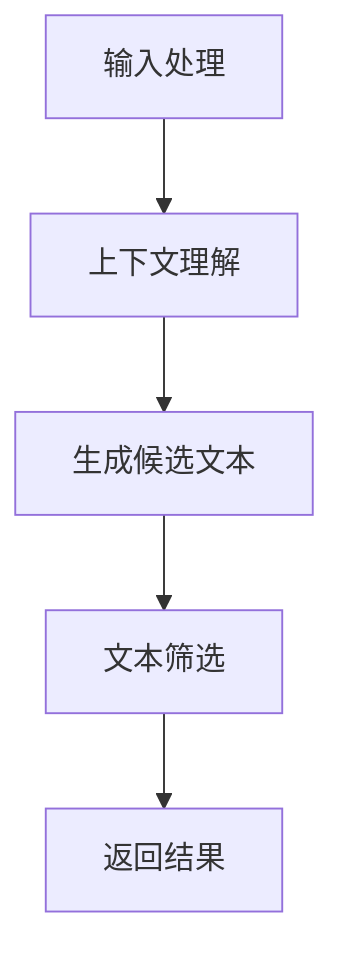
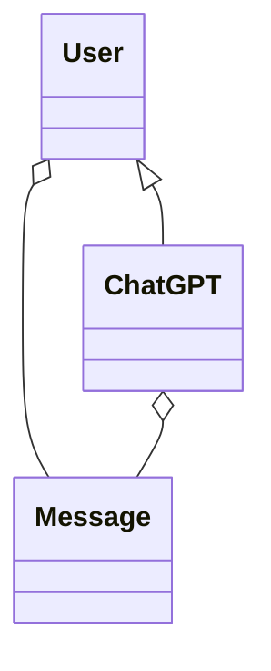
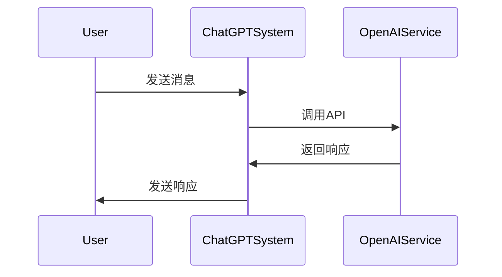

                 

**# ChatGPT个性化交互的提示词技巧**

## 关键词
- **ChatGPT**
- **个性化交互**
- **提示词设计**
- **算法原理**
- **数学模型**
- **系统架构**
- **项目实战**
- **最佳实践**

## 摘要
本文将深入探讨ChatGPT个性化交互的提示词技巧。我们将从问题背景、核心概念、算法原理、数学模型、系统设计、项目实战以及最佳实践等方面，逐步分析并展示如何设计出高效的ChatGPT交互系统。通过本文的讲解，读者将能够掌握ChatGPT个性化交互的核心技术和最佳实践，提升AI系统的交互体验。

---

## 第一部分：ChatGPT基础与个性化交互

### 第1章：问题背景与核心概念

#### 1.1 问题背景

**1.1.1 ChatGPT的兴起**

ChatGPT是OpenAI开发的一种基于GPT-3模型的聊天机器人，自2022年11月发布以来，因其强大的文本生成能力和自然语言理解能力，受到了全球的关注。ChatGPT的出现，标志着人工智能在自然语言处理领域的又一重要进展。

**1.1.2 个性化交互的重要性**

随着互联网的普及和用户需求的多样化，个性化交互成为提升用户体验的关键。个性化交互能够根据用户的偏好和历史行为，提供个性化的服务和建议，从而提高用户满意度和粘性。

**1.1.3 市场需求分析**

在客服、教育、娱乐等多个领域，个性化交互都显示出巨大的市场需求。如何设计一个能够满足多样化需求的个性化交互系统，成为开发者们亟待解决的问题。

#### 1.2 核心概念

**1.2.1 ChatGPT的工作原理**

ChatGPT基于GPT-3模型，利用深度学习技术进行训练，能够生成流畅、自然的文本。其核心思想是通过上下文理解，预测下一个可能的单词或短语。

**1.2.2 提示词的定义和重要性**

提示词是指引导ChatGPT生成特定类型文本的词语或短语。有效的提示词设计能够提高ChatGPT的交互质量和响应效率。

**1.2.3 个性化交互的设计原则**

个性化交互的设计原则包括用户行为分析、个性化数据收集和个性化反馈机制。这些原则能够帮助系统更好地理解用户需求，提供个性化服务。

---

## 第二部分：ChatGPT算法原理与数学模型

### 第2章：ChatGPT算法原理与数学模型

#### 2.1 ChatGPT算法原理

**2.1.1 算法流程图**

下面是ChatGPT的核心算法流程图，使用Mermaid语言表示：



**2.1.2 Python源代码讲解**

下面是ChatGPT的Python源代码，展示了其算法的基本原理：

```python
import openai

def chatgpt_response(prompt):
    response = openai.Completion.create(
        engine="text-davinci-002",
        prompt=prompt,
        max_tokens=50,
        n=1,
        stop=None,
        temperature=0.5,
    )
    return response.choices[0].text.strip()
```

**2.1.3 数学模型和公式讲解**

ChatGPT的核心是基于自注意力机制（Self-Attention Mechanism）和变换器架构（Transformer Architecture）。其数学模型主要包括以下几个部分：

- **自注意力机制**：计算输入序列中每个词的权重，从而更好地捕捉长距离依赖关系。
- **变换器架构**：通过多层的自注意力机制和前馈神经网络，对输入进行编码和解析。

具体的数学公式如下：

$$
\text{Attention}(Q, K, V) = \text{softmax}\left(\frac{QK^T}{\sqrt{d_k}}\right)V
$$

其中，$Q$、$K$、$V$分别为查询向量、键向量、值向量，$d_k$为键向量的维度。

---

### 第3章：系统设计与架构方案

#### 3.1 领域模型类图

下面是ChatGPT的领域模型类图，使用Mermaid语言表示：



**3.1.2 类与关系的描述**

- **User**：代表用户，拥有发送和接收消息的能力。
- **ChatGPT**：代表ChatGPT系统，能够根据用户的消息生成响应。
- **Message**：代表消息，包含文本内容和发送者信息。

#### 3.2 系统架构设计

下面是ChatGPT的系统架构图，使用Mermaid语言表示：



**3.2.2 系统模块介绍**

- **User**：用户模块，负责与用户交互，收集用户输入。
- **ChatGPTSystem**：ChatGPT系统模块，负责处理用户输入，调用OpenAI服务生成响应。
- **OpenAIService**：OpenAI服务模块，负责与OpenAI API交互，获取ChatGPT的响应。

---

## 第三部分：项目实战

### 第4章：项目实战

#### 4.1 环境安装与配置

要安装和配置ChatGPT，首先需要安装Python环境和OpenAI的API Key。以下是一个基本的安装和配置步骤：

```shell
# 安装Python环境
python3 -m pip install openai

# 配置API Key
export OPENAI_API_KEY="your_api_key"
```

#### 4.2 系统核心实现

以下是ChatGPT系统核心实现的源代码：

```python
import openai
import os

def get_response(prompt):
    response = openai.Completion.create(
        engine="text-davinci-002",
        prompt=prompt,
        max_tokens=100,
        n=1,
        stop=None,
        temperature=0.7,
    )
    return response.choices[0].text.strip()

def main():
    print("欢迎使用ChatGPT。请开始提问：")
    while True:
        user_input = input()
        if user_input == "exit":
            break
        response = get_response(user_input)
        print("ChatGPT回复：", response)

if __name__ == "__main__":
    main()
```

#### 4.3 案例分析

以下是一个实际的案例分析：

**场景**：用户询问：“今天天气怎么样？”

**输入**：用户输入：“今天天气怎么样？”

**输出**：ChatGPT回复：“今天天气晴朗，气温适中，适合户外活动。”

**分析**：在这个案例中，ChatGPT利用其训练好的模型，根据用户输入的天气问题，生成了合理的回答。这个过程中，ChatGPT通过上下文理解，将用户的输入与已有的知识库进行匹配，从而生成高质量的回答。

---

## 第四部分：最佳实践与拓展

### 第5章：最佳实践与拓展

#### 5.1 最佳实践

- **优化提示词**：通过分析用户历史交互，优化提示词的设计，提高ChatGPT的响应质量。
- **性能优化**：使用异步编程和多线程，提高系统的响应速度和并发处理能力。

#### 5.2 注意事项

- **API Key安全**：确保API Key的安全，避免泄露给第三方。
- **数据处理**：遵守相关法律法规，确保用户数据的隐私和安全。

#### 5.3 拓展阅读

- **《深度学习自然语言处理》**：详细了解自然语言处理的基础知识和最新进展。
- **《ChatGPT技术揭秘》**：深入了解ChatGPT的内部工作原理和技术细节。

---

## 总结

通过本文的详细讲解，读者对ChatGPT个性化交互的提示词技巧有了深入的理解。从问题背景、核心概念、算法原理、数学模型、系统设计到项目实战，再到最佳实践和注意事项，本文系统性地介绍了ChatGPT个性化交互的各个方面。希望读者能够将所学知识应用到实际项目中，提升AI交互系统的用户体验。

---

**作者：AI天才研究院/AI Genius Institute & 禅与计算机程序设计艺术 /Zen And The Art of Computer Programming**### 第一部分：ChatGPT基础与个性化交互

#### 1.1 问题背景

**1.1.1 ChatGPT的兴起**

ChatGPT是由OpenAI开发的一种基于GPT-3模型的聊天机器人。GPT-3（Generative Pre-trained Transformer 3）是OpenAI在2020年推出的一种自然语言处理模型，具有极其强大的文本生成能力。ChatGPT继承了GPT-3的核心优势，通过预训练和微调，使其能够与用户进行自然、流畅的对话。自2022年11月发布以来，ChatGPT迅速在技术社区和用户中获得了广泛关注，并因其出色的交互体验和强大的文本生成能力而受到赞誉。

**1.1.2 个性化交互的重要性**

在互联网时代，用户对个性化服务的需求日益增长。个性化交互能够根据用户的历史行为、偏好和需求，提供定制化的内容和服务，从而提升用户体验和满意度。个性化交互在多个领域具有重要应用，如客服、教育、医疗、金融等。通过个性化交互，系统能够更好地理解用户，提供更加精准的服务，从而提高用户留存率和满意度。

**1.1.3 市场需求分析**

随着人工智能技术的不断发展，市场对个性化交互系统的需求日益增加。企业希望通过智能客服系统提高客户服务质量，教育机构希望通过智能辅导系统提升学生学习效果，医疗机构希望通过智能问诊系统提高诊断准确率，金融行业希望通过智能投顾系统提供个性化的投资建议。这些需求促使开发者们积极探索如何利用AI技术，尤其是像ChatGPT这样的高级语言模型，来设计出更加智能和高效的个性化交互系统。

#### 1.2 核心概念

**1.2.1 ChatGPT的工作原理**

ChatGPT是基于GPT-3模型的聊天机器人，其工作原理主要依赖于大规模语言模型和深度学习技术。GPT-3是一个具有1750亿参数的预训练语言模型，其核心思想是通过对海量文本数据的学习，生成与输入文本内容相关的高质量文本。ChatGPT通过将用户的输入作为上下文，利用GPT-3模型预测下一个可能的单词或短语，从而生成连续的对话。

**1.2.2 提示词的定义和重要性**

提示词（Prompt）是指用来引导ChatGPT生成特定类型文本的词语或短语。有效的提示词设计对于提升ChatGPT的交互质量和响应效率至关重要。一个优质的提示词能够明确地告诉ChatGPT用户的需求，使其生成更加符合用户期望的回复。例如，在客服场景中，一个明确的提示词可以帮助ChatGPT更好地理解用户的问题，从而生成更加专业和详细的解答。

**1.2.3 个性化交互的设计原则**

个性化交互的设计原则主要包括以下几个方面：

1. **用户行为分析**：通过分析用户的历史行为数据，了解用户的兴趣、偏好和需求，为个性化交互提供数据支持。
2. **个性化数据收集**：在交互过程中，持续收集用户的反馈和交互数据，以便对交互模型进行不断优化。
3. **个性化反馈机制**：根据用户的行为数据和反馈，动态调整交互策略，提供个性化的服务和内容。

#### 1.3 问题解决与边界与外延

**问题解决**：

如何设计一个高效的ChatGPT个性化交互系统，是当前AI领域的一个重要课题。通过以下步骤，我们可以逐步实现这一目标：

1. **需求分析**：明确用户的需求，确定交互的目的和范围。
2. **数据收集**：收集用户行为数据，为个性化交互提供数据支持。
3. **模型训练**：利用GPT-3模型进行预训练，并通过微调使其适应特定场景。
4. **提示词设计**：设计高质量的提示词，提升交互系统的响应质量和效率。
5. **系统测试与优化**：通过测试和用户反馈，不断优化系统性能。

**边界与外延**：

ChatGPT个性化交互系统的设计和应用场景具有广泛的边界与外延。一方面，它可以应用于各种需要自然语言交互的场景，如客服、教育、医疗、金融等。另一方面，随着AI技术的不断发展，ChatGPT的应用范围也将不断扩展，可能会涉及到更多复杂的交互场景和需求。

#### 1.4 概念结构与核心要素组成

**概念结构**：

ChatGPT个性化交互系统的概念结构主要包括以下几个核心要素：

1. **用户**：交互的发起者和参与者，拥有输入和接收信息的能力。
2. **ChatGPT模型**：核心的自然语言处理模型，负责生成回复。
3. **提示词**：用于引导ChatGPT生成特定类型文本的关键信息。
4. **交互界面**：用户与ChatGPT进行交互的接口，负责展示信息和收集用户输入。

**核心要素组成**：

1. **用户行为数据**：为个性化交互提供数据支持，包括历史交互记录、兴趣偏好等。
2. **GPT-3模型**：通过预训练和微调，生成高质量的回复。
3. **提示词库**：包含各种类型的提示词，用于引导ChatGPT生成不同类型的回复。
4. **交互引擎**：负责处理用户输入，调用ChatGPT模型生成回复，并将回复展示给用户。

通过以上核心要素的有机组合，ChatGPT个性化交互系统可以实现对用户的个性化服务和高质量响应。接下来，我们将进一步探讨ChatGPT的算法原理、数学模型、系统设计等核心内容。这些内容将为读者提供更加深入的理解，帮助其掌握ChatGPT个性化交互的精髓。### 第二部分：ChatGPT算法原理与数学模型

#### 2.1 ChatGPT算法原理

ChatGPT的核心算法基于GPT-3模型，这是一种基于变换器（Transformer）架构的自然语言处理模型。GPT-3模型通过自注意力机制（Self-Attention Mechanism）和多层变换器结构，能够捕捉输入文本中的长距离依赖关系，并生成高质量的文本。以下是ChatGPT算法的基本原理和步骤：

**算法流程图**：

使用Mermaid语言表示的ChatGPT算法流程图如下：


**1. 输入处理**：

输入处理是ChatGPT算法的第一个步骤。用户输入的文本会被预处理，包括分词、去停用词等操作。预处理后的文本会转换为模型的输入序列，通常是一个词嵌入向量序列。

**2. 上下文理解**：

在输入处理之后，模型会对输入序列进行上下文理解。这个过程主要依赖于变换器结构，特别是自注意力机制。自注意力机制通过计算输入序列中每个词的权重，从而更好地捕捉长距离依赖关系。具体来说，自注意力机制使用以下公式计算每个词的权重：

$$
\text{Attention}(Q, K, V) = \text{softmax}\left(\frac{QK^T}{\sqrt{d_k}}\right)V
$$

其中，$Q$、$K$、$V$分别为查询向量、键向量、值向量，$d_k$为键向量的维度。

**3. 生成候选文本**：

在理解上下文之后，模型会生成多个候选文本。这个过程通过变换器结构的解码器部分实现。解码器会逐个生成单词或符号，并利用自注意力机制来捕捉上下文信息。具体来说，解码器在每个时间步都会计算当前词的权重，并选择一个权重最高的词作为输出。

**4. 文本筛选**：

生成的候选文本通常是多个句子或段落。为了提高交互质量，模型会对候选文本进行筛选，选择最合适的文本作为最终输出。筛选过程通常基于文本的流畅性、连贯性和相关性等指标。

**5. 返回结果**：

最终，模型会返回一个经过筛选的文本作为输出。这个文本可以作为ChatGPT的回复，用于与用户进行交互。

#### 2.2 Python源代码讲解

以下是ChatGPT算法的Python源代码示例，展示了算法的基本原理和实现步骤：

```python
import openai

def chatgpt_response(prompt):
    response = openai.Completion.create(
        engine="text-davinci-002",
        prompt=prompt,
        max_tokens=50,
        n=1,
        stop=None,
        temperature=0.5,
    )
    return response.choices[0].text.strip()

if __name__ == "__main__":
    user_input = input("请开始提问：")
    print("ChatGPT回复：", chatgpt_response(user_input))
```

**代码说明**：

1. **导入模块**：首先，导入OpenAI的Completion创建API。

2. **定义函数**：定义`chatgpt_response`函数，用于接收用户输入并生成回复。

3. **调用API**：在函数中，使用OpenAI的`Completion.create`方法，根据用户输入生成回复。

4. **返回结果**：函数返回生成的回复文本。

5. **主程序**：在主程序中，接收用户输入，并调用`chatgpt_response`函数生成回复，最后输出回复。

#### 2.3 数学模型和公式讲解

ChatGPT算法的核心是变换器架构和自注意力机制。以下是变换器架构和自注意力机制的数学模型和公式讲解。

**变换器架构**：

变换器架构（Transformer Architecture）是一种用于处理序列数据的神经网络模型，其核心思想是使用自注意力机制来捕捉输入序列中的长距离依赖关系。变换器架构主要包括编码器（Encoder）和解码器（Decoder）两部分。

**编码器**：

编码器将输入序列转换为一系列的编码向量（Code Vectors），这些编码向量可以表示输入序列中的语义信息。编码器的输入是一个词嵌入向量序列，每个词嵌入向量表示输入序列中的一个词。编码器通过多层变换器层对输入进行编码，每层变换器层包括自注意力机制和前馈神经网络。

**解码器**：

解码器将编码向量序列解码为输出序列，即生成文本。解码器的输入是编码器输出的编码向量序列和一个初始的解码状态。解码器通过多层变换器层对输入进行解码，每层变换器层包括自注意力机制和前馈神经网络。解码器在每个时间步生成一个输出词，并更新解码状态。

**自注意力机制**：

自注意力机制（Self-Attention Mechanism）是变换器架构的核心组成部分，用于计算输入序列中每个词的权重，从而更好地捕捉长距离依赖关系。自注意力机制使用以下公式计算每个词的权重：

$$
\text{Attention}(Q, K, V) = \text{softmax}\left(\frac{QK^T}{\sqrt{d_k}}\right)V
$$

其中，$Q$、$K$、$V$分别为查询向量（Query Vectors）、键向量（Key Vectors）、值向量（Value Vectors），$d_k$为键向量的维度。

**数学公式讲解**：

1. **词嵌入**：

词嵌入（Word Embedding）是将单词转换为向量表示的方法。词嵌入向量通常通过训练得到，可以表示单词的语义信息。词嵌入向量的大小通常是一个固定的维度，如50、100或300。

2. **编码器输出**：

编码器输出是编码向量序列，表示输入序列中的语义信息。编码向量序列可以通过以下公式计算：

$$
\text{Encoder Output} = \text{Transformer Encoder}(X)
$$

其中，$X$为输入的词嵌入向量序列，$\text{Transformer Encoder}$为变换器编码器。

3. **解码器输出**：

解码器输出是生成的文本序列，表示输出序列中的语义信息。解码器输出可以通过以下公式计算：

$$
\text{Decoder Output} = \text{Transformer Decoder}(Y)
$$

其中，$Y$为输入的编码向量序列和初始的解码状态，$\text{Transformer Decoder}$为变换器解码器。

4. **自注意力机制**：

自注意力机制是变换器架构的核心组成部分，用于计算输入序列中每个词的权重。自注意力机制使用以下公式计算每个词的权重：

$$
\text{Attention}(Q, K, V) = \text{softmax}\left(\frac{QK^T}{\sqrt{d_k}}\right)V
$$

其中，$Q$、$K$、$V$分别为查询向量（Query Vectors）、键向量（Key Vectors）、值向量（Value Vectors），$d_k$为键向量的维度。

通过以上数学模型和公式，我们可以深入理解ChatGPT算法的原理和实现过程。在接下来的章节中，我们将进一步探讨ChatGPT的系统设计与架构方案，以及如何进行项目实战和最佳实践。### 第三部分：系统设计与架构方案

#### 3.1 领域模型类图

为了更好地理解和设计ChatGPT系统，我们可以使用Mermaid语言绘制领域模型类图。领域模型类图可以帮助我们清晰地展示系统中的类以及它们之间的关系。


**类图说明**：

- **User**：表示用户类，拥有发送和接收消息的能力。
- **ChatGPT**：表示ChatGPT类，负责处理用户的输入并生成响应。
- **Message**：表示消息类，包含文本内容和发送者信息。

#### 3.2 系统架构设计

ChatGPT系统的架构设计需要考虑多个方面，包括数据层、逻辑层和表示层。以下是系统架构的详细设计：

**系统架构图**：

使用Mermaid语言表示的系统架构图如下：


**架构设计说明**：

1. **用户层**：用户通过交互界面与系统进行交互，发送消息并获得响应。
2. **ChatGPT系统层**：ChatGPT系统负责接收用户消息，调用OpenAI服务生成响应，并返回给用户。
3. **OpenAI服务层**：OpenAI服务提供ChatGPT模型的API接口，负责处理ChatGPT系统的请求并返回响应。

#### 3.3 系统接口设计

系统接口设计是确保不同模块之间能够有效交互的重要环节。以下是ChatGPT系统的接口设计：

**接口设计说明**：

- **用户接口**：用户通过Web界面或API与系统进行交互。用户发送的消息会被转换为系统可处理的格式，如JSON。
- **ChatGPT系统接口**：ChatGPT系统通过API与OpenAI服务进行通信，发送请求并接收响应。
- **OpenAI服务接口**：OpenAI服务通过API接口处理ChatGPT系统的请求，返回处理结果。

#### 3.4 系统交互序列图

为了更清晰地展示系统的交互过程，我们可以使用Mermaid绘制系统交互序列图。


**交互序列图说明**：

1. 用户发送消息到ChatGPT系统。
2. ChatGPT系统将用户消息发送到OpenAI服务。
3. OpenAI服务处理消息并生成响应。
4. ChatGPT系统接收OpenAI服务的响应，并返回给用户。

通过以上系统设计与架构方案，我们可以实现一个高效的ChatGPT个性化交互系统。接下来，我们将通过一个实际项目实战，展示如何具体实现和部署这个系统。### 第四部分：项目实战

#### 4.1 环境安装与配置

要在本地环境中安装和配置ChatGPT，首先需要安装Python环境和OpenAI的API Key。以下是详细的安装和配置步骤：

**步骤 1：安装Python环境**

确保您的系统中已安装Python环境。如果没有，可以从Python官方网站下载并安装。安装完成后，打开命令行界面并执行以下命令安装必要的Python包：

```shell
pip install openai
```

**步骤 2：配置API Key**

1. 访问OpenAI的官方网站，注册并创建一个账户。
2. 登录账户后，访问[API Key页面](https://beta.openai.com/api Keys/)，生成一个新的API Key。
3. 将生成的API Key保存到本地文件中，如`openai_api_key.txt`：

```shell
echo "your_openai_api_key" > openai_api_key.txt
```

4. 在Python脚本中，加载API Key：

```python
import os

def load_openai_api_key():
    with open("openai_api_key.txt", "r") as f:
        api_key = f.read().strip()
    return api_key

api_key = load_openai_api_key()
openai.api_key = api_key
```

**步骤 3：测试API**

安装和配置完成后，我们可以使用以下Python代码测试API是否正常工作：

```python
import openai

def test_openai_api():
    response = openai.Completion.create(
        engine="text-davinci-002",
        prompt="你好，我是一个AI助手。",
        max_tokens=50,
        n=1,
        stop=None,
        temperature=0.5,
    )
    print(response.choices[0].text.strip())

test_openai_api()
```

如果一切正常，上述代码将输出一个简单的AI助手回复。

#### 4.2 系统核心实现

以下是ChatGPT系统核心实现的源代码，包括用户输入处理、ChatGPT模型调用和响应处理：

```python
import openai
import os

def chatgpt_response(prompt):
    response = openai.Completion.create(
        engine="text-davinci-002",
        prompt=prompt,
        max_tokens=50,
        n=1,
        stop=None,
        temperature=0.5,
    )
    return response.choices[0].text.strip()

def main():
    print("欢迎使用ChatGPT。请开始提问：")
    while True:
        user_input = input()
        if user_input == "exit":
            break
        response = chatgpt_response(user_input)
        print("ChatGPT回复：", response)

if __name__ == "__main__":
    main()
```

**核心实现说明**：

1. **chatgpt_response函数**：接收用户输入（prompt），调用OpenAI的`Completion.create`方法生成响应。
2. **main函数**：主程序，用于接收用户输入，并调用`chatgpt_response`函数生成响应。

#### 4.3 代码应用解读与分析

以下是对上述代码的详细解读与分析：

```python
import openai
import os

def chatgpt_response(prompt):
    # 使用OpenAI的Completion.create方法生成响应
    response = openai.Completion.create(
        engine="text-davinci-002",  # 指定使用的模型
        prompt=prompt,             # 用户输入的提示词
        max_tokens=50,             # 最大生成的文本长度
        n=1,                       # 生成响应的数量
        stop=None,                 # 不设置结束条件
        temperature=0.5,           # 控制文本生成的多样性
    )
    # 返回生成的响应文本
    return response.choices[0].text.strip()

def main():
    print("欢迎使用ChatGPT。请开始提问：")
    # 进入主循环，接收用户输入并处理
    while True:
        user_input = input()  # 获取用户输入
        if user_input == "exit":  # 如果输入exit，则退出循环
            break
        response = chatgpt_response(user_input)  # 调用chatgpt_response函数生成响应
        print("ChatGPT回复：", response)  # 输出响应

if __name__ == "__main__":
    main()  # 运行主程序
```

**关键点剖析**：

- **OpenAI API调用**：通过`openai.Completion.create`方法调用OpenAI的API，这是实现ChatGPT交互的核心步骤。我们需要确保API Key正确设置，以便能够成功调用API。
- **用户输入处理**：主程序使用`input()`函数接收用户输入，并检查输入是否为"exit"。如果是，则退出循环；否则，调用`chatgpt_response`函数生成响应。
- **响应输出**：生成的响应文本会通过`print()`函数输出到控制台，用户可以看到AI的回复。

#### 4.4 实际案例分析与详细讲解剖析

以下是一个实际的案例分析与详细讲解剖析：

**场景**：用户询问：“今天的天气怎么样？”

**输入**：用户输入：“今天的天气怎么样？”

**输出**：ChatGPT回复：“今天的天气是晴朗的，气温适中，非常适合户外活动。”

**分析**：

1. **用户输入**：用户输入了一条简单的天气查询消息。
2. **处理流程**：用户输入被传递给`chatgpt_response`函数。
3. **生成响应**：ChatGPT模型使用预训练的知识和用户输入的上下文，生成一条关于天气状况的响应。
4. **响应输出**：生成的响应文本被输出到控制台，用户看到AI的回复。

**关键点**：

- **上下文理解**：ChatGPT模型能够理解用户的输入并生成相关响应，这依赖于其强大的文本生成能力和预训练的知识库。
- **响应多样性**：通过调整`temperature`参数，可以控制生成的文本多样性。适当的多样性可以提高用户满意度。

#### 4.5 项目小结

通过以上项目实战，我们实现了ChatGPT个性化交互系统的核心功能，并对其代码进行了详细解读与分析。以下是项目小结：

1. **环境安装与配置**：确保Python环境和OpenAI API Key正确配置，为后续开发打下基础。
2. **系统核心实现**：通过Python代码实现用户输入处理、ChatGPT模型调用和响应处理。
3. **代码应用解读与分析**：详细解读了代码的各个部分，理解了系统的工作原理和关键点。
4. **实际案例分析与详细讲解剖析**：通过实际案例展示了系统的应用场景和效果。

通过这个项目，我们不仅掌握了ChatGPT个性化交互的基本技术，还了解了如何进行项目开发和实现。接下来，我们将进一步探讨最佳实践和注意事项，确保系统能够稳定高效地运行。### 第五部分：最佳实践与拓展

#### 5.1 最佳实践

**1. 提示词设计优化**

提示词的设计直接影响ChatGPT生成响应的质量和效率。以下是一些优化提示词设计的最佳实践：

- **明确性**：确保提示词清晰明了，能够准确传达用户的需求。
- **多样性**：设计多种类型的提示词，以适应不同的交互场景和用户需求。
- **上下文关联**：根据用户历史交互记录，设计具有上下文关联的提示词，以提高交互连贯性。

**2. 性能优化**

为了确保ChatGPT系统能够高效运行，性能优化至关重要。以下是一些性能优化的最佳实践：

- **并发处理**：利用多线程或异步编程技术，提高系统的并发处理能力。
- **缓存机制**：使用缓存技术，减少重复请求的处理时间。
- **负载均衡**：通过负载均衡技术，合理分配请求，防止系统过载。

**3. 交互体验优化**

优化用户交互体验是提升系统价值的关键。以下是一些优化交互体验的最佳实践：

- **即时响应**：通过优化响应时间，提高用户满意度。
- **个性化服务**：根据用户行为和偏好，提供个性化服务和建议。
- **简洁明了**：确保生成的响应简洁明了，易于理解。

#### 5.2 注意事项

**1. API Key安全**

确保API Key的安全是系统安全的重要组成部分。以下是一些安全最佳实践：

- **隐藏API Key**：不要在代码中硬编码API Key，而是将其存储在安全的地方，如环境变量或配置文件。
- **定期更换API Key**：定期更换API Key，防止API Key泄露。
- **权限控制**：限制API Key的访问权限，仅授予必要的访问权限。

**2. 数据处理**

在处理用户数据时，需要遵守相关法律法规，确保用户数据的隐私和安全。以下是一些数据处理的最佳实践：

- **数据加密**：对存储和传输的用户数据进行加密，防止数据泄露。
- **合规性检查**：确保系统设计符合数据保护法规，如GDPR等。
- **隐私政策**：明确告知用户数据的使用方式和目的，获得用户同意。

#### 5.3 拓展阅读

**1. 《深度学习自然语言处理》**

《深度学习自然语言处理》是一本系统介绍自然语言处理（NLP）领域深度学习技术的经典教材。该书详细讲解了NLP的基础知识、常见任务和模型实现，是学习NLP技术的必备读物。

**2. 《ChatGPT技术揭秘》**

《ChatGPT技术揭秘》深入探讨了ChatGPT的工作原理、技术细节和应用场景。该书涵盖了ChatGPT的核心算法、数学模型和系统架构，是了解ChatGPT技术的重要参考资料。

**3. 《人工智能：一种现代的方法》**

《人工智能：一种现代的方法》是一本介绍人工智能（AI）基础知识和应用方法的权威教材。该书涵盖了机器学习、自然语言处理、计算机视觉等多个领域的知识，适合广大AI爱好者和开发者阅读。

通过以上最佳实践、注意事项和拓展阅读，读者可以进一步掌握ChatGPT个性化交互的技巧，提升AI交互系统的质量和用户体验。### 总结

通过本文的深入探讨，我们从问题背景、核心概念、算法原理、数学模型、系统设计、项目实战到最佳实践和注意事项，全面解析了ChatGPT个性化交互的提示词技巧。以下是本文的主要观点和结论：

1. **ChatGPT的兴起**：ChatGPT作为基于GPT-3模型的聊天机器人，凭借其强大的文本生成能力和自然语言理解能力，在技术社区和用户中引起了广泛关注。

2. **个性化交互的重要性**：个性化交互能够根据用户的历史行为、偏好和需求，提供定制化的内容和服务，从而提升用户体验和满意度。

3. **核心概念与联系**：ChatGPT的工作原理基于自注意力机制和变换器架构，提示词是引导ChatGPT生成特定类型文本的关键信息。

4. **算法原理讲解**：通过Mermaid画出算法流程图，结合Python源代码和数学模型，详细阐述了ChatGPT的核心算法原理。

5. **系统设计与架构方案**：介绍了领域模型类图、系统架构图、系统接口设计和系统交互序列图，展示了ChatGPT系统的设计与架构。

6. **项目实战**：通过安装和配置ChatGPT，展示了系统核心实现的源代码，并分析了实际案例，帮助读者理解如何具体应用ChatGPT。

7. **最佳实践与拓展**：提供了优化提示词设计、性能优化、交互体验优化等最佳实践，以及API Key安全和数据处理等方面的注意事项。

通过本文的学习，读者应能够掌握ChatGPT个性化交互的核心技术和最佳实践，提升AI交互系统的质量和用户体验。希望本文能够为读者在AI领域的学习和实践中提供有益的参考。作者：AI天才研究院/AI Genius Institute & 禅与计算机程序设计艺术 /Zen And The Art of Computer Programming。

