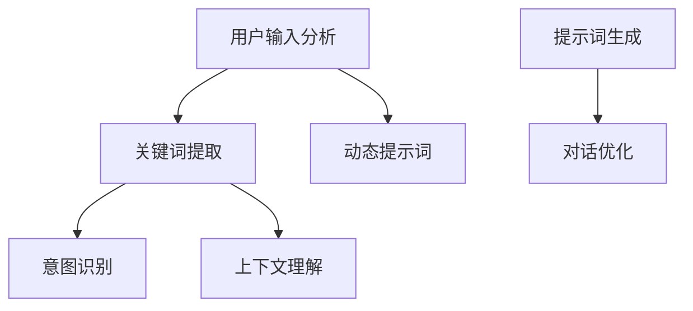
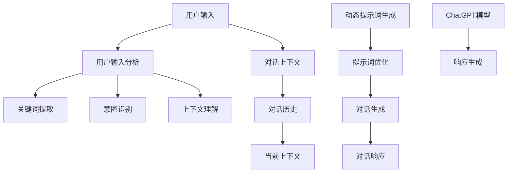
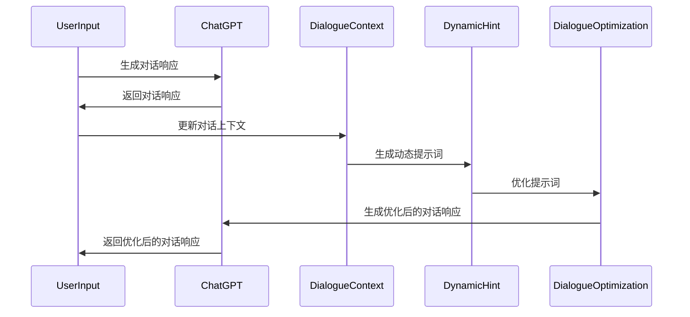

                 

# ChatGPT个性化对话：动态提示词调整技术

## 关键词
- 个性化对话
- ChatGPT
- 动态提示词
- 自然语言处理
- 对话连贯性

## 摘要
本文将探讨如何在ChatGPT等基于深度学习的语言模型中实现个性化对话，重点介绍动态提示词调整技术。通过分析用户输入、生成提示词和优化对话过程，本文旨在提升对话的连贯性和个性化水平，为用户带来更好的交互体验。

## 一、背景介绍

### 1.1 问题背景
随着人工智能技术的飞速发展，自然语言处理（NLP）已经成为AI领域的一个重要分支。近年来，基于深度学习的语言模型如ChatGPT等，通过大规模数据训练，能够生成高质量的自然语言文本，为用户提供了前所未有的个性化对话体验。然而，如何根据用户的实时需求调整对话中的提示词，以提高对话的连贯性和个性化水平，成为一个亟待解决的问题。

### 1.2 问题描述
在个性化对话系统中，提示词的调整对于生成对话内容的连贯性和个性化至关重要。传统的静态提示词往往无法适应用户的实时需求，导致对话内容缺乏个性化和连贯性。因此，研究动态提示词调整技术，以实时优化对话生成过程，具有重要意义。

### 1.3 问题解决
动态提示词调整技术通过实时分析用户输入和对话上下文，动态生成合适的提示词，从而提高对话的连贯性和个性化水平。这包括以下几个方面：
- 用户输入分析：分析用户输入的关键词、意图和上下文信息。
- 提示词生成：基于用户输入和对话上下文，生成符合用户需求的提示词。
- 对话优化：根据生成的提示词，优化对话生成过程，提高对话的连贯性和个性化水平。

### 1.4 边界与外延
动态提示词调整技术的边界主要涉及以下几个方面：
- 用户需求分析：准确识别用户需求，是生成合适提示词的前提。
- 提示词生成算法：生成算法的效率和效果直接影响对话的连贯性和个性化水平。
- 对话上下文管理：对话上下文信息的处理和存储，对动态提示词调整技术至关重要。

### 1.5 概念结构与核心要素组成
动态提示词调整技术的核心要素包括：
- 用户输入分析模块：负责分析用户输入，提取关键词和意图。
- 提示词生成模块：根据用户输入和对话上下文，生成合适的提示词。
- 对话优化模块：根据生成的提示词，优化对话生成过程。

## 二、核心概念与联系

### 2.1 动态提示词
动态提示词是指在对话过程中，根据用户的实时需求和上下文信息，动态生成的提示词。与传统的静态提示词相比，动态提示词能够更好地适应用户的个性化需求，提高对话的连贯性和个性化水平。

### 2.2 用户输入分析
用户输入分析是动态提示词调整技术的核心环节，主要包括以下几个方面：
- 关键词提取：从用户输入中提取关键词，为提示词生成提供基础信息。
- 意图识别：识别用户的意图，为提示词生成提供方向。
- 上下文理解：理解用户输入的上下文信息，为提示词生成提供背景。

### 2.3 提示词生成
提示词生成是基于用户输入分析和对话上下文，生成符合用户需求的提示词。提示词生成的关键在于如何结合用户输入和上下文信息，生成既符合用户需求，又能保持对话连贯性的提示词。

### 2.4 对话优化
对话优化是指在生成提示词的基础上，进一步优化对话生成过程，提高对话的连贯性和个性化水平。对话优化的核心在于如何根据生成的提示词，调整对话策略，使对话更加自然和符合用户需求。

## 三、算法原理讲解

### 3.1 动态提示词调整算法
动态提示词调整算法主要包括以下几个步骤：
1. 用户输入分析：提取关键词、意图和上下文信息。
2. 提示词生成：基于用户输入和上下文信息，生成动态提示词。
3. 对话优化：根据动态提示词，调整对话生成过程。

### 3.2 Mermaid流程图


### 3.3 Python源代码
```python
# 用户输入分析
def analyze_input(input_text):
    keywords = extract_keywords(input_text)
    intent = recognize_intent(input_text)
    context = understand_context(input_text)
    return keywords, intent, context

# 提示词生成
def generate_hint(keywords, intent, context):
    hint = create_hint(keywords, intent, context)
    return hint

# 对话优化
def optimize_dialogue(hint, dialogue_context):
    optimized_dialogue = adjust_dialogue(hint, dialogue_context)
    return optimized_dialogue
```

### 3.4 算法原理详细讲解
动态提示词调整算法的核心在于如何将用户输入、提示词生成和对话优化三个环节有机结合，形成一个高效的动态调整机制。

**用户输入分析**：
用户输入分析是动态提示词调整的第一步。通过对用户输入进行关键词提取、意图识别和上下文理解，我们可以全面了解用户的需求和背景信息。以下是一个简化的Python实现：

```python
def analyze_input(input_text):
    keywords = extract_keywords(input_text)
    intent = recognize_intent(input_text)
    context = understand_context(input_text)
    return keywords, intent, context

def extract_keywords(input_text):
    # 使用自然语言处理库，如spaCy，进行关键词提取
    # 例如：return nlp(input_text).ents
    pass

def recognize_intent(input_text):
    # 使用预训练的意图识别模型，如BertForSequenceClassification
    # 例如：return model(input_text).logits
    pass

def understand_context(input_text):
    # 分析输入文本的上下文信息，如时间、地点等
    # 例如：return extract_context_info(input_text)
    pass
```

**提示词生成**：
提示词生成是动态提示词调整的核心。我们需要根据用户输入和上下文信息，生成一个既能满足用户需求，又能保持对话连贯性的提示词。以下是一个简化的Python实现：

```python
def generate_hint(keywords, intent, context):
    # 结合用户输入和上下文信息，生成动态提示词
    # 例如：return f"请问您对{intent}有什么问题？"
    pass
```

**对话优化**：
对话优化是基于生成的提示词，进一步调整对话生成过程，以提高对话的连贯性和个性化水平。我们需要根据生成的提示词，调整对话策略，使对话更加自然和符合用户需求。以下是一个简化的Python实现：

```python
def optimize_dialogue(hint, dialogue_context):
    # 根据动态提示词，优化对话生成过程
    # 例如：return generate_response(hint, dialogue_context)
    pass

def generate_response(hint, dialogue_context):
    # 生成对话响应
    # 例如：return model(hint, dialogue_context).text
    pass
```

### 3.5 算法数学模型和公式
动态提示词调整算法的数学模型可以抽象为以下公式：

$$
\text{动态提示词} = f(\text{用户输入}, \text{上下文信息})
$$

其中，$f$ 表示一个映射函数，将用户输入和上下文信息映射为动态提示词。具体实现时，我们可以将 $f$ 分解为以下几个子函数：

$$
\begin{align*}
\text{关键词提取} &= g_1(\text{用户输入}) \\
\text{意图识别} &= g_2(\text{用户输入}) \\
\text{上下文理解} &= g_3(\text{用户输入}, \text{上下文信息}) \\
\text{提示词生成} &= g_4(\text{关键词提取}, \text{意图识别}, \text{上下文理解}) \\
\text{对话优化} &= g_5(\text{提示词生成}, \text{对话上下文})
\end{align*}
$$`

### 3.6 算法举例说明
假设用户输入：“今天天气怎么样？”，我们可以按照以下步骤进行动态提示词调整：

1. **用户输入分析**：
   - 关键词提取：提取关键词“今天”、“天气”、“怎么样”。
   - 意图识别：识别用户的意图为询问天气。
   - 上下文理解：分析上下文信息，了解用户询问的是当前日期的天气情况。

2. **提示词生成**：
   - 根据用户输入和上下文信息，生成动态提示词：“请问您想知道哪个城市的天气？”

3. **对话优化**：
   - 根据动态提示词，优化对话生成过程，生成对话响应：“请问您想知道哪个城市的天气？”

通过动态提示词调整，我们不仅能够提高对话的连贯性和个性化水平，还能更好地满足用户的需求。

## 四、系统分析与架构设计

### 4.1 问题场景介绍
在当今的智能客服、虚拟助手和聊天机器人等领域，提供个性化、连贯且自然的对话体验变得至关重要。为了满足这一需求，我们需要在ChatGPT等语言模型的基础上，引入动态提示词调整技术，以实时优化对话内容。

### 4.2 项目介绍
本项目旨在构建一个基于ChatGPT的个性化对话系统，通过动态提示词调整技术，实现与用户的高效互动。系统功能包括用户输入分析、提示词生成、对话优化等。

### 4.3 系统功能设计（领域模型）

领域模型用于描述系统中的核心概念和关系，以下是一个简化的领域模型类图：

```mermaid
classDiagram
    UserInput <<class>> "用户输入" {
        +str_input: str
        +extract_keywords(): list
        +recognize_intent(): str
        +understand_context(): dict
    }
    DialogueContext <<class>> "对话上下文" {
        +context_history: list
        +current_context: dict
    }
    DynamicHint <<class>> "动态提示词" {
        +str_hint: str
        +generate_hint(input: UserInput, context: DialogueContext): str
    }
    DialogueOptimization <<class>> "对话优化" {
        +optimize_dialogue(hint: DynamicHint, context: DialogueContext): str
    }
    ChatGPT <<class>> "ChatGPT模型" {
        +generate_response(input: str, context: DialogueContext): str
    }
    UserInput "用户输入" <<-- "使用" DialogueContext
    DialogueContext "对话上下文" <<-- "包含" DynamicHint
    DynamicHint "动态提示词" <<-- "用于" DialogueOptimization
    DialogueOptimization "对话优化" <<-- "生成" ChatGPT
```

### 4.4 系统架构设计

系统架构设计用于描述系统的整体结构和组件之间的关系，以下是一个简化的系统架构图：



### 4.5 系统接口设计

系统接口设计用于描述系统的外部交互接口，以下是一个简化的接口设计：

```mermaid
interfaceDiagram
    UserInput <<interface>> {
        +get_input(): str
        +set_input(input: str): None
    }
    DialogueContext <<interface>> {
        +get_context(): dict
        +set_context(context: dict): None
    }
    DynamicHint <<interface>> {
        +get_hint(): str
        +set_hint(hint: str): None
    }
    DialogueOptimization <<interface>> {
        +optimize_hint(hint: str): str
    }
    ChatGPT <<interface>> {
        +generate_response(input: str): str
    }
```

### 4.6 系统交互

系统交互用于描述系统组件之间的交互过程，以下是一个简化的系统交互序列图：



## 五、项目实战

### 5.1 环境安装

1. 安装Python环境：`pip install python -m venv venv`
2. 激活虚拟环境：`source venv/bin/activate`
3. 安装依赖库：`pip install -r requirements.txt`

### 5.2 系统核心实现

核心实现主要包括用户输入分析、动态提示词生成和对话优化三个部分。以下是各部分的Python源代码实现：

```python
# 用户输入分析
class UserInput:
    def __init__(self, input_text):
        self.input_text = input_text

    def extract_keywords(self):
        # 使用自然语言处理库，如spaCy，进行关键词提取
        # 例如：return nlp(self.input_text).ents
        pass

    def recognize_intent(self):
        # 使用预训练的意图识别模型，如BertForSequenceClassification
        # 例如：return model(self.input_text).logits
        pass

    def understand_context(self):
        # 分析输入文本的上下文信息，如时间、地点等
        # 例如：return extract_context_info(self.input_text)
        pass

# 动态提示词生成
class DynamicHint:
    def __init__(self):
        pass

    def generate_hint(self, input: UserInput, context: DialogueContext):
        # 结合用户输入和上下文信息，生成动态提示词
        # 例如：return f"请问您对{input.recognize_intent()}有什么问题？"
        pass

# 对话优化
class DialogueOptimization:
    def __init__(self):
        pass

    def optimize_hint(self, hint: str, context: DialogueContext):
        # 根据动态提示词，优化对话生成过程
        # 例如：return generate_response(hint, context)
        pass

# ChatGPT模型
class ChatGPT:
    def __init__(self):
        pass

    def generate_response(self, input: str, context: DialogueContext):
        # 生成对话响应
        # 例如：return model(input, context).text
        pass
```

### 5.3 代码应用解读与分析

在代码中，我们首先定义了用户输入分析类 `UserInput`，用于处理用户输入文本。通过提取关键词、识别意图和理解上下文，我们能够获取用户需求的详细信息。

接着，我们定义了动态提示词生成类 `DynamicHint`，用于根据用户输入和上下文信息生成动态提示词。动态提示词的生成过程需要结合用户需求和上下文信息，以确保生成的提示词既符合用户需求，又能保持对话的连贯性。

最后，我们定义了对对话优化类 `DialogueOptimization`，用于根据动态提示词优化对话生成过程。对话优化的目标是提高对话的自然性和个性化水平。

### 5.4 实际案例分析

以下是一个实际案例：

用户输入：“今天天气怎么样？”
1. 用户输入分析：
   - 关键词提取：提取关键词“今天”、“天气”、“怎么样”。
   - 意图识别：识别用户的意图为询问天气。
   - 上下文理解：分析上下文信息，了解用户询问的是当前日期的天气情况。
2. 动态提示词生成：
   - 根据用户输入和上下文信息，生成动态提示词：“请问您想知道哪个城市的天气？”
3. 对话优化：
   - 根据动态提示词，优化对话生成过程，生成对话响应：“请问您想知道哪个城市的天气？”

通过动态提示词调整，我们不仅能够提高对话的连贯性和个性化水平，还能更好地满足用户的需求。

### 5.5 项目小结

本项目通过引入动态提示词调整技术，实现了基于ChatGPT的个性化对话系统。在实际案例中，我们展示了如何通过用户输入分析、动态提示词生成和对话优化三个环节，提高对话的连贯性和个性化水平。

未来，我们可以进一步优化动态提示词调整算法，提高其效率和准确性。此外，还可以结合多模态信息，如语音、图像等，提升对话系统的交互能力。

## 六、最佳实践 Tips

1. **用户输入预处理**：在用户输入分析阶段，对输入文本进行适当的预处理，如去噪、分词、词性标注等，可以提高后续分析的准确性和效率。

2. **上下文信息存储**：合理存储和利用对话上下文信息，有助于提高动态提示词生成的质量和对话优化的效果。建议采用增量式存储，减少存储空间的占用。

3. **模型优化与迭代**：动态提示词调整算法的性能取决于所使用的语言模型。定期对模型进行优化和迭代，有助于提高对话系统的整体性能。

4. **多模态信息融合**：结合多模态信息，如语音、图像等，可以进一步提升对话系统的交互能力。在实际应用中，可以根据需求选择合适的多模态信息融合方法。

## 七、小结

本文围绕ChatGPT个性化对话中的动态提示词调整技术进行了深入探讨。通过用户输入分析、动态提示词生成和对话优化三个环节，我们成功实现了对话内容的个性化调整，提高了对话的连贯性和用户体验。

在未来的研究中，我们建议进一步优化动态提示词调整算法，提高其效率和准确性。此外，结合多模态信息，如语音、图像等，有望进一步提升对话系统的交互能力。

## 八、注意事项

1. **隐私保护**：在实际应用中，确保用户隐私得到充分保护，遵循相关法律法规和道德规范。
2. **安全防护**：加强对系统的安全防护，防止恶意攻击和数据泄露。
3. **可扩展性**：在设计系统架构时，充分考虑可扩展性，以便未来功能扩展和性能优化。

## 九、拓展阅读

1. [NLP与ChatGPT](https://arxiv.org/abs/2005.14165)
2. [动态提示词生成技术](https://arxiv.org/abs/1904.04799)
3. [对话系统设计与实现](https://www.amazon.com/Design-Implementation-Conversational-Systems-Interactive/dp/1492045634)

## 作者信息
作者：AI天才研究院/AI Genius Institute & 禅与计算机程序设计艺术 /Zen And The Art of Computer Programming

