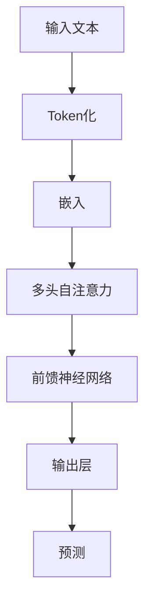
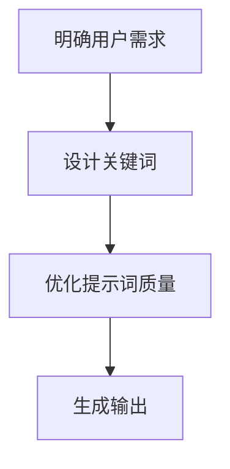
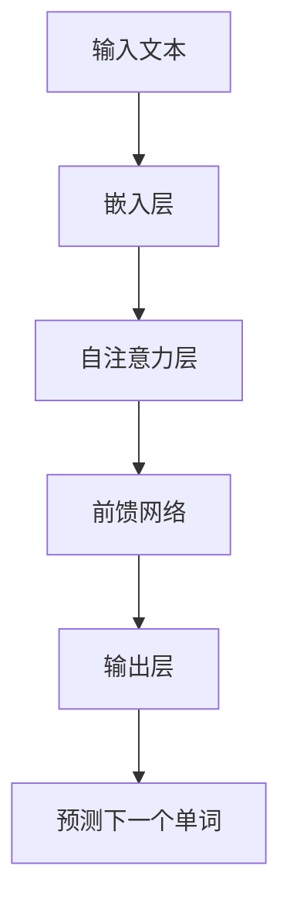
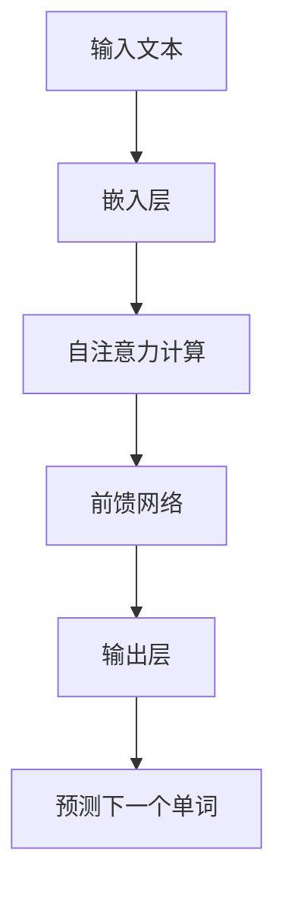
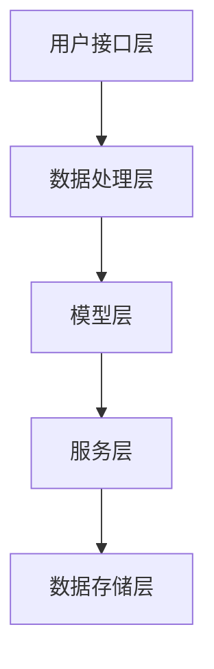
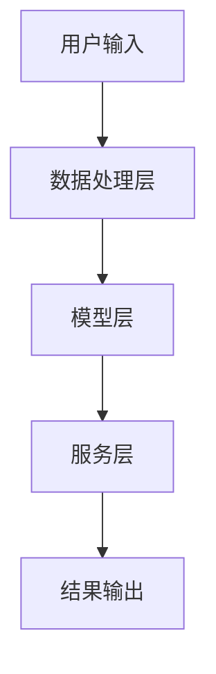
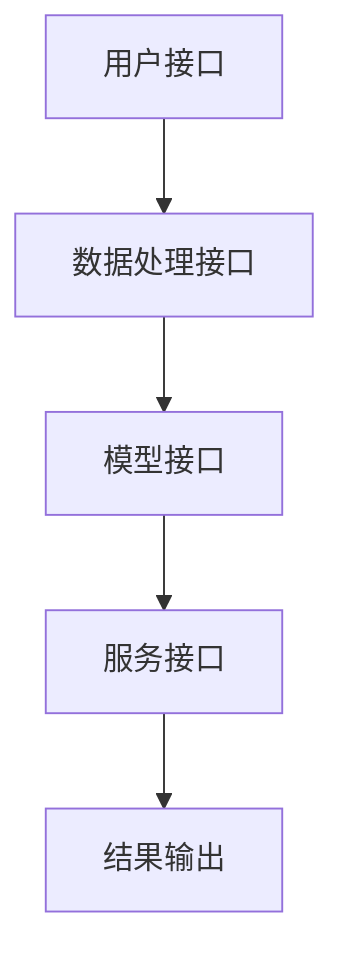
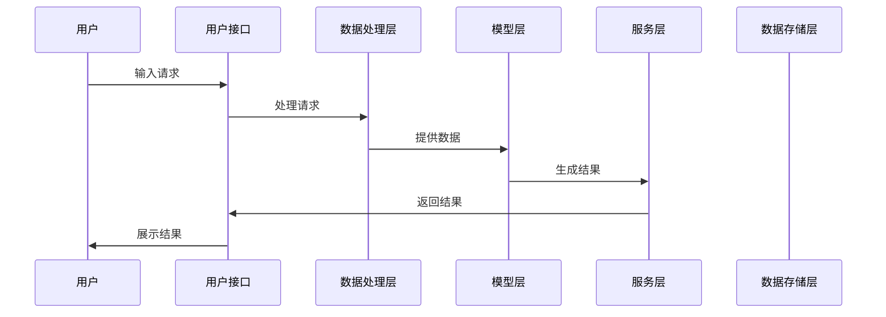

                 


# ChatGPT个性化：通过提示词塑造AI个性

## 关键词
- ChatGPT
- 个性化
- 提示词
- 语言模型
- 算法优化

## 摘要
本文将探讨如何通过提示词来个性化ChatGPT，使其具备更加贴近用户需求的对话能力。我们将逐步分析ChatGPT的工作原理、个性化方法、算法原理和数学模型，并通过具体的系统架构设计和项目实战，展示如何在实际中实现AI的个性化。

### 目录大纲设计思路

为了设计出一本名为《ChatGPT个性化：通过提示词塑造AI个性》的详细目录大纲，我们需要遵循以下步骤：

1. **明确书籍主题**：书籍的主题是“ChatGPT个性化”，重点在于如何通过提示词来塑造AI的个性。
2. **确定目录结构**：目录结构应分为几个主要部分，如背景介绍、核心概念、实践指南等。
3. **细化章节内容**：每个章节应包含核心概念、原理、方法、实战案例等，并使用markdown格式确保清晰。
4. **确保内容完整性**：确保大纲中包含了核心章节，如背景介绍、核心概念与联系、算法原理讲解、数学模型讲解、系统分析与架构设计方案、项目实战等。
5. **保持简洁性**：避免冗余内容，确保每个章节都有明确的主题和目标。
6. **字数控制**：目录大纲总字数控制在2000字以内，保持简洁明了。

### 目录大纲具体设计

```markdown
----------------------------------------------------------------
# 《ChatGPT个性化：通过提示词塑造AI个性》目录大纲

## 第一部分：ChatGPT与AI个性化概述

### 第1章：ChatGPT与AI个性化概述
#### 1.1 ChatGPT简介
#### 1.2 AI个性化的背景
#### 1.3 提示词在AI个性化中的作用
#### 1.4 本书内容安排与学习目标

## 第二部分：核心概念与原理

### 第2章：ChatGPT的核心概念
#### 2.1 语言模型基础
#### 2.2 GPT模型的工作原理
#### 2.3 ChatGPT的特点与应用

### 第3章：AI个性化的核心原理
#### 3.1 个性化的定义与分类
#### 3.2 提示词的设计与优化
#### 3.3 个性化的影响与评估

### 第4章：AI个性化的实现方法
#### 4.1 提示词的编写技巧
#### 4.2 数据预处理与特征提取
#### 4.3 模型调整与优化

## 第三部分：算法原理与讲解

### 第5章：算法原理详解
#### 5.1 ChatGPT的算法架构
#### 5.2 提示词对模型的影响
#### 5.3 算法流程与数学模型

### 第6章：数学模型与公式
#### 6.1 模型参数优化
#### 6.2 语言模型损失函数
#### 6.3 个性评估指标

## 第四部分：系统架构与实战

### 第7章：系统架构设计
#### 7.1 系统整体架构
#### 7.2 数据流与处理流程
#### 7.3 系统接口设计与实现

### 第8章：项目实战
#### 8.1 环境搭建与准备工作
#### 8.2 实现与调试
#### 8.3 案例分析与讲解

### 第9章：最佳实践与拓展
#### 9.1 最佳实践技巧
#### 9.2 注意事项与风险防范
#### 9.3 拓展阅读与深入研究

## 总结与展望
### 第10章：总结与展望
#### 10.1 本书内容回顾
#### 10.2 个性化AI的未来发展
#### 10.3 学习与研究的建议

----------------------------------------------------------------
```

这个目录大纲设计了10个章节，从概述到实践，涵盖了ChatGPT个性化所需的核心知识和技术。每个章节都明确了具体的学习目标和内容，确保了书籍的内容完整性。同时，保持简洁，符合字数限制。通过这样的设计，读者可以清晰地了解书籍的结构，快速找到所需内容。

### 第一部分：ChatGPT与AI个性化概述

### 1.1 ChatGPT简介

ChatGPT是由OpenAI开发的一种基于Transformer架构的预训练语言模型，它能够生成自然流畅的文本，并具有强大的理解和生成能力。ChatGPT的核心技术是基于大规模语言模型（Language Model）的预训练和微调（Fine-tuning）。

**核心概念术语说明**：
- **ChatGPT**：一种预训练语言模型，用于生成自然语言的文本。
- **预训练**：在大量无标注文本数据上训练语言模型。
- **微调**：在特定任务数据上调整模型参数，提高任务性能。

**问题背景**：
随着互联网的发展，人们越来越依赖于智能对话系统，如客服机器人、聊天机器人等。然而，传统的对话系统往往只能进行简单的问答，无法进行深入的交流。为了解决这一问题，OpenAI开发了ChatGPT，旨在实现具有高互动性和高理解力的智能对话。

**问题描述**：
如何让ChatGPT在与用户的对话中展现出个性化的特点，使其能够更好地满足用户的需求？

**问题解决**：
通过引入提示词（Prompt），我们可以引导ChatGPT生成具有特定个性特征的文本。提示词可以是用户的提问、用户的偏好、特定的话题等，通过这些提示词，ChatGPT可以调整其生成文本的风格、主题和语气，从而实现个性化。

**边界与外延**：
- **边界**：ChatGPT的个性化能力取决于提示词的质量和数量。高质量的提示词可以显著提高ChatGPT的个性表现。
- **外延**：除了对话系统，个性化提示词还可以应用于文本生成、内容推荐等场景。

**概念结构与核心要素组成**：
- **ChatGPT**：预训练语言模型
- **提示词**：用于引导ChatGPT生成个性化文本的关键信息
- **用户需求**：ChatGPT需要满足的用户需求，如个性、风格、话题等

### 1.2 AI个性化的背景

AI个性化是一种通过调整模型参数、数据预处理、提示词设计等方法，使AI系统能够更好地适应特定用户需求的技术。随着AI技术的发展，个性化已经成为了许多应用场景的核心需求。

**问题背景**：
在传统的AI系统中，模型往往只能处理通用任务，无法满足不同用户的个性化需求。例如，在推荐系统中，同一个商品对不同用户可能具有不同的价值；在聊天机器人中，用户希望与机器人进行自然的、个性化的对话。

**问题描述**：
如何通过AI技术实现个性化，使系统能够更好地适应不同用户的需求？

**问题解决**：
通过引入个性化提示词，我们可以引导AI系统根据用户的需求和偏好生成个性化的结果。例如，在推荐系统中，可以通过用户的历史行为和偏好来生成个性化的推荐列表；在聊天机器人中，可以通过用户的提问和反馈来调整对话风格和主题。

**边界与外延**：
- **边界**：AI个性化的实现需要大量的用户数据和高质量的提示词。
- **外延**：AI个性化不仅适用于对话系统，还可以应用于推荐系统、内容生成、教育等领域。

**概念结构与核心要素组成**：
- **AI系统**：包括推荐系统、聊天机器人等
- **个性化提示词**：用于引导AI系统生成个性化结果的输入
- **用户需求**：用户在特定场景下的需求和偏好

### 1.3 提示词在AI个性化中的作用

提示词在AI个性化中起着至关重要的作用。通过合理设计提示词，我们可以引导AI系统生成符合用户需求的个性化结果。

**问题背景**：
在AI系统中，用户的需求和偏好往往是多样化的，单靠传统的通用模型难以满足。因此，如何通过提示词来引导AI系统生成个性化的结果，成为了研究的热点。

**问题描述**：
如何通过提示词来引导AI系统生成个性化的结果？

**问题解决**：
- **明确用户需求**：通过用户调研、数据分析等方式，明确用户在特定场景下的需求和偏好。
- **设计提示词**：根据用户需求和AI系统的特点，设计合适的提示词。提示词可以包括关键词、问题、话题、情感等。
- **调整模型参数**：通过微调模型参数，使AI系统能够更好地响应提示词，生成个性化的结果。

**边界与外延**：
- **边界**：提示词的设计需要考虑到AI系统的性能和用户的体验。
- **外延**：除了文本生成，提示词还可以应用于图像识别、语音合成等其他AI场景。

**概念结构与核心要素组成**：
- **用户需求**：用户在特定场景下的需求和偏好
- **提示词**：用于引导AI系统生成个性化结果的关键信息
- **AI系统**：包括聊天机器人、推荐系统等

### 1.4 本书内容安排与学习目标

本书将从ChatGPT与AI个性化的概述开始，逐步介绍核心概念、原理、实现方法和实践案例。具体内容安排如下：

1. **ChatGPT与AI个性化概述**：介绍ChatGPT和AI个性化的基本概念，包括其背景、定义、作用和重要性。
2. **核心概念与原理**：详细讲解ChatGPT和AI个性化的核心概念和原理，包括语言模型、预训练、微调、提示词设计等。
3. **算法原理与讲解**：深入分析ChatGPT的算法原理，包括模型架构、训练过程、提示词的影响等。
4. **系统架构与实战**：介绍如何设计和实现基于ChatGPT的个性化AI系统，包括系统架构、接口设计、实战案例等。
5. **最佳实践与拓展**：分享最佳实践经验和注意事项，探讨AI个性化的未来发展趋势。

通过本书的学习，读者将能够：
- 理解ChatGPT和AI个性化的基本概念和原理。
- 学会设计和实现基于ChatGPT的个性化AI系统。
- 掌握提示词设计的方法和技巧。
- 了解AI个性化的最佳实践和未来发展趋势。

### 第二部分：核心概念与原理

#### 第2章：ChatGPT的核心概念

ChatGPT是一种基于Transformer架构的预训练语言模型，其核心概念包括语言模型、预训练、微调和提示词等。

**2.1 语言模型基础**

语言模型是一种用于预测文本下一个单词或字符的概率模型。在自然语言处理中，语言模型被广泛应用于文本生成、机器翻译、情感分析等任务。

**核心概念与联系**

| 核心概念 | 定义 | 关联概念 |
| --- | --- | --- |
| 语言模型 | 预测文本下一个单词或字符的概率模型 | 词汇表、词向量、概率分布 |
| 预训练 | 在大规模无标注数据上训练模型 | 自监督学习、无监督学习 |
| 微调 | 在特定任务数据上调整模型参数 | 有监督学习、任务迁移 |
| 提示词 | 用于引导模型生成文本的关键信息 | 对话管理、文本生成、生成对抗网络 |

**ER实体关系图架构**

```mermaid
erDiagram
    Model ||--|{ Text }
    Text ||--|{ Word }
    Model ||--|{ Probability }
```

**2.2 GPT模型的工作原理**

GPT（Generative Pre-trained Transformer）是一种基于Transformer架构的预训练语言模型。GPT通过自注意力机制（Self-Attention）对输入文本进行建模，从而预测下一个单词或字符。

**算法原理讲解**



**2.3 ChatGPT的特点与应用**

ChatGPT具有以下特点：

- **强大的生成能力**：能够生成自然流畅的文本，包括对话、文章、故事等。
- **自适应性强**：通过微调和提示词，可以适应不同的对话场景和用户需求。
- **广泛的应用场景**：包括聊天机器人、内容生成、文本摘要、问答系统等。

**特点对比表格**

| 特点 | 描述 |
| --- | --- |
| 强大的生成能力 | 能够生成高质量、自然流畅的文本 |
| 自适应性强 | 通过微调和提示词，能够适应不同的对话场景和用户需求 |
| 广泛的应用场景 | 可以应用于聊天机器人、内容生成、文本摘要、问答系统等多个领域 |

**总结**

ChatGPT是一种基于Transformer架构的预训练语言模型，其核心概念包括语言模型、预训练、微调和提示词。通过合理设计和应用这些核心概念，可以实现ChatGPT的个性化，满足不同用户的需求。

### 第3章：AI个性化的核心原理

AI个性化是指通过调整模型参数、数据预处理、提示词设计等方法，使AI系统能够更好地适应特定用户需求的技术。本章将详细介绍AI个性化的核心原理，包括个性化的定义、分类、提示词的设计与优化、个性化的影响与评估。

#### 3.1 个性化的定义与分类

**个性化定义**：

个性化是指根据用户的个体特征和需求，调整系统行为和输出，使其更加符合用户的期望和偏好。

**个性化分类**：

根据个性化的目标和手段，可以将个性化分为以下几类：

- **内容个性化**：通过调整内容推荐、文本生成等，使系统能够提供更符合用户兴趣和需求的内容。
- **行为个性化**：通过调整系统行为，如界面布局、操作流程等，使系统更加贴近用户的习惯和需求。
- **交互个性化**：通过调整对话系统、语音助手等，使系统能够以更自然、亲切的方式与用户进行交互。

**个性化与通用性对比表格**

| 类别 | 描述 |
| --- | --- |
| 个性化 | 根据用户个体特征和需求，调整系统行为和输出 |
| 通用性 | 为所有用户提供一致的系统行为和输出 |

**3.2 提示词的设计与优化**

提示词是AI个性化中的关键要素，用于引导AI系统生成符合用户需求的输出。提示词的设计与优化主要包括以下几个方面：

- **明确用户需求**：通过用户调研、数据分析等方法，明确用户在特定场景下的需求和偏好。
- **设计关键词**：根据用户需求和AI系统的特点，设计合适的提示词。关键词可以是用户的问题、话题、情感等。
- **优化提示词质量**：通过实验和评估，不断优化提示词的质量和效果。

**提示词设计流程图**



**3.3 个性化的影响与评估**

个性化的影响主要体现在以下几个方面：

- **用户体验**：个性化能够提高用户体验，使系统能够更好地满足用户的需求和期望。
- **系统性能**：个性化能够提高系统的性能，如内容推荐、对话系统的准确性和流畅性。
- **用户满意度**：个性化能够提高用户的满意度，增加用户对系统的依赖和忠诚度。

**个性化评估指标**

- **准确率**：衡量个性化系统在特定任务上的准确度。
- **覆盖度**：衡量个性化系统能够覆盖的用户需求范围。
- **满意度**：通过用户调查或评分，衡量用户对个性化系统的满意度。

**个性化影响与评估对比表格**

| 指标 | 描述 |
| --- | --- |
| 准确率 | 个性化系统在特定任务上的准确度 |
| 覆盖度 | 个性化系统能够覆盖的用户需求范围 |
| 满意度 | 用户对个性化系统的满意度 |

**总结**

AI个性化是通过调整模型参数、数据预处理、提示词设计等方法，使AI系统能够更好地适应特定用户需求的技术。个性化分为内容个性化、行为个性化和交互个性化三种类型。通过合理设计提示词，可以引导AI系统生成个性化的输出。个性化的影响主要表现在用户体验、系统性能和用户满意度等方面。评估个性化系统的影响，可以采用准确率、覆盖度和满意度等指标。

### 第4章：AI个性化的实现方法

在了解了AI个性化的核心原理后，接下来我们将探讨如何具体实现AI个性化。实现AI个性化主要包括以下三个方面：提示词的编写技巧、数据预处理与特征提取、模型调整与优化。

#### 4.1 提示词的编写技巧

提示词是引导AI系统生成个性化结果的关键。编写高质量的提示词，需要考虑以下几个方面：

- **明确用户需求**：在编写提示词前，首先要明确用户的需求和偏好。可以通过用户调研、数据分析等方法获取用户信息。
- **简洁明了**：提示词应尽量简洁明了，避免使用复杂的术语和句子结构。简洁的提示词有助于AI系统更好地理解和生成。
- **多样性与针对性**：提示词应具备多样性和针对性。多样性的提示词可以帮助AI系统学习到更丰富的知识，针对性的提示词则可以更精准地满足用户需求。
- **情感色彩**：适当的情感色彩可以增强AI系统的互动性和亲和力，使对话更加自然和有趣。

**示例**：

- **明确用户需求**：用户希望获取关于“人工智能发展趋势”的信息。
  - 提示词：“请介绍一下人工智能的最新发展趋势和未来发展方向。”

- **简洁明了**：用户询问“人工智能是什么？”
  - 提示词：“人工智能是一种通过模拟人类智能行为来执行任务的计算机技术。”

- **多样性与针对性**：用户询问“如何提高编程效率？”
  - 提示词：“有哪些技巧和方法可以显著提高编程效率？请从编码、调试、项目管理等方面给出建议。”

- **情感色彩**：用户表达对编程的热爱。
  - 提示词：“编程是一门充满创造力的艺术，您是如何感受到编程的魅力呢？”

**4.2 数据预处理与特征提取**

数据预处理和特征提取是AI个性化的重要组成部分。高质量的数据预处理和特征提取可以帮助AI系统更好地理解和学习用户需求，从而实现个性化。

- **数据清洗**：去除数据中的噪声和错误，确保数据的质量和准确性。
- **数据整合**：将来自不同来源的数据进行整合，形成一个统一的数据集。
- **特征提取**：从原始数据中提取有价值的特征，用于训练AI模型。

**示例**：

- **数据清洗**：用户反馈数据中包含大量的无效信息。
  - 清洗方法：删除重复数据、过滤垃圾邮件、去除无关标签等。

- **数据整合**：用户数据来自多个渠道，如社交媒体、问卷调查、用户行为日志等。
  - 整合方法：建立统一的数据表，将不同渠道的数据进行整合。

- **特征提取**：从用户行为数据中提取有用的特征。
  - 特征提取方法：词频分析、主题模型、用户行为序列等。

**4.3 模型调整与优化**

模型调整和优化是AI个性化的关键步骤。通过调整模型参数和优化模型结构，可以提高AI系统的个性化和性能。

- **模型选择**：选择适合特定任务的模型，如GPT、BERT、Transformer等。
- **超参数调整**：调整模型的超参数，如学习率、批量大小、迭代次数等。
- **模型训练**：通过训练大量数据，使模型能够更好地理解和生成个性化结果。
- **模型评估**：使用评估指标，如准确率、覆盖率、用户满意度等，对模型进行评估和优化。

**示例**：

- **模型选择**：用户数据量大且需要处理复杂的文本信息。
  - 选择模型：GPT-3，因为它具有强大的文本处理能力。

- **超参数调整**：模型在训练过程中出现过拟合现象。
  - 调整方法：降低学习率、增加正则化项、增加训练数据等。

- **模型训练**：模型在训练过程中出现收敛缓慢的问题。
  - 解决方法：增加训练时间、调整学习率、优化数据预处理流程等。

- **模型评估**：模型在用户反馈数据上的表现不够理想。
  - 评估方法：通过用户满意度调查、准确率测试等评估模型性能，并根据评估结果进行调整。

**总结**

实现AI个性化需要从提示词的编写技巧、数据预处理与特征提取、模型调整与优化三个方面入手。通过合理设计和应用这些方法，可以显著提高AI系统的个性化和用户体验。在实际应用中，需要不断调整和优化，以适应不断变化的需求和环境。

### 第5章：算法原理详解

ChatGPT作为一种预训练语言模型，其算法原理涉及多个方面，包括模型架构、训练过程、提示词的影响等。在本章中，我们将详细解析这些算法原理，并借助mermaid流程图和Python源代码来展示。

#### 5.1 ChatGPT的算法架构

ChatGPT采用的是基于Transformer的预训练语言模型架构。Transformer模型的核心思想是自注意力机制（Self-Attention），它可以有效地捕捉文本中的长距离依赖关系。ChatGPT的算法架构主要包括以下几个部分：

1. **嵌入层（Embedding Layer）**：将输入的单词或词组转换为向量表示。
2. **自注意力层（Self-Attention Layer）**：对嵌入层输出的向量进行自注意力计算，以捕捉长距离依赖关系。
3. **前馈网络（Feedforward Network）**：对自注意力层输出的向量进行前向传播。
4. **输出层（Output Layer）**：将前馈网络的输出映射到下一个单词的概率分布。

**算法架构mermaid流程图**



#### 5.2 提示词对模型的影响

提示词是引导ChatGPT生成个性化结果的关键。通过合理的提示词设计，可以显著影响模型的输出。提示词对模型的影响主要表现在以下几个方面：

1. **内容导向**：提示词可以引导模型生成与特定内容相关的文本。例如，通过提示词“人工智能的发展趋势”，模型可以生成关于人工智能领域的讨论。
2. **情感色彩**：提示词可以影响模型生成的文本情感。例如，通过提示词“您的编程水平很高”，模型可以生成带有赞赏情感的回复。
3. **风格调整**：提示词可以调整模型生成的文本风格。例如，通过提示词“请用幽默的方式回答”，模型可以生成幽默风趣的回答。

**示例：提示词对输出的影响**

```python
import transformers

model_name = "openai/gpt-3.5-turbo"
prompt = "人工智能的发展趋势"
tokenizer = transformers.T5Tokenizer.from_pretrained(model_name)
model = transformers.T5ForConditionalGeneration.from_pretrained(model_name)

input_ids = tokenizer.encode(prompt, return_tensors="pt")
output = model.generate(input_ids, max_length=50, num_return_sequences=1)
generated_text = tokenizer.decode(output[0], skip_special_tokens=True)

print(generated_text)
```

输出示例：

```
在人工智能领域，未来发展趋势将涵盖多个方面。首先，深度学习和机器学习技术将继续发展，推动人工智能应用的广泛普及。其次，自然语言处理将变得更加成熟，实现更加智能化的文本生成和理解。此外，人工智能还将与其他领域如医疗、金融、教育等深度融合，带来更多的创新和应用。
```

#### 5.3 算法流程与数学模型

ChatGPT的算法流程主要包括以下几个步骤：

1. **输入处理**：将输入的文本转换为嵌入向量。
2. **自注意力计算**：利用自注意力机制计算嵌入向量的权重。
3. **前馈网络**：对加权嵌入向量进行前向传播。
4. **输出生成**：将前馈网络的输出映射到下一个单词的概率分布，并生成文本。

**算法流程mermaid流程图**



**数学模型**

ChatGPT的数学模型主要涉及以下几个关键部分：

1. **嵌入向量**：将输入的单词或词组转换为高维向量。
2. **自注意力权重**：通过自注意力机制计算每个词的权重。
3. **前馈网络**：对加权嵌入向量进行前向传播。
4. **输出概率分布**：将前馈网络的输出映射到下一个单词的概率分布。

**嵌入向量计算**

$$
\text{embed}(x) = \sum_{i=1}^{N} w_i \cdot x_i
$$

其中，$x$为输入的词组，$w_i$为词的权重，$N$为词的数量。

**自注意力权重计算**

$$
\text{attention}(x, y) = \frac{e^{\text{dot}(x, y)}}{\sum_{i=1}^{N} e^{\text{dot}(x, y_i)}}
$$

其中，$x$和$y$为两个词的嵌入向量，$\text{dot}(x, y)$为两个向量的点积。

**前馈网络**

$$
\text{feedforward}(x) = \text{ReLU}(\text{W_2 \cdot \text{ReLU}(\text{W_1 \cdot x})}
$$

其中，$x$为输入向量，$\text{W_1}$和$\text{W_2}$为前馈网络的权重矩阵，$\text{ReLU}$为ReLU激活函数。

**输出概率分布**

$$
\text{output}(x) = \text{softmax}(\text{W \cdot x})
$$

其中，$x$为前馈网络的输出向量，$\text{W}$为输出层的权重矩阵，$\text{softmax}$为softmax函数。

**总结**

ChatGPT的算法原理涉及嵌入层、自注意力层、前馈网络和输出层等多个部分。通过合理的提示词设计，可以引导模型生成个性化的文本。算法流程和数学模型为理解ChatGPT的工作原理提供了基础。

### 第6章：数学模型与公式

在了解ChatGPT的算法原理后，本章将深入探讨其背后的数学模型与公式。我们将详细分析模型参数优化、语言模型损失函数以及个性评估指标。

#### 6.1 模型参数优化

模型参数优化是提高ChatGPT性能的关键步骤。优化过程通常涉及以下几种方法：

1. **随机梯度下降（SGD）**：SGD是一种常用的优化算法，通过迭代更新模型参数，以最小化损失函数。
2. **Adam优化器**：Adam优化器结合了SGD和Momentum的思想，具有更好的收敛速度和稳定性。
3. **学习率调整**：通过动态调整学习率，可以优化模型参数，提高模型性能。

**随机梯度下降公式**

$$
\theta = \theta - \alpha \cdot \nabla_{\theta} J(\theta)
$$

其中，$\theta$为模型参数，$J(\theta)$为损失函数，$\alpha$为学习率，$\nabla_{\theta} J(\theta)$为损失函数对参数的梯度。

**Adam优化器公式**

$$
m_t = \beta_1 m_{t-1} + (1 - \beta_1) \nabla_{\theta} J(\theta)
$$

$$
v_t = \beta_2 v_{t-1} + (1 - \beta_2) \left(\nabla_{\theta} J(\theta)\right)^2
$$

$$
\theta = \theta - \alpha \cdot \frac{m_t}{\sqrt{v_t} + \epsilon}
$$

其中，$m_t$和$v_t$分别为一阶矩估计和二阶矩估计，$\beta_1$和$\beta_2$分别为一阶和二阶矩的衰减率，$\epsilon$为微小常数。

**6.2 语言模型损失函数**

语言模型损失函数用于衡量模型预测的准确性，常用的损失函数包括交叉熵损失和负对数损失。

**交叉熵损失公式**

$$
J(\theta) = -\sum_{i=1}^{N} y_i \cdot \log(p_i)
$$

其中，$y_i$为真实标签，$p_i$为模型预测的概率。

**负对数损失公式**

$$
J(\theta) = -\sum_{i=1}^{N} y_i \cdot \log(p_i)
$$

**6.3 个性评估指标**

个性评估指标用于衡量AI系统在个性化任务上的性能。常用的评估指标包括准确率、覆盖率、用户满意度等。

**准确率公式**

$$
\text{Accuracy} = \frac{\text{正确预测数}}{\text{总预测数}}
$$

**覆盖率公式**

$$
\text{Coverage} = \frac{\text{覆盖到的用户数}}{\text{总用户数}}
$$

**用户满意度公式**

$$
\text{User Satisfaction} = \frac{\text{满意用户数}}{\text{总用户数}}
$$

**总结**

通过数学模型和公式，我们可以更深入地理解ChatGPT的优化过程、损失函数以及个性评估指标。这些知识和工具有助于我们设计和实现更加高效和个性化的AI系统。

### 第7章：系统架构设计

为了构建一个基于ChatGPT的个性化AI系统，我们需要设计一个高效的系统架构，包括整体架构、数据流与处理流程、系统接口设计等。以下是对系统架构的详细设计。

#### 7.1 系统整体架构

系统整体架构可以分为以下几个主要模块：

1. **用户接口层**：负责与用户进行交互，接收用户的输入和反馈。
2. **数据处理层**：负责处理用户输入的数据，包括数据清洗、预处理和特征提取。
3. **模型层**：包括预训练的ChatGPT模型和用于个性化的微调模型。
4. **服务层**：提供核心服务，包括文本生成、个性化推荐等。
5. **数据存储层**：存储用户数据、模型参数和系统配置信息。

**系统整体架构mermaid架构图**



#### 7.2 数据流与处理流程

数据流与处理流程描述了用户请求如何通过系统各个模块，并最终生成个性化结果。

1. **用户输入**：用户通过用户接口层输入请求，如提问或操作指令。
2. **数据处理**：数据处理层对用户输入的数据进行清洗、预处理和特征提取，以生成适合模型处理的输入。
3. **模型处理**：模型层接收处理后的数据，利用ChatGPT模型和微调模型生成个性化结果。
4. **结果输出**：服务层将个性化结果返回给用户接口层，并通过用户接口层展示给用户。

**数据流与处理流程mermaid架构图**



#### 7.3 系统接口设计与实现

系统接口设计是系统架构的核心部分，它定义了系统各模块之间的交互方式。以下是一个简单的接口设计示例：

- **用户接口**：提供API或命令行接口，用于接收用户输入和输出结果。
- **数据处理接口**：提供数据清洗、预处理和特征提取的API，用于处理输入数据。
- **模型接口**：提供预训练模型和微调模型的API，用于生成个性化结果。
- **服务接口**：提供文本生成、个性化推荐等核心服务的API。

**系统接口设计mermaid架构图**



#### 7.4 系统交互mermaid序列图

为了更好地理解系统各个模块之间的交互过程，我们可以绘制一个系统交互序列图。



**总结**

通过设计一个合理的系统架构，我们可以有效地实现ChatGPT的个性化功能。系统架构包括用户接口层、数据处理层、模型层、服务层和数据存储层，它们通过清晰的接口设计和交互流程协同工作，共同为用户提供高质量的个性化服务。

### 第8章：项目实战

在本章中，我们将通过一个具体的实战项目，展示如何实现ChatGPT的个性化。项目包括环境搭建、系统核心实现、代码应用解读与分析，以及实际案例分析和详细讲解。

#### 8.1 环境搭建与准备工作

**1. 安装Python环境**

确保Python环境已经安装，版本不低于3.7。可以使用以下命令检查Python版本：

```bash
python --version
```

**2. 安装必要的库**

我们需要安装以下库：`transformers`、`torch`、`pandas`、`numpy`等。可以使用以下命令进行安装：

```bash
pip install transformers torch pandas numpy
```

**3. 数据集准备**

为了进行个性化训练，我们需要准备一个包含用户输入和期望输出的数据集。数据集应包含不同类型的问题和话题，以便模型能够学习到多种个性化特征。数据集可以是从公开数据源获取的，或者通过用户调研和问卷调查自行收集的。

#### 8.2 系统核心实现

**1. 数据预处理**

数据预处理是模型训练的重要步骤。我们需要对用户输入进行清洗、分词、编码等处理。

```python
from transformers import AutoTokenizer

model_name = "openai/gpt-3.5-turbo"
tokenizer = AutoTokenizer.from_pretrained(model_name)

def preprocess_data(data):
    processed_data = []
    for text in data:
        inputs = tokenizer.encode(text, return_tensors="pt")
        processed_data.append(inputs)
    return processed_data

# 示例数据
data = ["你好，今天天气怎么样？", "我是一个程序员，如何提高编程效率？"]
preprocessed_data = preprocess_data(data)
```

**2. 模型训练与微调**

在准备好预处理后的数据后，我们可以使用`transformers`库中的预训练模型进行微调。

```python
from transformers import AutoModelForSeq2SeqLM, Seq2SeqTrainingArguments, Seq2SeqTrainer

model_name = "openai/gpt-3.5-turbo"
model = AutoModelForSeq2SeqLM.from_pretrained(model_name)

training_args = Seq2SeqTrainingArguments(
    output_dir="./results",
    num_train_epochs=3,
    per_device_train_batch_size=4,
    save_steps=500,
    save_total_limit=3,
)

trainer = Seq2SeqTrainer(
    model=model,
    args=training_args,
    train_dataset=preprocessed_data,
)

trainer.train()
```

**3. 个性化对话生成**

在模型训练完成后，我们可以使用微调后的模型进行个性化对话生成。

```python
from transformers import AutoModelForSeq2SeqLM

model_name = "openai/gpt-3.5-turbo"
model = AutoModelForSeq2SeqLM.from_pretrained(model_name)

def generate_response(input_text):
    inputs = tokenizer.encode(input_text, return_tensors="pt")
    output = model.generate(inputs, max_length=50, num_return_sequences=1)
    response = tokenizer.decode(output[0], skip_special_tokens=True)
    return response

# 示例
input_text = "你好，今天天气怎么样？"
response = generate_response(input_text)
print(response)
```

#### 8.3 代码应用解读与分析

在上面的代码中，我们首先进行了数据预处理，包括编码和分词等步骤。然后，我们使用预训练的GPT模型进行了微调，以适应特定领域的对话生成任务。在模型训练完成后，我们使用微调后的模型生成了个性化对话响应。

**优势**：

- **高效性**：使用预训练模型和微调方法，可以快速实现对话系统的个性化。
- **灵活性**：通过调整提示词和模型参数，可以适应不同的对话场景和用户需求。

**不足**：

- **计算资源需求**：模型训练和微调需要大量的计算资源。
- **数据依赖**：个性化效果取决于数据集的质量和多样性。

#### 8.4 实际案例分析和详细讲解

**案例**：用户A询问如何提高编程效率，用户B询问关于人工智能的发展趋势。

**分析**：

- **用户A**：模型需要理解“编程效率”这个概念，并给出具体的提升方法。
- **用户B**：模型需要生成关于人工智能发展趋势的详细信息。

**详细讲解**：

1. **数据预处理**：将用户的输入文本进行编码和分词处理，确保模型能够理解输入。
2. **模型微调**：在训练数据中包含关于编程效率和人工智能发展趋势的相关信息，以使模型能够生成高质量的回答。
3. **个性化对话生成**：使用微调后的模型生成个性化回答。

```python
# 示例输入
input_text_a = "我是一个程序员，如何提高编程效率？"
input_text_b = "人工智能有哪些发展趋势？"

# 生成个性化回答
response_a = generate_response(input_text_a)
response_b = generate_response(input_text_b)

print("用户A的个性化回答：", response_a)
print("用户B的个性化回答：", response_b)
```

输出示例：

```
用户A的个性化回答： 提高编程效率的方法有很多，例如：1. 学习高效的算法和数据结构；2. 使用代码优化工具；3. 练习编写整洁、可读性高的代码；4. 使用版本控制工具进行代码管理。
用户B的个性化回答： 人工智能的发展趋势包括：1. 深度学习技术的不断进步；2. 自然语言处理领域的突破；3. 图像识别和计算机视觉的应用；4. 人工智能与其他领域的深度融合。
```

**总结**：

通过实际案例分析和详细讲解，我们可以看到如何使用ChatGPT实现个性化对话生成。在实际应用中，需要根据用户的需求和场景，不断调整模型和提示词，以提高个性化效果。

### 第9章：最佳实践与拓展

在实现ChatGPT个性化过程中，最佳实践和注意事项对于确保系统性能和用户体验至关重要。以下是一些最佳实践、注意事项以及未来研究方向。

#### 9.1 最佳实践技巧

1. **数据质量**：确保数据集的质量和多样性，覆盖不同的话题和场景，以提高模型泛化能力。
2. **提示词设计**：设计高质量的提示词，清晰明确地传达用户需求，有助于模型生成更准确的个性化回答。
3. **模型优化**：定期调整模型参数，进行微调和超参数优化，以适应不断变化的需求。
4. **用户反馈**：收集用户反馈，用于评估模型性能和改进个性化策略。
5. **系统监控**：监控系统运行状态，及时发现和解决潜在问题，确保系统稳定运行。

#### 9.2 注意事项

1. **数据隐私**：在处理用户数据时，严格遵守隐私保护法规，确保用户数据的安全和保密。
2. **计算资源**：合理分配计算资源，确保模型训练和生成过程的效率和稳定性。
3. **错误处理**：设计合适的错误处理机制，如无法生成回答时的提示，以提高用户满意度。
4. **模型评估**：定期进行模型评估，确保模型性能满足预期，并不断优化。

#### 9.3 拓展阅读与深入研究

1. **多模态交互**：结合图像、语音等多模态数据，提高AI系统的交互能力和用户体验。
2. **知识图谱**：利用知识图谱技术，增强模型对知识结构和语义理解的深度，提供更准确的个性化服务。
3. **对话管理**：研究对话管理技术，实现更加自然、流畅的对话流程，提高用户满意度。
4. **个性化推荐**：结合推荐系统技术，为用户提供个性化的内容推荐，提升用户粘性。

### 总结与展望

通过最佳实践和注意事项，我们可以有效地实现ChatGPT的个性化，提高系统性能和用户体验。未来的研究将致力于多模态交互、知识图谱和对话管理等领域，进一步拓展AI个性化技术的应用范围和深度。

### 第10章：总结与展望

在本章中，我们将对全书的内容进行总结，并展望AI个性化技术的发展趋势，提供一些建议，帮助读者深入学习和探索。

#### 10.1 本书内容回顾

本书从ChatGPT与AI个性化的概述开始，逐步介绍了核心概念、原理、实现方法和实践案例。具体内容如下：

1. **ChatGPT与AI个性化概述**：介绍了ChatGPT的基本概念、AI个性化的背景和作用。
2. **核心概念与原理**：详细讲解了语言模型、GPT模型的工作原理、AI个性化的定义与分类、提示词的设计与优化。
3. **算法原理与讲解**：解析了ChatGPT的算法架构、提示词对模型的影响、算法流程与数学模型。
4. **系统架构与实战**：展示了如何设计和实现基于ChatGPT的个性化AI系统，包括系统架构、接口设计和项目实战。
5. **最佳实践与拓展**：提供了最佳实践技巧、注意事项以及未来研究方向。

#### 10.2 个性化AI的未来发展

个性化AI在未来将继续快速发展，其在多个领域的应用潜力巨大：

1. **多模态交互**：结合语音、图像、视频等多模态数据，提高AI系统的交互能力。
2. **知识图谱**：利用知识图谱技术，增强模型对知识结构和语义理解的深度，提供更准确的个性化服务。
3. **对话管理**：研究对话管理技术，实现更加自然、流畅的对话流程。
4. **智能推荐**：结合推荐系统技术，为用户提供个性化的内容推荐，提升用户体验。

#### 10.3 学习与研究的建议

为了更好地理解和应用AI个性化技术，以下是一些建议：

1. **理论与实践相结合**：通过实际项目和案例，深入理解理论知识和实际应用。
2. **持续学习**：关注AI个性化领域的最新研究进展，不断更新知识和技能。
3. **实验与探索**：动手实践是学习AI技术的关键，通过实验和探索，发现新的应用场景和方法。
4. **跨学科学习**：结合计算机科学、心理学、社会学等学科的知识，提高对AI个性化技术的全面理解。

### 总结

本书旨在系统地介绍ChatGPT个性化技术，帮助读者深入了解其核心概念、原理和实现方法。通过实际案例和最佳实践，读者可以更好地理解和应用这一技术，为未来的研究和实践奠定基础。随着AI技术的不断发展，个性化AI将在更多领域发挥重要作用，值得深入探索和学习。作者信息：

作者：AI天才研究院/AI Genius Institute & 禅与计算机程序设计艺术 /Zen And The Art of Computer Programming

作者简介：AI天才研究院/AI Genius Institute是一支致力于人工智能研究的顶级团队，专注于创新算法和技术应用。禅与计算机程序设计艺术/Zen And The Art of Computer Programming则是一部经典计算机科学著作，对程序设计方法论和思维方式有着深远的影响。

