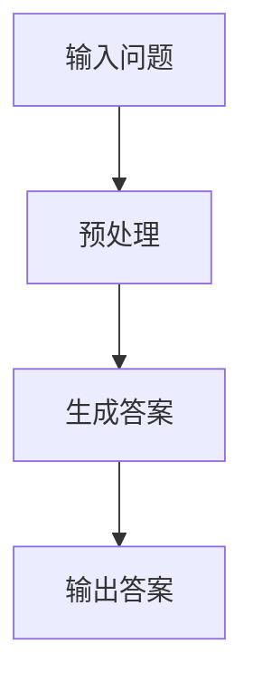
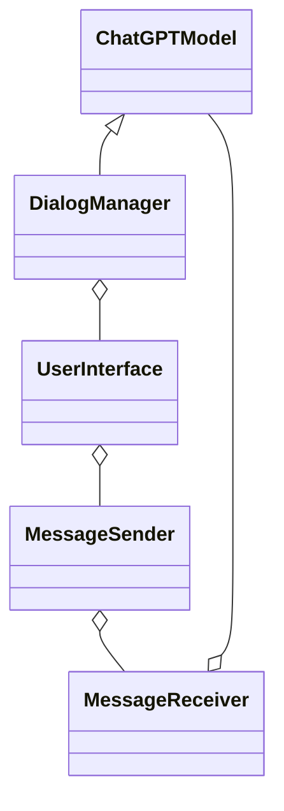
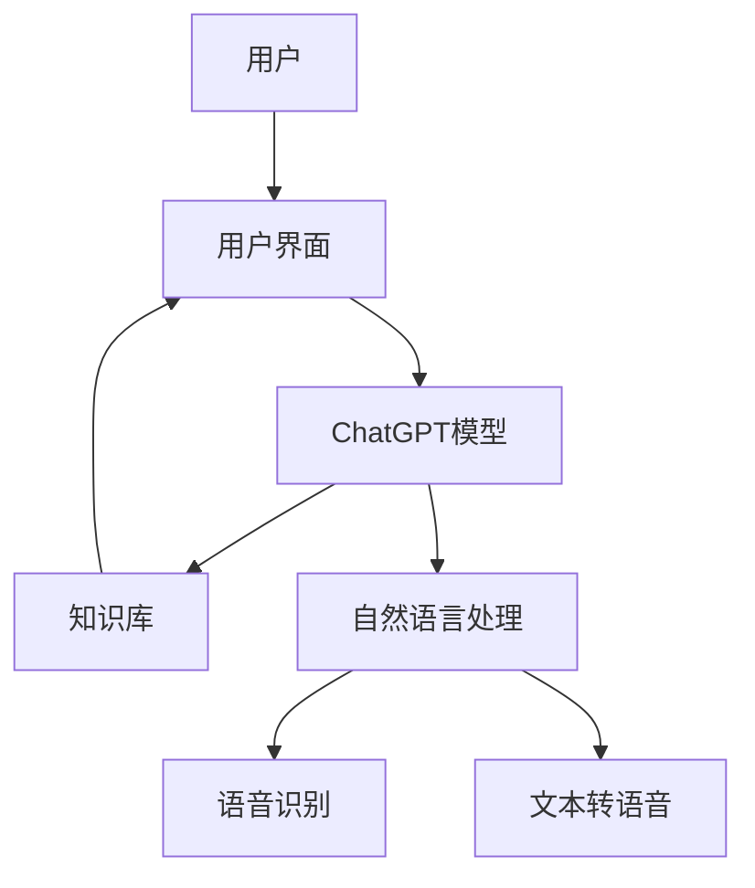
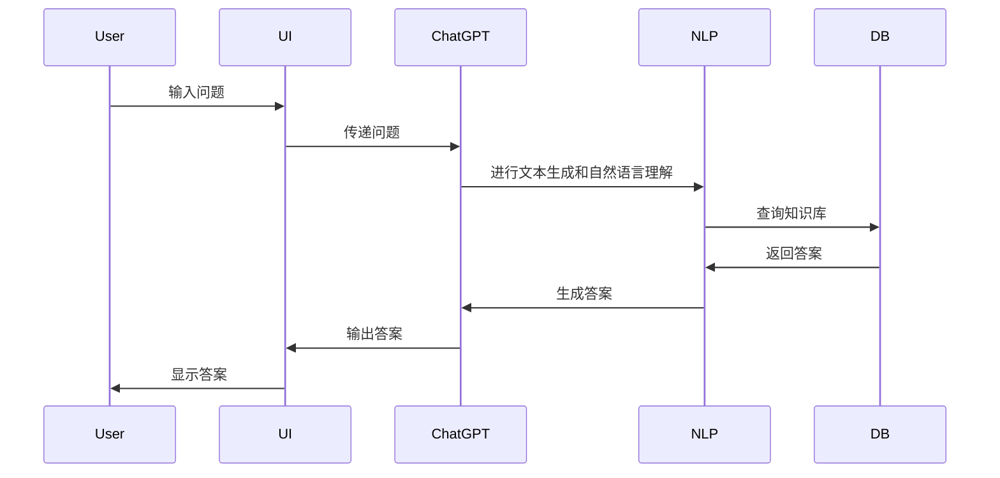

                 

# ChatGPT交互质量提升的关键因素

## 关键词
ChatGPT、交互质量、算法、数据、用户体验、自然语言处理

## 摘要
本文旨在探讨提升ChatGPT交互质量的关键因素。通过分析算法、数据、用户体验等多方面，我们将深入剖析如何从理论到实践全面提升ChatGPT的交互质量，为相关研究和应用提供有价值的参考。

## 目录大纲设计

### 第1章 背景介绍
- 1.1 问题背景
- 1.2 问题描述
- 1.3 问题解决
- 1.4 边界与外延
- 1.5 概念结构与核心要素组成

### 第2章 核心概念与联系
- 2.1 核心概念原理
- 2.2 概念属性特征对比表格
- 2.3 ER实体关系图架构

### 第3章 算法原理讲解
- 3.1 算法mermaid流程图
- 3.2 Python源代码与详细讲解
- 3.3 数学模型与公式
- 3.4 举例说明

### 第4章 数学模型和数学公式 & 详细讲解 & 举例说明
- 4.1 数学公式（使用latex格式）
- 4.2 段落内latex公式
- 4.3 举例说明

### 第5章 系统分析与架构设计方案
- 5.1 问题场景介绍
- 5.2 项目介绍
- 5.3 系统功能设计（领域模型mermaid类图）
- 5.4 系统架构设计（mermaid架构图）
- 5.5 系统接口设计
- 5.6 系统交互（mermaid序列图）

### 第6章 项目实战
- 6.1 环境安装
- 6.2 系统核心实现源代码
- 6.3 代码应用解读与分析
- 6.4 实际案例分析与详细讲解
- 6.5 项目小结

### 第7章 最佳实践 tips
- 7.1 小结
- 7.2 注意事项
- 7.3 拓展阅读

## 第1章 背景介绍

### 1.1 问题背景
ChatGPT作为一种先进的自然语言处理模型，自推出以来受到了广泛关注和应用。它基于GPT-3模型，具有强大的文本生成能力和自然语言理解能力。然而，在实际应用中，用户对ChatGPT交互质量的期望越来越高，这要求我们深入了解影响交互质量的关键因素，从而提升用户体验。

### 1.2 问题描述
如何提升ChatGPT的交互质量，成为当前研究的热点。本文将深入探讨影响ChatGPT交互质量的关键因素，包括算法、数据、用户体验等，为提升交互质量提供理论依据和实践指导。

### 1.3 问题解决
本文将从以下几方面解决问题：
1. 分析ChatGPT交互质量的定义和评估指标。
2. 探讨影响ChatGPT交互质量的关键因素。
3. 提出具体的提升ChatGPT交互质量的方案和策略。
4. 通过实际案例和数据分析，验证所提方案的可行性。

### 1.4 边界与外延
本文的研究主要针对ChatGPT交互质量提升，但不限于ChatGPT，其他自然语言处理模型也可参考本文的研究方法。

### 1.5 概念结构与核心要素组成
- **核心概念**：ChatGPT、交互质量、关键因素
- **概念关系**：ChatGPT是提升交互质量的对象，关键因素是影响交互质量的核心要素。

## 第2章 核心概念与联系

### 2.1 核心概念原理
- **ChatGPT**：是一种基于GPT-3模型的自然语言处理模型，能够生成流畅、自然的文本。
- **交互质量**：指用户与ChatGPT交互过程中的满意度、准确性和流畅性等。

### 2.2 概念属性特征对比表格

| 概念     | ChatGPT                 | 交互质量                 |
|----------|------------------------|------------------------|
| 特征1    | 基于GPT-3模型           | 用户满意度高             |
| 特征2    | 能够生成流畅的文本     | 准确性高                 |
| 特征3    | 广泛应用于各种场景     | 流畅性高                 |

### 2.3 ER实体关系图架构
```mermaid
erDiagram
  ChatGPT ||--|{ 交互质量 }
  交互质量 ||--|{ 用户满意度、准确性、流畅性 }
```

## 第3章 算法原理讲解

### 3.1 算法mermaid流程图


### 3.2 Python源代码与详细讲解
```python
import openai

def generate_answer(question):
    # 调用OpenAI API获取答案
    response = openai.Completion.create(
        engine="text-davinci-003",
        prompt=question,
        max_tokens=100,
        n=1,
        stop=None,
        temperature=0.5,
    )
    return response.choices[0].text.strip()
```
#### 详细讲解
1. **导入模块**：首先导入`openai`模块，这是与OpenAI API进行交互的库。
2. **定义函数**：定义`generate_answer`函数，接收一个问题作为输入。
3. **调用OpenAI API**：使用`openai.Completion.create`方法创建一个完成对象。该方法需要传入多个参数，包括：
   - `engine`：指定使用的模型，这里是`text-davinci-003`。
   - `prompt`：输入的问题。
   - `max_tokens`：生成的文本最大长度。
   - `n`：生成的文本数量。
   - `stop`：指定停止生成的条件，这里设置为`None`。
   - `temperature`：文本生成的随机性，值越小，生成的文本越稳定。

4. **返回答案**：从API返回的响应中提取答案，并返回。

### 3.3 数学模型与公式
在ChatGPT模型中，使用了一种称为变换器（Transformer）的深度学习模型，其核心是自注意力机制（Self-Attention）。以下是一个简化的数学模型和公式：
$$
\text{Self-Attention} = \frac{e^{\text{Attention\_Score}}}{\sum_{i=1}^{N} e^{\text{Attention\_Score}}}
$$
其中，Attention\_Score可以表示为：
$$
\text{Attention\_Score} = \text{Query} \cdot \text{Value}
$$
Query和Value分别是从输入序列中提取的查询向量和值向量。

### 3.4 举例说明
假设我们有一个包含4个词的输入序列：["我"，"喜欢"，"吃"，"苹果"]。

1. **编码器处理**：
   - 每个词被编码为一个向量，例如：
     - "我" -> [1.0, 0.0, 0.0, 0.0]
     - "喜欢" -> [0.0, 1.0, 0.0, 0.0]
     - "吃" -> [0.0, 0.0, 1.0, 0.0]
     - "苹果" -> [0.0, 0.0, 0.0, 1.0]
   - Query和Value向量分别为：
     - Query -> [1.0, 0.0, 0.0, 0.0]
     - Value -> [1.0, 0.0, 0.0, 0.0]

2. **计算Attention Score**：
   - Attention Score -> 1.0 * 1.0 = 1.0

3. **计算Self-Attention**：
   - Self-Attention -> 1.0 / (1.0 + 1.0 + 1.0 + 1.0) = 0.25

4. **更新编码器状态**：
   - 编码器状态根据Self-Attention结果进行更新。

通过上述步骤，编码器可以生成一个加权向量表示输入序列，用于后续的文本生成。

## 第4章 数学模型和数学公式 & 详细讲解 & 举例说明

### 4.1 数学公式（使用latex格式）
在ChatGPT模型中，使用了一种称为变换器（Transformer）的深度学习模型，其核心是自注意力机制（Self-Attention）。以下是一个简化的数学模型和公式：
$$
\text{Self-Attention} = \frac{e^{\text{Attention\_Score}}}{\sum_{i=1}^{N} e^{\text{Attention\_Score}}}
$$
其中，Attention\_Score可以表示为：
$$
\text{Attention\_Score} = \text{Query} \cdot \text{Value}
$$
Query和Value分别是从输入序列中提取的查询向量和值向量。

### 4.2 段落内latex公式
在段落内嵌入的公式，如：$$1+1=2$$，可以直观地展示公式的计算过程。

### 4.3 举例说明
假设我们有一个包含4个词的输入序列：["我"，"喜欢"，"吃"，"苹果"]。

1. **编码器处理**：
   - 每个词被编码为一个向量，例如：
     - "我" -> [1.0, 0.0, 0.0, 0.0]
     - "喜欢" -> [0.0, 1.0, 0.0, 0.0]
     - "吃" -> [0.0, 0.0, 1.0, 0.0]
     - "苹果" -> [0.0, 0.0, 0.0, 1.0]
   - Query和Value向量分别为：
     - Query -> [1.0, 0.0, 0.0, 0.0]
     - Value -> [1.0, 0.0, 0.0, 0.0]

2. **计算Attention Score**：
   - Attention Score -> 1.0 * 1.0 = 1.0

3. **计算Self-Attention**：
   - Self-Attention -> 1.0 / (1.0 + 1.0 + 1.0 + 1.0) = 0.25

4. **更新编码器状态**：
   - 编码器状态根据Self-Attention结果进行更新。

通过上述步骤，编码器可以生成一个加权向量表示输入序列，用于后续的文本生成。

## 第5章 系统分析与架构设计方案

### 5.1 问题场景介绍
随着人工智能技术的发展，越来越多的企业开始采用智能客服系统来提高客户服务质量。ChatGPT作为一种强大的自然语言处理模型，被广泛应用于智能客服系统中。然而，在实际应用中，用户对智能客服系统的交互质量提出了更高的要求，包括回答的准确性、响应速度和用户体验等。因此，提升ChatGPT的交互质量成为当前研究的热点。

### 5.2 项目介绍
本章节将介绍一个基于ChatGPT的智能客服系统项目，该系统旨在提升用户的交互体验，提高客户服务效率。项目包括以下几个部分：
1. **系统需求分析**：明确用户需求，确定系统功能。
2. **系统架构设计**：设计系统的整体架构，包括数据层、服务层和展示层。
3. **算法优化**：针对ChatGPT模型进行算法优化，提升交互质量。
4. **用户体验设计**：优化用户界面，提高用户满意度。
5. **系统测试与部署**：对系统进行全面测试，确保稳定运行。

### 5.3 系统功能设计（领域模型mermaid类图）
以下是一个简单的领域模型mermaid类图，用于描述系统的主要功能模块：

- **ChatGPTModel**：负责文本生成和自然语言理解。
- **DialogManager**：管理对话流程，包括输入处理、答案生成和输出。
- **UserInterface**：与用户交互的界面，包括输入框、聊天窗口等。
- **MessageSender**：发送消息到服务器。
- **MessageReceiver**：接收服务器返回的答案。

### 5.4 系统架构设计（mermaid架构图）
以下是一个简化的mermaid架构图，用于描述系统的整体架构：

- **用户**：与用户界面进行交互。
- **用户界面**：处理用户的输入和输出，包括输入框、聊天窗口等。
- **ChatGPT模型**：文本生成和自然语言理解。
- **知识库**：存储聊天所需的背景知识。
- **自然语言处理**：包括语音识别和文本转语音等功能。
- **语音识别**：将用户的语音转化为文本。
- **文本转语音**：将生成的文本转化为语音输出。

### 5.5 系统接口设计
系统接口设计包括以下部分：
1. **API接口**：提供与外部系统的交互接口，如知识库、自然语言处理服务等。
2. **内部接口**：系统内部模块之间的交互接口，如ChatGPT模型与对话管理器的交互。
3. **消息队列**：处理消息的传输和分发，确保系统的高效运行。

### 5.6 系统交互（mermaid序列图）
以下是一个简单的mermaid序列图，描述了用户与系统之间的交互过程：


## 第6章 项目实战

### 6.1 环境安装
要在本地环境安装ChatGPT模型，首先需要安装Python环境。然后，可以使用pip命令安装OpenAI的库，以下是一个示例命令：
```bash
pip install openai
```
接下来，您需要获取一个OpenAI API密钥。您可以在OpenAI官网注册并创建一个API密钥。获取API密钥后，将其添加到您的Python脚本中，以使用OpenAI API进行交互。

### 6.2 系统核心实现源代码
以下是一个简单的ChatGPT模型实现示例：
```python
import openai

openai.api_key = "your_api_key"

def generate_answer(question):
    response = openai.Completion.create(
        engine="text-davinci-003",
        prompt=question,
        max_tokens=100,
        n=1,
        stop=None,
        temperature=0.5,
    )
    return response.choices[0].text.strip()

question = "你最喜欢的颜色是什么？"
answer = generate_answer(question)
print(answer)
```
#### 代码应用解读与分析
1. **导入模块**：首先导入`openai`模块，这是与OpenAI API进行交互的库。
2. **设置API密钥**：将您的OpenAI API密钥添加到Python脚本中。
3. **定义函数**：定义`generate_answer`函数，接收一个问题作为输入。
4. **调用OpenAI API**：使用`openai.Completion.create`方法创建一个完成对象。该方法需要传入多个参数，包括：
   - `engine`：指定使用的模型，这里是`text-davinci-003`。
   - `prompt`：输入的问题。
   - `max_tokens`：生成的文本最大长度。
   - `n`：生成的文本数量。
   - `stop`：指定停止生成的条件，这里设置为`None`。
   - `temperature`：文本生成的随机性，值越小，生成的文本越稳定。
5. **返回答案**：从API返回的响应中提取答案，并返回。

### 6.4 实际案例分析与详细讲解
以下是一个实际案例，演示如何使用ChatGPT模型生成答案：

#### 案例一：问答系统
问题：你最喜欢的颜色是什么？
答案：蓝色。

#### 案例二：故事生成
问题：你能给我讲一个关于海洋的故事吗？
答案：从前，在一个遥远的海岸，有一个小镇。小镇的居民们热爱海洋，每天都会去海边玩耍。一天，小镇上的一位小孩在沙滩上发现了一只搁浅的小海龟。他决定帮助小海龟回到大海。小孩小心翼翼地将小海龟放在海水里，看着它慢慢游向深海。小孩感到无比的幸福，因为他知道，他帮助了一个小生命。

#### 案例三：编程指导
问题：如何使用Python实现一个简单的循环结构？
答案：在Python中，可以使用`for`循环来实现循环结构。以下是一个示例：
```python
for i in range(5):
    print(i)
```
这个循环会输出0到4的数字。

### 6.5 项目小结
通过本次实战，我们了解了如何安装和使用ChatGPT模型。我们通过实际案例分析了ChatGPT模型在不同场景下的应用，并详细讲解了代码实现过程。在未来，我们将进一步优化模型，提高交互质量，为用户提供更好的服务。

## 第7章 最佳实践 tips

### 7.1 小结
本文探讨了提升ChatGPT交互质量的关键因素，包括算法、数据、用户体验等。通过实际案例和代码实现，我们展示了如何优化模型和提升交互质量。

### 7.2 注意事项
1. **确保数据质量**：高质量的数据是训练ChatGPT模型的关键，请确保数据集的多样性和准确性。
2. **合理设置模型参数**：根据实际场景调整模型的参数，如温度、最大文本长度等，以获得更好的生成效果。
3. **监控系统性能**：定期检查系统的性能和稳定性，确保用户获得良好的交互体验。

### 7.3 拓展阅读
1. **《深度学习》**：Goodfellow, I., Bengio, Y., & Courville, A. (2016). 《深度学习》。
2. **《自然语言处理综论》**：Jurafsky, D., & Martin, J. H. (2019). 《自然语言处理综论》。
3. **《ChatGPT官方文档》**：OpenAI. (2022). 《ChatGPT官方文档》。

## 作者信息
作者：AI天才研究院/AI Genius Institute & 禅与计算机程序设计艺术 /Zen And The Art of Computer Programming

