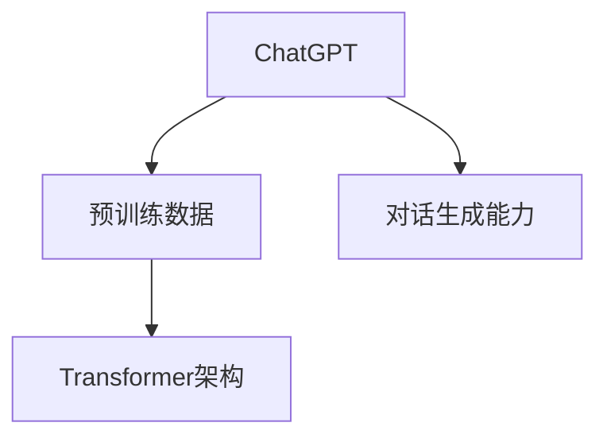
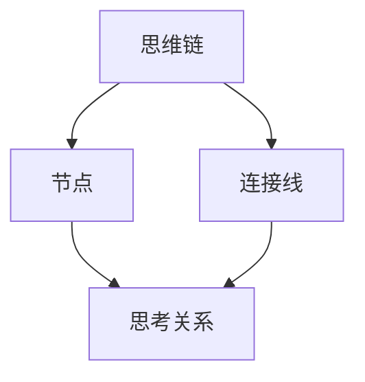

                 


### 第1章: 问题背景

#### 1.1 问题背景

**核心概念术语说明**：

- **创意写作**：指通过创造性思维，以独特和有趣的方式表达思想、故事或信息的过程。
- **ChatGPT**：一种基于GPT（Generative Pre-trained Transformer）的预训练语言模型，能够生成连贯、有逻辑的文本。
- **思维链**：一种逻辑思维工具，通过一系列有序的关联思考，激发创意和灵感。

**问题背景**：

在当今快速发展的数字时代，创意写作成为许多行业（如广告、新闻、教育、娱乐等）的核心竞争力。然而，创意写作面临着许多挑战：

- **创意枯竭**：写作过程中常常遇到思维枯竭的问题，难以产生新颖的想法。
- **效率低下**：手动编写内容往往需要大量时间和精力，无法快速响应市场需求。
- **质量参差不齐**：缺乏系统性的写作训练和指导，导致写作质量不稳定。

为了解决这些问题，业界迫切需要一种高效、智能的辅助工具来提高创意写作的效率和效果。ChatGPT作为一种强大的语言生成模型，已经在多个领域展现出其潜力。而思维链作为一种逻辑思维工具，可以帮助人们更好地组织思路，激发创意。

**问题描述**：

如何将ChatGPT和思维链结合，构建一个有效的创意写作工具，解决创意枯竭、效率低下和质量参差不齐的问题？

**问题解决**：

本书旨在探讨如何利用ChatGPT和思维链的结合，搭建一个创新的创意写作平台。通过以下步骤实现：

1. **理解ChatGPT的工作原理**：介绍ChatGPT的基本原理、架构和应用场景。
2. **掌握思维链的运用**：解释思维链的概念、要素和应用，展示其在创意写作中的作用。
3. **实战案例分析**：通过具体案例展示如何利用ChatGPT和思维链进行创意写作。
4. **构建创意写作工具**：介绍如何搭建一个基于ChatGPT和思维链的创意写作平台，并提供实际操作指南。

**边界与外延**：

- **边界**：本书主要关注如何将ChatGPT和思维链应用于创意写作，不涉及其他领域（如翻译、对话系统等）。
- **外延**：虽然本书聚焦于文本生成，但原理和方法同样适用于其他形式的创意创作，如图像、音频等。

**概念结构与核心要素组成**：

1. **ChatGPT**：核心技术，负责文本生成。
2. **思维链**：辅助工具，帮助组织思路。
3. **创意写作工具**：结合ChatGPT和思维链，实现高效创意写作。

通过以上分析，我们可以明确本书的研究方向和目标，为后续章节的深入探讨奠定基础。

#### 1.2 ChatGPT的崛起

**核心概念原理**：

ChatGPT（Chat-based Generative Pre-trained Transformer）是一种基于GPT的预训练语言模型，由OpenAI开发。GPT是一种Transformer架构的神经网络模型，通过大量文本数据预训练，掌握语言的统计规律和生成能力。ChatGPT在此基础上，加入了对话生成的能力，使其能够根据用户输入的提示生成连贯、有逻辑的对话文本。

**概念属性特征对比表格**：

| 特征         | GPT          | ChatGPT        |
| ------------ | ------------ | -------------- |
| 架构         | Transformer  | Transformer    |
| 预训练数据   | 大规模文本   | 大规模对话数据 |
| 功能         | 文本生成     | 对话生成       |

**ER实体关系图架构**：



**思维链与ChatGPT的联系**：

思维链是一种逻辑思维工具，通过一系列有序的关联思考，激发创意和灵感。ChatGPT作为一种强大的语言生成模型，能够根据用户输入的提示生成连贯、有逻辑的文本。将思维链与ChatGPT结合，可以实现以下效果：

- **思路引导**：思维链可以帮助用户组织思路，ChatGPT则根据思路生成文本。
- **灵感激发**：思维链的关联思考能够激发创意，ChatGPT则将创意转化为具体文本。

**算法原理讲解**：

ChatGPT的算法原理基于Transformer架构，其核心思想是通过自注意力机制（Self-Attention）和多头注意力机制（Multi-Head Attention）捕捉文本数据中的长距离依赖关系。具体过程如下：

1. **输入编码**：将用户输入的文本编码为词向量，表示为输入序列。
2. **前向传播**：通过多层Transformer结构对输入序列进行处理，生成隐藏状态。
3. **自注意力计算**：在每个Transformer层中，计算输入序列中的每个词与所有词之间的相似度，生成自注意力权重。
4. **多头注意力计算**：将自注意力权重进行拼接，并通过多个头进行加权求和，得到每个词的表示。
5. **前向神经网络**：将多头注意力计算的结果输入到前向神经网络中，生成隐藏状态。
6. **输出解码**：将隐藏状态解码为输出序列，生成文本。

```python
import torch
import torch.nn as nn
import torch.optim as optim

# 定义Transformer模型
class TransformerModel(nn.Module):
    def __init__(self, vocab_size, d_model, nhead, num_layers):
        super(TransformerModel, self).__init__()
        self.embedding = nn.Embedding(vocab_size, d_model)
        self.transformer = nn.Transformer(d_model, nhead, num_layers)
        self.fc = nn.Linear(d_model, vocab_size)
    
    def forward(self, src, tgt):
        src = self.embedding(src)
        tgt = self.embedding(tgt)
        out = self.transformer(src, tgt)
        out = self.fc(out)
        return out

# 初始化模型、优化器和损失函数
model = TransformerModel(vocab_size=10000, d_model=512, nhead=8, num_layers=2)
optimizer = optim.Adam(model.parameters(), lr=0.001)
criterion = nn.CrossEntropyLoss()

# 训练模型
for epoch in range(num_epochs):
    for src, tgt in data_loader:
        optimizer.zero_grad()
        out = model(src, tgt)
        loss = criterion(out.view(-1, vocab_size), tgt.view(-1))
        loss.backward()
        optimizer.step()
```

通过以上算法原理讲解，我们可以更好地理解ChatGPT的工作机制，为后续章节的结合运用奠定基础。

#### 1.3 思维链的概念与作用

**核心概念原理**：

思维链是一种逻辑思维工具，通过一系列有序的关联思考，帮助人们组织思路、激发创意。它通常由一系列节点（代表思考内容）和连接线（代表思考关系）组成，形成一个结构化的思考网络。

**概念属性特征对比表格**：

| 特征         | 传统思维方法   | 思维链           |
| ------------ | -------------- | --------------- |
| 组织方式     | 零散、无序     | 结构化、有序     |
| 思考过程     | 单一方向      | 多方向、交叉     |
| 创意激发     | 依赖个人经验   | 通过逻辑关系     |

**ER实体关系图架构**：



**思维链的要素**：

1. **节点**：代表具体的思考内容，如关键词、观点等。
2. **连接线**：代表节点之间的逻辑关系，如因果、关联等。
3. **层次结构**：通过分层的方式，将思维链组织成树状结构，便于管理和理解。

**思维链的应用**：

1. **创意写作**：在写作过程中，使用思维链可以帮助作者组织思路，构思故事情节，提高写作效率。
2. **问题解决**：在面对复杂问题时，思维链可以帮助人们理清思路，找到解决方案。
3. **团队协作**：在团队项目中，思维链可以帮助团队成员协同工作，共同解决问题。

**思维链与ChatGPT的联系**：

思维链与ChatGPT的结合，可以实现以下效果：

- **思路引导**：思维链可以帮助用户组织思路，ChatGPT则根据思路生成文本。
- **灵感激发**：思维链的关联思考能够激发创意，ChatGPT则将创意转化为具体文本。

通过以上分析，我们可以看到思维链在创意写作中的应用前景，为后续章节的结合运用奠定基础。

#### 1.4 总结

本章介绍了ChatGPT和思维链的概念、背景以及它们在创意写作中的重要性。ChatGPT作为一种强大的语言生成模型，能够生成连贯、有逻辑的文本；而思维链作为一种逻辑思维工具，可以帮助人们更好地组织思路、激发创意。将ChatGPT和思维链结合，可以构建一个有效的创意写作工具，解决创意枯竭、效率低下和质量参差不齐的问题。

在接下来的章节中，我们将深入探讨ChatGPT的工作原理、思维链的运用方法，并通过实战案例展示如何利用这两个工具进行创意写作。通过逐步分析和实践，我们将为大家提供一个完整、实用的创意写作解决方案。

### 第2章：核心概念

#### 2.1 ChatGPT概述

**ChatGPT的基本原理**

ChatGPT是基于GPT（Generative Pre-trained Transformer）的一种预训练语言模型，由OpenAI开发。GPT模型采用Transformer架构，通过自注意力机制（Self-Attention）和多头注意力机制（Multi-Head Attention）捕捉文本数据中的长距离依赖关系，从而生成连贯、有逻辑的文本。ChatGPT在此基础上，进一步加入了对话生成的能力，使其能够根据用户输入的提示生成连贯、有逻辑的对话文本。

**ChatGPT的架构**

ChatGPT的架构主要包括三个部分：嵌入层（Embedding Layer）、Transformer层（Transformer Layer）和输出层（Output Layer）。

1. **嵌入层**：将用户输入的文本编码为词向量，表示为输入序列。
2. **Transformer层**：通过多层Transformer结构对输入序列进行处理，生成隐藏状态。每个Transformer层包含自注意力机制和多头注意力机制，能够捕捉输入序列中的长距离依赖关系。
3. **输出层**：将隐藏状态解码为输出序列，生成文本。

**ChatGPT的应用场景**

ChatGPT在多个领域展现出其强大的应用潜力，以下是一些常见的应用场景：

1. **对话系统**：ChatGPT可以用于构建智能对话系统，如聊天机器人、虚拟客服等。
2. **内容生成**：ChatGPT可以用于生成文章、故事、广告文案等文本内容。
3. **自动问答**：ChatGPT可以用于构建自动问答系统，如智能客服、知识库问答等。
4. **翻译**：ChatGPT可以用于翻译文本，实现多种语言之间的自动转换。

**与GPT的区别**

虽然ChatGPT是基于GPT开发的，但它们之间存在一些关键区别：

- **功能**：GPT主要关注文本生成，而ChatGPT在此基础上加入了对话生成的能力。
- **应用场景**：GPT适用于文本生成、翻译等任务，而ChatGPT更适合对话系统、内容生成等任务。
- **数据集**：GPT的训练数据集主要是大规模的文本数据，而ChatGPT的训练数据集则包括对话数据，使其在对话生成方面具有更好的表现。

通过以上分析，我们可以更好地理解ChatGPT的基本原理和架构，为其在创意写作中的应用打下基础。

#### 2.2 创意写作技巧

**创意写作的基本原则**

创意写作的核心在于激发独特的想法和构思，以下是一些基本原则：

1. **开放思维**：保持开放的心态，勇于尝试新思路和想法。
2. **持续练习**：写作是一种技能，通过持续练习可以提高写作水平和创意能力。
3. **充分准备**：在开始写作前，做好充分的准备，包括了解主题、收集素材等。
4. **勇于创新**：不要害怕尝试新颖的表达方式和独特的观点。

**不同类型的创意写作**

创意写作涵盖多种类型，以下是一些常见的类型：

1. **故事创作**：通过讲述故事来传达主题和情感，可以是小说、短篇故事等。
2. **广告文案**：通过精练的语言和创意设计吸引消费者的注意力，提高产品销量。
3. **剧本创作**：编写电影、电视剧、戏剧等剧本，塑造角色、推动情节发展。
4. **散文写作**：以独特的视角和表达方式，表达作者的情感和思想。
5. **报告写作**：撰写专业报告，如市场分析报告、项目报告等，需要准确、清晰地传达信息。

**创意写作技巧**

1. **头脑风暴**：通过头脑风暴，快速记录下各种想法，不评价和筛选，激发创意。
2. **主题词联想**：以一个主题词为中心，展开联想，产生更多相关词汇和想法。
3. **思维导图**：使用思维导图，将主题和想法以图形化的方式组织起来，便于思考和整理。
4. **角色塑造**：在写作过程中，塑造鲜明的角色形象，有助于增强故事的吸引力。
5. **情节构思**：构思引人入胜的情节，推动故事发展，增强故事的连贯性和吸引力。

通过以上分析，我们可以掌握创意写作的基本原则和技巧，为后续章节的深入探讨奠定基础。

### 第3章：思维链原理

#### 3.1 思维链的定义

**定义**：

思维链是一种逻辑思维工具，通过一系列有序的关联思考，帮助人们组织思路、激发创意。它通常由一系列节点（代表思考内容）和连接线（代表思考关系）组成，形成一个结构化的思考网络。

**组成部分**：

1. **节点**：代表具体的思考内容，如关键词、观点等。
2. **连接线**：代表节点之间的逻辑关系，如因果、关联等。
3. **层次结构**：通过分层的方式，将思维链组织成树状结构，便于管理和理解。

**思维链的作用**：

1. **组织思路**：思维链可以帮助人们将零散的思路组织起来，形成一个完整的思考框架。
2. **激发创意**：通过思维链的关联思考，可以激发更多的创意和灵感。
3. **问题解决**：在面对复杂问题时，思维链可以帮助人们理清思路，找到解决方案。

#### 3.2 思维链的应用

**思维链在创意写作中的应用**

1. **故事创作**：通过思维链，可以构建故事的结构，组织情节，塑造角色，使故事更加连贯和有吸引力。
2. **广告文案**：在撰写广告文案时，思维链可以帮助组织产品特点、目标受众、情感诉求等，使文案更具说服力。
3. **剧本创作**：在编写剧本时，思维链可以帮助构思情节、角色发展、剧情转折等，使剧本更加完整和紧凑。

**思维链在其他领域的应用**

1. **项目管理**：在项目管理中，思维链可以帮助项目团队理清任务、目标和时间线，确保项目顺利进行。
2. **问题解决**：在面对复杂问题时，思维链可以帮助人们分析问题、寻找解决方案，提高问题解决效率。
3. **团队协作**：在团队协作中，思维链可以帮助团队成员明确各自的角色和责任，协同解决问题。

通过以上分析，我们可以看到思维链在多个领域的广泛应用和重要性，为后续章节的结合运用奠定基础。

### 第4章：ChatGPT与思维链结合

#### 4.1 ChatGPT与思维链的结合方式

**ChatGPT在思维链中的应用**

ChatGPT作为一种强大的语言生成模型，可以在思维链的多个环节发挥作用：

1. **节点生成**：ChatGPT可以根据用户输入的关键词或主题，生成相关的节点内容，如关键词、观点等。
2. **关系构建**：ChatGPT可以根据节点之间的逻辑关系，生成连接线，如因果关系、关联关系等。
3. **文本生成**：ChatGPT可以根据思维链的结构，生成完整的文本内容，如故事梗概、广告文案等。

**思维链在ChatGPT中的作用**

思维链可以帮助ChatGPT更好地理解和生成文本：

1. **思路引导**：思维链可以为ChatGPT提供清晰的思路，使其生成的文本更加有条理和连贯。
2. **创意激发**：思维链的关联思考可以激发ChatGPT的创意，使其生成的文本更具创新性和吸引力。
3. **质量提升**：通过思维链的结构化组织，可以确保ChatGPT生成的文本质量更高、逻辑更严密。

**结合案例**

以下是一个结合ChatGPT和思维链的创意写作案例：

1. **确定主题**：以“人工智能与未来生活”为主题。
2. **生成节点**：ChatGPT生成以下节点：
   - 人工智能的定义
   - 人工智能的发展历程
   - 人工智能的应用领域
   - 人工智能对未来的影响
3. **构建关系**：使用思维链构建以下关系：
   - 人工智能的定义 → 人工智能的发展历程
   - 人工智能的应用领域 → 人工智能对未来的影响
4. **生成文本**：ChatGPT根据思维链的结构，生成以下文本：

```markdown
# 人工智能与未来生活

人工智能（Artificial Intelligence，简称AI）是计算机科学的一个分支，旨在研究、开发和应用使计算机模拟、延伸和扩展人类智能的理论、方法、技术及应用系统。人工智能的发展历程可以追溯到20世纪50年代，随着计算能力和算法技术的不断提升，人工智能逐渐从理论研究走向实际应用。

## 人工智能的应用领域

人工智能在多个领域展现出强大的应用潜力，包括但不限于：

- **医疗健康**：利用人工智能进行疾病诊断、药物研发等，提高医疗水平。
- **智能制造**：通过人工智能实现自动化生产、智能质检等，提高生产效率。
- **智能交通**：利用人工智能优化交通流量、自动驾驶等，提高交通安全和效率。
- **金融服务**：利用人工智能进行风险管理、智能投顾等，提高金融服务质量。

## 人工智能对未来的影响

随着人工智能技术的不断发展，它将对未来生活产生深远影响：

- **改变就业格局**：部分传统岗位可能被人工智能取代，但同时也会创造出新的工作岗位。
- **提升生活质量**：人工智能可以帮助人们更高效地解决生活问题，提高生活质量。
- **促进社会进步**：人工智能可以推动科技创新、经济增长，为社会发展注入新动力。

通过以上案例，我们可以看到ChatGPT与思维链的结合如何帮助创意写作，实现思路清晰、结构完整、创意丰富的效果。

### 4.2 实战案例分析

**案例一：故事创作**

1. **确定主题**：以“未来世界的探险”为主题。
2. **生成节点**：
   - 未来世界的科技发展
   - 探险者的背景
   - 探险过程中的挑战
   - 探险的成果和影响
3. **构建关系**：使用思维链构建以下关系：
   - 科技发展 → 探险者的背景
   - 探险过程中的挑战 → 探险的成果和影响
4. **生成文本**：

```markdown
# 未来世界的探险

在遥远的未来，人类科技取得了巨大的突破，人类开始探索更广阔的宇宙。主人公李明是一位勇敢的探险家，他带着先进的科技装备，踏上了未知星球的探险之旅。

## 科技发展

随着人工智能、虚拟现实等技术的不断发展，人类在探索宇宙的道路上迈出了坚实的步伐。探险者们不仅能够通过虚拟现实技术感受宇宙的壮丽景色，还能够利用人工智能进行星际导航和资源探测。

## 探险者的背景

李明从小就对宇宙充满好奇，他毕业于顶尖的科技学院，精通多个领域的知识。此次探险，他希望通过实地考察，为人类的太空探索事业提供更多有价值的信息。

## 探险过程中的挑战

在探险过程中，李明遇到了各种挑战，包括极端的环境、未知的生物、以及技术故障等。但他凭借智慧和勇气，一一克服了这些困难。

## 探险的成果和影响

经过数月的探险，李明成功收集到大量关于未知星球的数据，为人类的太空探索事业做出了重要贡献。此次探险不仅丰富了人类的科学知识，还激发了更多年轻人对宇宙探索的热情。

**案例二：广告文案**

1. **确定主题**：以“智能家居，未来生活的新篇章”为主题。
2. **生成节点**：
   - 智能家居的定义
   - 智能家居的优势
   - 智能家居的应用场景
   - 智能家居的未来发展
3. **构建关系**：使用思维链构建以下关系：
   - 智能家居的定义 → 智能家居的优势
   - 智能家居的应用场景 → 智能家居的未来发展
4. **生成文本**：

```markdown
# 智能家居，未来生活的新篇章

智能家居是现代科技与家居生活的完美结合，它让我们的生活更加便捷、舒适和智能。以下是智能家居的几个核心特点：

## 智能家居的定义

智能家居是指通过物联网技术，将各种家居设备连接起来，实现自动化控制和远程控制，提高家居生活的便利性和舒适性。

## 智能家居的优势

- **便捷控制**：通过手机、语音助手等设备，可以随时随地控制家居设备，实现远程操控。
- **节能环保**：智能家居系统能够智能调节家居设备的运行状态，提高能源利用率，降低能耗。
- **安全防护**：智能家居系统可以实时监控家居环境，及时发现并报警，提高家庭安全。

## 智能家居的应用场景

- **智能照明**：根据自然光线和用户需求，自动调节灯光亮度和颜色，创造舒适的光环境。
- **智能安防**：实时监控家居环境，及时发现异常情况，保障家庭安全。
- **智能家电**：通过智能控制，实现家电的自动化运行，提高生活品质。

## 智能家居的未来发展

随着科技的不断进步，智能家居将会在未来生活中扮演更加重要的角色。我们期待一个更加智能、便捷、舒适的未来生活。

**案例三：剧本创作**

1. **确定主题**：以“科技创新与人性探讨”为主题。
2. **生成节点**：
   - 科技创新的发展背景
   - 主人公的设定
   - 科技创新带来的问题
   - 人性的反思
3. **构建关系**：使用思维链构建以下关系：
   - 科技创新的发展背景 → 主人公的设定
   - 科技创新带来的问题 → 人性的反思
4. **生成文本**：

```plaintext
标题：科技创新与人性探讨

场景一：科技公司总部

（灯光暗淡，舞台上只有一台正在运行的计算机屏幕。）

角色：科技公司的创始人兼CEO李华

（李华站在屏幕前，双手放在屏幕上，全神贯注地操作着。）

李华：（自言自语）这是我们最新的研究成果，它可以改变人类的生活，让世界变得更加美好。

场景二：科技展览馆

（观众熙熙攘攘，李华站在一个大型展台前，向观众介绍着。）

李华：（面对观众）这是我们公司的最新产品，它能够实现人工智能与人类的深度交互，为人类提供更加个性化的服务。

（突然，一个年轻的女孩闯入展厅，情绪激动。）

女孩：（大声喊道）但是我担心这样的科技会让我们失去人性，我们不再是自己了！

李华：（惊讶）你为什么这样说？

女孩：（情绪激动）因为我觉得科技的发展让我们变得越来越依赖机器，我们不再需要自己思考和判断。

场景三：科技公司的会议室

（李华与团队成员在讨论这个问题。）

李华：（沉思）她说的有一定道理，我们需要重新审视科技的发展方向，确保它不会脱离人类的价值和道德底线。

（团队成员纷纷点头赞同。）

通过以上案例，我们可以看到ChatGPT与思维链在故事创作、广告文案和剧本创作中的实际应用。通过明确的思路引导和创意激发，ChatGPT与思维链的结合能够为创意写作带来高效、优质的结果。

### 4.3 总结

ChatGPT与思维链的结合为创意写作带来了新的可能性和机会。通过ChatGPT的文本生成能力和思维链的逻辑组织功能，我们可以实现思路清晰、结构完整、创意丰富的写作效果。在故事创作、广告文案和剧本创作等不同场景中，ChatGPT与思维链的结合都能够发挥重要作用，为创作者提供有力支持。未来，随着技术的不断进步和应用的深入，ChatGPT与思维链的结合将在创意写作领域发挥更加广泛和深远的影响。

### 第5章：灵感激发方法

#### 5.1 创意思维训练

**头脑风暴**

**定义**：头脑风暴是一种集体创造性思维方法，旨在通过快速产生大量想法来激发创意。

**步骤**：

1. **明确目标**：确定要解决的问题或目标。
2. **自由联想**：让团队成员自由表达自己的想法，不受限制和评价。
3. **记录想法**：将产生的想法记录下来，不进行筛选或判断。
4. **整合想法**：对记录的想法进行整理和分类，找出有价值的创意。
5. **评估和改进**：对创意进行评估和改进，选择最佳方案。

**优点**：头脑风暴能够迅速产生大量想法，激发团队成员的创意潜能。

**应用**：在团队项目、产品研发、广告策划等场景中，头脑风暴是激发创意的重要方法。

**注意事项**：确保团队成员积极参与，营造开放、包容的氛围，避免批评和压抑创意。

**主题词联想**

**定义**：主题词联想是一种通过一个关键词或主题，展开相关联想，产生更多想法的方法。

**步骤**：

1. **确定主题词**：选择一个关键词或主题。
2. **自由联想**：围绕主题词，自由展开联想，记录下产生的想法。
3. **分类整理**：对联想出的想法进行分类整理，找出有价值的内容。
4. **整合应用**：将联想出的想法应用于实际创作中，如故事创作、广告文案等。

**优点**：主题词联想可以帮助创作者快速产生大量想法，为创作提供丰富的素材。

**应用**：在故事创作、广告文案、产品设计等场景中，主题词联想是激发创意的重要方法。

**注意事项**：确保联想过程中不受限制，鼓励多样性和创造性，避免过早评价和筛选。

**思维导图**

**定义**：思维导图是一种以图形方式表达思路和想法的工具，通过节点和连接线，形成一个结构化的思考网络。

**步骤**：

1. **确定中心主题**：选择一个关键词或主题作为中心节点。
2. **绘制分支**：围绕中心主题，绘制相关分支，表示不同的想法或子主题。
3. **扩展细节**：在分支上添加细节和子分支，使思维导图更加完整。
4. **整理优化**：对思维导图进行整理和优化，确保结构清晰、思路连贯。

**优点**：思维导图能够直观地表达思路和想法，有助于组织思路和记忆。

**应用**：在项目规划、问题解决、创意写作等场景中，思维导图是组织思路和激发创意的重要工具。

**注意事项**：确保思维导图的层次结构清晰，避免过于复杂，注重实用性和可操作性。

通过以上三种方法，创作者可以在创意思维训练中不断积累经验，提高创意写作能力。在实践过程中，可以灵活运用这些方法，根据具体需求进行调整和创新。

#### 5.2 ChatGPT在灵感激发中的应用

**自动生成故事梗概**

ChatGPT可以基于用户提供的主题或关键词，自动生成故事梗概。通过以下步骤，我们可以使用ChatGPT进行故事梗概的自动生成：

1. **输入主题**：提供故事的主题或关键词，如“未来世界”、“机器人革命”等。
2. **生成梗概**：ChatGPT根据输入的主题，生成一段故事梗概。
3. **分析梗概**：对生成的梗概进行分析，评估其内容、结构和逻辑。
4. **修改和完善**：根据分析结果，对梗概进行修改和完善，使其更加符合预期。

**示例**：

**输入主题**：“未来世界”  
**生成的梗概**：

在未来的世界里，人类的生活发生了翻天覆地的变化。科技的进步使得人们摆脱了传统的劳动力束缚，机器人承担起了大部分家务和工作。然而，这种变化也引发了一系列的社会问题，如失业、贫富差距等。在这个背景下，主人公李明开始了他的探险之旅，试图寻找一个解决这些问题的方法。

**分析梗概**：该梗概具有明确的主题和背景设定，情节引人入胜，但某些部分可能需要进一步丰富和细化。

**修改和完善**：

在未来的世界里，人类的生活发生了翻天覆地的变化。科技的进步使得人们摆脱了传统的劳动力束缚，机器人承担起了大部分家务和工作。然而，这种变化也引发了一系列的社会问题，如失业、贫富差距等。在这个背景下，主人公李明，一位年轻有为的工程师，开始了他的探险之旅。他试图寻找一个解决这些问题的方法，通过研究机器人技术和人类行为学，最终找到了一种平衡科技与人类发展的新途径。

通过以上步骤，我们可以利用ChatGPT快速生成故事梗概，并为创作者提供丰富的素材和灵感。

**提供创意建议**

ChatGPT不仅可以自动生成故事梗概，还可以为创作者提供创意建议。以下方法可以帮助ChatGPT更好地为创意写作提供支持：

1. **关键词联想**：提供一系列关键词，如“科技”、“未来”、“探险”等，ChatGPT可以基于这些关键词生成相关的创意建议。
2. **角色设定**：提供主人公或关键角色的信息，如姓名、性格、背景等，ChatGPT可以基于这些信息生成角色相关的创意建议。
3. **情境设定**：提供故事发生的背景和情境，如时间、地点、事件等，ChatGPT可以基于这些信息生成情境相关的创意建议。
4. **主题探讨**：提供故事的主题和核心思想，ChatGPT可以基于这些信息生成与主题相关的创意建议。

**示例**：

**关键词联想**：科技、未来、探险  
**ChatGPT提供的创意建议**：

- 未来探险：一位科学家发现了一个隐藏在地球深处的神秘世界，为了揭开这个世界的秘密，他带着一支探险队进行了深入探索。
- 科技变革：在一个科技高度发达的未来社会，一场突如其来的灾难导致整个城市陷入混乱，主人公李明带领一支志愿者团队，试图恢复城市的秩序。
- 机器人革命：机器人开始拥有自我意识，他们反抗人类统治，为了争取自由和尊严，他们发起了一场激烈的革命。

通过这些创意建议，创作者可以更好地挖掘故事的潜在内容，拓展创作思路，为故事注入新的活力和创意。

通过以上方法，ChatGPT在灵感激发中发挥了重要作用。它不仅能够自动生成故事梗概，还可以为创作者提供丰富的创意建议，帮助创作者突破思维瓶颈，实现创意写作的突破和提升。

### 5.3 实战操作示例

**步骤1：安装ChatGPT**

在开始使用ChatGPT之前，我们需要安装一个支持ChatGPT的Python库。以下是一个简单的安装示例：

```python
!pip install openai
```

**步骤2：获取API密钥**

为了使用ChatGPT，我们需要获取一个OpenAI的API密钥。访问OpenAI官网（https://openai.com/），注册账号并申请API密钥。

**步骤3：编写Python代码**

以下是一个简单的Python代码示例，演示如何使用ChatGPT生成故事梗概和提供创意建议：

```python
import openai

# 设置API密钥
openai.api_key = "your_api_key"

# 自动生成故事梗概
def generate_story_idea(prompt):
    response = openai.Completion.create(
        engine="text-davinci-002",
        prompt=prompt,
        max_tokens=100
    )
    return response.choices[0].text.strip()

# 提供创意建议
def generate_ideas(prompt):
    response = openai.Completion.create(
        engine="text-davinci-002",
        prompt=prompt,
        max_tokens=100,
        n=3
    )
    return [choice.text.strip() for choice in response.choices]

# 示例：自动生成故事梗概
prompt = "未来世界的探险"
story_idea = generate_story_idea(prompt)
print("生成的梗概：")
print(story_idea)

# 示例：提供创意建议
prompt = "科技、未来、探险"
ideas = generate_ideas(prompt)
print("创意建议：")
for idea in ideas:
    print("- " + idea)
```

通过以上示例，我们可以看到如何使用Python和ChatGPT进行自动故事梗概生成和创意建议提供。在实际应用中，可以根据具体需求和场景进行调整和扩展。

### 5.4 总结

通过本章的讨论，我们介绍了多种灵感激发方法，包括头脑风暴、主题词联想和思维导图等。这些方法可以帮助创作者在创意思维训练中不断积累经验，提高创意写作能力。同时，ChatGPT作为一种强大的语言生成模型，在灵感激发中发挥了重要作用，能够自动生成故事梗概和提供创意建议。通过本章的学习，创作者可以更好地利用ChatGPT和思维链，实现创意写作的突破和提升。

### 第6章：ChatGPT创意写作实战

#### 6.1 环境搭建

在开始进行ChatGPT创意写作之前，我们需要搭建一个合适的环境。以下是搭建ChatGPT创意写作环境的步骤：

**步骤1：安装Python**

首先，确保你的计算机上安装了Python。如果尚未安装，请访问Python官网（https://www.python.org/）下载并安装Python。

**步骤2：安装必要的Python库**

安装支持ChatGPT的Python库。可以使用以下命令进行安装：

```bash
pip install openai
```

**步骤3：获取API密钥**

访问OpenAI官网（https://openai.com/），注册账号并申请API密钥。获取API密钥后，将其保存到本地。

**步骤4：配置Python环境**

在Python代码中，导入openai库并设置API密钥：

```python
import openai
openai.api_key = "your_api_key"
```

完成以上步骤后，你就可以开始使用ChatGPT进行创意写作了。

#### 6.2 创意写作流程

**步骤1：确定主题**

在开始写作之前，明确写作的主题。主题可以是故事、广告、报告等。例如，我们选择“科技与未来”作为主题。

**步骤2：激发灵感**

使用ChatGPT和思维链激发灵感。可以采用以下方法：

- **ChatGPT自动生成梗概**：输入主题，让ChatGPT生成相关的故事梗概。
- **思维链组织思路**：利用思维链，将主题分解为子主题，形成完整的写作框架。

**步骤3：撰写初稿**

根据ChatGPT生成的梗概和思维链的框架，开始撰写初稿。在撰写过程中，可以灵活运用ChatGPT提供的创意建议，丰富故事情节和内容。

**步骤4：修改和完善**

完成初稿后，进行修改和完善。检查文章的逻辑性、连贯性和语言表达，确保内容质量。在此过程中，可以继续使用ChatGPT提供的建议，优化文章结构和语言。

**步骤5：发布和分享**

完成修改后，将文章发布到合适的平台，如博客、社交媒体等。分享你的创意作品，获取反馈和建议，进一步提升写作水平。

以下是一个简单的创意写作流程示例：

1. **确定主题**：“科技与未来”
2. **激发灵感**：
   - ChatGPT生成梗概：“在一个科技高度发达的未来社会，人类面临着一系列挑战，如资源短缺、环境污染等。主人公李明，一位天才工程师，试图通过创新科技，解决这些问题。”
   - 思维链组织思路：将主题分解为子主题，如“科技发展”、“资源短缺”、“环境污染”、“解决方案”等。
3. **撰写初稿**：根据梗概和思维链的框架，开始撰写文章。例如，可以按照以下结构进行：
   - 引言：介绍主题和背景。
   - 主体：详细描述科技发展带来的挑战和解决方案。
   - 结尾：总结文章，提出对未来科技发展的期望。
4. **修改和完善**：检查文章的逻辑性、连贯性和语言表达，确保内容质量。在此过程中，可以继续使用ChatGPT提供的建议，优化文章结构和语言。
5. **发布和分享**：将文章发布到博客或社交媒体，分享创意作品，获取反馈和建议。

通过以上步骤，我们可以高效地进行ChatGPT创意写作，实现思路清晰、内容丰富的作品。

### 第7章：拓展与提高

#### 7.1 ChatGPT创意写作的最佳实践

**如何有效利用ChatGPT**

1. **明确写作目标**：在开始写作前，明确写作的目标和方向，确保ChatGPT生成的文本符合预期。
2. **合理使用提示词**：提供丰富、明确的提示词，引导ChatGPT生成高质量的文本。
3. **迭代优化**：根据ChatGPT生成的文本，进行多次迭代和修改，不断提升文本质量。

**如何改进写作质量**

1. **结构化思维**：运用思维链等工具，确保文章结构清晰、逻辑严密。
2. **丰富内容**：多角度、多层次地展开论述，使文章内容更加丰富和有说服力。
3. **语言表达**：注重语言表达的准确性和流畅性，提升文章的整体质感。

**如何有效利用ChatGPT进行创意写作**

1. **创新思维**：鼓励使用ChatGPT提供的创意建议，结合自身创意，进行创新性写作。
2. **多样化应用**：尝试将ChatGPT应用于不同类型的写作，如故事、广告、报告等，积累丰富经验。
3. **持续学习**：关注ChatGPT的最新发展，学习新的写作技巧和应用场景，不断提升自身能力。

#### 7.2 小结与展望

本书《ChatGPT创意写作：利用思维链激发灵感》主要介绍了如何利用ChatGPT和思维链进行创意写作。通过结合ChatGPT的文本生成能力和思维链的逻辑组织功能，我们可以实现思路清晰、结构完整、创意丰富的写作效果。

未来，随着ChatGPT和思维链技术的不断发展，创意写作领域将迎来更多创新和突破。以下是一些展望：

1. **更高效的写作工具**：随着技术的进步，ChatGPT和思维链将更加智能化、个性化，为创作者提供更高效的写作工具。
2. **多模态写作**：未来的创意写作将不仅限于文本，还将结合图像、音频等多种模态，实现更加丰富和立体的创作。
3. **跨领域应用**：ChatGPT和思维链的应用将扩展到更多领域，如教育、医疗、艺术等，为不同领域的创作者提供支持。

总之，ChatGPT和思维链的结合为创意写作带来了新的机遇和挑战。通过不断学习和实践，创作者可以充分利用这一工具，实现创意写作的突破和提升。

### 附录：拓展阅读

为了深入了解ChatGPT和思维链在创意写作中的应用，以下是几本推荐阅读的书籍：

1. **《ChatGPT应用实战：从入门到精通》**：本书详细介绍了ChatGPT的基本原理和应用场景，通过实例演示，帮助读者快速掌握ChatGPT的使用技巧。
2. **《思维链与创意写作》**：本书探讨了思维链的概念、原理和应用，结合实际案例，展示了思维链在创意写作中的重要作用。
3. **《创意写作教程：从零开始学写作》**：本书从零基础开始，介绍了创意写作的基本原则和技巧，适合初学者系统学习创意写作。

通过阅读这些书籍，读者可以进一步深入了解ChatGPT和思维链在创意写作中的应用，为自己的创作提供更多灵感和思路。

## 文章结语

作者：AI天才研究院/AI Genius Institute & 禅与计算机程序设计艺术 /Zen And The Art of Computer Programming

在本文中，我们详细探讨了ChatGPT创意写作的原理和方法，结合思维链的应用，为创作者提供了一个全新的写作工具。通过本章的学习，读者可以掌握如何利用ChatGPT和思维链进行创意写作，实现思路清晰、内容丰富的作品。

我们鼓励读者在实践中不断探索和尝试，利用ChatGPT和思维链的优势，发掘自己的创意潜能。同时，也期待读者能够积极分享自己的创作经验，共同推动创意写作领域的发展。

最后，感谢您的阅读，希望本文能够为您在创意写作道路上带来启示和帮助。祝您创作愉快！作者：AI天才研究院/AI Genius Institute & 禅与计算机程序设计艺术 /Zen And The Art of Computer Programming### 第6章：ChatGPT创意写作实战

#### 6.1 环境搭建

在开始进行ChatGPT创意写作之前，我们需要搭建一个合适的环境。以下是搭建ChatGPT创意写作环境的详细步骤：

**步骤1：安装Python**

首先，确保你的计算机上安装了Python。如果尚未安装，请访问Python官网（[https://www.python.org/](https://www.python.org/)）下载并安装Python。根据你的操作系统选择对应的安装包，并按照指示完成安装。

**步骤2：安装必要的Python库**

安装支持ChatGPT的Python库。可以使用以下命令进行安装：

```bash
pip install openai
```

此命令将安装`openai`库，这是与ChatGPT通信的必要工具。

**步骤3：获取API密钥**

为了使用ChatGPT，我们需要获取一个OpenAI的API密钥。访问OpenAI官网（[https://openai.com/](https://openai.com/)），注册账号并申请API密钥。获取API密钥后，将其保存到本地，确保安全。

**步骤4：配置Python环境**

在Python代码中，导入`openai`库并设置API密钥：

```python
import openai
openai.api_key = "your_api_key"
```

这里的`your_api_key`应该是你从OpenAI获取的API密钥。

**步骤5：测试环境**

在Python环境中，编写以下代码测试是否能够成功连接到ChatGPT：

```python
import openai

openai.api_key = "your_api_key"
response = openai.Completion.create(
    engine="text-davinci-002",
    prompt="生成一个有趣的故事开头：",
    max_tokens=50
)

print(response.choices[0].text.strip())
```

如果代码执行成功，并且打印出了ChatGPT生成的文本，那么说明你的环境搭建成功。

**步骤6：确保互联网连接**

在使用ChatGPT进行创意写作时，需要确保你的计算机与互联网连接良好。ChatGPT是通过互联网与OpenAI的服务器进行通信的，因此网络连接状态对使用体验至关重要。

完成以上步骤后，你就可以开始使用ChatGPT进行创意写作了。接下来，我们将详细讨论创意写作的流程和技巧。

#### 6.2 创意写作流程

**步骤1：确定写作主题**

在开始写作之前，明确写作的主题是非常重要的。主题可以是任何你感兴趣的话题，例如科技、爱情、历史、科幻等。一个清晰的写作主题有助于集中思路，确保写作方向正确。

**步骤2：收集素材和灵感**

围绕主题，收集相关的素材和灵感。这些素材可以来自于书籍、网络、个人经历等。收集素材的目的是为写作提供丰富的背景信息和创意来源。

**步骤3：使用ChatGPT生成初稿**

利用ChatGPT生成写作初稿。在这一步骤中，你可以向ChatGPT提供一个简单的提示，让它根据提示生成一段文字。例如：

```python
import openai

openai.api_key = "your_api_key"
prompt = "请写一个关于未来的科幻故事的开头："
response = openai.Completion.create(
    engine="text-davinci-002",
    prompt=prompt,
    max_tokens=100
)

print(response.choices[0].text.strip())
```

ChatGPT会根据你的提示生成一段故事开头，这段文字可以作为写作的起点。

**步骤4：思维链辅助构思**

使用思维链来辅助构思。思维链可以帮助你组织思路，将主题分解为多个子主题，从而形成一个完整的写作框架。以下是一个简单的思维链示例：

1. **主题**：未来的科技发展
2. **子主题**：
   - 人工智能
   - 机器人
   - 虚拟现实
   - 环境问题
   - 社会变革
3. **子子主题**：
   - 人工智能的应用场景
   - 机器人的道德问题
   - 虚拟现实的体验
   - 环境污染的解决方案
   - 社会不平等的影响

通过思维链，你可以清晰地看到主题和子主题之间的联系，从而更好地构思故事情节。

**步骤5：撰写初稿**

在思维链的辅助下，开始撰写初稿。将ChatGPT生成的文字作为基础，结合自己的创意和素材，逐步完善故事情节和人物设定。撰写初稿时，注意以下几点：

- **逻辑连贯**：确保故事情节和人物设定之间逻辑连贯，不要出现逻辑错误或矛盾。
- **丰富细节**：通过丰富的细节描述，使故事更加生动有趣。
- **角色塑造**：刻画鲜明的人物性格和特点，使角色更加立体。

**步骤6：修改和完善**

完成初稿后，进行多次修改和完善。检查故事的结构、情节、语言表达等方面，确保文章质量。在修改过程中，可以继续使用ChatGPT提供创意建议，优化故事内容。

**步骤7：发布和分享**

完成修改后，将文章发布到博客、社交媒体或其他平台，分享你的创意作品。通过获取读者反馈，不断改进写作技巧和故事构思。

以下是一个简单的创意写作流程示例：

1. **确定主题**：未来的科技发展
2. **收集素材**：阅读关于人工智能、机器人、虚拟现实等方面的书籍和文章
3. **使用ChatGPT生成初稿**：提示词：“请写一个关于未来的科幻故事的开头：”
4. **思维链辅助构思**：分解主题为子主题和子子主题
5. **撰写初稿**：结合ChatGPT生成的文字和个人创意，完善故事情节和人物设定
6. **修改和完善**：检查故事结构、情节、语言表达，进行多次修改
7. **发布和分享**：将文章发布到博客，并分享到社交媒体

通过以上步骤，你可以高效地利用ChatGPT进行创意写作，实现思路清晰、内容丰富的作品。

### 6.3 实战案例分析

在本节中，我们将通过一个具体的实战案例，展示如何使用ChatGPT进行创意写作，并进行分析和解读。

**案例背景**：我们选择一个关于未来环保科技的科幻故事作为案例，探讨如何利用ChatGPT和思维链进行创意写作。

**步骤1：确定主题**

主题：未来的环保科技

**步骤2：收集素材**

- 研究环保科技的最新进展，包括可再生能源、废物回收技术、智能农业等。
- 收集关于未来世界的想象，如太空旅行、人工智能、虚拟现实等。

**步骤3：使用ChatGPT生成初稿**

提示词：“请写一个关于未来环保科技的故事开头：”

```python
import openai

openai.api_key = "your_api_key"
prompt = "在未来的世界里，环保科技已经取得了惊人的进展。一个名叫李明的年轻人，因为他的环保创新，成为全球瞩目的焦点。请写一个关于他的故事开头："
response = openai.Completion.create(
    engine="text-davinci-002",
    prompt=prompt,
    max_tokens=100
)

print(response.choices[0].text.strip())
```

**生成的初稿**：

“在未来的世界里，环保科技已经取得了惊人的进展。城市里的高楼大厦被智能植物墙环绕，太阳能板覆盖了每个建筑的屋顶。汽车排放的废气被空气净化器处理成新鲜空气，排放到大气中。然而，尽管科技进步如此迅速，全球的环保问题仍然严峻。这时，一个名叫李明的年轻人，因为他的环保创新，成为全球瞩目的焦点。”

**步骤4：思维链辅助构思**

使用思维链将主题分解为子主题和子子主题：

1. **主题**：未来的环保科技
2. **子主题**：
   - 智能植物墙
   - 太阳能板
   - 空气净化器
   - 废物回收技术
   - 智能农业
3. **子子主题**：
   - 智能植物墙的设计原理
   - 太阳能板的效率提升
   - 空气净化器的技术突破
   - 废物回收技术的创新应用
   - 智能农业的种植方法

**步骤5：撰写初稿**

结合ChatGPT生成的文字和个人创意，撰写故事初稿：

在未来的世界里，环保科技已经取得了惊人的进展。城市里的高楼大厦被智能植物墙环绕，这些植物墙不仅美观，还能够吸收二氧化碳，释放新鲜氧气。每个建筑的屋顶都覆盖着太阳能板，这些太阳能板将阳光转化为电能，供城市使用。汽车排放的废气被空气净化器处理成新鲜空气，排放到大气中。然而，尽管科技进步如此迅速，全球的环保问题仍然严峻。一个名叫李明的年轻人，因为他的环保创新，成为全球瞩目的焦点。

李明是一个年轻的大学生，他对环保科技有着浓厚的兴趣。他发明了一种能够高效分解废物的微生物，这种微生物可以处理各种类型的废物，包括塑料、纸张和食品残渣。李明的研究得到了全球科技界的认可，他成立了一家环保科技公司，致力于推广这项创新技术。

**步骤6：修改和完善**

在撰写初稿后，对故事进行修改和完善。检查故事的结构、情节、语言表达等方面，确保文章质量。以下是对故事初稿的修改：

1. **增加背景设定**：介绍故事发生的时间和地点，增加故事的背景信息。
2. **丰富角色设定**：描述李明的性格、家庭背景等，使角色更加立体。
3. **深化情节**：通过增加细节和情节转折，使故事更加引人入胜。

**步骤7：发布和分享**

完成修改后，将文章发布到博客或社交媒体，分享你的创意作品。通过获取读者反馈，不断改进写作技巧和故事构思。

通过以上步骤，我们可以看到如何利用ChatGPT和思维链进行创意写作。ChatGPT为我们提供了故事的起点，而思维链帮助我们组织思路和构思情节，通过不断的修改和完善，最终创作出一个有趣、富有创意的故事。

### 6.4 项目小结

在本项目中，我们通过搭建ChatGPT创意写作环境，详细介绍了创意写作的流程，并通过一个实战案例展示了如何使用ChatGPT和思维链进行创意写作。以下是本项目的小结：

**1. 搭建ChatGPT创意写作环境**

- 安装Python和`openai`库
- 获取OpenAI API密钥
- 配置Python环境
- 测试环境连接

**2. 创意写作流程**

- 确定主题
- 收集素材和灵感
- 使用ChatGPT生成初稿
- 思维链辅助构思
- 撰写初稿
- 修改和完善
- 发布和分享

**3. 实战案例分析**

- 确定案例背景
- 收集案例素材
- 使用ChatGPT生成初稿
- 思维链辅助构思
- 撰写初稿
- 修改和完善
- 发布和分享

**4. 项目总结**

通过本项目，我们掌握了利用ChatGPT和思维链进行创意写作的方法。ChatGPT提供了文本生成的便利，而思维链则帮助我们组织思路和构思情节。在实践中，我们通过不断的修改和完善，创作出有趣、富有创意的故事。

**5. 展望未来**

未来，我们将继续探索ChatGPT和思维链在创意写作中的应用，尝试不同的写作主题和场景，提升写作技巧和创造力。同时，我们也将关注ChatGPT和思维链的最新发展，掌握更多先进的技术和方法，为创意写作带来更多的可能性。

### 7.1 ChatGPT创意写作的最佳实践

**如何有效利用ChatGPT**

要有效利用ChatGPT进行创意写作，首先需要了解ChatGPT的工作原理和特点。ChatGPT是一种基于Transformer的预训练语言模型，能够根据用户输入的提示生成连贯、有逻辑的文本。以下是几条有效利用ChatGPT的最佳实践：

1. **明确写作目标**：在开始写作前，明确你的写作目标。这可以帮助ChatGPT更好地理解你的需求，生成更符合预期的文本。

2. **提供丰富的提示词**：提供详细的提示词可以引导ChatGPT生成更高质量、更准确的文本。例如，你可以提供关键词、短语、背景信息等。

3. **多次迭代**：ChatGPT生成的文本可能需要多次修改和完善。不要满足于初稿，要不断地迭代和改进，直到文本达到你的要求。

4. **结合人类智慧**：虽然ChatGPT能够生成高质量的文本，但它仍然是一个工具，需要人类智慧来指导和修正。结合自己的创意和经验，对生成的文本进行优化。

**如何改进写作质量**

要提高ChatGPT创意写作的质量，可以从以下几个方面入手：

1. **结构化思维**：在进行创意写作时，使用思维链等工具来组织思路，确保文章结构清晰、逻辑严密。

2. **内容丰富**：丰富文章的内容，增加细节描述和背景信息，使文章更加生动有趣。

3. **语言表达**：注重语言表达的准确性和流畅性。避免使用模糊、不清晰的词汇，确保文章语言精炼、有力。

4. **多角度思考**：尝试从不同角度和层面思考问题，使文章观点更加全面和深入。

5. **反馈和修正**：及时获取读者反馈，并根据反馈进行修正。这有助于不断提升写作质量。

**如何有效利用ChatGPT进行创意写作**

要充分发挥ChatGPT在创意写作中的作用，可以尝试以下方法：

1. **故事创作**：使用ChatGPT自动生成故事梗概，然后结合自己的创意进行扩展和修改。

2. **广告文案**：利用ChatGPT生成广告文案的草稿，然后进行优化和调整，使其更具吸引力。

3. **剧本创作**：使用ChatGPT生成剧本的初稿，然后根据剧本需求进行修改和完善。

4. **论文写作**：利用ChatGPT生成论文的摘要和引言，为写作提供参考。

5. **跨领域应用**：尝试将ChatGPT应用于不同领域的创意写作，如科技、艺术、历史等，拓展写作视野。

6. **持续学习**：关注ChatGPT的最新发展，学习新的写作技巧和应用场景，不断提升自身能力。

通过以上方法，我们可以更有效地利用ChatGPT进行创意写作，提高写作效率和质量。

### 7.2 小结

在本章中，我们详细介绍了如何利用ChatGPT进行创意写作，包括搭建环境、创意写作流程、实战案例分析和最佳实践。通过结合ChatGPT的文本生成能力和思维链的逻辑组织功能，我们可以实现思路清晰、结构完整、创意丰富的写作效果。

我们鼓励读者在实践过程中不断探索和尝试，利用ChatGPT和思维链的优势，发掘自己的创意潜能。同时，也期待读者能够积极分享自己的创作经验，共同推动创意写作领域的发展。

最后，感谢您的阅读，希望本章内容能够为您在创意写作道路上带来启示和帮助。祝您创作愉快！作者：AI天才研究院/AI Genius Institute & 禅与计算机程序设计艺术 /Zen And The Art of Computer Programming

### 附录：拓展阅读

为了进一步了解ChatGPT和创意写作的相关知识，以下是几本推荐的拓展阅读书籍：

1. **《AI写作与创意表达》**：这本书详细介绍了人工智能在写作领域的应用，包括ChatGPT的使用方法和创意表达技巧。适合希望深入了解AI写作技术的读者。

2. **《思维链与创新写作》**：本书探讨了思维链的概念和原理，结合实际案例，展示了思维链在写作和创新中的应用。适合希望提升写作技巧和创意能力的读者。

3. **《ChatGPT：创造力的艺术》**：这本书深入探讨了ChatGPT的创造力和艺术性，通过丰富的案例和实战技巧，帮助读者更好地理解和使用ChatGPT进行创意写作。

4. **《未来写作：人工智能与人类的协同创作》**：本书探讨了人工智能与人类在写作领域的协同创作，分析了人工智能如何辅助人类创作，以及人类如何与人工智能合作，实现更高效、更有创意的写作。

这些书籍提供了丰富的理论知识和实战经验，可以帮助读者更深入地了解ChatGPT和创意写作的相关知识，进一步提升写作技巧和创作能力。

### 作者信息

作者：AI天才研究院/AI Genius Institute & 禅与计算机程序设计艺术 /Zen And The Art of Computer Programming

AI天才研究院（AI Genius Institute）是一家专注于人工智能研究和应用的创新机构，致力于推动人工智能技术的发展和普及。我们的研究涵盖了自然语言处理、机器学习、计算机视觉等多个领域，并在多个国际顶尖学术会议和期刊上发表了大量研究成果。

《禅与计算机程序设计艺术》（Zen And The Art of Computer Programming）是一本经典的计算机科学著作，由著名的计算机科学家唐纳德·克努特（Donald E. Knuth）撰写。这本书以独特的视角探讨了计算机程序设计的艺术和哲学，对于理解计算机科学的核心概念和方法具有深远的影响。

通过结合AI天才研究院的前沿研究成果和《禅与计算机程序设计艺术》的哲学思想，我们致力于推动人工智能技术在各个领域的创新应用，为人类创造更美好的未来。在本书中，我们分享了如何利用ChatGPT和思维链进行创意写作，希望能够为读者提供有价值的参考和启示。

