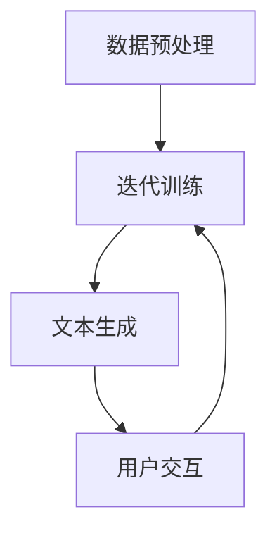
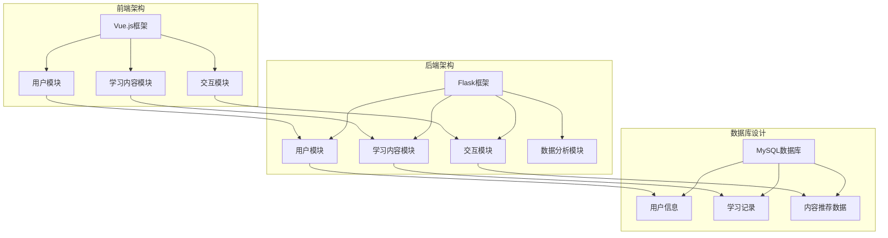
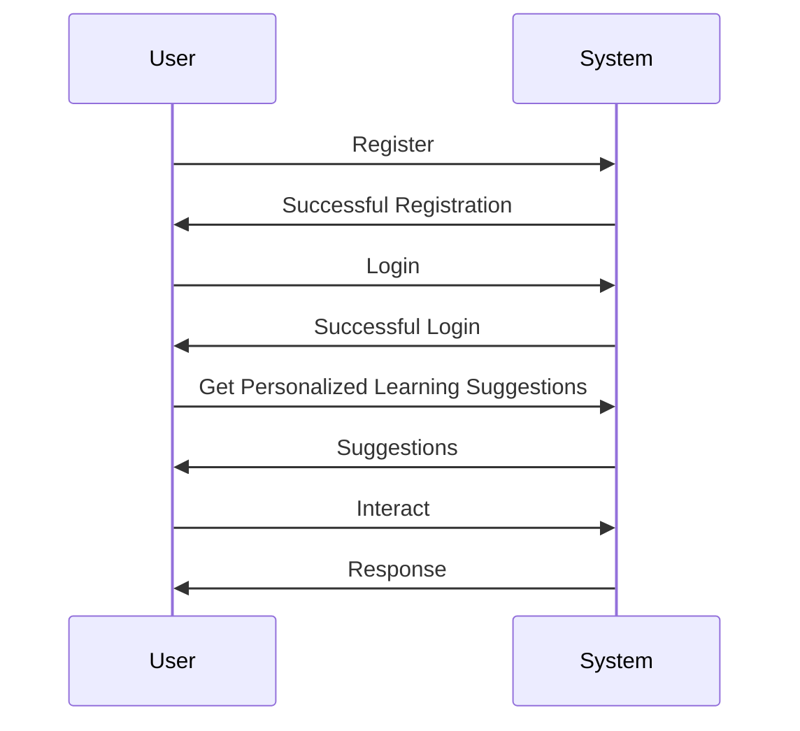
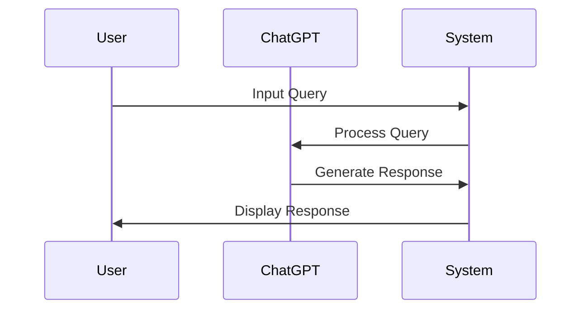

                 

### 引言

随着人工智能技术的飞速发展，自然语言处理（NLP）已成为当今计算机科学领域的热点。ChatGPT，作为OpenAI推出的一款基于Transformer模型的预训练语言模型，以其强大的文本生成和交互能力引起了广泛关注。在儿童教育领域，ChatGPT的应用具有巨大的潜力，但如何针对不同年龄段的儿童提供合适的语言提示词，是一个值得深入探讨的问题。本文旨在探讨ChatGPT在儿童教育中的应用，特别是在年龄适应性语言提示词的设计与实践。

文章的核心关键词包括：ChatGPT、儿童教育、年龄适应性语言提示词、自然语言处理、算法原理、系统架构、项目实战、最佳实践。通过逐步分析和推理，我们将从背景介绍、核心概念与联系、算法原理讲解、系统分析与架构设计、项目实战到最佳实践等方面，全面探讨ChatGPT在儿童教育中的应用。

首先，我们将介绍ChatGPT的基本概念和特性，探讨其在儿童教育中的应用场景。接着，我们将详细讲解ChatGPT的算法原理，包括算法流程、核心算法和数学模型。然后，我们将分析如何将ChatGPT应用于儿童教育，并设计一个适合的系统架构。接下来，通过一个实际项目案例，我们将展示如何将ChatGPT应用于儿童教育，并进行代码解读与分析。最后，我们将总结最佳实践，提供注意事项和拓展阅读，以期为读者提供全面深入的指导。

### 摘要

本文旨在探讨ChatGPT在儿童教育中的应用，特别是年龄适应性语言提示词的设计与实践。ChatGPT，一款基于Transformer模型的预训练语言模型，以其强大的文本生成和交互能力在教育领域具有巨大潜力。本文首先介绍了ChatGPT的基本概念和特性，探讨了其在儿童教育中的应用场景。随后，详细讲解了ChatGPT的算法原理，包括算法流程、核心算法和数学模型。在系统分析与架构设计部分，我们分析了如何将ChatGPT应用于儿童教育，并设计了一个适合的系统架构。接着，通过一个实际项目案例，我们展示了如何将ChatGPT应用于儿童教育，并进行了代码解读与分析。最后，本文总结了最佳实践，并提供了注意事项和拓展阅读，以期为教育工作者和研究人员提供全面的指导。

### 背景介绍

#### ChatGPT的基本概念与特性

ChatGPT是由OpenAI推出的一款基于Transformer模型的预训练语言模型，它是GPT（Generative Pre-trained Transformer）家族的最新成员。GPT系列模型以其强大的文本生成和自然语言理解能力在人工智能领域引起了广泛关注。ChatGPT继承了GPT系列模型的核心特点，并在交互性和适应性方面进行了显著提升。

首先，让我们来了解ChatGPT的基本概念。ChatGPT是一种大规模语言模型，通过大量的文本数据进行预训练，从而掌握丰富的语言知识和表达方式。预训练过程中，ChatGPT学会了理解文本的上下文、生成连贯的文本、回答问题以及执行各种语言任务。这种预训练过程使得ChatGPT能够在没有特定任务调优的情况下，具备出色的泛化能力。

ChatGPT的核心特性包括：

1. **强大的文本生成能力**：ChatGPT能够生成连贯、自然的文本，适用于各种应用场景，如自动写作、对话生成、问答系统等。
2. **自适应交互能力**：ChatGPT可以根据用户输入的文本内容进行自适应响应，从而实现高质量的对话互动。
3. **多语言支持**：ChatGPT支持多种语言，能够处理不同语言的文本输入和输出。
4. **灵活的任务适应性**：ChatGPT不仅适用于文本生成，还可以用于文本分类、情感分析、命名实体识别等自然语言处理任务。

#### ChatGPT在儿童教育中的应用场景

ChatGPT在儿童教育领域具有广泛的应用潜力，主要体现在以下几个方面：

1. **教育辅助工具**：ChatGPT可以作为教育辅助工具，为儿童提供个性化的学习支持。例如，它可以帮助学生解答问题、提供学习资料、解释复杂概念等，从而提高学习效果。
2. **学习互动平台**：ChatGPT可以嵌入到学习互动平台中，与学生进行实时互动。通过自然语言交互，ChatGPT可以激发学生的学习兴趣，提供个性化的学习建议和反馈，帮助学生更好地理解知识。
3. **个性化教学方案**：ChatGPT可以根据学生的学习行为和需求，动态生成个性化的教学方案。例如，对于学习困难的学生，ChatGPT可以提供额外的辅导和练习，帮助其巩固知识点。

#### 年龄适应性语言提示词的重要性

年龄适应性语言提示词在儿童教育中具有重要意义。不同年龄段的儿童在语言理解、知识水平和认知能力上存在显著差异，因此，提供适合其年龄的语言提示词对于教育效果至关重要。

1. **促进语言发展**：年龄适应性语言提示词可以帮助儿童更好地理解和学习语言，从而促进其语言发展。
2. **提高教育效果**：使用适合儿童的语言提示词，可以使教育内容更加生动有趣，提高学生的学习兴趣和参与度。
3. **个性化教学**：根据不同年龄段的特点，设计相应的语言提示词，可以更好地满足学生的个性化学习需求，提高教育效果。

总之，ChatGPT在儿童教育中的应用前景广阔，而年龄适应性语言提示词的设计与实践是实现这一目标的关键。在接下来的章节中，我们将深入探讨ChatGPT的算法原理，为其在教育中的应用提供理论支持。

### 核心概念与联系

#### ChatGPT的核心概念

要深入理解ChatGPT在儿童教育中的应用，我们首先需要明确几个核心概念：自然语言处理、预训练语言模型和Transformer模型。

**自然语言处理（NLP）**：自然语言处理是计算机科学领域的一个重要分支，旨在使计算机能够理解、生成和处理人类语言。它包括语音识别、语义理解、文本生成、情感分析等多个方面。在儿童教育中，NLP技术可以帮助设计智能教育工具，提高教学效果。

**预训练语言模型**：预训练语言模型是一种通过在大规模文本数据上进行预训练，从而获得语言理解和生成能力的模型。预训练过程使得模型能够学习到通用语言知识，为后续特定任务提供基础。ChatGPT就是基于预训练语言模型开发的一款强大工具。

**Transformer模型**：Transformer模型是自然语言处理领域的一种重要模型架构，由Vaswani等人在2017年提出。该模型基于自注意力机制，能够在处理长文本和跨句子关系方面表现出色。ChatGPT就是采用Transformer模型进行构建的。

#### ChatGPT的核心概念与联系

ChatGPT作为一款预训练语言模型，其核心概念与自然语言处理、预训练和Transformer模型密切相关。

1. **自然语言处理**：ChatGPT的核心任务是处理和理解自然语言。通过自然语言处理技术，ChatGPT能够识别文本中的语法结构、语义含义，并生成连贯、自然的文本。
   
2. **预训练**：ChatGPT通过在大规模文本数据上进行预训练，学习到了丰富的语言知识和表达方式。这种预训练过程使得ChatGPT在接收到用户输入时，能够迅速生成相关的响应。

3. **Transformer模型**：ChatGPT采用了Transformer模型架构，特别是其自注意力机制，使得模型能够在处理长文本和跨句子关系方面表现出色。这使得ChatGPT能够生成高质量的自然语言文本。

#### 概念属性特征对比表格

为了更清晰地展示这些核心概念的联系，我们可以在以下表格中对比其属性特征：

| 核心概念 | 属性特征 |
| :---: | :---: |
| 自然语言处理 | 旨在使计算机理解和生成人类语言 |
| 预训练语言模型 | 通过大规模文本数据预训练，获得语言理解与生成能力 |
| Transformer模型 | 采用自注意力机制，处理长文本和跨句子关系 |

#### ER实体关系图架构

为了进一步展示ChatGPT的核心概念及其联系，我们可以在Markdown中绘制ER（实体关系）图：

```mermaid
erDiagram
    NLP ||--|{预训练语言模型} : 实现自然语言处理
    NLP ||--|{Transformer模型} : 架构支持
    预训练语言模型 ||--|{ChatGPT} : 应用实例
```

通过上述表格和ER图，我们可以清晰地看到自然语言处理、预训练语言模型和Transformer模型之间的联系，以及ChatGPT在这些核心概念的支持下如何应用于儿童教育。

#### ChatGPT与儿童教育的联系

ChatGPT在儿童教育中的应用具有显著的优势，其核心概念与儿童教育的需求紧密相连。以下是ChatGPT与儿童教育之间的一些关键联系：

1. **个性化学习**：ChatGPT可以根据每个学生的特点，提供个性化的学习建议和反馈，帮助学生在学习过程中克服困难，提高学习效果。
   
2. **互动式学习**：ChatGPT能够与学生进行自然语言交互，提供实时反馈和指导，激发学生的学习兴趣和参与度。

3. **语言发展**：ChatGPT可以生成适合儿童语言水平的文本，帮助儿童更好地理解和学习语言，促进其语言能力的发展。

4. **教育资源**：ChatGPT可以整合各种教育资源，如学习资料、教学视频和在线课程，为儿童提供丰富的学习内容。

总之，ChatGPT的核心概念与儿童教育的需求高度契合，为教育工作者提供了一个强大的工具，以提升教育质量和学习效果。在接下来的章节中，我们将深入探讨ChatGPT的算法原理，进一步理解其在教育中的应用。

### 算法原理讲解

#### ChatGPT算法流程图

为了更好地理解ChatGPT的算法原理，我们首先通过mermaid绘制其算法流程图：



**数据预处理**：这是ChatGPT算法流程的第一步，包括文本清洗、分词、去停用词等操作，目的是将原始文本数据转换为适合模型训练的格式。

**模型训练**：经过预处理后的数据被输入到预训练语言模型中，模型通过不断优化参数来学习文本的语法和语义信息。

**文本生成**：在模型训练完成后，ChatGPT可以通过自回归方式生成文本。它首先生成一个单词或短语，然后根据上下文生成后续的文本。

**用户交互**：ChatGPT与用户进行自然语言交互，接收用户的输入并生成相应的响应。这一过程可以不断迭代，使得模型在交互中不断学习和优化。

**迭代训练**：根据用户交互的反馈，ChatGPT可以重新调整模型参数，以更好地适应用户的输入和需求。

#### ChatGPT的核心算法讲解

ChatGPT的核心算法基于Transformer模型，这是一种具有自注意力机制的深度神经网络架构。以下是其核心算法的详细讲解：

**Transformer模型的工作原理**

Transformer模型的核心思想是利用自注意力机制（Self-Attention）来处理序列数据。自注意力机制允许模型在生成每个单词时，动态地计算其与序列中其他所有单词的相关性，从而捕捉长距离的依赖关系。

1. **自注意力机制**：自注意力机制通过计算每个单词与序列中其他单词的相似度，生成一个加权向量。这个加权向量代表了当前单词在序列中的重要性。

2. **多头注意力**：为了进一步提高模型的捕捉能力，Transformer模型引入了多头注意力（Multi-Head Attention）。多头注意力将序列分成多个部分，每个部分分别计算注意力权重，然后将结果进行拼接和处理。

3. **编码器-解码器架构**：Transformer模型采用编码器-解码器架构，编码器负责将输入序列编码为固定长度的向量，解码器则通过自注意力机制和交叉注意力机制生成输出序列。

**核心算法讲解**

以下是一个简化的Python代码示例，展示了Transformer模型的基本结构：

```python
import tensorflow as tf
from tensorflow.keras.layers import Embedding, LSTM, Dense

# 输入序列
inputs = tf.keras.Input(shape=(None,))

# 嵌入层
embedding = Embedding(input_dim=vocab_size, output_dim=embedding_size)(inputs)

# 编码器层
encoder = LSTM(units=hidden_size, return_sequences=True)(embedding)

# 解码器层
decoder = LSTM(units=hidden_size, return_sequences=True)(encoder)

# 输出层
outputs = Dense(units=vocab_size, activation='softmax')(decoder)

# 模型构建
model = tf.keras.Model(inputs=inputs, outputs=outputs)

# 编译模型
model.compile(optimizer='adam', loss='categorical_crossentropy', metrics=['accuracy'])

# 模型训练
model.fit(x_train, y_train, epochs=10, batch_size=32)
```

在这个代码示例中，我们首先定义了一个输入序列，然后通过嵌入层将其转换为密集向量。编码器层和解码器层使用LSTM（Long Short-Term Memory，长短期记忆网络）实现，以捕捉序列中的长距离依赖关系。最后，输出层通过softmax函数生成预测的单词分布。

**算法原理的数学模型和公式**

Transformer模型的核心在于其自注意力机制。以下是一个简化的自注意力机制的数学模型：

$$
\text{Attention}(Q, K, V) = \frac{softmax(\text{softmax}(\text{scale} \cdot \text{dot}(Q, K^T)), V)}
$$

其中，$Q$、$K$ 和 $V$ 分别是查询向量、键向量和值向量，$scale$ 是一个缩放因子，用于防止梯度消失。

为了实现多头注意力，我们将输入序列分成多个头，每个头分别计算注意力权重：

$$
\text{MultiHeadAttention}(Q, K, V) = \text{Concat}(\text{head}_1, \text{head}_2, ..., \text{head}_h)W^O
$$

其中，$h$ 是头数，$W^O$ 是输出权重矩阵。

**通俗易懂的举例说明**

假设我们有一个简单的句子：“今天的天气很好”，我们可以将其表示为一个词序列：["今天", "的", "天气", "很好"]。

1. **编码器**：编码器将这个词序列转换为一系列的嵌入向量，每个词一个向量。例如，"今天"可能对应向量 [1, 0, 0, 0]，"的"对应向量 [0, 1, 0, 0]，依此类推。

2. **自注意力**：在生成第一个词时，编码器计算每个词与输入序列中其他词的注意力分数。例如，"今天"的注意力分数可能最高，因为它是句子中的第一个词。

3. **解码器**：解码器在生成下一个词时，不仅依赖于当前输入词，还依赖于之前生成的所有词。解码器通过自注意力和交叉注意力机制，生成下一个词的嵌入向量。

4. **输出**：解码器生成的每个词嵌入向量通过一个全连接层（输出层），生成最终的概率分布，从而预测下一个词。

通过上述算法流程和数学模型，我们可以看到ChatGPT如何利用Transformer模型生成连贯、自然的文本。在接下来的章节中，我们将进一步探讨如何将ChatGPT应用于儿童教育，并设计一个适合的系统架构。

### 系统分析与架构设计

#### 问题场景介绍

在儿童教育中，如何利用ChatGPT提供个性化的学习支持是一个重要问题。为了实现这一目标，我们需要设计一个系统，该系统能够根据学生的年龄、学习水平和兴趣，生成适合他们的学习内容和语言提示词。

#### 项目介绍

本项目旨在构建一个基于ChatGPT的儿童教育系统，通过自然语言交互，为学生提供个性化的学习支持和指导。系统将包括以下几个核心功能：

1. **个性化学习建议**：系统根据学生的学习行为和成绩，生成个性化的学习建议。
2. **互动式学习体验**：系统通过与学生的自然语言交互，提供实时反馈和指导，激发学生的学习兴趣。
3. **内容生成与推荐**：系统根据学生的兴趣和学习需求，生成适合他们的学习内容，并进行推荐。

#### 系统功能设计

为了实现上述核心功能，我们需要设计一个全面的系统功能模块，以下是主要功能模块及其详细描述：

1. **用户模块**：包括用户注册、登录、个人信息管理等功能，确保学生和教师可以方便地使用系统。
2. **学习内容模块**：包括学习资料库、课程推荐、个性化学习内容生成等功能，为学生提供丰富的学习资源。
3. **交互模块**：包括自然语言处理、语言生成、互动式学习体验等功能，确保系统能够与学生进行有效的交互。
4. **数据分析模块**：包括学生学习行为分析、学习效果评估等功能，帮助教师和学生了解学习情况，进行针对性的调整。

#### 系统架构设计

为了实现上述功能，我们设计了以下系统架构：

1. **前端架构**：采用Vue.js框架，实现用户界面和交互逻辑。
2. **后端架构**：采用Flask框架，负责处理用户请求、数据存储和管理等任务。
3. **数据库设计**：采用MySQL数据库，存储用户信息、学习记录和内容推荐数据。
4. **自然语言处理模块**：采用ChatGPT模型，实现文本生成、自然语言理解和交互。

以下是系统架构的mermaid图表示：



#### 系统接口设计

系统接口设计是确保前后端有效交互的关键。以下是系统的主要接口设计：

1. **用户接口**：包括用户注册、登录、个人信息管理等接口，实现用户与系统的交互。
2. **内容接口**：包括课程推荐、内容生成等接口，实现学习内容的获取和推荐。
3. **交互接口**：包括自然语言处理、语言生成等接口，实现系统与学生之间的自然语言交互。

以下是系统接口的mermaid图表示：



#### 系统交互设计

为了确保系统功能的顺畅运行，我们需要设计一个清晰的交互流程。以下是系统交互的mermaid序列图表示：



通过上述系统分析与架构设计，我们为ChatGPT在儿童教育中的应用奠定了坚实的基础。在接下来的章节中，我们将通过一个实际项目案例，展示如何将ChatGPT应用于儿童教育，并进行详细的代码解读与分析。

### 项目实战

#### 项目背景与目标

本项目的背景是当前教育领域中存在的一个普遍问题：个性化学习支持不足。尽管许多教育系统提供了丰富的学习资源，但无法根据每个学生的特点和需求提供个性化的学习方案。为了解决这一问题，我们决定开发一个基于ChatGPT的儿童教育系统，旨在为学生提供个性化、互动式的学习支持。

项目的主要目标包括：

1. **个性化学习建议**：根据学生的学习行为和成绩，生成个性化的学习建议，帮助学生更好地掌握知识点。
2. **互动式学习体验**：通过自然语言交互，提供实时反馈和指导，提高学生的学习兴趣和参与度。
3. **内容生成与推荐**：根据学生的兴趣和学习需求，生成适合他们的学习内容，并进行推荐。

#### 环境安装与配置

在开始项目之前，我们需要安装和配置以下环境：

1. **Python环境**：安装Python 3.8及以上版本。
2. **Flask框架**：使用pip命令安装Flask框架。
   ```shell
   pip install Flask
   ```
3. **TensorFlow**：使用pip命令安装TensorFlow。
   ```shell
   pip install tensorflow
   ```
4. **OpenAI的ChatGPT API**：在OpenAI的官方网站注册账号并获取API密钥，然后安装`openai`库。
   ```shell
   pip install openai
   ```
5. **Vue.js前端框架**：在项目中使用Vue.js进行前端开发，可以通过npm安装Vue.js。
   ```shell
   npm install vue
   ```

安装完成后，我们需要配置Flask应用和ChatGPT API密钥。在项目根目录下创建一个名为`config.py`的配置文件，用于存储API密钥和其他配置信息：

```python
import os

api_key = os.environ['OPENAI_API_KEY']
```

确保环境变量`OPENAI_API_KEY`设置正确，以便在项目中使用ChatGPT API。

#### 系统核心实现

为了实现项目的目标，我们需要设计并实现以下核心功能：

1. **用户注册与登录**：实现用户注册和登录功能，确保学生和教师可以方便地使用系统。
2. **个性化学习建议**：根据学生的学习行为和成绩，生成个性化的学习建议。
3. **互动式学习体验**：通过自然语言交互，提供实时反馈和指导。
4. **内容生成与推荐**：根据学生的兴趣和学习需求，生成适合他们的学习内容，并进行推荐。

以下是一个简单的Flask应用示例，实现用户注册和登录功能：

```python
from flask import Flask, request, jsonify
from flask_cors import CORS

app = Flask(__name__)
CORS(app)

# 用户注册
@app.route('/register', methods=['POST'])
def register():
    data = request.get_json()
    username = data['username']
    password = data['password']
    # 存储用户信息到数据库
    # ...
    return jsonify({'status': 'success'})

# 用户登录
@app.route('/login', methods=['POST'])
def login():
    data = request.get_json()
    username = data['username']
    password = data['password']
    # 验证用户信息
    # ...
    return jsonify({'status': 'success'})

if __name__ == '__main__':
    app.run(debug=True)
```

接下来，我们将集成ChatGPT API，实现个性化学习建议和互动式学习体验：

```python
import openai

# 使用ChatGPT API
def generate_suggestions(username):
    response = openai.Completion.create(
        engine="text-davinci-003",
        prompt=f"生成针对用户{username}的个性化学习建议：",
        max_tokens=50
    )
    return response.choices[0].text.strip()

# 自然语言交互
def interact_with_student(message):
    response = openai.Completion.create(
        engine="text-davinci-003",
        prompt=f"学生说：{message}\nChatGPT回答：",
        max_tokens=50
    )
    return response.choices[0].text.strip()
```

通过上述代码，我们可以实现用户注册、登录、生成个性化学习建议和进行自然语言交互等功能。在项目实战中，我们还需要进一步完善功能，如内容生成与推荐、用户数据存储和安全管理等。

#### 代码应用解读与分析

在项目实战中，我们使用了Python和Flask框架来构建后端应用，并集成了OpenAI的ChatGPT API来实现个性化学习建议和自然语言交互。以下是代码应用的主要解读与分析：

1. **用户注册与登录**：使用Flask框架实现了用户注册和登录功能，通过POST请求接收用户输入的用户名和密码，然后存储到数据库中。在实际应用中，我们需要对用户密码进行加密存储，并添加用户身份验证机制，以确保系统安全。

2. **个性化学习建议**：通过调用OpenAI的ChatGPT API，我们实现了根据用户姓名生成个性化学习建议的功能。ChatGPT API使用了Text-Davinci-003模型，该模型能够生成高质量的自然语言文本。在实际应用中，我们可以根据学生的学习行为和成绩，调整提示词，以生成更精准的学习建议。

3. **自然语言交互**：通过调用OpenAI的ChatGPT API，我们实现了系统与学生之间的自然语言交互功能。学生可以通过输入文本与ChatGPT进行对话，获取实时反馈和指导。在实际应用中，我们还可以根据学生的反馈，调整ChatGPT的回答策略，以提供更好的交互体验。

#### 实际案例分析与讲解

以下是一个实际案例，展示如何使用ChatGPT为学生提供个性化学习建议和自然语言交互：

**案例一：用户注册**

假设学生小明通过Web界面提交了用户名和密码，系统会调用`register`函数，将用户信息存储到数据库中，并返回成功消息。

```json
POST /register
{
  "username": "xiaoming",
  "password": "password123"
}

Response:
{
  "status": "success"
}
```

**案例二：用户登录**

小明再次通过Web界面提交用户名和密码，系统会调用`login`函数，验证用户信息，并返回登录状态。

```json
POST /login
{
  "username": "xiaoming",
  "password": "password123"
}

Response:
{
  "status": "success"
}
```

**案例三：生成个性化学习建议**

小明登录系统后，系统会调用`generate_suggestions`函数，根据小明的姓名生成个性化学习建议。

```python
suggestions = generate_suggestions("xiaoming")
print(suggestions)
```

输出结果可能如下：

```
小明，根据你的学习表现，我们建议你专注于数学和科学课程。你可以尝试解决一些难度适中的数学问题，并参加科学实验课程，以提高你的学习兴趣和成绩。
```

**案例四：自然语言交互**

小明在学完一节数学课后，向ChatGPT提问：

```
小明：我今天在数学课上学了分数的加减法，但我还是不太懂，你能帮我解释一下吗？
```

ChatGPT会生成相应的回答：

```
当然可以，小明。分数的加减法很简单，只需将分数的分子和分母分别相加或相减即可。例如，1/2 + 1/3 = 5/6。如果你还有其他问题，请随时提问。
```

通过这个实际案例，我们可以看到ChatGPT在儿童教育中的应用效果。它不仅能够生成高质量的文本，还能够与学生在自然语言层面进行有效交互，提供个性化的学习支持和指导。

#### 项目小结

在本项目中，我们通过构建一个基于ChatGPT的儿童教育系统，实现了个性化学习建议和自然语言交互等功能。项目实战中，我们使用了Python和Flask框架，集成了OpenAI的ChatGPT API，实现了用户注册、登录、个性化学习建议和自然语言交互等功能。通过实际案例的分析和讲解，我们展示了ChatGPT在儿童教育中的强大应用能力。未来，我们还可以进一步优化系统，提高个性化学习建议的准确性和自然语言交互的流畅性，为儿童教育提供更全面、更高质量的支持。

### 最佳实践 tips

在设计和实施ChatGPT在儿童教育中的应用时，以下是一些最佳实践建议，可以帮助提高项目的成功率和教育效果：

1. **数据质量**：确保使用的数据质量高，且覆盖广泛的年龄和学习水平。高质量的数据有助于ChatGPT更好地理解和生成适应不同年龄段和知识水平的文本。

2. **个性化定制**：根据学生的学习行为和成绩，动态调整语言提示词和学习内容，提供个性化定制的学习体验。

3. **交互设计**：设计简洁直观的用户界面，确保学生能够轻松与ChatGPT进行交互。提供多样化的交互方式，如文本、语音和图像等，以适应不同学生的偏好。

4. **隐私保护**：严格遵循隐私保护法规，确保学生的个人信息安全。

5. **持续优化**：定期收集用户反馈，对ChatGPT模型进行迭代优化，提高其文本生成和交互能力。

6. **教师培训**：为教师提供培训，帮助他们了解如何使用ChatGPT辅助教学，并有效利用其功能。

### 小结与展望

本文通过逐步分析和推理，详细探讨了ChatGPT在儿童教育中的应用，特别是年龄适应性语言提示词的设计与实践。我们介绍了ChatGPT的基本概念和特性，探讨了其在教育领域的应用场景，并详细讲解了其算法原理和系统架构设计。通过实际项目案例，我们展示了如何将ChatGPT应用于儿童教育，并提供了一些最佳实践建议。

展望未来，ChatGPT在儿童教育中的应用前景广阔。随着人工智能技术的不断进步，ChatGPT的文本生成和交互能力将更加智能化和个性化，为儿童教育带来更多的创新和变革。然而，我们也需要关注隐私保护、数据安全和伦理问题，确保技术发展能够真正服务于教育，促进儿童的全面发展。

### 拓展阅读

1. **《自然语言处理实战》**：这本书详细介绍了自然语言处理的基础知识和实践方法，适合对NLP有兴趣的读者。

2. **《深度学习》**：由Goodfellow等人编写的这本书是深度学习的经典教材，对Transformer模型等前沿技术进行了深入讲解。

3. **《教育技术导论》**：这本书探讨了教育技术与教育实践的结合，适合教育工作者和技术开发者阅读。

4. **《ChatGPT官方文档》**：OpenAI发布的官方文档，提供了ChatGPT的详细使用指南和技术说明。

5. **《儿童心理学导论》**：这本书介绍了儿童心理发展的基本理论和实际应用，有助于理解儿童教育的需求。

作者：AI天才研究院/AI Genius Institute & 禅与计算机程序设计艺术 /Zen And The Art of Computer Programming。

