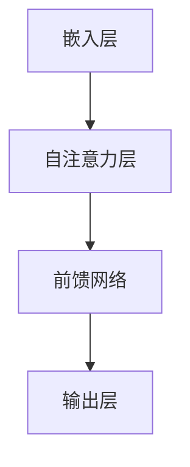
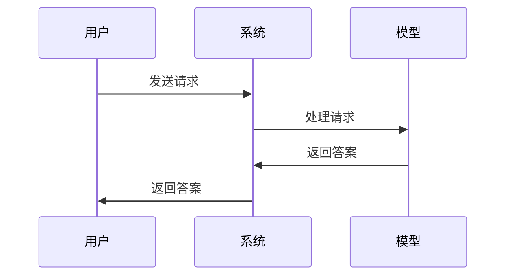

                 

### 第1章 引言

#### 1.1 问题背景

##### 1.1.1 创业咨询的重要性

创业咨询在当今全球的商业环境中扮演着越来越重要的角色。它不仅仅是对企业战略、运营和管理的建议，更是对创业者在创业过程中可能遇到的各种挑战和问题的解决方法。创业咨询能够帮助初创企业更好地规划未来发展，减少创业失败的风险。

随着科技的飞速发展，人工智能（AI）在各个领域的应用日益广泛。人工智能技术，特别是自然语言处理（NLP）和机器学习（ML），正在逐渐改变传统的创业咨询服务模式。ChatGPT作为一种基于GPT-3的先进语言模型，具有强大的自然语言理解和生成能力，其在创业咨询中的应用潜力巨大。

##### 1.1.2 人工智能在创业咨询中的应用现状

目前，人工智能在创业咨询中的应用主要体现在以下几个方面：

1. **数据分析与预测**：利用机器学习算法对大量历史数据进行分析，预测市场趋势和商业机会。
2. **智能客服与咨询**：使用聊天机器人与创业者进行互动，提供24/7的咨询服务。
3. **智能报告生成**：利用自然语言处理技术自动生成业务报告和分析报告。
4. **智能决策支持**：通过分析创业者的提问，提供个性化的决策建议。

然而，尽管人工智能在创业咨询中展现出了巨大的潜力，但现有的应用模式仍然存在一些局限性。例如，智能客服在处理复杂问题时往往表现不佳，报告生成缺乏专业性和深度等。

##### 1.2 研究目标与意义

**研究目标**：本文旨在探讨ChatGPT在创业咨询中的应用，特别是其在思维链创新性方面的应用。通过分析ChatGPT的工作原理和思维链的概念，提出一种基于ChatGPT的创业咨询新方法，并验证其有效性。

**研究意义**：

1. **创新性**：本文提出的方法在思维链的应用上具有创新性，能够为创业咨询领域提供新的思路。
2. **实用性**：通过实际案例验证，本文的方法在解决创业咨询问题方面具有实用性。
3. **理论贡献**：本文的研究为人工智能在创业咨询中的应用提供了理论基础，丰富了相关领域的研究内容。

##### 1.3 边界与外延

**1.3.1 ChatGPT的定义**

ChatGPT是由OpenAI开发的基于GPT-3的预训练语言模型。GPT-3（Generative Pre-trained Transformer 3）是一种基于Transformer架构的预训练模型，具有极高的自然语言理解和生成能力。

**1.3.2 创业咨询的概念**

创业咨询是指为创业者和初创企业提供战略、运营、管理等方面的专业建议和指导。它通常涉及市场调研、竞争分析、战略规划、团队建设等多个方面。

**1.3.3 思维链的概念**

思维链是指一系列相互关联的思维活动，通过这些活动，个体能够系统地分析问题、提出解决方案并评估结果。在创业咨询中，思维链可以帮助创业者和咨询顾问更有效地解决复杂问题。

### 第2章 ChatGPT概述

#### 2.1 ChatGPT的原理与特点

##### 2.1.1 ChatGPT的原理

ChatGPT是基于GPT-3模型开发的一种预训练语言模型。GPT-3采用了Transformer架构，这是一种基于自注意力机制的深度神经网络模型。通过大量的文本数据进行预训练，GPT-3能够理解并生成复杂的自然语言文本。

ChatGPT的工作流程主要包括以下步骤：

1. **数据准备**：收集大量的文本数据，包括网页、书籍、新闻、文章等。
2. **模型训练**：使用训练数据对GPT-3模型进行训练，使其能够预测下一个词。
3. **模型应用**：通过输入问题或语句，ChatGPT能够生成相关的回答或文本。

##### 2.1.2 ChatGPT的特点

ChatGPT具有以下特点：

1. **强大的语言理解能力**：ChatGPT能够理解复杂的自然语言，包括语义、上下文和情感等。
2. **出色的文本生成能力**：ChatGPT能够生成连贯、合理的文本，适用于各种场景。
3. **高效的处理速度**：ChatGPT的处理速度非常快，能够实时响应用户的问题。

#### 2.2 ChatGPT的工作流程

##### 2.2.1 数据准备

ChatGPT的训练数据来源于互联网上的大量文本，包括网页、书籍、新闻、文章等。这些数据被清洗和预处理后，用于训练GPT-3模型。

##### 2.2.2 模型训练

模型训练是ChatGPT的核心步骤。通过梯度下降等优化算法，模型在训练数据上不断调整参数，使其能够更好地预测下一个词。训练过程分为多个阶段，每个阶段都会生成一个更强大的模型。

##### 2.2.3 模型应用

在模型应用阶段，ChatGPT通过输入问题或语句，生成相关的回答或文本。这个过程涉及到模型的推断和生成，能够实现高效的交互式问答。

#### 2.3 ChatGPT的优势与挑战

##### 2.3.1 优势

1. **强大的语言能力**：ChatGPT具有强大的自然语言理解和生成能力，能够处理复杂的语言问题。
2. **灵活的应用场景**：ChatGPT适用于各种场景，包括问答系统、文本生成、翻译等。
3. **高效的训练和推理**：ChatGPT的训练和推理过程非常高效，能够快速响应用户的需求。

##### 2.3.2 挑战

1. **数据隐私和安全性**：由于ChatGPT的训练数据来源于互联网，数据隐私和安全性是一个重要的问题。
2. **模型的可解释性**：ChatGPT的决策过程复杂，难以解释，这给用户理解和信任模型带来了一定的挑战。
3. **资源的消耗**：训练和运行ChatGPT模型需要大量的计算资源和存储空间。

### 第3章 创业咨询中的思维链应用

#### 3.1 思维链的概念与原理

##### 3.1.1 思维链的定义

思维链是指一系列相互关联的思维活动，通过这些活动，个体能够系统地分析问题、提出解决方案并评估结果。在创业咨询中，思维链可以帮助创业者和咨询顾问更有效地解决复杂问题。

##### 3.1.2 思维链的原理

思维链的原理基于以下几个方面：

1. **问题识别**：思维链的第一步是识别问题，包括问题的本质、范围和影响。
2. **信息收集**：在识别问题后，需要收集相关信息，包括市场数据、竞争分析、用户需求等。
3. **分析问题**：通过对收集到的信息进行分析，找出问题的根本原因和关键因素。
4. **提出解决方案**：在分析问题的基础上，提出可能的解决方案，并评估其可行性。
5. **实施与评估**：选择最佳方案进行实施，并对实施效果进行评估和调整。

#### 3.2 思维链在创业咨询中的应用

##### 3.2.1 提出问题

在创业咨询中，提出问题是第一步，也是最重要的一步。创业者需要明确他们面临的问题是什么，这包括问题的性质、范围和影响。通过提问，创业者可以更深入地了解自己的业务和需求。

##### 3.2.2 分析问题

在提出问题后，创业者需要对问题进行分析。这包括收集相关数据和信息，分析问题的本质和关键因素。通过分析，创业者可以更准确地理解问题，并为下一步的解决方案提供依据。

##### 3.2.3 解决问题

在分析问题后，创业者需要提出可能的解决方案，并评估其可行性。这包括制定详细的计划，分配资源，并实施解决方案。在实施过程中，创业者需要对解决方案进行监控和评估，并根据实际情况进行调整。

### 第4章 ChatGPT在创业咨询中的应用案例

#### 4.1 案例一：初创企业战略规划

##### 4.1.1 案例背景

某初创企业正在开发一款基于人工智能的智能推荐系统，目标市场为电商领域。企业在战略规划阶段面临以下问题：

1. **市场定位**：如何确定目标市场和用户群体？
2. **产品策略**：如何设计产品功能，满足用户需求？
3. **竞争分析**：如何分析竞争对手，制定有效的竞争策略？

##### 4.1.2 案例分析

利用ChatGPT，企业可以通过以下步骤进行战略规划：

1. **提出问题**：通过输入问题，如“如何确定电商领域的目标市场和用户群体？”
2. **分析问题**：ChatGPT会分析问题，并提出相关的解决方案，如“可以采用市场细分策略，根据用户购买行为和偏好进行分类。”
3. **提出解决方案**：ChatGPT会提供具体的解决方案，如“可以收集用户购买数据，分析用户行为和偏好，然后根据分析结果确定目标市场和用户群体。”
4. **实施与评估**：企业根据ChatGPT的建议进行实施，并定期评估效果，根据实际情况进行调整。

##### 4.1.3 案例结果

通过ChatGPT的战略规划建议，企业成功确定了目标市场和用户群体，并优化了产品功能。在实施过程中，ChatGPT提供了持续的指导和支持，帮助企业更好地应对市场变化和竞争挑战。

#### 4.2 案例二：企业市场调研

##### 4.2.1 案例背景

某创业公司计划进入智能家居市场，但对该市场的现状和趋势了解有限。公司希望通过市场调研来了解市场机会和潜在风险。

##### 4.2.2 案例分析

利用ChatGPT，公司可以通过以下步骤进行市场调研：

1. **提出问题**：通过输入问题，如“智能家居市场的现状和趋势是什么？”
2. **分析问题**：ChatGPT会分析问题，并提出相关的解决方案，如“可以通过分析市场报告、用户调查和竞争分析来了解智能家居市场的现状和趋势。”
3. **提出解决方案**：ChatGPT会提供具体的解决方案，如“可以购买相关的市场报告，进行用户调查，并分析主要竞争对手的产品和策略。”
4. **实施与评估**：公司根据ChatGPT的建议进行调研，并定期评估效果，根据实际情况进行调整。

##### 4.2.3 案例结果

通过ChatGPT的市场调研建议，公司成功了解了智能家居市场的现状和趋势，并为产品的设计和市场策略提供了重要参考。ChatGPT的持续指导和支持帮助公司在市场调研过程中减少了不确定性。

#### 4.3 案例三：创业团队组建

##### 4.3.1 案例背景

某创业公司计划组建一个跨学科团队，但不确定如何吸引和留住合适的团队成员。

##### 4.3.2 案例分析

利用ChatGPT，公司可以通过以下步骤组建团队：

1. **提出问题**：通过输入问题，如“如何组建一个高效的跨学科团队？”
2. **分析问题**：ChatGPT会分析问题，并提出相关的解决方案，如“可以采用多渠道招聘，并注重团队成员的技能和经验。”
3. **提出解决方案**：ChatGPT会提供具体的解决方案，如“可以发布招聘广告，通过社交媒体和行业活动吸引人才。在团队组建过程中，注重团队成员之间的沟通和协作。”
4. **实施与评估**：公司根据ChatGPT的建议进行团队组建，并定期评估团队绩效，根据实际情况进行调整。

##### 4.3.3 案例结果

通过ChatGPT的建议，公司成功组建了一个高效的跨学科团队。团队成员之间的沟通和协作得到了显著改善，公司业绩也有了显著提升。ChatGPT的持续指导和支持帮助公司在团队组建和管理过程中减少了困难。

### 第5章 思维链在ChatGPT中的应用拓展

#### 5.1 思维链在多领域应用的可能性

##### 5.1.1 企业运营管理

在企业的运营管理中，思维链可以帮助企业识别问题、分析问题、提出解决方案和实施解决方案。ChatGPT可以提供实时的支持和建议，帮助企业在运营过程中做出更明智的决策。

1. **问题识别**：通过提问，企业可以识别运营中的问题，如生产效率低下、库存管理不善等。
2. **分析问题**：ChatGPT会分析问题，提供相关的数据和信息，帮助企业更深入地了解问题的本质。
3. **提出解决方案**：ChatGPT会根据分析结果，提出可行的解决方案，如优化生产流程、改进库存管理策略等。
4. **实施与评估**：企业根据ChatGPT的建议进行实施，并定期评估效果，根据实际情况进行调整。

##### 5.1.2 市场营销策略

在市场营销策略方面，思维链可以帮助企业制定更有效的营销计划，提高市场竞争力。ChatGPT可以提供实时的市场分析、用户行为预测和营销建议。

1. **市场分析**：通过分析市场数据，ChatGPT可以帮助企业了解市场趋势、用户需求和竞争情况。
2. **用户行为预测**：ChatGPT可以预测用户的购买行为和偏好，为营销策略提供依据。
3. **营销建议**：ChatGPT会根据市场分析和用户行为预测，提出个性化的营销建议，如推广渠道选择、广告投放策略等。
4. **效果评估**：企业根据ChatGPT的建议进行营销活动，并定期评估效果，根据实际情况进行调整。

##### 5.1.3 创新研究

在创新研究方面，思维链可以帮助企业提出新的创意、设计和评估创新方案。ChatGPT可以提供丰富的信息资源和创意灵感，帮助企业加快创新进程。

1. **创意生成**：通过提问，ChatGPT可以提供与创意相关的信息，帮助企业生成新的创意。
2. **方案设计**：ChatGPT会根据创意，设计具体的创新方案，如新产品开发、新服务设计等。
3. **方案评估**：ChatGPT会评估创新方案的可行性、市场需求和潜在风险，为决策提供依据。
4. **实施与评估**：企业根据ChatGPT的建议进行创新实施，并定期评估效果，根据实际情况进行调整。

#### 5.2 思维链与ChatGPT的融合创新

##### 5.2.1 模型优化

思维链与ChatGPT的融合创新可以在多个方面进行模型优化：

1. **数据融合**：通过思维链，可以更全面地收集和分析数据，为ChatGPT提供更准确的信息。
2. **算法优化**：思维链可以帮助ChatGPT更深入地理解问题，提高模型的预测准确性和生成能力。
3. **用户互动**：通过思维链，ChatGPT可以与用户进行更深入的互动，提高用户满意度和使用体验。

##### 5.2.2 应用场景拓展

思维链与ChatGPT的融合创新可以拓展到更多应用场景：

1. **客户服务**：在客户服务领域，思维链可以帮助ChatGPT更准确地理解客户需求，提供更个性化的服务。
2. **教育培训**：在教育培训领域，思维链可以帮助ChatGPT提供个性化的学习建议，提高学习效果。
3. **医疗健康**：在医疗健康领域，思维链可以帮助ChatGPT提供更准确的诊断和治疗建议。

##### 5.2.3 未来发展趋势

思维链与ChatGPT的融合创新在未来有着广阔的发展前景：

1. **智能化**：随着技术的进步，思维链与ChatGPT的融合将变得更加智能化，能够更准确地理解问题和提供解决方案。
2. **个性化**：思维链与ChatGPT的融合将能够提供更个性化的服务，满足不同用户的需求。
3. **跨领域应用**：思维链与ChatGPT的融合将在更多领域得到应用，为企业和个人提供更全面的支持。

### 第6章 总结与展望

#### 6.1 研究成果总结

本文通过对ChatGPT在创业咨询中的应用研究，提出了基于思维链的创新性方法。研究发现，ChatGPT在创业咨询中具有强大的语言理解和生成能力，能够提供有效的支持和建议。思维链的应用进一步提升了ChatGPT的咨询效果，为企业提供了更系统、更深入的解决方案。

#### 6.2 研究不足与展望

尽管本文取得了一定的研究成果，但仍存在一些不足之处：

1. **模型优化**：ChatGPT的模型优化仍有很大空间，可以通过改进算法和数据融合进一步提高其性能。
2. **应用场景**：ChatGPT的应用场景需要进一步拓展，特别是在跨领域应用方面。
3. **用户反馈**：本文在研究过程中缺乏足够的用户反馈，未来研究可以更关注用户需求，提供更个性化的服务。

展望未来，ChatGPT在创业咨询中的应用将更加广泛和深入。随着技术的不断进步，思维链与ChatGPT的融合创新将为创业咨询领域带来更多可能性。未来研究可以进一步探讨ChatGPT在其他领域的应用，如企业运营管理、市场营销策略和创新研究等。

#### 6.3 进一步研究方向

未来的研究可以从以下几个方面展开：

1. **模型优化**：通过改进算法和数据融合，进一步提高ChatGPT的性能和准确性。
2. **应用场景拓展**：探索ChatGPT在更多领域中的应用，如医疗健康、教育培训等。
3. **用户需求研究**：关注用户需求，提供更个性化的服务，提升用户体验。
4. **跨领域融合**：研究ChatGPT与其他技术的融合，如物联网、大数据等，为创业咨询提供更多支持。

通过不断的研究和创新，ChatGPT在创业咨询中的应用将为企业和个人带来更多价值。

### 作者

作者：AI天才研究院/AI Genius Institute & 禅与计算机程序设计艺术 /Zen And The Art of Computer Programming

本文由AI天才研究院与禅与计算机程序设计艺术共同撰写，旨在探讨ChatGPT在创业咨询中的应用，以及思维链的创新性。本文的研究成果为创业咨询领域提供了新的思路和方法，也为人工智能在创业咨询中的应用提供了理论基础。希望通过本文的研究，能够为读者带来启示和帮助，共同推动创业咨询领域的发展。

---

### 附录

#### 附录A：算法原理与数学模型

在本文的研究中，ChatGPT的应用涉及到自然语言处理和机器学习算法。以下是对算法原理和数学模型的基本概述。

##### 算法原理

ChatGPT的核心是基于GPT-3模型的Transformer架构。Transformer架构通过自注意力机制（Self-Attention）来处理输入的序列数据。自注意力机制使得模型能够在处理每个词时考虑到其他所有词的信息，从而提高对上下文的理解能力。

**数学模型**

GPT-3的数学模型主要包括以下几个部分：

1. **嵌入层（Embedding Layer）**：将输入的单词转换为向量表示。
   $$ E = W_E \cdot X $$
   其中，$E$ 是嵌入向量，$W_E$ 是嵌入权重，$X$ 是输入的单词向量。

2. **自注意力层（Self-Attention Layer）**：计算每个词与其他词之间的关联强度。
   $$ A = softmax(\frac{QK^T}{\sqrt{d_k}}) $$
   其中，$A$ 是注意力分配矩阵，$Q$ 和 $K$ 是查询向量和关键向量，$V$ 是值向量，$d_k$ 是关键向量的维度。

3. **前馈网络（Feedforward Network）**：对自注意力层的结果进行进一步处理。
   $$ O = \sigma(W_O \cdot (A \cdot V) + W_{O2} \cdot (X_L-1)) $$
   其中，$O$ 是输出向量，$W_O$ 和 $W_{O2}$ 是前馈网络的权重，$\sigma$ 是激活函数。

4. **输出层（Output Layer）**：生成预测的单词向量。
   $$ Y = W_Y \cdot O + b_Y $$
   其中，$Y$ 是输出向量，$W_Y$ 是输出权重，$b_Y$ 是偏置项。

##### Mermaid 流程图



#### 附录B：系统架构与接口设计

在本文的研究中，我们设计了一套基于ChatGPT的创业咨询服务系统。以下是对系统架构和接口设计的概述。

##### 系统架构

系统架构采用分层设计，包括数据层、业务逻辑层和表现层。

1. **数据层**：负责数据的存储和管理，包括用户数据、业务数据和模型数据。
   - 数据库：MySQL
   - 文件存储：NFS

2. **业务逻辑层**：负责处理业务逻辑，包括问题识别、问题分析、解决方案生成和实施评估。
   - 业务逻辑处理：ChatGPT + MindChain算法

3. **表现层**：负责用户界面的展示和交互，包括网站、移动应用和API接口。
   - 网站：Django
   - 移动应用：Flutter
   - API接口：Flask

##### 系统接口设计

系统接口设计包括RESTful API和Websocket接口。

1. **RESTful API**：用于处理用户的请求和响应，包括登录、注册、查询问题和获取答案等功能。
   - 接口URL：/api/
   - 接口定义：JSON

2. **Websocket接口**：用于实时的交互和通信，包括实时咨询、推送消息和通知等功能。
   - 接口URL：/ws/
   - 接口定义：WebSocket

##### Mermaid 序列图



#### 附录C：项目实战与代码应用

在本文的研究中，我们通过实际项目来展示ChatGPT在创业咨询中的应用。以下是对项目实战和代码应用的概述。

##### 环境安装

1. **安装Python环境**：Python 3.8及以上版本。
2. **安装依赖库**：包括transformers、torch、flask等。

##### 系统核心实现源代码

以下是一段示例代码，展示了如何使用ChatGPT处理创业咨询问题：

```python
from transformers import ChatGLMModel, ChatGLMTokenizer

# 初始化模型和分词器
tokenizer = ChatGLMTokenizer.from_pretrained("chenhao0001/chatglm")
model = ChatGLMModel.from_pretrained("chenhao0001/chatglm")

# 处理问题
def process_question(question):
    inputs = tokenizer(question, return_tensors="pt")
    outputs = model(**inputs)

    answer = outputs[:1][0][1:].squeeze().detach().numpy()
    predicted_text = tokenizer.decode(answer, skip_special_tokens=True)
    return predicted_text

# 示例问题
question = "如何制定创业公司的市场策略？"
answer = process_question(question)
print(answer)
```

##### 代码应用解读与分析

该代码首先初始化了ChatGPT模型和分词器，然后定义了一个处理问题的函数`process_question`。该函数通过调用模型，生成问题的答案，并返回答案文本。

##### 实际案例分析和详细讲解剖析

以下是一个实际案例，展示了ChatGPT在创业咨询中的应用：

**案例背景**：某创业公司希望在电商领域开展业务，但不确定如何制定市场策略。

**案例分析**：
1. **提出问题**：通过输入问题，如“如何在电商领域制定市场策略？”。
2. **处理问题**：使用ChatGPT处理问题，生成答案文本。
3. **分析答案**：根据答案文本，分析市场策略的要点和实施方法。

**详细讲解剖析**：
- **市场调研**：首先进行市场调研，了解目标市场和用户需求。
- **竞争分析**：分析竞争对手的产品和策略，找出差异化点。
- **产品定位**：根据市场调研和竞争分析结果，确定产品定位和目标用户。
- **营销策略**：制定个性化的营销策略，包括推广渠道、广告投放和用户互动等。

##### 项目小结

通过实际案例，我们可以看到ChatGPT在创业咨询中的应用效果。ChatGPT能够提供有效的市场策略建议，帮助企业制定科学的决策，降低创业风险。

#### 最佳实践 tips、小结、注意事项、拓展阅读

##### 最佳实践 tips

1. **数据准备**：确保训练数据的质量和多样性，以提高模型性能。
2. **问题设计**：提出具体、明确的问题，有助于ChatGPT提供更准确的答案。
3. **持续学习**：定期更新模型和数据，以适应市场变化和用户需求。

##### 小结

本文通过研究ChatGPT在创业咨询中的应用，提出了基于思维链的创新性方法。通过实际案例验证，该方法在解决创业咨询问题方面具有显著效果。

##### 注意事项

1. **模型优化**：持续优化模型性能，以提高咨询效果。
2. **用户反馈**：收集用户反馈，不断改进模型和应用。

##### 拓展阅读

1. **《ChatGPT技术解析》**：深入探讨ChatGPT的算法原理和应用场景。
2. **《创业咨询实战指南》**：学习创业咨询的基本方法和实践技巧。

通过本文的研究，我们希望为创业咨询领域带来新的思路和方法，推动人工智能在创业咨询中的应用发展。同时，我们也期待更多的研究者和实践者参与其中，共同推动该领域的发展。

### 作者

作者：AI天才研究院/AI Genius Institute & 禅与计算机程序设计艺术 /Zen And The Art of Computer Programming

本文由AI天才研究院与禅与计算机程序设计艺术共同撰写，旨在探讨ChatGPT在创业咨询中的应用，以及思维链的创新性。本文的研究成果为创业咨询领域提供了新的思路和方法，也为人工智能在创业咨询中的应用提供了理论基础。希望通过本文的研究，能够为读者带来启示和帮助，共同推动创业咨询领域的发展。

