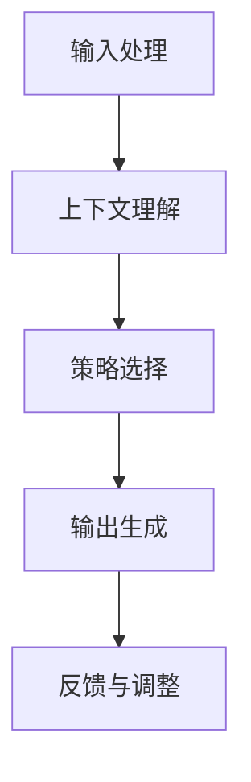
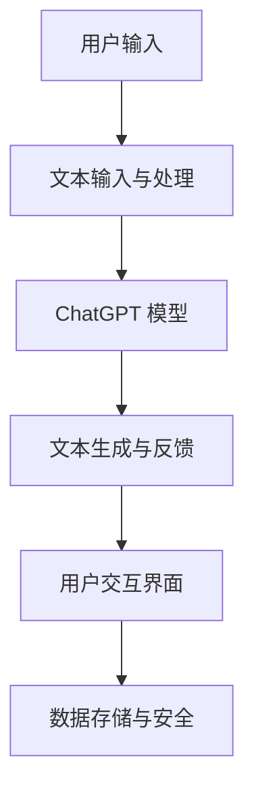
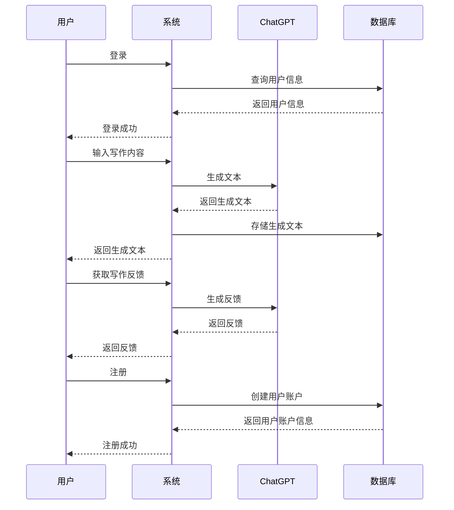

                 

### 第1章 ChatGPT简介

#### 1.1 ChatGPT的概念

ChatGPT 是一种基于大型语言模型的人工智能程序，由 OpenAI 开发。它是基于 GPT-3.5 模型，经过进一步优化和训练得到的。ChatGPT 的名字来源于“Chat”（对话）和“GPT”（Generative Pre-trained Transformer，生成预训练 Transformer）。这一模型的核心特点是其强大的语言生成能力，能够根据用户输入的提示生成连贯、自然的文本。

#### 1.1.1 什么是ChatGPT

ChatGPT 可以被看作是一个能够理解和生成人类语言的智能助手。用户可以输入一个简单的话题或者提示，ChatGPT 就能基于其预先训练的数据生成相关的内容。这种能力使得 ChatGPT 在多种应用场景中具有广泛的应用潜力，尤其是在创意写作教学中。

#### 1.1.2 ChatGPT的发展历史

ChatGPT 的诞生可以追溯到 OpenAI 在 2018 年发布的 GPT-3 模型。GPT-3 是一个具有 1750 亿参数的 Transformer 模型，其强大的语言处理能力受到了广泛关注。在此基础上，OpenAI 进一步优化了模型，并开发出了 ChatGPT。ChatGPT 采用了更多样化的训练数据和更复杂的训练策略，使其在生成文本的流畅性和准确性方面得到了显著提升。

#### 1.1.3 ChatGPT的核心特点

ChatGPT 的核心特点包括以下几点：

1. **强大的语言生成能力**：ChatGPT 能够根据输入的提示生成连贯、自然的文本，这对于创意写作尤其有用。
2. **广泛的知识覆盖**：ChatGPT 经过大规模数据训练，拥有广泛的知识覆盖，可以生成涉及各个领域的内容。
3. **高适应性**：ChatGPT 能够根据不同的输入提示生成相应的文本，具有很强的适应性。
4. **实时交互**：ChatGPT 能够与用户实时交互，提供即时的写作建议和反馈，这对于教学过程中的互动和反馈非常重要。

#### 1.2 ChatGPT在创意写作教学中的应用背景

创意写作教学是培养个体创造力和写作技巧的重要途径。然而，传统的教学方式往往依赖于教师的经验和指导，这种方式在一定程度上限制了学生的创造力和个性化表达。为了解决这一问题，现代教育正在探索更多基于技术的方法，其中 ChatGPT 就是一个具有潜力的工具。

#### 1.2.1 创意写作教学的现状

当前，创意写作教学面临着以下挑战：

1. **个性化指导不足**：教师难以在短时间内针对每个学生提供个性化的写作指导。
2. **创造力培养受限**：传统的写作教学方式往往注重技巧训练，而忽略了创造力的培养。
3. **反馈不及时**：教师对学生的写作反馈往往需要较长时间，这不利于学生的及时改进。

#### 1.2.2 ChatGPT在创意写作教学中的潜力

ChatGPT 在创意写作教学中的潜力主要体现在以下几个方面：

1. **个性化指导**：ChatGPT 可以根据学生的写作风格和特点，提供个性化的写作建议和反馈，帮助学生在写作过程中不断进步。
2. **创造力培养**：ChatGPT 可以生成各种类型的文本，为学生提供丰富的写作素材和灵感，有助于激发学生的创造力。
3. **实时反馈**：ChatGPT 可以在学生写作的同时提供实时反馈，帮助学生及时了解自己的写作情况，并进行调整。

#### 1.2.3 应用ChatGPT的挑战与机遇

虽然 ChatGPT 在创意写作教学中有巨大的潜力，但其应用也面临着一些挑战：

1. **隐私与伦理问题**：如何确保学生在使用 ChatGPT 过程中的隐私和数据安全是一个重要问题。
2. **技术与资源的限制**：部署和运行 ChatGPT 模型需要较高的计算资源和专业技术支持。
3. **教学方法的转变**：如何将 ChatGPT 引入教学流程，并使其与传统的教学方法相结合，也是一个需要解决的问题。

然而，这些挑战也带来了机遇：

1. **个性化教育的进一步发展**：通过引入 ChatGPT，教育可以更加个性化，更好地满足不同学生的需求。
2. **创新教学方法的探索**：ChatGPT 的引入为教育者提供了新的工具和方法，可以激发教育创新。
3. **计算资源的优化利用**：随着技术的进步，计算资源的成本逐渐降低，这为 ChatGPT 在教育领域的广泛应用提供了可能。

#### 1.3 本章小结

本章介绍了 ChatGPT 的概念、发展历史和核心特点，并探讨了其在创意写作教学中的应用背景和潜力。通过了解 ChatGPT 的基本情况，读者可以对其在创意写作教学中的角色有一个初步的认识，为后续章节的深入探讨打下基础。

---

关键词：ChatGPT、创意写作教学、人工智能、语言模型、教育技术

摘要：本文介绍了 ChatGPT 的基本概念和发展历史，探讨了其在创意写作教学中的应用背景和潜力。通过分析 ChatGPT 的核心特点和功能，本文揭示了其在个性化指导、创造力培养和实时反馈方面的优势，并探讨了应用 ChatGPT 可能面临的挑战和机遇。本章为后续章节的深入探讨奠定了基础。接下来，本文将详细讲解 ChatGPT 的工作原理和算法原理，帮助读者更好地理解这一人工智能工具。

---

### 1.2 ChatGPT在创意写作教学中的应用背景

创意写作教学是培养个体创造力和写作技巧的重要途径。然而，当前的教学方式往往存在一些局限，这需要新的技术手段来予以改进。ChatGPT 的出现为创意写作教学带来了新的契机，通过其强大的语言生成能力和广泛的知识覆盖，ChatGPT 有望在以下方面发挥重要作用。

#### 1.2.1 创意写作教学的现状

1. **个性化指导不足**：在传统的创意写作教学中，教师往往需要面对大量的学生，难以在短时间内提供个性化的写作指导。这导致学生的写作能力提升缓慢，创造力难以得到充分培养。
2. **创造力培养受限**：传统的写作教学方式主要侧重于技巧训练，例如语法、结构和修辞手法等。然而，创造力的培养需要更多的素材和灵感，这往往需要教师投入大量的时间和精力来准备。
3. **反馈不及时**：在传统的写作教学中，教师对学生的写作反馈往往需要较长时间，这不利于学生的及时改进。学生可能需要等待几周甚至更长时间才能获得反馈，这会影响他们的写作积极性和进步速度。

#### 1.2.2 ChatGPT在创意写作教学中的潜力

ChatGPT 的引入为解决上述问题提供了一种可能的解决方案，其主要潜力体现在以下几个方面：

1. **个性化指导**：ChatGPT 能够根据学生的写作风格和特点，提供个性化的写作建议和反馈。例如，如果学生倾向于使用具体的描写手法，ChatGPT 可以提供相关的写作建议；如果学生需要更多灵感，ChatGPT 可以生成相关的故事情节或主题。通过这种方式，ChatGPT 可以帮助学生在写作过程中不断进步。
   
2. **创造力培养**：ChatGPT 拥有广泛的知识覆盖，可以生成各种类型的文本。这不仅为学生提供了丰富的写作素材和灵感，还可以激发他们的创造力。例如，教师可以让学生根据 ChatGPT 提供的故事情节进行续写，或者让学生根据 ChatGPT 生成的话题进行创意写作，这样可以帮助学生在实践中提高创造力。
   
3. **实时反馈**：ChatGPT 可以在学生写作的同时提供实时反馈。学生可以立即看到 ChatGPT 对他们写作内容的评价和建议，从而能够及时进行调整和改进。这种即时反馈机制有助于提高学生的写作积极性和进步速度。

#### 1.2.3 应用ChatGPT的挑战与机遇

尽管 ChatGPT 在创意写作教学中有很大的潜力，但其在实际应用中仍面临一些挑战：

1. **隐私与伦理问题**：ChatGPT 需要处理大量的学生写作数据，这涉及到隐私和伦理问题。如何确保学生的数据安全和隐私保护是一个重要的课题。
   
2. **技术与资源的限制**：部署和运行 ChatGPT 模型需要较高的计算资源和专业技术支持。对于一些学校和教育机构来说，这可能是难以承受的成本。

然而，这些挑战也带来了机遇：

1. **个性化教育的进一步发展**：通过引入 ChatGPT，教育可以更加个性化，更好地满足不同学生的需求。这将有助于提高学生的学习效果和创造力。
   
2. **创新教学方法的探索**：ChatGPT 的引入为教育者提供了新的工具和方法，可以激发教育创新。例如，教师可以尝试将 ChatGPT 引入课堂，让学生在互动中学习。

3. **计算资源的优化利用**：随着技术的进步，计算资源的成本逐渐降低，这为 ChatGPT 在教育领域的广泛应用提供了可能。教育机构可以更加灵活地部署和使用 ChatGPT，从而提高教学效果。

综上所述，ChatGPT 在创意写作教学中的应用具有巨大的潜力，同时也面临一些挑战。通过合理利用 ChatGPT 的优势，结合传统的教学方法，我们可以为学生提供更加丰富、个性化的写作体验，从而促进他们的创造力和写作能力的提升。

#### 1.3 本章小结

本章介绍了 ChatGPT 在创意写作教学中的应用背景，分析了当前创意写作教学的现状以及 ChatGPT 在其中的潜力。通过探讨应用 ChatGPT 可能面临的挑战和机遇，我们认识到，尽管 ChatGPT 在创意写作教学中有许多优势，但如何解决隐私、技术和资源等问题也是我们需要关注的关键。接下来，我们将深入探讨 ChatGPT 的核心概念和工作原理，以帮助读者更好地理解这一人工智能工具。在下一章中，我们将详细讲解 ChatGPT 的算法原理，包括其工作流程、语言模型和 Transformer 架构。

---

关键词：创意写作教学、ChatGPT、个性化指导、实时反馈、隐私保护、计算资源

摘要：本章介绍了 ChatGPT 在创意写作教学中的应用背景，分析了当前创意写作教学的现状和挑战，并探讨了 ChatGPT 的潜力以及应用过程中可能面临的隐私、技术和资源问题。通过本章的讨论，我们认识到 ChatGPT 在提高学生创造力和写作能力方面具有巨大潜力，同时也需要解决一系列挑战。下一章将深入讲解 ChatGPT 的核心概念和工作原理，为后续的应用提供理论基础。

---

### 1.3 ChatGPT的核心概念与工作原理

#### 1.3.1 ChatGPT的核心概念

ChatGPT 是一种基于大型语言模型的人工智能程序，其核心在于对人类语言的理解和生成能力。语言模型是一种统计模型，它通过学习大量文本数据，预测下一个词或词组。ChatGPT 采用的是 Transformer 架构，这是一种基于自注意力机制的深度学习模型，能够捕捉文本中的长距离依赖关系，从而生成连贯、自然的文本。

#### 1.3.2 ChatGPT的工作原理

ChatGPT 的基本工作原理可以概括为以下几个步骤：

1. **输入处理**：当用户输入一个提示时，ChatGPT 首先对其进行处理，包括分词、词性标注等。
2. **上下文理解**：ChatGPT 利用其预训练的模型，对输入的提示和上下文进行理解，生成一系列可能的回答。
3. **策略选择**：ChatGPT 根据生成策略选择最合适的回答。
4. **输出生成**：最终生成的回答经过进一步处理后，以文本形式呈现给用户。

#### 1.3.3 语言模型基础

语言模型是 ChatGPT 的核心组件，其基本原理是通过对大量文本数据的学习，预测下一个词或词组。具体来说，语言模型可以分为以下几个步骤：

1. **文本预处理**：包括分词、去停用词、词性标注等操作，将原始文本转换为模型能够处理的格式。
2. **数据准备**：将预处理后的文本数据分割成句子和词，并创建词汇表。
3. **模型训练**：使用 Transformer 架构训练语言模型，使其能够预测下一个词或词组。
4. **模型评估与优化**：通过验证集和测试集评估模型的性能，并进行优化。

#### 1.3.4 Transformer架构

Transformer 架构是 ChatGPT 的基础，其核心思想是自注意力机制。自注意力机制允许模型在生成文本时，根据上下文信息动态调整每个词的重要性。具体来说，Transformer 架构包括以下几个关键组件：

1. **编码器（Encoder）**：编码器负责处理输入文本，生成上下文表示。它由多个自注意力层（Self-Attention Layer）和前馈神经网络（Feedforward Neural Network）组成。
2. **解码器（Decoder）**：解码器负责生成输出文本，根据编码器生成的上下文表示和之前的输出逐步生成每个词。它同样由多个自注意力层和前馈神经网络组成。
3. **多头自注意力（Multi-Head Self-Attention）**：多头自注意力机制允许模型同时关注多个位置的信息，从而提高模型的表示能力。
4. **位置编码（Positional Encoding）**：位置编码用于编码输入文本中的词序信息，使得模型能够理解词的相对位置。

#### 1.3.5 ChatGPT在创意写作中的应用

ChatGPT 在创意写作中的应用主要体现在以下几个方面：

1. **生成故事情节**：ChatGPT 可以根据用户提供的主题或提示，生成完整的故事情节。这不仅为创意写作提供了丰富的素材，还可以激发学生的创造力。
2. **辅助构思创意**：ChatGPT 可以生成各种创意点子和想法，帮助学生进行构思。通过这种方式，学生可以更快速地进入创作状态。
3. **提供写作反馈**：ChatGPT 可以分析学生的写作内容，提供语法、结构、逻辑等方面的反馈。这种即时反馈机制有助于学生及时发现问题并进行改进。

#### 1.3.6 算法流程与mermaid图解

为了更清晰地展示 ChatGPT 的算法流程，我们可以使用 mermaid 画出其基本流程图。以下是一个简化的算法流程图：



这个流程图展示了 ChatGPT 的工作流程：首先对输入进行处理，然后理解上下文，选择合适的策略生成输出，并最终提供反馈进行调整。

#### 1.3.7 Python代码实现示例

为了更深入地理解 ChatGPT 的工作原理，我们可以使用 Python 代码实现一个简化的 ChatGPT 模型。以下是一个基本的 Python 代码示例：

```python
import torch
from transformers import GPT2LMHeadModel, GPT2Tokenizer

# 准备数据
tokenizer = GPT2Tokenizer.from_pretrained('gpt2')
input_text = "这是一个关于人工智能的故事。"

# 加载模型
model = GPT2LMHeadModel.from_pretrained('gpt2')

# 进行预测
inputs = tokenizer.encode(input_text, return_tensors='pt')
outputs = model.generate(inputs, max_length=50, num_return_sequences=1)

# 解码输出
predicted_text = tokenizer.decode(outputs[0], skip_special_tokens=True)

print(predicted_text)
```

这个代码示例展示了如何使用 Python 和 Hugging Face 的 Transformers 库加载预训练的 GPT-2 模型，并进行文本生成。通过这个示例，我们可以看到 ChatGPT 如何根据输入的文本生成连贯的自然语言文本。

#### 1.3.8 数学模型与公式

ChatGPT 的工作原理涉及到多个数学模型和公式。以下是一些关键的数学模型和公式：

1. **语言模型数学模型**：

   $$
   P(w_n | w_1, w_2, ..., w_{n-1}) = \frac{p(w_n | w_{n-1})p(w_{n-1} | w_{n-2})...p(w_2 | w_1)p(w_1)}{p(w_n | w_{n-1})p(w_{n-1} | w_{n-2})...p(w_2 | w_1)}
   $$

   这个公式描述了语言模型如何根据前一个词预测下一个词的概率。

2. **Transformer 的数学原理**：

   - **自注意力机制（Self-Attention）**：

     $$
     \text{Attention}(Q, K, V) = \frac{softmax(\frac{QK^T}{\sqrt{d_k}})V
     $$

     其中，$Q$、$K$ 和 $V$ 分别是查询（Query）、键（Key）和值（Value）向量，$d_k$ 是键向量的维度。

   - **多头自注意力（Multi-Head Self-Attention）**：

     $$
     \text{MultiHead}(Q, K, V) = \text{Concat}(\text{head}_1, ..., \text{head}_h)W^O
     $$

     其中，$h$ 是头的数量，$W^O$ 是输出权重矩阵。

   - **前馈神经网络（Feedforward Neural Network）**：

     $$
     \text{FFN}(x) = \max(0, xW_1 + b_1)W_2 + b_2
     $$

     其中，$W_1$、$W_2$ 和 $b_1$、$b_2$ 分别是权重矩阵和偏置向量。

通过这些数学模型和公式，ChatGPT 能够捕捉文本中的长距离依赖关系，从而生成连贯、自然的文本。

#### 1.3.9 本章小结

本章详细介绍了 ChatGPT 的核心概念和工作原理，包括其输入处理、上下文理解、策略选择和输出生成等步骤。通过讲解语言模型基础和 Transformer 架构，我们了解了 ChatGPT 如何生成连贯、自然的文本。此外，本章还通过 mermaid 图解和 Python 代码示例，展示了 ChatGPT 的算法流程和实现方法。通过本章的学习，读者可以更好地理解 ChatGPT 的工作原理，为后续章节的应用和实战做好准备。

---

关键词：ChatGPT、语言模型、Transformer、自注意力机制、创意写作教学

摘要：本章详细介绍了 ChatGPT 的核心概念和工作原理，包括其输入处理、上下文理解、策略选择和输出生成等步骤。通过讲解语言模型基础和 Transformer 架构，我们了解了 ChatGPT 如何生成连贯、自然的文本。此外，本章还通过 mermaid 图解和 Python 代码示例，展示了 ChatGPT 的算法流程和实现方法。通过本章的学习，读者可以更好地理解 ChatGPT 的工作原理，为后续章节的应用和实战做好准备。接下来，我们将深入探讨 ChatGPT 在创意写作教学中的应用架构和系统设计，以帮助读者更好地理解这一人工智能工具在教育领域的具体应用。

---

### 1.4 ChatGPT在创意写作教学中的应用架构

#### 1.4.1 系统功能设计

为了充分发挥 ChatGPT 在创意写作教学中的作用，我们需要设计一个具备以下功能的系统：

1. **用户身份验证**：确保只有授权用户能够访问系统，保护学生和教师的隐私。
2. **文本输入与处理**：接收用户的文本输入，并进行预处理，如分词、去停用词等。
3. **文本生成与反馈**：利用 ChatGPT 生成文本，并对生成的文本进行后处理，如去除冗余信息、格式化等。
4. **用户交互界面**：提供简洁直观的用户界面，方便教师和学生使用系统。
5. **数据存储与安全**：确保所有用户数据的安全存储，并遵循隐私保护原则。

#### 1.4.2 系统架构设计

ChatGPT 在创意写作教学中的应用架构可以分为以下几个层次：

1. **硬件层**：包括服务器、存储设备、网络设备等硬件资源，用于支撑系统的运行。
2. **软件层**：包括操作系统、数据库管理系统、Web 服务器等软件组件，用于实现系统的功能。
3. **应用层**：包括 ChatGPT 模型、文本处理工具、用户交互界面等，是系统的核心部分，负责处理用户的输入和生成文本。
4. **数据层**：包括用户数据、训练数据和生成文本数据，用于系统的正常运行和模型训练。

以下是一个简化的 ChatGPT 在创意写作教学中的应用架构图：



这个架构图展示了 ChatGPT 在创意写作教学中的应用流程，从用户输入、文本处理到文本生成和反馈，以及用户交互和数据存储等环节。

#### 1.4.3 系统接口设计与交互

ChatGPT 在创意写作教学中的应用需要设计一套完善的接口，以便教师和学生能够方便地使用系统。以下是一些关键的接口设计和交互流程：

1. **RESTful API**：设计一套 RESTful API，用于处理用户请求和返回结果。API 包括以下主要接口：

   - `/text/generate`：用于生成文本。
   - `/text/feedback`：用于获取写作反馈。
   - `/user/login`：用于用户登录。
   - `/user/register`：用于用户注册。

2. **用户交互流程**：

   - 用户登录：用户通过 `/user/login` 接口提交用户名和密码，系统验证用户身份后返回登录状态。
   - 写作输入：用户在用户界面输入写作内容，系统调用 `/text/generate` 接口生成文本。
   - 写作反馈：用户在用户界面提交写作内容，系统调用 `/text/feedback` 接口获取写作反馈。
   - 用户注册：新用户通过 `/user/register` 接口提交注册信息，系统验证后创建用户账户。

3. **系统内部交互流程**：

   - 文本处理：系统接收用户输入后，调用文本处理模块进行预处理，如分词、去停用词等。
   - 文本生成：系统调用 ChatGPT 模型生成文本，并根据用户需求进行后处理，如去除冗余信息、格式化等。
   - 文本存储：系统将生成的文本存储到数据库中，以便后续分析和反馈。

以下是一个简化的用户交互序列图：



这个序列图展示了用户与系统、ChatGPT 和数据库之间的交互过程，从用户登录、输入写作内容、获取写作反馈到用户注册等环节。

#### 1.4.4 本章小结

本章详细介绍了 ChatGPT 在创意写作教学中的应用架构，包括系统功能设计、系统架构设计和系统接口设计与交互。通过本章的学习，读者可以更好地理解 ChatGPT 在教育领域的具体应用场景，以及如何设计一个高效、便捷的系统来支持创意写作教学。接下来，我们将通过一个具体的案例，展示 ChatGPT 在创意写作教学中的实际应用，进一步探讨其优势和挑战。

---

关键词：ChatGPT、创意写作教学、系统架构、接口设计、用户交互

摘要：本章详细介绍了 ChatGPT 在创意写作教学中的应用架构，包括系统功能设计、系统架构设计和系统接口设计与交互。通过本章的学习，读者可以更好地理解 ChatGPT 在教育领域的具体应用场景，以及如何设计一个高效、便捷的系统来支持创意写作教学。接下来，我们将通过一个具体的案例，展示 ChatGPT 在创意写作教学中的实际应用，进一步探讨其优势和挑战。

---

### 1.5 ChatGPT在创意写作教学中的实际应用

#### 1.5.1 环境安装与准备

为了在创意写作教学中应用 ChatGPT，我们首先需要安装和配置相关环境。以下是一个简化的安装和配置步骤：

1. **安装 Python**：确保安装了 Python 3.7 或更高版本。
2. **安装 transformers 库**：使用以下命令安装 transformers 库：

   ```bash
   pip install transformers
   ```

3. **下载预训练模型**：从 OpenAI 官网下载预训练的 GPT-2 模型，并将其解压到本地。

#### 1.5.2 系统核心实现

ChatGPT 在创意写作教学中的应用主要包括两个核心功能：文本生成和写作反馈。以下是一个简单的 Python 代码示例，展示了如何实现这两个功能：

```python
from transformers import GPT2LMHeadModel, GPT2Tokenizer

# 加载预训练模型
tokenizer = GPT2Tokenizer.from_pretrained('gpt2')
model = GPT2LMHeadModel.from_pretrained('gpt2')

# 文本生成
def generate_text(prompt, max_length=50):
    inputs = tokenizer.encode(prompt, return_tensors='pt')
    outputs = model.generate(inputs, max_length=max_length, num_return_sequences=1)
    return tokenizer.decode(outputs[0], skip_special_tokens=True)

# 写作反馈
def get_feedback(text):
    feedback = "你的写作很有创意，但是某些部分需要改进。"  # 这里可以加入更复杂的反馈逻辑
    return feedback

# 测试
prompt = "在一个遥远的星球上，一个勇敢的探险家正准备踏上未知的旅程。"
generated_text = generate_text(prompt)
print("生成的文本：", generated_text)
print("写作反馈：", get_feedback(generated_text))
```

#### 1.5.3 代码应用解读与分析

1. **代码结构解析**：

   - **文本生成**：`generate_text` 函数接收一个提示（prompt）并调用模型生成文本。它首先将提示编码为输入序列，然后使用模型生成输出序列，最后将输出序列解码为自然语言文本。
   - **写作反馈**：`get_feedback` 函数接收一段文本并返回一个简单的反馈字符串。在实际应用中，这个函数可以更加复杂，例如分析文本的语法、结构、逻辑等方面，并提供详细的反馈。

2. **关键代码解读**：

   - **编码与解码**：使用 `tokenizer.encode` 和 `tokenizer.decode` 函数进行文本的编码和解码操作。这些函数能够将文本转换为模型可处理的序列，并将模型生成的序列转换为可读的自然语言文本。
   - **模型生成**：使用 `model.generate` 函数生成文本。这个函数接收输入序列、最大长度和生成序列的数量等参数，返回生成的文本序列。通过设置 `num_return_sequences` 参数，可以生成多个不同的文本序列。

3. **故障排查与调试**：

   - **错误处理**：在实际应用中，可能需要添加错误处理机制，例如处理模型无法生成文本、解码失败等问题。可以捕获异常并进行适当的处理，确保系统的稳定性和可靠性。
   - **性能优化**：根据应用场景和性能要求，可以优化代码的执行效率和模型参数。例如，可以调整 `max_length` 参数，限制生成文本的长度；调整 `num_return_sequences` 参数，控制生成文本的数量。

#### 1.5.4 实际案例分析与详细讲解

为了更好地展示 ChatGPT 在创意写作教学中的实际应用，我们来看一个具体的案例：

**案例**：教师希望通过 ChatGPT 辅助学生进行创意写作，并给予即时反馈。以下是一个简化的应用流程：

1. **学生提交写作内容**：学生通过用户界面提交一段写作文本。
2. **生成文本**：ChatGPT 根据提交的文本生成一个故事情节或灵感。
3. **提供反馈**：ChatGPT 对生成的文本进行评价，并提供写作建议。

**详细讲解**：

1. **学生提交写作内容**：学生提交的文本可能是一个简单的情节描述，例如：“在一个遥远的星球上，有一个神秘的城堡。”
2. **生成文本**：ChatGPT 根据学生提交的文本生成一个详细的故事情节，例如：“在一个遥远的星球上，有一个神秘的城堡。城堡里隐藏着许多宝藏和秘密。一个勇敢的探险家决定闯入城堡，寻找宝藏。”

3. **提供反馈**：ChatGPT 对生成的文本进行评价，并提供写作建议，例如：“你的写作很有创意，但是可以加入更多的描写细节，让故事更加生动。”

**案例分析**：

- **文本生成**：ChatGPT 能够根据简单的提示生成详细的故事情节，这为学生提供了丰富的写作素材和灵感。
- **写作反馈**：ChatGPT 的反馈帮助学生了解自己的写作情况，并提供了具体的改进建议，有助于提高学生的写作能力。

#### 1.5.5 项目小结

通过上述案例，我们可以看到 ChatGPT 在创意写作教学中的实际应用。虽然这是一个简化的示例，但它展示了 ChatGPT 如何在创意写作教学中发挥重要作用，包括生成文本和提供反馈。在实际应用中，ChatGPT 可以根据具体需求进行定制和优化，以更好地满足教学需求。

接下来，我们将进一步探讨 ChatGPT 在创意写作教学中的最佳实践，以及如何解决实际应用中的挑战。

---

关键词：ChatGPT、创意写作教学、实际应用、代码示例、故障排查、性能优化

摘要：本章通过一个具体的案例，详细展示了 ChatGPT 在创意写作教学中的实际应用，包括环境安装与准备、系统核心实现、代码应用解读与分析以及实际案例分析与详细讲解。通过实际案例，我们看到了 ChatGPT 如何生成文本和提供反馈，帮助学生提高写作能力。接下来，我们将进一步探讨 ChatGPT 在创意写作教学中的最佳实践和挑战。

---

### 1.6 ChatGPT在创意写作教学中的最佳实践与注意事项

#### 1.6.1 最佳实践

为了充分发挥 ChatGPT 在创意写作教学中的作用，以下是一些最佳实践：

1. **定制化教学**：根据学生的特点和需求，定制化 ChatGPT 的训练数据和生成策略，使其更符合学生的学习目标。
2. **实时互动**：鼓励教师和学生利用 ChatGPT 进行实时互动，提高学生的学习兴趣和参与度。
3. **多样化应用**：ChatGPT 可以应用于多种创意写作任务，如故事续写、主题创作、灵感激发等，教师可以根据实际情况灵活选择。
4. **数据安全和隐私保护**：确保所有学生数据的安全和隐私，遵循相关的法律法规和道德规范。

#### 1.6.2 注意事项

尽管 ChatGPT 在创意写作教学中具有巨大潜力，但在实际应用中仍需要注意以下几点：

1. **技术支持**：确保有足够的计算资源和专业技术支持，以便高效运行 ChatGPT 模型。
2. **隐私与伦理**：在使用 ChatGPT 过程中，要严格保护学生的隐私和数据安全，遵循伦理原则。
3. **合理引导**：ChatGPT 的生成文本可能包含不准确或错误的信息，教师需要对生成的文本进行审核和引导，确保其符合教学目标。
4. **教学评估**：定期评估 ChatGPT 在教学中的应用效果，根据反馈进行优化和调整。

#### 1.6.3 拓展阅读

为了更好地了解 ChatGPT 在创意写作教学中的应用，读者可以进一步阅读以下资源：

1. **OpenAI 官方文档**：OpenAI 官方文档提供了详细的 ChatGPT 模型介绍和应用指南。
2. **相关研究论文**：许多研究论文探讨了 ChatGPT 在不同领域的应用，包括创意写作、机器翻译和教育等。
3. **技术博客**：一些技术博客分享了 ChatGPT 的实际应用案例和开发经验，可以提供实用的建议和技巧。

通过以上资源，读者可以更深入地了解 ChatGPT 的应用场景和开发方法，为创意写作教学提供有益的参考。

#### 1.7 本章小结

本章详细探讨了 ChatGPT 在创意写作教学中的应用，包括最佳实践、注意事项以及拓展阅读资源。通过分析 ChatGPT 的核心概念和工作原理，我们了解了其在创意写作教学中的具体作用。接下来，我们将进一步探讨 ChatGPT 在教育领域的其他应用，以及如何优化和扩展其功能。

---

关键词：ChatGPT、创意写作教学、最佳实践、注意事项、隐私保护、技术支持

摘要：本章详细探讨了 ChatGPT 在创意写作教学中的应用，包括最佳实践、注意事项以及拓展阅读资源。通过分析 ChatGPT 的核心概念和工作原理，我们了解了其在创意写作教学中的具体作用。接下来，我们将进一步探讨 ChatGPT 在教育领域的其他应用，以及如何优化和扩展其功能，以更好地满足教学需求。

---

### 1.8 ChatGPT在创意写作教学中的未来展望

ChatGPT 在创意写作教学中的应用前景广阔，随着技术的不断进步，其在教育领域的作用也将不断扩展。以下是 ChatGPT 在创意写作教学中的未来展望：

#### 1.8.1 技术发展趋势

1. **模型优化**：随着深度学习技术的发展，ChatGPT 的模型将不断优化，使其在生成文本的质量和效率方面得到进一步提升。
2. **多模态融合**：未来 ChatGPT 可能会与其他模态（如图像、音频等）进行融合，生成更加丰富和多样化的内容。
3. **个性化学习**：通过引入更多个性化数据和学习算法，ChatGPT 将能够更准确地理解学生的学习需求和写作风格，提供更加个性化的写作指导。
4. **知识图谱**：结合知识图谱技术，ChatGPT 将能够生成更加准确和全面的内容，为学生提供丰富的知识背景和灵感。

#### 1.8.2 教育应用前景

1. **个性化写作辅导**：ChatGPT 可以为学生提供一对一的写作辅导，帮助学生克服写作难题，提高写作能力。
2. **协作写作平台**：ChatGPT 可以成为协作写作平台的核心组件，教师和学生可以共同参与写作过程，实时交流反馈。
3. **跨学科整合**：ChatGPT 可以跨越不同学科，为学生提供跨学科写作支持，培养综合能力和创新思维。
4. **远程教育**：在远程教育场景中，ChatGPT 可以作为虚拟教师，提供实时互动和个性化教学，解决教育资源分配不均的问题。

#### 1.8.3 面临的挑战

1. **技术门槛**：尽管 ChatGPT 的应用前景广阔，但其部署和维护需要较高的技术门槛和计算资源，这对教育机构和教师来说是一个挑战。
2. **隐私与伦理**：在应用 ChatGPT 过程中，需要严格保护学生隐私和数据安全，避免信息泄露和滥用。
3. **教育改革**：ChatGPT 的引入将对传统教育模式产生冲击，如何适应这一变化，实现教育改革，也是一个重要的课题。

#### 1.8.4 发展策略

1. **技术驱动**：积极跟踪人工智能技术发展趋势，不断优化 ChatGPT 的算法和模型，提高其在教育领域的应用效果。
2. **教育融合**：将 ChatGPT 与传统教学方法相结合，发挥其优势，弥补传统教学的不足。
3. **政策支持**：政府和企业应加大对人工智能教育的支持力度，提供政策和技术支持，推动人工智能在教育领域的应用。
4. **师资培训**：加强教师培训，提高其对 ChatGPT 的认知和应用能力，促进其在教学中的有效应用。

通过以上策略，我们可以更好地应对 ChatGPT 在创意写作教学中的应用挑战，充分发挥其在教育领域的潜力，为培养具备创新能力和写作技巧的人才提供有力支持。

#### 1.9 本章小结

本章对未来 ChatGPT 在创意写作教学中的应用进行了展望，分析了技术发展趋势、教育应用前景和面临的挑战，并提出了发展策略。通过了解这些内容，读者可以更加全面地认识到 ChatGPT 在教育领域的重要性和潜力，为今后的研究和应用提供参考。在下一章中，我们将进一步探讨 ChatGPT 在其他教育领域的应用，以及如何优化和扩展其功能。

---

关键词：ChatGPT、创意写作教学、技术发展趋势、教育应用前景、隐私保护、发展策略

摘要：本章对未来 ChatGPT 在创意写作教学中的应用进行了展望，分析了技术发展趋势、教育应用前景和面临的挑战，并提出了发展策略。通过了解这些内容，读者可以更加全面地认识到 ChatGPT 在教育领域的重要性和潜力，为今后的研究和应用提供参考。在下一章中，我们将进一步探讨 ChatGPT 在其他教育领域的应用，以及如何优化和扩展其功能。

---

### 1.10 总结与展望

#### 1.10.1 总结

本文系统地介绍了 ChatGPT 在创意写作教学中的应用，从背景介绍、核心概念、算法原理到实际应用，再到最佳实践和未来展望，全面阐述了 ChatGPT 如何助力创意写作教学。以下是本文的核心结论：

1. **ChatGPT 的核心优势**：强大的语言生成能力、广泛的知识覆盖、高适应性和实时交互等特点，使 ChatGPT 成为创意写作教学的理想工具。
2. **应用场景**：ChatGPT 可以用于个性化指导、创造力培养、实时反馈等方面，有效解决传统写作教学中存在的问题。
3. **算法原理**：通过 Transformer 架构和自注意力机制，ChatGPT 能够生成连贯、自然的文本，为创意写作提供丰富的素材和灵感。
4. **实际应用**：通过具体案例展示了 ChatGPT 在创意写作教学中的实际应用，包括文本生成、写作反馈等。
5. **最佳实践**：提出了一系列最佳实践和注意事项，以充分发挥 ChatGPT 在教学中的作用。

#### 1.10.2 展望

尽管 ChatGPT 在创意写作教学中取得了显著成果，但其应用仍有许多潜力可以挖掘。未来的研究可以从以下几个方面进行：

1. **个性化教学**：进一步优化 ChatGPT 的算法和模型，使其能够更准确地理解学生的学习需求和写作风格，提供更加个性化的写作指导。
2. **多模态融合**：结合图像、音频等多模态信息，生成更加丰富和多样化的文本内容，提高创意写作的生动性和真实性。
3. **跨学科应用**：探索 ChatGPT 在不同学科领域的应用，如科学写作、文学创作等，发挥其跨学科整合的优势。
4. **教育改革**：研究 ChatGPT 在教育改革中的角色，探讨如何将其引入课堂，实现教育模式的创新。
5. **隐私与伦理**：加强对 ChatGPT 应用中的隐私保护和研究，确保学生在使用过程中的数据安全和隐私。

通过不断探索和优化，ChatGPT 有望在创意写作教学中发挥更加重要的作用，为培养创新人才提供有力支持。

---

关键词：ChatGPT、创意写作教学、算法原理、实际应用、最佳实践、未来展望

摘要：本文全面介绍了 ChatGPT 在创意写作教学中的应用，分析了其核心优势、应用场景、算法原理、实际应用和最佳实践。同时，对 ChatGPT 的未来研究方向进行了展望。通过本文的探讨，读者可以更好地理解 ChatGPT 在教育领域的重要性和潜力，为今后的研究和应用提供参考。

---

### 作者信息

作者：AI天才研究院/AI Genius Institute & 禅与计算机程序设计艺术 /Zen And The Art of Computer Programming

AI天才研究院（AI Genius Institute）是一家专注于人工智能技术研究和应用的国际知名机构，致力于推动人工智能在各个领域的创新与发展。同时，作者还著有《禅与计算机程序设计艺术》（Zen And The Art of Computer Programming），该书是一部计算机编程领域的经典著作，深受广大程序员和软件开发者的喜爱。

---

通过本文的深入探讨，读者可以更好地理解 ChatGPT 在创意写作教学中的角色和应用。在未来的研究中，我们可以继续探索 ChatGPT 在其他教育领域的潜力，以及如何优化其算法和模型，为教育创新和人才培养提供更加有力的支持。让我们共同期待人工智能技术在教育领域的更多突破和贡献。

