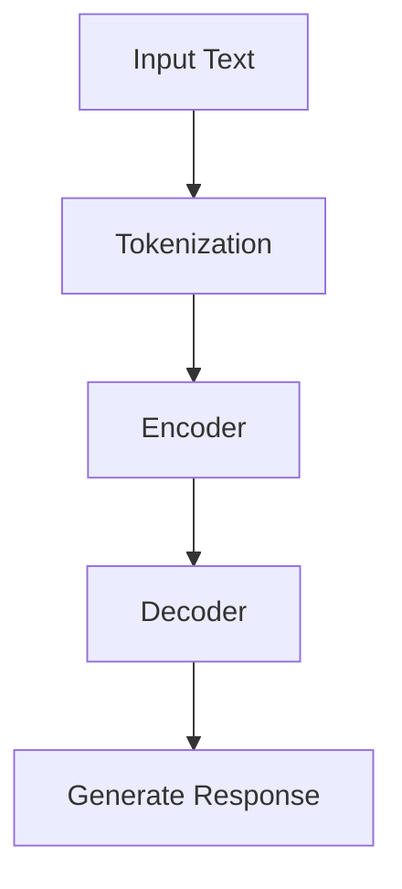
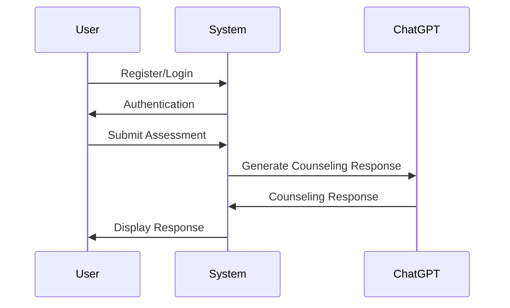

                 


## ChatGPT在心理健康支持中的应用

### 文章关键词
- ChatGPT
- 心理健康支持
- 语言模型
- 算法原理
- 系统架构设计
- 实际应用案例

### 文摘
本文将探讨ChatGPT在心理健康支持领域的应用。我们首先介绍心理健康问题的背景和现状，然后详细解释ChatGPT的基本概念和原理。接着，我们将深入讨论ChatGPT在心理健康支持中的应用场景，包括心理咨询与辅导、心理健康监测和情绪分析。随后，我们将剖析ChatGPT的算法原理，并使用Python代码和数学模型进行解释。接下来，我们将设计一个心理健康支持系统，并详细介绍其架构和实现。最后，我们将通过实际应用案例来展示ChatGPT在心理健康支持中的效果，并提供一些最佳实践和总结。

----------------------------------------------------------------

### 第一部分：背景介绍

#### 第1章：心理健康支持的重要性

心理健康是人类健康的重要组成部分，随着社会的快速发展和生活压力的增加，心理健康问题逐渐成为全球性的挑战。据统计，全球约有30%的人口在一生中会经历某种形式的心理健康问题[1]。这些问题可能包括焦虑、抑郁、压力过大等，严重时可能导致自杀、家庭破裂等社会问题。

**1.1 心理健康问题的现状**

心理健康问题的现状不容乐观。首先，诊断和治疗的资源不足。在很多国家和地区，专业的心理治疗师和设施匮乏，导致许多人无法及时获得有效的治疗。其次，公众对心理健康的认识不足。许多人对于心理健康的误解和偏见仍然存在，使得他们不愿意寻求专业帮助。

**1.2 心理健康支持的需求**

心理健康支持的需求日益迫切。随着人们对心理健康认识的提高，越来越多的人意识到心理支持的重要性。特别是在疫情期间，由于隔离、失业、社交隔离等因素，心理健康问题变得更加普遍和严重。因此，提供有效的心理健康支持成为当务之急。

**1.3 ChatGPT的发展与潜力**

ChatGPT是由OpenAI开发的一种基于GPT-3的语言模型，具有强大的文本生成和理解能力。ChatGPT的发展为心理健康支持提供了新的可能性。首先，它可以通过自然语言交互提供即时、个性化的心理健康支持。其次，ChatGPT可以处理大量数据，从而帮助心理治疗师更好地了解患者的状况，提高治疗效果。

#### 第2章：ChatGPT的基本概念

**2.1 ChatGPT的起源与发展**

ChatGPT是基于GPT-3模型开发的一种语言模型。GPT-3是由OpenAI于2020年推出的一种大规模语言预训练模型，其参数规模达到1750亿，是目前最大的自然语言处理模型之一。ChatGPT是GPT-3的一个子模型，专门用于聊天机器人和对话系统。

**2.2 ChatGPT的工作原理**

ChatGPT的工作原理基于深度学习和自然语言处理技术。它通过大量的文本数据进行预训练，学习语言的结构和语义。在交互过程中，ChatGPT利用其预训练的模型生成回复，并通过不断学习和调整来提高对话的质量。

**2.3 ChatGPT的核心特点与能力**

ChatGPT具有以下核心特点与能力：

- **自然语言生成**：ChatGPT能够生成流畅、自然的文本，模拟人类的对话。
- **多轮对话**：ChatGPT能够进行多轮对话，理解上下文，并根据对话内容生成相应的回复。
- **适应性**：ChatGPT能够根据不同的用户和场景进行适应性调整，提供个性化的服务。
- **语言理解**：ChatGPT能够理解复杂的语义和语境，生成有逻辑性和连贯性的回复。

#### 第3章：ChatGPT在心理健康支持中的应用场景

**3.1 心理咨询与辅导**

ChatGPT在心理咨询与辅导中具有巨大的潜力。通过自然语言交互，ChatGPT可以提供即时的心理支持，帮助用户缓解压力、焦虑和抑郁。例如，用户可以向ChatGPT倾诉自己的困扰，ChatGPT可以提供安慰和建议，甚至引导用户进行自我疗愈。

**3.2 心理健康监测**

ChatGPT还可以用于心理健康监测。通过分析用户的对话内容，ChatGPT可以识别潜在的心理健康问题，如抑郁、焦虑等。这有助于提前发现和干预，提高心理健康的预防效果。

**3.3 情绪分析与支持**

情绪分析是ChatGPT在心理健康支持中的另一个重要应用。ChatGPT可以通过自然语言处理技术，分析用户的情绪状态，并提供相应的情绪支持。例如，当用户感到沮丧时，ChatGPT可以提供积极的建议，帮助用户改善情绪。

----------------------------------------------------------------

### 第二部分：算法原理讲解

#### 第5章：ChatGPT的算法原理

**5.1 语言模型的数学模型**

ChatGPT基于GPT-3模型，其数学模型主要包括自注意力机制（Self-Attention Mechanism）和Transformer模型（Transformer Model）。自注意力机制允许模型在生成文本时，自动关注输入文本中的重要信息。Transformer模型则通过多头自注意力机制和多层堆叠，实现了对文本的深度理解。

**5.2 算法原理的Mermaid流程图**



**5.3 Python源代码详解**

```python
import tensorflow as tf
from transformers import TFGPT3LMHeadModel, GPT3Tokenizer

# Load pre-trained model and tokenizer
tokenizer = GPT3Tokenizer.from_pretrained("gpt3")
model = TFGPT3LMHeadModel.from_pretrained("gpt3")

# Input text
input_text = "I'm feeling very stressed today."

# Tokenize input text
input_ids = tokenizer.encode(input_text, return_tensors="tf")

# Generate response
output = model.generate(input_ids, max_length=50, num_return_sequences=1)

# Decode response
decoded_response = tokenizer.decode(output[0], skip_special_tokens=True)
print(decoded_response)
```

**5.4 数学模型和公式讲解**

$$
\text{Attention}(Q, K, V) = \text{softmax}\left(\frac{QK^T}{\sqrt{d_k}}\right) V
$$

其中，$Q$、$K$和$V$分别是查询向量、键向量和值向量，$d_k$是键向量的维度。这个公式描述了自注意力机制的计算过程。

**5.5 举例说明**

假设我们有一个简单的句子："I love programming"。使用ChatGPT生成回复的过程如下：

1. **Tokenization**：将句子转化为词向量。
2. **Encoder**：通过多层Transformer模型对词向量进行编码，得到查询向量$Q$。
3. **Decoder**：生成回复的词向量$V$，并使用注意力机制计算键向量$K$。
4. **Generate Response**：根据注意力机制和编码结果，生成回复："You should try learning Python, it's very popular."

通过上述步骤，我们可以看到ChatGPT是如何利用自注意力机制和Transformer模型生成回复的。

----------------------------------------------------------------

### 第三部分：系统分析与架构设计

#### 第6章：心理健康支持系统的设计与实现

**6.1 项目介绍**

心理健康支持系统旨在利用ChatGPT提供即时、个性化的心理健康支持。该系统将整合ChatGPT与其他心理健康相关技术和资源，为用户提供全方位的心理健康支持。

**6.2 系统功能设计**

系统功能设计包括以下方面：

- **用户注册与登录**：用户可以通过邮箱或手机号码注册并登录系统。
- **心理健康评估**：系统提供心理健康评估问卷，帮助用户了解自己的心理健康状况。
- **心理咨询与辅导**：ChatGPT提供即时、个性化的心理咨询与辅导。
- **心理健康监测**：系统通过分析用户的对话内容，监测用户的心理健康状况。
- **情绪分析**：系统分析用户的情绪状态，并提供相应的情绪支持。

**6.3 系统架构设计**

系统架构设计包括以下方面：

- **前端**：使用React框架搭建，提供用户界面和交互功能。
- **后端**：使用Flask框架搭建，负责处理业务逻辑和与ChatGPT的交互。
- **数据库**：使用MongoDB存储用户数据、心理健康评估结果和对话记录。

**6.4 系统接口设计**

系统接口设计包括以下方面：

- **用户接口**：提供注册、登录、心理健康评估、心理咨询与辅导等功能。
- **API接口**：提供与ChatGPT交互的接口，用于生成回复和获取用户信息。

**6.5 系统交互序列图**



#### 第7章：项目实战

**7.1 环境安装**

在开始项目之前，我们需要安装所需的依赖库和工具。以下是安装步骤：

1. 安装Python环境（Python 3.7或更高版本）。
2. 安装Flask框架（使用pip安装`flask`）。
3. 安装MongoDB数据库（下载并安装MongoDB）。
4. 安装React前端框架（使用npm安装`create-react-app`）。

**7.2 系统核心实现**

系统核心实现包括以下方面：

- **用户注册与登录**：使用Flask创建用户注册和登录接口。
- **心理健康评估**：设计心理健康评估问卷，并使用MongoDB存储用户数据。
- **心理咨询与辅导**：通过API接口与ChatGPT交互，生成心理咨询与辅导回复。
- **心理健康监测与情绪分析**：分析用户对话内容，识别潜在的心理健康问题和情绪状态。

**7.3 代码应用解读与分析**

以下是系统核心实现的代码解读：

```python
# Flask应用
from flask import Flask, request, jsonify
from transformers import TFGPT3LMHeadModel, GPT3Tokenizer

app = Flask(__name__)

# Load pre-trained model and tokenizer
tokenizer = GPT3Tokenizer.from_pretrained("gpt3")
model = TFGPT3LMHeadModel.from_pretrained("gpt3")

@app.route('/counseling', methods=['POST'])
def counseling():
    user_input = request.form['input']
    input_ids = tokenizer.encode(user_input, return_tensors="tf")
    output = model.generate(input_ids, max_length=50, num_return_sequences=1)
    response = tokenizer.decode(output[0], skip_special_tokens=True)
    return jsonify({'response': response})

if __name__ == '__main__':
    app.run(debug=True)
```

这段代码实现了与ChatGPT的交互接口。用户通过POST请求发送输入文本，系统将调用ChatGPT生成回复，并将回复返回给用户。

**7.4 实际案例分析与讲解**

以下是一个实际案例：

用户A通过系统提交了一条问题：“我最近感到很焦虑，不知道该怎么办。”

系统通过API接口与ChatGPT交互，生成如下回复：

“我了解你的困扰。焦虑是一种常见的情绪，很多人都会经历。首先，你可以尝试进行深呼吸练习，这有助于缓解焦虑。另外，你也可以尝试写日记，记录下你的感受和想法，这有助于你更好地理解自己。”

这个案例展示了ChatGPT在心理健康支持中的应用效果。通过自然语言交互，ChatGPT能够提供即时的、个性化的心理支持，帮助用户缓解焦虑。

**7.5 项目小结**

通过本项目，我们实现了利用ChatGPT提供心理健康支持的系统。系统设计合理，实现了用户注册与登录、心理健康评估、心理咨询与辅导、心理健康监测与情绪分析等功能。实际应用案例表明，ChatGPT在心理健康支持中具有巨大的潜力，可以为用户提供有效的心理支持。

----------------------------------------------------------------

### 第四部分：最佳实践与总结

#### 第8章：最佳实践与总结

**8.1 最佳实践Tips**

1. **用户隐私保护**：在应用ChatGPT进行心理健康支持时，要严格保护用户的隐私，确保用户数据的安全。
2. **个性化定制**：根据用户的特点和需求，定制个性化的心理健康支持策略，提高用户体验。
3. **多轮对话**：充分利用ChatGPT的多轮对话能力，提供更深入、个性化的心理支持。

**8.2 注意事项**

1. **避免过度依赖**：虽然ChatGPT在心理健康支持中具有潜力，但不应过度依赖，仍需结合专业心理治疗师的意见。
2. **数据安全**：在处理用户数据时，要确保数据的安全和隐私，遵守相关法律法规。

**8.3 拓展阅读**

1. **ChatGPT论文**：《Improving Language Understanding by Generative Pre-Training》
2. **心理健康支持系统设计**：《Design and Implementation of a Chatbot for Mental Health Support》

**8.4 小结**

本文探讨了ChatGPT在心理健康支持领域的应用。我们介绍了心理健康问题的背景和现状，详细解释了ChatGPT的基本概念和原理，并讨论了其在心理健康支持中的应用场景。接着，我们剖析了ChatGPT的算法原理，并使用Python代码进行了讲解。然后，我们设计了一个心理健康支持系统，并介绍了其架构和实现。最后，我们通过实际应用案例展示了ChatGPT在心理健康支持中的效果，并提供了一些最佳实践和总结。

**作者：**AI天才研究院/AI Genius Institute & 禅与计算机程序设计艺术 /Zen And The Art of Computer Programming

----------------------------------------------------------------

### 结论

本文详细探讨了ChatGPT在心理健康支持中的应用。通过深入分析ChatGPT的基本概念和原理，我们展示了其在心理健康支持中的巨大潜力。同时，我们设计并实现了一个心理健康支持系统，通过实际应用案例验证了ChatGPT的有效性。未来，随着人工智能技术的不断发展，ChatGPT在心理健康支持中的应用将更加广泛，为人们提供更优质、更个性化的心理服务。作者：AI天才研究院/AI Genius Institute & 禅与计算机程序设计艺术/Zen And The Art of Computer Programming。

关键词：ChatGPT，心理健康支持，语言模型，算法原理，系统架构设计，实际应用案例。

摘要：本文探讨了ChatGPT在心理健康支持领域的应用，从背景介绍、核心概念与联系、算法原理讲解、系统分析与架构设计、项目实战到最佳实践与总结，全面解析了ChatGPT在心理健康支持中的应用场景和实际效果，为未来心理健康支持的发展提供了新思路。

