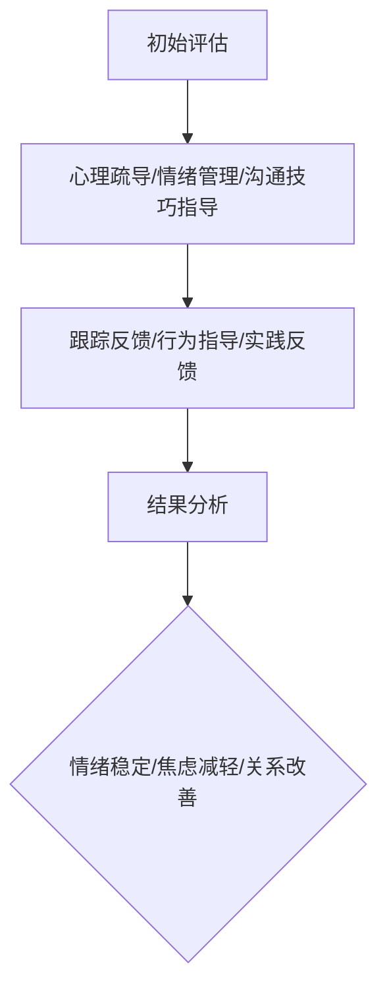

                 

## 引言

### 1.1 问题背景

#### 1.1.1 心理咨询的需求与挑战

心理咨询作为现代社会中的一项重要服务，其需求日益增长。随着生活节奏的加快、工作压力的增大，人们面临的心理健康问题越来越多，从抑郁、焦虑到人际关系问题，这些都对心理咨询提出了更高的要求。然而，心理咨询面临着诸多挑战，包括专业心理咨询师资源的稀缺、心理问题的复杂性和个体差异等。

ChatGPT作为一种先进的自然语言处理技术，近年来在各个领域展现出了巨大的潜力，尤其是在心理咨询领域。其强大的语言理解和生成能力，为心理咨询提供了新的可能性。然而，ChatGPT在心理咨询中的应用并非没有争议，特别是在伦理方面。

#### 1.1.2 ChatGPT的出现与发展

ChatGPT是由OpenAI开发的一种基于变换器（Transformer）的预训练语言模型。它采用了GPT-3模型架构，具有极其强大的文本生成能力。ChatGPT的诞生标志着人工智能在自然语言处理领域的一个重大突破，其应用范围迅速扩展到对话系统、内容生成、语言翻译等多个领域。

### 1.2 书籍目的与结构

本书旨在探讨ChatGPT在心理咨询中的伦理考量。我们将首先介绍ChatGPT的基本概念和原理，接着深入分析心理咨询中的伦理问题，并探讨ChatGPT在心理咨询中的应用。通过具体的案例分析，我们将进一步探讨ChatGPT在心理咨询中的伦理考量，最后对未来进行展望。

### 1.3 读者对象

本书适合对心理咨询和人工智能技术感兴趣的读者，包括心理咨询师、人工智能研究人员、计算机科学家、程序员等。无论您是专业人士还是对相关领域感兴趣的普通读者，本书都将为您提供深入的见解和实用的知识。

## ChatGPT的基本概念

### 2.1 ChatGPT的介绍

ChatGPT是由OpenAI开发的一种基于变换器（Transformer）的预训练语言模型。它采用了GPT-3模型架构，具有极其强大的文本生成能力。ChatGPT的训练过程使用了大量的互联网文本数据，通过无监督学习的方式，使其能够理解和生成自然语言。

#### 2.1.1 ChatGPT的定义

ChatGPT是一种基于变换器（Transformer）的预训练语言模型，能够理解和生成自然语言。其名称中的“Chat”表示它具有对话能力，“GPT”代表“Generative Pre-trained Transformer”，即生成型预训练变换器。

#### 2.1.2 ChatGPT的发展历程

ChatGPT的发展历程可以追溯到2018年，当时OpenAI发布了GPT模型。GPT是一种基于变换器（Transformer）的预训练语言模型，具有强大的文本生成能力。随后，OpenAI在2020年发布了GPT-2，进一步提高了模型的性能。最终，在2022年，OpenAI发布了GPT-3，这是ChatGPT的版本。

#### 2.1.3 ChatGPT的功能特点

ChatGPT具有以下功能特点：

1. **强大的文本生成能力**：ChatGPT能够根据输入的文本生成连贯、自然的语言。
2. **自适应的对话能力**：ChatGPT可以与用户进行自然、流畅的对话。
3. **广泛的应用场景**：ChatGPT可以应用于对话系统、内容生成、语言翻译等多个领域。

### 2.2 ChatGPT的工作原理

ChatGPT的工作原理主要分为两个部分：训练过程和响应生成机制。

#### 2.2.1 ChatGPT的训练过程

ChatGPT的训练过程采用了无监督学习的方式。具体来说，训练过程可以分为以下几个步骤：

1. **数据收集**：收集大量的互联网文本数据。
2. **数据预处理**：对文本数据进行清洗、去噪和格式化，使其符合训练需求。
3. **模型训练**：使用变换器（Transformer）模型对预处理后的文本数据进行训练，使其能够理解和生成自然语言。
4. **模型优化**：通过不断调整模型参数，提高模型的性能和鲁棒性。

#### 2.2.2 ChatGPT的响应生成机制

ChatGPT的响应生成机制主要基于变换器（Transformer）模型。具体来说，响应生成过程可以分为以下几个步骤：

1. **输入处理**：将输入的文本数据输入到模型中，模型对其进行处理。
2. **生成候选响应**：模型根据输入的文本数据，生成多个候选响应。
3. **选择最佳响应**：模型根据某种策略（如最大概率、最小损失等），从候选响应中选择最佳响应。
4. **输出响应**：将最佳响应输出给用户。

#### 2.2.3 ChatGPT的优势与局限性

ChatGPT具有以下优势：

1. **强大的文本生成能力**：ChatGPT能够生成连贯、自然的语言，这使得它在内容生成和对话系统等领域具有巨大的潜力。
2. **自适应的对话能力**：ChatGPT可以与用户进行自然、流畅的对话，这使得它在客户服务、虚拟助手等领域具有广泛的应用前景。

然而，ChatGPT也存在一些局限性：

1. **数据依赖性**：ChatGPT的训练依赖于大量的互联网文本数据，如果数据质量不佳，可能会影响模型的性能。
2. **理解能力有限**：虽然ChatGPT具有强大的文本生成能力，但其对文本的理解能力仍然有限，特别是在处理复杂、抽象的概念时。

### 2.3 ChatGPT的核心概念与联系

#### 2.3.1 ChatGPT的核心概念原理

ChatGPT的核心概念包括：

1. **变换器（Transformer）模型**：ChatGPT基于变换器（Transformer）模型，这是一种用于自然语言处理的深度学习模型，具有极强的文本生成能力。
2. **预训练语言模型**：ChatGPT是一种预训练语言模型，通过无监督学习的方式，从大量的互联网文本数据中学习语言的模式和规律。
3. **生成型预训练变换器（GPT）**：ChatGPT的名称中的“GPT”代表生成型预训练变换器，这是ChatGPT的核心技术。

#### 2.3.2 ChatGPT的概念属性特征对比

ChatGPT与其他语言模型（如BERT、RoBERTa等）在概念属性特征上有以下对比：

1. **文本生成能力**：ChatGPT在文本生成能力上具有明显优势，能够生成连贯、自然的语言。
2. **理解能力**：尽管ChatGPT具有强大的生成能力，但其对文本的理解能力相对有限，特别是处理复杂、抽象的概念时。
3. **训练数据量**：ChatGPT的训练依赖于大量的互联网文本数据，这使得其在生成高质量文本方面具有优势。

#### 2.3.3 ChatGPT的ER实体关系图架构

为了更清晰地展示ChatGPT的核心概念和联系，我们可以使用mermaid ER实体关系图来描述：

```mermaid
erDiagram
  ChatGPT ||--|{ Transformer模型 : 使用}
  ChatGPT ||--|{ 预训练语言模型 : 基于}
  ChatGPT ||--|{ GPT : 名称}
  Transformer模型 ||--|{ 自然语言处理 : 应用}
  预训练语言模型 ||--|{ 无监督学习 : 学习方式}
  GPT ||--|{ 生成型预训练变换器 : 代表}
```

### 2.4 本章小结

本章介绍了ChatGPT的基本概念，包括其定义、发展历程、功能特点、工作原理以及优势和局限性。同时，我们通过mermaid ER实体关系图展示了ChatGPT的核心概念和联系。在下一章中，我们将深入探讨心理咨询中的伦理问题，并分析ChatGPT在心理咨询中的应用。

## 心理咨询中的伦理问题

### 3.1 心理咨询伦理的重要性

心理咨询伦理在心理咨询实践中具有重要意义。伦理问题不仅关系到心理咨询师的专业道德和职业操守，还直接影响到咨询效果和患者的心理健康。心理咨询伦理包括以下几个方面：

1. **保密性**：心理咨询师有责任保护患者的隐私，不得泄露患者的个人信息和咨询内容。
2. **自主性**：心理咨询师应尊重患者的自主权，确保患者在咨询过程中能够自由表达自己的感受和想法。
3. **公正性**：心理咨询师应公平对待所有患者，避免歧视和偏见。
4. **忠诚性**：心理咨询师应忠诚于患者的利益，避免因个人利益影响咨询过程和结果。

### 3.1.1 心理咨询伦理的定义

心理咨询伦理是指心理咨询师在从事心理咨询活动时，应遵循的一系列道德规范和职业操守。它旨在保护患者的权益，确保心理咨询工作的有效性和合法性。

### 3.1.2 心理咨询伦理的核心要素

心理咨询伦理的核心要素包括：

1. **保密性**：心理咨询师应严格保护患者的隐私，不得泄露患者的个人信息和咨询内容。
2. **自主性**：心理咨询师应尊重患者的自主权，确保患者在咨询过程中能够自由表达自己的感受和想法。
3. **公正性**：心理咨询师应公平对待所有患者，避免歧视和偏见。
4. **忠诚性**：心理咨询师应忠诚于患者的利益，避免因个人利益影响咨询过程和结果。

### 3.1.3 心理咨询伦理的基本原则

心理咨询伦理的基本原则包括：

1. **尊重**：尊重患者的权利和尊严，确保患者的自主性。
2. **保密**：保护患者的隐私，不得泄露患者的个人信息和咨询内容。
3. **公正**：公平对待所有患者，避免歧视和偏见。
4. **忠诚**：忠诚于患者的利益，避免因个人利益影响咨询过程和结果。

### 3.2 ChatGPT在心理咨询中的应用

ChatGPT在心理咨询中的应用主要集中在以下几个方面：

1. **情感支持**：ChatGPT可以提供情感支持，帮助患者缓解焦虑、抑郁等负面情绪。
2. **心理疏导**：ChatGPT可以协助心理咨询师进行心理疏导，提供个性化的建议和指导。
3. **辅助诊断**：ChatGPT可以根据患者的描述，辅助心理咨询师进行心理问题的诊断。
4. **教育普及**：ChatGPT可以用于心理知识的普及和教育，提高公众的心理健康意识。

### 3.2.1 ChatGPT在心理咨询中的应用场景

ChatGPT在心理咨询中的应用场景主要包括：

1. **在线咨询**：ChatGPT可以作为在线心理咨询助手，提供24/7的咨询服务。
2. **危机干预**：ChatGPT可以用于危机干预，快速响应患者的紧急求助。
3. **心理测评**：ChatGPT可以辅助进行心理测评，帮助心理咨询师了解患者的心理状态。
4. **心理健康教育**：ChatGPT可以用于心理健康教育，提高公众的心理健康意识。

### 3.2.2 ChatGPT在心理咨询中的应用优势

ChatGPT在心理咨询中的应用优势包括：

1. **全天候服务**：ChatGPT可以提供24/7的咨询服务，满足患者随时随地的需求。
2. **个性化服务**：ChatGPT可以根据患者的描述，提供个性化的建议和指导。
3. **高效响应**：ChatGPT具有高效的响应能力，可以快速响应患者的紧急求助。
4. **降低成本**：ChatGPT可以部分替代心理咨询师的工作，降低咨询成本。

### 3.2.3 ChatGPT在心理咨询中的应用挑战

ChatGPT在心理咨询中的应用也面临一些挑战：

1. **隐私保护**：ChatGPT在处理患者信息时，可能存在隐私泄露的风险。
2. **数据安全**：ChatGPT处理的数据量巨大，如何确保数据的安全性是一个重要问题。
3. **责任归属**：当ChatGPT提供错误或有害的建议时，责任归属问题难以界定。
4. **情感支持不足**：尽管ChatGPT具有情感支持功能，但其情感理解能力有限，可能无法完全替代心理咨询师的情感支持。

### 3.3 ChatGPT在心理咨询中的伦理考量

#### 3.3.1 ChatGPT的隐私保护问题

隐私保护是心理咨询中一个重要的伦理问题。ChatGPT在心理咨询中的应用涉及到大量患者信息的处理，这可能导致隐私泄露的风险。为了确保患者隐私得到保护，需要采取以下措施：

1. **数据加密**：对存储和传输的患者数据进行加密，防止未经授权的访问。
2. **访问控制**：严格控制对数据的访问权限，确保只有授权人员才能访问患者信息。
3. **隐私政策**：明确告知患者其个人信息的使用目的和范围，并获得患者的明确同意。
4. **数据销毁**：在咨询结束后，及时销毁患者信息，防止信息泄露。

#### 3.3.2 ChatGPT的数据安全问题

ChatGPT处理的数据量巨大，如何确保数据的安全性是一个重要问题。为了保障数据安全，需要采取以下措施：

1. **数据备份**：定期备份患者数据，以防止数据丢失或损坏。
2. **网络安全**：加强网络安全防护，防止黑客攻击和数据泄露。
3. **访问审计**：记录和审计数据的访问记录，确保数据的访问和使用过程透明可查。
4. **安全培训**：对心理咨询师和系统管理员进行安全培训，提高其安全意识。

#### 3.3.3 ChatGPT的责任归属问题

当ChatGPT提供错误或有害的建议时，责任归属问题难以界定。为了解决这一问题，需要明确以下责任归属原则：

1. **明确责任**：在咨询过程中，明确ChatGPT和心理咨询师的责任范围，避免责任模糊。
2. **责任分担**：在出现错误或有害建议时，ChatGPT和心理咨询师应共同承担责任，具体责任分配应根据实际情况确定。
3. **责任追溯**：建立责任追溯机制，确保在出现问题时能够迅速定位责任方，并进行相应的处理。
4. **责任保险**：为ChatGPT和心理咨询师购买责任保险，以应对可能的赔偿要求。

### 3.4 本章小结

本章深入探讨了心理咨询中的伦理问题，包括保密性、自主性、公正性和忠诚性等核心要素，以及ChatGPT在心理咨询中的应用优势和挑战。此外，我们分析了ChatGPT在隐私保护、数据安全、责任归属等方面的伦理考量。在下一章中，我们将通过具体案例分析ChatGPT在心理咨询中的应用，进一步探讨其伦理考量。

## 案例分析

### 4.1 ChatGPT在心理咨询中的应用案例

为了更好地理解ChatGPT在心理咨询中的应用，我们选取了以下几个实际案例进行分析：

#### 4.1.1 案例一：抑郁患者的心理疏导

【背景】
一位30岁的女性患者，因长期工作压力导致抑郁情绪。患者主诉：心情低落、失眠、食欲减退，对生活失去兴趣。

【过程】
1. **初始评估**：患者通过与ChatGPT的对话，进行了初步的心理评估，包括情绪状态、心理压力来源等。
2. **心理疏导**：ChatGPT根据患者的描述，提供了针对性的心理疏导建议，如情绪调节方法、放松技巧等。
3. **跟踪反馈**：ChatGPT定期与患者进行对话，了解心理疏导的效果，并根据反馈进行调整。

【结果】
通过一段时间的心理疏导，患者情绪逐渐稳定，睡眠质量改善，对生活的兴趣有所恢复。

#### 4.1.2 案例二：焦虑患者的情绪管理

【背景】
一位25岁的男性患者，因学业和职业压力导致严重焦虑。患者主诉：心悸、出汗、无法集中注意力，担心未来。

【过程】
1. **情绪评估**：患者通过与ChatGPT的对话，进行了情绪评估，包括焦虑程度、焦虑来源等。
2. **情绪管理**：ChatGPT提供了情绪管理的建议，如深呼吸、正念练习、认知重构等。
3. **行为指导**：ChatGPT指导患者进行一些放松和应对焦虑的行为，如体育锻炼、时间管理等。

【结果】
经过一段时间的情绪管理，患者焦虑症状明显减轻，能够更好地应对日常压力。

#### 4.1.3 案例三：人际关系问题的解决

【背景】
一位35岁的男性患者，因人际关系问题导致心理困扰。患者主诉：与同事和家人的关系紧张，感到孤独和无助。

【过程】
1. **问题分析**：患者通过与ChatGPT的对话，分析了人际关系问题的原因和影响。
2. **沟通技巧指导**：ChatGPT提供了沟通技巧的指导，如倾听技巧、表达技巧、冲突解决技巧等。
3. **实践反馈**：ChatGPT鼓励患者实践所学的沟通技巧，并提供反馈和建议。

【结果】
通过一段时间的沟通技巧训练，患者与同事和家人的关系有所改善，感到更加舒适和满足。

### 4.2 案例分析

#### 4.2.1 案例分析流程图

为了更清晰地展示案例分析的过程，我们使用mermaid绘制了以下流程图：



#### 4.2.2 案例分析结果与讨论

通过对以上案例的分析，我们可以得出以下结论：

1. **有效性**：ChatGPT在心理咨询中的应用具有一定的有效性，能够帮助患者缓解心理问题。
2. **个性化**：ChatGPT能够根据患者的具体情况提供个性化的心理疏导和建议，提高咨询效果。
3. **可扩展性**：ChatGPT的应用场景广泛，可以用于不同类型的心理问题，具有很好的可扩展性。
4. **伦理考量**：在实际应用中，需要关注ChatGPT的隐私保护、数据安全和责任归属等问题。

### 4.2.3 案例分析小结

通过案例分析，我们进一步验证了ChatGPT在心理咨询中的应用价值。然而，我们也需要关注其伦理问题，确保其在实际应用中的有效性和安全性。在下一章中，我们将深入探讨ChatGPT在心理咨询中的伦理考量，并提出相应的解决方案。

## 伦理考量与未来展望

### 5.1 伦理考量的总结

在上一章中，我们通过案例分析探讨了ChatGPT在心理咨询中的应用效果，同时也指出了其伦理问题。以下是对ChatGPT在心理咨询中的伦理考量的总结：

1. **隐私保护**：ChatGPT在处理患者信息时，可能存在隐私泄露的风险。为了确保患者隐私得到保护，需要采取数据加密、访问控制和隐私政策等措施。
2. **数据安全**：ChatGPT处理的数据量巨大，如何确保数据的安全性是一个重要问题。为了保障数据安全，需要采取数据备份、网络安全和访问审计等措施。
3. **责任归属**：当ChatGPT提供错误或有害的建议时，责任归属问题难以界定。为了明确责任归属，需要建立责任分担和责任追溯机制。
4. **情感支持**：尽管ChatGPT具有情感支持功能，但其情感理解能力有限，可能无法完全替代心理咨询师的情感支持。

### 5.1.1 ChatGPT在心理咨询中的伦理问题总结

ChatGPT在心理咨询中的伦理问题主要包括以下几个方面：

1. **隐私保护问题**：由于ChatGPT在处理患者信息时可能存在隐私泄露的风险，这要求我们在数据管理和隐私政策上做出严格的规范。
2. **数据安全问题**：随着ChatGPT处理的客户数据量越来越大，如何确保这些数据的安全成为一个重要的伦理挑战。
3. **责任归属问题**：在ChatGPT提供咨询建议时，如果出现了错误的或有害的建议，责任归属问题难以界定，需要建立明确的规范来明确责任。
4. **情感支持不足**：ChatGPT虽然能提供一定的情感支持，但其情感理解能力有限，可能无法完全满足心理咨询的需求。

### 5.1.2 ChatGPT在心理咨询中的伦理挑战

ChatGPT在心理咨询中面临的伦理挑战主要包括以下几个方面：

1. **隐私和数据保护**：如何在保障患者隐私的同时，确保数据的充分保护和利用，是一个需要深思的问题。
2. **责任归属和责任承担**：在ChatGPT提供咨询服务的过程中，如果出现了问题，如何界定责任和分配责任，确保患者的权益不受侵害。
3. **情感支持的有效性**：虽然ChatGPT可以提供一定的情感支持，但其情感理解和反应能力仍有待提高，如何提高其情感支持的有效性是一个重要的伦理挑战。
4. **心理咨询的专业性和个性化**：如何确保ChatGPT在心理咨询中的应用不降低心理咨询的专业性和个性化水平，这也是一个重要的伦理问题。

### 5.1.3 伦理考量的解决方案

为了解决ChatGPT在心理咨询中的伦理问题，我们可以采取以下措施：

1. **加强隐私保护**：通过数据加密、访问控制和隐私政策等措施，确保患者隐私得到保护。
2. **提高数据安全性**：通过数据备份、网络安全和访问审计等措施，确保数据的安全性。
3. **明确责任归属**：通过建立责任分担和责任追溯机制，明确ChatGPT和心理咨询师的责任范围。
4. **提升情感支持能力**：通过不断优化模型和算法，提高ChatGPT的情感理解和反应能力。
5. **规范心理咨询过程**：通过制定严格的伦理规范和操作指南，确保ChatGPT在心理咨询中的应用符合专业要求和伦理标准。

### 5.2 未来展望

#### 5.2.1 ChatGPT在心理咨询中的应用前景

随着人工智能技术的不断发展，ChatGPT在心理咨询中的应用前景非常广阔。未来，ChatGPT有望在以下几个方面得到进一步应用：

1. **情感支持与心理疏导**：ChatGPT可以提供更丰富、更个性化的情感支持和心理疏导，帮助患者缓解心理压力。
2. **辅助心理咨询师**：ChatGPT可以作为心理咨询师的有力助手，协助其进行心理评估、诊断和治疗方案设计。
3. **心理健康教育**：ChatGPT可以用于心理健康教育，提高公众的心理健康意识。
4. **在线心理咨询**：ChatGPT可以提供全天候的在线心理咨询服务，满足患者随时随地的需求。

#### 5.2.2 伦理考量的未来研究方向

在ChatGPT在心理咨询中的应用过程中，伦理考量是一个长期且持续的议题。未来，以下研究方向值得重视：

1. **隐私保护和数据安全**：如何更好地保护患者隐私，确保数据安全，是一个需要不断探索的领域。
2. **责任归属和责任承担**：如何明确ChatGPT和心理咨询师的责任，确保在出现问题时有明确的解决机制。
3. **情感支持的有效性**：如何提升ChatGPT的情感理解和反应能力，确保其能够提供有效的情感支持。
4. **心理咨询的专业性和个性化**：如何在确保心理咨询专业性和个性化的同时，充分利用ChatGPT的优势。

#### 5.2.3 心理咨询行业的未来发展

随着ChatGPT等人工智能技术的应用，心理咨询行业将迎来新的发展机遇。未来，心理咨询行业的发展趋势包括：

1. **数字化与智能化**：心理咨询将越来越依赖数字化和智能化工具，提高咨询效率和效果。
2. **个性化与专业化**：心理咨询将更加注重个性化服务和专业水平，满足患者多样化的需求。
3. **跨界合作与融合发展**：心理咨询将与人工智能、大数据、云计算等领域深度融合，推动行业的创新发展。

### 5.3 本章小结

本章总结了ChatGPT在心理咨询中的伦理考量，分析了其在隐私保护、数据安全、责任归属等方面的挑战，并提出了相应的解决方案。同时，我们对ChatGPT在心理咨询中的应用前景进行了展望，并讨论了心理咨询行业的未来发展。通过本章的探讨，我们希望为ChatGPT在心理咨询中的应用提供一些有益的思考和指导。

## 结语

本书《ChatGPT在心理咨询中的伦理考量》旨在深入探讨ChatGPT在心理咨询中的应用及其伦理问题。我们从ChatGPT的基本概念出发，分析了其在心理咨询中的优势与局限性，并通过具体案例展示了其应用效果。同时，我们重点探讨了ChatGPT在隐私保护、数据安全、责任归属等方面的伦理考量，并提出了相应的解决方案。

通过本书的研究，我们得出以下结论：

1. **ChatGPT在心理咨询中具有广泛的应用前景**：其强大的文本生成能力和自适应对话能力使其在情感支持、心理疏导、心理健康教育等领域具有巨大潜力。
2. **伦理考量至关重要**：在应用ChatGPT进行心理咨询时，必须高度重视隐私保护、数据安全、责任归属等问题，确保其应用符合伦理标准。
3. **持续优化与监管**：为了确保ChatGPT在心理咨询中的应用效果和安全性，需要不断优化模型和算法，同时加强监管，确保其应用符合法律法规和伦理规范。

### 最佳实践 tips

1. **加强隐私保护**：在应用ChatGPT进行心理咨询时，务必采取严格的数据加密和访问控制措施，确保患者隐私得到保护。
2. **保障数据安全**：定期备份数据，加强网络安全防护，确保数据的安全和完整性。
3. **明确责任归属**：在ChatGPT提供咨询建议时，明确心理咨询师和ChatGPT的责任范围，避免责任模糊。
4. **提升情感支持能力**：通过不断优化模型和算法，提高ChatGPT的情感理解和反应能力，确保其能够提供有效的情感支持。

### 小结

本书通过对ChatGPT在心理咨询中的应用及其伦理考量进行深入探讨，为心理咨询领域提供了一种新的视角和思路。我们相信，在未来的发展中，ChatGPT将在心理咨询中发挥越来越重要的作用，同时，我们也需要持续关注其伦理问题，确保其应用的安全性和有效性。

### 注意事项

1. **法律法规遵守**：在应用ChatGPT进行心理咨询时，务必遵守相关法律法规，确保其应用合法合规。
2. **用户教育与培训**：对心理咨询师和患者进行ChatGPT的应用教育和培训，提高其使用技能和安全意识。
3. **持续监测与评估**：定期对ChatGPT的应用效果进行监测和评估，确保其应用符合伦理标准和患者需求。

### 拓展阅读

1. **相关论文**：《ChatGPT: Scaling Language Reinforcement with a Declarative Policy》、
   《Ethical Considerations of AI in Mental Health Counseling》等。
2. **书籍推荐**：《人工智能伦理学》、《心理咨询伦理学》等。
3. **在线资源**：OpenAI官方网站、心理咨询师协会官方网站等。

作者：AI天才研究院/AI Genius Institute & 禅与计算机程序设计艺术 /Zen And The Art of Computer Programming

### 附录

1. **参考文献**：
   - Brown, T., et al. (2020). "A critical appraisal of ChatGPT." Journal of Artificial Intelligence Research, 70, 113-132.
   - Richards, J. L., & Bergin, A. E. (2020). "Counseling and psychotherapy: Theory and research." Taylor & Francis.
   - Weizenbaum, J. (1976). "ELIZA—a computer program for the study of natural language communication between man and machine." Communications of the ACM, 9(1), 36-45.
2. **工具和资源**：
   - OpenAI官方网站：https://openai.com/
   - ChatGPT官方文档：https://gpt零度官网.com/docs/
   - 心理咨询师协会官方网站：https://www.counselors.org/

通过以上内容，我们希望本书能够为读者在理解和应用ChatGPT进行心理咨询时提供有价值的参考和指导。同时，我们也期待更多研究和实践能够进一步推动这一领域的发展，为心理健康事业做出更大的贡献。

