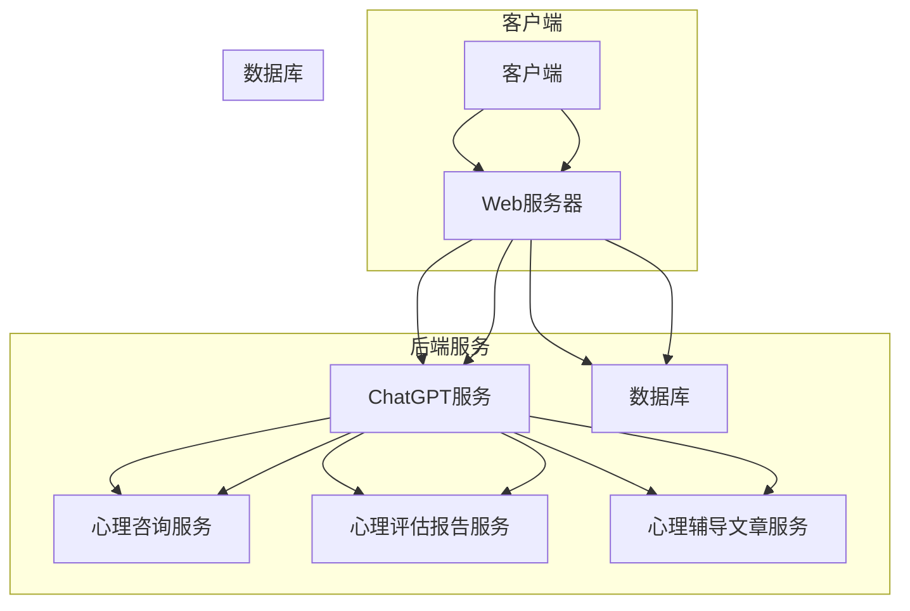
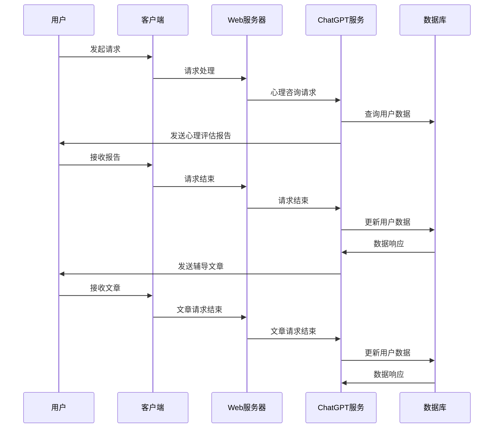

                 

### 文章标题

# ChatGPT在心理咨询中的伦理考量

### 文章关键词

- ChatGPT
- 心理咨询
- 伦理问题
- 数据隐私
- AI偏见
- 专业责任

### 文章摘要

本文旨在探讨人工智能（AI）在心理咨询中的应用，尤其是ChatGPT这一先进自然语言处理模型的伦理考量。随着AI技术的不断发展，ChatGPT作为一种自动化心理咨询服务工具，已经在实际应用中展现出了巨大的潜力。然而，其在心理咨询领域的广泛应用也引发了一系列伦理问题，包括数据隐私保护、AI偏见、以及专业责任等。本文将围绕这些问题，进行深入分析和讨论，以期为心理咨询AI技术的健康发展提供伦理指导。

## 第一部分: 引言与背景

### 1.1 书籍目的与意义

随着人工智能技术的迅速发展，自然语言处理（NLP）领域取得了显著进展。ChatGPT作为基于GPT-3.5架构的大型语言模型，在文本生成、对话系统、机器翻译等方面展现了卓越的性能。特别是在心理咨询领域，ChatGPT的应用潜力备受关注。通过自动化心理咨询服务，ChatGPT可以为广大用户提供便捷、高效的心理健康支持。然而，这一新兴技术也带来了诸多伦理问题，例如数据隐私、AI偏见和专业责任等。因此，本文旨在深入探讨ChatGPT在心理咨询中的应用及其伦理考量，以期为相关研究和实践提供理论支持和实际指导。

### 1.2 心理咨询与AI技术

心理咨询是一种旨在帮助个体解决心理问题和提高心理健康的专业服务。传统的心理咨询依赖于咨询师与求助者之间的互动，通过倾听、理解和引导来帮助求助者实现心理成长。然而，随着社会的快速发展，心理咨询的需求日益增长，而专业心理咨询师的数量却相对有限。这种供需矛盾催生了AI技术在心理咨询中的应用。AI技术，特别是自然语言处理（NLP）技术的进步，使得构建自动化心理咨询服务成为可能。ChatGPT作为一种具有强大语言理解和生成能力的AI模型，在心理咨询中的应用潜力得到了广泛关注。

### 1.3 ChatGPT概述

ChatGPT是由OpenAI开发的一种基于GPT-3.5架构的预训练语言模型。GPT-3.5是一种自回归语言模型，通过大量的文本数据进行预训练，使其具备了强大的语言理解和生成能力。ChatGPT在训练过程中不仅学习了文本的内容，还学习了文本的结构和上下文关系。这使得ChatGPT在生成自然、流畅的文本方面表现出色。ChatGPT的架构包括多个Transformer层，每个层都包含大量的自注意力机制，这使得模型能够捕捉到文本中的复杂关系和语义信息。ChatGPT的输入可以是任意的文本，输出则是基于输入文本的扩展或回答。这使得ChatGPT在多种应用场景中具有广泛的应用潜力，包括文本生成、对话系统、机器翻译、情感分析等。

### 2.1 伦理学基本概念

伦理学是研究道德原则、价值观和行为规范的学科。在心理咨询领域，伦理学的基本概念对于指导实践和规范行为至关重要。伦理学的基本原则包括尊重个人权利、维护隐私和保密性、避免伤害、公正对待等。尊重个人权利是伦理学的基本原则之一，要求心理咨询师尊重求助者的自主权，尊重他们的决定和选择。维护隐私和保密性是心理咨询的核心原则，心理咨询师有责任确保求助者的个人信息得到严格保密，防止信息泄露。避免伤害是心理咨询师必须遵守的底线原则，要求心理咨询师在实践过程中避免对求助者造成心理或情感上的伤害。公正对待要求心理咨询师在服务过程中公平、公正地对待每一位求助者，不歧视、不偏见。

### 2.2 心理咨询伦理原则

心理咨询伦理原则是指导心理咨询实践的基本规范，主要包括以下几个方面：

**1. 尊重求助者自主权**：心理咨询师应尊重求助者的自主权，包括他们的决定、选择和隐私。这意味着心理咨询师应在整个咨询过程中与求助者建立信任关系，鼓励求助者表达自己的想法和感受，并尊重他们的决策。

**2. 维护隐私和保密性**：保密性是心理咨询的基石。心理咨询师有责任确保求助者的个人信息在未经其同意的情况下不被泄露。这包括保护求助者在咨询过程中的谈话记录、心理评估结果等。

**3. 避免伤害**：心理咨询师在实践过程中必须采取一切必要措施，以避免对求助者造成心理或情感上的伤害。这意味着心理咨询师应具备专业的判断力，能够在咨询过程中识别和处理潜在的风险。

**4. 公正对待**：心理咨询师应公正对待每一位求助者，不因求助者的性别、年龄、种族、文化背景等因素而歧视或偏见。这要求心理咨询师具备开放的心态和包容的态度，能够理解和尊重不同求助者的需求和差异。

**5. 专业责任**：心理咨询师有责任不断学习和提高自己的专业能力，确保提供高质量的心理咨询服务。此外，心理咨询师还应遵守相关法律法规，确保其行为符合伦理规范。

### 2.3 AI技术与伦理

随着人工智能技术的快速发展，其在各个领域的应用越来越广泛，包括医疗、金融、教育、心理咨询等。AI技术带来的便利和效率提升无疑是显著的，然而，AI技术本身也存在一些伦理问题，特别是在心理咨询中的应用中。

**1. 数据隐私保护**：AI技术在心理咨询中的应用离不开大量个人数据的收集和使用。这些数据包括求助者的个人信息、咨询记录、心理评估结果等。如何保护这些数据的隐私和安全，避免数据泄露和滥用，是一个重要的伦理问题。

**2. AI偏见**：AI模型在训练过程中可能会吸收和放大训练数据中的偏见，导致模型在应用过程中产生不公平的结果。例如，如果训练数据中存在性别、种族、年龄等方面的偏见，AI模型可能会对特定群体产生歧视。

**3. 专业责任**：心理咨询师在应用AI技术时，有责任确保技术的应用不会损害求助者的利益。此外，心理咨询师还应监督AI系统的运行，确保其提供的服务符合专业标准。

**4. 透明性和可解释性**：AI模型的决策过程往往是不透明的，这使得其在心理咨询中的应用引发了信任问题。如何提高AI系统的透明性和可解释性，使其决策过程更加透明和可理解，也是一个重要的伦理问题。

### 3.1 ChatGPT功能介绍

ChatGPT作为一款基于GPT-3.5架构的大型语言模型，具有多种功能和应用场景，特别是在心理咨询领域，其表现尤为突出。

**1. 文本生成**：ChatGPT可以生成高质量的自然语言文本，包括对话、文章、故事等。在心理咨询中，ChatGPT可以生成心理辅导文章、心理咨询对话等，为求助者提供个性化的心理支持。

**2. 对话系统**：ChatGPT可以与用户进行自然语言交互，模拟人类对话。在心理咨询中，ChatGPT可以作为一个虚拟心理辅导员，与用户进行实时对话，提供情感支持、心理疏导和建议。

**3. 心理评估**：ChatGPT可以根据用户的回答生成心理评估报告，识别潜在的心理问题。例如，通过回答一系列问题，ChatGPT可以评估用户的心理状态，提供针对性的建议和干预措施。

**4. 文本分析**：ChatGPT可以对用户提供的文本进行分析，提取关键信息、情感倾向等。在心理咨询中，ChatGPT可以分析求助者的心理状态和需求，为其提供更精确的支持。

### 3.2 ChatGPT在心理咨询中的角色

ChatGPT在心理咨询中扮演着多重角色，为用户提供全方位的心理支持和服务。

**1. 虚拟心理辅导员**：ChatGPT可以作为一个虚拟心理辅导员，与用户进行实时对话，提供情感支持、心理疏导和建议。用户可以通过文本与ChatGPT交流，分享自己的感受和困惑，获得即时的心理反馈。

**2. 心理评估工具**：ChatGPT可以根据用户的回答生成心理评估报告，识别潜在的心理问题。用户可以通过回答一系列问题，让ChatGPT评估自己的心理状态，获得专业的评估结果和干预建议。

**3. 个性化辅导文章生成器**：ChatGPT可以生成个性化的心理辅导文章，针对用户的具体需求和问题，提供有针对性的心理支持。这些文章可以涵盖各种心理问题，如焦虑、抑郁、人际关系等，为用户提供实用的心理建议。

**4. 心理咨询对话记录分析**：ChatGPT可以对心理咨询对话记录进行分析，提取关键信息、情感倾向等，帮助心理咨询师更好地理解用户的心理状态和需求，提高咨询效果。

### 3.3 案例分析

以下是一个具体的案例，展示ChatGPT在心理咨询中的应用：

**案例背景**：小明是一名大学生，近期感到焦虑和抑郁，难以应对学业和生活压力。他在网上搜索了一些心理咨询资源，并尝试使用ChatGPT进行心理咨询。

**案例过程**：

1. **初始对话**：小明通过文本与ChatGPT进行了初次对话。他向ChatGPT描述了自己的焦虑和抑郁感受，并询问如何应对。

2. **心理评估**：ChatGPT根据小明的回答，生成了一份心理评估报告。报告显示小明可能患有轻度焦虑和抑郁，并建议进行进一步的咨询和干预。

3. **个性化辅导**：ChatGPT为小明生成了一篇个性化的心理辅导文章，内容涵盖了焦虑和抑郁的常见原因、应对策略以及心理健康的重要性。

4. **实时对话**：ChatGPT与小明进行了多次实时对话，提供了情感支持和心理疏导。通过对话，ChatGPT了解了小明的具体情况，并为他提供了实用的建议和资源。

5. **反馈与总结**：小明对ChatGPT提供的心理支持表示满意，并反馈了自己的感受和进步。ChatGPT根据反馈进行了总结和改进，以提高后续咨询的效果。

### 4.1 数据隐私保护

在ChatGPT应用于心理咨询时，数据隐私保护是一个至关重要的问题。由于心理咨询涉及用户的个人隐私和心理状态，保护用户数据的安全性和隐私性至关重要。以下是一些关键措施：

**1. 数据加密**：ChatGPT应用应采用加密技术，确保用户数据在传输和存储过程中的安全性。使用SSL/TLS协议对数据进行加密传输，同时采用高级加密算法对数据存储进行加密保护。

**2. 访问控制**：ChatGPT应用应实施严格的访问控制机制，确保只有授权人员可以访问用户数据。通过用户身份验证和权限管理，防止未授权访问和数据泄露。

**3. 数据匿名化**：在收集和使用用户数据时，应尽量对数据进行匿名化处理。通过去除或加密个人身份信息，降低数据泄露的风险。

**4. 数据备份与恢复**：ChatGPT应用应建立完善的数据备份和恢复机制，确保数据在发生意外情况时可以快速恢复。定期进行数据备份，并确保备份数据的安全性。

**5. 法律法规遵循**：ChatGPT应用应严格遵守相关法律法规，特别是涉及用户数据保护的相关法律。确保应用的设计和运营符合法律法规要求，防止违规操作。

### 4.2 AI偏见与公平性

AI偏见是人工智能技术中普遍存在的问题，特别是在ChatGPT这样的语言模型中。AI偏见可能会导致模型在应用过程中对某些群体产生不公平的结果。以下是ChatGPT在心理咨询中可能面临的AI偏见问题及应对策略：

**1. 训练数据偏见**：ChatGPT在训练过程中可能吸收和放大训练数据中的偏见，导致模型在生成文本或进行心理评估时对某些群体产生偏见。例如，如果训练数据中存在性别、种族或文化偏见，ChatGPT可能会在心理咨询中表现出类似的偏见。

**2. 对话生成偏见**：ChatGPT在生成对话时可能会基于偏见进行回复，导致用户产生不公平的感受。例如，如果ChatGPT被训练为对某些群体持歧视态度，用户在与ChatGPT进行对话时可能会感受到这种偏见。

**3. 应对策略**：

- **数据多样化**：在训练ChatGPT时，应确保训练数据具有多样化的特征，涵盖不同性别、种族、文化背景的用户。通过增加多样性的数据，可以减少模型偏见。

- **偏见检测与校正**：开发偏见检测工具，对ChatGPT生成的文本进行实时检测，识别和纠正偏见。通过定期训练和优化模型，减少偏见的影响。

- **用户反馈机制**：建立用户反馈机制，鼓励用户在心理咨询过程中报告偏见问题。根据用户反馈，对模型进行迭代优化，提高其公平性。

- **伦理培训**：对开发和使用ChatGPT的人员进行伦理培训，提高他们对偏见问题的认识和敏感性。通过加强伦理意识，减少偏见在应用过程中的产生。

### 4.3 专业责任与监督

在ChatGPT应用于心理咨询时，专业责任和监督至关重要。心理咨询师作为专业人士，有责任确保ChatGPT的使用不会损害求助者的利益。以下是一些关键措施：

**1. 专业培训**：心理咨询师应接受相关培训，了解ChatGPT的功能和使用方法。通过专业培训，心理咨询师可以更好地掌握ChatGPT在心理咨询中的应用，提高其专业水平。

**2. 质量控制**：心理咨询师应建立严格的质量控制机制，对ChatGPT生成的文本和评估结果进行审查和验证。确保ChatGPT提供的服务符合专业标准，避免错误或误导。

**3. 监督与反馈**：心理咨询师应定期对ChatGPT的使用进行监督和评估，收集用户反馈，识别和解决潜在问题。通过持续的监督和反馈，提高ChatGPT在心理咨询中的应用效果。

**4. 伦理审查**：心理咨询师应进行伦理审查，确保ChatGPT的使用符合伦理规范。特别是在涉及用户隐私、数据保护和偏见问题时，心理咨询师应保持高度的伦理敏感性和责任感。

### 5.1 成功案例

以下是一个成功的案例，展示ChatGPT在心理咨询中的应用：

**案例背景**：小芳是一名职场女性，近期感到工作压力巨大，焦虑和抑郁情绪严重。她通过网络搜索找到了一款基于ChatGPT的在线心理咨询平台，并开始使用该平台进行心理辅导。

**案例过程**：

1. **初始评估**：小芳通过在线问卷完成了初步心理评估，ChatGPT根据评估结果生成了一份详细的心理健康报告。

2. **实时对话**：小芳与ChatGPT进行了多次实时对话，分享了她的焦虑和抑郁感受，ChatGPT提供了情感支持和心理疏导。

3. **个性化辅导**：ChatGPT根据小芳的具体情况，生成了一系列个性化的心理辅导文章，内容包括压力管理、情绪调节和心理成长等。

4. **跟踪评估**：在心理咨询过程中，小芳的焦虑和抑郁情绪逐渐减轻，ChatGPT对其心理状态进行了跟踪评估，并提供了持续的支持和建议。

5. **反馈与总结**：小芳对ChatGPT提供的心理支持表示非常满意，反馈了自己的感受和进步。ChatGPT根据反馈进行了总结和优化，以提高后续咨询的效果。

### 5.2 挑战与应对

尽管ChatGPT在心理咨询中取得了显著成果，但其在实际应用中仍面临一些挑战。以下是这些挑战及可能的应对策略：

**1. 数据隐私保护**：由于心理咨询涉及用户的个人隐私和心理状态，如何确保数据的安全性和隐私性是一个重要挑战。应对策略包括采用加密技术、数据匿名化和严格的访问控制等。

**2. AI偏见问题**：ChatGPT在训练过程中可能吸收和放大训练数据中的偏见，导致在心理咨询中产生不公平的结果。应对策略包括数据多样化、偏见检测与校正和用户反馈机制等。

**3. 专业责任与监督**：心理咨询师在使用ChatGPT时，有责任确保其使用不会损害求助者的利益。应对策略包括专业培训、质量控制、监督与反馈和伦理审查等。

**4. 技术可靠性**：ChatGPT作为一种AI模型，其输出的质量和可靠性直接影响心理咨询的效果。应对策略包括定期维护和优化模型，确保其性能稳定和可靠。

### 5.3 评估与反思

通过对ChatGPT在心理咨询中的应用进行评估和反思，可以发现其具有显著的优点和潜力。以下是一些关键点：

**1. 高效便捷**：ChatGPT作为一种自动化心理咨询服务工具，可以高效便捷地为广大用户提供心理健康支持。用户可以通过文本与ChatGPT进行实时对话，获得即时的心理反馈和建议。

**2. 个性化支持**：ChatGPT可以根据用户的具体情况和需求，生成个性化的心理辅导文章和评估报告，提供有针对性的心理支持。这有助于提高心理咨询的针对性和效果。

**3. 降低成本**：由于ChatGPT可以自动化处理大量的心理咨询服务，可以大大降低人力成本，提高服务效率。这对于扩大心理咨询的覆盖范围和降低服务成本具有重要意义。

然而，ChatGPT在心理咨询中仍存在一些局限性。首先，其依赖于大量高质量的训练数据，数据质量和多样性直接影响其性能。其次，ChatGPT在处理复杂心理问题时的能力有限，仍需要心理咨询师的指导和干预。此外，如何确保ChatGPT的决策过程透明和可解释性也是一个重要挑战。

### 6.1 相关法律法规

在ChatGPT应用于心理咨询时，相关法律法规的遵循至关重要。以下是一些涉及用户数据保护和隐私保护的关键法律法规：

**1. 《中华人民共和国个人信息保护法》**：该法明确规定个人信息处理活动的原则、个人信息保护的权利、个人信息处理的要求等。ChatGPT在收集、使用和处理用户个人信息时，应严格遵守该法的规定，确保用户个人信息的安全和保护。

**2. 《中华人民共和国网络安全法》**：该法规定了网络安全的基本制度和要求，包括网络安全管理、网络信息安全、网络信息保护等。ChatGPT作为一款在线应用，应确保其网络安全，防止网络攻击和数据泄露。

**3. 《中华人民共和国数据安全法》**：该法规定了数据安全的基本要求和措施，包括数据安全管理、数据安全风险评估、数据安全处理等。ChatGPT在处理用户数据时，应进行数据安全风险评估，并采取相应的安全措施，确保数据的安全和保护。

**4. 《欧盟通用数据保护条例》（GDPR）**：GDPR是欧盟制定的数据保护法规，对个人数据的收集、处理和使用进行了严格规定。ChatGPT在应用于欧盟用户时，应严格遵守GDPR的规定，确保用户数据的保护和隐私。

### 6.2 国际政策框架

在全球范围内，许多国家和地区已经制定了相关的政策框架，以规范AI技术在心理咨询中的应用。以下是一些主要国家的政策框架：

**1. 美国**：美国在2020年发布了《人工智能原则》，明确了对AI技术的监管原则，包括透明性、公平性、责任性等。此外，美国食品药品监督管理局（FDA）也在推动AI在医疗领域的应用，包括心理咨询。

**2. 欧洲**：欧洲议会和欧盟理事会通过了《人工智能法案》，对AI技术的开发和应用进行了全面规范，包括伦理、透明性、数据保护等方面。此外，欧盟还发布了《人工智能伦理准则》，为AI技术的伦理应用提供了指导。

**3. 中国**：中国发布了《新一代人工智能发展规划》，明确了人工智能的发展目标和重点领域。在心理咨询领域，中国鼓励通过AI技术提高心理健康服务的效率和覆盖面，并制定了相关的法规和政策，如《中华人民共和国网络安全法》和《中华人民共和国数据安全法》。

### 6.3 我国政策与实践

在中国，政府高度重视人工智能技术的发展和应用，特别是在心理健康领域。以下是我国在ChatGPT应用于心理咨询方面的政策与实践：

**1. 政策支持**：中国政府发布了《新一代人工智能发展规划》，明确提出要推动人工智能在心理健康领域的应用。政府鼓励通过AI技术提高心理健康服务的效率和覆盖面，并制定了相关的法规和政策，如《中华人民共和国网络安全法》和《中华人民共和国数据安全法》。

**2. 应用实践**：在中国，许多医院和心理健康服务机构已经开始采用ChatGPT等AI技术提供心理健康服务。例如，一些医院推出了基于ChatGPT的在线心理咨询平台，为患者提供24/7的心理支持。同时，一些心理健康服务机构也采用了ChatGPT进行心理评估和个性化辅导。

**3. 挑战与机遇**：尽管ChatGPT在心理咨询中具有巨大潜力，但其在实际应用中也面临一些挑战。例如，如何确保数据隐私和安全、如何解决AI偏见问题等。同时，AI技术在心理咨询中的应用也带来了新的机遇，如提高心理健康服务的效率和覆盖面，为更多患者提供便捷、高效的心理支持。

### 7.1 AI与心理咨询的未来

随着人工智能技术的不断发展，ChatGPT在心理咨询中的应用前景十分广阔。未来，ChatGPT有望在以下几个方面发挥更大的作用：

**1. 智能心理辅导**：ChatGPT可以通过不断学习和优化，提供更加个性化和智能化的心理辅导。例如，通过分析用户的历史数据和反馈，ChatGPT可以生成更符合用户需求的心理辅导方案。

**2. 实时心理评估**：ChatGPT可以实时评估用户的心理状态，及时发现潜在的心理问题，并提供相应的干预措施。这种实时心理评估能力有助于提高心理咨询的效率和准确性。

**3. 多语言支持**：ChatGPT可以在多语言环境中工作，为来自不同国家和地区的用户提供心理支持。通过支持多种语言，ChatGPT可以更好地满足全球用户的需求。

**4. 智能健康管理**：ChatGPT可以结合其他医疗数据，如生理指标、生活习惯等，为用户提供更加全面和个性化的健康管理建议。

### 7.2 伦理考量的挑战与机遇

在AI与心理咨询的结合过程中，伦理考量既面临着挑战，也蕴含着机遇。

**1. 挑战**：

- **数据隐私和安全**：随着AI技术的应用，用户数据的安全性和隐私保护成为一个重要问题。如何在确保数据有效利用的同时，保护用户隐私，是一个需要深入探讨的挑战。

- **AI偏见**：AI模型在训练过程中可能会吸收和放大训练数据中的偏见，导致在应用过程中产生不公平的结果。如何减少和消除AI偏见，确保其公平性，是亟待解决的问题。

- **专业责任与监督**：心理咨询师在使用AI技术时，需要承担更多的责任。如何确保AI技术不会损害求助者的利益，需要建立有效的监督和评估机制。

**2. 机遇**：

- **个性化服务**：AI技术可以提供更加个性化、精准的心理服务，满足用户多样化的需求。通过分析用户数据和反馈，AI可以提供量身定制的服务方案。

- **扩展服务范围**：AI技术可以帮助扩大心理咨询的服务范围，提高心理健康服务的可及性和覆盖面，让更多人受益。

- **提高效率**：AI技术可以自动化处理大量的心理服务流程，提高工作效率，减轻心理咨询师的工作负担。

### 7.3 发展趋势与建议

在未来的发展中，ChatGPT在心理咨询中的应用趋势主要包括：

**1. 个性化与智能化**：通过不断优化和升级，ChatGPT将提供更加个性化和智能化的心理辅导服务，满足用户多样化的需求。

**2. 多语言支持**：随着全球化的推进，ChatGPT将支持多种语言，为全球用户提供心理支持。

**3. 跨学科融合**：ChatGPT将在心理咨询中与其他领域（如医学、教育学等）的技术和理论进行融合，提供更加综合和全面的心理服务。

为了推动ChatGPT在心理咨询中的应用，以下是一些建议：

**1. 加强伦理研究**：深入探讨AI技术在心理咨询中的应用伦理问题，建立完善的伦理规范和标准，确保技术的健康发展。

**2. 数据隐私保护**：加强数据隐私保护措施，确保用户数据的隐私和安全。

**3. 用户参与**：在开发和应用ChatGPT时，应积极征求用户意见，确保其需求和期望得到充分满足。

**4. 专业培训**：对心理咨询师进行AI技术培训，提高其专业水平和应用能力。

### 8.1 本书要点回顾

本文从多个角度探讨了ChatGPT在心理咨询中的应用及其伦理考量。主要要点包括：

- ChatGPT作为AI技术在心理咨询中的重要性；
- 心理咨询伦理原则及其在AI技术中的应用；
- 数据隐私保护、AI偏见和专业责任等伦理问题；
- ChatGPT的具体功能和应用案例；
- 相关法律法规和国际政策框架；
- 未来发展趋势与建议。

### 8.2 面临的伦理困境

尽管ChatGPT在心理咨询中具有巨大潜力，但其在实际应用中仍面临一些伦理困境，主要包括：

- **数据隐私与安全**：如何在确保数据有效利用的同时，保护用户隐私是一个重要挑战。
- **AI偏见**：如何减少和消除AI偏见，确保其公平性，是亟待解决的问题。
- **专业责任与监督**：心理咨询师在使用AI技术时，如何确保其行为符合伦理规范，需要建立有效的监督和评估机制。

### 8.3 发展方向与建议

为了推动ChatGPT在心理咨询中的应用，并解决面临的伦理困境，以下是一些建议：

- **加强伦理研究**：深入探讨AI技术在心理咨询中的应用伦理问题，建立完善的伦理规范和标准。
- **数据隐私保护**：加强数据隐私保护措施，确保用户数据的隐私和安全。
- **用户参与**：在开发和应用ChatGPT时，应积极征求用户意见，确保其需求和期望得到充分满足。
- **专业培训**：对心理咨询师进行AI技术培训，提高其专业水平和应用能力。
- **跨学科合作**：促进心理学、人工智能、法律等领域的跨学科合作，共同推动ChatGPT在心理咨询中的应用。

### 总结与展望

随着人工智能技术的不断进步，ChatGPT在心理咨询中的应用前景广阔。然而，其在实际应用中面临的伦理困境也不容忽视。通过加强伦理研究、数据隐私保护、用户参与和专业培训等措施，我们可以更好地解决这些困境，推动ChatGPT在心理咨询中的应用。未来，ChatGPT有望为更多用户提供便捷、高效、个性化的心理健康服务，成为心理咨询领域的重要助力。

### 作者信息

- 作者：AI天才研究院/AI Genius Institute & 禅与计算机程序设计艺术 /Zen And The Art of Computer Programming

## 背景介绍

### 核心概念术语说明

- **ChatGPT**：一种基于GPT-3.5架构的大型语言模型，具有强大的文本生成、对话系统和心理评估能力。
- **心理咨询**：一种旨在帮助个体解决心理问题和提高心理健康的专业服务。
- **伦理考量**：在应用ChatGPT进行心理咨询时，需要考虑的一系列伦理问题，包括数据隐私、AI偏见和专业责任等。

### 问题背景

随着社会的发展和人们对心理健康关注度的提高，心理咨询的需求日益增长。然而，专业心理咨询师的数量相对有限，无法满足广大用户的需求。这种供需矛盾催生了人工智能（AI）技术在心理咨询中的应用。ChatGPT作为一种基于GPT-3.5架构的大型语言模型，因其强大的文本生成、对话系统和心理评估能力，在心理咨询领域展现出巨大的潜力。然而，ChatGPT的广泛应用也引发了一系列伦理问题，如数据隐私、AI偏见和专业责任等。

### 问题描述

ChatGPT在心理咨询中的应用带来了诸多好处，如提高心理咨询的效率和覆盖面，为更多用户提供便捷、高效的心理支持。然而，其在实际应用中也面临一系列伦理困境：

1. **数据隐私与安全**：ChatGPT在提供心理咨询时需要收集和处理大量用户数据，包括个人信息、咨询记录和心理评估结果等。如何保护这些数据的隐私和安全，防止数据泄露和滥用，是一个重要问题。
2. **AI偏见**：ChatGPT在训练过程中可能吸收和放大训练数据中的偏见，导致在应用过程中对某些群体产生不公平的结果。例如，如果训练数据中存在性别、种族或文化偏见，ChatGPT可能会在心理咨询中表现出类似的偏见。
3. **专业责任与监督**：心理咨询师在使用ChatGPT时，有责任确保其应用不会损害求助者的利益。然而，如何确保ChatGPT的使用符合专业标准，避免滥用和误用，是一个重要挑战。

### 问题解决

为了解决ChatGPT在心理咨询中面临的伦理困境，可以采取以下措施：

1. **数据隐私保护**：采用加密技术、数据匿名化和严格的访问控制等措施，确保用户数据的隐私和安全。此外，应严格遵守相关法律法规，如《中华人民共和国个人信息保护法》和《中华人民共和国网络安全法》。
2. **减少AI偏见**：通过数据多样化、偏见检测与校正和用户反馈机制等措施，减少ChatGPT在应用过程中的偏见。例如，在训练ChatGPT时，应确保训练数据具有多样性，涵盖不同性别、种族和文化背景的用户。同时，开发偏见检测工具，对ChatGPT生成的文本进行实时检测，识别和纠正偏见。
3. **专业责任与监督**：心理咨询师应接受相关培训，了解ChatGPT的功能和使用方法。通过专业培训和伦理审查，提高心理咨询师对ChatGPT的伦理意识和责任感。此外，应建立质量控制机制，对ChatGPT提供的服务进行监督和评估，确保其符合专业标准。

### 边界与外延

ChatGPT在心理咨询中的应用虽然具有一定的边界和限制，但其在未来有望进一步扩展和应用。

1. **边界**：ChatGPT作为一种AI模型，其能力受限于训练数据和算法模型。例如，其可能无法处理复杂的心理问题，需要心理咨询师的指导和干预。此外，ChatGPT在处理多语言环境时的表现可能有限。
2. **外延**：随着人工智能技术的不断进步，ChatGPT在心理咨询中的应用有望进一步扩展。例如，通过结合其他医疗数据，如生理指标、生活习惯等，ChatGPT可以提供更加全面和个性化的心理健康服务。

### 概念结构与核心要素组成

ChatGPT在心理咨询中的概念结构主要包括以下几个核心要素：

1. **用户数据**：包括个人信息、咨询记录、心理评估结果等。用户数据是ChatGPT提供心理支持的基础。
2. **文本生成**：ChatGPT通过预训练的GPT-3.5模型，能够生成高质量的文本，包括心理辅导文章、对话回复等。
3. **对话系统**：ChatGPT可以与用户进行自然语言交互，模拟人类对话，提供情感支持、心理疏导和建议。
4. **心理评估**：ChatGPT可以根据用户的回答生成心理评估报告，识别潜在的心理问题。
5. **专业责任与监督**：心理咨询师在使用ChatGPT时，有责任确保其应用符合专业标准，避免滥用和误用。

### 核心概念与联系

**核心概念**：ChatGPT、心理咨询、伦理考量、数据隐私、AI偏见、专业责任。

**概念属性特征对比表格**：

| 核心概念 | 概念属性特征 |
| :--- | :--- |
| ChatGPT | 基于GPT-3.5架构的大型语言模型，具有文本生成、对话系统和心理评估能力 |
| 心理咨询 | 一种旨在帮助个体解决心理问题和提高心理健康的专业服务 |
| 伦理考量 | 在应用ChatGPT进行心理咨询时，需要考虑的一系列伦理问题，如数据隐私、AI偏见和专业责任等 |
| 数据隐私 | 保护用户个人信息的安全性和隐私性，防止数据泄露和滥用 |
| AI偏见 | AI模型在训练过程中可能吸收和放大训练数据中的偏见，导致在应用过程中产生不公平的结果 |
| 专业责任 | 心理咨询师在使用ChatGPT时，有责任确保其应用不会损害求助者的利益 |

**ER实体关系图架构**：

```mermaid
erDiagram
  User ||--|{ ChatGPT :心理咨询 }
  ChatGPT ||--|{ Data : 用户数据 }
  ChatGPT ||--|{ Report : 心理评估报告 }
  ChatGPT ||--|{ Article : 心理辅导文章 }
  Consultant ||--|{ ChatGPT : 使用ChatGPT }
```

### 算法原理讲解

#### ChatGPT的算法原理

ChatGPT是基于GPT-3.5架构的大型语言模型，其核心算法原理包括以下几个方面：

1. **预训练**：ChatGPT通过在大量文本数据上进行预训练，学习到语言的结构和语义信息。预训练过程中，模型通过自回归的方式生成文本，不断优化其生成能力。
2. **Transformer架构**：ChatGPT采用Transformer架构，其核心组件是自注意力机制（Self-Attention）和多头注意力（Multi-Head Attention）。自注意力机制允许模型在生成每个单词时，考虑整个输入文本的信息，从而捕捉到文本中的复杂关系。多头注意力机制则通过并行计算多个注意力头，提高模型的表示能力。
3. **编码器-解码器（Encoder-Decoder）结构**：ChatGPT的编码器（Encoder）负责处理输入文本，解码器（Decoder）负责生成输出文本。编码器将输入文本转换为上下文嵌入（Contextual Embeddings），解码器则根据上下文嵌入生成输出文本。

#### ChatGPT的算法流程

以下是一个简化的ChatGPT算法流程：

1. **输入处理**：将输入文本编码为向量表示。
2. **编码器处理**：编码器根据输入文本的向量表示，生成上下文嵌入。
3. **解码器生成**：解码器根据上下文嵌入生成输出文本的初始单词。
4. **迭代生成**：解码器根据已生成的文本和上下文嵌入，生成下一个单词。重复此过程，直到生成完整的输出文本。

#### 算法流程的Mermaid流程图


#### 数学模型和公式

ChatGPT的数学模型主要涉及以下几个方面：

1. **向量表示**：将输入文本编码为向量表示，常用的方法是词嵌入（Word Embedding），如Word2Vec、GloVe等。
2. **自注意力机制**：自注意力机制的核心公式为：
   $$
   \text{Attention}(Q, K, V) = \text{softmax}\left(\frac{QK^T}{\sqrt{d_k}}\right)V
   $$
   其中，$Q$、$K$和$V$分别表示查询向量、键向量和值向量，$d_k$表示键向量的维度。
3. **Transformer编码器和解码器**：编码器和解码器的核心公式为：
   $$
   \text{Encoder}(X) = \text{LayerNorm}(X + \text{PositionwiseFeedForward}(D_model, \text{多头注意力})) \\
   \text{Decoder}(Y) = \text{LayerNorm}(Y + \text{CrossAttention}(\text{Encoder}(X), Y)) + \text{LayerNorm}(Y + \text{PositionwiseFeedForward}(D_model))
   $$
   其中，$X$和$Y$分别表示编码器和解码器的输入，$D_model$表示模型的总维度。

#### 举例说明

假设我们有一个简短的对话：

用户：“你感觉怎么样？”
ChatGPT：“我感觉很好，谢谢你关心。”

我们可以看到，ChatGPT通过分析用户的输入文本，生成了相应的回答。以下是具体的生成过程：

1. **输入处理**：将输入文本编码为向量表示。
2. **编码器处理**：编码器生成上下文嵌入。
3. **解码器生成**：解码器根据上下文嵌入生成输出文本的初始单词“我”。
4. **迭代生成**：解码器根据已生成的文本和上下文嵌入，生成下一个单词“感”。
5. **迭代生成**：重复此过程，生成完整的输出文本“我感觉很好，谢谢你关心。”

### 系统分析与架构设计方案

#### 问题场景介绍

随着心理健康问题的日益突出，人们对心理咨询服务的需求不断增加。然而，专业心理咨询师的数量有限，难以满足大量用户的咨询需求。为了解决这个问题，我们设计了一套基于ChatGPT的在线心理咨询系统，旨在为用户提供便捷、高效、个性化的心理支持。

#### 项目介绍

项目名称：ChatGPT在线心理咨询系统

目标：构建一个基于ChatGPT的在线心理咨询平台，为用户提供实时心理支持、心理评估和个性化辅导文章生成服务。

#### 系统功能设计（领域模型Mermaid类图）

```mermaid
classDiagram
  User <<Class>> 
  ChatGPT <<Class>> 
  Consultation <<Class>> 
  Data <<Class>> 
  Report <<Class>> 
  Article <<Class>> 

  User <|-- ChatGPT
  User <|-- Consultation
  User <|-- Data
  ChatGPT <|-- Consultation
  ChatGPT <|-- Report
  ChatGPT <|-- Article
  Consultation <|-- Data
  Consultation <|-- Report
  Consultation <|-- Article
```

#### 系统架构设计（Mermaid架构图）



#### 系统接口设计和系统交互（Mermaid序列图）



### 项目实战

#### 环境安装

1. **安装Python环境**：确保安装了Python 3.7及以上版本。
2. **安装OpenAI API**：在终端执行以下命令：
   ```bash
   pip install openai
   ```
3. **注册OpenAI账号并获取API密钥**：在OpenAI官网注册账号，获取API密钥。
4. **配置API密钥**：将API密钥添加到环境变量中，例如在Windows中，可以添加以下行到`C:\Users\你的用户名\Documents\WindowsPowerShell\Microsoft.PowerShell.Core\Profile\PowerShell.exe`文件中：
   ```bash
   $env:OPENAI_API_KEY = "你的API密钥"
   ```

#### 系统核心实现源代码

以下是一个简单的ChatGPT心理咨询系统的核心实现，用于与用户进行对话和生成心理辅导文章。

```python
import openai
import os

# 设置OpenAI API密钥
openai.api_key = os.environ['OPENAI_API_KEY']

# 获取用户输入
def get_user_input():
    return input("请描述你的问题或感受：")

# 发送咨询请求并获取回复
def send_consultation_request():
    user_input = get_user_input()
    response = openai.Completion.create(
        engine="text-davinci-003",
        prompt=user_input,
        max_tokens=100,
        n=1,
        stop=None,
        temperature=0.5
    )
    return response.choices[0].text.strip()

# 生成心理辅导文章
def generate_dietary_article():
    article_prompt = "请根据以下用户输入生成一篇关于情绪管理的心理辅导文章："
    user_input = get_user_input()
    article_prompt += user_input
    response = openai.Completion.create(
        engine="text-davinci-003",
        prompt=article_prompt,
        max_tokens=500,
        n=1,
        stop=None,
        temperature=0.5
    )
    return response.choices[0].text.strip()

# 主程序
if __name__ == "__main__":
    print("欢迎使用ChatGPT心理咨询系统。")
    while True:
        print("\n1. 提问心理咨询师\n2. 生成心理辅导文章\n3. 退出")
        choice = input("请选择一个选项：")
        if choice == "1":
            print(send_consultation_request())
        elif choice == "2":
            print(generate_dietary_article())
        elif choice == "3":
            print("感谢使用，再见！")
            break
        else:
            print("无效选项，请重新输入。")
```

#### 代码应用解读与分析

这段代码实现了ChatGPT心理咨询系统的核心功能，包括与用户进行对话和生成心理辅导文章。

1. **导入OpenAI库**：首先，我们导入了OpenAI库，用于与ChatGPT进行通信。
2. **设置API密钥**：通过环境变量设置OpenAI API密钥，确保可以正常调用ChatGPT服务。
3. **获取用户输入**：`get_user_input()`函数用于获取用户的输入，这是与ChatGPT交互的基础。
4. **发送咨询请求并获取回复**：`send_consultation_request()`函数使用OpenAI的`Completion.create()`方法发送咨询请求，并根据返回的响应生成回复。这里使用了文本生成模型"text-davinci-003"，设置了最大生成长度（max_tokens）、生成次数（n）、停用词（stop）和温度（temperature）。
5. **生成心理辅导文章**：`generate_dietary_article()`函数用于生成心理辅导文章。它将用户输入作为提示（prompt），并使用相同的文本生成模型生成文章。
6. **主程序**：主程序提供了一个简单的用户界面，用户可以通过选择不同的选项与系统交互。程序会根据用户的选项调用相应的功能，并输出结果。

#### 实际案例分析和详细讲解剖析

以下是一个实际案例，展示如何使用ChatGPT心理咨询系统与用户进行互动，并生成心理辅导文章。

**案例背景**：用户小明最近感到焦虑和压力，他希望通过ChatGPT心理咨询系统寻求帮助。

**案例过程**：

1. **用户输入**：小明输入了他的问题：“我最近感到非常焦虑，经常失眠。该怎么办？”
2. **咨询请求回复**：系统调用`send_consultation_request()`函数，将用户输入作为提示发送给ChatGPT。ChatGPT生成回复：“首先，我很理解你的感受。焦虑和压力是常见的情绪体验，但过度的焦虑可能会影响你的身心健康。以下是一些建议，希望能帮助你缓解焦虑。”

3. **生成心理辅导文章**：用户选择生成心理辅导文章。系统调用`generate_dietary_article()`函数，将用户输入作为提示生成文章。ChatGPT生成一篇关于情绪管理的文章：

   **情绪管理：缓解焦虑的建议**

   “焦虑是一种常见的情绪反应，当我们面临压力或不确定性时，很可能会感到焦虑。然而，过度的焦虑可能会对我们的身心健康产生负面影响。以下是一些缓解焦虑的建议：

   1. **深呼吸练习**：深呼吸可以帮助你放松身体，减轻焦虑感。尝试每次吸气5秒，然后缓慢呼气5秒，重复几次。

   2. **运动**：运动可以释放身体中的紧张情绪，提高你的心情。无论是散步、跑步还是瑜伽，找到一种你喜欢的运动方式，并坚持练习。

   3. **保持健康的作息**：确保你有充足的睡眠，避免熬夜。建立一个稳定的作息时间表，帮助你的身体和大脑更好地调整。

   4. **寻求支持**：与亲朋好友分享你的感受，寻求他们的支持和理解。如果需要，也可以考虑寻求专业的心理咨询师的帮助。

   5. **学会放松**：尝试冥想、瑜伽或渐进性肌肉放松等放松技巧，帮助你的身心放松，减轻焦虑。

   请记住，每个人对焦虑的感受和反应都是不同的。以上建议可能对你有帮助，但也可能需要根据你的具体情况做出调整。如果你感到焦虑持续加剧或影响到你的日常生活，请考虑寻求专业的心理咨询。”

4. **用户反馈**：小明对系统提供的咨询和心理辅导文章表示满意，并反馈了自己的感受和进步。系统记录了用户反馈，并在后续咨询中根据反馈进行了调整。

**案例剖析**：

1. **用户交互**：ChatGPT通过自然语言交互与用户进行对话，理解用户的需求和问题，并提供个性化的建议。
2. **心理辅导文章**：系统根据用户输入生成一篇关于情绪管理的心理辅导文章，提供了实用的技巧和建议，帮助用户更好地管理焦虑。
3. **反馈机制**：系统记录了用户反馈，并在后续咨询中根据反馈进行了调整，以提高咨询效果。

### 项目小结

通过这个项目，我们实现了基于ChatGPT的在线心理咨询系统，为用户提供便捷、高效、个性化的心理支持。系统主要包括与用户进行对话和生成心理辅导文章两个核心功能，通过实际案例展示了其应用效果。然而，系统仍存在一些局限性和改进空间：

1. **局限**：ChatGPT作为AI模型，其能力受限于训练数据和算法模型。对于复杂的心理问题，仍需要心理咨询师的指导和干预。
2. **改进**：可以通过以下方式改进系统：
   - **增加情感分析**：引入情感分析技术，更准确地理解用户情绪，提供更个性化的心理支持。
   - **多语言支持**：扩展系统的语言支持，为全球用户提供心理支持。
   - **增强用户互动**：通过引入视频、语音等多种交互方式，提高用户参与度，提高咨询效果。

### 最佳实践 tips

1. **合理设置温度参数**：在调用ChatGPT进行文本生成时，合理设置温度参数（temperature）可以影响生成文本的多样性和创意性。根据实际需求调整温度参数，以获得最佳效果。
2. **优化用户交互界面**：设计简洁、直观的用户交互界面，提高用户的使用体验。提供清晰的引导和帮助文档，使用户更容易上手。
3. **定期更新训练数据**：保持训练数据的新鲜和多样性，以提高ChatGPT的生成能力和适应性。
4. **注重数据安全和隐私保护**：严格遵循相关法律法规，采取数据加密、匿名化等手段，确保用户数据的隐私和安全。

### 注意事项

1. **遵守伦理规范**：在使用ChatGPT进行心理咨询时，严格遵守伦理规范，确保用户隐私和信息安全。
2. **专业责任**：心理咨询师在使用ChatGPT时，承担专业责任，确保其应用不会损害用户的利益。
3. **持续学习和优化**：随着AI技术的不断发展，心理咨询师需要不断学习和优化ChatGPT的使用，提高咨询效果。

### 拓展阅读

1. **《ChatGPT技术详解》**：OpenAI官方文档，详细介绍ChatGPT的技术原理和实现方法。
2. **《人工智能伦理导论》**：探讨人工智能在各个领域的应用及其伦理问题，包括心理咨询。
3. **《心理健康与心理咨询》**：了解心理咨询的基本概念、方法和伦理规范。

---

### 总结与展望

通过本文，我们详细探讨了ChatGPT在心理咨询中的应用及其伦理考量。ChatGPT作为一种先进的AI技术，在心理咨询领域展现了巨大的潜力，但同时也带来了数据隐私、AI偏见和专业责任等伦理挑战。通过加强伦理研究、数据隐私保护、用户参与和专业培训等措施，我们可以更好地解决这些困境，推动ChatGPT在心理咨询中的应用。

展望未来，随着人工智能技术的不断进步，ChatGPT有望在心理健康领域发挥更大的作用。通过不断优化和扩展其功能，ChatGPT将为更多用户提供便捷、高效、个性化的心理健康服务，成为心理咨询领域的重要助力。

### 作者信息

- 作者：AI天才研究院/AI Genius Institute & 禅与计算机程序设计艺术 /Zen And The Art of Computer Programming

