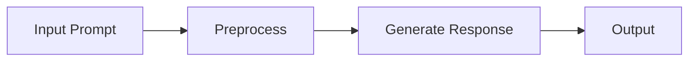

                 


## 让我们一步一步深入思考

### 1. 教育个性化学习的背景与挑战

**问题背景**：传统教育模式中，教学内容和节奏往往是统一规定的，难以满足每个学生的个性化需求。这种模式导致一些学生可能因为进度过快而感到吃力，而另一些学生则可能因为进度过慢而感到无聊。

**问题描述**：如何在一个大规模的教育环境中，根据每个学生的不同需求和进度，提供个性化的学习资源和教学服务，以提升学习效果和兴趣？

**问题解决**：教育个性化学习试图通过分析学生的特点和需求，为他们提供定制化的学习路径和资源。这需要利用先进的技术，如人工智能和机器学习，来收集和分析学生数据，从而实现个性化推荐和学习支持。

**边界与外延**：个性化学习不仅限于课程内容的调整，还包括学习方式的多样化、学习资源的定制等。此外，个性化学习还需考虑教育公平性，确保所有学生都能受益。

**概念结构与核心要素组成**：个性化学习包含以下几个核心要素：
- **学生数据分析**：收集并分析学生的学习行为、成绩、兴趣等信息。
- **个性化推荐**：根据分析结果，为学生推荐适合的学习内容和资源。
- **动态学习路径**：根据学生的进步和需求，动态调整学习计划。
- **学习支持**：提供个性化的辅导和帮助，以解决学生在学习过程中遇到的问题。

### 2. ChatGPT基础概念与工作原理

**问题背景**：随着人工智能技术的发展，ChatGPT作为一种先进的人工智能助手，逐渐在教育个性化学习中得到应用。

**问题描述**：什么是ChatGPT？它是如何工作的？ChatGPT有哪些核心技术？

**问题解决**：ChatGPT（Chat-based Generative Pre-trained Transformer）是一种基于Transformer架构的人工智能语言模型，通过大量文本数据进行预训练，可以生成流畅自然的对话文本。

**边界与外延**：ChatGPT不仅可以用于教育个性化学习，还可以应用于客服、智能助手等多个领域。

**概念结构与核心要素组成**：
- **预训练**：ChatGPT在训练阶段通过大量文本数据进行预训练，学习语言的规律和模式。
- **微调**：在特定任务中，对ChatGPT进行微调，使其更好地适应特定场景。
- **生成文本**：ChatGPT可以根据输入的提示生成连贯、自然的文本。

**核心概念与关系**：

- **预训练与微调**：预训练是ChatGPT的基础，而微调则是根据特定任务进行适应性训练。
- **Transformer架构**：Transformer是一种先进的神经网络架构，用于处理序列数据，如文本。

下面是一个简化的ER实体关系图，用于描述ChatGPT的基本结构：

```mermaid
erDiagram
    Student ||--|{ ChatGPT } : receives personalized responses
    ChatGPT ||--|{ Response } : generates based on prompts
```

### 3. ChatGPT在教育中的应用场景

**问题背景**：ChatGPT在教育中的潜在应用场景广泛，包括课程设计、教学过程和学习支持等。

**问题描述**：ChatGPT在教育中的具体应用场景有哪些？如何实现这些应用？

**问题解决**：
- **课程设计**：ChatGPT可以根据学生的学习特点和需求，设计个性化的课程内容和路径。
- **教学过程**：ChatGPT可以作为教师助手，提供实时、个性化的教学建议和辅导。
- **学习支持**：ChatGPT可以为学生提供即时的问题解答、学习资源和辅导。

**边界与外延**：ChatGPT在教育中的应用不仅限于上述场景，还可以拓展到学习评估、学习习惯培养等领域。

**核心概念与关系**：

- **课程设计与学习路径**：ChatGPT可以根据学生的成绩、兴趣和学习习惯，设计个性化的学习路径。
- **教学建议与辅导**：ChatGPT可以分析学生的学习数据，提供针对性的教学建议和辅导。

**算法原理讲解**：

为了更好地理解ChatGPT在教育中的应用，我们可以用一个简单的算法流程图来展示其工作原理：



在上述流程中：
- **Input Prompt**：输入一个学习问题或请求。
- **Preprocess**：预处理输入文本，使其适合模型处理。
- **Generate Response**：生成响应文本。
- **Output**：输出响应文本。

下面是一个简化的Python代码示例，用于展示ChatGPT生成响应的基本流程：

```python
import openai

def generate_response(prompt):
    response = openai.Completion.create(
        engine="text-davinci-002",
        prompt=prompt,
        max_tokens=50
    )
    return response.choices[0].text.strip()

# 示例
prompt = "请问如何学习Python编程？"
response = generate_response(prompt)
print(response)
```

在这个示例中，我们使用OpenAI的API来生成响应文本。

**数学公式使用**：

在个性化学习中，我们可能会使用一些数学模型来分析学生的学习行为。例如，一个简单的线性回归模型可以用于预测学生的学习成绩：

$$
y = \beta_0 + \beta_1 \cdot x_1 + \epsilon
$$

其中，\( y \) 是学习成绩，\( x_1 \) 是学生的学习时间，\( \beta_0 \) 和 \( \beta_1 \) 是模型参数，\( \epsilon \) 是误差项。

### 4. ChatGPT在教育个性化学习中的优势

**问题背景**：传统教育模式中，教师和学生之间的互动往往受到时间和资源的限制，难以实现真正的个性化学习。

**问题描述**：ChatGPT如何帮助实现教育个性化学习？它有哪些优势？

**问题解决**：

- **实时互动**：ChatGPT可以随时为学生提供个性化回答和辅导，无需受时间和地点的限制。
- **高效资源利用**：ChatGPT可以处理大量的学生请求，提高教师的工作效率，使得更多的学生得到个性化支持。
- **数据驱动的决策**：ChatGPT可以分析学生的学习数据，为教师提供数据驱动的教学建议。

**边界与外延**：ChatGPT的优势不仅限于上述几个方面，它还可以帮助教育机构优化资源分配、提升教学质量等。

**核心概念与关系**：

- **实时互动**：与传统的课堂互动不同，ChatGPT可以实现24/7的实时互动。
- **高效资源利用**：ChatGPT可以处理大量的学生请求，从而减少教师的工作负担。
- **数据驱动的决策**：ChatGPT可以分析学生的学习数据，为教师提供个性化的教学建议。

**对比分析**：

与传统的教育模式相比，ChatGPT在教育个性化学习中的优势主要体现在以下几个方面：

- **互动方式**：ChatGPT可以实现实时、个性化的互动，而传统教育模式中的互动往往受到时间和地点的限制。
- **资源利用**：ChatGPT可以处理大量的学生请求，提高教师的工作效率，从而更好地满足学生的个性化需求。
- **数据分析**：ChatGPT可以分析学生的学习数据，为教师提供数据驱动的教学建议，而传统教育模式中的数据往往难以有效地利用。

### 5. ChatGPT在教育个性化学习中的应用案例

**问题背景**：随着ChatGPT技术的不断发展，越来越多的教育机构开始尝试将其应用于个性化学习。

**问题描述**：ChatGPT在教育个性化学习中的应用案例有哪些？这些案例取得了哪些成果？

**问题解决**：

- **某大学利用ChatGPT进行个性化辅导**：某大学为学生提供了一对一的ChatGPT辅导服务，学生可以随时向ChatGPT提问，获得实时解答。这一服务得到了学生和教师的广泛好评，有效提升了学习效果。
- **某高中利用ChatGPT进行个性化课程设计**：某高中根据学生的学习数据，使用ChatGPT设计个性化的课程计划。这一举措使得学生的学习兴趣和成绩都有所提高。
- **某在线教育平台利用ChatGPT提供个性化学习服务**：某在线教育平台引入ChatGPT，为学生提供个性化的学习资源和建议。这一服务受到了广大用户的欢迎，平台的用户满意度显著提升。

**边界与外延**：这些案例展示了ChatGPT在教育个性化学习中的多种应用方式，同时也表明了其在提升学习效果方面的巨大潜力。

### 6. 实施ChatGPT在教育个性化学习中的挑战与对策

**问题背景**：尽管ChatGPT在教育个性化学习中具有许多优势，但在实施过程中仍面临一些挑战。

**问题描述**：这些挑战是什么？如何应对这些挑战？

**问题解决**：

- **技术挑战**：ChatGPT的实现和部署需要较高的技术门槛。教育机构需要投入大量资源进行技术培训和人才引进。
- **数据隐私**：教育个性化学习需要收集和分析大量学生数据，这可能引发数据隐私问题。教育机构需要建立完善的数据保护机制。
- **用户接受度**：学生对ChatGPT的接受程度可能影响其实际效果。教育机构需要通过宣传和培训，提高学生对ChatGPT的认知和接受度。

**边界与外延**：这些挑战不仅影响ChatGPT在教育个性化学习中的应用效果，还可能对教育机构的数据安全、用户信任等方面产生影响。

**对策与建议**：

- **技术培训与引进**：教育机构可以开展内部技术培训，提高教师和学生的技术能力。同时，可以考虑引进外部技术团队，提供专业的技术支持。
- **数据保护机制**：教育机构应建立严格的数据保护机制，确保学生数据的隐私和安全。
- **用户宣传与培训**：教育机构可以通过宣传和培训，提高学生对ChatGPT的认知和接受度。例如，可以通过线上讲座、实操培训等方式，让学生更好地了解ChatGPT的功能和应用。

### 7. ChatGPT在教育个性化学习的最佳实践与未来展望

**问题背景**：ChatGPT在教育个性化学习中的应用已经取得了一些初步成果，但如何实现最佳实践，以及未来可能的发展方向，仍然需要深入探讨。

**问题描述**：ChatGPT在教育个性化学习中的最佳实践是什么？未来它可能有哪些发展方向？

**问题解决**：

**最佳实践**：

- **个性化推荐系统**：建立完善的个性化推荐系统，根据学生的学习特点和需求，提供个性化的学习资源和课程。
- **实时反馈机制**：建立实时反馈机制，及时分析学生的学习数据，为教师提供个性化的教学建议。
- **用户参与度提升**：通过多种方式提升学生的参与度，如在线互动、学习竞赛等，激发学生的学习兴趣。

**未来展望**：

- **更智能的交互**：随着人工智能技术的不断发展，ChatGPT的交互能力将越来越强，可以提供更智能、更个性化的服务。
- **跨领域应用**：ChatGPT不仅可以在教育领域发挥作用，还可以应用于医疗、金融等多个领域，提供个性化的解决方案。
- **数据驱动的教育改革**：ChatGPT可以收集和分析大量的学生数据，为教育改革提供数据支持，推动教育模式创新。

### 结论

ChatGPT在教育个性化学习中的作用不可忽视。通过本文的深入探讨，我们可以看到ChatGPT在个性化学习中的应用潜力巨大，但也面临一些挑战。只有通过不断的实践和创新，我们才能充分发挥ChatGPT在教育中的作用，为学生的个性化学习提供更好的支持。

作者：AI天才研究院/AI Genius Institute & 禅与计算机程序设计艺术 /Zen And The Art of Computer Programming

